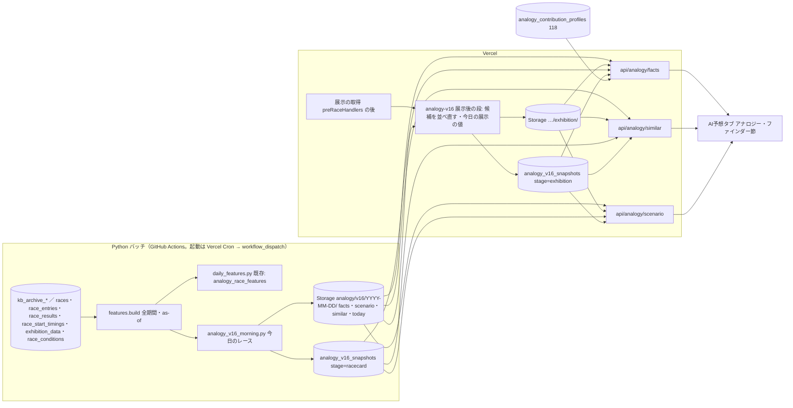
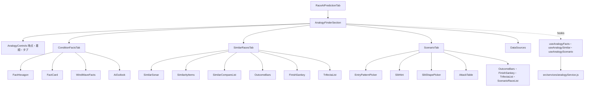

# アナロジー・ファインダー plan（モック Version 16 準拠）

元: [spec.md](./spec.md)・[screens.md](./screens.md)。2026-10-02 までの版（層別 S* を SQL の RPC で数える、ADR-0082。レースごとの寄与度を JS の TreeSHAP で出す、ADR-0083）は `git show fa61e6213:docs/design/analogy-finder/plan.md`。

技術判断の要点（ADR 案は [ADR-0085](../../adr/0085-analogy-v16-daily-batch-to-storage.md)。ADR-0082 を置き換え、ADR-0083 の画面の部分を止める）:
1. 数える処理はすべて Python のバッチで行う。v16 の数えた値は、選手の過去の走から作る as-of の値（直近30走の1着率・平均ST・今節の平均着順点・コース別の平均ST）を条件に使い、`features.py` でしか作れない。SQL・JS に同じ計算を書き直さない
2. バッチは**今日のレースが使う範囲だけ**を数える。範囲（会場×級別の組み合わせなど）の全組み合わせの集計表は作らない（タブ3は範囲×進入×形で数百セル×結果のベクトルになり、全会場・全組み合わせでは数千万セル）
3. 集計と類似レースの候補は Supabase Storage に JSON（gzip）で置き、DB には時点の固定のための小さなメタデータだけを置く
4. 展示後の段は Vercel の JS が、朝に作った候補（似ている順の上位 3,000件）を展示の項目で並べ直す。全母集団の距離計算は Vercel では行わない

## 全体の流れ



## バッチ

### 朝のバッチ `scripts/ml/analogy/v16_morning.py`（新規）
既存の日次の特徴量ジョブ（`.github/workflows/analogy-daily-features.yml`、Vercel Cron JST 6:40・9:40・13:40 → workflow_dispatch、7:20 は拾い直し）に段を足す。`features.build` は1回だけ回し、`daily_features.py` と同じデータで続けて計算する（データの読み込みを2回にしない）。

対象: 今日（JST）の、締切まで10分以上あり、中止でなく、6艇の出走表がそろったレース。9:40・13:40 の回は、出走表の内容のハッシュが変わったレース（欠場・選手の差し替え）と、まだ作っていないレースだけ作り直す。

母集団: 2019-04-01〜前日の完全レース（spec「母集団と期間」）。`pool_cutoff`＝前日。本体の実進入は K ファイル（12:00 同期）で入るので、前日分の進入が無いレースはタブ3の母集団から外れる（件数を `scenario` の `excluded` に書く）。

1レースごとに作るもの:
| 出力 | 中身 | 置き場所 |
|---|---|---|
| today（出走表時点） | 6艇の項目の値と6艇中の順位（同じ値の数）: 今節の平均着順点・当地勝率・全国勝率・平均ST（直近30走）・直近30走の1着率・モーター2連率・ボート2連率。級別の組み合わせ・ラウンド（優勝戦の判定は spec のもの）・グレード。コース別の平均ST（このコース・全体・会場で、走数つき）。手がかりの8条件の当否 | `today/{race_id}.json` |
| similar（出走表時点） | そろえる条件の層の中の、出走表時点の距離の近い順。上位 3,000件（層がそれより少なければ全件）について: race_id・距離²（会場ペナルティ前）・会場一致・展示の段に使う項目の値（展示タイムの差・順位6艇分、天候・風・波）・見比べる全33項目の値・結果（1〜3着・決まり手・3連単と払戻・進入）。層の件数、比べる相手の層の件数と1着の艇の件数、全33項目の「全レースで同じ割合」 | `similar/{race_id}.json.gz`（候補）、`similar-racecard/{race_id}.json.gz`（表示する上位800件。時点の固定用） |

範囲ごとに作るもの（今日のレースが使う範囲キーの和集合。同じキーは1回だけ）:
| 出力 | キー | 中身 |
|---|---|---|
| facts | `VC:{会場}:{組み合わせ}`・`NC:{組み合わせ}`・`NCR:{組み合わせ}:{yusho/junyu}`・`VA:{会場}` | 艇番×項目×6つの順位（1と6は同じ値を含む）×着順（1着・2着以内・3着以内）の件数［当たり, 母数］、艇番×着順の全体、艇番×着順×項目の「来たときの平均の順位」、VA だけ風速区分×艇番×着順 |
| scenario | 上の4つ＋`VG:{会場}`・`NA` | 進入の型（8つ）×形（どの形でも＋7つ）ごとの: 件数、1着の艇・3着以内の艇・決まり手・万舟の件数、3連単の件数（出たものだけ）、30件未満なら1件ずつの行。手がかりの8条件×形の［当てはまる・当てはまらない］の件数（このコース・全体の2通り）。③の攻める艇・1号艇の表（展示タイム順位・モーター順位の区分ごと）と、同じ区分の NC の値 |

- 範囲キーの数: 1日 約150〜180レースで、VC 約150・NC 約60・VA 24・VG 数個・NA 1 の見込み（実装の最初に1日分で実測する）
- 所要時間の目安: `features.build`（今の日次ジョブと同じ）＋ k-NN（今日のレース×層の件数×337次元）＋範囲ごとの集計。締切の早いレース（8:30 前後）に間に合うよう、6:40 の回で 20分以内を目標にし、初回に実測する
- 失敗の扱い: 対象のレースに today・similar がそろわなければ失敗にする（書けた分は書いてから）。Slack に知らせる（既存の日次ジョブと同じ）

### 寄与度用モデルの集計（学習側レーン、週次）
AIの見立て（spec FR-E）のための、`profiles.py` の集計の変更。学習側レーンの担当（2026-10-03 合意の分担）:
- 量の定義を Version 14 にする（レース内で中心化 → 艇番の中で中心化、|値| の平均の構成比。枠は割合から除き、1号艇の格の分は枠に入れる）
- テーマを7つにする（`themes.py` の組み直し。学習し直しは要らない）: 選手の実力／スタート・展示／モーター・ボート／体重・年齢・地元／会場・レース番号／天候・水面／レースの条件
- 項目ごとの向き（「高いほど見込みが上がる」など）を集計に入れる
- 出走表時点のモデル（`win_racecard` と2着以内・3着以内の2本、計3本）でも同じ集計を作る（展示前の AIの見立て）
- 優勝戦の判定の変更（spec）をラウンドの特徴量に入れる（学習し直しが要る。次の週次の学習で反映）

### 夜の確認 `scripts/maintenance/verify-analogy-v16.js`（nightly）
前日の Storage の出力と DB のメタデータを読み、レースの数・欠け・作成時刻（締切前か）を数える。例のレース（2026-09-27 若松12R）について、モックの数字（tab1.json・prep8・mark1・knn78 の値）を同じ定義で再現できるかを、固定の期待値で確かめる（data-accuracy の常設化）。

## 展示後の段（Vercel の JS）

- 起動: 展示の取得（`scripts/lib/scrapeJobs/preRaceHandlers.js` の `runSlotsWithRefresh` の後）で、展示を書いたレースについて実行する。失敗しても展示の取得の成否に影響させない。毎分の展示の取得の起動で「6艇の展示タイムあり・締切前・展示後の段なし」を拾い直す（件数に上限）。切り替えは専用の環境変数
- やること:
  1. 6艇の展示の値（展示タイム、天候・風・波、展示の進入、展示ST）を読む。展示タイムのレース内の差・順位は `src/utils/` の直前情報の関数（#1177 で作った、`features.py` と同じ式・float32 の約束）を使う
  2. `similar/{race_id}.json.gz` を読み、候補ごとに 距離²（展示の段）＝ 出走表の距離² ＋ 展示の項目の距離² ＋ λ_展示 ×（会場が違う）で並べ直し、上位800件を `similar-exhibition/{race_id}.json.gz` に書く。重み・標準化の値・λ は朝のバッチが候補ファイルに入れる
  3. 今日の展示の値（展示タイムの順位、風速区分、展示の進入の型、展示 ST の形。展示 F の ST は負にする）を `today-exhibition/{race_id}.json` に書く
  4. `analogy_v16_snapshots` に stage=exhibition の行を書く（締切前だけ、既にあれば書かない）
- 近似: 並べ直しは出走表時点の上位 3,000件の中だけで行う。層が 3,000件以下なら厳密と同じ。T2-4 で、過去の 1,000レースについて「全件で厳密に計算した展示後の上位800件」と比べた一致率（目標 99%以上）を測る。足りなければ候補の件数を増やす

## データ設計

### Storage（バケット `analogy`、公開読み取り）
`analogy/v16/{YYYY-MM-DD}/` の下に、上の表のファイル。API は CDN 経由で読む。保持: `similar/`（候補、約250KB/レース）は7日で消す。ほか（表示した上位800件・today・facts・scenario）は時点の固定のため残す。容量の見込み: 残すもので1日 約40MB（初回に実測）、年 約15GB。

### DB（マイグレーション。spec Q4 の回答で決める）
新しい表は1つ。番号は実装 PR の時点で origin/master の最新を確認する（120 を作り直すか、新しい番号にする）。

| 表 | 列 | 書き手 |
|---|---|---|
| `analogy_v16_snapshots` | `race_id`（races の外部キー）・`stage`（'racecard' / 'exhibition'）・`computed_at`・`pool_cutoff`（date）・`model_version`（重みに使った版）・`similar_path`・`today_path`・`n_layer`・`status`（'ok' / 'empty_layer'）。主キー `(race_id, stage)` | 朝のバッチ（racecard）、Vercel の JS（exhibition）。service_role。締切前だけ書く。racecard は出走表のハッシュが変わったときだけ上書き、exhibition は既にあれば書かない |

- RLS 有効・匿名は SELECT のみ
- 行数: 1日 約300行、1行 約200B

### 既存の表・マイグレーションの扱い
| 対象 | 状態 | 扱い |
|---|---|---|
| 118 `analogy_models`・`analogy_contribution_profiles` | 本番適用済み | そのまま使う（AIの見立て）。7テーマ・新しい量の定義は行の中身（themes・shares）の変更で、列は変えない |
| 120（層別 S* の母集団・スナップショット・RPC 2本） | 未適用、このブランチだけ | 適用しない。作り直すか消す（spec Q4）。PGlite の検証 `verify-analogy-strata-migration.js` も一緒に消す |
| 127 `analogy_race_features`・128 | master にあり未適用 | 日次の特徴量ジョブがそのまま使う（朝のバッチと同じ workflow）。spec Q2 で「レースごとの寄与度をやめる」なら、127 の表を推論側が読む用途は無くなるが、日次ジョブの成否の監視（128）に使うので残す |
| ADR-0083 の `analogy_race_contributions` | 未作成 | spec Q2 で「やめる」なら作らない |

現行の 120 の ER 図（Q4 の回答まで残す。置き換えたら `generate-er-diagram.js` で作り直す）:

```mermaid
erDiagram
    analogy_contribution_profiles }o--|| analogy_models : "model_version"
    analogy_snapshots }o--|| races : "race_id"
    analogy_models {
        text model_version PK
        timestamptz trained_at
        text[] feature_columns
        jsonb themes
        jsonb metrics
        boolean is_active
        timestamptz created_at
    }
    analogy_contribution_profiles {
        text model_version PK
        smallint finish_target PK
        smallint venue_code PK
        text grade PK
        text round PK
        smallint boat_number PK
        integer n_boats
        integer n_races
        date period_from
        date period_to
        jsonb shares
        jsonb share_sd
        jsonb breakdown
    }
    analogy_pool_outcomes {
        varchar race_id PK
        date race_date
        smallint venue_code
        smallint race_number
        text b1_class
        numeric(4,2) b1_win_gap
        smallint gap_band "生成列 analogy_gap_band(b1_win_gap)"
        smallint top_boat
        text round
        text grade
        smallint b1_motor_band
        smallint rank1
        smallint rank2
        smallint rank3
        text winning_technique
        smallint winner_course
        smallint[] course_by_boat
        numeric(4,2)[] st_by_course
        integer payout_3tan
        text source
        timestamptz updated_at
    }
    analogy_snapshots {
        varchar race_id PK
        text b1_class
        numeric(4,2) b1_win_gap
        smallint gap_band
        smallint venue_code
        smallint top_boat
        smallint auto_depth
        integer[] n_by_depth
        date pool_from
        date pool_cutoff
        jsonb distribution
        timestamptz created_at
    }
```

## 定義（バッチ・JS・画面で同じものを使う）

| 定義 | 正 | 一致の検査 |
|---|---|---|
| 完全レース・返還の除外 | `features.py`（タブ1・2は返還を含める、タブ3は除く） | pytest |
| 優勝戦・準優勝戦の判定 | spec「優勝戦・準優勝戦の判定」。JS `raceStageConfig.js`・Python `features.py` | 固定の文字列で JS と Python を照合（`scripts/ml/analogy/tests/test_features.py`）。最終日12R の照合は pytest |
| 級別の組み合わせ | 6艇の級別を A1・A2・B1・B2 の順に並べた構成（spec Q1 の回答で確定） | pytest |
| 6艇中の順位と同じ値 | 1位・6位は同じ値を含む、2〜5位は min 順位（`tab1_facts.py`） | pytest と JS の `analogyFacts.js` の固定データ |
| 判定の3段階・並び | spec A-7 | `verify-analogy-facts.js`（ci） |
| 進入の型・前付け | [entry-slit/prep7.md](./entry-slit/prep7.md) の maeduke（艇番より内のコースに入った艇） | pytest と `analogyScenario.js` の固定データ |
| スリットの7形 | BOA-635 の spec「スリットの判定」1段目（round(ST×100) の整数で比べる）。展示 F は負 | 同上。BOA-635 と同じ固定データを使う |
| 手がかりの8条件 | [slit-hint/slitpred2_hint.json](./slit-hint/slitpred2_hint.json)（平均STは 1/1000秒に丸める。このコースで5走未満は全体で埋める） | 同上 |
| 攻める艇 | [slit-hint/mark1.md](./slit-hint/mark1.md) | 同上 |
| 今節の平均着順点 | [mock-v16/series-score.md](./mock-v16/series-score.md) | pytest（例のレースの6艇の値） |
| k-NN の距離 | [mock-v16/knn_build.py](./mock-v16/knn_build.py)。重みは表示中の版の `model_win` の SHAP、L は cal で引き直す | 例のレースで knn78.md の14件の並びを再現（pytest） |
| Wilson 区間 | 95%、z=1.96 | JS の固定データ |
| 3連単の払戻 | 本体 `race_results.payout_trio`（列名と券種が逆）、長期は kb | pytest |

## API

いずれも Vercel の Node 関数（Storage の gzip を読む）。Storage・DB の失敗は 502 と `no-store`。

| エンドポイント | 中身 | キャッシュ |
|---|---|---|
| `GET /api/analogy/facts/[raceId]?stage=` | today（stage に応じて展示の値を重ねる）＋使う範囲キー（VC・NC・NCR・VA）の facts ＋ AIの見立て（`analogy_contribution_profiles` の表示中の版、stage に応じて展示ありの版か出走表時点の版、無ければ `available: false`） | 締切前 `s-maxage=60`、締切後 `s-maxage=86400` |
| `GET /api/analogy/similar/[raceId]?stage=` | 表示する上位800件（各件の全33項目・結果・距離の順位）、層の件数、比べる相手、全レースで同じ割合。展示後の段が無いときは racecard の結果と `exhibition_pending: true` / `exhibition_missing: true`（締切後） | 同上 |
| `GET /api/analogy/scenario/[raceId]?scope=` | 範囲キーの scenario 全体（進入×形の全セル。画面が選択に応じて取り出す）＋ today の手がかりの当否・展示の進入/形 | 同上 |

- facts と scenario はファイル全体を返し、選択の切り替え（艇番・着順・進入・形）は画面で行う（取り直しをしない）。1ファイルの大きさを初回に実測し、100KB（gzip 後）を超えるなら分ける
- 例のレースの日付より前のレース（公開前）は snapshot が無い。API は `available: false` を返し、画面は screens「状態」に従う

## フロントエンド

screens.md のコンポーネント。`RaceAiPredictionTab.jsx` の `AnalogyFinderSection` を作り直す（今の FR-1 の部品はフラグで非公開のまま残し、v16 では使わない）。早期 return の分岐でも節を出せるよう、節の描画を分岐の外に出す（BOA-635 も同じ位置を使う）。



- `src/services/analogyService.js` に3つの取得を足す。メモリのキャッシュは `(raceId, stage, scope)` 単位。NULL・エラーは残さない（BOA-497 の教訓）
- 類似レースのスライダーの件数での集計（1着の艇・決まり手・サンキー・3連単・何が似ている？）は画面の純粋関数（`analogyAggregate.js`。旧版の同名の関数を作り直す）
- 文言は `aiPredictionTab.analogy.*`（4言語）

## BOA-635 との接続（作り直し。オーケストレーター経由で BOA-635 のレーンと合意する）
- 旧版の合意（`get_analogy_similar_races`、層別の自動の深さ・最大2,000件）は、120 を置き換えると無くなる
- 案: BOA-635 は `similar-racecard/{race_id}.json.gz`（表示する上位800件。各件に1〜3着・決まり手・進入・コース順の ST・3連単の払戻）を読む。スリットの7形・進入の型の判定は `analogyScenario.js` を共用する
- 2,000件 → 800件に減る。BOA-635 の判定に十分かは BOA-635 のレーンが決める

## 既存サービス層・共通ライブラリとの連携
- Cron の起動は既存の `api/cron/analogy-dispatch.js`（未実装なら、FR-1 の週次の起動と同じものを作る。GitHub のトークン `GITHUB_ACTIONS_DISPATCH_TOKEN` はユーザーが作る）
- Supabase の呼び出しは `scripts/lib/supabaseClient.js`（service key）、Python は `scripts/ml/analogy/db.py`、Storage は `storage.js`
- 中止の判定は `races.cancellation_status`、締切は `races.start_time`（JST）

## 検証
- pytest（`scripts/ml/analogy/tests/`）: 上の定義の表。as-of（前日までの走だけ、今節の平均着順点は同じ日の前の走を含む）
- `verify-analogy-facts.js`（ci、新規）: `analogyFacts.js`・`analogyScenario.js`・`analogyAggregate.js`・`analogyFormat.js` を固定データで（判定・並び・同じ値・今日の一文・形の判定・Wilson・日付）
- `verify-analogy-v16.js`（nightly、新規）: 前日の出力の欠け・作成時刻、例のレースのモックの数字の再現
- 実装後の `data-accuracy-verifier`: 数レースについて、Storage の数字を本番 DB から数え直して照合
- 受け入れ E2E（`e2e/acceptance/analogy-finder.spec.js`）と `npm run test:layout`（AI予想タブの節の3タブ）
- 展示後の並べ直しの近似の一致率（T2-4）

## 設計レビューの指摘と対応
2026-10-01・10-02 の design-reviewer の指摘（k-NN・層別の時のもの）は旧版の plan にある。このうち v16 に残るもの: GitHub Actions の schedule を使わない（Vercel Cron → dispatch）、as-of を日単位でずらす、節を予想の有無の分岐の外に出す、`withCache` の途中状態を残さない、マイグレーションの番号の重複に注意。

## 残る判断
- spec の未確定 Q1〜Q5
- BOA-635 との接続（上）
- Storage の保持期間（年 約15GB の見込み。初回の実測で見直す）
