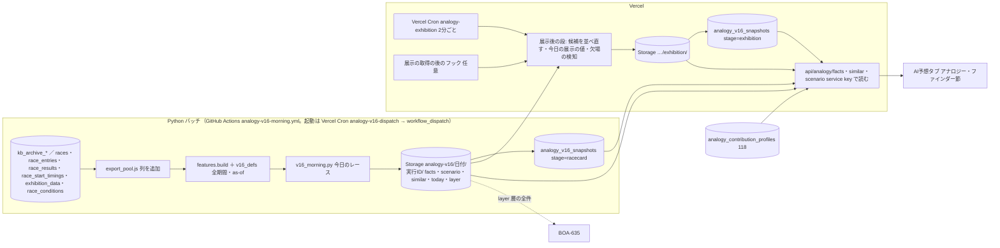
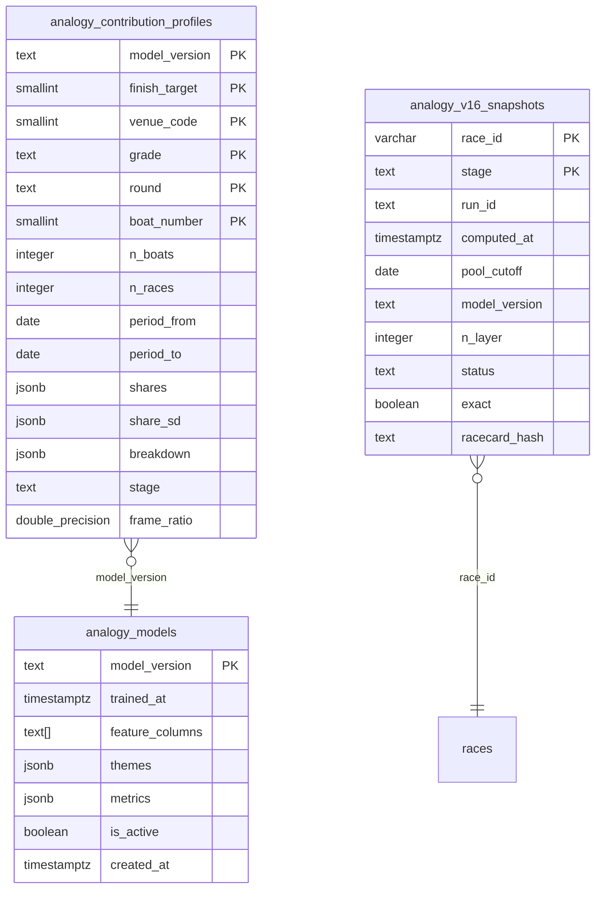
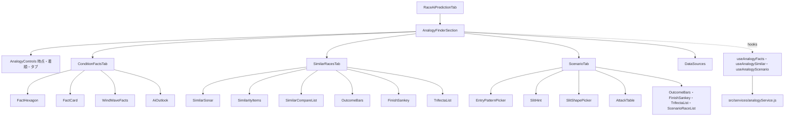

# アナロジー・ファインダー plan（モック Version 16 準拠）

元: [spec.md](./spec.md)・[screens.md](./screens.md)。2026-10-02 までの版（層別 S* を SQL の RPC で数える、ADR-0082。レースごとの寄与度を JS の TreeSHAP で出す、ADR-0083）は `git show fa61e6213:docs/design/analogy-finder/plan.md`。

技術判断の要点（ADR 案は [ADR-0085](../../adr/0085-analogy-v16-daily-batch-to-storage.md)。ADR-0082 を置き換え、ADR-0083 の画面の部分を止める）:
1. 数える処理はすべて Python のバッチで行う。v16 の数えた値は、選手の過去の走から作る as-of の値（直近30走の1着率・平均ST・今節の平均着順点・コース別の平均ST）を条件に使い、`features.py` と同じデータでしか作れない。SQL・JS に同じ計算を書き直さない
2. バッチは**今日のレースが使う範囲だけ**を数える。範囲の全組み合わせの集計表は作らない（タブ3は範囲×進入×形で数百セル×結果のベクトルになり、全会場・全組み合わせでは数千万セル）
3. 出力は Supabase Storage の非公開のバケット `analogy-v16` に JSON（gzip）で置き、実行ごとの版のパスにして上書きしない。DB には時点の固定のための小さなメタデータだけを置く
4. 展示後の段は Vercel の JS が、朝に作った候補（出走表時点の近い順 上位 min(層の件数, 10,000) 件）を展示の項目で並べ直す。全母集団の距離計算は Vercel では行わない
5. 既存の日次の特徴量ジョブ（レースごとの寄与度用。一度も動いていない）には相乗りしない。v16 は専用の workflow と、それを起動する Vercel Cron を新しく作る

## 全体の流れ

## バッチ

### 前提の作業（T1）
- `export_pool.js` に列を足す: 実進入（本体 `race_results.actual_course_1..6`、長期 `kb_archive_boats.course`）、決まり手、3連単の払戻（本体 `race_results.payout_trio`）、展示の進入・展示 ST・`start_flag`、本番 ST と F・出遅れ。長期分の列を足すので `KB_CACHE_VERSION` を上げ、長期分を書き出し直す（`assertCachedHeader` が古いキャッシュを拒む。学習の workflow を1回回す）
- `features.py` に無い値（今節の平均着順点・コース別の平均ST・進入の型・スリットの形・攻める艇・手がかりの条件）は `v16_defs.py` に置く。モックの数字は別のコード（`series_score.py`・slit-hint・prep の SQL）で作ったので、タブ3の母集団（例: 若松・6艇ともA1 1,117件、全国・6艇ともA1 24,871件）を Python で再現する pytest を先に作る

### 朝のバッチ `scripts/ml/analogy/v16_morning.py`（新規）
- workflow `.github/workflows/analogy-v16-morning.yml`（schedule なし、workflow_dispatch のみ）。起動は Vercel Cron からの dispatch: JST 7:10（K ファイルの同期 7:00 の後。前日分の実進入がそろってから）・9:40・13:40。7:40 は「今日の対象レースのうち `analogy_v16_snapshots` の racecard の段が無いレースがあるとき」だけ起動する（拾い直し）。dispatch のトークン `GITHUB_ACTIONS_DISPATCH_TOKEN`（fine-grained PAT）はユーザーが作る（T0-5）
  - dispatch の仕組みは #1207（学習側 T10-7、`scripts/lib/analogyDispatch.js`・`registry.js` の kind monitor・`failureAlertAfter: 1`）を使う。#1207 は学習側が「学習の dispatch＋v16 の朝のバッチの dispatch」に作り直す（日次の特徴量の起動 `analogy-dispatch-features.js` は消す）。v16 の朝のバッチの起動（`api/cron/analogy-dispatch-v16.js`、対象の判定は v16_morning.py の対象の規則と同じ）は、`analogy-v16-morning.yml` ができる T2-5b で FR-2 側が足す。それまでは学習の dispatch だけ
- 締切の早いレース（8:30 前後）に間に合うよう、7:10 の回は 20分以内で終える。`features.build` は 249万行で11秒（2026-10-02 の学習の実測）、書き出しは4分。k-NN と範囲ごとの集計を足した所要時間は初回に実測する
- 対象: 今日（JST）の、締切まで10分以上あり、中止でなく、6艇の出走表がそろい、欠場が分かっていないレース。9:40・13:40 の回は、出走表の内容のハッシュが変わったレース（選手の差し替え）と、まだ作っていないレースだけ作る
- 母集団: 2019-04-01〜前日の完全レース（spec「母集団と期間」）。`pool_cutoff`＝前日。前日分で実進入がまだ無いレースはタブ3の母集団から外し、件数を `scenario` の `excluded` に書く
- 出力のパス: `analogy-v16/{日付}/{実行ID}/…`。実行ごとに新しいパスに書き、既にあるファイルは上書きしない。snapshot が実行IDを指すので、同じ日の後の実行で範囲のファイルが変わっても、表示済みのレースの数字は変わらない
- 書く順: Storage に全ファイルを書き終えてから、DB の snapshot を書く（逆にすると、パスはあるのにファイルが無い snapshot が残る）

1レースごとに作るもの:
| 出力 | 中身 |
|---|---|
| `today/{race_id}.json` | 6艇の項目の値と6艇中の順位（同じ値の数）: 今節の平均着順点（と6艇それぞれの前日までの走数。序盤の注記 spec Q-D に使う）・当地勝率・全国勝率・平均ST（直近30走）・直近30走の1着率・モーター2連率・ボート2連率。級別の組み合わせ・ラウンド・グレード・使う範囲キー。コース別の平均ST（このコース・全体・会場で、走数つき）。手がかりの8条件の当否 |
| `similar/{race_id}.json.gz`（候補） | そろえる条件の層の中の、出走表時点の近い順 上位 K 件（K＝min(層の件数, 10,000)）: race_id・出走表の距離²（会場ペナルティ前）・会場一致・展示の段に使う項目の値（展示タイムの差・順位6艇分、天候・風・波）。展示の距離の重み・標準化の値・λ_展示 |
| `similar-racecard/{race_id}.json.gz` | 表示する上位800件（各件の全33項目の値・結果（1〜3着・決まり手・3連単と払戻・進入・コース順の ST））。層の件数、比べる相手の層の件数と1着の艇の件数、全33項目の「全レースで同じ割合」 |
| `layer/{race_id}.json.gz` | BOA-635 用。層の結果を新しい順に最大2,000件と、行の外の項目（形は下の「BOA-635 との接続」。2026-10-04 合意） |

範囲ごとに作るもの（今日のレースが使う範囲キーの和集合。同じキーは1回だけ）:
| 出力 | キー | 中身 |
|---|---|---|
| `facts/{key}.json.gz` | `VC:{会場}:{組み合わせ}:{艇番}{級別}`・`NC:{組み合わせ}:{艇番}{級別}`・`NCR:{組み合わせ}:{艇番}{級別}:{yusho/junyu}`・`VA:{会場}`（spec Q1。今日の6艇それぞれの「艇番＋級別」の分だけキーができる。タブ3の scenario は1号艇の分だけ） | 艇番×項目×6つの順位（1と6は同じ値を含む）×着順の件数［当たり, 母数］、艇番×着順の全体、艇番×着順×項目の「来たときの平均の順位」、VA だけ風速区分×艇番×着順 |
| `scenario/{key}.json.gz` | 上の4つ＋`VG:{会場}`・`NA` | 進入の型（8つ）×形（どの形でも＋7つ）ごとの: 件数、1着の艇・3着以内の艇・決まり手・万舟の件数、3連単の件数（出たものだけ）、30件未満なら1件ずつの行。手がかりの8条件×形の［当てはまる・当てはまらない］の件数（このコース・全体の2通り）。③の攻める艇・1号艇の表（展示タイム順位・モーター順位の区分ごと）と、同じ区分の NC の値 |

- 範囲キーの数: 1日 約150〜180レースで、数百キーの見込み（初回に実測）。scenario のファイルはモックの scn.js を範囲ごとに gzip して 16〜35KB（design-reviewer の実測）
- 失敗の扱い: 対象のレースに today・similar がそろわなければ失敗にする（書けた分は書いてから）。Slack に知らせる

### 寄与度用モデルの集計（学習側レーン、週次）
AIの見立て（spec FR-E）のための変更。学習側レーンの担当（2026-10-03 合意の分担、2026-10-04 T0-4 で確定）。1〜4 は学習側の新しいセッションで1本の PR＋列追加のマイグレーションにし、学習は1回だけ流す（新しい profiles は学習ジョブの中で作る。SHAP は保存していないので、集計だけの変更でも本番に出すには学習が要る）:
1. 量の定義を Version 14 にする（レース内で中心化 → 艇番の中で中心化、|値| の平均の構成比。枠＝`boat_number` の SHAP は割合から除く。1号艇の行は boat1 を national に足すので、1号艇の格は「選手の実力」に入り、枠の側に残るのは枠と格が混ざる `boat_number` の SHAP の分だけ。画面の1号艇の注記の「約15%」はこの分の構成比で、集計から出す）。テーマを7つにする（`themes.py` のグループの付け替え、`profiles.py` の計算。特徴量・モデルは変えない）
2. 項目ごとの向きを集計に入れる（定義は下の「向きの計算」。設計側が決めて学習側が実装する）
3. 出走表時点のモデルを3本（1着・2着以内・3着以内。今は `win_racecard` の1着だけ）にし、同じ集計（profiles の stage=racecard）を作る（展示前の AIの見立て）
   - 学習の前に、事前登録5 に追記C を書く（追記B の記録2「レースごとのシェア」を「段ごとの profiles の分布」に置き換える。追記B の top2_racecard・top3_racecard の判定はそのまま使う）。レースごとの寄与度をやめた（spec Q2）ので、6本の JSON の書き出しは作らない
   - 一致検査 `treeshap-parity.js` は今の2本（win・win_racecard）のまま残す（展示後の段で `analogyRaceFeatures.js` の特徴量が `features.py` と一致するかを見るため）
4. 118 の `analogy_contribution_profiles` に列 `stage text NOT NULL DEFAULT 'exhibition'`（CHECK 'exhibition'・'racecard'）を足し、主キーを stage を含む形に作り直す。既存の 12,180 行は exhibition になる（版名で分ける案は、`analogy_models` の is_active の切り替えと噛み合わないので採らない）
   - 読み手に stage の条件を足す: `api/analogy/contribution.js`・`src/services/analogyService.js`・`src/utils/analogyContribution.js`・`db.py`
   - 順序: 列の追加（ユーザーが本番に適用）→ `db.py` が stage を書くコードのマージ → 学習
   - 番号は 132（`132_analogy_contribution_profiles_stage.sql`、学習側。下の「DB」）
5. 優勝戦・準優勝戦の判定の変更（spec「優勝戦・準優勝戦の判定」v2、T1-1）をラウンドの特徴量（`round_from_stage`・`round_from_kb_kind`）に入れる。長期も名前を先に見て、`stage_kind` は名前で決まらないときだけ使う。準優進出戦は準優勝戦にしない（Q-C(3)）。一致検査は `t1-1-stage-rule.json` の `consistency_check_strings`（82件）。BOA-728（W準優勝戦、#1229 でマージ済み）とそろえる。同じ学習の回に入れる

#### 向きの計算（spec FR-E の「項目ごとの向き」。2026-10-04 設計側で決定、見せ方の2点は 2026-10-05 に決定: Q-A 揺れの確認を入れる・Q-B 両端で上がる形は「はっきりしない」）
承認版モック（`mock/build-data.mjs` の `dirText`、boat-profile2 の数値から作った）の規則を土台にし、モックで決めていなかった3点（同じ値の扱い・揺れの確認・両端で上がる形）を足す。

- 対象: 艇番（1〜6）×着順（1着・2着以内・3着以内）×段（exhibition・racecard）ごと、テーマの内訳のグループごと。母集団は profiles と同じ（寄与度用モデルの評価期間の全国のレース）
- y（効き方）: そのグループの SHAP（グループ内の特徴量の値を符号つきで足す）を、レースの中で中心化してから艇番の中で中心化した値。割合（Version 14）と同じ量。1号艇は boat1 を national に足した値
- x（項目の値）: グループの代表の特徴量。6艇の中の差がある項目は差を使う（画面の文が「6艇の中で…」のため）

  | グループ | x | 画面の言葉（高い側／低い側） |
  |---|---|---|
  | national・local・recent | `nat_win_diff`・`loc_win_diff`・`recent_win30_diff` | 6艇の中で全国勝率／当地勝率／直近30走の1着率が 高い／低い |
  | exhibitionTime・pastSt | `exh_time_diff`・`st_mean30_diff` | 6艇の中で展示タイム／過去の平均ST が 遅い／速い（早い） |
  | motor・boat | `motor_2_diff`・`boat_2_diff` | 6艇の中でモーター2連率／ボート2連率が 高い／低い |
  | class | `cls_ord` | 級別が 上／下 |
  | boat1（1号艇だけ national に含めるので、2〜6号艇の行） | `b1_nat_win` | 向きを計算しない。固定の文「1号艇が強いかどうかで変わる（どちらに動くかは艇番・着順による）」（日本語の直し 19） |
  | raceNumber・seriesDay | `race_number`・`series_day` | R番号／節の日目が 後半／前半 |
  | wind・wave | `wind_speed`・`wave_height` | 風が 強い／弱い、波が 高い／低い |
  | age・weight | `age`・`weight` | 年齢が 高い／若い、体重が 重い／軽い |
  | branch | `is_local` | 地元／地元以外 |
  | venue・weather・grade・round | `venue_code`・`weather_code`・`grade_code`・`round_code`（カテゴリ） | 下の「カテゴリ」 |
- 区分: x の値で3つに分ける（値の順位で3等分。同じ値は同じ区分に入れ、区分の境目はその値の後ろにずらす）。値の種類が3以下（`is_local`・級別の一部の段など）は値ごとの区分にする（モックは同じ値を `rank(method="first")` で別の区分に分けていたので、地元の0／1が低・中に割れていた。これを直す）。各区分の y の平均を m_低・m_中・m_高 とする（値ごとの区分なら一番小さい値と大きい値を低・高、ほかは中に入れない）
- ρ: x と y のスピアマンの順位相関
- 判定（上から順に最初に当てはまるもの。しきい値は log-odds）
  1. m_中 − max(m_低, m_高) ≥ 0.01 →「中くらい」（例「中堅の年齢で上がりやすい（若いほど・年配ほど、ではない）」）
  2. min(m_低, m_高) − m_中 ≥ 0.01 →「はっきりしない」（両端で上がる形。boat-profile2 の 270組で0件。文を増やさない）
  3. |ρ| < 0.3 または |m_高 − m_低| < 0.01 →「はっきりしない」
  4. それ以外 → ρ の符号で「高い側ほど上がる」／「低い側ほど上がる」（branch は「地元だと上がる」／「地元以外だと上がる」）
- 揺れの確認（Q-A で決定）: profiles の share_sd と同じ日単位のブートストラップ（200回）の各回で同じ判定をし、全体の判定と同じになった回が8割未満なら「はっきりしない」にする。ブートストラップの ρ は、全体で1回付けた順位に日ごとの重みを掛けた重み付き相関で近似してよい（並べ替えを200回しないため）
- カテゴリ（venue・weather・grade・round）: 値ごとの y の平均（件数200未満の値は除く）。上位3つと下位3つの |平均| の最大が 0.01 未満なら「どれでもほとんど変わらない」。それ以外は、上位3つのうち平均 > +0.005 を「上がる」、下位3つのうち平均 < −0.005 を「下がる」に並べる（無ければ「—」）。各値はブートストラップの8割以上で符号が同じものだけ残す。並びはグレードは SG・G1・G2・G3・一般、ラウンドは予選・準優勝戦・優勝戦・一般戦など（日本語の直し 19）
- 展示前（stage=racecard）: 直前情報のグループ（exhibitionTime・wind・wave・weather）はモデルに無いので向きを出さない（割合も無い）
- 画面の文: `none`（判定2・3・揺れの確認で「はっきりしない」になったもの）は「向きははっきりしない」（spec FR-E）。`varies` は boat1 の固定の文
- 保存: `analogy_contribution_profiles.breakdown` に、グループごとに `direction`（`higher`・`lower`・`middle`・`none`・`varies`、カテゴリは `{up: [...], down: [...]}` か `none`）と、判定の根拠（ρ・m_低/中/高・区分の値の範囲・件数・ブートストラップで同じ判定になった割合）を入れる。文は画面が i18n のキーで組み立てる（4言語。`aiPredictionTab.analogy.direction.*`）
- しきい値（0.01・0.3・8割・200件）は定数1か所（`profiles.py`）に置き、変えるときは学習を1回流す
- 実データでの当てはめ（boat-profile2、版 2026-10-02、2025-10-03〜2026-09-26 から2025-12・2026-01 を除いた 44,092R、`~/boatrace-data-archive/boa271-fr2-scratch-2026-10-04/model-prep/boat-profile2.json#direction`）: モックの規則で数値の270組が 高低の向き 203・中くらい 6・はっきりしない 61、両端で上がる形は0。境目に近い向き（|ρ| < 0.4 か |m_高 − m_低| < 0.015）が19組あり、揺れの確認で「はっきりしない」に変わりうる。カテゴリ72組は ほとんど変わらない 38・上がる/下がるあり 34（揺れの確認は未計算。学習の回で数える）

### 夜の確認 `scripts/maintenance/verify-analogy-v16.js`（nightly）
前日の Storage の出力と DB のメタデータを読み、レースの数・欠け・作成時刻（締切前か）・展示後の段の充足率と厳密さ（下）を数える。例のレース（2026-09-27 若松12R）について、出し直した期待値（tasks T1-6）を同じ定義で再現できるかを確かめる。候補ファイル（`similar/`）の7日より古いものを消す。

## 展示後の段（Vercel の JS）

- 起動: 専用の Vercel Cron `api/cron/analogy-exhibition.js`（2分ごと。#1269 で作った名前。モードは off が既定）が「6艇の展示タイムあり・締切前・展示後の段なし」のレースを拾う（件数に上限）。展示の取得の Cron（`createExhibitionCronHandler`、mode が off だと即 skipped）には依存しない。遅れを縮めるため、展示の取得（`preRaceHandlers.js` の `runSlotsWithRefresh` の後）からも呼ぶ（失敗しても取得の成否に影響させない）。二重に動いても snapshot の `ON CONFLICT DO NOTHING` で1回になる
- やること:
  1. 欠場の検知: `race_entries.is_absent` か `exhibition_data` の欠場が1艇でもあれば、snapshot に stage=exhibition・status='absent' を書いて終わる（画面は欠場の1行。spec Q5）
  2. 6艇の展示の値（展示タイム、天候・風・波、展示の進入、展示ST）を読む。展示タイムのレース内の差・順位・天候・風の成分は #1177 の `src/utils/analogyRaceFeatures.js`（`features.py` と同じ式・float32）を使う
  3. 候補ファイルを読み、候補ごとに 距離²＝出走表の距離²＋展示の項目の距離²＋λ_展示×（会場が違う）で並べ直し、上位800件の全33項目と結果を `similar-racecard` と同じ形で書く（全33項目の値は `similar-racecard` に無い候補の分も要るので、候補ファイルに K 件分の項目の値を入れるか、別ファイルにするかは T2-6 のサイズの実測で決める）
  4. 厳密さの判定: 展示の距離²は0以上なので、候補の K 番目の出走表の距離²が、並べ直した800番目の距離²以上なら結果は厳密。snapshot に `exact` を記録する
  5. 今日の展示の値（展示タイムの順位、風速区分、展示の進入の型、展示 ST の形。展示 F の ST は負にする）を書く
  6. Storage に書き終えてから snapshot（stage=exhibition）を書く（締切前だけ、既にあれば書かない）
- 近似の妥当性: design-reviewer の簡易の再現（数値の項目だけの距離、最大の層 58,119件）で、候補 3,000件の一致率は平均 84.5%（最小 31%）、6,000件で 95.7%。層は p50 7,286件・p90 58,119件。候補を10,000件にし、T2-4 で層の大きさ別に本番の距離で一致率を測る（目標 99%以上。足りなければ増やすか、大きい層だけ層の全件にする）

## データ設計

### Storage（非公開のバケット `analogy-v16`）
`analogy` バケット（非公開。学習データ・モデル・長期データのキャッシュが入っている）とは分ける。API は service key で読むので、公開は要らない。保持: `similar/`（候補）は7日で消す。`similar-display/`（候補すべての33項目の表示用の値。展示後の段がその日のうちに1回読み、並べ直した800件に付ける。1万件の層で gzip 後 約0.8MB）は前日より前を消す（夜の確認の --cleanup）。ほかは時点の固定のため残す。容量は初回に実測し、年の見込みを出す（候補を除いて1日 数十MB の見込み）。

### DB（マイグレーション。spec Q4 で 120 を置き換えると決定）
新しい表は1つと、118 の表への列の追加（上の「寄与度用モデルの集計」）。番号は確定済み: **132＝118 への stage 列（`132_analogy_contribution_profiles_stage.sql`、学習側）**、**133＝`analogy_v16_snapshots`（`133_analogy_v16_snapshots.sql`、FR-2 の T3-1、#1267。2026-10-05 本番適用済み）**。設計時の提案（129・130）は他の PR に番号を譲って振り直した。120・127・128 は使い直さない（APPLIED.md に「廃止」の行を残す）。

| 表 | 列 | 書き手 |
|---|---|---|
| `analogy_v16_snapshots` | `race_id`（races の外部キー）・`stage`（'racecard' / 'exhibition'）・`run_id`・`computed_at`・`pool_cutoff`（date）・`model_version`（重みに使った版）・`n_layer`・`status`（'ok' / 'empty_layer' / 'absent'）・`exact`（展示後の並べ直しが厳密か）・`racecard_hash`（racecard の段の出走表のハッシュ。作り直しの判定に使う。設計の表に無かったので T3-1 で足した）。主キー `(race_id, stage)`。CHECK で racecard は exact が null・absent にしない・ハッシュあり、を強制（133 のファイル） | 朝のバッチ（racecard）、Vercel の JS（exhibition）。service_role。締切前だけ書く。racecard は出走表のハッシュが変わったときだけ上書き、exhibition は既にあれば書かない |

- RLS 有効・匿名は SELECT のみ
- 行数: 1日 約300行、1行 約200B

### 既存の表・マイグレーションの扱い
| 対象 | 状態 | 扱い |
|---|---|---|
| 118 `analogy_models`・`analogy_contribution_profiles` | 本番適用済み | そのまま使う（AIの見立て）。7テーマ・新しい量の定義・向きは行の中身（themes・shares・breakdown）の変更。列は `stage` を1つ足す（132、学習側） |
| 120（層別 S* の母集団・スナップショット・RPC 2本） | 未適用、このブランチだけ | 廃止（Q4、T0-2 で BOA-635 と合意）。T0-3 で SQL・PGlite の検証・`verify-registry.json` の行・`check-anon-access.js` の13本・`package.json` のスクリプトを消し、APPLIED.md の 120 の行を「廃止」にした（2026-10-05）。番号 120 は再利用しない |
| 127 `analogy_race_features`・128、日次の特徴量ジョブ | master にあり未適用、ジョブは一度も動いていない | 廃止（Q2。T0-4 で学習側と合意）。学習側レーンが小さい PR で消す（毎朝 data-health のアラートが出ているため先に）: 127・128 の SQL（APPLIED.md に「廃止（Q2、適用しない）」の行）、`daily_features.py` と test の該当部分、`.github/workflows/analogy-daily-features.yml`、data-health の `analogy_race_features` の監視（`checks.js`・`functions.js`・`verify-data-health-job.js`）。残すもの: `export_pool.js --daily` と `week-ranges.js`（v16 の朝のバッチで使う）、`storage.js` の download-active-meta。workflow の削除を含むのでマージはユーザーの承認 |
| ADR-0083 の `analogy_race_contributions` | 未作成 | 作らない（Q2） |

ER 図（118・132・133 から `generate-er-diagram.js analogy-finder` で作った）:

## 定義（バッチ・JS・画面で同じものを使う）

| 定義 | 正 | 一致の検査 |
|---|---|---|
| 完全レース・返還の除外 | `features.py`（タブ1・2は返還を含める、タブ3は除く） | pytest |
| 優勝戦・準優勝戦の判定 | spec「優勝戦・準優勝戦の判定」（v2）。JS `raceStageConfig.js`・Python `features.py`（`v16_defs.py` は `features.py` を使う） | `analysis/t1/t1-1-stage-rule.json` の `consistency_check_strings` 82件で JS と Python を照合（JS は `verify-analogy-facts.js`、Python は `scripts/ml/analogy/tests/test_features.py`）。最終日12R の照合は pytest |
| 級別の組み合わせ | 6艇の級別を A1・A2・B1・B2 の順に並べた構成＋選んだ艇の級別（spec Q1）。VC が300件未満なら既定を NC に | pytest |
| 6艇中の順位と同じ値 | 1位・6位は同じ値を含む、2〜5位は min 順位（`tab1_facts.py`） | pytest と JS の `analogyFacts.js` の固定データ |
| 判定の3段階・並び | spec A-7 | `verify-analogy-facts.js`（ci） |
| 進入の型・前付け | [entry-slit/prep7.md](./entry-slit/prep7.md) の maeduke（艇番より内のコースに入った艇） | pytest と `analogyScenario.js` の固定データ |
| スリットの7形 | BOA-635 の spec「スリットの判定」1段目（round(ST×100) の整数で比べる）。展示 F は負 | 同上。BOA-635 と同じ固定データを使う |
| F の ST の符号 | 本番の ST は −abs(ST)（長期 `kb_boats.start_timing` の F は負、本体 `race_start_timings.start_timing` の F は正で入っている。2026-10-04 の T1 事前登録のレビューで確認、kb の F 8,726件は全件負・本体の F 1,077件は全件正）。展示 ST の F も負にする（spec「実装で直すこと」2） | pytest（出どころ別の符号の検査） |
| 手がかりの8条件 | [slit-hint/slitpred2_hint.json](./slit-hint/slitpred2_hint.json)（平均STは 1/1000秒に丸める。このコースで5走未満は全体で埋める） | 同上 |
| 攻める艇 | [slit-hint/mark1.md](./slit-hint/mark1.md) | 同上 |
| 今節の平均着順点（前日まで） | [mock-v16/series-score.md](./mock-v16/series-score.md) の定義で、同じ日の前の走を含めない（spec Q6） | pytest（例のレースの6艇の値） |
| k-NN の距離 | [mock-v16/knn_build.py](./mock-v16/knn_build.py)。重みは表示中の版の `model_win` の SHAP、L は cal で引き直す | 例のレースで knn78.md の14件の並びを再現（pytest） |
| Wilson 区間 | 95%、z=1.96 | JS の固定データ |
| 3連単の払戻 | 本体 `race_results.payout_trio`（列名と券種が逆）、長期は kb | pytest |

## API

いずれも Vercel の Edge 関数（#1269。fetch と DecompressionStream だけで service key で Storage の gzip を読む）。snapshot の `run_id` のパスから読む。入力の誤りは 400、Storage・DB の失敗は 502（どちらも `no-store`）。応答の形の正は各 `api/analogy/*/[raceId].js` の先頭のコメント

| エンドポイント | 中身 | キャッシュ |
|---|---|---|
| `GET /api/analogy/facts/[raceId]?stage=` | `status`（下）、today（6艇の値と順位・範囲キー・前日までの走数）、使う範囲キー（VC・NC・NCR・VA）の facts、stage=exhibition なら exhibition（展示タイム・順位・風速区分）。AIの見立ては facts に入れず、画面が既存の `/api/analogy/contribution`（stage 付き、#1259）を読む（#1269 で決めた） | 締切前 `s-maxage=60`、締切後 `s-maxage=86400` |
| `GET /api/analogy/similar/[raceId]?stage=` | `status`、表示する上位800件（各件の全33項目・結果）、層の件数、比べる相手、全レースで同じ割合 | 同上 |
| `GET /api/analogy/scenario/[raceId]?scope=&stage=` | `status`、範囲キーの scenario 全体（進入×形の全セル。画面が選択に応じて取り出す）、today の手がかりの当否、stage=exhibition なら展示の進入・形 | 同上 |
| `GET /api/analogy/layer/[raceId]` | BOA-635 用。layer ファイルの中身と `status`（下の「BOA-635 との接続」） | 同上 |

4本とも、snapshot から run_id を引いて Storage の gzip を読む処理と status の判定は `api/_lib/analogyV16.js` に1つにする。

`status`（screens「状態」と対応。画面は時刻で判定しない）:
| status | 条件 |
|---|---|
| `absent` | exhibition の snapshot が status='absent' |
| `not_saved` | racecard の snapshot が無い |
| `empty_layer` | racecard の snapshot が status='empty_layer'（タブ2だけ。共通の `resolveStatus` では判定せず、similar・layer の API が返す） |
| `exhibition_ready` | exhibition の snapshot がある（「展示後」を押せる） |
| `exhibition_missing` | 締切を過ぎて exhibition の snapshot が無い（判定の順は `resolveStatus` のとおり、締切後を先に見る） |
| `exhibition_reflecting` | 6艇の展示タイムがあり、締切前で、exhibition の snapshot が無い |
| `before_exhibition` | それ以外 |

- 艇番・着順・進入・形の切り替えは画面で行う（取り直さない）。stage を変えたときだけ取り直す
- NCR が優勝戦のときは facts から今節の平均着順点を外す（spec A-4）。今日が優勝戦・準優勝戦のときの「今日の一文」を出さない処理（Q7）と、序盤の注記を出すかの判定（today の前日までの走数、Q-D）は画面で行う

## フロントエンド

screens.md のコンポーネント。`RaceAiPredictionTab.jsx` の `AnalogyFinderSection` を作り直す（今の FR-1 の部品はフラグで非公開のまま残し、v16 では使わない）。節の描画位置（早期 return の分岐の外）は #1122 で master に入っている（下の「BOA-635 との接続」）ので、位置は変えない。

- `src/services/analogyService.js` に3つの取得を足す。メモリのキャッシュは `(raceId, stage, scope)` 単位。NULL・エラーは残さない（BOA-497 の教訓）
- 類似レースのスライダーの件数での集計（1着の艇・決まり手・サンキー・3連単・何が似ている？）は画面の純粋関数（`analogyAggregate.js`。旧版の同名の関数を作り直す）
- 文言は `aiPredictionTab.analogy.*`（4言語）

## BOA-635 との接続（2026-10-04 合意。T0-2）
BOA-635 のレーンが、v16 の層（新しい順に最大2,000件）を分母にすることに合意した（`.git/orchestrator/handoff/boa271-t02-boa635-reply.md`）。会場を含まない点は支障なし（BOA-635 に会場ごとの表示は無い。会場を混ぜた影響は BOA-635 の T0-1 の Brier skill で測り、上積みが無い型はユーザーに戻す）。旧版の合意（120 の `analogy_pool_outcomes`・`get_analogy_similar_races`）は無くなった。似ている順の上位800件は渡さない（発生率の分母がスライダーで変わってはいけない）。

### layer ファイル `analogy-v16/{日付}/{実行ID}/layer/{race_id}.json.gz`
朝のバッチ（racecard の段）が、snapshot の status が 'ok' のレースについて作る。展示後の段では作り直さない（層の条件は出走表時点の値。BOA-635 は展示後も racecard の段の layer を使う）。

| キー | 中身 |
|---|---|
| `run_id` | 朝のバッチの実行ID（`analogy_v16_snapshots.run_id` と同じ文字列） |
| `race_id` | 今日のレース |
| `conditions` | 層の条件: `b1_class`（'A1'〜'B2'）・`gap_band`（0〜4。spec B-1 の5段階。差＝round(1号艇の全国勝率 − 2〜6号艇の最大, 2)、境界 −1.91／−1.14／−0.49／+0.19 でちょうどは上の帯、大きいほど1号艇が上。勝率が無ければ 5。`mock-v16/knn_build.py` の `gap_band_arr` と同じ）・`top_boat`（1〜6）・`round`（'yusho'・'junyu'、そろえないときは null）・`grade_g1plus`（true／false。G1以上でそろえたか） |
| `n_total` | 層の件数（BOA-635 の母集団で数えた件数。下の「行の母集団」） |
| `n_returned` | `rows` の件数（最大2,000。2,000ちょうどなら切り詰めたとみなす） |
| `pool_from`・`pool_cutoff` | 母集団の期間（'YYYY-MM-DD'。`pool_cutoff` は前日） |
| `rows` | 行の配列。並びは `race_date` の新しい順、同じ日は `race_id` の文字列の降順（Python の検証で同じ行を選べるように） |

`rows` の各行: `race_id`・`race_date`・`rank1`・`rank2`・`rank3`・`winning_technique`（6分類。ほかと不明は null）・`course_by_boat`（[1号艇のコース, …, 6号艇]）・`st_by_course`（[1コースの ST, …, 6コース]）・`payout_3tan`。`race_id` は BOA-635 の要件（8列）に足した（T0-3 の本番照合で返還艇・払戻を独立の正解と突き合わせるのに要る）。

行の母集団と値の約束（BOA-635 の D-1〜D-5。v16 の `export_pool.js` の新しい列で守り、T1-0a・T1-0b の pytest で固定する）:
- D-1 `payout_3tan` は3連単の払戻（本体は `race_results.payout_trio`、長期は kb の3連単）
- D-2 F・出遅れ・欠場のコースの `st_by_course` は null（本体 `race_start_timings.is_flying`・`is_late_start`、長期 `kb_archive_boats` の同名の列）
- D-3 不成立・特払いのレースの払戻は null
- D-4 実進入が分からない艇の `course_by_boat` は null（艇番で埋めない）
- D-5 1〜3着に返還艇（`is_flying`・`is_late_start`、`finish_mark` が F・L・欠、`race_results.refund_boats` のどれか。事故の転・落・妨は返還ではない）が入るレースと、不成立のレースは行に入れない
- このため `n_total` は FR-2 の説明文の {n}（層の件数。タブ2は返還レースを含める）より少し小さいことがある（1〜3着に返還艇が入るのは 2026-03〜09 の 32,858R 中16R）。画面の中で2つの数字は並ばない。BOA-635 は自分の注記に `n_total` を使い、FR-2 の {n} を使わない

大きさ: 2,000件で gzip 後 100KB を超えたら1,000件に下げる（T2-6 で初回に実測。下げたら BOA-635 に知らせる）。

### 読み出しの API（FR-2 側が決定）
**`GET /api/analogy/layer/[raceId]` を別に作る。作るのは FR-2 側（T5-1 で facts・similar・scenario と一緒に）**。BOA-635 は `analogyService.js` に `getAnalogyLayer(raceId)` と `useAnalogyLayer` を足すだけにする（BOA-635 の T1-4 は不要になる）。

| 理由 | |
|---|---|
| FR-2 の API に相乗りしない | similar は上位800件×33項目と結果で重く、BOA-635 は結果タブ（`RaceResult`）でも layer だけを読む。stage を取らない（racecard 固定）のでキャッシュのキーも違う |
| FR-2 側で作る | snapshot から run_id を引き Storage の gzip を service key で読む処理・status の判定・キャッシュの規則は facts・similar・scenario と同じ。共通の読み出し（`api/_lib/analogyV16.js`）を1つにし、2つのレーンで別々に書かない。layer ファイルの形の持ち主も FR-2 |

- 応答: layer ファイルの中身をそのまま（キーは snake_case のまま）＋`status`
- `status`: `ok`／`not_saved`（racecard の snapshot が無い）／`empty_layer`（racecard の snapshot が status='empty_layer'）／`absent`（exhibition の snapshot が status='absent'。欠場が分かったら、racecard の layer があっても absent を返す）。`ok` 以外は `rows` を返さない。BOA-635 は `ok` かつ `rows` が1行以上のときだけ部品を出す
- キャッシュ: FR-2 の API と同じ（締切前 `s-maxage=60`、締切後 `s-maxage=86400`、`not_saved`・エラーは `no-store`）。BOA-635 の plan の「締切前 300」はこちらに合わせてもらう（締切前に racecard の段が作り直されると run_id が変わるため、短いほうにそろえる）
- Storage・DB の失敗は 502 と `no-store`（BOA-635 は `InlineFetchError`）

### 層の説明文の共用の関数（FR-2 側が決定。旧 `analogyReason.js` の代わり）
- 置き場所と名前: **`src/utils/analogyLayer.js` の `describeAnalogyLayer(conditions, t, { count } = {})`**（純粋関数。T6-2 で作り、`verify-analogy-facts.js` の固定データに入れる）
- 入力: layer ファイル・similar の応答と同じ形の `conditions`（上の表）と i18n の `t`。`count` を渡すと件数まで含める
- 出力（日本語の例）: `count` ありで「今日と同じ『G1以上の優勝戦』で、1号艇の級別・1号艇と勝率トップの差・勝率トップの艇番がそろう過去レース7,286件」、ラウンド・グレードでそろえない日は「今日と同じく、1号艇の級別・1号艇と勝率トップの差・勝率トップの艇番がそろう過去レース7,286件」（spec B-3 の前半）。`count` なしは「…がそろう過去レース」まで
- FR-2 は後ろに「を、出走表が似ている順に並べた。展示後は…」（B-3 の後半）を自分で足す。BOA-635 は注記の {似ている理由} に `count` なしで使い、件数は自分の `n_total`・`n_returned` で出す
- 文言のキー: `aiPredictionTab.analogy.layer.*`（4言語）。BOA-635 は同じキーを使い、別の文を作らない

### 画面の位置と #1122 の扱い
- 節の描画位置（早期 return の分岐の外）は **#1122（77f7c9231、master 済み）で既に入っている**。`RaceAiPredictionTab` が既存の表示を `PredictionBlocks` に分け、`AnalogyFinderSection` をその外（後ろ）に置いている。中止のレース（`isCancelled`）だけはタブ全体を出さないので、節も BOA-635 の部品も出ない。BOA-635 の着手条件「描画位置が master に入っていること」は満たしている
- BOA-635 の `PastRateChecker` は、同じ外側の Fragment の先頭（`PredictionBlocks` の前）に置く。`AnalogyFinderSection` とは独立に描く（v16 の機能フラグ `isAnalogyFinderEnabled()` の内側に入れない。BOA-635 の公開の判断は BOA-635 側）
- #1122 の FR-1 の部品（`ContributionView`・`ContributionRadar`・`ContributionBreakdown`・`BoatCompareTable`・`useAnalogyContribution`）は機能フラグで隠したまま。v16 の T7-1 で `AnalogyFinderSection` の中身を作り直し、FR-1 の部品は使わなくなる（消すのは v16 の公開後。`/api/analogy/contribution` は AIの見立て T5-2 で stage の条件を足して使い続ける）。機能フラグ（`ANALOGY_FINDER_PUBLIC`・`?analogy=1`）は v16 の公開までそのまま使う
- 外側の Fragment の形（`PredictionBlocks` と節を並べる）を変えるときは BOA-635 に知らせる（#1122 のコメントにも書いてある）

### 共用する判定
- スリットの7形・進入の型の判定は `analogyScenario.js`（JS）と `v16_defs.py`（Python）を BOA-635 と共用する。BOA-635 の T0-1 は `v16_defs.py`・`export_pool.js` の列の追加（T1-0a）の後に、v16 の層の選び方を Python で再現して進める

## 既存サービス層・共通ライブラリとの連携
- Vercel Cron は `vercel.json` の crons と `createScrapeCronHandler` 系の共通ラッパ（job の登録・`scrape_job_state` のモード・最終成功の監視）。dispatch は #1207 の `scripts/lib/analogyDispatch.js`（学習側が作り直す）に v16 の朝のバッチの起動を足す（エンドポイントは学習と別のファイル。Vercel の cron の path にクエリを付ける例が公式に無いため、#1207 の判断を引き継ぐ）
- Supabase の呼び出しは `scripts/lib/supabaseClient.js`（service key）、Python は `scripts/ml/analogy/db.py`、Storage は `storage.js` にバケット名の引数を足して使う
- 中止の判定は `races.cancellation_status`、締切は `races.start_time`（JST）、欠場は `race_entries.is_absent`

## 検証
- pytest（`scripts/ml/analogy/tests/`）: 上の定義の表。as-of（前日までの走だけ。今節の平均着順点も同じ日の前の走を含めない、spec Q6）。layer ファイルの並び・D-1〜D-5
- `verify-analogy-facts.js`（ci、新規）: `analogyFacts.js`・`analogyScenario.js`・`analogyAggregate.js`・`analogyFormat.js` を固定データで（判定・並び・同じ値・今日の一文・形の判定・Wilson・日付）
- `verify-analogy-v16.js`（nightly、新規）: 前日の出力の欠け・作成時刻、例のレースのモックの数字の再現
- 実装後の `data-accuracy-verifier`: 数レースについて、Storage の数字を本番 DB から数え直して照合
- 受け入れ E2E（`e2e/acceptance/analogy-finder.spec.js`）と `npm run test:layout`（AI予想タブの節の3タブ）
- 展示後の並べ直しの近似の一致率（T2-4）

## 設計レビューの指摘と対応
2026-10-04 の design-reviewer（v16 の書き直し）の指摘と対応は [design-review-v16.md](./design-review-v16.md)。2026-10-01・10-02 の指摘（k-NN・層別の時のもの）は旧版の plan にある。

## 残る判断
- spec の Q1〜Q7 は決定済み（2026-10-04）
- BOA-635 との接続は合意済み（2026-10-04）。layer ファイルのキー名・API の経路・説明文の関数は上のとおり FR-2 側で決めた
- 向きの見せ方の2点は決定済み（2026-10-05、spec Q-A・Q-B）。T1 の見せ方（優勝戦の判定の例外・序盤の注記・1号艇の注記）も決定済み（spec Q-C〜Q-E）
- Storage の保持期間（初回の実測で見直す）
- 展示後の候補の件数（T2-4 の一致率で決める）
