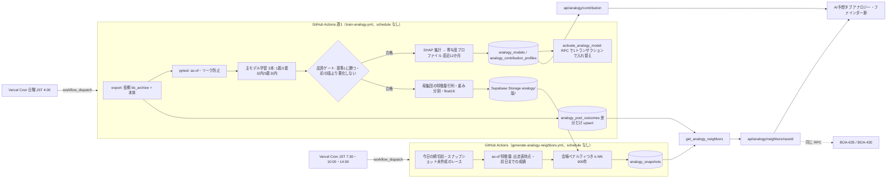
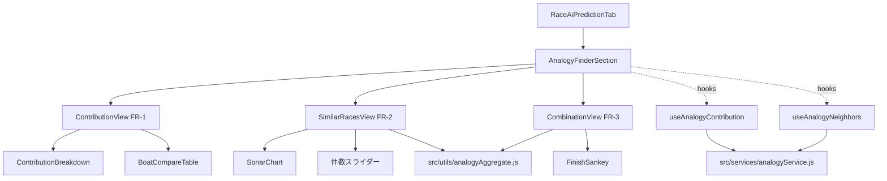

# アナロジー・ファインダー plan

元: [spec.md](./spec.md)・[screens.md](./screens.md)。技術判断は [ADR-0080](../../adr/0080-analogy-neighbors-precomputed-in-batch.md)（近傍は出走表時点で1日数回バッチ計算し、pgvector は使わない）。

設計レビュー（design-reviewer、2026-10-01）の指摘15件を反映済み。対応は末尾の「設計レビューの指摘と対応」。

FR-2 の絞り込みは「近い順に100／200／400／800件」の前提で書く（ユーザー確認中）。「類似度○%」を残すことになっても、保存するもの（近傍の一覧と距離）は変わらず、変わるのは画面だけ。

## 全体の流れ



## データ設計

マイグレーション案: [115_analogy_finder_tables.sql](../../db-migration/115_analogy_finder_tables.sql)（本番未適用。適用はユーザーが行う。PGlite で作成・RPC の動作・CHECK 制約を確認済み）。番号は、master の最大 113 と、作業中の PR #1035 が使う 114 の後の 115（112 は master で欠番）

```mermaid
erDiagram
    analogy_contribution_profiles }o--|| analogy_models : "model_version"
    analogy_snapshots }o--|| races : "race_id"
    analogy_snapshots }o--|| analogy_models : "model_version"
    analogy_models {
        text model_version PK
        timestamptz trained_at
        date pool_cutoff
        text[] feature_columns
        jsonb themes
        smallint neighbor_k
        real venue_penalty
        jsonb metrics
        boolean is_active
        timestamptz created_at
    }
    analogy_contribution_profiles {
        text model_version PK
        smallint finish_target PK
        smallint venue_code PK
        text grade PK
        text round PK
        smallint boat_number PK
        integer n_boats
        integer n_races
        date period_from
        date period_to
        jsonb shares
        jsonb share_sd
        jsonb breakdown
    }
    analogy_pool_outcomes {
        varchar race_id PK
        date race_date
        smallint venue_code
        smallint race_number
        text grade
        text round
        smallint rank1
        smallint rank2
        smallint rank3
        text winning_technique
        smallint winner_course
        smallint[] course_by_boat
        numeric(4,2)[] st_by_course
        integer payout_3tan
        timestamptz updated_at
    }
    analogy_snapshots {
        bigint_GENERATED_ALWAYS_AS_IDENTITY snapshot_id PK
        varchar race_id
        text model_version
        text asof_stage
        timestamptz asof_at
        timestamptz computed_at
        jsonb features
        varchar[] neighbor_ids
        real[] neighbor_distances
    }
```

| テーブル | 役割 | 行数・サイズの見積り | 書き込み |
|---|---|---|---|
| analogy_models | 版ごとに1行。`themes` にテーマの一覧（key・名前・説明・含む特徴量）。テーマ数は可変（「市場」を後から足せる） | 週1行。行は消さない | 週1回 insert、最後に `activate_analogy_model` で切り替える（旧版 false → 新版 true を1トランザクション） |
| analogy_contribution_profiles | 着順3 × 会場25（0=全会場）× グレード6 × ラウンド5 × 艇番7（0=全艇）。n が0のセルは書かない | 1版あたり最大15,750行（実測: 着順ごとに3,962セル、計11,886行、1行約1.8KB）。表示中の版と切り替え直前の版の行だけ残す | 週1回、新しい版の行を insert（既存行の UPDATE はしない） |
| analogy_pool_outcomes | 近傍の母集団の決着。長期（kb）と本体を同じ形にそろえる。長期と本体で日付が重なる 2025-12-02 は本体を優先 | 約41万行 × 約120B ≒ 50MB。週に約1,100行増える | 初回だけ全件。以後は新しいレースと値が変わった行だけ upsert（全行 UPDATE しない）。母集団の行列と同じレースの集合であることを verify で検査する |
| analogy_snapshots | BOA-627 の1・2。as-of 特徴量（`features`）と近傍800件（`neighbor_ids`・`neighbor_distances`） | 1行 約16KB。1日 約150行 ≒ 2.4MB/日、1年で約0.9GB | レースごとに1回 insert（`ON CONFLICT DO NOTHING`）。締切後は書かない。1年を過ぎた行は近傍の配列を NULL にし、画面にも出さない（再計算はしない） |

Disk IO の見積り:
- 書き込み: 週次は約16MB（寄与度）＋差分の決着。近傍のジョブは1日3回、合計約150行 × 16KB。初回の analogy_pool_outcomes の全件投入（約50MB）だけは、適用前後でダッシュボードの Disk IO を確認する
- 読み取り: 長期（kb_archive、約235万艇行）は変わらないので、初回に書き出したものを Storage（`analogy/source/`）に置き、週次は前回以降の本体の行だけを読む。近傍のジョブは、今日の出走表（約900艇）と、その選手の直近30走（約2.7万行、PostgREST で約30ページ）を1日3回読む

### as-of（近傍は1段）
- 近傍の距離は **出走表時点（前日までの成績）** の項目だけで作る: 級別・勝率・2連率・当地・モーター/ボート・体重・支部・年齢・過去 ST・直近成績・グレード・ステージ・節日目・会場（艇番は次元にしない）
- ローリング特徴量（直近成績・過去 ST）は **日単位でずらす**（その日のレースの結果は、同じ日の後のレースの特徴量に入れない）。学習・母集団・今日のレースで同じ定義にし、pytest で固定する。Phase M の分析スクリプトはレース単位でずらしていた（同じ日に前の走がある艇は2025年で38%）。本番化で定義を変えるので、T0 で精度が落ちないことを確かめる
- 展示・気象（直前情報）は、寄与度（FR-1）のモデルには入れる（ST・直前情報テーマ）が、近傍の距離には入れない（ADR-0080）
- `asof_stage` は常に `racecard`。`asof_at` は使った出走表データの取得時刻の最大。画面の「出走表 7:30 時点のデータ（前日までの成績）」はこの値

### get_analogy_neighbors
- 引数 `p_race_id`、`p_stage`（省略時は直前情報時点があればそれ、無ければ出走表時点。今は出走表時点しか作らない）
- 返す列: 近さの順位・距離・母集団側のレースの日付・会場・R、1〜3着、決まり手、1着の進入コース、艇ごとの進入、コース順の ST、3連単の払戻、モデル版、段、`asof_at`
- **値の約束（BOA-635 のレーンの依頼 R1〜R4、2026-10-02）**:
  - `payout_3tan` は3連単の払戻。列名は kb_archive と同じにした。本体の `race_results` は列名と券種が逆（`payout_trio`＝3連単、`payout_trifecta`＝3連複）なので、母集団を作るときは `payout_trio` を入れる。取り違えると配当の帯がすべてずれる
  - `st_by_course`: フライング・出遅れ・欠場のコースは NULL（数値のままだと F の艇が「速い ST」に見える）。本体は `race_start_timings.is_flying`・`is_late_start`、長期は `kb_archive_boats.is_flying`・`is_late_start`
  - `payout_3tan`: 不成立・特払いのレース（`race_results.race_status`）は NULL（不成立の ¥100 を入れない）
  - `course_by_boat`: 実進入が分からない艇は NULL（艇番で埋めない。BOA-523 の欠落期間で枠なりに化けるため）
  - 母集団に入れないレース（BOA-635 のレーンの依頼 D-5）: 不成立、および1〜3着に返還艇（F・L・欠）が入るレース。本体の `race_results.rank1〜6` は返還艇も公式の並びのまま入っている（例 2026-03-02-24-09 は F の1号艇が rank3）。`race_status` は 2026-09-20 より前でほぼ NULL なので、`race_start_timings.is_flying`・`is_late_start`・`finish_mark` でも判定する。2026-03〜09 の 32,858R 中16R。特徴量行列からも外し、決着と集合を一致させる
  - スナップショットは版をまたいで1レース1つ（D-6）。一意性は `(race_id, asof_stage)`。週次の学習が朝の計算より後に終わった日でも、同じ日のうちに近傍が入れ替わらない
  - pytest（T2-3）でこの約束を固定する
- BOA-635 はコース順の ST（スリット7形）・進入・払戻（配当の帯）を、BOA-430 は決まり手・出目を、この同じ RPC から読む
- SECURITY INVOKER・STABLE・`statement_timeout 5s`。113 で関数の既定権限を剥奪したので、anon・authenticated に EXECUTE を明示的に付ける

## スクリプト構成と実行タイミング

ADR-0066 の方針どおり、モデルの学習・推論は GitHub Actions に置く（`train-*`・`generate-*` は Vercel に移さない）。Phase M の分析スクリプト（`scripts/analysis/analogy-finder-phase-m/`・`analogy-finder-md6/`）から、本番に要る部分だけを `scripts/ml/analogy/` に移す。分析スクリプトは記録として残し、本番からは import しない。

| ファイル | 役割 |
|---|---|
| `scripts/ml/analogy/export_pool.js` | 長期（kb_archive）と本体のテーブルから、学習・母集団のデータを書き出す（Phase M の `export-data.js` を土台に。読み取りのみ） |
| `scripts/ml/analogy/features.py` | as-of の2段の特徴量（ローリングは `shift(1)`）。学習・母集団・今日のレースで同じ関数を使う |
| `scripts/ml/analogy/train.py` | 主モデル3本（1着・2着以内・3着以内）。木の数は固定。品質ゲート（下）を通らなければ書き込まずに失敗させる |
| `scripts/ml/analogy/profiles.py` | SHAP をテーマに集計し、寄与度プロファイルを作る。集計は**学習に使っていない直近12か月**（train.py の test 期間。データの穴は補完済みなので外さない）。グレード不明のレースは「全グレード」にだけ入れる。seed を変えた5回の SD も出す（PR #1121 で実装済み） |
| `scripts/ml/analogy/pool.py` | 母集団の特徴量行列（会場の one-hot は持たず、会場はコードで持ってペナルティで扱う。float16）と距離の重み・会場ペナルティ λ（決まり手で選んだ1つの値）を作り、50MB 以下に分割して Storage に上げる。Storage の版は直近3つと表示中の版を残す |
| `scripts/ml/analogy/neighbors.py` | 今日のレースの as-of 特徴量を作り、k-NN 800件を計算して `analogy_snapshots` に書く（`ON CONFLICT DO NOTHING`） |
| `scripts/ml/analogy/tests/` | pytest。as-of の段・リーク防止（当日の結果が混ざらない）・テーマ集計の合計が1・距離の対称性 |
| `.github/workflows/train-analogy.yml` | 週1。起動は Vercel Cron（日曜 JST 4:00）からの workflow_dispatch（schedule は使わない。ADR-0080）。export → pytest → train → profiles → pool → DB 書き込み → `activate_analogy_model` |
| `.github/workflows/generate-analogy-neighbors.yml` | 起動は Vercel Cron（JST 7:30・10:00・14:00）からの workflow_dispatch。`concurrency` で同時実行を1本にする。Storage のモデル・行列を actions/cache で持つ |
| `api/cron/analogy-dispatch.js` | Vercel Cron の受け口。`CRON_SECRET` を確かめ（共通ラッパ `cronWrapper.js`）、GitHub API で上の2つのワークフローを workflow_dispatch する。トークンは Actions の write だけを持つ fine-grained PAT（Vercel の環境変数 `GITHUB_ACTIONS_DISPATCH_TOKEN`。ユーザーが作る） |

品質ゲート（MD-7）: 新しい版は、(1) 時系列の最後の分割で基準1（会場×1号艇の級別）に対数損失で有意に勝つ、(2) 今の is_active の版より対数損失が 0.005 以上悪化しない、の両方を満たしたときだけ is_active にする。満たさなければ書き込まずに失敗させ、Slack に通知する（既存の失敗通知と同じ経路）。

近傍のジョブの約束:
- 対象: 今日のレースで、締切前・中止でない（`races.cancellation_status`）・スナップショットがまだ無いもの
- 締切を過ぎたレースは書かない
- 対象が1件以上あるのに1件も書けなかった実行は失敗にする。対象が0件の実行（すべて作成済み）は正常
- 実行が重なっても `concurrency` と `ON CONFLICT DO NOTHING` で壊れない
- ラウンドの区分: 本体は `getRaceStageCategory` と同じ規則、長期は `kb_archive_races.stage_kind` で分類する（長期の `stage` の文字列は途中で切れていて取り違える）

## API

既存の公開 API と同じく Edge 関数で、PostgREST に anon key で直接 fetch する（`api/outcome-distribution/index.js`・`api/predictions/[date].js` と同じ流儀）。

| エンドポイント | 中身 | キャッシュ |
|---|---|---|
| `GET /api/analogy/contribution?venue=&grade=&round=&target=` | is_active の版の `themes` と、該当スライスの行（全艇と艇番1〜6）。n<30 のスライスは「会場→全会場」「ラウンド→全ラウンド」「グレード→全グレード」の順に一段ずつ広げ、広げたことを返す | 正常は `s-maxage=86400, stale-while-revalidate=3600`。is_active の版が無い・エラーは `no-store` |
| `GET /api/analogy/neighbors/[raceId]` | `get_analogy_neighbors` の結果（最大800行） | スナップショットあり: 締切前 `s-maxage=300`、締切後 `s-maxage=86400`。無い・エラーは `no-store` |

API が失敗したときは、既存の `getOutcomeDistribution` と同じく Supabase の直読み（PostgREST）に切り替える。

## フロントエンド

### コンポーネント（screens.md のとおり）
`src/components/race/analogy/` に置き、`RaceAiPredictionTab.jsx` に `AnalogyFinderSection` を足す。既存のブロックの中身は触らないが、早期 return の分岐でも節を出せるよう、節の描画を分岐の外に出す。



- `src/services/analogyService.js`: 上の2つの API を呼ぶ。`supabaseDataService.js` には足さない（既に大きいため）。`withCache` は同ファイル内の非公開関数なので使わず、メモリだけの小さなキャッシュを持つ。スナップショットが無い・エラーの結果はキャッシュしない（BOA-497 の教訓）
- `src/utils/analogyAggregate.js`: 純粋関数。近傍の行から、件数 N の分布（決着4種）、サンキーの流れ（1→2→3着）、組み合わせ一覧、干渉効果のコールアウトを作る。FR-2 と FR-3 が同じ近傍を共有するので、ここを1か所にする
- 節を出す条件: is_active の版があり、そのレースのスナップショットがあること。どちらか無ければ節ごと出さない。中止確定のレースは出さない。**予想（predictions）の有無とは切り離す**: `RaceAiPredictionTab` の4つの分岐（中止・確定後・予想なしの早期 return・未確定）のうち、中止以外の3つすべてで節を出す。確定後は発走前のスナップショットを「（発走前）」と付けて出す
- 艇の色は `src/utils/colors.js` の `BOAT_COLORS`。`RaceOddsListTab.jsx` 内の `BoatBadge` は `src/components/race/BoatBadge.jsx` に切り出して共用する
- テーマの描画は `themes` 配列から行う（レーダーの軸数・棒の本数・比較表の行数を固定しない）
- 文言は `aiPredictionTab.analogy.*`（4言語）。テーマの名前と説明は `themes[].key` から i18n キーを引く（DB の日本語名は ja の既定値）

### 表示時の計算
- FR-2 の件数スライダーは、受け取った800行の先頭 N 件で分布を数え直す（再取得しない）。母集団の決着が無い近傍（LEFT JOIN で決着が NULL の行）は数えず、その件数を n の横に出す
- n と期間（母集団の最古〜`pool_cutoff`）を常に出す

## 既存サービス層・共通ライブラリとの連携
- Supabase の書き込みは `scripts/lib/supabaseClient.js`（service key）を Node 側で使う。Python からは Phase M と同じく PostgREST に直接書く小さな関数を `scripts/ml/analogy/db.py` に置く
- Storage の上げ下ろしは `scripts/ml/storage-models.js` と同じ流儀で、バケット `analogy`（新規）・パス `{model_version}/...`
- 中止の判定は `races.cancellation_status`（メモリの既知事項）
- グレード・ラウンドの区分は `src/constants/raceStageConfig.js` の `getRaceStageCategory` と同じ規則を Python 側にも持つ（Phase M の `common.py` で実装済み。表の対応を tests で固定する）

## 検証
- `scripts/maintenance/verify-analogy-neighbors.js`（新規、`verify-registry.json` に manual で登録）: 本番の `analogy_snapshots` から無作為に選んだレースで、RPC の結果と、ローカルで計算し直した近傍が一致するか。分布の数え方が `analogyAggregate.js` と一致するか
- 実装後の `data-accuracy-verifier`: FR-1 のシェアの合計・n、FR-2 の分布、FR-3 のサンキーの帯と一覧のシェア、コールアウトの数値を実データで照合
- 受け入れ E2E（`acceptance-test-writer`）と `npm run test:layout`（AI予想タブの節）

## 残る判断（plan では決めない）
- FR-2 の件数スライダーか「類似度○%」か（ユーザー確認中。データ設計は同じ）
- 干渉効果のコールアウトに出すパターンの選び方（Phase U の最初の分析タスクで実データから選ぶ）
- MD-3 の再判定（2026-10-02 以降のデータ、約6,100R）で「市場」を足すか

## 設計レビューの指摘と対応（design-reviewer、2026-10-01）

| # | 重大度 | 指摘 | 検証 | 対応 |
|---|---|---|---|---|
| 1 | P0 | 10分ごとの GitHub Actions schedule は起動しない・遅れる。展示から締切まで中央値20分 | 再現した（`campaign-pipeline.yml` は36回の予定に対し1日2〜6回。ADR-0066 改訂1に「2.5〜4.5時間遅れが常態」） | 採用。近傍は出走表時点の1段にし、Vercel Cron から workflow_dispatch で1日3回（ADR-0080 改訂）。展示を外す効果（約0.0008）は T0 で全 test で確かめる |
| 2 | P1 | 前提条件1（月別×列99%）を 2026-04〜09 の展示・気象が満たせず、補完計画にも入っていない | 再現した（展示 92.4〜98.7%、気象 95.8〜97.2%） | 採用。spec の前提条件1を列ごとの基準にし、2026-04〜09 の展示・気象の K ファイル補完をデータ取得レーンに依頼する（オーケストレーター経由）。近傍の距離は展示・気象を使わないので FR-2 には影響しない |
| 3 | P1 | 母集団の行列（527MB、gzip 165MB）が Storage の上限（50MB の想定）を超える。180日後の再計算の保管が無い | 行列の大きさは分析ファイルで確認。Storage の上限そのものはダッシュボードで要確認 | 採用。one-hot を外して float16 にし、50MB 以下に分割。版は直近3つだけ残す。1年を過ぎた近傍は再計算せず表示しない |
| 4 | P1 | is_active の切り替えが原子的でなく、0件の応答を CDN が1日残す | SQL を読んで確認 | 採用。`activate_analogy_model` RPC（service_role のみ、1トランザクション）。版が無い・エラーの応答は `no-store` |
| 5 | P2 | 出走表時点の as-of が、同じ日の前のレースの結果を含む学習データとそろわない | `build_dataset.py` の shift(1) がレース単位であることを確認 | 採用。ローリングは日単位でずらし、学習・母集団・今日で同じ定義。pytest で固定 |
| 6 | P2 | 寄与度の集計窓・標本・n<30 の戻し方が未定義 | 採用（数え方は指摘の表のとおり） | 直近12か月、グレード不明は「全グレード」にだけ入れる。n<30 は会場→ラウンド→グレードの順に広げ、広げたことを画面に出す |
| 7 | P2 | 予想が無いレースで節が出ない（早期 return） | `RaceAiPredictionTab.jsx` の分岐を確認 | 採用。節を予想の有無と切り離し、中止以外の3分岐で出す |
| 8 | P2 | `withCache` は非公開で、途中の状態を30分残す | 確認した | 採用。専用の小さなキャッシュ、空・エラーは残さない |
| 9 | P2 | 読み取り側の Disk IO の見積りが無い | 採用 | 長期分は Storage に置き、週次は差分だけ読む。近傍のジョブの読み取り量を書いた |
| 10 | P3 | 長期のステージ文字列が切れていてラウンドを取り違える | 採用 | 長期は `stage_kind` で分類 |
| 11 | P3 | spec MD-2 の数値が補完の進み具合で古くなっている | 採用 | 10/5 の補完判定の後に MD-2 を更新する（tasks T0） |
| 12 | P3 | 母集団と決着の集合がずれると RPC の件数が黙って減る | 採用 | RPC を LEFT JOIN にし、集合の一致を verify で検査。日付の重なりは本体を優先 |
| 13 | P3 | 115 を適用すると `check-anon-access.js` が失敗する | 採用 | T1-1 に一覧の更新を足す |
| 14 | P3 | MD-3 の比較A が実行ごとに約0.0003揺れる | 採用 | 結果ファイルに注記。結論と再判定（比較B）には影響しない |
| 15 | P3 | 細部（説明の一行・λ が目的ごとに違う・0件の判定・重複実行・外部キー） | 採用 | 説明の一行から「展示の差」を外す。λ は決まり手で選んだ値1つ。0件は対象ありのときだけ失敗。`concurrency`＋`ON CONFLICT DO NOTHING`。analogy_models の行は消さない |

## 実装レーンで決まった事項（PR #1118・#1121 マージ済み、2026-10-02）
- マイグレーション: 寄与度の分（`analogy_models`・`analogy_contribution_profiles`・`activate_analogy_model`）を 115 から **118** に切り出した。`analogy_models` から FR-2 専用の3列（pool_cutoff・neighbor_k・venue_penalty）を外し、FR-2 のマイグレーションで ADD COLUMN する。115 の残り（母集団の決着・スナップショット・RPC）は FR-2 の作り直しで形を直し、番号を振り直す
- 学習（train.py）: test は最終日から12か月、train はそれ以前（末尾3か月は温度合わせだけ）。木の数は固定。品質ゲートは「基準1に日クラスタ・ブートストラップ CI で有意に勝つ」「前の版を同じ test で評価し直して 0.005 以上悪化しない」
- 寄与度の集計窓: 学習に使っていない直近12か月（test 期間）
- Storage の版の規則（`storageRules.js`、`verify-analogy-storage.js` で固定）: 直近3版と表示中の版を残す。表示中の版と同じ名前ではアップロードしない（上書きしない）。長期データのキャッシュ（`analogy/source/v1/`、月ごとの gzip）は先頭行に列名を入れ、読むときに照合する。0行の月はキャッシュしない
- 寄与度の行は、表示中の版と切り替え直前の版だけ残す。書き込み途中で失敗したら今回の版を消してから失敗する
- 特徴量（features.py）: 選手の履歴は日単位でずらす（その日の最初の走の値だけを配る）。1〜3着に返還艇が入るレースは除外。グレードは長期 `kb_archive_venue_days.race_grade` → `race_series` の順
- 週次の起動（Vercel Cron → workflow_dispatch）は FR-2 の起動の仕組みと一緒に入れる（未実装）
