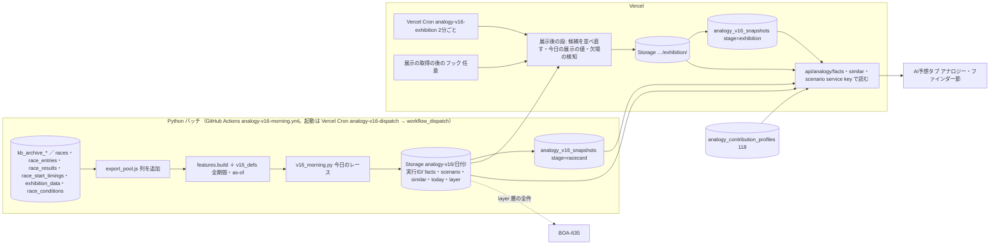
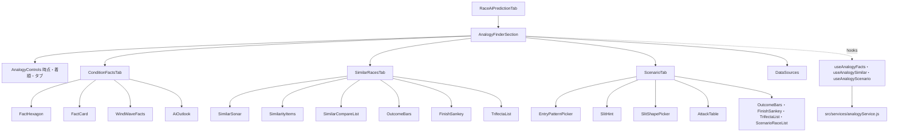

# アナロジー・ファインダー plan（モック Version 16 準拠）

元: [spec.md](./spec.md)・[screens.md](./screens.md)。2026-10-02 までの版（層別 S* を SQL の RPC で数える、ADR-0082。レースごとの寄与度を JS の TreeSHAP で出す、ADR-0083）は `git show fa61e6213:docs/design/analogy-finder/plan.md`。

技術判断の要点（ADR 案は [ADR-0085](../../adr/0085-analogy-v16-daily-batch-to-storage.md)。ADR-0082 を置き換え、ADR-0083 の画面の部分を止める）:
1. 数える処理はすべて Python のバッチで行う。v16 の数えた値は、選手の過去の走から作る as-of の値（直近30走の1着率・平均ST・今節の平均着順点・コース別の平均ST）を条件に使い、`features.py` と同じデータでしか作れない。SQL・JS に同じ計算を書き直さない
2. バッチは**今日のレースが使う範囲だけ**を数える。範囲の全組み合わせの集計表は作らない（タブ3は範囲×進入×形で数百セル×結果のベクトルになり、全会場・全組み合わせでは数千万セル）
3. 出力は Supabase Storage の非公開のバケット `analogy-v16` に JSON（gzip）で置き、実行ごとの版のパスにして上書きしない。DB には時点の固定のための小さなメタデータだけを置く
4. 展示後の段は Vercel の JS が、朝に作った候補（出走表時点の近い順 上位 min(層の件数, 10,000) 件）を展示の項目で並べ直す。全母集団の距離計算は Vercel では行わない
5. 既存の日次の特徴量ジョブ（レースごとの寄与度用。一度も動いていない）には相乗りしない。v16 は専用の workflow と、それを起動する Vercel Cron を新しく作る

## 全体の流れ



## バッチ

### 前提の作業（T1）
- `export_pool.js` に列を足す: 実進入（本体 `race_results.actual_course_1..6`、長期 `kb_archive_boats.course`）、決まり手、3連単の払戻（本体 `race_results.payout_trio`）、展示の進入・展示 ST・`start_flag`、本番 ST と F・出遅れ。長期分の列を足すので `KB_CACHE_VERSION` を上げ、長期分を書き出し直す（`assertCachedHeader` が古いキャッシュを拒む。学習の workflow を1回回す）
- `features.py` に無い値（今節の平均着順点・コース別の平均ST・進入の型・スリットの形・攻める艇・手がかりの条件）は `v16_defs.py` に置く。モックの数字は別のコード（`series_score.py`・slit-hint・prep の SQL）で作ったので、タブ3の母集団（例: 若松・6艇ともA1 1,117件、全国・6艇ともA1 24,871件）を Python で再現する pytest を先に作る

### 朝のバッチ `scripts/ml/analogy/v16_morning.py`（新規）
- workflow `.github/workflows/analogy-v16-morning.yml`（schedule なし、workflow_dispatch のみ）。起動は新しい Vercel Cron `api/cron/analogy-v16-dispatch.js`: JST 7:10（K ファイルの同期 7:00 の後。前日分の実進入がそろってから）・9:40・13:40。7:40 は「今日のレースの racecard の段がそろっていないとき」だけ起動する（拾い直し）。dispatch のトークン `GITHUB_ACTIONS_DISPATCH_TOKEN`（fine-grained PAT）はユーザーが作る
- 締切の早いレース（8:30 前後）に間に合うよう、7:10 の回は 20分以内で終える。`features.build` は 249万行で11秒（2026-10-02 の学習の実測）、書き出しは4分。k-NN と範囲ごとの集計を足した所要時間は初回に実測する
- 対象: 今日（JST）の、締切まで10分以上あり、中止でなく、6艇の出走表がそろい、欠場が分かっていないレース。9:40・13:40 の回は、出走表の内容のハッシュが変わったレース（選手の差し替え）と、まだ作っていないレースだけ作る
- 母集団: 2019-04-01〜前日の完全レース（spec「母集団と期間」）。`pool_cutoff`＝前日。前日分で実進入がまだ無いレースはタブ3の母集団から外し、件数を `scenario` の `excluded` に書く
- 出力のパス: `analogy-v16/{日付}/{実行ID}/…`。実行ごとに新しいパスに書き、既にあるファイルは上書きしない。snapshot が実行IDを指すので、同じ日の後の実行で範囲のファイルが変わっても、表示済みのレースの数字は変わらない
- 書く順: Storage に全ファイルを書き終えてから、DB の snapshot を書く（逆にすると、パスはあるのにファイルが無い snapshot が残る）

1レースごとに作るもの:
| 出力 | 中身 |
|---|---|
| `today/{race_id}.json` | 6艇の項目の値と6艇中の順位（同じ値の数）: 今節の平均着順点・当地勝率・全国勝率・平均ST（直近30走）・直近30走の1着率・モーター2連率・ボート2連率。級別の組み合わせ・ラウンド・グレード・使う範囲キー。コース別の平均ST（このコース・全体・会場で、走数つき）。手がかりの8条件の当否 |
| `similar/{race_id}.json.gz`（候補） | そろえる条件の層の中の、出走表時点の近い順 上位 K 件（K＝min(層の件数, 10,000)）: race_id・出走表の距離²（会場ペナルティ前）・会場一致・展示の段に使う項目の値（展示タイムの差・順位6艇分、天候・風・波）。展示の距離の重み・標準化の値・λ_展示 |
| `similar-racecard/{race_id}.json.gz` | 表示する上位800件（各件の全33項目の値・結果（1〜3着・決まり手・3連単と払戻・進入・コース順の ST））。層の件数、比べる相手の層の件数と1着の艇の件数、全33項目の「全レースで同じ割合」 |
| `layer/{race_id}.json.gz` | BOA-635 用。層の全件の結果を新しい順に最大2,000件（列は旧 `get_analogy_similar_races` と同じ: race_date・rank1〜3・winning_technique・course_by_boat・st_by_course・payout_3tan）と `n_total`（spec Q4。BOA-635 のレーンとの合意で形を決める） |

範囲ごとに作るもの（今日のレースが使う範囲キーの和集合。同じキーは1回だけ）:
| 出力 | キー | 中身 |
|---|---|---|
| `facts/{key}.json.gz` | `VC:{会場}:{組み合わせ}[:{選んだ艇の級別}]`・`NC:…`・`NCR:…:{yusho/junyu}`・`VA:{会場}`（キーの形は spec Q1 の回答で決める） | 艇番×項目×6つの順位（1と6は同じ値を含む）×着順の件数［当たり, 母数］、艇番×着順の全体、艇番×着順×項目の「来たときの平均の順位」、VA だけ風速区分×艇番×着順 |
| `scenario/{key}.json.gz` | 上の4つ＋`VG:{会場}`・`NA` | 進入の型（8つ）×形（どの形でも＋7つ）ごとの: 件数、1着の艇・3着以内の艇・決まり手・万舟の件数、3連単の件数（出たものだけ）、30件未満なら1件ずつの行。手がかりの8条件×形の［当てはまる・当てはまらない］の件数（このコース・全体の2通り）。③の攻める艇・1号艇の表（展示タイム順位・モーター順位の区分ごと）と、同じ区分の NC の値 |

- 範囲キーの数: 1日 約150〜180レースで、数百キーの見込み（初回に実測）。scenario のファイルはモックの scn.js を範囲ごとに gzip して 16〜35KB（design-reviewer の実測）
- 失敗の扱い: 対象のレースに today・similar がそろわなければ失敗にする（書けた分は書いてから）。Slack に知らせる

### 寄与度用モデルの集計（学習側レーン、週次）
AIの見立て（spec FR-E）のための変更。学習側レーンの担当（2026-10-03 合意の分担）:
- 量の定義を Version 14 にする（レース内で中心化 → 艇番の中で中心化、|値| の平均の構成比。枠は割合から除き、1号艇の格の分は枠に入れる）
- テーマを7つにする（`themes.py` のグループの付け替え。学習し直しは要らない）
- 項目ごとの向き（「高いほど見込みが上がる」など）を集計に入れる
- 出走表時点のモデルを3本（1着・2着以内・3着以内。今は `win_racecard` の1着だけ）にし、同じ集計を作る（展示前の AIの見立て）。118 の `analogy_contribution_profiles` には段を区別する列が無いので、列 `stage`（'exhibition'／'racecard'、既定 'exhibition'）を足して主キーに入れるマイグレーションを作る（版名で分ける案は、`analogy_models` の is_active の切り替えと噛み合わないので採らない）
- 優勝戦の判定の変更（spec）をラウンドの特徴量に入れる（学習し直しが要る）

### 夜の確認 `scripts/maintenance/verify-analogy-v16.js`（nightly）
前日の Storage の出力と DB のメタデータを読み、レースの数・欠け・作成時刻（締切前か）・展示後の段の充足率と厳密さ（下）を数える。例のレース（2026-09-27 若松12R）について、出し直した期待値（tasks T1-6）を同じ定義で再現できるかを確かめる。候補ファイル（`similar/`）の7日より古いものを消す。

## 展示後の段（Vercel の JS）

- 起動: 専用の Vercel Cron `api/cron/analogy-v16-exhibition.js`（2分ごと）が「6艇の展示タイムあり・締切前・展示後の段なし」のレースを拾う（件数に上限）。展示の取得の Cron（`createExhibitionCronHandler`、mode が off だと即 skipped）には依存しない。遅れを縮めるため、展示の取得（`preRaceHandlers.js` の `runSlotsWithRefresh` の後）からも呼ぶ（失敗しても取得の成否に影響させない）。二重に動いても snapshot の `ON CONFLICT DO NOTHING` で1回になる
- やること:
  1. 欠場の検知: `race_entries.is_absent` か `exhibition_data` の欠場が1艇でもあれば、snapshot に stage=exhibition・status='absent' を書いて終わる（画面は欠場の1行。spec Q5）
  2. 6艇の展示の値（展示タイム、天候・風・波、展示の進入、展示ST）を読む。展示タイムのレース内の差・順位・天候・風の成分は #1177 の `src/utils/analogyRaceFeatures.js`（`features.py` と同じ式・float32）を使う
  3. 候補ファイルを読み、候補ごとに 距離²＝出走表の距離²＋展示の項目の距離²＋λ_展示×（会場が違う）で並べ直し、上位800件の全33項目と結果を `similar-racecard` と同じ形で書く（全33項目の値は `similar-racecard` に無い候補の分も要るので、候補ファイルに K 件分の項目の値を入れるか、別ファイルにするかは T2-6 のサイズの実測で決める）
  4. 厳密さの判定: 展示の距離²は0以上なので、候補の K 番目の出走表の距離²が、並べ直した800番目の距離²以上なら結果は厳密。snapshot に `exact` を記録する
  5. 今日の展示の値（展示タイムの順位、風速区分、展示の進入の型、展示 ST の形。展示 F の ST は負にする）を書く
  6. Storage に書き終えてから snapshot（stage=exhibition）を書く（締切前だけ、既にあれば書かない）
- 近似の妥当性: design-reviewer の簡易の再現（数値の項目だけの距離、最大の層 58,119件）で、候補 3,000件の一致率は平均 84.5%（最小 31%）、6,000件で 95.7%。層は p50 7,286件・p90 58,119件。候補を10,000件にし、T2-4 で層の大きさ別に本番の距離で一致率を測る（目標 99%以上。足りなければ増やすか、大きい層だけ層の全件にする）

## データ設計

### Storage（非公開のバケット `analogy-v16`）
`analogy` バケット（非公開。学習データ・モデル・長期データのキャッシュが入っている）とは分ける。API は service key で読むので、公開は要らない。保持: `similar/`（候補）は7日で消す。ほかは時点の固定のため残す。容量は初回に実測し、年の見込みを出す（候補を除いて1日 数十MB の見込み）。

### DB（マイグレーション。spec Q4 の回答で決める）
新しい表は1つと、118 の表への列の追加（上の「寄与度用モデルの集計」）。番号は実装 PR の時点で origin/master の最新を確認する（120 を作り直すか、新しい番号にする）。

| 表 | 列 | 書き手 |
|---|---|---|
| `analogy_v16_snapshots` | `race_id`（races の外部キー）・`stage`（'racecard' / 'exhibition'）・`run_id`・`computed_at`・`pool_cutoff`（date）・`model_version`（重みに使った版）・`n_layer`・`status`（'ok' / 'empty_layer' / 'absent'）・`exact`（展示後の並べ直しが厳密か）。主キー `(race_id, stage)` | 朝のバッチ（racecard）、Vercel の JS（exhibition）。service_role。締切前だけ書く。racecard は出走表のハッシュが変わったときだけ上書き、exhibition は既にあれば書かない |

- RLS 有効・匿名は SELECT のみ
- 行数: 1日 約300行、1行 約200B

### 既存の表・マイグレーションの扱い
| 対象 | 状態 | 扱い |
|---|---|---|
| 118 `analogy_models`・`analogy_contribution_profiles` | 本番適用済み | そのまま使う（AIの見立て）。7テーマ・新しい量の定義は行の中身（themes・shares）の変更で、列は変えない |
| 120（層別 S* の母集団・スナップショット・RPC 2本） | 未適用、このブランチだけ | 適用しない。作り直すか消す（spec Q4）。PGlite の検証 `verify-analogy-strata-migration.js` も一緒に消す |
| 127 `analogy_race_features`・128、日次の特徴量ジョブ | master にあり未適用、ジョブは一度も動いていない | v16 では使わない。spec Q2 で「レースごとの寄与度をやめる」なら適用しない（書くだけで誰も読まない表になる） |
| ADR-0083 の `analogy_race_contributions` | 未作成 | spec Q2 で「やめる」なら作らない |

現行の 120 の ER 図（Q4 の回答まで残す。置き換えたら `generate-er-diagram.js` で作り直す）:

```mermaid
erDiagram
    analogy_contribution_profiles }o--|| analogy_models : "model_version"
    analogy_snapshots }o--|| races : "race_id"
    analogy_models {
        text model_version PK
        timestamptz trained_at
        text[] feature_columns
        jsonb themes
        jsonb metrics
        boolean is_active
        timestamptz created_at
    }
    analogy_contribution_profiles {
        text model_version PK
        smallint finish_target PK
        smallint venue_code PK
        text grade PK
        text round PK
        smallint boat_number PK
        integer n_boats
        integer n_races
        date period_from
        date period_to
        jsonb shares
        jsonb share_sd
        jsonb breakdown
    }
    analogy_pool_outcomes {
        varchar race_id PK
        date race_date
        smallint venue_code
        smallint race_number
        text b1_class
        numeric(4,2) b1_win_gap
        smallint gap_band "生成列 analogy_gap_band(b1_win_gap)"
        smallint top_boat
        text round
        text grade
        smallint b1_motor_band
        smallint rank1
        smallint rank2
        smallint rank3
        text winning_technique
        smallint winner_course
        smallint[] course_by_boat
        numeric(4,2)[] st_by_course
        integer payout_3tan
        text source
        timestamptz updated_at
    }
    analogy_snapshots {
        varchar race_id PK
        text b1_class
        numeric(4,2) b1_win_gap
        smallint gap_band
        smallint venue_code
        smallint top_boat
        smallint auto_depth
        integer[] n_by_depth
        date pool_from
        date pool_cutoff
        jsonb distribution
        timestamptz created_at
    }
```

## 定義（バッチ・JS・画面で同じものを使う）

| 定義 | 正 | 一致の検査 |
|---|---|---|
| 完全レース・返還の除外 | `features.py`（タブ1・2は返還を含める、タブ3は除く） | pytest |
| 優勝戦・準優勝戦の判定 | spec「優勝戦・準優勝戦の判定」。JS `raceStageConfig.js`・Python `features.py` | 固定の文字列で JS と Python を照合（`scripts/ml/analogy/tests/test_features.py`）。最終日12R の照合は pytest |
| 級別の組み合わせ | 6艇の級別を A1・A2・B1・B2 の順に並べた構成（spec Q1 の回答で確定） | pytest |
| 6艇中の順位と同じ値 | 1位・6位は同じ値を含む、2〜5位は min 順位（`tab1_facts.py`） | pytest と JS の `analogyFacts.js` の固定データ |
| 判定の3段階・並び | spec A-7 | `verify-analogy-facts.js`（ci） |
| 進入の型・前付け | [entry-slit/prep7.md](./entry-slit/prep7.md) の maeduke（艇番より内のコースに入った艇） | pytest と `analogyScenario.js` の固定データ |
| スリットの7形 | BOA-635 の spec「スリットの判定」1段目（round(ST×100) の整数で比べる）。展示 F は負 | 同上。BOA-635 と同じ固定データを使う |
| 手がかりの8条件 | [slit-hint/slitpred2_hint.json](./slit-hint/slitpred2_hint.json)（平均STは 1/1000秒に丸める。このコースで5走未満は全体で埋める） | 同上 |
| 攻める艇 | [slit-hint/mark1.md](./slit-hint/mark1.md) | 同上 |
| 今節の平均着順点 | [mock-v16/series-score.md](./mock-v16/series-score.md) | pytest（例のレースの6艇の値） |
| k-NN の距離 | [mock-v16/knn_build.py](./mock-v16/knn_build.py)。重みは表示中の版の `model_win` の SHAP、L は cal で引き直す | 例のレースで knn78.md の14件の並びを再現（pytest） |
| Wilson 区間 | 95%、z=1.96 | JS の固定データ |
| 3連単の払戻 | 本体 `race_results.payout_trio`（列名と券種が逆）、長期は kb | pytest |

## API

いずれも Vercel の Node 関数（service key で Storage の gzip を読む）。snapshot の `run_id` のパスから読む。Storage・DB の失敗は 502 と `no-store`。

| エンドポイント | 中身 | キャッシュ |
|---|---|---|
| `GET /api/analogy/facts/[raceId]?stage=` | `status`（下）、today（stage=exhibition なら展示の値を重ねる）、使う範囲キー（VC・NC・NCR・VA）の facts、AIの見立て（`analogy_contribution_profiles` の表示中の版の、stage に応じた段。無ければ `ai.available: false`） | 締切前 `s-maxage=60`、締切後 `s-maxage=86400` |
| `GET /api/analogy/similar/[raceId]?stage=` | `status`、表示する上位800件（各件の全33項目・結果）、層の件数、比べる相手、全レースで同じ割合 | 同上 |
| `GET /api/analogy/scenario/[raceId]?scope=&stage=` | `status`、範囲キーの scenario 全体（進入×形の全セル。画面が選択に応じて取り出す）、today の手がかりの当否、stage=exhibition なら展示の進入・形 | 同上 |

`status`（screens「状態」と対応。画面は時刻で判定しない）:
| status | 条件 |
|---|---|
| `absent` | exhibition の snapshot が status='absent' |
| `not_saved` | racecard の snapshot が無い |
| `empty_layer` | racecard の snapshot が status='empty_layer'（タブ2だけ） |
| `exhibition_ready` | exhibition の snapshot がある（「展示後」を押せる） |
| `exhibition_reflecting` | 6艇の展示タイムがあり、締切前で、exhibition の snapshot が無い |
| `exhibition_missing` | 締切を過ぎて exhibition の snapshot が無い |
| `before_exhibition` | それ以外 |

- 艇番・着順・進入・形の切り替えは画面で行う（取り直さない）。stage を変えたときだけ取り直す
- 今節の平均着順点を出さない範囲（spec A-4・Q7）では、facts からその項目を外す

## フロントエンド

screens.md のコンポーネント。`RaceAiPredictionTab.jsx` の `AnalogyFinderSection` を作り直す（今の FR-1 の部品はフラグで非公開のまま残し、v16 では使わない）。早期 return の分岐でも節を出せるよう、節の描画を分岐の外に出す（BOA-635 も同じ位置を使う）。



- `src/services/analogyService.js` に3つの取得を足す。メモリのキャッシュは `(raceId, stage, scope)` 単位。NULL・エラーは残さない（BOA-497 の教訓）
- 類似レースのスライダーの件数での集計（1着の艇・決まり手・サンキー・3連単・何が似ている？）は画面の純粋関数（`analogyAggregate.js`。旧版の同名の関数を作り直す）
- 文言は `aiPredictionTab.analogy.*`（4言語）

## BOA-635 との接続（作り直し。spec Q4、オーケストレーター経由で BOA-635 のレーンと合意する）
- 旧版の合意（120 の `analogy_pool_outcomes` と `get_analogy_similar_races`、層別の自動の深さ・最大2,000件）は、120 を置き換えると無くなる。BOA-635 の tasks（着手条件・T0-1・T0-3・T1-4・T5-3）はこれを前提にしている
- BOA-635 の検証者の推奨は「発生率の分母がスライダーで変わってはいけない」。似ている順の上位800件を渡すとこれに反するので、渡さない
- 案: v16 の朝のバッチが `layer/{race_id}.json.gz`（v16 の層の全件の結果、新しい順に最大2,000件、`n_total`）を作り、BOA-635 が読む。v16 の層は会場を含まず、ラウンド・グレードを含む点が旧 S*（会場を含む4条件）と違う。BOA-635 の分母として妥当かは BOA-635 のレーンが決める
- スリットの7形・進入の型の判定は `analogyScenario.js`（JS）と `v16_defs.py`（Python）を BOA-635 と共用する
- T0-2 で合意してから T2 に入る

## 既存サービス層・共通ライブラリとの連携
- Vercel Cron は `vercel.json` の crons と `createScrapeCronHandler` 系の共通ラッパ（job の登録・`scrape_job_state` のモード・最終成功の監視）。dispatch は FR-1 の週次の起動（未実装）と同じ仕組みにし、1つの関数で両方を起動できるようにする
- Supabase の呼び出しは `scripts/lib/supabaseClient.js`（service key）、Python は `scripts/ml/analogy/db.py`、Storage は `storage.js` にバケット名の引数を足して使う
- 中止の判定は `races.cancellation_status`、締切は `races.start_time`（JST）、欠場は `race_entries.is_absent`

## 検証
- pytest（`scripts/ml/analogy/tests/`）: 上の定義の表。as-of（前日までの走だけ、今節の平均着順点は同じ日の前の走を含む）
- `verify-analogy-facts.js`（ci、新規）: `analogyFacts.js`・`analogyScenario.js`・`analogyAggregate.js`・`analogyFormat.js` を固定データで（判定・並び・同じ値・今日の一文・形の判定・Wilson・日付）
- `verify-analogy-v16.js`（nightly、新規）: 前日の出力の欠け・作成時刻、例のレースのモックの数字の再現
- 実装後の `data-accuracy-verifier`: 数レースについて、Storage の数字を本番 DB から数え直して照合
- 受け入れ E2E（`e2e/acceptance/analogy-finder.spec.js`）と `npm run test:layout`（AI予想タブの節の3タブ）
- 展示後の並べ直しの近似の一致率（T2-4）

## 設計レビューの指摘と対応
2026-10-04 の design-reviewer（v16 の書き直し）の指摘と対応は [design-review-v16.md](./design-review-v16.md)。2026-10-01・10-02 の指摘（k-NN・層別の時のもの）は旧版の plan にある。

## 残る判断
- spec の未確定 Q1〜Q7
- BOA-635 との接続（上）
- Storage の保持期間（初回の実測で見直す）
- 展示後の候補の件数（T2-4 の一致率で決める）
