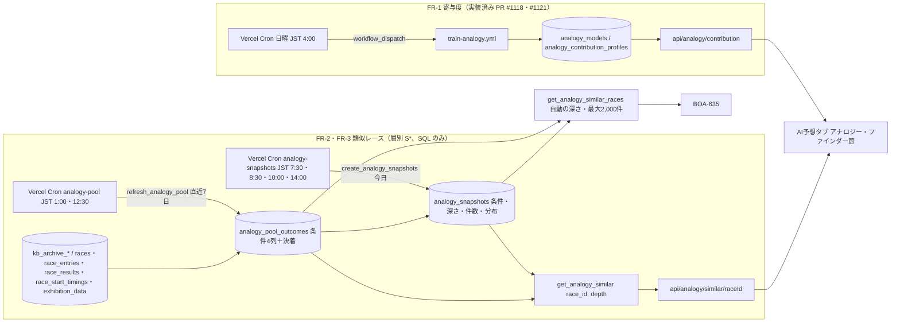
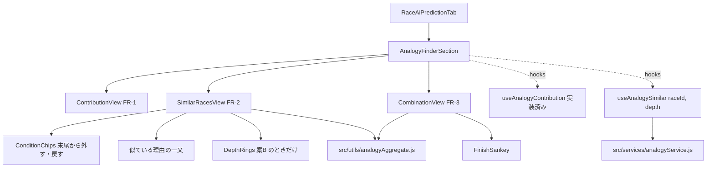

# アナロジー・ファインダー plan

元: [spec.md](./spec.md)・[screens.md](./screens.md)。技術判断:
- FR-1（寄与度）: [ADR-0080](../../adr/0080-analogy-neighbors-precomputed-in-batch.md) のうち週次学習の起動の部分（Vercel Cron から workflow_dispatch、schedule は使わない）
- FR-2・FR-3（類似レース・組み合わせ）: [ADR-0082](../../adr/0082-analogy-strata-counted-in-sql.md)（層別 S* を、条件の列を持つ母集団から SQL の RPC で数える）。ADR-0080 の近傍のバッチ・Storage の行列・近傍の dispatch は置き換えた

FR-2 は 2026-10-02 に k-NN から層別 S* に変わった（spec MD-6・FR-2）。この版の plan は FR-2 の部分を層別で書き直したもの。設計レビュー（2026-10-01）の指摘のうち、近傍のバッチを前提にしたものは末尾の表で「層別で不要」とした。

## 全体の流れ



## データ設計

### FR-1（マイグレーション 118、本番適用済み）
`analogy_models`・`analogy_contribution_profiles`・`activate_analogy_model`。FR-2 は学習モデルに依存しないので、`analogy_models` に FR-2 の列は足さない（118 の時点で予定していた `pool_cutoff`・`neighbor_k`・`venue_penalty` の ADD COLUMN は不要になった）。

### FR-2・FR-3（マイグレーション 120、未適用）

ER 図は 118・120 の DDL から `generate-er-diagram.js` で生成した（FR-1 の2表を含む）。
[120_analogy_strata.sql](../../db-migration/120_analogy_strata.sql)。設計時の案 115（k-NN の近傍のバッチ）は適用しないまま破棄した。PGlite で適用・関数の動作・権限を確認する `scripts/maintenance/verify-analogy-strata-migration.js`（ci）がある。

```mermaid
erDiagram
    analogy_contribution_profiles }o--|| analogy_models : "model_version"
    analogy_snapshots }o--|| races : "race_id"
    analogy_models {
        text model_version PK
        timestamptz trained_at
        text[] feature_columns
        jsonb themes
        jsonb metrics
        boolean is_active
        timestamptz created_at
    }
    analogy_contribution_profiles {
        text model_version PK
        smallint finish_target PK
        smallint venue_code PK
        text grade PK
        text round PK
        smallint boat_number PK
        integer n_boats
        integer n_races
        date period_from
        date period_to
        jsonb shares
        jsonb share_sd
        jsonb breakdown
    }
    analogy_pool_outcomes {
        varchar race_id PK
        date race_date
        smallint venue_code
        smallint race_number
        text b1_class
        numeric(4,2) b1_win_gap
        smallint gap_band "生成列 analogy_gap_band(b1_win_gap)"
        smallint top_boat
        smallint rank1
        smallint rank2
        smallint rank3
        text winning_technique
        smallint winner_course
        smallint[] course_by_boat
        numeric(4,2)[] st_by_course
        integer payout_3tan
        text source
        timestamptz updated_at
    }
    analogy_snapshots {
        varchar race_id PK
        text b1_class
        numeric(4,2) b1_win_gap
        smallint gap_band
        smallint venue_code
        smallint top_boat
        smallint auto_depth
        integer[] n_by_depth
        date pool_from
        date pool_cutoff
        jsonb distribution
        timestamptz created_at
    }
```

| テーブル | 役割 | 行数・サイズ | 書き込み |
|---|---|---|---|
| analogy_pool_outcomes | 母集団。完全レース1行（6艇・欠場なし・結果あり・中止・不成立でない・1着が1艇・1〜3着に返還艇なし）。条件の4列と決着。長期（〜2025-12-02）は kb_archive、以後は本体。索引 `(gap_band, b1_class, venue_code, top_boat, race_date DESC)` | 約40万行 × 約140B ≒ 60MB。1日約150行増える | `refresh_analogy_pool(from, to)`。範囲の行を作り直し、値が変わった行だけ upsert、完全レースでなくなった行を消す。初回はユーザーが3か月ずつ呼ぶ |
| analogy_snapshots | BOA-627。今日のレースの条件・自動の深さ・深さごとの件数・母集団の期間・自動の深さの分布 | 1日約150行 × 数KB。年に約0.2GB | `create_analogy_snapshots(date)`。締切前・中止でない・6艇の出走表がそろったレースに1回だけ |

Disk IO の見積り:
- 初回の投入: 約40万行・約60MB を3か月ずつ約27回。適用前後でダッシュボードの Disk IO を確認する（data-acquisition.md）
- 日次: `analogy-pool` は直近7日（約1,000レース）を作り直すが、書くのは変わった行だけ（実進入の後埋め・結果の訂正で1日あたり数十〜数百行の見込み）。読み取りは元テーブルの直近7日分（約6,000艇行）。`analogy-snapshots` は約150行の insert と、レースごとに層の件数・分布の集計（索引の範囲読み）

### 条件の定義（ADR-0082 の表）
| 列 | 作り方 |
|---|---|
| `b1_win_gap` | 1号艇の全国勝率 − 2〜6号艇の全国勝率の最大（小数2桁）。1号艇の勝率が無い、または2〜6号艇がすべて無ければ NULL |
| `gap_band` | `analogy_gap_band`: 0（−1.91 未満）／1（−1.91〜）／2（−1.14〜）／3（−0.49〜）／4（+0.19〜）／5（NULL）。1/100単位で比べ、境界ちょうどは上の帯 |
| `b1_class` | 1号艇の級別 A1／A2／B1／B2。不明は '' |
| `top_boat` | 全国勝率が最大の艇番。同率は艇番の小さい方 |

元の列: 長期は `kb_archive_boats.national_win_rate`・`class`、本体は `race_entries.win_rate`・`grade`。今日のレースは `analogy_race_conditions(race_id)` が `race_entries` から作る（6艇そろわなければ0行）。

### 値の約束（BOA-635 の依頼 R1〜R4・D-5、ADR-0080 から引き継ぎ）
- `payout_3tan` は3連単の払戻。本体は `race_results.payout_trio`（列名と券種が逆。`payout_trifecta` は3連複）
- `st_by_course`: フライング・出遅れのコースと、進入が分からない艇は NULL
- `course_by_boat`: 実進入が分からない艇は NULL（艇番で埋めない。BOA-523）
- 不成立・中止と、1〜3着に返還艇が入るレースは母集団に入れない
- 決まり手は6分類（逃げ・差し・まくり・まくり差し・抜き・恵まれ）。それ以外（本体の「逃げ抜き」等）・不明は NULL で、母集団には入れる（分析と同じ）
- PGlite の検証（verify-analogy-strata-migration.js）がこれらを固定データで固定している

### get_analogy_similar(p_race_id, p_depth)
- `p_depth` を省略すると自動の深さ（件数が200以上になる最も深い層。m=200）。1〜4 を渡すとその層（条件チップ）
- スナップショットがあり、深さが自動の深さなら、保存した分布をそのまま返す（時点固定）。それ以外は `pool_cutoff` 以前の母集団で数え直す
- スナップショットが無いレースは、出走表から条件を作り、その日より前の母集団で数える（`snapshot: false`）
- 返す jsonb: `race_id`・`snapshot`・`snapshot_at`・`from_snapshot`・`conditions`・`depth`・`auto_depth`・`n_by_depth`（深さ1〜4）・`pool_from`・`pool_cutoff`・`n`・`technique`・`winner_boat`・`winner_course`・`trifecta`（全組み合わせ）・`course_flow`（「1着の進入-2着の進入|決まり手」の件数、FR-3 のコールアウト用）・`recent`（同じ層の新しい順20件）
- 割合は返さない。画面が件数÷n で出す（ADR-0082 決定6。ユーザー確認待ち。平滑化を採ったら、親の層の件数を足す）
- SECURITY INVOKER・STABLE・`statement_timeout 5s`。匿名が EXECUTE できるのは、この RPC と中で呼ぶ読み取りの関数5本（`check-anon-access.js` の ANON_RPCS に足した）

## スクリプト構成と実行タイミング

### FR-1（実装済み）
`scripts/ml/analogy/`（export_pool.js・features.py・train.py・profiles.py・db.py・storage.js 等）と `.github/workflows/train-analogy.yml`。週次の起動（Vercel Cron 日曜 JST 4:00 → workflow_dispatch）は未実装。FR-2 とは独立に入れる（`api/cron/analogy-dispatch.js`、GitHub のトークンはユーザーが作る）。

### FR-2・FR-3（新規）
| ファイル | 役割 |
|---|---|
| `api/cron/analogy-pool.js` | Vercel Cron（共通ラッパ `createScrapeCronHandler`、job=`analogy_pool`、モード off／shadow／live）。`refresh_analogy_pool(今日−7, 今日−1)` を呼ぶ。shadow は書かずに `analogy_pool_rows_*` の件数だけを数える。期待件数（その期間の完全レースの見込み）が0でないのに source_rows が0なら失敗にする |
| `api/cron/analogy-snapshots.js` | Vercel Cron（job=`analogy_snapshots`）。`create_analogy_snapshots(今日)` を呼ぶ。締切前で出走表がそろったレースがあるのに0件しか作れなければ失敗にする（すべて作成済みの0件は正常） |
| `scripts/maintenance/backfill-analogy-pool.js` | 手動の CLI。期間を3か月ずつに切って `refresh_analogy_pool` を呼ぶ（初回の投入と、K/B 補完・BOA-523 の後の作り直し）。本番への書き込みなのでユーザーが実行する |
| `scripts/ml/analogy/strata.py` | 照合用の参照実装。`cm2.py` の `build_axes` の境界を固定し、1/100単位の比較にしたもの。`features.py` の完全レースの判定を使う |
| `scripts/maintenance/verify-analogy-pool.js` | manual。本番の期間を区切って、参照実装と母集団の「完全レースの集合」「条件4つの値」「決まり手・1着艇・1着の進入コースのラベル」を照合する。元テーブルと母集団の行数・ラベルの差、スナップショットの件数と数え直しの件数の一致率も出す |

`vercel.json` の crons（UTC で書き、JST を併記）:
- `analogy-pool`: `0 16 * * *`（JST 1:00、結果の確定 result-catchup 23:50・0:30 の後）、`30 3 * * *`（JST 12:30、K ファイル同期 12:00 の後）
- `analogy-snapshots`: `30 22 * * *`（7:30）、`30 23 * * *`（8:30、7:30 の補足）、`0 1 * * *`（10:00）、`0 5 * * *`（14:00、ナイター）

`scrape_job_state`・ジョブのレジストリ（`maxDurationSec`）に2つのジョブを登録する。

## API

| エンドポイント | 中身 | キャッシュ |
|---|---|---|
| `GET /api/analogy/contribution?…`（実装済み） | FR-1 | 実装どおり |
| `GET /api/analogy/similar/[raceId]?depth=` | `get_analogy_similar` の結果 | スナップショットあり・自動の深さ: 締切前 `s-maxage=300`、締切後 `s-maxage=86400`。深さ指定・スナップショット無し: `s-maxage=300`。NULL・エラーは `no-store` |

既存の公開 API と同じく Edge 関数で、PostgREST の RPC を anon key で呼ぶ。API が失敗したら画面は PostgREST の RPC を直接呼ぶ（`getOutcomeDistribution` と同じ流儀）。

## フロントエンド

### コンポーネント（screens.md）
`src/components/race/analogy/` に置き、`RaceAiPredictionTab.jsx` に `AnalogyFinderSection` を足す。早期 return の分岐でも節を出せるよう、節の描画を分岐の外に出す（BOA-635 も同じ位置を使う）。



- `src/services/analogyService.js`（FR-1 で作成済み）に `getAnalogySimilar(raceId, depth)` を足す。メモリのキャッシュは `(raceId, depth)` 単位。NULL・エラーは残さない（BOA-497 の教訓）
- `src/utils/analogyAggregate.js`: 純粋関数。RPC の件数から、分布の行（件数・件数÷n）、サンキーの流れ（`trifecta` から1→2→3着）、組み合わせ一覧（上位10件＋その他）、「1号艇以外が1着」の絞り込み、コールアウト（`course_flow`）を作る。FR-2 と FR-3 で共有する
- `src/utils/analogyReason.js`: 似ている理由の一文を、条件・深さ・件数から作る純粋関数（spec FR-2 の文面ルール6つ）。i18n のキーで組み立てる
- 節を出す条件: FR-2・FR-3 は `get_analogy_similar` が NULL でないこと。FR-1 は is_active の版があること。どれも無ければ節ごと出さない。中止確定のレースは出さない。予想（predictions）の有無とは切り離す
- 条件チップは末尾からだけ外せる。深さを変えたら `depth` つきで取り直す（再計算は RPC 側）
- 艇の色は `src/utils/colors.js` の `BOAT_COLORS`、`BoatBadge` は `src/components/race/BoatBadge.jsx` に切り出して共用する
- 文言は `aiPredictionTab.analogy.*`（4言語）

## 既存サービス層・共通ライブラリとの連携
- Cron は `scripts/lib/scrapeJobs/cronWrapper.js` の `createScrapeCronHandler`（`racer-course-technique-stats` と同じ形）。Supabase の呼び出しは `scripts/lib/supabaseClient.js`（service key）
- 中止の判定は `races.cancellation_status`
- 締切は `races.start_time`（JST の time）

## 検証
- `verify-analogy-strata-migration.js`（ci、PGlite）: 帯の境界、完全レースの判定、値の約束、変わった行だけ書くこと、スナップショット、RPC、権限
- `verify-analogy-aggregate.js`（ci、新規）: `analogyAggregate.js` と `analogyReason.js` を固定データで。分布の件数の合計が n、サンキーの帯の合計、一覧のシェアの合計が100%、文面ルール（「AI」「類似度」「ほぼ同じ」を含まない、件数を必ず含む、外した条件を書く）
- `verify-analogy-pool.js`（manual）: 本番の母集団と参照実装の照合
- 実装後の `data-accuracy-verifier`: 数レースで RPC の件数を元テーブルから数え直して照合
- 受け入れ E2E（`acceptance-test-writer`）と `npm run test:layout`（AI予想タブの節）
- 母集団の投入後、深さ1〜4の RPC の応答時間を実測する（目標 2秒以内、`statement_timeout` 5秒）

## BOA-635 との接続（2026-10-02 合意、オーケストレーター経由）
BOA-635（PR #1093、BOA-635 の ADR 案（PR #1093））は近い順800行を画面で数える前提だった。層別では行の数が層で200〜7万件と変わり、スナップショットはモデルの版を持たない。次の形で合意した（plan の旧案 (B) を BOA-635 側が修正したもの）。
- RPC `get_analogy_similar_races(race_id)`（120）: **自動の深さに固定**し、その層から `pool_cutoff` 以前を新しい順に最大2,000件返す。上限を超える層も隠さない。行の外に `snapshot`・`snapshot_at`・`depth`・`conditions`・`n_total`（層の総件数）・`n_returned`・`pool_from`・`pool_cutoff`
- 列: `race_date`・`rank1〜3`・`winning_technique`・`course_by_boat`・`st_by_course`・`payout_3tan`（`race_id`・`venue_code`・`race_number`・`winner_course` は返さない）
- 大きさ: 2,000行で gzip 後約34KB、1,000行で約17KB（乱数の模擬データでの試算。実データのほうが圧縮が効く）。100KB に収まるので2,000件。母集団の投入後に実測する
- 発走後の再現: スナップショットの `pool_cutoff` 以前で固定するので、同じレースは発走後も同じ行の集合を返す（cutoff 以前の行が作り直しで変わったときは、その行の値だけ変わる）
- 層の条件の説明文は、画面の共通関数 `src/utils/analogyReason.js`（FR-2 で作る）を BOA-635 も使う。RPC は `conditions` の値だけを返す
- BOA-635 の判定はレース単位の純粋関数のまま（BOA-635 の ADR 案（PR #1093）の決定1は維持）。紐づけのキーは `(race_id, created_at)`（D-6 の読み替え）
- 値の約束 R1〜R4・D-5 は 120 で固定（PGlite の検証）
- 2,000件の言い換えの文言はオーケストレーターがユーザーに確認する

## 残る判断
- モックの Q1〜5（案A/B、末尾からだけ外す、自動で外す、割合は件数÷n、任意の追加チップを作るか）: ユーザー確認中
- 干渉効果のコールアウトに出すパターン（tasks T0-2）
- MD-3 の再判定（FR-1 の「市場」）

## 設計レビューの指摘と対応（design-reviewer、2026-10-01。FR-2 が k-NN のときのもの）

| # | 重大度 | 指摘 | 対応 | 層別（ADR-0082）での扱い |
|---|---|---|---|---|
| 1 | P0 | 10分ごとの GitHub Actions schedule は起動しない・遅れる | 近傍は出走表時点の1段・Vercel Cron から dispatch | FR-2 は Vercel Cron → SQL。GitHub Actions を使わない |
| 2 | P1 | 前提条件1を 2026-04〜09 の展示・気象が満たせない | 補完計画に追加 | FR-2 は展示・気象を使わない（変わらず） |
| 3 | P1 | 母集団の行列が Storage の上限を超える | 分割・float16 | 層別で不要（行列を作らない） |
| 4 | P1 | is_active の切り替えが原子的でない | `activate_analogy_model` | FR-1 で実装済み |
| 5 | P2 | 出走表時点の as-of と学習データのずれ | 日単位でずらす | FR-1 で実装済み。FR-2 の条件は出走表の値だけで、ローリング集計を使わない |
| 6 | P2 | 寄与度の集計窓・n<30 の戻し方 | 直近12か月・会場→ラウンド→グレード | FR-1 で実装済み |
| 7 | P2 | 予想が無いレースで節が出ない | 節を分岐の外に | 変わらず |
| 8 | P2 | `withCache` の途中状態 | 専用キャッシュ | 変わらず |
| 9 | P2 | 読み取りの Disk IO の見積り | 長期分を Storage に | FR-2 は上の「Disk IO の見積り」 |
| 10 | P3 | 長期のステージ文字列 | `stage_kind` | FR-2 はラウンドを使わない |
| 11 | P3 | MD-2 の数値が古い | T0-7 | 変わらず |
| 12 | P3 | 母集団と決着の集合のずれ | LEFT JOIN と verify | 層別では母集団と決着が同じ表。長期と本体の境目は features.py どおり 2025-12-02 までが長期（以前の版の「2025-12-02 は本体を優先」は誤り） |
| 13 | P3 | `check-anon-access.js` の一覧 | T1-1 | 120 の6関数を足した |
| 14 | P3 | MD-3 の比較A の揺れ | 注記 | 変わらず |
| 15 | P3 | 細部（説明の一行、λ、0件の判定、重複実行、外部キー） | 採用 | 説明の一行は文面ルール。0件の判定・重複実行は Cron の約束（上）に引き継ぐ |

## 実装レーンで決まった事項（PR #1118・#1121 マージ済み、2026-10-02）
- マイグレーション: 寄与度の分（`analogy_models`・`analogy_contribution_profiles`・`activate_analogy_model`）を 115 から **118** に切り出した。115 の残りは 120（層別）に置き換えた
- 学習（train.py）: test は最終日から12か月、train はそれ以前（末尾3か月は温度合わせだけ）。木の数は固定。品質ゲートは「基準1に日クラスタ・ブートストラップ CI で有意に勝つ」「前の版を同じ test で評価し直して 0.005 以上悪化しない」
- 寄与度の集計窓: 学習に使っていない直近12か月（test 期間）
- Storage の版の規則（`storageRules.js`、`verify-analogy-storage.js` で固定）: 直近3版と表示中の版を残す。表示中の版と同じ名前ではアップロードしない。長期データのキャッシュ（`analogy/source/v1/`）は先頭行に列名を入れ、読むときに照合する
- 寄与度の行は、表示中の版と切り替え直前の版だけ残す。書き込み途中で失敗したら今回の版を消してから失敗する
- 特徴量（features.py）: 選手の履歴は日単位でずらす。1〜3着に返還艇が入るレースは除外。グレードは長期 `kb_archive_venue_days.race_grade` → `race_series` の順
- 週次の起動（Vercel Cron → workflow_dispatch）は未実装（FR-1 の残り）
