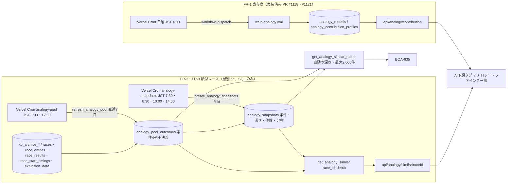
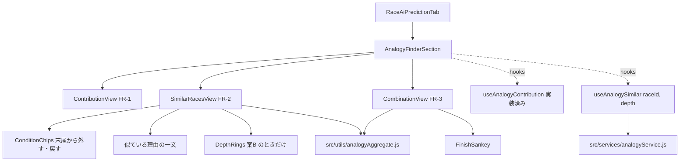

# アナロジー・ファインダー plan

元: [spec.md](./spec.md)・[screens.md](./screens.md)。技術判断:
- FR-1（寄与度）: [ADR-0080](../../adr/0080-analogy-neighbors-precomputed-in-batch.md) のうち週次学習の起動の部分（Vercel Cron から workflow_dispatch、schedule は使わない）
- FR-2・FR-3（類似レース・組み合わせ）: [ADR-0082](../../adr/0082-analogy-strata-counted-in-sql.md)（層別 S* を、条件の列を持つ母集団から SQL の RPC で数える）。ADR-0080 の近傍のバッチ・Storage の行列・近傍の dispatch は置き換えた

FR-2 は 2026-10-02 に k-NN から層別 S* に変わった（spec MD-6・FR-2）。この版の plan は FR-2 の部分を層別で書き直したもの。設計レビュー（2026-10-01）の指摘のうち、近傍のバッチを前提にしたものは末尾の表で「層別で不要」とした。

## 全体の流れ



## データ設計

### FR-1（マイグレーション 118、本番適用済み）
`analogy_models`・`analogy_contribution_profiles`・`activate_analogy_model`。FR-2 は学習モデルに依存しないので、`analogy_models` に FR-2 の列は足さない（118 の時点で予定していた `pool_cutoff`・`neighbor_k`・`venue_penalty` の ADD COLUMN は不要になった）。

### FR-2・FR-3（マイグレーション 120、未適用）

ER 図は 118・120 の DDL から `generate-er-diagram.js` で生成した（FR-1 の2表を含む）。
[120_analogy_strata.sql](../../db-migration/120_analogy_strata.sql)。設計時の案 115（k-NN の近傍のバッチ）は適用しないまま破棄した。PGlite で適用・関数の動作・権限を確認する `scripts/maintenance/verify-analogy-strata-migration.js`（ci）がある。

```mermaid
erDiagram
    analogy_contribution_profiles }o--|| analogy_models : "model_version"
    analogy_snapshots }o--|| races : "race_id"
    analogy_models {
        text model_version PK
        timestamptz trained_at
        text[] feature_columns
        jsonb themes
        jsonb metrics
        boolean is_active
        timestamptz created_at
    }
    analogy_contribution_profiles {
        text model_version PK
        smallint finish_target PK
        smallint venue_code PK
        text grade PK
        text round PK
        smallint boat_number PK
        integer n_boats
        integer n_races
        date period_from
        date period_to
        jsonb shares
        jsonb share_sd
        jsonb breakdown
    }
    analogy_pool_outcomes {
        varchar race_id PK
        date race_date
        smallint venue_code
        smallint race_number
        text b1_class
        numeric(4,2) b1_win_gap
        smallint gap_band "生成列 analogy_gap_band(b1_win_gap)"
        smallint top_boat
        smallint rank1
        smallint rank2
        smallint rank3
        text winning_technique
        smallint winner_course
        smallint[] course_by_boat
        numeric(4,2)[] st_by_course
        integer payout_3tan
        text source
        timestamptz updated_at
    }
    analogy_snapshots {
        varchar race_id PK
        text b1_class
        numeric(4,2) b1_win_gap
        smallint gap_band
        smallint venue_code
        smallint top_boat
        smallint auto_depth
        integer[] n_by_depth
        date pool_from
        date pool_cutoff
        jsonb distribution
        timestamptz created_at
    }
```

| テーブル | 役割 | 行数・サイズ | 書き込み |
|---|---|---|---|
| analogy_pool_outcomes | 母集団。完全レース1行（6艇・欠場なし・結果あり・中止・不成立でない・1着が1艇・1〜3着に返還艇なし）。条件の4列と決着。長期（〜2025-12-02）は kb_archive、以後は本体。索引 `(gap_band, b1_class, venue_code, top_boat, race_date DESC)` | 約40万行 × 約140B ≒ 60MB。1日約150行増える | `refresh_analogy_pool(from, to)`。範囲の行を作り直し、値が変わった行だけ upsert、完全レースでなくなった行を消す。初回はユーザーが3か月ずつ呼ぶ |
| analogy_snapshots | BOA-627。今日のレースの条件・自動の深さ・深さごとの件数・母集団の期間・自動の深さの分布 | 1日約150行 × 数KB。年に約0.2GB | `create_analogy_snapshots(date)`。締切前・中止でない・6艇の出走表がそろったレースに1回だけ |

Disk IO の見積り:
- 初回の投入: 約40万行・約60MB を3か月ずつ約27回。適用前後でダッシュボードの Disk IO を確認する（data-acquisition.md）
- 日次: `analogy-pool` は直近7日（約1,000レース）を作り直すが、書くのは変わった行だけ（実進入の後埋め・結果の訂正で1日あたり数十〜数百行の見込み）。読み取りは元テーブルの直近7日分（約6,000艇行）。`analogy-snapshots` は約150行の insert と、レースごとに層の件数・分布の集計（索引の範囲読み）

### 条件の定義（ADR-0082 の表）
| 列 | 作り方 |
|---|---|
| `b1_win_gap` | 1号艇の全国勝率 − 2〜6号艇の全国勝率の最大（小数2桁）。1号艇の勝率が無い、または2〜6号艇がすべて無ければ NULL |
| `gap_band` | `analogy_gap_band`: 0（−1.91 未満）／1（−1.91〜）／2（−1.14〜）／3（−0.49〜）／4（+0.19〜）／5（NULL）。1/100単位で比べ、境界ちょうどは上の帯 |
| `b1_class` | 1号艇の級別 A1／A2／B1／B2。不明は '' |
| `top_boat` | 全国勝率が最大の艇番。同率は艇番の小さい方 |

元の列: 長期は `kb_archive_boats.national_win_rate`・`class`、本体は `race_entries.win_rate`・`grade`。今日のレースは `analogy_race_conditions(race_id)` が `race_entries` から作る（6艇そろわなければ0行）。

### 値の約束（BOA-635 の依頼 R1〜R4・D-5、ADR-0080 から引き継ぎ）
- `payout_3tan` は3連単の払戻。本体は `race_results.payout_trio`（列名と券種が逆。`payout_trifecta` は3連複）
- `st_by_course`: フライング・出遅れのコースと、進入が分からない艇は NULL
- `course_by_boat`: 実進入が分からない艇は NULL（艇番で埋めない。BOA-523）
- 不成立・中止と、1〜3着に返還艇が入るレースは母集団に入れない
- 決まり手は6分類（逃げ・差し・まくり・まくり差し・抜き・恵まれ）。それ以外（本体の「逃げ抜き」等）・不明は NULL で、母集団には入れる（分析と同じ）
- PGlite の検証（verify-analogy-strata-migration.js）がこれらを固定データで固定している

### get_analogy_similar(p_race_id, p_depth)
- `p_depth` を省略すると自動の深さ（件数が200以上になる最も深い層。m=200）。1〜4 を渡すとその層（条件チップ）
- スナップショットがあり、深さが自動の深さなら、保存した分布をそのまま返す（時点固定）。それ以外は `pool_cutoff` 以前の母集団で数え直す
- スナップショットが無いレースは、出走表から条件を作り、その日より前の母集団で数える（`snapshot: false`）
- 返す jsonb: `race_id`・`snapshot`・`snapshot_at`・`from_snapshot`・`conditions`・`depth`・`auto_depth`・`n_by_depth`（深さ1〜4）・`pool_from`・`pool_cutoff`・`n`・`technique`・`winner_boat`・`winner_course`・`trifecta`（全組み合わせ）・`course_flow`（「1着の進入-2着の進入|決まり手」の件数、FR-3 のコールアウト用）・`recent`（同じ層の新しい順20件）
- 割合は返さない。画面が件数÷n で出す（ADR-0082 決定6。ユーザー確認待ち。平滑化を採ったら、親の層の件数を足す）
- SECURITY INVOKER・STABLE・`statement_timeout 5s`。匿名が EXECUTE できるのは、この RPC と中で呼ぶ読み取りの関数5本（`check-anon-access.js` の ANON_RPCS に足した）

## スクリプト構成と実行タイミング

### FR-1（実装済み）
`scripts/ml/analogy/`（export_pool.js・features.py・train.py・profiles.py・db.py・storage.js 等）と `.github/workflows/train-analogy.yml`。週次の起動（Vercel Cron 日曜 JST 4:00 → workflow_dispatch）は未実装。FR-2 とは独立に入れる（`api/cron/analogy-dispatch.js`、GitHub のトークンはユーザーが作る）。

### FR-2・FR-3（新規）
| ファイル | 役割 |
|---|---|
| `api/cron/analogy-pool.js` | Vercel Cron（共通ラッパ `createScrapeCronHandler`、job=`analogy_pool`、モード off／shadow／live）。`refresh_analogy_pool(今日−7, 今日−1)` を呼ぶ。shadow は書かずに `analogy_pool_rows_*` の件数だけを数える。期待件数（その期間の完全レースの見込み）が0でないのに source_rows が0なら失敗にする |
| `api/cron/analogy-snapshots.js` | Vercel Cron（job=`analogy_snapshots`）。`create_analogy_snapshots(今日)` を呼ぶ。締切前で出走表がそろったレースがあるのに0件しか作れなければ失敗にする（すべて作成済みの0件は正常） |
| `scripts/maintenance/backfill-analogy-pool.js` | 手動の CLI。期間を3か月ずつに切って `refresh_analogy_pool` を呼ぶ（初回の投入と、K/B 補完・BOA-523 の後の作り直し）。本番への書き込みなのでユーザーが実行する |
| `scripts/ml/analogy/strata.py` | 照合用の参照実装。`cm2.py` の `build_axes` の境界を固定し、1/100単位の比較にしたもの。`features.py` の完全レースの判定を使う |
| `scripts/maintenance/verify-analogy-pool.js` | manual。本番の期間を区切って、参照実装と母集団の「完全レースの集合」「条件4つの値」「決まり手・1着艇・1着の進入コースのラベル」を照合する。元テーブルと母集団の行数・ラベルの差、スナップショットの件数と数え直しの件数の一致率も出す |

`vercel.json` の crons（UTC で書き、JST を併記）:
- `analogy-pool`: `0 16 * * *`（JST 1:00、結果の確定 result-catchup 23:50・0:30 の後）、`30 3 * * *`（JST 12:30、K ファイル同期 12:00 の後）
- `analogy-snapshots`: `30 22 * * *`（7:30）、`30 23 * * *`（8:30、7:30 の補足）、`0 1 * * *`（10:00）、`0 5 * * *`（14:00、ナイター）

`scrape_job_state`・ジョブのレジストリ（`maxDurationSec`）に2つのジョブを登録する。

## API

| エンドポイント | 中身 | キャッシュ |
|---|---|---|
| `GET /api/analogy/contribution?…`（実装済み） | FR-1 | 実装どおり |
| `GET /api/analogy/similar/[raceId]?depth=` | `get_analogy_similar` の結果 | スナップショットあり・自動の深さ: 締切前 `s-maxage=300`、締切後 `s-maxage=86400`。深さ指定・スナップショット無し: `s-maxage=300`。NULL・エラーは `no-store` |

既存の公開 API と同じく Edge 関数で、PostgREST の RPC を anon key で呼ぶ。API が失敗したら画面は PostgREST の RPC を直接呼ぶ（`getOutcomeDistribution` と同じ流儀）。

## フロントエンド

### コンポーネント（screens.md）
`src/components/race/analogy/` に置き、`RaceAiPredictionTab.jsx` に `AnalogyFinderSection` を足す。早期 return の分岐でも節を出せるよう、節の描画を分岐の外に出す（BOA-635 も同じ位置を使う）。



- `src/services/analogyService.js`（FR-1 で作成済み）に `getAnalogySimilar(raceId, depth)` を足す。メモリのキャッシュは `(raceId, depth)` 単位。NULL・エラーは残さない（BOA-497 の教訓）
- `src/utils/analogyAggregate.js`: 純粋関数。RPC の件数から、分布の行（件数・件数÷n）、サンキーの流れ（`trifecta` から1→2→3着）、組み合わせ一覧（上位10件＋その他）、「1号艇以外が1着」の絞り込み、コールアウト（`course_flow`）を作る。FR-2 と FR-3 で共有する
- `src/utils/analogyReason.js`: 似ている理由の一文を、条件・深さ・件数から作る純粋関数（spec FR-2 の文面ルール6つ）。i18n のキーで組み立てる
- 節を出す条件: FR-2・FR-3 は `get_analogy_similar` が NULL でないこと。FR-1 は is_active の版があること。どれも無ければ節ごと出さない。中止確定のレースは出さない。予想（predictions）の有無とは切り離す
- 条件チップは末尾からだけ外せる。深さを変えたら `depth` つきで取り直す（再計算は RPC 側）
- 艇の色は `src/utils/colors.js` の `BOAT_COLORS`、`BoatBadge` は `src/components/race/BoatBadge.jsx` に切り出して共用する
- 文言は `aiPredictionTab.analogy.*`（4言語）

## 既存サービス層・共通ライブラリとの連携
- Cron は `scripts/lib/scrapeJobs/cronWrapper.js` の `createScrapeCronHandler`（`racer-course-technique-stats` と同じ形）。Supabase の呼び出しは `scripts/lib/supabaseClient.js`（service key）
- 中止の判定は `races.cancellation_status`
- 締切は `races.start_time`（JST の time）

## 検証
- `verify-analogy-strata-migration.js`（ci、PGlite）: 帯の境界、完全レースの判定、値の約束、変わった行だけ書くこと、スナップショット、RPC、権限
- `verify-analogy-aggregate.js`（ci、新規）: `analogyAggregate.js` と `analogyReason.js` を固定データで。分布の件数の合計が n、サンキーの帯の合計、一覧のシェアの合計が100%、文面ルール（「AI」「類似度」「ほぼ同じ」を含まない、件数を必ず含む、外した条件を書く）
- `verify-analogy-pool.js`（manual）: 本番の母集団と参照実装の照合
- 実装後の `data-accuracy-verifier`: 数レースで RPC の件数を元テーブルから数え直して照合
- 受け入れ E2E（`acceptance-test-writer`）と `npm run test:layout`（AI予想タブの節）
- 母集団の投入後、深さ1〜4の RPC の応答時間を実測する（目標 2秒以内、`statement_timeout` 5秒）

## BOA-635 との接続（2026-10-02 合意、オーケストレーター経由）
BOA-635（PR #1093、BOA-635 の ADR 案（PR #1093））は近い順800行を画面で数える前提だった。層別では行の数が層で200〜7万件と変わり、スナップショットはモデルの版を持たない。次の形で合意した（plan の旧案 (B) を BOA-635 側が修正したもの）。
- RPC `get_analogy_similar_races(race_id)`（120）: **自動の深さに固定**し、その層から `pool_cutoff` 以前を新しい順に最大2,000件返す。上限を超える層も隠さない。行の外に `snapshot`・`snapshot_at`・`depth`・`conditions`・`n_total`（層の総件数）・`n_returned`・`pool_from`・`pool_cutoff`
- 列: `race_date`・`rank1〜3`・`winning_technique`・`course_by_boat`・`st_by_course`・`payout_3tan`（`race_id`・`venue_code`・`race_number`・`winner_course` は返さない）
- 大きさ: 2,000行で gzip 後約34KB、1,000行で約17KB（乱数の模擬データでの試算。実データのほうが圧縮が効く）。100KB に収まるので2,000件。母集団の投入後に実測する
- 発走後の再現: スナップショットの `pool_cutoff` 以前で固定するので、同じレースは発走後も同じ行の集合を返す（cutoff 以前の行が作り直しで変わったときは、その行の値だけ変わる）
- 層の条件の説明文は、画面の共通関数 `src/utils/analogyReason.js`（FR-2 で作る）を BOA-635 も使う。RPC は `conditions` の値だけを返す
- BOA-635 の判定はレース単位の純粋関数のまま（BOA-635 の ADR 案（PR #1093）の決定1は維持）。紐づけのキーは `(race_id, created_at)`（D-6 の読み替え）
- 値の約束 R1〜R4・D-5 は 120 で固定（PGlite の検証）
- 2,000件の言い換えの文言はオーケストレーターがユーザーに確認する

## レースごとの寄与度（B、ADR-0083。FR-1 の学習レーンと 2026-10-02 合意済み）

分担（2026-10-02 オーケストレーター確定）: SHAP の計算は出走表時点・展示後の両段とも推論側の JS。学習側は、特徴量の表・モデル2本・JSON ダンプ・一致検査の固定データ・日次の特徴量ジョブまで。学習側の詳細は下の「学習側の設計」。

### 学習側が作るもの（FR-1 の学習レーン）
食い違う箇所は、下の「学習側の設計」を優先する（レビューで直した点を含む）。
- **モデル**: 1着の2本。`win`（今のモデル、44特徴量）と `win_racecard`（直前情報8列 `exh_time, exh_time_diff, exh_time_rank, weather_code, wind_x, wind_y, wind_speed, wave_height` を除いた36特徴量）。木の数・設定は `win` と同じ。品質ゲートは段ごと
- **Storage**（`analogy/{版}/`）:
  - `model_win.json.gz`・`model_win_racecard.json.gz`: LightGBM の `Booster.dump_model()` の JSON をそのまま gzip
  - `per_race_meta.json`: `{model_version, models: {win: {file, feature_names}, win_racecard: {file, feature_names}}, live_features: [8列], themes: analogy_models.themes と同じ}`。`feature_names` はモデルの並び（`booster.feature_name()`）。推論側はこの並びで入力を作る
  - `parity_fixture.json`: 固定の数十レース（test から）について、2本それぞれの入力（`feature_names` の並び、NaN は null）と `pred_contrib`（最後の列が期待値）。学習ジョブは、切り替え前に `node scripts/ml/analogy/treeshap-parity.js` でこれを検査し、一致しなければ版を切り替えない
- **日次の特徴量ジョブ**（Vercel Cron → workflow_dispatch → GitHub Actions、JST 6:40・9:40・13:40）: 今日の締切前・中止でないレースの36特徴量を、is_active の版の `win_racecard.feature_names` の並びで `analogy_race_features` に書く。既にある行は書かない

- **second-opinion の指摘を受けて足すこと**（ADR-0083 決定5〜10）:
  - `scripts/ml/requirements.txt` の pandas・lightgbm を版で固定する
  - `parity_fixture.json` は「DB の行の形」（生の展示タイム・気象の文字列・`real[]` を JSON にしたもの）と、Python の特徴量・pred_contrib の組。版ごとに今の pandas で作り直す。一致しなければ切り替えず Slack に通知する
  - 参照版に `win_racecard` が無い間は、その段の品質ゲートの「参照版との比較」を飛ばす（`train.py` の `reference_logloss` が RuntimeError で止まらないように。移行の手順を書く）
  - 日次の特徴量ジョブ: 月の境目を JST で決める（`export_pool.js` の `thisMonth()` は UTC）。読む範囲を今日の出走選手に絞るか、過去の月を Storage のキャッシュから読む（1日3回の全件読みを避ける）。特徴量の計算は `features.py` の1か所のまま。本番と同じ条件で所要時間・Disk IO を1回計測する
  - 9:40・13:40 の実行では、出走表の内容のハッシュが変わったレース（欠場・選手の差し替え）の特徴量の行を上書きする。段の行が既にあれば、それは変えない
  - 風向が空のとき: `features.py` で「風向 null かつ風速0 → 0、風向 null かつ風速>0 → NaN」と決める（今は null を NaN にしていて、本体の無風は風向 null・風速0）
  - `branch_code` の対応表（文字列→番号）を `per_race_meta.json` に持たせる（今は `cat.codes` で、データに現れた文字列の辞書順）

### 学習側の設計（FR-1 の学習レーン、2026-10-02。design-reviewer・second-opinion の指摘を反映済み）
上の「学習側が作るもの」を実装に落としたもの。合意で足した条件（per_race_meta の対応表・固定データの選び方・input_hash・品質ゲートの扱い）と、レビューの指摘への対応（末尾の表）もここに書く。

**36列は「朝 6:40 に分かる値」で定義する（P0 の対応）**
朝の初期化（`races-init` → `generate-predictions.js`）は、`race_entries` の `weight_kg`・`branch`・`is_absent` と、`race_conditions` の `series_day`・`is_final_day` を書かない（`preRaceRows.js:43-50` の `extended`、`generate-predictions.js:1208`）。これらは発走60分前の race_info の取り直しで初めて入る。学習の行は取り直した後の値なので、そのまま朝に作ると全レースで分布がずれる。そこで、学習と日次ジョブの両方で次の定義を使う（`win` も同じ36列を使うので、`win` の定義も変わる。参照版との比較で確かめる）:
- **節の日目・最終日（本体期間）**: `race_series` から導く。節の日目＝レース日−節の開始日＋1、最終日＝レース日が節の終了日と同じ。`race_conditions` の値は使わない。本番 DB の照合（2026-02-01〜10-01、`series_day` のある 37,510R）: 節の日目の一致 36,910（98.4%。不一致は中止で振り直された日）、最終日の一致 37,025/37,073（99.9%）、節が見つからない 48R（NaN）。2025-12・2026-01 の `is_final_day` が全件 NULL の問題もこれで消える。長期は `kb_archive_venue_days`（BOA-696 の修正後）のまま
- **体重・支部**: 「前日までに分かっている最後の値」（選手ごとに日単位でずらしてから前方補完）。当日の値は使わない。体重は期間で定義が変わる（長期は B ファイルの登録体重の整数、本体は当日の体重で 2026-02〜08 は大半が NULL。`raceEntriesKbRestore.js:21`）ので、spec の限界に書く
- **欠場**: 6:40 には分からない（`is_absent` が NULL）。日次ジョブは欠場で除外できないので、6:40 の回は全レースを書き、9:40・13:40 の回で欠場が分かったレースはそのまま残す（行を消さない）。欠場の判定は推論側が計算の時点で行う（ADR-0083 決定7）
- **2連率の丸め**: 朝の値と取り直し後の値で小数の桁が違うという観測がある（second-opinion。まだ確かめていない）。T10-6 の前に、1日分の 6:40 の `race_entries` を写し取り、取り直しの後と列ごとに比べる（T10-1b）。違えば、学習と日次の両方で同じ丸めにそろえる
- **毎晩の照合**: `analogy_race_features` の行と、その日の終わりのデータで `features.build()` を作り直した値を列ごとに比べ、不一致率を出す（`verify-analogy-race-features.js`、nightly）。定義のずれ（上の5点以外も含む）をここで検知する

**モデル（`train.py`）**
- `win_racecard` は `TARGETS` に入れず、別の定数（`RACECARD = ("win_racecard", "y_win", 250)`）にする。`TARGETS` のループ（profiles・meta.targets）に入れると、1着の寄与度の行が二重になるため。`fit_model` は特徴量の列を引数で受ける
- 特徴量は `themes.FEATURES` から `LIVE_FEATURES`（8列。`themes.py` に定数で持つ）を除いた36列。seed は0の1回だけ（レースごとの計算に使うのは seed0 のモデル。`profiles.py` には使わない）
- 温度合わせ・test・基準は `win` と同じ。`evaluate_win` をそのまま使う
- 品質ゲート: `quality_gate()` のループに `win_racecard` を足す。(1) 基準1に日クラスタ CI で有意に勝つ。(2) 参照版との比較は、参照版にそのモデルのファイルが無いときだけ「比較なし（参照版にモデルが無い）」を metrics に書いて飛ばし、`warnings` に入れる。`win`・`top2`・`top3` が無いのは今まで通り異常として止める。`storage.js download-reference` も、`win_racecard` のファイルだけは欠けても進める（今は全ファイルが無いと throw）。`win_racecard` を含む版ができたら、人の判断で `reference.json` を更新する
- `win_racecard` が通らないと、版全体（条件ごとの寄与度の更新を含む）を切り替えない
- 記録（止めない）は事前登録 5 の「記録」に従う（展示の効果、テーマのシェアの分布、2段の間の入れ替わり、seed による揺れ、分岐の missing_type と列ごとの NaN 率 等）
- 書き出し（`out/`）: `model_win_racecard.txt`（参照版の評価用）、`model_win.json.gz`・`model_win_racecard.json.gz`（`Booster.dump_model()` をそのまま gzip）、`per_race_meta.json`、`parity_fixture.json`。`storage.js` のアップロード対象と、古い版を消す対象（`pruneModels`）の両方に足す

**`per_race_meta.json`**
```
{ model_version, dtype: "float32",
  models: { win: {file, feature_names, num_trees, objective},
            win_racecard: {file, feature_names, num_trees, objective} },
  live_features: [8列],              // win にだけある列
  categorical_maps: { branch_code: {"東京": 0, ...} },
  themes: analogy_models.themes と同じ }
```
`feature_names` は `booster.feature_name()` の並び。推論側はこの並びで入力を作る。

**`parity_fixture.json`（一致検査の固定データ、版ごとに作り直す）**
- test の本体分（2025-12-03 以降。DB の行の形が取れる期間）から 50R。うち次を意図的に含め、残りは無作為（seed 0）: 風向 null・風速0（無風）、風向 null・風速>0、展示タイムの同値、本体期間に現れる天候の各値（晴・曇り・雨・雪・台風。霧は0行）、支部の対応表の端（最小・最大の番号）、ラウンド・グレード不明
- 1レースの中身: `race_id`、`racecard_features`（6艇。`analogy_race_features.features` に書くのと同じ値・並び、欠損は null）、`live_raw`（`exhibition_data` の `exhibition_time`・`is_absent` と、`race_conditions` の `weather`・`wind_direction`・`wind_speed`・`wave_height` を DB の型のまま）、`expected.win_racecard`・`expected.win`（それぞれ入力の特徴量と `pred_contrib`。最後の列が期待値）
- テーマ集計の期待値は入れない（集計は推論側の JS の1か所）
- 学習ジョブは、Storage へのアップロードの前に `node scripts/ml/analogy/treeshap-parity.js out/` を実行し、一致しなければアップロードも切り替えもせずに Slack へ知らせる（不一致の版で直近3版の枠を使わない）。`treeshap-parity.js`（推論側が作る）が master に無い間は、このステップを飛ばさず失敗させる。順序: 推論側の `treeshap-parity.js` を先にマージ → 学習側の PR

**特徴量の約束の変更（`features.py`。学習と日次の両方に効く）**
- 上の「36列は朝 6:40 に分かる値で定義する」の4点
- 風向: `無風`、または「風向 null かつ風速0」→ `wind_x = wind_y = 0`。「風向 null かつ風速>0」と風速 null → NaN。本体の `race_conditions`（2025-12-03〜2026-10-02）で、風向 null・風速>0 は 10,280行（うち 2025-12・2026-01 が 8,902行＝風向が丸ごと無い期間）、風向 null・風速0 は 3,229行、`無風` は0行（本番 DB の読み取り、2026-10-02、design-reviewer が再現）。長期は `無風` が 24,762行で風速0の行とほぼ一致する
- `branch_code`: 今は `cat.codes`（データに現れた文字列の辞書順）。学習時に同じ規則で対応表を作って `per_race_meta.json` に保存し、日次ジョブはその表で符号化する（今の番号と同じになる。長期と本体の支部の文字列は同じ18種）。表に無い支部は NaN（ログに出す）
- `is_final_day_num`（長期）: BOA-696（#1166）の修正後のデータで学習する。修正後は `export_pool.js` の `KB_CACHE_VERSION` を `v2` に上げ、長期分を取り直す（Storage の削除をユーザーに頼まない。コードのコメントにある正規の手順）。学習の前に `kb_venue_days.csv` の最終日の件数が期待値（約5,579）にあることを確かめ、満たさなければ学習しない
- ライブラリの版: アナロジー専用の `scripts/ml/analogy/requirements.txt` を作り、本番の初回学習（run 36968972725）で入った版に固定する（`pandas==3.0.6`、`numpy==2.5.3`、`lightgbm==4.7.0`、`scikit-learn==1.9.1`、`scipy==1.18.1`）。共用の `scripts/ml/requirements.txt`（ポアロ・ワトソン・quality-gates と共用）は変えない。推論側の float32 の約束は pandas 3.0.6 で確かめる（ADR-0083 の確認は pandas 2.1。既存の pytest 37件は 3.0.6 で通ることを手元で確認済み）

**日次の特徴量ジョブ（`scripts/ml/analogy/daily_features.py`）**
- 起動: Vercel Cron `api/cron/analogy-dispatch.js`（週次学習の dispatch と同じ関数を `?job=` で分ける）→ workflow_dispatch → `.github/workflows/analogy-daily-features.yml`（`concurrency` で二重起動を防ぐ）。時刻は JST 6:40・9:40・13:40（UTC `40 21,0,4 * * *`）と、JST 7:20 の拾い直し（今日の対象レースに行が無いレースがあれば dispatch。対象が0件の日は「充足」とせず、朝の初期化の遅れとして通知する）。根拠: `race_entries` は毎日 JST 5:01〜5:10 に全場ぶん入り、最も早い締切は 8:32〜8:35（本番 DB、2026-09-24〜10-02、design-reviewer が再現）
- 対象: 今日（JST）の、締切（`races.start_time`）まで10分以上あり、中止でないレース。欠場が分かっているレースは書かない（9:40・13:40 の回。既にある行は消さない）
- 読み込み: `export_pool.js --daily`。長期分は Storage のキャッシュ、前々月以前の本体分は週次の学習が置いた `analogy/source/main/`（週ごとに上書き）、前月と当月（JST で決める）だけ DB から読む。日次は Storage に書かない（読み取り専用。キャッシュに無ければ DB から読み直さずに失敗する）。期待する月の一覧のファイルの存在とヘッダーを検査し、1つでも欠ければ失敗する（欠けた月を飛ばすと選手の過去30走が黙って短くなる）。DB の読み込みは日付の範囲で細かく分け、深い OFFSET を避ける。`thisMonth()` を JST にする（今は UTC で、毎月1日の JST 0:00〜9:00 に当月を取りこぼす）
- 計算: `features.build()` を読んだデータ全件にそのまま使い、今日のレースの行を選ぶ（全件の build は本番 CI で約11秒。絞り込みの等価性を守るコストのほうが大きい）
- 書き込み: `analogy_race_features` に、`win_racecard.feature_names` の並びの36列を `real[]` で。`input_hash`（`model_version` と36列の値から作る）が同じ行は書かない。違えば上書き（締切前だけ）
- 成功の条件: 対象の全レースに行がある（書いた、または同じハッシュで既にある）。欠けたレースがあれば失敗にして Slack に件数とレースを出す
- 読み込み量の見積り（design-reviewer の推測。T10-6 で実測して置き換える）: DB は月末の最悪で1回 約20万行（entries・exhibition・start_timings が各 約5.5万行、races・conditions・results が各 約0.9万行）、1日4回で 約80万行（週次学習の本体分 約99万行／週の約5〜6倍）。Storage の転送は1回 約65MB（長期 49MB＋本体の締まった月）、月 6〜8GB
- 所要時間と Disk IO は、本番と同じ条件で1回計測して tasks に記録する（data-acquisition.md の見積りの規律）。大きければ、前月分も週次のキャッシュに寄せる

**表 `analogy_race_features`（学習側のマイグレーション）**
- 列: `race_id text`（races の外部キー）・`boat_number smallint`・`model_version text`・`features real[]`・`input_hash text`・`created_at timestamptz default now()`・`updated_at timestamptz`。主キー `(race_id, boat_number)`
- RLS 有効・匿名と authenticated は SELECT のみ。書き込みは service_role
- 行数: 1日 約150R×6艇＝約900行、1行 約250B。年 約0.08GB

**監視**
- 当日: 日次ジョブ自身が、対象の全レースに行が無ければ失敗して Slack に出す。7:20 の `analogy-dispatch` が当日の充足を数え、欠けていれば dispatch し、dispatch の HTTP 失敗（PAT の期限切れ等）も Slack に出す
- 前日: `data-health` に前日の充足率を足す（SQL 関数のマイグレーション。data-health は前日を評価する仕組み）
- 毎晩: `verify-analogy-race-features.js` で、行と作り直した値の不一致率

**レビューの指摘と対応（2026-10-02）**
| 指摘 | 対応 |
|---|---|
| P0／高: 朝は節の日目・最終日・体重・支部・欠場が NULL で、学習の値とずれる（両レビュー。コードで再現） | 採用。36列を朝に分かる値で定義（上）。毎晩の照合を足す |
| 高: 2連率が朝は丸められている | 未確認。T10-1b で実測してから決める |
| P1: 参照版に `win_racecard` が無いと `download-reference` と `reference_logloss` が止まる | 採用（上の品質ゲート） |
| P2: `TARGETS` に足すと profiles が二重・44列で学習・ゲートに入らない | 採用（別の定数にする） |
| P2: 本体分のキャッシュの月が欠けても黙って進む／日次が Storage に書く | 採用（読み取り専用・欠けたら失敗） |
| P2: 監視が data-health の仕組みと合わない | 採用（上の監視） |
| P2: Disk IO の見積りが無い | 採用（見積りを書き、T10-6 で実測） |
| P3: 絞り込みは不要 | 採用（全件の build から選ぶ） |
| P3: 霧は0行／一致検査はアップロードの前／版の固定は専用のファイル／concurrency／対象0件の扱い | 採用 |
| P3: v1 を消す代わりに `KB_CACHE_VERSION` を上げる | 採用（ユーザーの本番書き込みが不要になる） |
| P3: 昼に版が切り替わると2段の版が食い違う | 推論側に渡す（画面に版を出すか） |
| 2026-02 以降の風向 null・風速>0（気象の観測時刻が null の行） | 推論側に渡す（展示後の段の JS がこの形を受けたときの扱い） |

### 推論側が作るもの（このレーン）
- `src/utils/analogyTreeShap.js`（純粋関数。モデルの JSON から推論と TreeSHAP）と、`analogyRaceContribution.js`（テーマ集計: レース内で中心化した |SHAP| のシェア、艇ごと・テーマごとの符号つきの値、テーマ内のグループ別の値）
- 直前情報8列を作る関数（`features.py` と同じ式。展示タイムのレース内の差と順位（小さいほど上、同値は min）、風向16方位の角度×風速の成分、無風は0、天候の符号化）
- 出走表時点の段: `api/cron/analogy-snapshots.js` の中で、特徴量の行があり段の行が無い締切前のレースを計算する
- 展示後の段: `preRaceHandlers.js` の `runSlotsWithRefresh` の後に、展示を書いたレースを計算する（失敗しても取得の成否に影響させない）
- 計算する条件: 展示後の段は6艇とも展示タイムがあり欠場が無いレースだけ。出走表時点の段も欠場が分かっていれば出さない（学習の分布の外）
- float32 の約束: DB から読んだ値は `Math.fround`。レース内の差は float32 の Kahan 和の平均を fround して引く。順位は float32 の値で付ける
- 拾い直し: 展示の取得の毎分の起動で「6艇の展示あり・締切前・展示後の段なし」を拾い直す（件数に上限）。切り替えは `REFRESH_ON_VERCEL` と別の環境変数
- 表 `analogy_race_contributions` と API `GET /api/analogy/race-contribution/[raceId]`

### 表（マイグレーション案。番号は実装 PR の時点で決める）
| 表 | 列 | 書き手 |
|---|---|---|
| `analogy_race_features` | `race_id`（races の外部キー）・`boat_number`・`model_version`・`features real[]`（`win_racecard.feature_names` の並び、欠損は NULL）・`input_hash`・`created_at`・`updated_at`。主キー `(race_id, boat_number)`。締切前でハッシュが違うときだけ上書き（学習側の設計） | 日次の Python ジョブ（service_role）。マイグレーションは学習側 |
| `analogy_race_contributions` | `race_id`・`stage`（'racecard' / 'exhibition'）・`model_version`・`model`（'win_racecard' / 'win'）・`computed_at`・`theme_shares jsonb`（{テーマ: シェア}、合計1）・`boats jsonb`（[{boat_number, themes: {テーマ: 中心化した SHAP の合計（符号つき）}, groups: {グループ: 同}}]）・`live_inputs jsonb`（展示後の段だけ。使った展示タイム・気象の値）。主キー `(race_id, stage)` | Vercel の JS（service_role） |
- どちらも RLS 有効・匿名は SELECT のみ。`analogy_race_contributions` は締切前だけ書き、既にあれば書かない（`ON CONFLICT DO NOTHING`。マイグレーションは推論側）。`analogy_race_features` は上の通り
- 行数: features 1日 約900行（約200B）、contributions 1日 約300行（約1KB）

### API
`GET /api/analogy/race-contribution/[raceId]` → `{available, shown: 'exhibition'|'racecard', model_version, themes, racecard: {...}|null, exhibition: {...}|null}`。締切前 `s-maxage=60`、締切後 `s-maxage=86400`、行が無い・エラーは `no-store`。

### 画面（ファンパネルの結論）
- 見出しで「AI のモデルが何を見ているかの説明」と分ける（予想に見せない）
- 展示後の値に置き換え、展示前の値は折りたたみで残す。変化の1行は、展示ありモデルの中で展示のグループが最も押し上げた艇を書く（例「展示タイムが押し上げたのは4号艇」）。テーマのシェアの差（「ST・直前の比重が上がった」）は文にしない（2つのモデルの構造上の差で、ほぼ全レースで同じ文になるため）
- 見出しを「このレースの6艇の差の内訳」（中心化）と「同じ条件のレース全体の内訳」（条件ごと）に分ける。寄与度は既存の予想とは別のモデルの説明であることを書く
- チップの強調は、レースの上位2テーマのシェアの差が .05 以上のときだけ
- 展示後の段が無いまま締切を過ぎたら「展示前の値」と明示する
- 似たレース（FR-2）は出走表時点のまま。レースごとの上位テーマに当たる条件チップを強調するだけ

## 残る判断
- モックの Q1〜5（案A/B、末尾からだけ外す、自動で外す、割合は件数÷n、任意の追加チップを作るか）: ユーザー確認中
- 干渉効果のコールアウトに出すパターン（tasks T0-2）
- MD-3 の再判定（FR-1 の「市場」）

## 設計レビューの指摘と対応（design-reviewer、2026-10-01。FR-2 が k-NN のときのもの）

| # | 重大度 | 指摘 | 対応 | 層別（ADR-0082）での扱い |
|---|---|---|---|---|
| 1 | P0 | 10分ごとの GitHub Actions schedule は起動しない・遅れる | 近傍は出走表時点の1段・Vercel Cron から dispatch | FR-2 は Vercel Cron → SQL。GitHub Actions を使わない |
| 2 | P1 | 前提条件1を 2026-04〜09 の展示・気象が満たせない | 補完計画に追加 | FR-2 は展示・気象を使わない（変わらず） |
| 3 | P1 | 母集団の行列が Storage の上限を超える | 分割・float16 | 層別で不要（行列を作らない） |
| 4 | P1 | is_active の切り替えが原子的でない | `activate_analogy_model` | FR-1 で実装済み |
| 5 | P2 | 出走表時点の as-of と学習データのずれ | 日単位でずらす | FR-1 で実装済み。FR-2 の条件は出走表の値だけで、ローリング集計を使わない |
| 6 | P2 | 寄与度の集計窓・n<30 の戻し方 | 直近12か月・会場→ラウンド→グレード | FR-1 で実装済み |
| 7 | P2 | 予想が無いレースで節が出ない | 節を分岐の外に | 変わらず |
| 8 | P2 | `withCache` の途中状態 | 専用キャッシュ | 変わらず |
| 9 | P2 | 読み取りの Disk IO の見積り | 長期分を Storage に | FR-2 は上の「Disk IO の見積り」 |
| 10 | P3 | 長期のステージ文字列 | `stage_kind` | FR-2 はラウンドを使わない |
| 11 | P3 | MD-2 の数値が古い | T0-7 | 変わらず |
| 12 | P3 | 母集団と決着の集合のずれ | LEFT JOIN と verify | 層別では母集団と決着が同じ表。長期と本体の境目は features.py どおり 2025-12-02 までが長期（以前の版の「2025-12-02 は本体を優先」は誤り） |
| 13 | P3 | `check-anon-access.js` の一覧 | T1-1 | 120 の6関数を足した |
| 14 | P3 | MD-3 の比較A の揺れ | 注記 | 変わらず |
| 15 | P3 | 細部（説明の一行、λ、0件の判定、重複実行、外部キー） | 採用 | 説明の一行は文面ルール。0件の判定・重複実行は Cron の約束（上）に引き継ぐ |

## 実装レーンで決まった事項（PR #1118・#1121 マージ済み、2026-10-02）
- マイグレーション: 寄与度の分（`analogy_models`・`analogy_contribution_profiles`・`activate_analogy_model`）を 115 から **118** に切り出した。115 の残りは 120（層別）に置き換えた
- 学習（train.py）: test は最終日から12か月、train はそれ以前（末尾3か月は温度合わせだけ）。木の数は固定。品質ゲートは「基準1に日クラスタ・ブートストラップ CI で有意に勝つ」「前の版を同じ test で評価し直して 0.005 以上悪化しない」
- 寄与度の集計窓: 学習に使っていない直近12か月（test 期間）
- Storage の版の規則（`storageRules.js`、`verify-analogy-storage.js` で固定）: 直近3版と表示中の版を残す。表示中の版と同じ名前ではアップロードしない。長期データのキャッシュ（`analogy/source/v1/`）は先頭行に列名を入れ、読むときに照合する
- 寄与度の行は、表示中の版と切り替え直前の版だけ残す。書き込み途中で失敗したら今回の版を消してから失敗する
- 特徴量（features.py）: 選手の履歴は日単位でずらす。1〜3着に返還艇が入るレースは除外。グレードは長期 `kb_archive_venue_days.race_grade` → `race_series` の順
- 週次の起動（Vercel Cron → workflow_dispatch）は未実装（FR-1 の残り）
