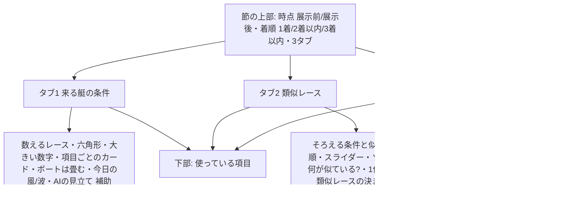

# アナロジー・ファインダー spec（モック Version 16 準拠）

種別: UI＋データ・分析機能（集計バッチ・DB・寄与度用モデルの集計を含む）
対応Linearチケット: BOA-271（関連: BOA-635 予想の過去発生率チェック、BOA-627 時点付きスナップショット、BOA-523 実進入の欠落、BOA-279 事故情報、BOA-430 思考アシスト）

- 承認: ユーザーがモック Version 16 を承認（2026-10-04、[mock/APPROVED.md](./mock/APPROVED.md)。承認範囲・375/1440px の画像）。この spec は承認版の画面を正とする
- 経緯: 2026-10-02 までの版（寄与度 FR-1・レースごとの寄与度 FR-1b・層別 S* の類似レース FR-2・組み合わせ FR-3）は `git show fa61e6213:docs/design/analogy-finder/spec.md`。何を変えたかは末尾「旧版からの変更」。当初の想定と分析の結果の対応は [assumptions-vs-findings.md](./assumptions-vs-findings.md)
- BOA-271 の見せ方は細部までユーザーが直接決める（代理判定・自動マージなし）。書き直しで出た確認事項 Q1〜Q7 は、2026-10-04 にユーザーが「全部推奨で」と回答した。T1 の分析と「向き」の計算で出た Q-A〜Q-E は、2026-10-05 にユーザーがファンパネルに委任して決めた（Q-D・Q-E は文言を直して採用）。どちらも末尾「決定事項」

## 位置づけ

- 龍神レーダーは、ブラックボックスの予想をなるべくしない。過去のデータで「どうだったか」を見える化して、舟券予想の一助にする（2026-10-03 ユーザー）
- 画面の主役は**数えた値**（過去の実際の結果の件数と割合）。AI（寄与度用モデル）は「AIの見立て（補助）」に縮め、畳んで出す
- 予想（結論・本命・買い目）を組み立てるのはユーザー。本機能はその材料を出す
- 置き場所: レース詳細の AI予想タブ内の節「アナロジー・ファインダー」（2026-10-01 ユーザー回答 Q1。既存の展開予測・イン崩れ注意度・的中表示は残す）
- サイト内の文言に「AI がやらないこと」のような言及は書かない（2026-10-01 ユーザー指示）。既存の免責文は残す

## 節の構成

## 共通の定義

### 時点（展示前／展示後）
- 展示前（出走表）: 出走表と前日までの成績で出す。展示タイム・天候・風・波は使わず、画面にも出さない
- 展示後（直前情報も）: 展示タイム・天候・風・波を足して出し直す。展示後の段（類似レースの並べ直しと今日の展示の値）が保存されるまでは選べない
- 既定: 展示後が選べれば展示後、選べなければ展示前
- 欠場: 出走表の後に欠場が分かったレース（2026-09-20〜10-03 で 0.73%、1日約1レース）は節を出さず、1行「欠場があったため、このレースのアナロジー・ファインダーは出していません」（Q5。6艇の値・類似レースは6艇で作っているので、そのままでは使えない）
- 発走後・確定後も、発走前に保存した値を出す（後述「時点の固定」）

### 着順
- 1着／2着以内／3着以内。タブ1・タブ2で共通。タブ3では出さない（タブ3は 1着の艇・3着以内の艇を並べて出す）
- 文言: 1着は「1着になった」、2着以内・3着以内は「〜に入った」（日本語の直し 9）

### 母集団と期間
- 母集団: 2019-04-01 から前日までの完全レース（6艇が出走表に載り、出走前の欠場が無く、結果あり・中止/不成立でない・1着が1艇）。長期は kb_archive（〜2025-12-02）、以後は本体
- レース中の返還（F・L・発走後の欠場扱い）があったレース: タブ1・タブ2は含める（着順のある艇で数える）。タブ3は除く（進入・スリットが壊れるため）。件数が合わないことを脚注に書く
- 3連単の払戻は本体の `race_results.payout_trio`（列名と券種が逆。`payout_trifecta` は3連複）、長期は kb の3連単
- 期間の表示: 「2019/4/1〜{前日}」。日付はすべて「2019/4/1」形式

### 優勝戦・準優勝戦の判定（v2。モックから直すこと、handoff §19・T1-1）
- 判定は名前のルールだけで行う（朝の時点の今日のレースと母集団で同じ判定になるように）。名前は NFKC で正規化する。上から順に最初に当てはまるもの:
  1. 「準々」「準優進出」を含む → どちらでもない（準優進出戦は準優勝戦に含めない。今のサイトの規則と同じ。Q-C(3)）
  2. `準優勝?戦`・「準決」・「セミファイナル」を含む → 準優勝戦
  3. 次のどれか → 優勝戦
     - 「優勝戦」「決勝戦」「王座決定戦」「賞金女王決定」「王将位決定戦」を含む
     - 「ファイナル」を含み、「進出」も「ファイナル選」も含まない
     - 空白を除いた末尾が「優」か「優勝」で、「準優」を含まない（長期の名前は6文字で切れ、「〜優勝戦」の「戦」が落ちたものがある）
  4. それ以外 → どちらでもない
- 長期（kb_archive）も名前を先に見る: 名前で 1→2→3 を当て、どれにも当たらないときだけ `stage_kind` を使う（final → 優勝戦、semifinal → 準優勝戦）。名前が1（準優進出など）に当たれば `stage_kind` が semifinal でも準優勝戦にしない（今の学習の `round_from_kb_kind` は `stage_kind` だけを見るので、「〜優」「決勝戦」などを取りこぼし、準優進出戦を準優勝戦にしている。長期で名前と食い違うもの 1,533件）
- 名前で決められないものに例外の規則を足さない: 関ヶ原決戦（2023-07-30 浜名湖12R）・オオムラGP（2020-01-01 大村12R）は、節の流れからは優勝戦に読めるが優勝戦にしない（Q-C(1)(2)）
- 正は [analysis/t1/t1-1-stage-rule.json](./analysis/t1/t1-1-stage-rule.json) の `rules`（v1＋`v2_extra`）と `consistency_check_strings`（82件の名前と答え）。実装はこの82件で JS・Python の一致を検査する
- 各節の最終日の12R との照合は検査（pytest）にだけ使う。名前のルールで優勝戦にならない最終日12R を一覧にして、ルールの漏れを見つける（v2 で 31/6,251件、0.50%。残りは同じ日の11R に優勝戦がある節の選抜戦など）
- この判定は、タブ1の範囲・タブ2のそろえる条件・タブ3の範囲・寄与度用モデルのラウンド特徴量（`features.py` の `round_from_stage`・`round_from_kb_kind`。学習側が同じ規則にそろえる）で同じものを使う。JS（`raceStageConfig.js`）と Python を固定の文字列で一致検査する
- `raceStageConfig.js` はサイト全体の優勝戦のバッジと今節の得点（seriesPoints）の分類にも使われているので、名前のルールを広げるとそちらの表示も変わる（本体で6レース。準決勝戦 2、決勝戦・王将位決定戦・県内選手権優・賞金女王決定 各1。意図した変更として扱い、該当画面を E2E で確かめる）
- 受入基準: 6艇ともA1の優勝戦で、旧判定が取りこぼしていた22R（3.7%）が優勝戦に入る（T1-1 で 22/22 を確認済み）。82件の一致検査が JS・Python とも通る

### 数えるレース（範囲）
「級別の組み合わせ」＝6艇の級別の構成（艇番を問わない。例「A1が2艇・A2が1艇・B1が3艇」）。そこに**選んだ艇の級別**を合わせる（Q1）。タブ1は艇番ボタンで選んだ艇、タブ3は1号艇（1号艇の1着率を軸に見るため）。

| 記号 | 名前（画面） | 中身 | 出すタブ |
|---|---|---|---|
| VC | {会場}・{組み合わせ}（{艇番}号艇は{級別}） | 今日の会場で、級別の組み合わせが今日と同じで、選んだ艇番の級別も今日と同じレース。6艇とも同じ級別なら名前は「{会場}・6艇ともA1」 | 1・3 |
| NC | 全国・{組み合わせ}（{艇番}号艇は{級別}） | 全国で、VC と同じ条件のレース | 1・3 |
| NCR | 全国・{組み合わせ}（{艇番}号艇は{級別}）の{優勝戦/準優勝戦} | NC のうち、ラウンドが今日と同じもの。今日が優勝戦・準優勝戦のときだけ出す | 1・3 |
| VA | {会場}の全レース | 今日の会場の全レース | 1・3 |
| VG | {会場}のG1 | 今日の会場の G1 以上。今日が G1・SG のときだけ出す | 3 |
| NA | 全国の全レース | 全国の全レース | 3 |

- 既定は VC（統計の検証 第8回 指摘1）。VC が300件未満なら既定を NC にし、範囲の下に1行「{会場}で同じ組み合わせのレースは{n}件と少ないので、全国で数えています」を出す（VC は選べるまま）。タブ1で艇番を変えると、範囲の条件（選んだ艇の級別）と既定も選び直す
- 級別のカードは出さない（選んだ艇の級別をそろえているので差がつかない）。6艇とも同じ級別のときだけ、承認版どおり「級別: 今日は6艇とも{級別}なので差がつかない」の1行を出す
- 実測（2025-06 以降のレースについて、そのレースより前の母集団で数えた件数。design-reviewer の再計算）: 会場×組み合わせ×1号艇の級別は中央値333件、300件未満46%、100件未満16.7%（約半数のレースで既定が NC になる）。会場×組み合わせ（艇番を問わない）は中央値667件・300件未満23.9%、全国×組み合わせは300件未満 約0.5%。全国×組み合わせ×選んだ艇の級別の件数は実装の最初に測る（T2-2）
- 選んだ艇の級別を合わせる理由: 級別がそろうレース（6艇とも同じ級別）は直近で7.4%しかない。残りのレースで組み合わせだけを合わせると、「選んだ艇がA1のレース」と「B1のレース」が混ざり、大きい数字（その艇番の率）が今日の艇の級別とずれる（会場×組み合わせの中で1号艇の1着率を1号艇の級別で分けた差は加重平均 9.3pt、p90 21.5pt）
- タブ1の数えるレースは VC・NC・NCR・VA の4つ、タブ3は6つ（承認範囲どおり）

### ぶれ幅・件数の扱い
- ぶれ幅は Wilson の95%区間。画面の言い方は「ぶれ幅」（「95%の幅」「ひげ」とは書かない）。凡例「棒の横線＝件数が少ないときのぶれ幅（だいたいこの間に入る）」
- 使っている項目に「ぶれ幅は1レースずつ別々に起きたとみなした計算。似たレースは同じ会場・同じ節に偏るので、実際はもう少し広い」と書く
- タブ3: 30件未満の集まり（①の型、④の結果）は割合を出さず「N件（少ないので1着率は出さない）」とし、④は1件ずつの一覧を出す。タブ1・タブ2は件数が少なくても割合を出し、ぶれ幅と件数を添える。タブ2は表示件数が30件未満なら「{n}件だと割合はぶれやすい（ぶれ幅が広い）」を出す
- タブ3の③は、50件未満のセルを薄くし、値「36%（16/45）」に「少ない」を添える（値は消さない）
- 割合の桁: 大きい数字・よく出た3連単は小数1桁、ほか（カード・棒・決まり手・吹き出し）は整数
- 割合は件数÷n（平滑化しない）。件数は常に添える

## FR-A 来る艇の条件（タブ1）

見出し「{艇番}号艇が{着順}のは、どんなとき？」（例「1号艇が1着になったのは、どんなとき？」）。

- A-1 艇番: 1〜6 のボタン。既定は1号艇（実際の結果の艇を既定にしない）
- A-2 2艇比較: 「もう1艇と比べる」を開くと、比べる艇番を1つ選べる（自分と同じ艇番は選べない）。各カードに「{比べる艇}号艇の場合: 一番高いとき7%／一番低いとき6%（{比べる艇}号艇の全体の1着率8%）」。0件は「—」
- A-3 数えるレース: VC・NC・NCR・VA（共通の定義）
- A-4 項目: 今節の平均着順点（前日まで）・展示タイム（展示後だけ）・当地勝率・全国勝率・平均ST（直近30走）・直近30走の1着率・モーター2連率・ボート2連率（畳む）。級別のカードは出さない（共通の定義「数えるレース」）
  - 今節の平均着順点（前日まで）: そのレースの前日までに、同じ選手が同じ会場の同じ節で走ったレースの着順点（1着10・2着8・3着6・4着4・5着2・6着1。F・L・失格は0点で回数に入れる。欠場・中止は数えない）の平均。準優勝戦も含める。同じ日の前の走は含めない（Q6。朝の時点の今日の値と母集団で定義をそろえるため。モックは同じ日の前の走を含めていたので、数字は出し直す）。公式の得点率とは別物。節の初日は値が無い（数えない）。定義のもとは [mock-v16/series-score.md](./mock-v16/series-score.md)（as-of だけ変える）
  - NCR が優勝戦のときは今節の平均着順点を出さない（優勝戦の枠は準優勝戦までの成績で決まり、点の順位がほぼ枠と同じになる。第9回 指摘2）。脚注に理由を書く
  - 直近30走の1着率・平均ST（直近30走）・今節の平均着順点（前日まで）は、どれも前日までの走（同じ日の前のレースは含めない。`features.py` と同じずらし方）。2025-06 以降、同じ日の2走目以降は全走の37.9%ある
  - 節の序盤の注記（Q-D、T1-2）: 今日の6艇のうち前日までの走が3走未満の艇がいるときだけ、今節の平均着順点のカードに「節の序盤（前日までの走が少ない艇がいる）は、差が小さめに出やすい」を添える。過去のレースは走数で絞らない（絞ると VC が300件未満のカードが 52%→75% に増え、既定が全国に寄る）。節の初日（6艇とも前日までの走が無く、値が無い）と、今日が優勝戦・準優勝戦の日（下の注記を出す）は添えない
  - 今日が優勝戦・準優勝戦のときは、範囲を問わず今節の平均着順点のカードの「今日の一文」を出さず、カードの中に「優勝戦・準優勝戦の日は、点の順位がほぼ枠の順になるので、今日の一文は出していない」と書く（カードの率は出す。Q7）。優勝戦の枠は準優勝戦までの成績で決まるので、今日の点の順位がほぼ枠の順になる（例のレースは前日までの値でも枠の順と同じ見込み。モックの値は 8.67・8.33・8.00・7.71・7.33・6.67）
- A-5 六角形: 軸は A-4 の項目（展示前は展示タイムを除く）。実線は今日のその艇の6艇中の順位、点線は「{範囲}で、{艇番}号艇が{着順}のときの平均の順位」。外側ほど上位。ラベル「全国勝率6艇中6位」
- A-6 大きい数字: 「{範囲}で、{艇番}号艇の{着順}率」と割合・件数・期間
- A-7 項目ごとのカード
  - 「6艇で一番{良い}とき」「6艇で一番{悪い}とき」の率と件数。「良い」の言い方は項目ごと（高い／速い／早い）
  - 同じ値の艇は、一番良い・一番悪いの両方に含める（第8回 指摘4）。中間の2〜5位は min 順位
  - 6つの順位の棒（上に%、下に「1位（高い）…6位（低い）」）。点線は範囲全体の率。今日の位置の棒を枠で囲む
  - 判定（3段階）: 一番良いときと一番悪いときのぶれ幅が重なる →「差ははっきりしない」。重ならず差が5ポイント以上 →「差が大きい」、5ポイント未満 →「差は小さい」。逆向き（悪いときのほうが高い）は「（一番{悪い}ときのほうが高い）」を添える
  - 並び: 差がはっきりしているもの（重ならない）を先に、その中は差の大きい順。はっきりしないものはその後に差の大きい順。近い差は入れ替わりうると説明文に書く
  - 今日の一文: 「今日の{艇番}号艇は{項目}が6艇で一番高い（今日8.67、6艇は6.67〜8.67）。同じ条件の{艇番}号艇は、過去に76%が1着（205/270件、ぶれ幅70〜81%）」。中間なら「高いほうから3番目（3艇が同じ値。今日27%、6艇は23〜50%）」。今日の値が無い項目は一文を出さない
  - 説明文: 「各項目が6艇で一番良かったとき・一番悪かったときの{着順}率を比べた。差がはっきりしている順に並べている（項目どうしは重なっていて、どれが効いたかまでは分けられない）」
- A-8 ボート2連率: 一番下に畳む。見出し「ボート2連率（着順との関係が小さい項目）」。中の注記「（参考: 全国・6艇ともA1で見ると）ボート2連率が一番高いとき・低いときの差は2着以内・3着以内で0〜3ポイントで、モーター（4〜8ポイント）より小さい。気にしすぎなくてよい項目」（ユーザー決定 2026-10-04。数値は実装時に全国の値で出し直す）
- A-9 今日の風・波: 展示後だけ。「今日の風・波（風{x}m・波{y}cm）に近いレースでは」。会場の全レース（VA）で、今日と同じ風速区分（0〜1m／2〜3m／4〜5m／6m以上）のレースの、各艇番の{着順}率と「（風を問わず{z}%）」。点線は会場の全レース。追い風・向かい風は区別しないと書く。この区分（0〜1m／2〜3m／4〜5m／6m以上）は、類似レースの「風速」の区分（0〜2m／3〜4m／5m以上）と違う（承認版どおり。使っている項目に両方の区分を書く）。展示前は「今日の風・波は、展示の後に出る」
- A-10 AIの見立て（補助）: FR-E
- A-11 脚注: 数えるレースの説明、今節の平均着順点に序盤の値が入ること（過去の序盤のレースでは差が小さめに出る。T1-2）、「数えた割合で、原因とは限らない」、判定の定義、同じ値の扱い、2025年11月より前の展示タイムの記録元の違い
- 受入基準: 艇番・着順・数えるレース・時点の切り替えでカードの率・件数・並び・六角形・大きい数字が変わる。同じ値の艇が一番良い・悪いの両方に入る。判定の3段階が定義どおり。展示前に展示タイムのカードと風・波が出ない。NCR（優勝戦）で今節の平均着順点が出ない。前日までの走が3走未満の艇がいる日（初日・優勝戦・準優勝戦の日を除く）だけ序盤の注記が出る

## FR-B 類似レース（タブ2）

方式: **そろえる条件で絞った層の中を、寄与度用モデルが重く見る項目で重み付けした距離の近い順に並べる k-NN**（2026-10-03 ユーザー決定 §13「k-NN とスライダーに戻す」、2026-10-04 決定 §19「優勝戦・G1以上もそろえる」）。

- B-1 そろえる条件（必ず一致）: 1号艇の級別・1号艇と勝率トップの勝率差（5段階、境界 −1.91／−1.14／−0.49／+0.19）・勝率トップの艇番（同率は艇番の小さいほう）。加えて、今日が優勝戦・準優勝戦ならラウンド、今日が G1・SG なら「G1以上」。グレードは G2 以上には広げない（件数が少なくてよい）。グレードが不明のレースは、グレードをそろえる層に入れない
- B-2 似ている順: 距離は寄与度用の本番モデル（1着）の SHAP の大きさで重み付けしたユークリッド距離（[mock-v16/knn_build.py](./mock-v16/knn_build.py) の作り方。数値は母集団で標準化し欠損は0、カテゴリは one-hot、艇番は次元にしない）。会場が違うレースには距離にペナルティ λ を足す（λ＝L/4、MD-6）
  - 展示前: 出走表時点の項目だけ（展示タイム・天候・風・波を使わない）
  - 展示後: 展示タイムの差・天候・風・波を足す
- B-3 説明文（前半の「…がそろう過去レース{n}件」は BOA-635 と同じ関数で作る。plan「BOA-635 との接続」）: 「今日と同じ『{ラウンド・グレードでそろえた条件。例: G1以上の優勝戦}』で、1号艇の級別・1号艇と勝率トップの差・勝率トップの艇番がそろう過去レース{n}件を、出走表が似ている順に並べた。展示後は展示タイム・天候・風・波も見ている」。ラウンド・グレードでそろえない日（予選など）は「今日と同じく、1号艇の級別・…がそろう過去レース{n}件を…」にする。{n} は層の件数。優勝戦の判定を直す前は「※優勝戦以外の名前の決勝（〇〇王座決定戦など）はまだ入れていない」（判定を直したら消す）
- B-4 スライダー: 件数の段 10・20・30・50・75・100・150・200・300・400・600・800 のうち層の件数未満のものと、最後に層の件数（800件を超える層は800）。既定は400（層がそれより少なければ層の件数）。両端「少なく｜多く」、下に「一番遠い{n}件目でも、{a}項目中{b}項目が同じ・{c}項目が近い」。スライダーはタブ2の中だけ
- B-5 ソナー: 中心が今日、点が類似レース（似ている順の何番目かで中心からの距離。輪は何番目かの目安）。扇は1着になった艇の方向・色。点を長押し（パソコンはマウスを重ねる）でレースの情報、タップでそのレースを「1件ずつ見比べる」で開く
- B-6 何が似ている？（折りたたみ）: 項目ごとに「{n}件のうち今日と同じだったレースの割合（近いも含め）」。半分以上を上、「そろっていない（半分未満）」を下。そろえた条件の項目は出さない（全件そろうため）。下に「近さで重く見た順: …（AIが重く見る項目で近さを決めている）」
  - 全33項目の表（さらに折りたたみ）: 列「項目（今日の値）｜同じ（n件中）｜近いも含む｜全レースで同じ割合」。「同じ」「近い」の基準は項目ごと（日本語の直し 24〜26 の文言。例「6艇の平均STが、平均して0.02秒以内の差」）。近さの計算に使わない項目（最終日かどうか）は「—」
- B-7 1件ずつ見比べる（折りたたみ）: 似ている順の各行に「日付 会場 R」「グレード ラウンド」「同じ{a}・近い{b}・違う{c}」と1〜3着の艇番。行を押すと今日と全項目を並べる（○同じ △近い ×違う）。着順は「3-1-4（全艇: 1号艇2着・…）」、ST順は「1号艇から 1/2/2/5/2/6」、進入は「123/456」
- B-8 類似レースの決まり方（スライダーの件数で数える）
  - どの艇が勝った？: 艇番ごとの割合・件数とぶれ幅の横線。点線は「比べる相手」＝そろえる条件からグレードを外した層（今日が G1・SG でなければ、ラウンドを外した層）。凡例に名前と件数を書く（例「点線: グレードを問わない優勝戦（ほかの条件は同じ）76件」）。棒をタップすると吹き出し「4号艇: 14件中1件（7%、ぶれ幅1〜32%）。全国10%・グレードを問わない優勝戦13%」
  - 件数が少ないとき「{n}件だと割合はぶれやすい（ぶれ幅が広い）」。層の全件を出しているときは「条件がそろった過去レースの全件を出している」
  - どう決まった？: 決まり手6分類の割合・件数
  - 上の棒かソナーの扇を押すと、その艇が勝ったときに絞って「着順の流れ」を描き直す
  - 着順の流れ（サンキー）: 1着→2着→3着の3段を常に出す。帯の太さ＝件数、少ない流れも薄く全部描く。帯・四角をタップで件数。「すべて／1号艇以外が勝ったレース」の切り替え。2着→3着の帯は1着の艇を問わずに数え、1着の四角をタップするとその艇が勝ったレースだけで描き直す
  - よく出た3連単: 上位3つ（割合・件数）と「残り{k}通りを見る（全{m}通り）」
  - 脚注: 「数えた割合で、原因とは限らない。似ているからといって、同じ結果になるとは限らない。AIが重く見る項目で類似レースを選んでいるので、AIの見立てと同じ向きになりやすい（別々の裏付けにはならない）」
- B-9 時点の固定: 展示前・展示後それぞれの「似ている順の上位（最大800件）」を、その時点で保存し、発走後も同じ結果を出す（BOA-627）
- 受入基準: スライダーで件数・ソナーの点・何が似ている？・決まり方が連動する。そろえる条件の値が説明文に出る。展示前後で並びが変わる（展示前は展示・天候を使わない）。サンキーが常に3段。比べる相手の名前と件数が凡例に出る

## FR-C 展開シナリオ（タブ3）

「もし進入がこうなって、スタートがこう並んだら」を過去レースで数える。上から順に選ぶと下が変わる。着順の切り替えは出さない。返還（F・L・欠場）のあったレースは除く。

- C-0 数えるレース: VC・NC・NCR・VA・VG・NA（共通の定義）。既定は VC
- C-1 ①進入はどうなる？
  - 型: どの進入でも／枠なり（既定）／前付けあり（1号艇イン）／1号艇がインを取られた。前付けありの下に「6号艇だけ・5号艇だけ・5・6号艇・その他」
  - 各型に出現率（数えるレースの全レースの中での割合）と1号艇の1着率。30件未満は「N件（少ないので1着率は出さない）」
  - 前付け＝艇番より内のコースに入った艇。スロー・ダッシュの別は記録が無いので分けないと書く
  - 展示後: 今日の展示の進入に当てはまる型に「今日の展示」の印。「今日の展示は、6艇とも枠なりだった。展示が枠なりだったレースの93%は、本番も枠なりだった（全国、2026/4以降の2,023レース）」のように、展示→本番の一致率を添える（値は実装時に出し直す）
- C-2 今日のスタートの手がかり（枠なりの型のとき）
  - 見出しの下「平均STの並び（予想ではなく、過去の記録）。進入が枠なりになった場合の手がかり」。①で枠なり以外を選んだら注意を出し、②の札を外す
  - 使う平均ST: 「このコース」（既定。各選手が今日のコースで枠なりだったときの直近30走の平均ST）／「全体」（コースを問わない直近30走）。F・出遅れの走は平均から除く（窓には数える）。このコースで5走未満の艇は「全体」で埋めて、その旨を出す
  - 絵: スリットの横並び（1艇身≒0.13秒）と、点線＝会場のそのコースを走った全選手の平均（級別を問わない）。「全体」のときは点線を出さない
  - 表: 行「このコース／全体／{会場}で（走数つき）／{会場}の全選手（コース別）／今日の展示（展示後だけ）」。平均STは3桁（.133）。展示の F は「F.09」と書き、意味を注記する。展示STと本番STの相関（艇ごと 0.08、平均ST は 0.28）を書く
  - 当てはまる条件（[slit-hint/slitpred2_hint.json](./slit-hint/slitpred2_hint.json) の8条件）: 今日の平均STで判定し、当てはまる条件を出す。「→ 過去、{形}になったのは19%（当てはまらないとき10%）」と件数。②の札は、当てはまったレースが30件以上で、当てはまったときの率が当てはまらないときより高く、両方のぶれ幅が重ならない条件にだけ付ける（下げる条件は「むしろなりにくい」、差がはっきりしない条件は札なしで率だけ。第10回・design-reviewer 指摘15）。率は②の数えるレースで数える（範囲を合わせる。全国で数えるときは「6艇ともA1より率が高めに出る」等を書く）
  - 条件を押すと②でその形を選び、選んだ形までスクロールする
  - 脚注: 「当てはまっても外れる方が多い（決め手ではなく手がかり）」、件数、F・出遅れのあったレースを除いたこと
- C-3 ②スタートはどう並ぶ？（スリットの形）
  - 7つの形（BOA-635 と同じ定義。[entry-slit/prep7.md](./entry-slit/prep7.md) の slit_rule）: 横一線／内3艇そろう／2コース凹み／カド受け凹み／カド一撃／イン凹み／ダッシュ勢先行。1つ選ぶ（「どの形でも」が既定）。形は重なりうる
  - 各形に絵、選んだ進入の中での割合・件数・1号艇の1着率
  - 7つの形は枠なりのときのカド（4コース）を基準に決めていると書く。カド・カド受けの説明
  - 展示の形との関係: 「展示で2コース凹みだったとき、本番も2コース凹みになったのは38%。展示が別の形でも27%…展示の形は少し参考になる程度（2026/4以降の2,280レース）」。展示後は「参考: 今日の展示の形は{形}」。展示の形に印は付けない（ユーザー決定 2026-10-04）
- C-4 ③攻めは決まった？（攻める艇と1号艇の着順）
  - ②で形を選ぶまでは「②でスリットの形を選ぶと、その形のときに攻める艇が勝ちきったか、1号艇が逃げたかが出る」
  - 攻める艇（枠なり）: カド一撃・カド受け凹み・ダッシュ勢先行→4号艇、2コース凹み→3号艇、イン凹み→2号艇、横一線・内3艇そろう→なし。説明は「この形のとき、外の艇で一番1着が多い艇（必ず攻めるという意味ではない）」。攻める艇が内の艇より0.05秒以上前に出た割合を添える（イン凹みは出さない）
  - 表: 攻める艇の1着率を、その艇の展示タイムの6艇中順位（1〜2位／3〜4位／5〜6位）とモーター2連率の順位で分ける。1号艇の逃げ率・2着以内率も同じ区分で。全セル「36%（16/45）」。50件未満は薄く「少ない」。全国・同じ組み合わせの同じ区分の率を並べる。上位と下位の差が2標準誤差に収まるときは「この範囲では、上位と下位の差ははっきりしない」
  - カド一撃は「4号艇の2着以内」「すぐ外の5号艇の1着」も出す。決まり手は勝ち数が30未満なら件数、0件の決まり手は出さない
  - 今日の艇の区分に印（展示タイムの区分は展示後だけ）。1号艇の表に「1号艇は展示タイムが速く出やすい（同じ選手でも1号艇のときに約0.02秒速い。展示で内を走る分などが考えられる）。展示タイムの順位が上位でも、その分を割り引いて見る」（Q-E、T1-5。分析で位置と測り方を分けられていないので、理由を断定しない。承認版の「全国で約半数」は1〜2位に入る割合で、言い方が曖昧なのでやめる）
  - 脚注: 形どうしの重なりの割合（例「カド一撃の73%はカド受け凹みにも当たる」）、②・④と件数がずれる理由（平均STが6艇そろうレースだけ）
- C-5 ④②の形のとき、どう決まった？（③の順位では分けていない）
  - 件数と「進入が枠なりだったレース（{範囲}の全レースの80%）」の説明。凡例「このシナリオ」「{範囲}の全レース」（点線）。形を選んだときの点線は「選んだ進入の型の全体（どの形でも）」（第8回 指摘6）
  - 1着になった艇・3着以内に入った艇（割合・件数・ぶれ幅）、どう決まった？（決まり手）、万舟（3連単1万円以上）の割合と範囲全体の割合、着順の流れ（サンキー、FR-B と同じ部品）、よく出た3連単
  - 30件未満は割合を出さず、1件ずつの一覧（日付・会場・R・進入 231/456・1〜3着・決まり手・3連単払戻）
  - 脚注: 「数えた割合で、原因とは限らない。スリットの形はレース後に分かるもので、『もしこうなったら』の参考。返還（F・L・欠場）があったレース{n}件を除くので、『来る艇の条件』の件数とは合わない」
- 受入基準: 範囲・進入・形を変えると下の件数・割合がすべて変わる。30件未満で割合が出ず一覧になる。手がかりの条件を押すと②の形が選ばれる。展示前に「今日の展示」の印・展示の形・展示の行が出ない。率を下げる条件に札が付かない

## FR-D 使っている項目（3タブ共通の下部）

折りたたみ「使っている項目（どの数字から出しているか）」。来る艇の条件・類似レース・展開シナリオそれぞれの、項目・出どころ（出走表／直前情報／過去のレース結果から計算）・期間（「数えた値は2019/4/1〜{前日}。AIの見立ては{学習期間}のデータで作った」）。類似レースは「必ずそろえる条件」「近さを測る項目（展示前/展示後でグループ分け）」「見比べには出すが、近さには使っていない項目」。展示前は「展示前は天候・風・波・展示タイムを使わず、見比べにも出さない」。

## FR-E AIの見立て（補助）

- タブ1の下に畳んで置く。見出し「AIの見立て（補助）: ほかの項目をそろえたうえで、どの項目が効くか」、副見出し「{艇番}号艇が{着順}かを左右しやすい項目」
- 量: 寄与度用モデルの SHAP を、テーマ・グループ単位で、レースの中で中心化してから艇番の中で中心化し、|値| の平均の構成比を取ったもの（2026-10-03 Version 14 の定義。枠は割合から除き、1号艇の格の分は枠に入れる）。艇番×着順ごと。全国・寄与度用モデルの評価期間で集計
- テーマ（7つ）: 選手の実力／スタート・展示／モーター・ボート／体重・年齢・地元／会場・レース番号／天候・水面／レースの条件。各テーマを開くと項目ごとの割合と向き（「6艇の中で全国勝率が高いほど見込みが上がる」「中堅の年齢で上がりやすい（若いほど・年配ほど、ではない）」「上がる: 徳山・大村・尼崎／下がる: …」など。計算は plan「向きの計算」）
- 向きがはっきりしない項目は「向きははっきりしない」と書く。次のどれも「はっきりしない」にまとめる: 値と効き方の順位相関が弱いもの、日単位のブートストラップ200回で同じ向きになった回が8割未満のもの（Q-A）、両端で上がる形（Q-B。2026-10-02 の版の実データ270組で0件）
- 説明: 「AIが『この艇番の勝ちやすさを動かしているのはどの項目か』を見た割合（AI予想とは別の分析）。大きいほど、その項目しだいで結果が動きやすい」。脚注に、割合の作り方、期間・レース数、1号艇の格の扱い、数えた値と向きが逆になることがある旨（例: 級別・モーター）、「原因の断定ではない」
- 「寄与度」「モデル」という語は画面に出さない
- 展示前: 出走表時点のモデルの集計があれば出す。無ければ「展示前のAIの見立ては準備中。展示後に切り替えると見られる」の1文だけ（見出し・説明文も隠す）
- 数えるレースの切り替えには連動しない（全国の値。Q3）
- 受入基準: 艇番・着順で割合が変わる。テーマを開くと項目と向き（はっきりしない項目は「向きははっきりしない」）が出る。画面に「寄与度」「モデル」が無い。展示前で集計が無いとき準備中の1文だけが出る

## 時点の固定（BOA-627）
- タブ2の似ている順（展示前・展示後）と、タブ1・タブ3で使う今日の値（6艇の項目の値と順位、平均ST、展示の進入・形）は、その時点で保存し、発走後・確定後も同じものを出す
- 数えた値（タブ1・タブ3の集計）は、保存した時点の母集団の最終日以前で数える（発走後に今日の結果が混ざらない）

## スコープ

### やること
- FR-A〜FR-E と時点の固定、優勝戦の判定の拡張、それらのデータ（集計・類似レースの候補・今日の値）を作るバッチと API
- 寄与度用モデル側の変更（7テーマ、Version 14 の集計の定義、出走表時点のモデルの集計）は学習側レーンと分担する（plan）

### やらないこと
- AI予想タブの既存表示の置き換え・撤去（次の spec「AI分析タブ全面改修」）
- レースごとの寄与度（旧 FR-1b）。作るのをやめる（Q2）。JS の TreeSHAP（#1177）はコードとして残し、表 `analogy_race_contributions`・展示後の再計算・日次の特徴量ジョブの本番化（127・128 の適用）は行わない
- 旧 FR-1 の条件ごとの寄与度の画面（会場・グレード・ラウンドのスライス、レーダー＋テーマ別の棒、艇番比較。実装済みの部品はフラグで非公開のまま）
- 層別 S* の条件チップ・「ほかのテーマでも絞る」
- 事故情報を使った計算（BOA-279 解消後）
- スロー・ダッシュ（記録が無い）、追い風・向かい風の区別（会場ごとのコースの向きのデータが無い）
- 会員登録・設定の保存（選んだタブ・艇番などは保存しない）

## 非機能要件
- モバイル 375px で横スクロールなし（`npm run test:layout` の5幅）。全33項目の表・③の表は 375px で表の幅＝画面の幅になるよう列を詰め、折り返す
- 用語ルール（画面内で「競艇」禁止）、`design-tokens.css` のトークン、`!important` 禁止。和文と英数字の間に空白を入れない（日本語の直し 3）
- i18n: 翻訳対象（AI予想タブと同じ扱い、4言語）。日本語を先に作り、他言語は同じキーで用意する
- 表示の応答: タブを開いてから2秒以内（集計は事前に作り、API は読むだけ。30件未満の一覧と類似レースの並べ直しは API で行う）
- 新しい集計を含むため、実装後に `data-accuracy-verifier` でデータ精度を検証する。モックの数字（例のレース 2026-09-27 若松12R）を本番の実装で再現できることを受入の一部にする

## 実装で直すこと（モックでは未対応。handoff §19・§20、検証 第9〜11回の残り）
1. 優勝戦の判定（共通の定義）。類似レースの層（G1以上の優勝戦）を作り直す（ルールは T1-1 で v2 に決定。上の「優勝戦・準優勝戦の判定」）
2. 展示 F の ST は DB に正の数で入っている（早く越えた秒数）。判定では負にする
3. 今節の平均着順点: 走数で過去を絞らない。今日3走未満の艇がいる日に注記を添える（T1-2・Q-D で決定。FR-A A-4）
4. 返還レースの除外がカド一撃の4号艇の1着率を高めに出している可能性（第10・11回）: 記録だけ（T1-3。+0.4pt 程度で 2pt に届かない。画面は変えない）
5. 手がかりの条件のしきい値（.01／.02／.03）: 6条件とも今の値を残す（T1-4）
6. 1号艇の展示タイムが系統的に速い理由: 同じ選手・同じ節でも1号艇のとき約0.017秒速い（位置か測り方かは分けられない）。③の注記を直す（T1-5・Q-E で決定。FR-C C-4）

## 決定事項（2026-10-04 ユーザー回答「Q1〜Q7は全部推奨で」）
書き直しとレビューで出た確認事項。すべて推奨の案で決まった（本文に反映済み）。
| # | 問い | 決定（推奨の案） | 根拠 |
|---|---|---|---|
| Q1 | 級別がそろっていないレース（直近の92.6%）の「数えるレース」の作り方 | (a) 艇番を問わない構成＋選んだ艇の級別をそろえる（例「A1が2艇・A2が1艇・B1が3艇で、1号艇がA1」）。会場で300件未満なら既定を「全国・…」にし、その旨を1行出す。級別のカードは出さない（選んだ艇の級別をそろえているため） | 構成だけ（b）だと、選んだ艇がA1のレースとB1のレースが混ざり、大きい数字が今日の艇の級別と平均 9.3pt（p90 21.5pt）ずれる。(a) の件数は会場で中央値333件・300件未満46%なので、全国への切り替えが半数近くで起きる。全国×構成＋選んだ艇の級別の件数は実装の最初に測る |
| Q2 | レースごとの寄与度（旧 FR-1b、TreeSHAP の JS・展示後の再計算・表 `analogy_race_contributions`）を作るのをやめるか | やめる。JS の TreeSHAP（#1177）はコードとして残し、作り途中のタスク（T3c-2〜8）は中止。日次の特徴量ジョブ（127・128）も v16 では使わないので適用しない | 承認範囲に「このレースの6艇の差の内訳」が無い。AIの見立ては艇番ごとの集計で、レースごとの値を使わない。日次ジョブは一度も動いておらず、v16 は別の workflow にする（plan） |
| Q3 | AIの見立てを「数えるレース」の切り替えに連動させるか | 連動させない（全国の値のまま） | モックは全国の値。会場・級別の組み合わせで切ると件数が少なく、構成比が揺れる |
| Q4 | マイグレーション 120（層別 S* の母集団・スナップショット・RPC）を本番に適用せず、v16 用に置き換えるか。BOA-635 への影響の扱い | 置き換える。ただし BOA-635 のために、v16 のバッチが今日の各レースについて「層の全件の結果（新しい順、最大2,000件）」も作る（plan「BOA-635 との接続」）。BOA-635 の層（会場を含む4条件）と v16 の層（会場を含まず、ラウンド・グレード）が違う点は BOA-635 のレーンと決める。**2026-10-04 BOA-635 のレーンが合意**（会場を含まなくてよい。layer ファイルの形・読み出しの API・層の説明文の共用は plan「BOA-635 との接続」） | BOA-635 は 120 の母集団と `get_analogy_similar_races` を前提にしていて、発生率の分母がスライダーで変わってはいけない（BOA-635 の検証者の推奨）。似ている順の上位800件では分母が類似度の順位で決まる |
| Q5 | モックに無い状態の文言と扱い（展示前に「展示後」を押せない、展示後の並べ直し待ち、締切後も展示後が無い、類似レースの層が0件、保存の無い過去レース、取得の失敗、**出走表の後に欠場が分かったレース**） | screens.md「状態」の表の案。欠場は節を出さず「欠場があったため、このレースのアナロジー・ファインダーは出していません」の1行 | 承認版は例のレースだけ。失敗を感じさせる語は使わない（2026-10-02 決定）。欠場は 0.73% で、6艇の値を作り直すと母集団の定義（6艇）と合わない |
| Q6 | 今節の平均着順点の as-of | 前日まで（同じ日の前の走を含めない）に変える。名前は「今節の平均着順点（前日まで）」。tab1 の期待値（205/270 等）は出し直す | 朝の時点では今日の前の走の結果が無く、含める定義だと今日の値と母集団の値が食い違う。展示後に当日の前の走を足して計算し直す案もあるが、時点で値が変わり、ほかの項目（前日まで）とも定義がそろわない |
| Q7 | 今日が優勝戦・準優勝戦のときの今節の平均着順点 | 範囲を問わず、今日の一文を出さず「優勝戦・準優勝戦の日は、点の順位がほぼ枠の順になるので、今日の一文は出していない」と注記する（カードの率は出す） | 第9回 指摘2（NCR で出さない）の理由は、ほかの範囲にも当てはまる（design-reviewer 指摘10） |

### 決定事項（2026-10-05 ユーザーがファンパネルに委任して決定。Q-D・Q-E は文言を直して採用）
T1 の分析（[analysis/t1/t1-result.md](./analysis/t1/t1-result.md)）と plan「向きの計算」で出た確認事項。結論はファンのロールプレイの仮説で、検証はモックと公開後の実データで行う。
| # | 問い | 決定 | 根拠 |
|---|---|---|---|
| Q-A | AIの見立ての向きに揺れの確認を入れるか | 入れる。日単位ブートストラップ200回で同じ向きが8割未満なら「向きははっきりしない」 | 境目に近い向きが270組中19組あり、ぶれる向きを断定して見せない |
| Q-B | 両端で上がる形（若いほど・年配ほど上がる）を文にするか | 「向きははっきりしない」にまとめる | 実データ270組で0件。文を増やさない |
| Q-C(1)(2) | 関ヶ原決戦（2023-07-30）・オオムラGP（2020-01-01）を優勝戦にするか | しない（例外の規則を足さない） | 名前では決められず、各1件 |
| Q-C(3) | 準優進出戦などを準優勝戦に含めるか | 含めない（今のサイトの規則と同じ）。学習側の `round_from_kb_kind` もこの規則にそろえる | 長期 1,276件が食い違う。6艇ともA1 は0件 |
| Q-D | 今節の平均着順点の走数（T1-2、k*＝3） | 過去は絞らない。今日のレースに前日までの走が3走未満の艇がいるときだけ、カードに「節の序盤（前日までの走が少ない艇がいる）は、差が小さめに出やすい」を添える | 絞ると VC が300件未満のカードが 52%→75%。日目の効果と分けられないので、絞っても「序盤の粗さ」だけを除いたことにならない |
| Q-E | ③の1号艇の表の注記（T1-5） | 「1号艇は展示タイムが速く出やすい（同じ選手でも1号艇のときに約0.02秒速い。展示で内を走る分などが考えられる）。展示タイムの順位が上位でも、その分を割り引いて見る」 | 選手の違いでなく位置・測り方の分（r≈1）。位置と測り方を分けられていないので理由を断定しない |

## 分析の限界
- 数えた値はすべて相関で、原因とは限らない。項目どうしは重なっていて、どれが効いたかまでは分けられない（画面にも書く）
- ぶれ幅は独立を仮定した Wilson 区間。同じ会場・同じ節のレースは独立でないので、実際はもう少し広い
- 類似レースは寄与度用モデルの重みで近さを決めるので、AIの見立てと同じ向きになりやすい（別々の裏付けにならない。画面にも書く）
- スリットの形はレース後に分かる途中経過で、今日の情報からは選べない。手がかり（平均ST）の当てはまりは相関 0.36 程度（6艇内の差の相関、[slit-hint/slitpred2.md](./slit-hint/slitpred2.md)）
- 寄与度用モデルの評価期間（test）は過去の方式選びで複数回見ている（旧版「分析の限界」）

## Phase M（寄与度用モデル。済み）
主モデル・MD-1〜MD-7 の結果は旧版の spec（`fa61e6213`）と [analysis/](./analysis/) にある。v16 で使うのは次の2つだけ。
- 寄与度用モデル（LightGBM、艇単位、1着・2着以内・3着以内）: AIの見立ての集計（FR-E）と、類似レースの距離の重み（FR-B）
- MD-6 の k-NN（会場ペナルティ λ＝L/4、L は cal で引き直す）: 類似レースの距離の作り方

## 旧版からの変更（fa61e6213 → この版）
| 旧版 | この版 |
|---|---|
| 節の中は縦の1本の流れ（寄与度 → 類似レース → 組み合わせ） | 3タブ（来る艇の条件／類似レース／展開シナリオ）と共通の時点・着順 |
| FR-1 条件ごとの寄与度（主役） | FR-E AIの見立て（畳んだ補助）。量は Version 14 の定義、7テーマ |
| FR-1b レースごとの寄与度（六角形・展示前後） | 作らない（Q2） |
| — | FR-A 来る艇の条件（数えた値。6艇で一番良い/悪いとき） |
| FR-2 層別 S*（条件チップ・自動の深さ・任意の3条件） | FR-B k-NN（そろえる条件＋似ている順・スライダー・ソナー・何が似ている？・1件ずつ） |
| FR-3 組み合わせ（サンキー・一覧・コールアウト） | FR-B の「類似レースの決まり方」と FR-C ④に吸収。コールアウトはやめた |
| — | FR-C 展開シナリオ（進入・手がかり・スリット7形・攻め・結果） |
| 30件未満も%を出す | 30件未満は%を出さず一覧（タブ3）。タブ1・2はぶれ幅で示す |
