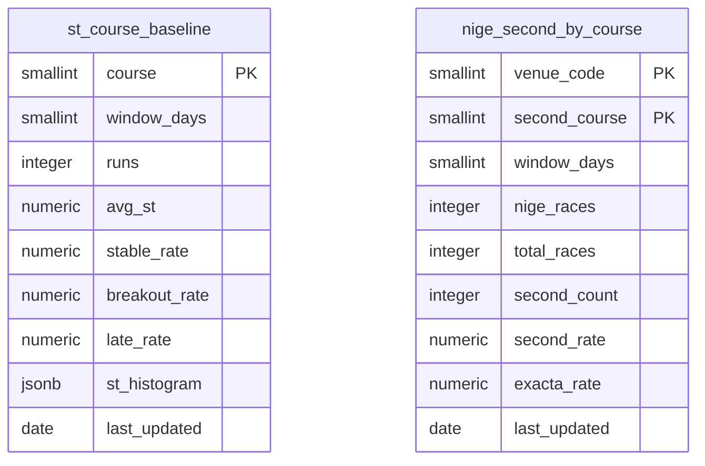

# レース詳細の可視化強化（phase a）plan

spec: [spec.md](./spec.md) / screens: [screens.md](./screens.md)

ADR: [ADR-0068](../../adr/0068-course-baseline-precomputation.md)（コース別ベースラインを日次バッチの事前集計にする）

マイグレーション案（すべて未適用）: [094](../../db-migration/094_course_baselines.sql)（新規2表）/ [095](../../db-migration/095_phase_a_numeric_public_read.sql)（数値3表の匿名公開）/ [096](../../db-migration/096_original_exhibition_public_read.sql)（オリジナル展示の匿名公開）

---

## 1. 全体のデータフロー

```
                        ┌──────────────── 日次バッチ（GitHub Actions、JST 00:50）
                        │  scripts/daily/update-course-baseline-stats.js
                        │    race_start_timings（365日・約242,000行）
                        │    race_results       （365日・約45,000行）
                        │      ↓ 1つの基礎CTEを共有
                        │    st_course_baseline      （6行 upsert）
                        │    nige_second_by_course    （最大120行 upsert）
                        └────────────────┘

レース詳細（/race/:raceId）
  │
  ├─ 既存: getRacerScopedRaceStats(racerId) × 6選手  ← 基本情報・直前情報タブと withCache 共有
  │        730日分。同一レースの全6艇の start_timing / is_flying と actual_course_1〜6 を取得済み
  │          ↓ サービス層で派生フィールドを付ける（DB読み取りは増えない）
  │        stNormalized / raceBestSt / innerMinSt / stRank
  │          ↓
  │        枠別情報タブ: コース別成績グリッド・ST考察・直近10走
  │
  ├─ 枠別情報タブを開いたとき（+2本）
  │    getStCourseBaseline()        → st_course_baseline      6行
  │    getNigeSimulation(venueCode) → nige_second_by_course    5行
  │
  ├─ 基本情報タブを開いたとき（+2本、FR-4c・FR-4d）
  │    getRacerPeriodStats(racerIds) → racer_period_stats      6行
  │    getRaceSeries(venueCode,date) → race_series             1行
  │
  ├─ モータ情報タブを開いたとき（+1本、FR-4a）
  │    getMotorPretestStats(venueCode,date) → motor_pretest_stats  最大約37行
  │
  └─ 直前情報タブを開いたとき（+1本、FR-4b）
       getOriginalExhibition(raceId) → race_original_exhibition(+_values)  6+36行
```

`RaceTabs` は非アクティブなタブの内容をアンマウントする（遅延マウント）。**タブごとに取得を分けることで、同時に増えるクエリは最大+2本**に収まる（[§6](#6-disk-ioとクエリ本数の見積り)）。

---

## 2. データ設計

### 2.1 新規テーブル（マイグレーション案 094）

ADR-0068の決定。どちらも事前集計の結果を持つ極小のテーブルで、画面は単純なSELECTで読む。

| テーブル | 主キー | 行数 | 用途 |
|---|---|---|---|
| `st_course_baseline` | `course`（1〜6） | **6** | ST考察の「同コース平均との差」の基準値。平均ST・安定率・抜出率・出遅率＋STの分布（0.05刻みのビンをjsonb） |
| `nige_second_by_course` | `(venue_code, second_course)` | **最大120** | 逃げシミュレーション。逃し時2着率・2連単確率・母数（会場別・直近1年） |

どちらもRLS有効・匿名はSELECTのみ・書き込みはservice_roleのみ（BOA-370のRLS規律）。076以降は新規テーブルの既定権限を剥奪しているため `GRANT SELECT` を明示する。

**既存の `nige_outcome_distribution`（027）は変更しない**。艇番基準・90日・3連単粒度でBOA-158のタブが使用中。理由と却下の経緯はADR-0068。

### 2.2 既存テーブルへの変更

**なし**。FR-0〜FR-3・FR-5はすべて既に匿名から読める7テーブル（`races` / `race_entries` / `race_results` / `race_start_timings` / `exhibition_data` / `race_odds` / `predictions`）の範囲で完結する。列の追加も不要。

### 2.3 匿名（画面）への公開（FR-4、マイグレーション案 095・096）

FR-4の4種はいずれも匿名のSELECT権限が無い（2026-09-23実測）。**ADR-0067との関係で2つに分けた**。

| ファイル | 対象 | ADR-0067への追記 | 前提 |
|---|---|---|---|
| **095** | `motor_pretest_stats`（FR-4a）／`racer_period_stats`（FR-4c）／`race_series`（FR-4d） | **不要** | 3表はいずれも数値・事実データで、ADR-0067の「現状維持」が扱う範囲（出走表・オッズ・結果・展示の数値）と同種。ただし**匿名への公開そのものはユーザー承認が要る**（086と同じ手続き） |
| **096** | `race_original_exhibition` / `_values`（FR-4b） | **必要** | 091（テーブル作成）が匿名の権限を意図的に剥奪しており、ADR-0067のBOATCAST追記に「値を画面に再表示する場合は、別途、ユーザーの承認と、出典の表記の設計が要る」と明記されている。**出典表記の実装とモック承認 → ADR-0067への追記 → 096の適用**の順で進める |

画面側は、**権限エラーを「セクションを出さない」として扱う**（ピットレポートで確立した扱い）。これにより095・096が未適用のままマージしても本番は無害で、適用の順序を画面のデプロイから切り離せる。

### 2.4 ER図

新規テーブルは既存テーブルへの外部キーを持たない（`venue_code` は既存の慣習どおりsmallintで、`venues` へのFKは張らない）。`race_start_timings` / `race_results` は集計の入力で、リレーションではない。



`npm run verify:er-diagram` は「新規テーブル・新規リレーションを導入するDDLを持つのにER図が無いplan.md」を検知する。上記の貼り付けで満たす。

---

## 3. サービス層（`src/services/supabaseDataService.js`）

### 3.1 `getRacerScopedRaceStats(racerId)` に派生フィールドを足す（追加クエリ0本）

この関数は既に、選手の730日分について**同一レースの全6艇**の `start_timing` / `is_flying`（`startTimingByKey`）と `race_results.actual_course_1〜6` をメモリに持っている。ST考察の3指標はここから算出できる。

**生の6艇分の配列を返り値に出さず、サービス層で派生値まで計算して返す**。理由は3つ。

- 返り値のサイズが増えない（730日×6艇のST配列を持つと、選手6人分で数万要素になる）
- Fの符号反転（`is_flying` なら `-start_timing`）を1箇所に閉じ込められる。3指標が同じ計算を各々書くと、片方だけ直し忘れる
- 展示タイム1位判定（`soleFastestBoatByRace`）と同じ要領で、既にレース単位の前処理を行う場所がある

返り値の各行（既存の `raceId` / `date` / `venueCode` / `boatNumber` / `startTiming` / `actualCourse` 等）に足すもの:

| フィールド | 内容 |
|---|---|
| `stNormalized` | 自艇のST。`is_flying` なら符号を反転した値。`start_timing` がNULLならnull |
| `raceBestSt` | そのレースの最速ST（正規化後）。安定率・出遅率の基準 |
| `innerMinSt` | 自艇より内側のコース（`course < 自艇のcourse`）の艇のうち、正規化後STの最小値。**1コースはnull**（内側艇が存在しないため抜出率を算出しない） |
| `stRank` | そのレース内でのSTの順位（1〜6）。直近10走の「(1位)」表示に使う |

`actual_course` が取れないレース（直近1年で3.6%）は `actualCourse` がnullになり、コース別の集計から自然に落ちる。

### 3.2 新規の純関数（`src/utils/stConsideration.js`）

`getRacerScopedRaceStats` の行配列を受け、コース別に3指標を返す純関数。**Fの符号反転はサービス層で済んでいるため、この関数は `stNormalized` / `raceBestSt` / `innerMinSt` を読むだけ**にする。

```
computeStConsideration(rows, { course })
  → { n, stableRate, breakoutRate, lateRate, avgSt }
```

- 安定率: `stNormalized - raceBestSt <= 0.05` の割合
- 抜出率: `innerMinSt != null && stNormalized <= innerMinSt - 0.07` の割合。`course === 1` は算出せず **null を返す**（0%と返さない）
- 出遅率: `stNormalized - raceBestSt >= 0.10` の割合
- n < 30 は呼び出し側が小標本として扱う（この関数はnを返すだけで、フラグの判断はしない）

単体で検証できる純関数にする理由: 定義（0.05 / 0.07 / 0.10 の閾値、内側艇の解釈）が仕様の中心で、実データとの突き合わせを繰り返すため。

### 3.3 追加する取得関数

| 関数 | テーブル | 行数 | キャッシュ |
|---|---|---|---|
| `getStCourseBaseline()` | `st_course_baseline` | 6 | `withCache`（日内で変わらないため長めのTTLでよい） |
| `getNigeSimulation(venueCode)` | `nige_second_by_course` | 5 | `withCache` |
| `getRacerPeriodStats(racerIds)` | `racer_period_stats` | 6 | `withCache` |
| `getRaceSeries(venueCode, date)` | `race_series` | 1 | `withCache` |
| `getMotorPretestStats(venueCode, date)` | `motor_pretest_stats` | 最大約37 | `withCache` |
| `getOriginalExhibition(raceId)` | `race_original_exhibition` + `_values` | 6 + 36 | `withCache` |

**すべてピットレポート（`getRacePitReport`）で確立した扱いに揃える**。

- 権限エラー（`code === '42501'` または `permission denied`）は `state: "forbidden"` を返し、画面はセクションを出さない
- 取得失敗は例外を投げる（「データなし」「対象外」に化けさせない。BOA-359）
- **終端でない状態（権限なし・未取得）は `fetchFailed: true` を付けてキャッシュさせない**。付け忘れると、095/096の適用後も最大7日間（`PAST_RACE_CACHE_TTL`）非表示のままになる。ピットレポートで実際に起きたバグクラス

---

## 4. コンポーネント構成

### 4.1 新規

| ファイル | 役割 | データ源 |
|---|---|---|
| `src/components/analysis/CrossTabGrid.jsx` + `.css` | **FR-0の共通クロス集計**。行軸・列軸・セル指標・n併記・小標本フラグをpropsで受ける。行ラベル列を `position: sticky; left: 0`、グリッド内だけ横スクロール | 呼び出し側が整形済みの2次元データを渡す（データ取得はしない） |
| `src/components/race/RaceStConsiderationCard.jsx` + `.css` | ST考察（3指標 × 6艇、値＋同コース平均との差）。ST分布・ST履歴を折りたたみで内包 | `getRacerScopedRaceStats` ＋ `computeStConsideration` ＋ `getStCourseBaseline` |
| `src/components/race/RecentRunsBar.jsx` + `.css` | 直近10走の帯（進入コース／着順／ST＋`(1位)`） | `getRacerScopedRaceStats`（`stRank` を使う） |
| `src/components/race/NigeSimulationCard.jsx` + `.css` | 逃げシミュレーション（横棒＋2連単確率）。`.lede-simple` / `.lede-detail` | `getNigeSimulation(venueCode)` |
| `src/components/race/VenueDaySummaryCard.jsx` + `.css` | 本日の成績サマリー（結果タブ・会場ページで共用）＋「この日の傾向 vs このレース」の一文 | `getVenueDaySummary(venueCode, date)`（既存）＋ `race_results.winning_technique` / `actual_course_N` |
| `src/utils/stConsideration.js` | 3指標の算出（純関数。[§3.2](#32-新規の純関数-srcutilsstconsiderationjs)） | — |
| `src/utils/courseBaseline.js` | ベースラインの整形・差分計算（純関数）。指標ごとに「高いほど良い／低いほど良い」の向きを持つ | — |

### 4.2 既存の変更

| ファイル | 変更 |
|---|---|
| `src/components/race/RaceWakuInfoTab.jsx` | 期間別グリッド（`CrossTabGrid`）・ST考察・直近10走・逃げシミュレーションを追加。**既存の「コース別成績（バー＋ドリルダウン）」カードを廃止**し、ドリルダウンをグリッドのセルタップに移す。冒頭コメントの「ST考察・逃げシミュレーションは自社DBに存在しない」「艇番＝コース前提」の記述を更新 |
| `src/components/race/RaceBasicInfoTab.jsx` | バー展開（`rbit-expanded-tabs`）に3つ目のタブ「条件別」を追加。初日／最終日（`race_series`）・波5cm超（`race_conditions` の波高）・前期（`racer_period_stats`）の行。選手名の隣にF数バッジ。**グリッド化はしない** |
| `src/components/race/RaceBeforeInfoTab.jsx` | 詳細テーブル（`buildBeforeInfoRows`）にオリジナル展示の行を追加。**本日の成績サマリーのカードを削除**（`getVenueDaySummary` の呼び出しも外す） |
| `src/components/analysis/MotorWakuStatsGrid.jsx` | 前検タイム・節時点の2連対率の列を追加 |
| `src/components/race/RaceResult.jsx` | 払戻一覧の下に `VenueDaySummaryCard` を追加 |
| `src/pages/VenueRaceListPage.jsx` | `VenueDaySummaryCard` を追加（`/venue/:venueCode` と `/races/:date/:venueCode` の両方が同じこのページ） |
| `src/components/analysis/VenueGradeMatrix.jsx`／`src/components/racer/RacerPerformanceStats.jsx` | `CrossTabGrid` に載せ替え（rule of threeの3例目。コピペを3つに増やさない） |
| `src/services/supabaseDataService.js` | [§3](#3-サービス層-srcservicessupabasedataservicejs) |
| `src/components/race/index.js`／`src/components/analysis/index.js` | barrel export |
| `src/components/race/termHints.js` | `stStable` / `stBreakout` / `stLate` / `nigeSimulation`（ja専用） |
| `src/locales/{ja,en,zh-TW,ko}/common.json` | 既存の名前空間に追加（`wakuInfo.*` / `basicInfo.*` / `result.*` / `beforeInfo.*`） |
| `e2e/smoke.spec.js` | 各カードの表示、グリッドの値とnの整合、権限なし時の非表示 |

### 4.3 デザイントークン

新規CSSは[screens.md §5.2](./screens.md)の4つ（クロス集計グリッド・直近10走の帯・横棒・ST考察の3列レイアウト）に限る。色・余白・角丸は意味トークン、差の符号は `--color-success-text` / `--color-error-text`、小標本は既存の `is-small-sample`、強調は金14%（1位）/ 金7%（2位）。

---

## 5. バッチ（`scripts/daily/update-course-baseline-stats.js`）

### 5.1 構成

1スクリプトで2表を更新する。**両者は同じ基礎CTE（Fを負値に正規化したST × 実進入コース）を共有する**ため、分けるとDBスキャンが2倍になる。

```
基礎CTE（直近365日）
  race_start_timings  → stNormalized = is_flying ? -start_timing : start_timing
  race_results        → actual_course_N を艇番→コースに展開
  窓関数              → raceBestSt（レース内最小）、innerMinSt（内側コースの最小）
    │
    ├→ st_course_baseline     コース別に 平均ST／安定率／抜出率／出遅率／STの分布（0.05刻み）
    └→ nige_second_by_course  winning_technique='逃げ' かつ1着艇のコース=1 のレースに絞り、
                              会場×2着コースで 2着率／2連単確率／母数
```

- 実行基盤: **GitHub Actions**（新規 `.github/workflows/aggregate-course-baseline-stats.yml`、JST 00:50）。Vercelを選ばなかった理由はADR-0068の却下4
- 既存の `scripts/daily/update-nige-outcome-distribution.js`（JST 00:42）の直後に置く。前日の結果が確定した後に走らせる
- `upsertChangedRows`（`scripts/lib/unchangedRows.js`）で**変更のある行だけ書く**（`.claude/rules/data-acquisition.md`）
- **0件書き込みをエラーとして扱う**。`st_course_baseline` は常に6行、`nige_second_by_course` は開催実績のある会場分が必ず出るため、0件は異常
- `continue-on-error` は付けない（ジョブ全体を成功に見せない）

### 5.2 完了の定義

本ジョブは**外部サイトを取得しない**（自社DBの集計のみ）ため、`.claude/rules/data-acquisition.md` の「完了の定義」A（期待件数）・B（タイミング）はそのままは当てはまらない。代わりに次で判定する。

- **件数**: `st_course_baseline` が6行、`nige_second_by_course` が「直近1年に1コース逃げが1件以上あった会場 × 2〜6コース」の行数（24会場開催なら120行）
- **整合**: `nige_second_by_course` の `second_rate` を会場ごとに合計して**100%±0.5**に収まる（2着は必ず1艇。全国での検算は済んでいる）
- **鮮度**: `last_updated` が当日（JST）。2日以上古ければ `scrape-monitor` の日次チェックで検知してSlack通知する（既存の `daily_overdue` と同じ枠組み）

---

## 6. Disk IOとクエリ本数の見積り

### 6.1 画面側（レース詳細1回の表示）

非機能要件は「現状から**+3本以内**」。

| タブ | 追加クエリ | 読み取り行数 |
|---|---|---|
| 枠別情報 | `getStCourseBaseline` +1／`getNigeSimulation` +1 | 6 + 5 = **11行** |
| 基本情報 | `getRacerPeriodStats` +1／`getRaceSeries` +1 | 6 + 1 = **7行** |
| モータ情報 | `getMotorPretestStats` +1 | 最大 **37行** |
| 直前情報 | `getOriginalExhibition` +1 | 6 + 36 = **42行** |

- **ST考察・直近10走・今節成績（FR-1・FR-3）は+0本**。`getRacerScopedRaceStats` が既に取得しているデータから算出する
- `RaceTabs` が非アクティブなタブをアンマウントするため、**同時に増えるのは最大+2本**（枠別情報タブまたは基本情報タブ）。要件内
- 全タブを順に開いた場合の累計は+6本だが、すべて `withCache` を通り、読み取り行数は合計100行未満

### 6.2 バッチ側（日次1回）

| 対象 | 読み取り | 書き込み |
|---|---|---|
| 基礎CTE（両表で共有） | `race_start_timings` 約242,000行 ＋ `race_results` 約45,000行 | — |
| `st_course_baseline` | （上記を共有） | 6行（変更のある行のみ） |
| `nige_second_by_course` | （上記を共有） | 最大120行（変更のある行のみ） |

**1日あたりの読み取りは約287,000行、書き込みは最大126行**。既存の `update-nige-outcome-distribution`（90日分の3連単集計）と同程度で、[BOA-357](https://linear.app/boat-ai/issue/BOA-357)（Disk IO Budget枯渇の対策）の観点では、画面側から同じ集計を毎回走らせる案（ADR-0068の却下1）に比べて桁違いに小さい。

---

## 7. 実装の順序

spec.mdの着手順に、前提関係を加えた。

| # | 内容 | 前提 |
|---|---|---|
| 1 | `CrossTabGrid`（FR-0）を作り、`VenueGradeMatrix`・`RacerPerformanceStats` を載せ替える | なし。**表示内容が載せ替え前後で変わらないことをPlaywrightで突き合わせる** |
| 2 | `getRacerScopedRaceStats` に派生フィールド（[§3.1](#31-getracerscopedracestatsracerid-に派生フィールドを足す追加クエリ0本)）／`stConsideration.js` | なし |
| 3 | マイグレーション094の適用（ユーザー承認）＋バッチの実装・初回実行 | 094 |
| 4 | 枠別情報タブ（FR-1・FR-6）: グリッド・ST考察・直近10走・逃げシミュレーション | 1・2・3 |
| 5 | 本日の成績サマリーの移設（FR-5）: `VenueDaySummaryCard` を切り出し → 結果タブ・会場ページへ → 直前情報タブから削除 | なし（並行可） |
| 6 | 基本情報タブ（FR-2・FR-4c・FR-4d）: 「条件別」タブ・Fバッジ | 095 |
| 7 | 今節成績（FR-3） | 2 |
| 8 | モータ情報タブ（FR-4a） | 095 |
| 9 | 直前情報タブのオリジナル展示（FR-4b） | **096＋ADR-0067への追記**（[§2.3](#23-匿名画面への公開fr-4マイグレーション案-095096)） |

- **4の前にモックの再確認をする**（[screens.md §8](./screens.md) の論点は全て決定済みだが、実装後の見た目はモックと差が出るため）
- 3つのマイグレーションは**いずれも適用がユーザー承認待ち**。094は新規テーブルなので画面より先、095・096は画面の実装・自己検証の後（ピットレポートの086と同じ順序）
- 9は他と独立させる。ADR-0067の追記というユーザー判断が挟まるため、他のFRを待たせない

## 8. 未確定のまま残るもの

spec.mdの未確定事項のうち、`/step2` で決めず `/step3` 以降に回すもの。

| # | 項目 | いつ決めるか |
|---|---|---|
| 1 | ~~`racer_aggregated_stats.courseRaceCounts` の他の利用箇所への影響~~ → **`/step3` で確定**（2026-09-23）。他に4箇所（`raceIndicators.jsx` の「枠番勝率」行・`RaceCardDataTable`・`AttackDefenseTable`・選手ページの `RacerPerformanceStats`）が独立に読んでおり、枠別情報タブが使わなくなっても壊れない。ただし**同じサイト内で艇番基準と実進入コース基準が混在する**。横断課題として既に [BOA-302](https://linear.app/boat-ai/issue/BOA-302) が起票済みなので重複起票せず、T3-1でグリッドに「実進入コース基準」と注記する（tasks.md「スコープ外として残すもの」） | 決定済み |
| 2 | ST履歴（全走のST一覧）の表示件数 — 直近10走の「もっと見る」でどこまで伸ばすか。730日分すべてだと数百件になる | 実装時（`/step4`）にモバイルでの表示を見て決める |
| 3 | `st_course_baseline.st_histogram` のビン幅 — 0.05刻みで始めるが、分布の形が見えるかは実データで確認する | バッチの初回実行後 |
| 4 | 会場ページでBOA-222のランキングバッジと1カードに統合するか | [BOA-222](https://linear.app/boat-ai/issue/BOA-222)側の画面設計 |
