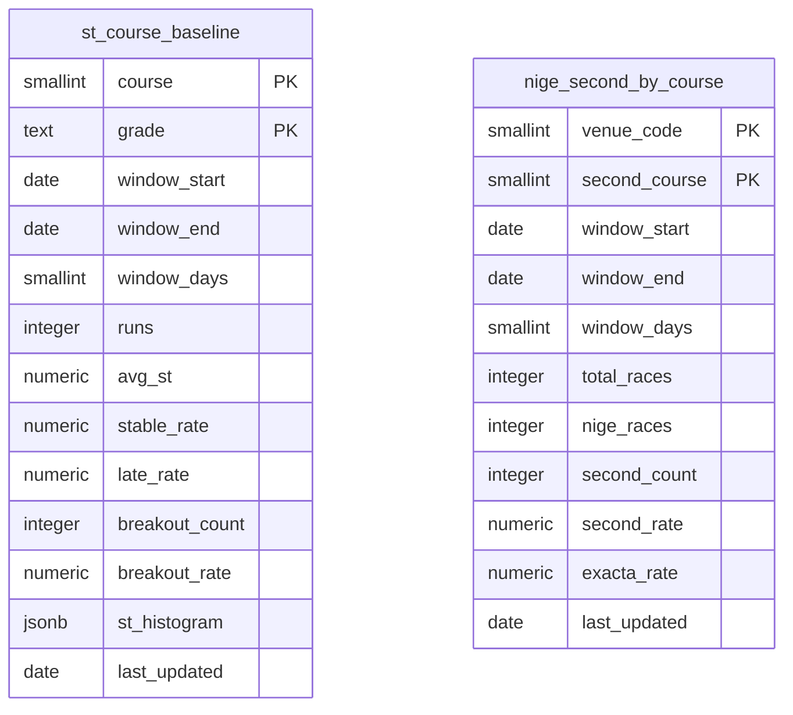

# レース詳細の可視化強化（phase a）plan

spec: [spec.md](./spec.md) / screens: [screens.md](./screens.md)

ADR: [ADR-0068](../../adr/0068-course-baseline-precomputation.md)（コース別ベースラインを日次バッチの事前集計にする）

マイグレーション案（すべて未適用）: [094](../../db-migration/094_course_baselines.sql)（新規2表）/ [095](../../db-migration/095_phase_a_numeric_public_read.sql)（数値3表の匿名公開）/ [096](../../db-migration/096_original_exhibition_public_read.sql)（オリジナル展示の匿名公開）

---

## 1. 全体のデータフロー

```
                        ┌──────────────── 日次バッチ（GitHub Actions、JST 00:50）
                        │  scripts/daily/update-course-baseline-stats.js
                        │    race_start_timings（全期間・約242,000行）
                        │    race_results       （全期間・約43,500行）
                        │    race_entries       （grade。約280,000行）
                        │      ↓ 1つの基礎CTEを共有（Fの行は除外）
                        │    st_course_baseline      （24行 upsert = コース6 × 級別4）
                        │    nige_second_by_course    （最大120行 upsert）
                        └────────────────┘

レース詳細（/race/:raceId）
  │
  ├─ 既存: getRacerScopedRaceStats(racerId) × 6選手  ← 基本情報・直前情報タブと withCache 共有
  │        同一レースの全6艇の start_timing / is_flying と actual_course_1〜6 を取得済み
  │        （キャッシュが冷えている初回は選手6人で約48リクエスト。これは本specより前からの既存挙動）
  │          ↓ サービス層で派生フィールドを付ける（DB読み取りは増えない）
  │        stForRank / raceBestSt / innerMinSt / stRank / isFlying
  │          ↓
  │        枠別情報タブ: コース別成績グリッド・ST考察・直近10走
  │
  ├─ 枠別情報タブを開いたとき（+2本）
  │    getStCourseBaseline()        → st_course_baseline      24行
  │    getNigeSimulation(venueCode) → nige_second_by_course    5行
  │
  ├─ 基本情報タブを開いたとき（+2本、FR-4c・FR-4d）
  │    getRacerPeriodStats(racerIds) → racer_period_stats      6行
  │    getRaceSeries(venueCode,date) → race_series             1行
  │
  ├─ モータ情報タブを開いたとき（+1本、FR-4a）
  │    getMotorPretestStats(venueCode,date) → motor_pretest_stats  最大約37行
  │
  └─ 直前情報タブを開いたとき（+2本、FR-4b）
       getOriginalExhibition(raceId) → race_original_exhibition → _values
       （2つのテーブルの間に外部キーが無いため、Supabaseの埋め込み構文で1本にできない。
         親を引いてからIDで子を引く2段階になる。plan.md §3.3）
```

`RaceTabs` は非アクティブなタブの内容をアンマウントする（遅延マウント、実コードで確認済み）。**タブごとに取得を分けることで、同時に増えるクエリは最大+2本**に収まる（[§6](#6-disk-ioとクエリ本数の見積り)）。

**ただし「アンマウントされる」ことには副作用がある**: タブを切り替えるたびに、キャッシュされない状態（`fetchFailed: true` を付けた `forbidden` など）は毎回フェッチし直される。095/096の適用前は、枠別情報タブを開くたびに権限エラーのリクエストが飛ぶ。これは意図した挙動（適用後すぐ表示に切り替わる）だが、**適用まで長く放置しない**こと。

---
## 2. データ設計

### 2.1 新規テーブル（マイグレーション案 094）

ADR-0068の決定（2026-09-23に `/step4` 着手前レビューを受けて改訂）。どちらも事前集計の結果を持つ極小のテーブルで、画面は単純なSELECTで読む。

| テーブル | 主キー | 行数 | 用途 |
|---|---|---|---|
| `st_course_baseline` | **`(course, grade)`** | **24**（コース6 × 級別4） | ST考察の「同コース・同級別の平均との差」の基準値。平均ST・安定率・出遅率・抜出回数／抜出率＋STの分布（0.05刻みのビンをjsonb） |
| `nige_second_by_course` | `(venue_code, second_course)` | **最大120** | 逃げシミュレーション。逃し時2着率・2連単確率・母数（会場別） |

**主キーに `grade` を含める理由**: 級別の交絡がコース差と同じ大きさで実在する（1コースの安定率 A1 74.4% vs B2 56.5% = 17.9pt に対し、A1内のコース差は 74.4%→54.3% = 20.1pt）。級別を無視すると「B2級の選手は何コースでも平均以下」と出るだけで、差を併記する意味が消える。24セルすべてで n ≥ 1,079 あり、当初の却下理由（nが減る）は実測で否定された。詳細は spec.md「コース別・級別のベースライン」と ADR-0068。

**集計窓は列に持つ**（`window_start` / `window_end` / `window_days` を実測値で）。実データは295日しかなく、クライアント側は730日窓で取るため、固定値を書くと将来ずれる。画面は `window_start` / `window_end` を読み、選手側の集計も同じ範囲でフィルタする。

どちらもRLS有効・匿名はSELECTのみ・書き込みはservice_roleのみ（BOA-370のRLS規律）。076以降は新規テーブルの既定権限を剥奪しているため `GRANT SELECT` を明示する。

**既存の `nige_outcome_distribution`（027）は変更しない**。艇番基準・90日・3連単粒度でBOA-158のタブが使用中。理由と却下の経緯はADR-0068。

### 2.2 既存テーブルへの変更

**なし**。FR-0〜FR-3・FR-5・FR-6はすべて既に匿名から読めるテーブル（`races` / `race_entries` / `race_results` / `race_start_timings` / `exhibition_data` / `race_odds` / `predictions` ほか。spec.md「FR-4が必要とするテーブルは匿名から読めない」参照）の範囲で完結する。列の追加も不要。

### 2.3 匿名（画面）への公開（FR-4、マイグレーション案 095・096）

FR-4の4種はいずれも匿名のSELECT権限が無い（2026-09-23実測）。**ADR-0067との関係で2つに分けた**。

| ファイル | 対象 | ADR-0067への追記 | 前提 |
|---|---|---|---|
| **095** | `motor_pretest_stats`（FR-4a）／`racer_period_stats`（FR-4c）／`race_series`（FR-4d） | **`racer_period_stats` のみ必要** | `motor_pretest_stats`・`race_series` は公式サイトの数値・事実データで、ADR-0067の「現状維持」が扱う範囲と同種。**`racer_period_stats` はファン手帳データ（期別成績）由来で、ADR-0067がまだ判断していない情報源の区分**にあたるため、承認を求める際にADR-0067への区分追記を1セットにする |
| **096** | `race_original_exhibition` / `_values`（FR-4b） | **必要** | 091（テーブル作成）が匿名の権限を意図的に剥奪しており、ADR-0067のBOATCAST追記に「値を画面に再表示する場合は、別途、ユーザーの承認と、出典の表記の設計が要る」と明記されている。**出典表記の実装とモック承認 → ADR-0067への追記 → 096の適用**の順で進める |

画面側は、**権限エラーを「セクションを出さない」として扱う**（ピットレポートで確立した扱い）。これにより095・096が未適用のままマージしても本番は無害で、適用の順序を画面のデプロイから切り離せる。

**ロールバック時に残る状態に注意する**: 096を撤回しても、成功レスポンスはクライアントの `localStorage` に最大7日間（`PAST_RACE_CACHE_TTL`）残る。撤回できるようにするため、**取得関数のキャッシュキーにスキーマ版を含める**（§3.3）。

### 2.4 ER図

新規テーブルは既存テーブルへの外部キーを持たない（`venue_code` は既存の慣習どおりsmallintで、`venues` へのFKは張らない）。`race_start_timings` / `race_results` / `race_entries` は集計の入力で、リレーションではない。



`npm run verify:er-diagram` は「新規テーブル・新規リレーションを導入するDDLを持つのにER図が無いplan.md」を検知する。上記の貼り付けで満たす。

---
## 3. サービス層（`src/services/supabaseDataService.js`）

### 3.0 先に直す: `fetchAllByIn` がページ取得の失敗を握りつぶす（前提条件）

`src/services/supabaseDataService.js:320` の `fetchAllByIn` は、ページ取得でエラーが出ると `console.error` して `break` し、**そこまでの部分的な配列を正常な戻り値として返す**。

```js
if (error) {
  console.error(`${table}取得エラー:`, error.message);
  break;           // ← 部分結果が「全件」として返る
}
```

現状でも潜在的な問題だが、本specでこれが**実害に変わる**。ST考察は「そのレースの全6艇のSTが揃っていること」を前提に ST順1位を決めるため、2ページ目以降が落ちると:

1. 一部のレースの他艇のSTが欠け、`raceBestSt` が実際より遅い値になる
2. 安定率が実際より高く、出遅率が実際より低く算出される
3. その誤った値が `withCache` に入り、**過去レースのキーなら最大7日間（`PAST_RACE_CACHE_TTL`）残る**

→ **`fetchAllByIn` をエラー時に例外を投げる（または `{ rows, fetchFailed: true }` を返す）形に直してから、ST考察の実装に入る**。呼び出し元（`getRacerScopedRaceStats` を含む既存6箇所）は `fetchFailed` を上流に伝播させ、`withCache` がキャッシュしないようにする。ピットレポート（BOA-379）で確立した扱いと同じ。

### 3.1 `getRacerScopedRaceStats(racerId)` に派生フィールドを足す（追加クエリ0本）

この関数は既に、**同一レースの全6艇**の `start_timing` / `is_flying`（`startTimingByKey`）と `race_results.actual_course_1〜6` をメモリに持っている。ST考察の3指標はここから算出できる。

**生の6艇分の配列を返り値に出さず、サービス層で派生値まで計算して返す**。理由は3つ。

- 返り値のサイズが増えない（全期間×6艇のST配列を持つと、選手6人分で数万要素になる）
- **Fの除外規則（`is_flying` の行を基準からも母数からも外す）を1箇所に閉じ込められる**。3指標が同じ条件を各々書くと、片方だけ直し忘れる
- 展示タイム1位判定（`soleFastestBoatByRace`）と同じ要領で、既にレース単位の前処理を行う場所がある

返り値の各行（既存の `raceId` / `date` / `venueCode` / `boatNumber` / `startTiming` / `actualCourse` 等）に足すもの:

| フィールド | 内容 |
|---|---|
| `isFlying` | `race_start_timings.is_flying`。Fバッジ（FR-4d）と母数除外の両方で使う |
| `stForRank` | 自艇のST。**`is_flying` の行は `null`**（符号を反転しない。ADR-0068の却下5）。`start_timing` がNULLでもnull |
| `raceBestSt` | そのレースの最速ST。**Fの行を除いた `min(stForRank)`**。安定率・出遅率の基準 |
| `innerMinSt` | 自艇より内側のコース（`course < 自艇のcourse`）の艇のうち、**Fを除いた** `stForRank` の最小値。**1コースはnull**（内側艇が存在しないため抜出率を算出しない） |
| `stRank` | そのレース内でのSTの順位（1〜6、Fを除く）。直近10走の「(1位)」表示に使う |
| `grade` | `race_entries.grade`。ベースラインの `(course, grade)` セルを引くのに使う |

`actual_course` が取れないレース（全期間で3.6%）は `actualCourse` がnullになり、コース別の集計から自然に落ちる。

### 3.2 新規の純関数（`src/utils/stConsideration.js`）

`getRacerScopedRaceStats` の行配列を受け、コース別に3指標を返す純関数。**Fの除外はサービス層で済んでいるため、この関数は `stForRank` / `raceBestSt` / `innerMinSt` を読むだけ**にする。

```
computeStConsideration(rows, { course })
  → { n, stableRate, lateRate, breakoutCount, breakoutRate, avgSt, flyingCount }
```

- 母数 `n`: `actualCourse === course` かつ `stForRank != null`（＝Fでない、STがある）の行数
- 安定率: `stForRank - raceBestSt <= 0.05` の割合
- 出遅率: `stForRank - raceBestSt >= 0.10` の割合
- 抜出: `innerMinSt != null && stForRank <= innerMinSt - 0.07` の**回数**（`breakoutCount`）。率（`breakoutRate`）も返すが**主表示は回数**（spec.md FR-1の§「抜出率は率ではなく実回数で出す」）。`course === 1` は `breakoutCount` / `breakoutRate` とも **null を返す**（0と返さない）
- `flyingCount`: そのコースでのFの回数。母数には入れず、バッジとして別に表示する
- 小標本の判定はこの関数では行わない。**呼び出し側が `n < SMALL_SAMPLE_THRESHOLD`（=6、`src/components/race/basicInfoStats.js`）で判断する**。ST考察だけ別の閾値（当初案の n<30）を持たせない — 同じ画面に2つの小標本定義が並ぶと、どちらの基準でグレーアウトされているのか読めなくなる

単体で検証できる純関数にする理由: 定義（0.05 / 0.07 / 0.10 の閾値、内側艇の解釈、Fの除外）が仕様の中心で、実データとの突き合わせを繰り返すため。

### 3.3 追加する取得関数

| 関数 | テーブル | 行数 | リクエスト本数 | キャッシュ |
|---|---|---|---|---|
| `getStCourseBaseline()` | `st_course_baseline` | 24 | 1 | `withCache` |
| `getNigeSimulation(venueCode)` | `nige_second_by_course` | 5 | 1 | `withCache` |
| `getRacerPeriodStats(racerIds)` | `racer_period_stats` | 6 | 1 | `withCache` |
| `getRaceSeries(venueCode, date)` | `race_series` | 1 | 1 | `withCache` |
| `getMotorPretestStats(venueCode, date)` | `motor_pretest_stats` | 最大約37 | 1 | `withCache` |
| `getOriginalExhibition(raceId)` | `race_original_exhibition` → `_values` | 6 + 36 | **2** | `withCache` |

`getOriginalExhibition` が2本になるのは、**2つのテーブルの間に外部キー制約が無く、Supabaseの埋め込み構文（`select('*, race_original_exhibition_values(*)')`）が使えない**ため。親を引いてIDで子を引く2段階になる。§6の見積りではこれを2本として数える。

**すべてピットレポート（`getRacePitReport`）で確立した扱いに揃える**。

- 権限エラー（`code === '42501'` または `permission denied`）は `state: "forbidden"` を返し、画面はセクションを出さない
- 取得失敗は例外を投げる（「データなし」「対象外」に化けさせない。BOA-359）
- **終端でない状態（権限なし・未取得）は `fetchFailed: true` を付けてキャッシュさせない**。付け忘れると、095/096の適用後も最大7日間（`PAST_RACE_CACHE_TTL`）非表示のままになる。ピットレポートで実際に起きたバグクラス
- **キャッシュキーにスキーマ版（例: `st-baseline-v1`）を含める**。096をロールバックした場合、`fetchFailed` が付いていない成功レスポンスはクライアントの `localStorage` に最大7日間残る。サーバ側の撤回だけでは消せないため、キーを変えて無効化できるようにしておく

---
## 4. コンポーネント構成

### 4.1 新規

| ファイル | 役割 | データ源 |
|---|---|---|
| `src/components/analysis/CrossTabGrid.jsx` + `.css` | **FR-0の共通クロス集計**。行軸・列軸・セル指標・n併記・小標本フラグをpropsで受ける。行ラベル列を `position: sticky; left: 0`、グリッド内だけ横スクロール | 呼び出し側が整形済みの2次元データを渡す（データ取得はしない） |
| `src/components/race/RaceStConsiderationCard.jsx` + `.css` | ST考察（3指標 × 6艇、値＋**同コース・同級別の平均**との差。抜出は実回数が主表示）。ST分布・ST履歴を折りたたみで内包 | `getRacerScopedRaceStats` ＋ `computeStConsideration` ＋ `getStCourseBaseline` |
| `src/components/race/RecentRunsBar.jsx` + `.css` | 直近10走の帯（進入コース／着順／ST＋`(1位)`） | `getRacerScopedRaceStats`（`stRank` を使う） |
| `src/components/race/NigeSimulationCard.jsx` + `.css` | 逃げシミュレーション（横棒＋2連単確率）。`.lede-simple` / `.lede-detail` | `getNigeSimulation(venueCode)` |
| `src/components/race/VenueDaySummaryCard.jsx` + `.css` | 本日の成績サマリー（結果タブ・会場ページで共用）＋「この日の傾向 vs このレース」の一文 | `getVenueDaySummary(venueCode, date)`（既存）＋ `race_results.winning_technique` / `actual_course_N` |
| `src/utils/stConsideration.js` | 3指標の算出（純関数。[§3.2](#32-新規の純関数-srcutilsstconsiderationjs)） | — |
| `src/utils/courseBaseline.js` | ベースラインの整形・差分計算（純関数）。`(course, grade)` でセルを引く。指標ごとに「高いほど良い／低いほど良い」の向きを持つ（安定率は高いほど良い、出遅率は低いほど良い、抜出回数は高いほど良い） | — |

### 4.2 既存の変更

| ファイル | 変更 |
|---|---|
| `src/components/race/RaceWakuInfoTab.jsx` | 期間別グリッド（`CrossTabGrid`）・ST考察・直近10走・逃げシミュレーションを追加。**既存の「コース別成績（バー＋ドリルダウン）」カードを廃止**し、ドリルダウンをグリッドのセルタップに移す。冒頭コメントの「ST考察・逃げシミュレーションは自社DBに存在しない」「艇番＝コース前提」の記述を更新 |
| `src/components/race/RaceBasicInfoTab.jsx` | バー展開（`rbit-expanded-tabs`）に3つ目のタブ「条件別」を追加。初日／最終日（`race_series`）・波5cm超（`race_conditions` の波高）・前期（`racer_period_stats`）の行。選手名の隣にF数バッジ。**グリッド化はしない** |
| `src/components/race/RaceBeforeInfoTab.jsx` | 詳細テーブル（`buildBeforeInfoRows`）にオリジナル展示の行を追加。**本日の成績サマリーのカードを削除**（`getVenueDaySummary` の呼び出しも外す） |
| `src/components/analysis/MotorWakuStatsGrid.jsx` | 前検タイム・節時点の2連対率の列を追加 |
| `src/components/race/RaceResult.jsx` | 払戻一覧の下に `VenueDaySummaryCard` を追加 |
| `src/pages/VenueRaceListPage.jsx` | `VenueDaySummaryCard` を追加（`/venue/:venueCode` と `/races/:date/:venueCode` の両方が同じこのページ） |
| `src/services/supabaseDataService.js` | [§3](#3-サービス層-srcservicessupabasedataservicejs) |
| `src/components/race/index.js`／`src/components/analysis/index.js` | barrel export |
| `src/components/race/termHints.js` | `stStable` / `stBreakout` / `stLate` / `nigeSimulation`（ja専用） |
| `src/locales/{ja,en,zh-TW,ko}/common.json` | 既存の名前空間に追加（`wakuInfo.*` / `basicInfo.*` / `result.*` / `beforeInfo.*`） |
| `e2e/smoke.spec.js` | 各カードの表示、グリッドの値とnの整合、権限なし時の非表示 |

### 4.3 デザイントークン

新規CSSは[screens.md §5.2](./screens.md)の4つ（クロス集計グリッド・直近10走の帯・横棒・ST考察の3列レイアウト）に限る。色・余白・角丸は意味トークン、差の符号は `--color-success-text` / `--color-error-text`、小標本は既存の `is-small-sample`、強調は金14%（1位）/ 金7%（2位）。

---

## 5. バッチ（`scripts/daily/update-course-baseline-stats.js`）

### 5.1 構成

1スクリプトで2表を更新する。**両者は同じ基礎CTE（Fを除外したST × 実進入コース）を共有する**ため、分けるとDBスキャンが2倍になる。

```
基礎CTE（利用可能な全期間。window_start / window_end は実測して列に入れる）
  race_start_timings  → is_flying の行は「ST順1位の基準」からも母数からも除外する
                        （符号反転はしない。ADR-0068 却下5）
  race_results        → actual_course_N を艇番→コースに展開。actual_course が無い行は落ちる
  race_entries        → grade（A1/A2/B1/B2）
  窓関数              → raceBestSt = min(st) filter (where not is_flying)
                        innerMinSt = 内側コースの min(st) filter (where not is_flying)
    │
    ├→ st_course_baseline     (course, grade) の24セルごとに
    │                         平均ST／安定率／出遅率／抜出回数・抜出率／STの分布（0.05刻み）
    └→ nige_second_by_course  winning_technique='逃げ' かつ1着艇のコース=1 のレースに絞り、
                              会場×2着コースで 2着率／2連単確率／母数
                              （venue_code は race_results に無いので races とJOIN）
```

- 実行基盤: **GitHub Actions**（新規 `.github/workflows/aggregate-course-baseline-stats.yml`、JST 00:50）。Vercelを選ばなかった理由はADR-0068の却下4
- 既存の `scripts/daily/update-nige-outcome-distribution.js`（JST 00:42）の直後に置く。前日の結果が確定した後に走らせる
- **ページネーション必須**: 基礎CTEが読む `race_start_timings` は約242,000行で、Supabaseのデフォルト上限1000行を大きく超える。既存の `update-nige-outcome-distribution.js:66` と同じ `.range(from, from + pageSize - 1)` のループにする。あるいは集計自体をRPC（SQL関数）側に寄せて、Nodeには結果の24行＋120行だけ返す方が安全（**こちらを推す**。約28万行をNodeのメモリに持たない）
- `upsertChangedRows`（`scripts/lib/unchangedRows.js`）で**変更のある行だけ書く**（`.claude/rules/data-acquisition.md`）。ただし次の2点を守らないと機能しない
  - **`NUMERIC_SCALES` に新規2テーブルのエントリを追加する**（`unchangedRows.js:40`）。未登録だと `NUMERIC_SCALES[table] ?? {}` で空になり、NUMERIC列が文字列と数値で比較されて**毎日全行が「変更あり」と判定される**
  - **`last_updated` に当日の日付を毎日入れない**。毎日変えると全行が必ず変更扱いになり、条件付きupsertの意味が消える。`last_updated` は**値が実際に変わった日**を入れる（`upsertChangedRows` の比較対象からは外し、変更が検出された行にだけ書く）
- **0件書き込みをエラーとして扱う**のは「集計結果が0行だった場合」であり、「変更が無くて書き込みが0行だった場合」ではない。この2つを取り違えると、値が安定した日に毎回失敗する。**集計結果の行数（24行・会場数×5行）で判定する**
- `continue-on-error` は付けない（ジョブ全体を成功に見せない）

### 5.2 完了の定義

本ジョブは**外部サイトを取得しない**（自社DBの集計のみ）ため、`.claude/rules/data-acquisition.md` の「完了の定義」A（期待件数）・B（タイミング）はそのままは当てはまらない。代わりに次で判定する。

- **件数**: `st_course_baseline` が**24行**（コース6 × 級別4。全セルに実データがあることは実測済み、最小n=1,079）。`nige_second_by_course` が「1コース逃げが1件以上あった会場 × 2〜6コース」の行数（24会場開催なら120行）
- **整合1**: `nige_second_by_course` の `second_rate` を会場ごとに合計して**100%±0.5**に収まる（2着は必ず1艇）
- **整合2**: `exacta_rate` を会場ごとに合計した値が `nige_races / total_races * 100` と**±0.5pt以内で一致**する。分母の取り違え（当初の設計で3.6%ずれていた）を機械的に検知する
- **鮮度**: **`last_updated` ではなく `window_end` で見る**。`window_end` が2日以上古ければ異常
- **監視の置き場所**: 既存の `daily_overdue`（`scrape-monitor`）は**使えない**。あれはテーブルの行数が日々増えることを前提に「最新行の日付」を見る仕組みで、行数が24行・120行で固定される本テーブルでは空振りする。代わりに、**バッチ自身が集計結果の行数と上記の整合チェックを検証し、失敗したら非0終了して既存のSlack通知（`slack-notify-pr.yml` と同経路）に流す**。加えて `content-ops-nightly-check.yml` と同じ形で「`window_end` が2日以上古い」を日次で確認する

---

## 6. Disk IOとクエリ本数の見積り

### 6.1 画面側（レース詳細1回の表示）

非機能要件は「現状から**+3本以内**」。

| タブ | 追加クエリ | 読み取り行数 |
|---|---|---|
| 枠別情報 | `getStCourseBaseline` +1／`getNigeSimulation` +1 = **+2** | 24 + 5 = **29行** |
| 基本情報 | `getRacerPeriodStats` +1／`getRaceSeries` +1 = **+2** | 6 + 1 = **7行** |
| モータ情報 | `getMotorPretestStats` +1 = **+1** | 最大 **37行** |
| 直前情報 | `getOriginalExhibition` **+2**（FKが無く埋め込みにできない。§3.3） | 6 + 36 = **42行** |

- **ST考察・直近10走・今節成績（FR-1・FR-3）は+0本**。`getRacerScopedRaceStats` が既に取得しているデータから算出する
  - **ただし「+0本」は既存のキャッシュが温まっている前提**。冷えている状態でレース詳細を開くと、`getRacerScopedRaceStats` は選手6人分で約48リクエストを出す。**これは本specが増やすものではなく既存の挙動**だが、「ST考察はタダ」と読める書き方は誤解を招くため明記する
- `RaceTabs` が非アクティブなタブをアンマウントするため、**同時に増えるのは最大+2本**（枠別情報タブまたは基本情報タブ）。要件内
- 全タブを順に開いた場合の累計は+7本だが、すべて `withCache` を通り、読み取り行数は合計120行未満

### 6.2 バッチ側（日次1回）

| 対象 | 読み取り | 書き込み |
|---|---|---|
| 基礎CTE（両表で共有） | `race_start_timings` 約242,000行 ＋ `race_results` 約43,500行 ＋ `race_entries` 約280,000行（grade） | — |
| `st_course_baseline` | （上記を共有） | 24行（変更のある行のみ） |
| `nige_second_by_course` | （上記を共有） | 最大120行（変更のある行のみ） |

**1日あたりの読み取りは約565,000行、書き込みは最大144行**。読み取りが当初見積り（約287,000行）から倍増しているのは、級別を分けるために `race_entries.grade` をJOINする必要が出たため。**RPC側で集計すればネットワークを渡るのは144行のみ**で、Node側のメモリ・転送量は無視できる。

[BOA-357](https://linear.app/boat-ai/issue/BOA-357)（Disk IO Budget枯渇の対策）の観点では、画面側から同じ集計を毎回走らせる案（ADR-0068の却下1）に比べて桁違いに小さい。**ただし読み取り行数が当初の倍になったことは、BOA-357の担当に共有する**（日次1回でも約56万行のスキャンが増える）。

---
## 7. 実装の順序

spec.mdの着手順に、前提関係を加えた。**2026-09-23の再設計で、T0（`fetchAllByIn` の修正）を先頭に追加し、`VenueGradeMatrix` の載せ替えをスコープから外した。**

| # | 内容 | 前提 |
|---|---|---|
| 0 | **`fetchAllByIn` のエラー握りつぶしを直す**（[§3.0](#30-先に直す-fetchallbyin-がページ取得の失敗を握りつぶす前提条件)） | なし。**ST考察より前にやる**（誤った集計値がキャッシュに焼き付くのを防ぐ） |
| 1 | `CrossTabGrid`（FR-0）を作る | なし。**`VenueGradeMatrix`・`RacerPerformanceStats` の載せ替えはスコープ外**（spec.md FR-0。前者はセルにnが無く、後者はクロス集計ではない） |
| 2 | `getRacerScopedRaceStats` に派生フィールド（[§3.1](#31-getracerscopedracestatsracerid-に派生フィールドを足す追加クエリ0本)）／`stConsideration.js` | 0 |
| 3 | マイグレーション094の適用（ユーザー承認）＋バッチの実装・初回実行 | 094 |
| 4 | 枠別情報タブ（FR-1・FR-6）: グリッド・ST考察・直近10走・逃げシミュレーション | 1・2・3 |
| 5 | 本日の成績サマリーの移設（FR-5）: `VenueDaySummaryCard` を切り出し → 結果タブ・会場ページへ → 直前情報タブから削除 | なし（並行可） |
| 6 | 基本情報タブ（FR-2・FR-4c・FR-4d）: 「条件別」タブ・Fバッジ | 095＋ADR-0067への `racer_period_stats` の区分追記 |
| 7 | 今節成績（FR-3） | 2 |
| 8 | モータ情報タブ（FR-4a） | 095 |
| 9 | 直前情報タブのオリジナル展示（FR-4b） | **096＋ADR-0067への追記**（[§2.3](#23-匿名画面への公開fr-4マイグレーション案-095096)） |

- **4の前にモックの再確認をする**（[screens.md](./screens.md) のモックはF符号反転・コースのみベースラインの前提で作られているため、ST考察カードの表示値を再設計後の値に差し替えて再提示する）
- 3つのマイグレーションは**いずれも適用がユーザー承認待ち**。094は新規テーブルなので画面より先、095・096は画面の実装・自己検証の後（ピットレポートの086と同じ順序）
- 9は他と独立させる。ADR-0067の追記というユーザー判断が挟まるため、他のFRを待たせない

## 8. 未確定のまま残るもの

spec.mdの未確定事項のうち、`/step2` で決めず `/step3` 以降に回すもの。

| # | 項目 | いつ決めるか |
|---|---|---|
| 1 | ~~`racer_aggregated_stats.courseRaceCounts` の他の利用箇所への影響~~ → **`/step3` で確定**（2026-09-23）。他に4箇所（`raceIndicators.jsx` の「枠番勝率」行・`RaceCardDataTable`・`AttackDefenseTable`・選手ページの `RacerPerformanceStats`）が独立に読んでおり、枠別情報タブが使わなくなっても壊れない。ただし**同じサイト内で艇番基準と実進入コース基準が混在する**。横断課題として既に [BOA-302](https://linear.app/boat-ai/issue/BOA-302) が起票済みなので重複起票せず、T3-1でグリッドに「実進入コース基準」と注記する | 決定済み |
| 2 | ST履歴（全走のST一覧）の表示件数 — 直近10走の「もっと見る」でどこまで伸ばすか。全期間だと数百件になる | 実装時（`/step4`）にモバイルでの表示を見て決める |
| 3 | `st_course_baseline.st_histogram` のビン幅 — 0.05刻みで始める（実測の分布は spec.md「STの分布」に記載済みで、6コースだけ右にずれているのが読める形にはなっている） | バッチの初回実行後 |
| 4 | 会場ページでBOA-222のランキングバッジと1カードに統合するか | [BOA-222](https://linear.app/boat-ai/issue/BOA-222)側の画面設計 |
| 5 | **級別が期途中で変わった選手の扱い** — `race_entries.grade` はレース時点の級別なので、1年の間にA1→B1と変わった選手の走は2つのセルに分散する。表示は「現在の級別のベースライン」と比較する方針（spec.md 未確定事項1c） | `/step4` の実装時。分散が問題になれば見直す |
| 6 | **`CrossTabGrid` の3例目が現れたときに `VenueGradeMatrix` を載せ替えるか** — 今回スコープ外にしたが、セルにnを持たせる改修とセットならやる価値がある | 3例目が出た時点。Linearに軽量起票する |
