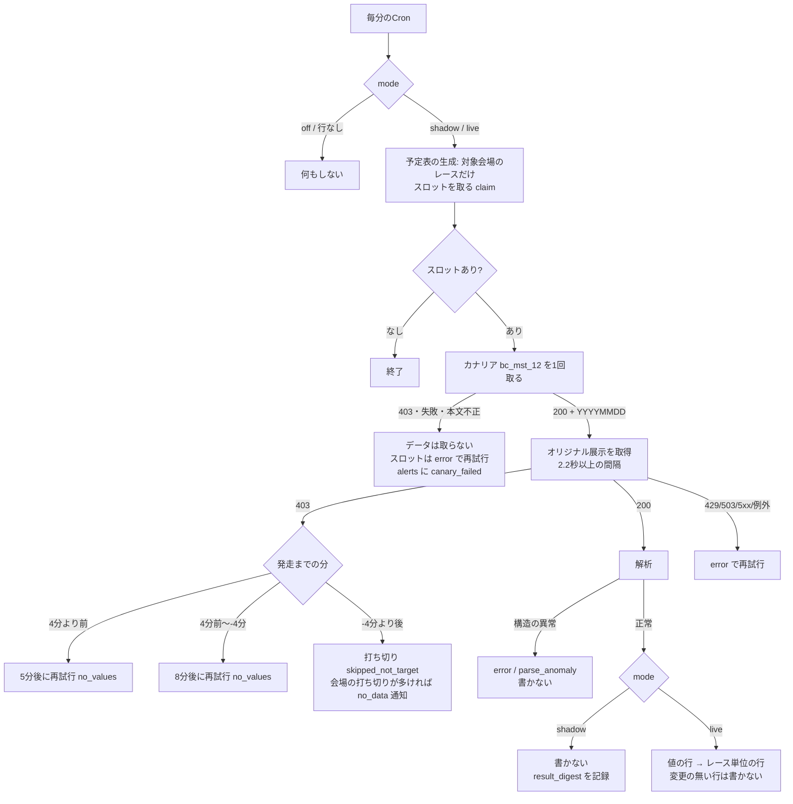

# BOATCASTのオリジナル展示（N25）・モーター使用開始日（N26）の取得・保存 plan

spec: `spec.md` / tasks: [scraping-vercel-consolidation/tasks.md T4b-19](../scraping-vercel-consolidation/tasks.md)
対応: [ADR-0066](../../adr/0066-scraping-execution-consolidation-to-vercel.md)・[ADR-0067](../../adr/0067-official-site-content-redisplay-policy.md)・`.claude/rules/data-acquisition.md`

## 0. 方針の要約

- 取得は Vercel Cron の2ジョブ。**`boatcast_oriten`**（窓型。`api/cron/boatcast-oriten.js`。毎分起動、予定表 `scrape_slots` のスロットを消化）と、**`boatcast_motor_start`**（日次。`api/cron/boatcast-motor-start.js`。06:30・08:00 JST）。どちらも共通ラッパ・予定表・レジストリ・サーキットブレーカーを使う。`scrape_job_state.mode` が off（または行なし）の間は何もしない。shadow（取得・解析のみ）・live（書き込み）
- N26を別ジョブにした理由: 窓型のジョブには日次の処理を差し込む口が無い（`onTick` は live のみで、shadow で検証できない）。日次ジョブにすると、`last_target_date` による冪等・補足の起動・`daily_overdue` の監視・shadow が、共通ラッパのまま使える。取得先・パーサー・DDLは共有（同じ `scripts/lib/boatcast/`・同じマイグレーション091）
- 別ホスト（`race.boatcast.jp`）。ブレーカーのキーは `host:race.boatcast.jp` で、boatrace.jp と独立
- **共有の `politeFetch`・ブレーカーは変更しない**。BOATCASTの「存在しない＝403」は、ジョブ内のカナリア・試行回数の上限・公開マップで扱う（[spec.md §4](./spec.md)）
- 保存は3表（マイグレーション091。**匿名のSELECTなし**）。値は縦持ち（会場ごとに項目が異なるため）
- 公開マップ（会場×項目）は、事前に凍結した静的な設定（`publicMap.js`）。予定表の対象・期待件数・項目名の照合は、全てこれから決める

## 1. データ設計

### 1.1 ER図

マイグレーション[091](../../db-migration/091_boatcast_original_exhibition.sql)から機械生成（`node scripts/maintenance/generate-er-diagram.js boatcast-original-exhibition`）。

```mermaid
erDiagram
    race_original_exhibition }o--|| races : "race_id"
    race_original_exhibition_values }o--|| races : "race_id"
    race_original_exhibition {
        varchar(20) race_id PK
        smallint measure_status
        smallint item_count
        text item_labels
        text content_hash
        text parser_version
        timestamptz source_last_modified
        timestamptz created_at
        timestamptz updated_at
    }
    race_original_exhibition_values {
        varchar(20) race_id PK
        smallint boat_number PK
        text kind PK
        numeric(5,2) value
        timestamptz created_at
        timestamptz updated_at
    }
    venue_motor_start_dates {
        smallint venue_code PK
        date start_date PK
        timestamptz created_at
    }
```

### 1.2 設計の要点

| 項目 | 内容 | 理由 |
|---|---|---|
| 2表構成（レース単位＋艇×項目） | `race_original_exhibition`: 計測状態（1=計測あり/2=計測不可）・項目名・内容のハッシュ・公開時刻。`race_original_exhibition_values`: `(race_id, boat_number, kind)` → `value`（秒） | 「403（行なし）」「計測不可（レース単位の行のみ）」「計測あり（値の行あり）」を区別するには、レース単位の状態が要る（ピットレポート085と同じ構成） |
| `kind` | 項目名（空白・全角スペースを除いた表記）。一周・半周ラップ・まわり足・直線。未知の項目名もそのまま入る | 項目は位置ではなくラベルで解釈する（会場により構成が違う）。未知のラベルは取りこぼさず保存し、`parse_anomaly` として通知 |
| `value` | `numeric(5,2)`（秒）。欠測（ファイルの `--.--`）は NULL | 欠測は「行は存在し、値だけが無い」。選手名は保存しない（`race_entries` と艇番で突合できる） |
| `source_last_modified` | 取得元のHTTP `Last-Modified` | 当日のファイルの `Last-Modified` は公開時刻。完了の定義B（公開の何分前に現れたか）の実測に使う。`created_at − source_last_modified` が、公開から検知までの遅延 |
| `content_hash` | 計測状態・項目名・艇ごとの値（選手名を除く）のSHA-256 | 再取得で内容が同じなら書かない（変更の無い行は書かない）。書き込み完了の目印 |
| 書き込みの順序 | 値の行 → レース単位の行 | 途中で失敗しても、次の取得が書き直す（先にレース単位の行を書くと、値を書けなかった状態で「変更なし」と判断される）。値の行の外部キーは `races`（`race_original_exhibition` ではない） |
| 取得時刻 | `created_at`（DEFAULT now()。最初に保存した時刻）・`updated_at`（書き込み側が、変更のある行に設定。`upsertChangedRows(..., {stampUpdatedAt: true})`） | 完了の定義B（071と同じ運用） |
| `venue_motor_start_dates` | 主キー `(venue_code, start_date)`。新しい組が現れたときだけ追記 | モーターの世代の区切りの履歴。同じ日付が続く間は書かない |
| RLS | 3表とも、RLS有効・anon/authenticatedの全権限を剥奪・ポリシーなし。**匿名のSELECTを付けない** | 公式コンテンツの再表示を含むため（ADR-0067）。BOA-370のRLS規律 |

### 1.3 適用時のリスク（本番DDL。ユーザー承認のうえで、ユーザーが適用する）

| 項目 | 091 |
|---|---|
| 内容 | 新規テーブル3つ・RLS有効化・権限の剥奪のみ。既存テーブルは変更しない |
| ロック | `races` への外部キー作成時の短い `SHARE ROW EXCLUSIVE`（`races` 約4.5万行）。`lock_timeout 10s` |
| 失敗時 | 1トランザクション（`BEGIN`〜`COMMIT`）。失敗なら何も変更されない |
| 未適用のDBでのコード | shadow は動く（書かない）。live では、テーブルが無いと書かずに `error` を返す（成功にしない。`detectBoatcastSchema`。判定は5分キャッシュ） |
| ロールバック | `DROP TABLE` の3文（データは消える。他に影響なし） |

## 2. モジュール構成（`scripts/lib/boatcast/`）

| ファイル | 役割 |
|---|---|
| `publicMap.js` | 公開マップ（会場×項目。凍結した静的な設定）・期待行数・`race_id` から会場の取り出し |
| `oritenParser.js` | ファイル（TSV）の解析（純関数）。項目名の正規化・欠測・計測不可・構造の異常・未知のラベル。`bc_mst` の解析 |
| `oritenRows.js` | DBに書く行の組み立て・内容のハッシュ・公開マップとの照合・**403の再試行の判断**（`decideNotPublished`）（純関数） |
| `boatcastClient.js` | URL・リクエスト間隔（`createPacer`。2.2秒以上）・取得（`fetchBoatcast`）・**カナリア**（`checkCanary`） |
| `oritenSchema.js` | マイグレーション091の適用判定（キャッシュ付き） |
| `oritenJob.js` | 窓型ジョブ: `processOritenRace`（取得・解析・書き込みの本体。**バックフィルCLIと共有**）・スロットのハンドラー・予定表のストア（対象会場のレースにだけスロットを作る）・通知（`mergeReport`） |
| `motorStartJob.js` | 日次ジョブ: 全24会場の `bc_mst` |
| `probe.js` | Vercelから到達できるかの確認（`?probe=1`） |

## 3. 窓型ジョブの処理



- 期限は発走8分前（`offsets: [-8]`）、許容幅30分（発走の22分後まで）。1回目（約8分前）→ 403なら5分後（約3分前）→ 403なら8分後（約5分後）→ 打ち切り。最大3回
- 403の打ち切りは、`scrape_slots.outcome='skipped_not_target'`（終端。窓内取得率の分母に入れず、`expired` 通知にもならない）。データ無しの件数は、完了の定義Aで**件数付きで報告する**除外
- 計測不可（計測状態2）は正常な公開（`ok`）。レース単位の行（`measure_status=2`）のみ書く

## 4. 403の扱い

[spec.md §4](./spec.md)。実装の要点:

- カナリアは、スロットを取った後の最初の取得の前に、tickごとに1回だけ（`tick.canaryPromise` をスロット間で共有）。複数スロットでも1回
- カナリア失敗時のスロットは `outcome: error`（`canary_failed: ...`）で再試行する（共通ラッパの既定の再試行間隔）。**打ち切りにしない**（アクセス拒否のときに、データ無しとして永久に取りこぼさない）。全スロットが error なら、共通ラッパが `consecutive_failures` を増やし、3回連続で監視の「連続失敗」が通知する
- 403・カナリア失敗の判定は、共有の `politeFetch` の戻り（HTTPステータス）を、ジョブ側で解釈する。`politeFetch` は429/503（と例外）だけをブレーカーの失敗に数える

## 5. 継続監視（完了の定義C）

`registry.js` に載せれば、`scrape-monitor`（5分）・`scrape-summary`（日次）が自動で、`expired`・未実行・死活・連続失敗・ブレーカー・0件エラー・日次の期限超過（`boatcast_motor_start`）・窓内取得率を通知する（既存の仕組み）。加えて、ジョブ固有の通知を `scrape_job_state.last_report.alerts`（`[{key, text, until}]`）に出す（monitorが `report:{job}:{key}` として通知。6時間ごとに再通知）:

| key | 条件 | 解除 |
|---|---|---|
| `canary_failed` | カナリアが403・失敗・本文不正（BOATCASTへのアクセス拒否・接続の異常の疑い） | 次のtickでカナリアが正常なら外す。`until` 60分 |
| `parse_anomaly` | 構造の異常（HTML・列数の不一致・数値でない値等）、未知の項目名、公開マップと違う項目名。**件数と例を出す** | `until` 6時間 |
| `no_data:{会場}` | ある会場の当日の完了レースのうち、打ち切り（403）が3件以上かつ半分以上（会場が非公開にした・マップが古い、の検知。三国・津の12Rのような散発では出ない） | `until` 12時間 |
| `motor_start_incomplete` | `bc_mst` が24会場のうち一部しか取れていない（日次ジョブ） | `until` 24時間 |

- **0件**: 計測ありのファイルから値が0行なら、共通ラッパの0件エラー（`rowsExpected>0`・`rowsParsed=0`）で `error`（0件を成功にしない）。`bc_mst` は、最初の3会場が続けて失敗したら `error`（`last_error` に「0件」が入るとmonitorの `zero_rows` も出る）
- 通知は変化があるときだけ `last_report` を書く（毎tickの書き込みを避ける）

## 6. バックフィルとの共有（第1弾の対象外。構造のみ）

過去分（2025-12以降、約44,700リクエスト）は、手動CLI（`scripts/maintenance/`。未実装）で行う。`processOritenRace({raceId, race, mode, fetchText, client, minutesToStart})` は、定期取得と共有できる:

- CLIは、`fetchText` に `fetchBoatcast(url, {fetchImpl: 逐次の fetch, pacer: 2.2〜3秒})`、`minutesToStart` に `-Infinity`（403は打ち切り。待たない）を渡す
- 過去日のファイルの `Last-Modified` は、毎晩の再生成の時刻（公開時刻ではない）。CLI経由の行の `source_last_modified` は使わない（NULLにして書くか、比較から除く。CLI実装時に決める）
- 取得負荷（約44,700）は、`processOritenRace` の外（CLIの日次上限・夜間・429/503で即時中止）で制御する

## 7. 完了の定義と実測

[tasks.md T4b-19](../scraping-vercel-consolidation/tasks.md)（A・B・Cの3行と、Bの基準の提案）・[verification-runbook.md S](../scraping-vercel-consolidation/verification-runbook.md)（手順と実測SQL）。

## 8. リスク

| リスク | 緩和 |
|---|---|
| VercelのIPが、BOATCASTにブロックされる | `?probe=1` で、shadowの前に実測する。カナリアの失敗を `canary_failed` として通知し、取得を止める |
| 公開時刻の実測が少ない（n=21）ため、8分前より遅く公開されるレースがある | 403は最大3回（約3分前・約5分後）再試行する。3回目でも403なら打ち切り（データ無し）。shadowの期間に、公開時刻（`source_last_modified`）の分布を実測し、`offsets` を調整する |
| データ無し（403）が、公開の遅れなのか、非公開なのか、区別できない | 打ち切りを件数で報告する（完了の定義Aの除外）。`no_data:{会場}` の通知。shadowで内訳を実測 |
| BOATCASTの形式変更 | 項目はラベルで解釈し、構造の異常は書かずに `parse_anomaly` で通知する。未知のラベルは取りこぼさず保存する |
| 取得負荷 | 逐次・2.2秒以上・ブレーカー（別ホスト）・打ち切り。負荷の見積り（[spec.md §5](./spec.md)） |
