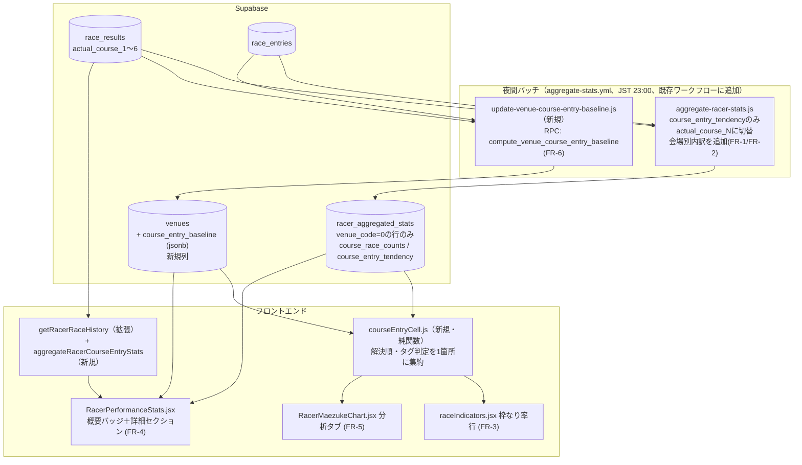
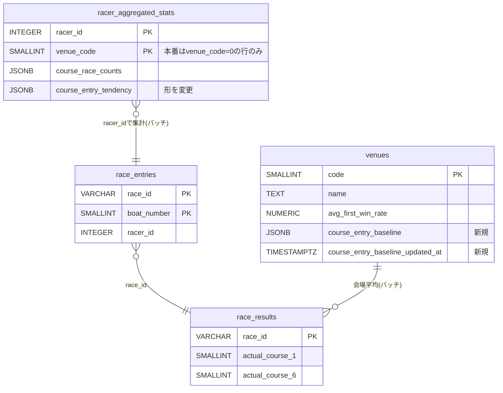

# 進入コース遷移傾向の再構築 plan

対応: [spec.md](./spec.md) / [screens.md](./screens.md) / [ADR-0064](../../adr/0064-course-entry-tendency-reuse-existing-infra.md) / [ADR-0065](../../adr/0065-venue-course-entry-baseline-precomputed-table.md)

## 全体アーキテクチャ

「選手×枠番→実進入コース分布」の算出ロジックは`aggregate-racer-stats.js`に既にあり、参照列が壊れた`course_1〜6`のままだった（BOA-284）。これを`actual_course_1〜6`に切り替えて拡張する。会場別対応で必要になる「会場平均（選手非依存）」だけは新規の事前集計になる。



## 技術判断

- [ADR-0064](../../adr/0064-course-entry-tendency-reuse-existing-infra.md): 選手側は新規テーブル・RPCを作らず、既存の`racer_aggregated_stats`（バッチ）と`getRacerRaceHistory`（クライアント集計）を拡張する。2026-09-19に、本番には会場別の行が無いこと、およびTask 2の検証で`course_entry_tendency`以外の切り替えは行わないことを追記した
- [ADR-0065](../../adr/0065-venue-course-entry-baseline-precomputed-table.md): 会場平均（選手非依存）は`venues`テーブルのjsonb列に事前集計して持つ。24行しかなく、既存の`update-venue-stats.js`（`venues`に列を書く）と同じ型のため、新規テーブルは作らない

## データ設計

### 新規DB変更（マイグレーション`docs/db-migration/067_venues_course_entry_baseline.sql`）

1. `venues.course_entry_baseline JSONB`と`venues.course_entry_baseline_updated_at TIMESTAMPTZ`を追加する
2. SQL関数`compute_venue_course_entry_baseline(p_venue_code SMALLINT, p_since DATE) RETURNS JSONB`を追加する。1会場分の「枠番→進入コース別の回数」を、`races`・`race_entries`・`race_results.actual_course_1〜6`から集計して返す。全会場を1回で集計するとPostgRESTのタイムアウトを踏みうるため、会場ごとに呼ぶ（24回）

`course_entry_baseline`の形:

```json
{
  "since": "2025-09-19",
  "waku": {
    "1": { "n": 1786, "courses": { "1": 1766, "2": 20 } },
    "6": { "n": 1953, "courses": { "6": 1633, "5": 210, "4": 110 } }
  }
}
```



### `racer_aggregated_stats.course_entry_tendency`の形の変更（DDL変更なし、jsonbの中身のみ）

現状は割合のみ（`{ 枠番: { コース: 割合 } }`）。走数併記のため、回数を持つ形に変える。参照元は`aggregate-racer-stats.js`のみで、互換性の問題は無い（2026-09-19確認）。

```json
{
  "since": "2025-09-19",
  "all":    { "4": { "n": 27, "courses": { "4": 20, "3": 5, "2": 2 } } },
  "venues": { "8": { "4": { "n": 6, "courses": { "4": 3, "3": 3 } } } }
}
```

本番の`racer_aggregated_stats`は`venue_code=0`の行しか無い（1,639選手、2026-09-19確認。会場別の行は`--venue=N`を付けたときのみ作られ、夜間バッチは`--all`のみ）。会場別を別の行にすると選手数×会場数の追加クエリになるため、**`venue_code=0`の行の中に`venues`として会場別の内訳を入れる**。出走表（FR-3）は6選手分の`venue_code=0`の行を既に取得しているので、追加の通信は要らない。

## FR-1: `calculateCourseEntryTendency`の切り替え（範囲を縮小）

`aggregate-racer-stats.js`の`calculateCourseEntryTendency`のみ、`race_results`のselect列と参照を`course_1〜6`→`actual_course_1〜6`に変える。出力を新しい形（`since`・`all`・`venues`、回数と走数`n`）にし、直近12ヶ月ウィンドウを追加。会場別の内訳は同じ関数内で1パスで作る（追加クエリなし）。走数の下限はバッチ側では適用せず、表示側（`courseEntryCell.js`）で「参考」を判定する。共通ロジックは`scripts/lib/courseEntryTendency.js`。

以下の3関数は**切り替えない**（現行の旧列`course_1〜6`のまま）:

| 関数 | 出力 | 切り替えない理由 |
|---|---|---|
| `calculateCourseRaceCounts` | `course_race_counts`（courseRateの入力） | 実進入コースに直すと予測力は上がらず、複勝予想の的中率が-0.42±0.10pt（有意）、回収率が-2.1±1.3ptとなった。選手ページの「枠番別成績」表にも使われ、切り替えると「枠番」表示の表が変わる |
| `calculateAttackDistribution` | `attack_distribution` | 展開予測の入力で、影響が未検証（`verify-turn-prediction-accuracy-v6.js`での検証が別途必要。別チケット） |
| `calculateDefenseDistribution` | `defense_distribution` | 同上 |

なお旧列`course_1〜6`は艇番と常に一致するため、`course_race_counts`の実態は「枠番別の集計」であり、`courseRate`の実態は枠番（レーン）の強さである。

### FR-1の検証（実施済み、2026-09-19）

1. データ精度検証: 実選手3名の枠番別コース回数を、SQLでの別経路の手計算と突き合わせ、完全一致
2. `scripts/analysis/compare-course-rate-sources.js`（新規）: 既存の分析スクリプトは現在の集計で過去を評価するためリークがある。日ごとに「その日より前のデータだけ」で集計を更新するウォークフォワードで、切り替え前・切り替え後・参照側を最頻コースにした案・実コース既知の上限を比較した（DB書き込みなし）。結果は`data/analysis/course-entry-tendency/course-rate-comparison-2026-09-19.json`
3. 結果は上記のとおり切り替えの効果なし。`unifiedModel.js`の重みは変更しない

## FR-2: 選手ページ用のクライアント集計

`src/services/supabaseDataService.js`:

1. `getRacerRaceHistory()`の`race_results`のselect列に`actual_course_1〜6`を追加し、行に`actualCourse`（`actual_course_{boat_number}`の値。添字が艇番、値が進入コース。記録が無ければ`null`）を追加する
2. 純関数`aggregateRacerCourseEntryStats(history, venueCode, boatNumber, raceGrade, raceStage)`を新規追加する。フィルタは`aggregateRacerVenueBoatStats`と同じ。出力は`{ 枠番: { n, courses: {コース: 回数} } }`。直近12ヶ月はhistory（過去2年分）の日付で絞る。追加の通信は発生しない（ADR-0063の方針）

## FR-3: 出走表の「枠なり率」行

`src/components/race/raceIndicators.jsx`に行を追加し、値の解決は新規の純関数`src/components/race/courseEntryCell.js`の`resolveCourseEntryCell({ venueEntry, nationalEntry, baselineEntry, waku })`に集約する（FR-5と共有。定数`MIN_SAMPLES=5`・`MOVE_GAP_PT=20`もここに置く）。

- `venueEntry` = `racerStats.course_entry_tendency.venues[今日の会場][waku]`
- `nationalEntry` = `racerStats.course_entry_tendency.all[waku]`
- `baselineEntry` = `venues.course_entry_baseline.waku[waku]`（全会場の会場平均を1回で取得してキャッシュ）

解決順: ①`venueEntry.n>=5` → ②`nationalEntry.n>=5`（「全国値」タグ）→ ③走数が多い方を薄字（「参考」タグ）→ ④0走は「データなし」。枠なり率＝`courses[waku]/n`。会場平均より20pt以上低ければ「動く傾向」タグ。

BOA-293の`venue_entry_course_stats`は使わない（spec背景6）。全国値の検証には、10会場について`nationalEntry`の割合と会場サイトの進入率を比較する検証スクリプト（`scripts/analysis/`、一回限り）で十分とする。

## FR-4: 選手ページ

- 概要バッジ: `course_entry_tendency.all`から枠なり率を算出し、閾値未満なら「前づけ傾向あり」を表示（閾値は実データ分布を見て`/step4`で確定）。`RacerCourseEntryBadge.jsx`（stateless）
- 詳細セクション: `aggregateRacerCourseEntryStats()`の出力を、枠番ごとに「コースの積み上げバー・枠なり率（走数）・会場平均」で表示。会場平均は`venues.course_entry_baseline`（会場フィルタが「全会場」の場合は24会場の合算）

## FR-5: 分析タブ

`RacerMaezukeChart.jsx`は`RacerTechniqueProfileChart.jsx`と同じ「会場選択→レース選択→出走6選手」のパターン。6選手分の`racer_aggregated_stats`（`venue_code=0`）と`venues.course_entry_baseline`から、FR-3と同じ`resolveCourseEntryCell`で表示する。会場平均の表（全24会場の2〜6枠の枠外進入率）も同タブ内に置く。新規RPCは作らない。

## FR-6: 会場平均の算出

- `scripts/maintenance/update-venue-course-entry-baseline.js`（新規、`update-venue-stats.js`と同じ`maintenance/`配置）: 24会場について`compute_venue_course_entry_baseline`を呼び、`venues.course_entry_baseline`を更新する
- `aggregate-stats.yml`（夜間、JST 23:00）の3つ目のステップとして追加する。新規ワークフローは作らない
- 江戸川の値は実態（枠なり固定、Task 4で確認済み）。会場平均・選手の進入傾向とも、内側の艇が欠場して繰り上がった出走は除外する（`compute_venue_course_entry_baseline`の`shifted`、`isShiftedByAbsence`）

## 変更ファイル一覧

| 新規/拡張 | 場所 | FR |
|---|---|---|
| 拡張 | `scripts/analysis/aggregate-racer-stats.js`（`calculateCourseEntryTendency`のみ）、新規`scripts/lib/courseEntryTendency.js` | FR-1, FR-2 |
| 新規 | `docs/db-migration/067_venues_course_entry_baseline.sql` | FR-6 |
| 新規 | `scripts/maintenance/update-venue-course-entry-baseline.js` | FR-6 |
| 拡張 | `.github/workflows/aggregate-stats.yml`（ステップ追加） | FR-6 |
| 拡張 | `src/services/supabaseDataService.js`（`getRacerRaceHistory`拡張、`aggregateRacerCourseEntryStats`新規、会場平均取得関数） | FR-2, FR-6 |
| 新規 | `src/components/race/courseEntryCell.js` | FR-3, FR-5 |
| 拡張 | `src/components/race/raceIndicators.jsx`、`termHints.js` | FR-3 |
| 新規 | `src/components/racer/RacerCourseEntryBadge.jsx`・`.css` | FR-4 |
| 拡張 | `src/components/racer/RacerPerformanceStats.jsx`・`.css` | FR-4 |
| 新規 | `src/components/analysis/RacerMaezukeChart.jsx`（+ index.js） | FR-5 |
| 拡張 | `src/pages/WinningTechniqueAnalysis.jsx` | FR-5 |
| 拡張 | `src/locales/{ja,en,zh-TW,ko}/common.json` | FR-3, FR-5 |

## 未確定事項

[spec.md](./spec.md)の未確定事項を参照（走数の境界5、「動く傾向」20pt、バッジ閾値、江戸川、BOA-293の扱い、掲載場所はBOA-348）。
