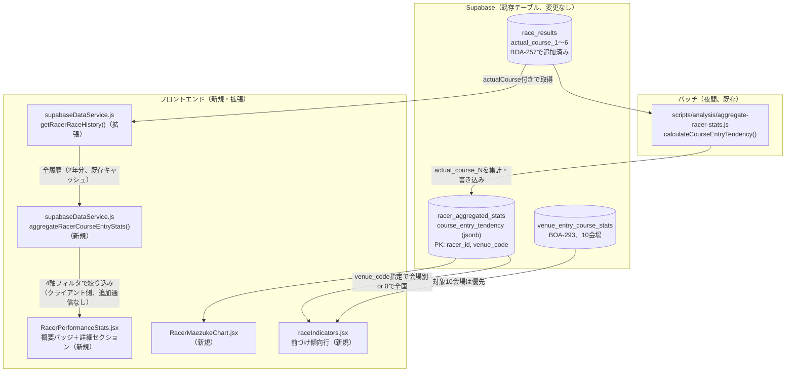
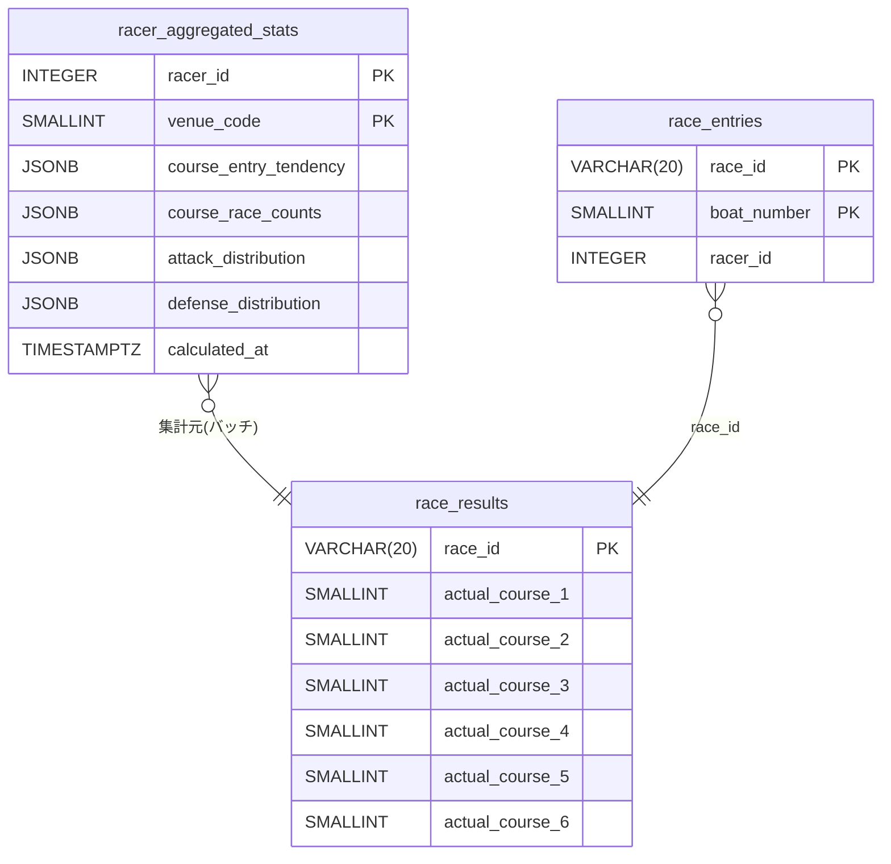

# 進入コース遷移傾向の再構築 plan

対応: [spec.md](./spec.md) / [screens.md](./screens.md)

## 全体アーキテクチャ

実コードを調査した結果、本機能に必要な計算ロジックの大部分は**既に実装済み**だと判明した（BOA-257のKファイル対応で`actual_course_1〜6`が追加されたのみで、それを消費する側がまだ追随していない状態）。新規テーブル・新規RPCは作らず、既存2箇所のデータソースを`actual_course_N`に切り替える／拡張するだけで済む。

## 技術判断: 新規インフラを作らず既存パターンを拡張する（[ADR-0064](../../adr/0064-course-entry-tendency-reuse-existing-infra.md)参照）

調査前は「選手×枠番→実進入コース遷移確率」を算出する新規関数・新規テーブルが必要だと想定していたが、実際には以下がBOA-257（PR #671）の時点で既に存在していた:

- `scripts/analysis/aggregate-racer-stats.js`の`calculateCourseEntryTendency(racerId, venueCode)`が、`race_entries`+`race_results`から「選手の枠番→実進入コース分布」を算出し、`racer_aggregated_stats.course_entry_tendency`（jsonb、`racer_id`+`venue_code`複合PK、`venue_code=0`は全国集計）に書き込む処理として**既に実装済み**。ただし参照している列が壊れた`course_1〜6`のまま（BOA-284の指摘そのもの）
- `racer_aggregated_stats`は`venue_code`ごとに行を持つ設計のため、**会場別の事前集計は既にテーブル構造として対応済み**（新規テーブル不要）
- `src/services/supabaseDataService.js`の`getRacerRaceHistory()`が選手の過去2年分の全レース履歴を1回のfetchでキャッシュし、`aggregateRacerVenueBoatStats()`/`aggregateRacerCrossStats()`という2つの純関数が会場×枠番×グレード×レース種別でクライアント側再集計する設計が、PR #686（BOA-159、ADR-0063）で既に確立している

この2つの既存基盤にそれぞれ1行〜数十行の変更を加えるだけで、FR-1〜FR-5の要件を満たせる。詳細はADR-0064参照。

## データ設計

**新規テーブル・新規マイグレーションは無し。** 既存の`racer_aggregated_stats`（`race_results.actual_course_1〜6`はBOA-257で追加済み、`docs/db-migration/065_race_results_actual_course_kfile.sql`）をそのまま使う。

### FR-1: `calculateCourseEntryTendency()`の修正

`scripts/analysis/aggregate-racer-stats.js`内:

1. `race_results`の`select`列を`course_1, course_2, ..., course_6`から`actual_course_1, ..., actual_course_6`に変更
2. `result[\`course_${c}\`]`の参照を`result[\`actual_course_${c}\`]`に変更
3. **新規追加**: 直近12ヶ月ウィンドウの適用（現状は無期限。データ蓄積が2025-12-04〜のため当面は無期限と実質同じだが、将来データが12ヶ月を超えても肥大化しないよう`race_id`の日付部分で絞り込みを追加する）
4. **新規追加**: 最小サンプル数（`MIN_COURSE_SAMPLES = 5`、既存`generate-unified-predictions.js`の定数と同じ値）未満の枠番は結果から除外する

同じ関数`aggregateRacer()`が呼び出している他の集計（`calculateRacerSTStats`等）には影響しない。

### FR-1受入基準の検証手順

1. `scripts/analysis/analyze-indicator-predictive-power.js`を、切り替え前（`course_1〜6`）と切り替え後（`actual_course_1〜6`）の両方で実行し、`courseRate`の予測力（上位2位計%）を比較する
2. `scripts/analysis/backtest-course-rate-only.js`を同様に前後比較する
3. `.claude/rules/analysis.md`のデータ精度検証パターンに従い、実データ2〜3選手分を手動でスポットチェックする（`race_entries`+`race_results.actual_course_N`から手計算した値と`course_entry_tendency`の出力が一致するか）
4. 結果が悪化していなければ、`scripts/lib/unifiedModel.js`の`INDICATOR_WEIGHTS.courseRate`（現在21.8）は変更不要（重み自体は予測力の相対順位で決まっており、絶対値の算出元が正しくなるだけで再計算の必要はない）。悪化していた場合はユーザーに報告し、reweighting要否を相談する

### FR-2: 選手ページ用のクライアント側集計（4軸フィルタ対応）

`src/services/supabaseDataService.js`の拡張:

1. `getRacerRaceHistory()`の`race_results`のselect列に`actual_course_1〜6`を追加
2. 返却する行オブジェクトに`actualCourse`フィールドを追加する（`calculateCourseEntryTendency()`と同じ导出ロジック: `actual_course_1〜6`のうち値が`entry.boat_number`と一致する列番号を採用。一致無し＝欠場等は`null`）
3. 新規純関数`aggregateRacerCourseEntryStats(history, venueCode, boatNumber, raceGrade, raceStage)`を追加する。シグネチャ・フィルタロジックは`aggregateRacerVenueBoatStats`と完全に同じパターン（会場×枠番×グレード×レース種別、`null`で絞り込み無し）。出力は「枠番ごとの実進入コース分布」（`{ waku: { course: { count, rate } } }`、直近12ヶ月ウィンドウ・`MIN_COURSE_SAMPLES=5`未満は`null`）
4. 新規通信（追加のSupabaseクエリ）は発生しない。既存の`getRacerRaceHistory()`が1回のページロードで取得する2年分の履歴データをそのまま使う（ADR-0063の設計方針を踏襲）

### FR-3: レース出走表の「前づけ傾向」行

`src/components/race/raceIndicators.jsx`に新規行を追加する。値の解決ロジック（優先順位）:

1. 対象10会場（BOA-293、`venue_entry_course_stats`）かつ今日のレースのデータがあれば、それを使う（`race_id`+`waku`で検索）
2. 無ければ`racerStatsMap`（既存、`racer_aggregated_stats`から`courseRateOf`と同じ経路で取得済み）の`course_entry_tendency[boat_number]`を使う。会場別の行（`venue_code`=今日の会場コード）があればそれを優先、無ければ`venue_code=0`（全国集計）にフォールバックする
3. どちらも無ければ「データ不足」表示

表示値のフォーマット（各艇の遷移確率分布のうち、どの数値を主表示にするか）は[screens.md](./screens.md)の未確定事項どおり実装時に確定する（候補: 最頻コースの確率、または枠なり進入率）。

### FR-4: 選手ページ（概要バッジ＋詳細セクション）

- **概要バッジ**: `racerStatsMap`相当のデータを選手ページ用に1回取得（`venue_code=0`の行）し、`course_entry_tendency`から「前づけ傾向の強さ」を判定してバッジ表示（閾値は実データ分布を見て確定、未確定事項参照）
- **詳細セクション**: `aggregateRacerCourseEntryStats()`（FR-2）の出力をそのまま表示。既存の「決まり手傾向」等と同じ`vcData`ベースの条件付きレンダリングパターンを踏襲

### FR-5: 分析タブ

`RacerMaezukeChart.jsx`（新規）は、選択された会場・レースの出走6選手について、それぞれの`racerStatsMap`（`venue_code`=選択会場の行、無ければ`venue_code=0`）の`course_entry_tendency[boat_number]`を取得して一覧表示する。`RacerTechniqueProfileChart.jsx`と同じ「会場選択→レース選択→出走選手一覧」のデータ取得パターンを踏襲し、新規RPCは作らない。

## コンポーネント構成・データフロー

[screens.md](./screens.md)の洗い出しと一致。追加のデータ取得関数は以下の1つのみ（他は既存関数の拡張）:

| 新規/拡張 | 場所 | 用途 |
|---|---|---|
| 拡張 | `scripts/analysis/aggregate-racer-stats.js::calculateCourseEntryTendency` | FR-1、全FRの土台 |
| 拡張 | `src/services/supabaseDataService.js::getRacerRaceHistory` | FR-2、FR-4詳細セクションの入力 |
| 新規 | `src/services/supabaseDataService.js::aggregateRacerCourseEntryStats` | FR-2、FR-4詳細セクションの集計 |
| 新規 | `src/components/racer/RacerCourseEntryBadge.jsx` | FR-4概要バッジ |
| 拡張 | `src/components/racer/RacerPerformanceStats.jsx` | FR-4 |
| 新規 | `src/components/analysis/RacerMaezukeChart.jsx` | FR-5 |
| 拡張 | `src/pages/WinningTechniqueAnalysis.jsx` | FR-5タブ追加 |
| 拡張 | `src/components/race/raceIndicators.jsx` | FR-3行追加 |
| 拡張 | `src/locales/{ja,en,zh-TW,ko}/common.json` | FR-3・FR-5のi18nキー |

## 実行タイミング

FR-1（`calculateCourseEntryTendency`修正）は既存の`aggregate-racer-stats.js`のバッチ実行に乗るため、新規のGitHub Actionsワークフローは不要（既存スケジュールをそのまま使う）。FR-2〜FR-5はすべてクライアント側実行のため実行タイミングの概念自体が無い。

## 既存サービス層・共通ライブラリとの連携

- `scripts/analysis/aggregate-racer-stats.js`: 既存ファイルへの修正のみ（新規ファイル無し）
- `src/services/supabaseDataService.js`: 既存の`fetchAllByIn`（N+1回避のバッチフェッチヘルパー）をそのまま使う
- `src/components/analysis/index.js`・`src/components/racer/index.js`: barrel exportへの追加のみ

## 未確定事項（spec.mdから持ち越し、着手前に確定させる）

| 項目 | 内容 | いつ・誰が決めるか |
|---|---|---|
| FR-1の予測力・回収率の悪化許容範囲 | 具体的な数値基準 | `/step4`着手時、実データ再検証の結果を見てユーザーと相談 |
| FR-3の表示値フォーマット | 最頻コース確率か枠なり進入率か | `/step4`着手時 |
| FR-4のバッジ判定閾値 | 「前づけ傾向あり」の遷移確率しきい値 | `/step4`着手時、実データ分布を見てから |
| BOA-284の再学習・本番反映 | 実施者・タイミング | `/step4`実装時、検証結果を見てユーザーに確認 |
