# K/Bファイルの長期バックフィル（2019-04〜現在）設計・取得計画

対応: [backfill-plan.md](../scraping-vercel-consolidation/backfill-plan.md)（WS5、範囲変更を反映）/ [orchestration.md](../scraping-vercel-consolidation/orchestration.md) / [完了の定義](../../../.claude/rules/data-acquisition.md) / [ADR-0067](../../adr/0067-official-site-content-redisplay-policy.md) / [analogy-finder](../analogy-finder/spec.md)（BOA-271）

本書はCLI・保存設計・取得計画・パーサーまでの成果物で、**本番の取得（K/Bの全期間ダウンロード）とDBへの書き込み・DDL適用は実行していない**。実行は、全データの取得設計が揃ってから（[§10](#10-設計が揃うまで保留する理由と保留中にやってよいこと)）。

## 1. 結論

1. **K/Bファイルは2005-01-01から取得できる**（月一覧・実ファイルで確認）。2019-04以降は、同じ固定幅形式で、全項目（ST・展示タイム・進入コース・風/波/天候・節日・ステージ・払戻）が取れ、パーサー1本で読める。**グレード（SG/G1等）はK/Bに専用欄が無く**、race/index（boatrace.jp、1日1リクエスト）で補完する（過去日ページに表示があることを確認）。
2. **保存は、本体テーブルに混ぜず、別の軽量なアーカイブ表（3表）に分ける**（[§4](#4-保存設計)）。約35万レース・約212万艇で、DBの増加は約+0.5GB（本体に混ぜると約+1.6GB）。生のLZHは取り直しをしないよう、そのまま別に保存する（[§7](#7-生ファイルの保存方針取り直しをしない設計)）。
3. **2019-04-01〜2025-12-02は4,866リクエスト、2019-04-01〜昨日は5,446リクエスト**。逐次・3〜5秒間隔・夜間窓・日次2,000件で**3夜**（2005-01〜2019-03を足すと約5夜追加）。**実行はユーザーの端末**（GitHub Actions・Vercelは、本番の取得と同じ送信元IPになり、ブロックの影響が本番に及ぶ。新規の取得ジョブをGitHub Actionsへ追加することもADR-0066が禁じている）。

## 2. 公式サイトへの確認（実リクエスト29回、上限40回以内）

UAは`BoatraceAIBot/1.0`、逐次、間隔3.2〜5.0秒（ジッター付き）。台帳で40回を機械的に強制し、403/429/503は連続2回で中止する実装で実行した。**403・429・503は0回**。応答時間は8.1〜10.3秒（この環境。中央値約9.3秒。ユーザー端末での実測は未計測）。

| 対象 | 回数 | 結果 |
|---|---|---|
| boatrace.jp ダウンロードページ（`extra/data/download.html`） | 1 | 200。K/B（mbrace.or.jp）へのリンクと、期別成績ファイルへのリンクがある（[副次的な発見](#副次的な発見)） |
| mbrace.or.jp 月の一覧（`K/dmenu.html`・`B/dmenu.html`・`K/dindex.html`・`B/dindex.html`） | 4 | 200。**K・Bとも2005-01〜2026-09の261か月**が連続で存在 |
| mbrace.or.jp 月別の日一覧（`K/200501/mday.html`・`K/202609/mday.html`） | 2 | 200。日一覧は開催の有無を示さない（2005-01は1〜31日すべて、2026-09は1〜20日を列挙） |
| Kファイル（実データ） | 9 | 2005-01-01、2005-01-04、2019-04-15、2020-06-10、2021-06-15（CLIの実行確認）、2022-03-24、2024-01-15、2025-11-12、2026-03-15。全て200 |
| Bファイル（実データ） | 8 | 2005-01-04、2019-04-15、2020-06-10、2021-06-15、2022-03-24、2024-01-15、2025-11-12、2026-03-15。全て200 |
| 応答の確認（存在しないもの） | 3 | 404（約200バイトのHTML）: 2026-09-21のK（未来日）と、私が誤ったパスを指定した2回（`K/260315/`・`B/260315/`）。403・429は出なかった |
| 当日分のK（2026-09-20、全レース終了前） | 1 | **200で321バイトのLZH。中身は「データは、この場の全レース終了後に登録されます。」のプレースホルダ**。確定データとして保存してはならない（CLIは検出して保存しない） |
| race/index（過去日のグレード表示の確認） | 1 | 200。2019-04-15でも、会場ごとのグレード（`is-G3b`・`is-ippan`・`is-lady`・`is-rookie`・`is-venus`）が表示される |

- **取得できる最古**: Kファイルは2005-01-01（1日から存在。実データ156レース）。Bファイルは2005-01-04を確認（2005-01-01のBは未取得）。月の一覧は両方とも2005-01から。より古い月が存在するかは、一覧に無いため確認していない。
- **開催の無い日の応答**: 存在しないパスは404（HTML）。実際に全国で開催が無い日（年末年始の休止日等）が過去にあるかは**未確認**（未来日の404のみ確認）。CLIは404を「開催なし」として記録するが、3回連続したら、URL構造の変更・アクセス制限の疑いで停止する。
- **形式の同一性**: 9日分（2005〜2026、1,415レース・8,490艇）で、同じパーサーが認識できない行0、全レース6艇、既存の本番パーサー（`kfileParser.js`）と進入コース・着順が完全一致した（[§9の検証](#9-検証結果)）。2005年は、Bの会場表記が「唐　津　競艇場」（2019年以降は「ボートレース唐　津」）、会場名が「琵琶湖」（現在は「びわこ」）だが、パーサーは会場コード（`NNKBGN`）で識別するため影響しない。

## 3. K/Bに含まれる項目（旧日付でも取れるか）

「全期間」は、2005-01-04・2019-04-15・2026-03-15の実ファイルで確認した項目。

| 項目 | K/B | 旧日付 | 備考 |
|---|---|---|---|
| 開催タイトル | K（本文の正式名称と、見出し行の20文字切り詰め）・B | 全期間 | 例: 「尼崎市制110周年記念尼崎センプルカップ」 |
| **グレード（SG/G1/G2/G3/一般）** | **専用欄なし** | — | タイトルに「Ｇ３オールレディース」のように含まれる場合があるだけ（不完全）。race/indexで補完（[§8](#8-グレードの補完見積りのみ)） |
| 節の日目・最終日 | K・B | 全期間 | 「第 3日」「最終日」。本体テーブル（`race_conditions.series_day`）は2026-02〜08で全て未取得だったため、K/Bの方が充足が高い |
| ステージ（予選/準優勝戦/優勝戦等） | K・B | 全期間 | 8文字程度に切り詰め（例:「モー２ング予」）。原文を保持し、`stage_kind`（final/semifinal/qualifier/other）は名称の部分一致で区分（DBの`race_stage`とは完全一致しない） |
| 天候・風向・風速・波高 | K（レース見出し） | 全期間 | **レース時点の確定値**（本体テーブルは発走60分前のスナップショットで、値が異なる。BOA-358） |
| 気温・水温 | なし | — | raceresultページのみ |
| 展示タイム | K | 全期間 | 展示ST・チルト・部品交換・当日体重は無い |
| ST（F・Lの表記を含む） | K | 全期間 | フライングは負値。`L`は出遅れ |
| 実進入コース | K | 全期間 | |
| 着順・レースタイム・決まり手 | K | 全期間 | 同着は同じ着順が複数行で出る（本体テーブルは同着を保持できない） |
| 払戻（単勝・複勝・2連単・2連複・拡連複・3連単・3連複と人気） | K | 全期間 | 「特払い」（70円）、「不成立」、空欄も出る。同着は組が複数 |
| 欠場・失格等 | K（着欄`K0`/`K1`/`S0〜S2`/`F`/`L0`/`L1`） | 全期間 | 艇の行としては残る（着・進入・STは空） |
| 出走表（級別・年齢・支部・体重・全国/当地の勝率と2連率・モーター/ボートの番号と2連率・今節成績・締切予定時刻） | B | 全期間 | **3連率は無い**。本体（racelistページ由来）と、同じレースで数値が一致しない列がある（尼崎1Rの`local_win_rate`はBが7.19、本体が7.25。`local_2rate`はBが58.54、本体が56.60）。**混ぜない理由の1つ** |

## 4. 保存設計

### 4.1 3案の比較

| 観点 | A: 本体テーブルに混ぜる | **B: 別のアーカイブ表（推奨）** | C: DBに入れない（Storage/ファイルのみ） |
|---|---|---|---|
| 内容 | races・race_entries・race_results・race_conditions・exhibition_data・race_start_timingsへ | `kb_archive_venue_days`・`kb_archive_races`・`kb_archive_boats`の3表（[§4.3](#43-er図とddl)） | 中間JSON（gz）を、ローカル・Storageに置く |
| 増加（推定、[§4.2](#42-容量と書き込み量の見積り)） | 約+1.6GB（638MB→約2.2GB） | 約+0.5GB（638MB→約1.16GB） | DBは0。中間JSON約250MB＋生LZH約150MB（DB外） |
| Disk IO・WAL | 大（6表×約35万レース分。索引も6表分。`race_results`のトリガー`trg_update_predictions`が約35万回発火） | 中〜小（3表、トリガー・外部キー無し）。投入中の追加WALは約50KB/s（現行の定常約125KB/sの4割）で、バーストにならない | なし |
| **本番の画面・集計への影響** | 大。過去分を範囲指定なしで読む集計が、意図せず過去分を拾う。例: `scripts/analysis/aggregate-racer-stats.js`は選手の`race_entries`を日付範囲なしで全件読む（77・179行ほか）ため、`racer_aggregated_stats`（選手ページ）の値が変わる | なし（別表。RLSでanon・authenticatedから読めない） | なし |
| 値の定義の混在 | あり。B由来の勝率（`local_win_rate`等）が、本体のracelist由来と混ざる。天候等も、本体は60分前・アーカイブは確定値 | なし（別表で由来が明確） | なし |
| BOA-271の読み方 | 既存のSQL・学習パイプライン（`features.load_dataset`）にそのまま乗る | SQLで絞り込み（グレード×ステージ×会場）→export。学習用にはアーカイブ表をCSVへexportして`backfill_dataset.csv`互換にする（`scripts/ml/backfill.py`の出力と同じ形式） | export後のファイル処理のみ。SQLで稀少セグメントを絞れない |
| 完了の定義A（実測クエリ） | 既存の月別充足率クエリに乗る | アーカイブ表で同様に実測できる | 実測がマニフェストのみ（DBの実測にならない） |
| 後戻り | 困難（6表から過去行を選んで削除） | 容易（`DROP TABLE`）。必要になれば本体へ`INSERT ... SELECT`で昇格できる | 容易 |
| `created_at`の扱い | NULLを明示して入れる（既存列にDEFAULT now()があるため） | NULL可・DEFAULTなし。バックフィル行は常にNULL | — |

**推奨: B**。根拠は、(1)値の定義が本体と一致しない（混ぜると既存の集計・画面が静かに変わる）、(2)容量とDisk IOが約1/3、(3)後戻りが容易で、必要なら本体へ昇格できる、(4)実測クエリ（完了の定義A）がDBでできる。**Aを選ぶのが妥当な場合**は、過去分を既存の集計（選手の通算成績等）にも反映させたいとき（この場合は集計側の対象期間を意図して設計する）。**Cを選ぶのが妥当な場合**は、BOA-271の読み取りが完全にexport＋オフラインで済むと確定したとき（DBを増やさない）。これはユーザー判断。

### 4.2 容量と書き込み量の見積り

推定値であり、実測ではない（DDLを本番へ適用していないため、実際の行サイズは未計測）。

- **レース数**: 2019-04-01〜2025-12-02は2,433日。1日の平均レース数は、K実ファイル7日（2019〜2026）の平均が144、本番DB（2025-12〜2026-09）が148.9。**約145×2,433=約35.3万レース、×6艇=約212万艇**（範囲は30〜38万レース。2020年はコロナ禍で少ない）。2019-04〜昨日（2,723日）では約39.5万レース。
- **アーカイブ表（B）**: 艇1行は約200B（ヒープ約150B＋主キー索引約45B。`race_start_timings`が143B/行・`exhibition_data`が115B/行の実測を参考に、列数の差で補正）。レース1行は約250B。**艇 約424MB＋レース 約88MB＋開催 約5MB＝約520MB（450〜600MB）**。DBは638MB→約1.16GB。
- **本体混在（A）**: 既存の実測（`race_entries`が327B/行、`race_start_timings`が143B/行、`exhibition_data`が115B/行、`races`が455B/行、`race_conditions`が253B/行、`race_results`が279B/行）から、**約+1.6GB**（race_entries +693MB、race_start_timings +303MB、exhibition_data +244MB、races +160MB、race_results +98MB、race_conditions +89MB）。
- **投入（load）**: 200行/文・文の間隔1秒で、艇 約1.06万文＋レース約1,800文（各文の前に既存行の読み取り1回）。約5〜6時間（1〜2夜）。追加WALは約1.1GB（データ約520MB×約2）。
- **ディスク上限**: Supabase Smallの契約上のディスク容量は**未確認**（ダッシュボードで要確認）。

### 4.3 ER図とDDL

DDLは`docs/db-migration/074_kb_archive_tables.sql`（**本番へ未適用**。適用はユーザーの承認後）。外部キー・トリガーは付けない（投入コストを下げるため）。整合はCLIの検証（K/Bのレース集合・登録番号）で担保する。3表の関係は論理的なもの。

```mermaid
erDiagram
    kb_archive_venue_days ||--o{ kb_archive_races : "venue_day_id (論理。FKなし)"
    kb_archive_races ||--o{ kb_archive_boats : "race_id (論理。FKなし)"
    kb_archive_venue_days {
        text venue_day_id PK
        date race_date
        smallint venue_code
        text title
        text title_short
        text day_label
        smallint series_day
        boolean is_final_day
        boolean has_k
        boolean has_b
        text race_grade
        timestamptz created_at
    }
    kb_archive_races {
        text race_id PK
        text venue_day_id
        date race_date
        smallint venue_code
        smallint race_number
        text stage
        text stage_kind
        smallint distance_m
        time deadline_time
        text weather
        text wind_direction
        smallint wind_speed
        smallint wave_height
        text technique
        boolean has_result
        boolean dead_heat
        integer payout_win
        integer payout_2tan
        integer payout_2fuku
        integer payout_3tan
        integer payout_3fuku
        text combo_3tan
        smallint popularity_3tan
        timestamptz created_at
    }
    kb_archive_boats {
        text race_id PK
        smallint boat_number PK
        integer racer_id
        text class
        smallint age
        text branch
        smallint weight
        numeric national_win_rate
        numeric national_2rate
        numeric local_win_rate
        numeric local_2rate
        smallint motor_number
        numeric motor_2rate
        smallint boat_id
        numeric boat_2rate
        numeric exhibition_time
        smallint course
        numeric start_timing
        boolean is_flying
        boolean is_late_start
        text finish_raw
        smallint finish_rank
        numeric race_seconds
        timestamptz created_at
    }
```



設計の要点:
- **命名**: `payout_3tan`=3連単、`payout_3fuku`=3連複。本体の`race_results`は`payout_trio`=3連単・`payout_trifecta`=3連複と逆転しているため、その癖を持ち込まない（尼崎1Rで、K=3連単2,760円・3連複1,690円、本体=`payout_trio` 2,760・`payout_trifecta` 1,690と突合済み）。
- **同着・欠場・F/L/失格**: `dead_heat`・`finish_raw`（原文）・`finish_rank`（同着は同じ値が複数艇）で保持する。本体テーブルは同着を保持できない（2026-03-15徳山6Rの3着同着で確認。本体のrank3は1艇のみ）。
- **`has_result`**: Kに結果が無いレース（中止・不成立の可能性）をfalseにする（Bにだけあるレース）。
- **`created_at`**: NULL可・DEFAULTなし。バックフィル行は常にNULL（取得時刻を偽らず、窓内取得率の計測から除外できる。`data-acquisition.md`）。
- **アクセス制御**: RLS有効・ポリシー無し・anon/authenticatedのREVOKE。service_roleのみ読める（公式データの再表示ポリシー、ADR-0067に照らし、公開APIへ出さない）。
- **列を増やしたくなったら**: DDLと`scripts/lib/kbArchiveRows.js`を更新し、`parse`（再解析）→`load`（再投入）する。**公式サイトへの再リクエストは不要**。

### 4.4 BOA-271（アナロジー・ファインダー）への効果

SG・G1の優勝戦のnは、節数から見積もる（1節=6開催日として、SG・G1の開催日数を割る。**推定**）。現状の本番DB（2025-12〜2026-09、約7.5か月）は、SG 30会場日・G1 140会場日（2026-02以降の実測）で、SGは約5節・G1は約23節。

| 区分 | 現状（2025-12〜） | 2019-04〜現在 | 2005-01〜現在 |
|---|---|---|---|
| SGの優勝戦（1節1回） | 約5 | 約55 | 約170 |
| G1の優勝戦 | 約23 | 約270 | 約800 |

つまり、2019-04以降を入れると、稀少セグメントのnは約10倍になる。**ただし、グレードがK/Bに無いため、race/indexでの補完（§8）が前提**。ステージ（優勝戦・準優勝戦）はK/Bで取れる。

## 5. CLI（`scripts/maintenance/kb-backfill.js`）

取得・解析・投入を別ステップに分離している。

```
plan      取得の見積り（リクエスト数・夜数）。ネットワーク・書き込みなし（= download --dry-run）
download  公式サイトから生LZHをアーカイブへ保存（ネットワークのみ。DBは触らない）
parse     生LZH → 全項目の中間JSON（kb-day/v1）。ネットワーク・DB不要。何度でも再実行できる
load      中間JSON → アーカイブ表。既定は検証のみ。--apply がなければ書き込まない
status    期間内の取得・解析・投入の状況
```

```
node scripts/maintenance/kb-backfill.js plan     --from=2019-04-01 --to=2025-12-02
node scripts/maintenance/kb-backfill.js download --from=2019-04-01 --to=2025-12-02 [--kinds=K,B] [--daily-limit=2000] [--window=22-06]
node scripts/maintenance/kb-backfill.js parse    --from=2019-04-01 --to=2025-12-02
node --env-file=.env.local scripts/maintenance/kb-backfill.js load --from=2019-04-01 --to=2025-12-02           # 検証のみ
node --env-file=.env.local scripts/maintenance/kb-backfill.js load --from=2019-04-01 --to=2025-12-02 --apply   # 書き込み（承認後）
```

| 機能 | 実装 |
|---|---|
| 期間指定 | `--from`（必須）・`--to`（既定は昨日。**当日・未確定の日は自動で除外**。当日はプレースホルダが返るため） |
| 中断・再開 | アーカイブの`manifest.jsonl`（追記のみ）が状態の正本。`ok`・`absent`（404）・`skipped`は完了、`error`・`pending`・未着手は再実行で再取得。再実行で続きから |
| 日次上限・時間帯 | `--daily-limit`（既定2,000リクエスト/夜）・`--window`（既定JST 22〜06。`any`で無効）。窓外・上限到達は**安全停止（終了コード2）**。夜の集計は、日をまたいでも同じ夜に数える |
| 逐次・間隔 | 同時接続1。間隔は`--interval-min-ms`〜`--interval-max-ms`（既定3〜5秒、ジッター付き）。**3秒未満は指定できない**（切り上げ） |
| サーキットブレーカー | 403は2回連続、429・503・5xx・接続失敗は3回連続で**即停止（終了コード4）**。429・503・接続失敗は指数バックオフ（30秒→60秒→…上限5分）で同じ対象を再試行。**404が3回連続、LZHとして展開できない200応答が3回連続でも停止**（URL構造の変更・ブロックの疑い）。停止時は再開位置を出力し、`runs.jsonl`に記録 |
| K不在日のB省略 | Kが404の日（開催なし）はBを取得しない（`skipped`）。リクエストを半減 |
| プレースホルダ | Kが「全レース終了後に登録されます」なら`pending`とし、生ファイルを保存しない（後で再取得） |
| 生ファイルの保存 | LZHをバイト単位でそのまま保存（`raw/K/YYYYMM/kYYMMDD.lzh`。公式のURL構造と同じ）。sha256・取得時刻・応答時間をマニフェストに記録 |
| dry-run | `plan`／`download --dry-run`は、ネットワークもファイル書き込みもしない。`load`は`--apply`が無ければDBへ書かない。取得＋解析（DBなし）は`download`→`parse`（中間JSONをローカルへ出力） |
| 変更の無い行は書かない | `scripts/lib/unchangedRows.js`の`upsertChangedRows`を再利用（既存行を読み、差分のある行だけ書く）。再実行しても書き込みが増えない。アーカイブ表のnumeric列の丸めを`NUMERIC_SCALES`に登録 |
| 書き込み200行/文・間隔1秒 | `--batch-size`（既定200）・`--sleep-ms`（既定1000）。投入済みの日は`loaded.jsonl`に記録して再実行でスキップ |
| 0件を成功にしない | `download`で保存も不在記録もゼロなら終了コード1。`parse`で出力ゼロなら1。`load --apply`で書き込みも「変更なし」判定もゼロなら1 |
| 進捗ログ | 1リクエストごとに`[n/総数] 日付 種別 結果 バイト数 ms（今夜 n/上限）`。`parse`は日ごとにレース数と要確認を出力。要確認（K/Bのレース数不一致、艇数≠レース数×6、未認識行）は`parsed/anomalies.jsonl`にも記録 |
| 本体との重複防止 | `load`は、本体テーブルの範囲（2025-12-03以降）に重なる`--to`を拒否（検証用の`--allow-overlap`のみ例外） |

アーカイブの既定の置き場所は`data/kb-archive/`（`.gitignore`済み、`--archive-dir`で変更）。中間JSONは`parsed/YYYYMM/kb-YYYY-MM-DD.json.gz`（1日約100KB。`--plain`で非圧縮）。

### 中間形式（kb-day/v1）

パーサー（`scripts/lib/kbFileParser.js`）は、DBに入れる項目に絞らず、K/Bに含まれる項目を全て保持する。会場ごとに、見出し行の原文・タイトル（正式名称と切り詰め版）・日目・払戻金一覧表の原文・レース（ステージ原文・距離・天候・風向・風速・波高・決まり手・艇ごとの全欄＋尾部の原文・払戻（種別・組・金額・人気・特払い/不成立/空欄）・認識できなかった行`extra_lines`）と、B側の出走表全欄（今節成績の原文を含む）を持つ。**認識できない行は捨てず`unparsed`・`extra_lines`に残す**ため、BOA-365で洗い出し中の未取得項目（返還・特払い・同着・着順異常等）も、パーサーを拡張すれば、再リクエスト無しで拾える。DBへ入れる列の選択は`scripts/lib/kbArchiveRows.js`が中間形式から行う。

## 6. 取得計画とIP対策

### 6.1 リクエスト数と所要時間

| 範囲 | 日数 | リクエスト（K+B） | 日次2,000で | 備考 |
|---|---|---|---|---|
| **2019-04-01〜2025-12-02（アーカイブ表の範囲）** | 2,433 | 4,866 | **3夜** | 必要な最小範囲 |
| 2019-04-01〜昨日（2026-09-19） | 2,723 | 5,446 | **3夜** | 2025-12-03〜（291日・582リクエスト）は本体テーブルのバックフィル（[backfill-plan.md](../scraping-vercel-consolidation/backfill-plan.md) Phase 0）の入力にもなる。**同じアーカイブで共用し、二重取得しない** |
| 2005-01-01〜2019-03-31（追加） | 5,203 | 約10,400 | 約5夜追加 | 2005〜2018年はファイルが大きい（2005-01-04のKは60KB、Bは50KB）。年代で仕様が異なる（例: 3連単の導入は2004-11） |
| 全期間（2005-01〜昨日） | 7,926 | 約15,800 | 約8夜 | |

- **所要時間**: 1リクエスト＝間隔（平均4秒）＋応答時間。ユーザー端末の応答時間は未計測。応答1秒なら、2019-04〜2025-12-02は約6.8時間（夜2,000件で約2.8時間）。この環境の実測（約9.3秒）なら約18時間（夜2,000件で約7.5時間、窓22〜06に収まる）。
- **日次上限の選択肢**: 慎重（1,500件/夜→4夜）／標準（2,000件/夜→3夜、推奨）／積極（3,000件/夜→2夜）。**いずれも平均0.25リクエスト/秒以下**（間隔の平均4秒。積極でも夜間8時間に3,000件=平均約0.1リクエスト/秒）。「短期間で完了」と「慎重」の折り合いは、標準の3夜。
- **取得量**: 1日のK＋Bは約62KB（LZH。7日の実測の平均: K約34KB・B約28KB）。2019-04〜2025-12-02で約150MB。

### 6.2 取得先への負荷（現行との比較）

- 現行の日次運用は、boatrace.jpを1日あたり約11,700〜13,500ページ取得している（[job-inventory.md](../scraping-vercel-consolidation/job-inventory.md)の推定）。K/Bのホストは**別（mbrace.or.jp）**で、現行は、Kファイルの同期（`syncActualCourseFromKFile`・`syncRank456FromKFile`）が、未完了があるとき直近4日分を2関数で別々に取得している（5分ごとの実行のたびに最大8リクエスト。実頻度は未計測）。
- 本計画は、mbrace.or.jpへ、**夜間に約4秒に1リクエスト（合計約60MB/夜）**。現行の同期が最悪の場合に出しうるリクエスト率（約37秒に1回相当）より高いが、静的ファイルで、1〜3夜で終わる。ADR-0067（禁止事項5: 運営に支障を与える大量アクセス）への配慮として、逐次・3秒以上・夜間・日次上限・サーキットブレーカーを実装済み。
- **2025-03-05に、mbrace.or.jpの「番組表閲覧」「オッズ情報・結果」「競走成績閲覧」はサービスを終了している**（ダウンロードページの記載）。ダウンロード（K/B）は現在も提供されているが、**将来の継続は保証されない**。生ファイルの早期保存には、この理由もある（[§10](#10-設計が揃うまで保留する理由と保留中にやってよいこと)）。

### 6.3 実行主体の比較

| 観点 | **ユーザーの端末（推奨）** | GitHub Actions | Vercel Functions/Cron |
|---|---|---|---|
| 送信元IP | ユーザー自身の回線（ブロックされても影響は端末のみ） | Azureの共有レンジ（多数の利用者と評判を共有）。**本番の日次取得（Kファイル同期）と同じ送信元になり得る**。ブロックが本番に波及する | 本番の取得と同じ共有IP。同上 |
| 停止時の影響 | 端末で止めるだけ | ジョブが失敗しても、次回もIPが変わる（ブロックの検知が難しい） | 本番のCronと干渉 |
| 実行時間の制約 | 端末が起動している必要（22〜06の窓） | 1ジョブ最大6時間。夜3回に分割が必要 | 関数の最大実行時間（数分〜数十分）。不向き |
| ルール | 制約なし | **ADR-0066が、新規の取得ジョブのGitHub Actionsへの追加を禁止** | バックフィルは手動CLIとする方針（`data-acquisition.md`） |
| 成果物の保存 | ローカル（約150MB）。DBへの書き込みも、ユーザーの承認・端末での実行が前提（自動モードのエージェントは本番書き込みを拒否される実績あり） | artifactに保存が必要 | 不向き |
| 応答時間 | 日本国内から、この環境（約9秒）より速い見込み（未計測） | 未計測 | 未計測 |

**推奨: ユーザーの端末**。端末が使えない場合は、別の小さなVM（独立したIP）。GitHub ActionsとVercelは、本番の取得と送信元を共有するため避ける。

### 6.4 失敗時のフォールバック

1. **サーキットブレーカーが作動（終了コード4）**: 直ちに停止し、再開位置を出力する。**同じIPで再開せず、24時間以上空け**、`--daily-limit`を半分・`--interval-min-ms`を倍にして再開する。403が再発するなら、ブロックされた可能性が高いので、それ以上続けない。
2. **404の連続・LZHでない応答**: URL構造の変更・提供終了の疑い。ダウンロードページ（`extra/data/download.html`）で提供状況を確認する。
3. **一部の日だけ欠ける**: `error`の日は再実行で再取得される。永続的に失敗する日は`manifest.jsonl`で特定し、個別に対応する。
4. **代替の取得元**: K/Bが使えない場合、boatrace.jpのraceresult・racelist等で、1レース1ページ（約35万レース×2ページ以上）となり、実質的に実行不能（負荷がK/Bの約100倍）。**K/Bが唯一の現実的な手段**なので、提供が続いているうちに生ファイルを保存する価値が高い。

## 7. 生ファイルの保存方針（取り直しをしない設計）

**LZHをバイト単位でそのまま保存し（真のソース）、中間JSONは何度でも再生成できる派生物として扱う**。パーサーが拾う項目が増えても、`parse`をやり直すだけで、公式サイトへの再リクエストは要らない。

| 保存先 | 容量（2019-04〜2025-12-02） | 長所 | 短所 |
|---|---|---|---|
| **ローカル（リポジトリ外、既定は`data/kb-archive/`=gitignore）** | LZH約150MB（2019-04〜昨日で約170MB、2005-01〜2019-03を足すと約+570MB）＋中間JSON約250MB | 追加コストなし。実行端末に置ける | 端末の故障で失う。複数端末で共有しにくい |
| Supabase Storage（非公開バケット） | LZH 約150MB | 耐久性。DBのディスク・IOと独立（Storageは別枠）。他のセッション・端末から読める | 容量・転送の契約枠は未確認。アップロードの実装が別途要る |
| リポジトリにコミット | — | — | **不可**。公式データの再配布に近く、リポジトリが肥大化する（ADR-0067） |

**推奨**: まずローカルに保存し（`download`）、完了後に、生LZHを月別に非公開のStorageバケットへ複製してバックアップする（アップロードは未実装。必要になった時点で、`raw/`配下をバケットへ同期するスクリプトを追加する。YAGNI）。中間JSONは再生成できるためバックアップ不要（時間短縮のためにStorageへ置くのは任意）。

ADR-0067（再表示ポリシー）との関係: 生ファイルは**内部の再解析用に非公開で保存するだけで、再配布・公開しない**（バケットは非公開、アーカイブ表はRLSで公開APIから読めない）。ADR-0067の判断（リスクを認識して現状維持）の範囲内だが、**アーカイブのデータを画面に表示する場合は、ADR-0067の見直し契機（取得・表示の量や範囲が大きく変わる場合）に該当しうる**ため、別途確認する。

## 8. グレードの補完（見積りのみ）

K/Bにグレードが無い。**取得は行っていない**。

| 案 | 内容 | 費用 | 確度 |
|---|---|---|---|
| **A: race/indexの過去日ページ（推奨）** | `https://www.boatrace.jp/owpc/pc/race/index?hd=YYYYMMDD`。会場ごとのグレード表示（`is-SGb`・`is-G1b`・`is-G2b`・`is-G3b`・`is-ippan`）。**2019-04-15で実在を確認**（G3×2・一般×9・レディース・ルーキー・ヴィーナスの区分が読めた） | 1日1リクエスト＝2019-04〜2025-12-02で**2,433リクエスト**（boatrace.jp、約50KB/回）。2019-04〜昨日で2,723。2005〜2019-03を足すと約5,200追加。K/Bと同じ夜間・間隔・サーキットブレーカーで、日次2,000で約2夜 | 高（公式の表示そのもの）。2005年頃までのページ存在は未確認 |
| B: タイトルの規則による推定 | SGは8大会の名称（クラシック・オールスター・グランドチャンピオン・オーシャンカップ・メモリアル・全日本選手権・賞金王決定戦・チャレンジカップ）で判定。G1は「周年記念」等。G2・G3・一般は判別が曖昧 | 0リクエスト | SG・G1の一部のみ。G2/G3/一般の区別は不可。BOA-271の稀少セグメント（SG/G1）には足りるが、誤判定の検証が要る（本体の2026年の実データ29,628レースで精度を測れる。未実施） |

推奨は**A**（K/B取得と別のステップ、`kb_archive_venue_days.race_grade`を補完）。SG/G1だけが必要ならBで先に近似し、Aで確定する二段構えも可。

## 9. 検証結果

`node scripts/maintenance/verify-kb-file-parser.js`（`npm run verify:kb-backfill`）。

- **実データ9日（2005-01-01/04、2019-04-15、2020-06-10、2021-06-15（CLIの実行確認）、2022-03-24、2024-01-15、2025-11-12、2026-03-15）の全ファイル**: 1,415レース・8,490艇。認識できない行0、全レース6艇、KとBのレース集合と全艇の登録番号が一致、払戻がファイル冒頭の払戻金一覧表と一致、既存の本番パーサー（`kfileParser.js`）と進入コース・着順が完全一致（差0）。
- **本番DBとの突合（2026-03-15、156レース）**: DBに結果のある154レースのうち、3連単の払戻154/154一致、3連複の払戻154/154一致、着順（1〜3着）153/154一致。**不一致1件（徳山6R）は、3着同着**（K: 3号艇と5号艇、3連単1-2-3と1-2-5の2通り）で、本体は1艇のみを保持している（本体の構造上の制約であり、Kが正しい）。DBに結果の無い2レース（下関11R・12R）は、既知の欠落（backfill-plan §1.2の1,372レースの一部）で、Kファイルで補える。尼崎1Rは、展示タイム6艇・ST6艇・決まり手・ステージ・締切時刻も一致。天候・風は、本体が発走60分前のスナップショットで、Kの確定値と異なる（BOA-358の既知の差）。
- **フィクスチャ**（`scripts/lib/__fixtures__/kbfile/`。実ファイルから、欠場・F・L・失格・特払い・不成立・同着を含む会場ブロックを抜粋）で、これらの特殊表記が保持されることを確認: 同着、特払い（70円）、不成立、欠場（K0/K1）、F（負のST）、L（出遅れ）、失格（S0〜S2）。
- **CLI**（fetchを差し替えて実行。公式サイトへは接続しない）: 403で2回、503で3回、404で3回、LZHでない応答で3回連続して停止（終了コード4）。日次上限・窓外で安全停止（終了コード2）。プレースホルダは保存しない。K不在日のBを省略。`--dry-run`はネットワーク・書き込みなし。0件を成功にしない。
- **`load`の書き込み経路**（メモリ上の偽クライアント。本番DBには接続しない）: 初回は170行（開催2＋レース24＋艇144）を書き込み、再実行は書き込み0・スキップ170（変更の無い行を書かない）。403の再試行でも3秒以上の間隔を空けることも確認。
- **実際のダウンロード**: 2021-06-15のK・Bを、CLIの`download`で実際に取得（2リクエスト）→`parse`（168レース・要確認0）→再実行で「未取得なし」→`load`（検証のみ）が、期待どおり動作した。
- **代表日での`parse`・`load`（検証のみ）の確認**: 取得済みの実データ8日（2005〜2026）の生LZHを、アーカイブへ取り込んで`parse`を実行し、出力を確認した（初回に、同着の払戻継続行の認識漏れ1件が見つかり修正。修正後は全日で要確認0）。`load`（DBなし）は、2025-12-02以前の7日で91開催・1,091レース・6,546艇・警告0。
- 未検証: ユーザー端末での応答時間、`load --apply`の実DBへの書き込み（DDL未適用・本番書き込み禁止のため未実行。書き込み経路は偽クライアントで確認済み）、2005〜2018年の日々の形式変化（サンプル外の日に未知の表記がありうる。`unparsed`・`extra_lines`と`anomalies.jsonl`で検知する設計）。

### 副次的な発見

ダウンロードページ（`extra/data/download.html`）に、**選手の期別成績ファイル**（`/static_extra/pc_static/download/data/kibetsu/fan{YYMM}.lzh`。2002年から年2回、2026-04まで）へのリンクがある（リンクの存在のみ確認。**ファイル自体は未取得・内容と利用条件は未確認**）。[backfill-plan.md §3.1 #14](../scraping-vercel-consolidation/backfill-plan.md)は「過去の期別成績は直近の1期分のみ取得できる」としていたが、このファイルで過去の期の値が取れる可能性がある。別途確認する価値がある。

## 10. 設計が揃うまで保留する理由と保留中にやってよいこと

**保留する理由**（ユーザー判断、2026-09-20）: 全データの最適な取得設計が揃う前にバックフィルを走らせると、取得元・列・保存先が変わったときに二度手間になりうる（保存先A/B/Cの決定、`kb_archive_*`のDDL、グレード補完の方式、他のデータセットとの共通基盤=Vercel移行後の取得・監視の枠組み）。

| 項目 | 保留中に | 理由 |
|---|---|---|
| `load --apply`・DDL 074の適用 | **保留**（ユーザー承認が前提） | 保存先の決定（A/B/C）、統合設計（WS3）との整合、本番DDL |
| グレード補完（race/index、2,433リクエスト） | **保留** | K/Bと別ホスト・別ページ。方式（A/B案）と、取得基盤の設計が揃ってから |
| パーサー・CLIの改善、`plan`・`parse`・`load`（検証のみ）、テスト | **やってよい**（本PRで実施済み） | 公式サイトにもDBにも触れない |
| **生LZHの取得・保存（`download`のみ）** | **推奨: 先行してよい**（ただし、ユーザーの明示の承認を得てから。本PRでは実行していない） | 下記 |

**生LZHの先行取得が「後戻りしにくい判断ではない」理由**: (1)取得はDB設計・パーサー・他のデータセットの設計のいずれにも依存しない（真のソースを、バイト単位で保存するだけ）。後から列・保存先・パーサーが変わっても、`parse`・`load`をやり直せば済み、**取り直しは発生しない**。(2)K/Bは他のデータセットと取得を共有しない（別ホスト・別ファイル）ため、「設計が揃ってから」まとめて取ることによる効率化が無い。(3)提供終了のリスクがある（[§6.2](#62-取得先への負荷現行との比較)。同じmbrace.or.jpの他サービスは2025-03-05に終了済み）。(4)取得のリスク（IP制限）は、待っても減らない（先行して実行し、問題があれば早く知る方が設計判断に効く）。**先行する場合の条件**: 範囲を確定する（2019-04〜昨日を推奨。2005-01〜2019-03は、BOA-271でnが不足すると分かってから）、実行はユーザー端末、日次2,000件・夜間、最初の1夜（約2,000リクエスト）の結果（応答時間・エラー・403の有無）を報告してから残りを続ける。

## 11. 未確認事項・ユーザーへの確認事項

**未確認**:
- ユーザー端末の応答時間（この環境は約9.3秒。日次上限・所要時間の見積りが変わる）
- mbrace.or.jpのレート制限・IPブロックの閾値（本確認は29リクエスト・403/429/503なし。閾値の存在も未確認）
- 開催が全く無い日（全国休止日）の応答（未来日の404のみ確認）
- 2005-01-01のBファイルの存在（Kは確認）。2005〜2018年の各日の形式の変化
- 2005〜2019-03のrace/indexの過去日ページの存在（2019-04-15のみ確認）
- Supabase Smallの契約上のディスク上限、Storageの容量・転送の契約枠
- アーカイブ表の実際の行サイズ（見積りは既存テーブルの実測からの推定）
- `fan{YYMM}.lzh`（期別成績）の内容・利用条件

**ユーザー確認**:
1. 保存先: **B（別のアーカイブ表、推奨）**／A（本体に混ぜる）／C（DBに入れない）
2. 範囲: 2019-04〜昨日（推奨）／2005-01〜（追加約5夜。nが不足する場合）
3. 実行主体: ユーザー端末（推奨）／別VM
4. 日次上限: 標準2,000件/夜（3夜、推奨）／慎重1,500件/夜（4夜）／積極3,000件/夜（2夜）
5. 生LZHの先行取得の可否（[§10](#10-設計が揃うまで保留する理由と保留中にやってよいこと)）
6. グレード補完の方式: race/index（推奨）／タイトル推定のみ／保留
7. 生LZHのバックアップ先: ローカルのみ／非公開Storageへ複製（推奨）

## 12. 完了の定義（実行時の判定。[data-acquisition.md](../../../.claude/rules/data-acquisition.md)）

- **A（件数）**: 対象期間の日数×2（K・B）から、Kが404（開催なし）の日とそのBを除いた数が、`manifest.jsonl`の`ok`件数と一致すること（`status`で確認）。DBは、`parse`の集計（K/Bのレース数）を期待件数として、`kb_archive_races`（レース数）・`kb_archive_boats`（艇数=レース数×6）の月別件数を実測クエリで確認する（充足率99%以上。中止・不成立は`has_result=false`として件数を報告）。分母から除くのは、Kが404の日と、`has_result=false`のレース。
- **B（タイミング）**: 対象外。静的な過去ファイルで、レースの進行に応じて値が変わるデータではない。バックフィル行の`created_at`はNULL（窓内取得率の計測から除外）。
- **C（継続監視）**: 取得完了後は更新されない。ただし、`load`後に、アーカイブ表の月別件数と`manifest.jsonl`の件数の突合を1回実行して報告する。大量書き込みの前後（`load --apply`）で、ダッシュボードのDisk IO消費を確認し、完了報告に含める。
