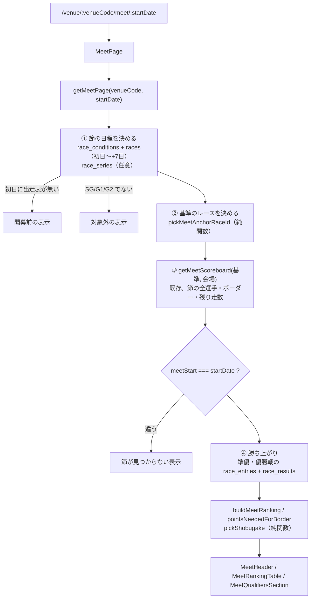

# 節ページ plan

spec: [spec.md](./spec.md) / 画面: [screens.md](./screens.md)

## 1. 全体の流れ

新規のスクレイプ・テーブル・マイグレーションは無い。読み取りだけで作る（ER図の生成は不要）。

## 2. データの取り方

### 2.1 `getMeetPage(venueCode, startDate)`（`supabaseDataService.js` に追加）

| # | クエリ | 目的 |
|---|---|---|
| 1 | `race_series`（venue_code, start_date）1行 | 節タイトル・最終日・グレード。**無くてもよい**（10月以降は未投入。2026-10-02確認） |
| 2 | `race_conditions`（初日〜初日+7日、会場で絞る）race_id, race_stage, series_day, is_final_day, race_title | 節に属する日の判定・段階・節タイトルの代わり・準優/優勝戦のレース |
| 3 | `races`（同じ窓）race_id, race_grade, cancellation_status | グレード判定・中止 |
| 4 | `getMeetScoreboard(基準, 会場)` | 既存（2+6本）。節単位のキャッシュ |
| 5 | `race_entries`（準優・優勝戦の race_id）＋ `race_results`（rank1〜6） | 勝ち上がり（2本） |

1〜3 は並列、4・5 は並列。初回 約13本、同じ節を2回目に開いたときはキャッシュ（`withCache`、キー `meet-page-v1-${venue}-${startDate}-${基準}`）。

### 2.2 節に属する日（`meetDaysOf`、純関数）

`race_conditions` の行を日ごとにまとめ、既存の `findMeetStartDate`（`src/utils/meetGrouping.js`）で「その日の節の初日」を出し、`startDate` と一致する日だけを節の日とする。境目の判定（前日が最終日・`series_day` の巻き戻り・2日以上の空き）を書き直さない。

- 初日に `race_conditions` も `race_entries` も無い → 開幕前（今日 < 初日）か、節が見つからない（今日 ≥ 初日）
- `race_series` があれば最終日・タイトルはそちらを優先。無ければ `is_final_day` の日、無ければ「分かっている最後の日」

### 2.3 基準のレース（`pickMeetAnchorRaceId`、純関数）

`getMeetScoreboard` は「表示中のレース」を基準に、それより前を済んだ走、以後を残りの走として数える（`remainingPrelimRunsByRacer` 等）。節ページでは「まだ結果が出ていない、節の最初のレース」を基準にする。

- 節の日のレースを race_id 順に見て、結果も中止確定も無い最初のレース
- 全部済んでいる（節が終わった）→ 節の最後のレース。予選終了後なので `officialByRacer` が使われる
- 今日の残りレースが無く、明日の出走表がまだ無い（夜の時間帯）→ 今日の最後のレース＋**全部済み扱い**にするため、基準の直後の架空ID（`{日付}-{会場}-13`）を使う。`countsForSeriesScore(null, …)` で予選終了後でも当社計算になるケースが残るので、予選が終わっていれば最後のレースを基準にする（テストで固定）

### 2.4 勝ち上がり（`buildQualifiers`、純関数）

`classifyStage`（`seriesPoints.js`）で準優勝戦・優勝戦のレースを選び、出走表と結果を合わせる。準優のメンバーが「予選の上位 `semifinalSlots` 人」と一致するかはページでは検査しない（番組が正）。

### 2.5 勝負駆け（`pickShobugake`、純関数）

予選中だけ。対象は残り予選走数が1以上の選手のうち:
- 枠外: 残りを全部1着でボーダーの得点率に届く（`pointsNeededForBorder` ≤ 残りの最大点）
- 枠内: 残りを全部6着にするとボーダーの得点率を下回る

ボーダーの得点率は「今の `semifinalSlots` 位の得点率」（今節タブと同じ推定）。範囲はモック承認時に変わりうる（spec 未確定事項）。

## 3. 画面

screens.md のとおり。

- `src/pages/MeetPage.jsx` を `AppRouter.jsx` に `venue/:venueCode/meet/:startDate` で追加（`lazy`）。`/venue` は `TRANSLATED_PATHS` の前方一致（`languages.js` の `isFullyTranslatedPath`）で多言語版も配信される
- title・description・canonical は既存ページと同じ方法（VenueRaceListPage の useEffect を踏襲）。title は `{会場}競艇 {節タイトル} 得点率ランキング・準優ボーダー | 龍神レーダー`（ja）。en 等は `t()` で各言語の文言
- `Breadcrumb` に「トップ › 会場 › 節タイトル」
- 導線: `VenueRaceListPage` 上部に `MeetRankingPreviewCard`（当日の先頭レースの `raceGrade` が SG/G1/G2 のとき）。`RaceMeetTab` の表の下に「全選手を見る」リンク（`race.raceGrade` が SG/G1/G2 のとき。リンク先の初日は `board.meetStart`）

## 4. sitemap

`scripts/generate-sitemap.js` に、`race_series` の grade が SG/G1/G2 で `start_date ≤ 今日+14日` の節を `/venue/{code}/meet/{start}`（＋多言語版）で足す。lastmod は `min(end_date, 最新の開催日)`。開幕前の節は lastmod を出さない。`race_series` が無い期間の節は載らない（データ取得レーンの投入待ち。ダービーは投入後に載る）。

## 5. i18n

`meetPage.*` を ja/en/zh-TW/ko に追加。新しい用語（勝負駆け・準優の枠・順位の対象外）は `docs/reference/i18n-glossary.md` を先に確認し、無ければ追記してから訳す。選手名に `translate="no"`。

## 6. テスト

| 対象 | 置き場所 |
|---|---|
| `meetDaysOf`・`pickMeetAnchorRaceId`・`buildQualifiers`・`pickShobugake` | `scripts/maintenance/verify-meet-page-model.js`（ci、verify-registry 登録） |
| 節ページの表示（児島 2026-09-28 の節） | `e2e/meet-page.spec.js` |
| 5幅の横スクロールなし | `e2e/layout.spec.js` の PAGES に追加 |
| 受け入れ | `e2e/acceptance/meet-page.spec.js`（acceptance-test-writer） |

## 7. 公開の段取り

10/20 までに本番。ダービー（尼崎 13、10/27〜）は開幕前の表示で公開され、10/27 から中身が出る。`race_series` の投入（データ取得レーン）が先なら節タイトル・期間も開幕前から出る。
