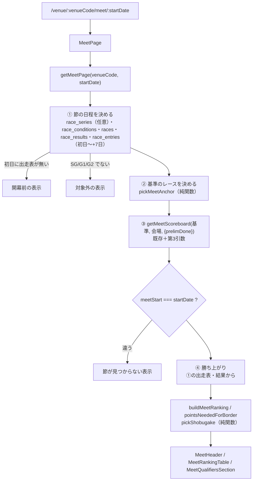

# 節ページ plan

spec: [spec.md](./spec.md) / 画面: [screens.md](./screens.md)

## 1. 全体の流れ

新規のスクレイプ・テーブル・マイグレーションは無い。既存の `getMeetScoreboard` に省略可能な第3引数を1つ足す（今節タブの挙動は変えない）。読み取りだけで作る（ER図の生成は不要）。

## 2. データの取り方

### 2.1 `getMeetPage(venueCode, startDate)`（`supabaseDataService.js` に追加）

| # | クエリ | 目的 |
|---|---|---|
| 1 | `race_series`（venue_code, start_date）1行 | 節タイトル・最終日・グレード・開幕前の判定。**無くてもよい**（10月以降は未投入。2026-10-02確認） |
| 2 | `race_conditions`（初日〜初日+7日、会場で絞る）race_id, race_stage, series_day, is_final_day, race_title | 節に属する日・段階・予選最終日（series_day）・準優/優勝戦のレース |
| 3 | `races`（同じ窓）race_id, race_grade, cancellation_status | グレード判定・中止 |
| 4 | `race_results`（同じ窓）race_id, rank1〜6 | 基準のレースの決定・勝ち上がりの着順（design-reviewer 指摘6） |
| 5 | `race_entries`（同じ窓）race_id, boat_number, racer_id, player_name | 初日に出走表があるか・勝ち上がりのメンバー |
| 6 | `getMeetScoreboard(基準, 会場, { prelimDone })` | 既存（2+6本）。キャッシュはレース単位 |

1〜5 は並列で、**キャッシュしない**（結果・出走表は変わるので、毎回取る。各96行以下）。6 だけ既存のキャッシュに乗る。初回 約13本、2回目 5本。

### 2.2 節に属する日（`meetDaysOf`、純関数）

`race_conditions` の行を日ごとにまとめ（`series_day` は日ごとの最小値。最終レースが null のことがある）、既存の `findMeetStartDate`（`src/utils/meetGrouping.js`）で「その日の節の初日」を出し、`startDate` と一致する日だけを節の日とする。境目の判定を書き直さない。

### 2.3 状態（`meetPageState`、純関数。「今日」は `getTodayJST`）

| 条件 | 状態 |
|---|---|
| 節の日に出走表が1行も無く、今日 ≤ 初日（`race_series` があれば今日 ≤ 初日、無くても同じ） | 開幕前（初日の 0:00〜出走表投入の 05:07 も含む。design-reviewer 指摘7） |
| 同上で今日 > 初日 | 見つからない（会場ページへのリンク） |
| 節タイトルがグランプリ・クイーンズクライマックス・トーナメント | 対象外（FR-1.8） |
| 節のレースの `race_grade` が SG/G1/G2 でない | 対象外 |
| scoreboard の `meetStart` ≠ `startDate` | 見つからない |
| それ以外 | 予選中 / 予選最終日 / 予選終了 / 準優勝戦の日 / 優勝戦の日 / 節終了（種別と結果から） |

`race_series` が無く出走表も無い未来日の URL は開幕前になる。その場合は `noindex` を付ける（存在しない節を索引させない）。

### 2.4 基準のレース（`pickMeetAnchor`、純関数）

`getMeetScoreboard` は「表示中のレース」を基準に、それより前を済んだ走、以後を残りの走として数える。

- 今日が節の日で、結果も中止確定も無いレースが今日にある → その最初のレース（昼間）
- それ以外 → 今日以前で最後の節の日を `D` として、架空ID `{D}-{会場}-99`（その日の全レースを済みとして扱う）。`-99` は実在の 12R より後に並ぶ
- 夜（架空ID）のとき `prelimDone` = 「`D` の `series_day` ≥ 4」。`getMeetScoreboard` に新しい第3引数 `{ prelimDone }` を足し、`true` なら `officialByRacer` を種別に関係なく採用する（公式の行があれば）。`undefined` のときは今の挙動のまま（今節タブは変わらない）
  - 架空IDだけでは予選最終日の夜に公式値が使われない（`countsForSeriesScore(null, …)` が真になる。design-reviewer 指摘2）。また「最後のレース」を基準にすると `e.race_id < raceId` でそのレースの結果が落ちる。どちらも避ける
  - 予選最終日の夜、公式の得点率一覧（22:00 JST 取得）が入る前は当社計算になる（減点だけズレうる）
- `getMeetScoreboard` のキャッシュキーに `prelimDone` を含める（`meet-scoreboard-v29-${raceId}${useOfficial ? ":of" : ""}`）
- キャッシュの残留（design-reviewer 指摘3）: 優勝戦前（基準＝最終日12R、当日TTL 30分）と優勝戦後（基準＝`-99`）でキーが分かれるので、最大7日の残留は起きない。勝ち上がりの着順は 2.1 の4（キャッシュしない）から出す

固定するケース（`verify-meet-page-model.js` のフィクスチャ。児島 2026-09-28 の節の種別）: ドリーム戦の日の夜（9/28）、予選中の日の夜（9/30）、予選最終日の昼と夜（10/1）、準優の日の昼と夜（10/2）、節終了後。

**予選中に公式の表があるとき**（ユーザー決定 2026-10-06）: 状態が予選中・予選最終日で、`racer_series_points` の取得時刻から出した表の時点（`officialAsOfDate`、6時間戻して JST の日付）が今日以前なら、基準は「表の時点の翌日の最初のレース」（翌日の出走表が無ければ表の時点の日の架空ID）で、`useOfficial: true`。予選最終日はその日の予選の全レースが残りになる（公式の得点率早見が朝に出す「◯日目終了時点」と同じ）。`getMeetScoreboard` の第3引数は `useOfficial`（キャッシュキーの接尾辞 `:of`）。

### 2.5 勝ち上がり（`buildQualifiers`、純関数）

種別に「準優勝戦」を含むレース（「準優進出戦」等は含めない）と「優勝戦」（「準優」を含まない）を選び、出走表（2.1 の5）と結果（2.1 の4）を合わせる。番組が正で、ランキングとの一致は検査しない。

### 2.6 勝負駆け（`pickShobugake`、純関数）

予選最終日（2.3）だけ。対象は今日の残り予選走数が1以上の選手のうち:
- 枠外: 残りを全部1着でボーダーの得点率に届く（`pointsNeededForBorder(...).reachable`）
- 枠内: 残りを全部6着にするとボーダーの得点率を下回る

ボーダーの得点率は「今の `semifinalSlots` 位の得点率」（今節タブと同じ推定）。範囲はモック承認で確定（spec.md）。

## 3. 画面

screens.md のとおり。

- `src/pages/MeetPage.jsx` を `AppRouter.jsx` に `venue/:venueCode/meet/:startDate` で追加（`lazy`）。`/venue` は `TRANSLATED_PATHS` の前方一致（`languages.js` の `isFullyTranslatedPath`）で多言語版も配信される
- title・description・canonical は既存ページと同じ方法（VenueRaceListPage の useEffect を踏襲）。title は `{会場}競艇 {節タイトル} 得点率ランキング・準優ボーダー | 龍神レーダー`（ja）。en 等は `t()` で各言語の文言
- `Breadcrumb` に「トップ › 会場 › 節タイトル」
- 導線: `VenueRaceListPage` 上部に `MeetRankingPreviewCard`（当日の先頭レースの `raceGrade` が SG/G1/G2 のとき）。`RaceMeetTab` の表の下に「全選手を見る」リンク（`race.raceGrade` が SG/G1/G2 のとき。リンク先の初日は `board.meetStart`）

## 4. sitemap

`scripts/generate-sitemap.js` に、`race_series` から次の節を `/venue/{code}/meet/{start}`（＋多言語版）で足す。

- `grade in (SG, G1, G2)`、`start_date ≥ 2025-12-02`（出走表・結果の最古日。それより前の節は中身が出せない。design-reviewer 指摘4: 2019年以降の SG/G1/G2 は409節あり、下限が無いと約1,450 URL が「見つからない」になる）、`start_date ≤ 今日+14日`
- FR-1.8 の対象外（タイトル）を除く
- `race_series` は6,312行あるので `.range()` でページングする（1000行で黙って切れる）。取得失敗はワークフローを失敗させる（握りつぶして節の URL を黙って落とさない）
- lastmod は `min(end_date, 最新の開催日)`。開幕前の節は lastmod を出さない
- `race_series` が無い期間の節は載らない（データ取得レーンの投入待ち。ダービーは投入後に載る）

## 5. i18n

`meetPage.*` を ja/en/zh-TW/ko に追加。新しい用語（勝負駆け・準優の枠・順位の対象外）は `docs/reference/i18n-glossary.md` を先に確認し、無ければ追記してから訳す。選手名に `translate="no"`。

## 6. テスト

| 対象 | 置き場所 |
|---|---|
| `meetDaysOf`・`meetPageState`・`pickMeetAnchor`・`buildQualifiers`・`pickShobugake`・対象外の節の判定 | `scripts/maintenance/verify-meet-page-model.js`（ci、verify-registry 登録） |
| 節ページの表示（児島 2026-09-28 の節） | `e2e/meet-page.spec.js` |
| 5幅の横スクロールなし | `e2e/layout.spec.js` の PAGES に追加 |
| 受け入れ | `e2e/acceptance/meet-page.spec.js`（acceptance-test-writer） |

## 7. 公開の段取り

10/20 までに本番。ダービー（尼崎 13、10/27〜）は開幕前の表示で公開され、10/27 から中身が出る。`race_series` の投入（データ取得レーン）が先なら節タイトル・期間も開幕前から出る。
