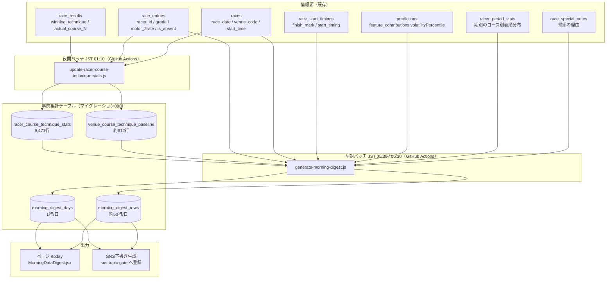

# 「本日のデータ一覧」ページ plan（システム設計）

spec: [spec.md](./spec.md) / screens: [screens.md](./screens.md) / 引き継ぎ: [handoff-memo.md](./handoff-memo.md)

Linear: [BOA-402](https://linear.app/boat-ai/issue/BOA-402)　モック（承認済み、2026-09-24・案A）: https://claude.ai/artifact/7Dytu5kJjB82f7xLngAoHP

ADR: [ADR-0070](../../adr/0070-morning-digest-precomputed-rows.md)（日次の抽出結果を行として持つ）／[ADR-0071](../../adr/0071-venue-adjusted-skill-delta.md)（会場構成を調整した地力指標）

マイグレーション案（**未適用**）: [098](../../db-migration/098_morning_data_digest.sql)

---

## 1. 全体構成



**設計の核**: ページとSNS下書きは `morning_digest_rows` / `morning_digest_days` **の2表だけ**を読む。抽出ロジックは早朝バッチの1箇所にしか存在しない（[ADR-0070](../../adr/0070-morning-digest-precomputed-rows.md)）。

---

## 2. データ設計

### 2.1 ER図（DDLから機械生成。`node scripts/maintenance/generate-er-diagram.js morning-data-digest`）

```mermaid
erDiagram
    morning_digest_rows }o--|| morning_digest_days : "digest_date"
    venue_course_technique_baseline {
        SMALLINT venue_code PK
        TEXT race_grade PK
        SMALLINT course PK
        DATE window_start
        DATE window_end
        SMALLINT window_days
        INTEGER runs
        NUMERIC(5,2) nige_rate
        NUMERIC(5,2) makuri_rate
        NUMERIC(5,2) nigashi_rate
        DATE last_updated
        TIMESTAMPTZ created_at
        TIMESTAMPTZ updated_at
    }
    racer_course_technique_stats {
        INTEGER racer_id PK
        SMALLINT course PK
        DATE window_start
        DATE window_end
        SMALLINT window_days
        INTEGER runs
        INTEGER nige_count
        NUMERIC(5,2) nige_rate
        NUMERIC(5,2) nige_expected
        INTEGER makuri_count
        NUMERIC(5,2) makuri_rate
        NUMERIC(5,2) makuri_expected
        INTEGER nigashi_count
        NUMERIC(5,2) nigashi_rate
        NUMERIC(5,2) nigashi_expected
        INTEGER runs_90d
        NUMERIC(5,2) nige_rate_90d
        NUMERIC(5,2) makuri_rate_90d
        NUMERIC(5,2) nigashi_rate_90d
        DATE last_updated
        TIMESTAMPTZ created_at
        TIMESTAMPTZ updated_at
    }
    morning_digest_days {
        DATE digest_date PK
        TIMESTAMPTZ generated_at
        SMALLINT venue_count
        SMALLINT race_count
        DATE window_start
        DATE window_end
        SMALLINT window_days
        BOOLEAN flying_data_complete
        SMALLINT[] suppressed_venues
        JSONB notes
        TIMESTAMPTZ created_at
    }
    morning_digest_rows {
        DATE digest_date PK
        TEXT section PK
        SMALLINT rank PK
        VARCHAR(20) race_id
        SMALLINT venue_code
        SMALLINT race_number
        TIME start_time
        INTEGER racer_id
        TEXT racer_name
        TEXT grade
        SMALLINT boat_number
        SMALLINT course
        NUMERIC(5,2) metric_value
        NUMERIC(5,2) metric_expected
        NUMERIC(5,2) metric_skill_delta
        NUMERIC(5,2) metric_venue_baseline
        NUMERIC(5,2) metric_predicted
        INTEGER sample_size
        BOOLEAN is_small_sample
        NUMERIC(5,2) metric_wilson_lower
        NUMERIC(5,2) rate_90d
        INTEGER sample_size_90d
        NUMERIC(5,2) motor_2rate
        NUMERIC(5,2) volatility_percentile
        JSONB detail
        TIMESTAMPTZ created_at
    }
```

`racer_course_technique_stats.racer_id` と `race_entries.racer_id` の間にFK制約は張らない（既存の `racer_aggregated_stats`・`racer_period_stats` と同じ方針。選手の引退・登録抹消で集計側が消えるのを避ける）。`morning_digest_rows` → `morning_digest_days` のみFK（`ON DELETE CASCADE`）。

### 2.2 指標の定義（ADR-0071）

共通の除外条件（全指標）:

```
races JOIN race_results JOIN race_entries
WHERE race_results.actual_course_1 IS NOT NULL      -- 進入コース不明の走を除く
  AND race_results.winning_technique IS NOT NULL AND <> ''
  AND COALESCE(race_results.is_cancelled, false) = false
  AND COALESCE(race_results.is_no_race, false) = false
  AND COALESCE(race_entries.is_absent, false) = false
  AND race_entries.racer_id IS NOT NULL
```

進入コースは `(ARRAY[actual_course_1..actual_course_6])[boat_number]`。**`race_results.course_1〜6` は艇番と恒等の無効列なので使わない**（[BOA-257](https://linear.app/boat-ai/issue/BOA-257)）。

| 指標 | 対象コース | 分母 | 分子 |
|---|---|---|---|
| 逃げ率 | 1 | そのコースへの進入走数 | `winning_technique='逃げ' AND rank1 = boat_number` |
| まくり率 | 1〜6 | 同上 | `winning_technique='まくり' AND rank1 = boat_number` |
| 逃がし率 | 2〜6 | 同上 | `winning_technique='逃げ'`（勝者が誰かは問わない） |

**逃がし率にはコース軸が無い**（2026-09-24のレビュー指摘H-5、実測で確認）。各レースに各コースがちょうど1艇ずつ存在するため、会場×コースで集計した逃がし率は必ずその会場の逃げ率と一致する（実測: コース1〜6で 52.98 / 52.98 / 52.98 / 52.98 / 52.98 / 52.95）。`venue_course_technique_baseline.nigashi_rate` を列として持つのは読み取り側の結合を単純にするためだけで、**UIに「このコースの平均より」とは書かない**（「この会場の平均より」が正しい）。選手側の `skill_delta` は選手ごとに異なるので指標としては有効。

期待値・地力・予測:

```
expected      = その選手の各走の「venue_course_technique_baseline(その走の会場, その走のグレード, コース)」の平均
                （セルの runs < 100 のときは race_grade='ALL' の行へフォールバック）
skill_delta   = rate - expected                              （保存しない。読み取り側で引く）
predicted     = venue_course_technique_baseline(本日の会場, 本日のグレード, コース) + skill_delta
```

**グレード軸は2026-09-24のレビュー指摘H-2で追加した。** グレード別の逃げ率は G1 62.2% / SG 61.3% / G2 54.4% / ippan 52.5% / G3 51.1%（11.1ptの開き）で、補正した会場差20.3ptと同型の交絡。ただし影響は1桁小さく、実際に表示される行（逃げ率70%以上・n≥10、216名）での実測は**平均シフト1.29pt・最大8.00pt・3pt以上動く行が29/216（13.4%）**。「会場構成で説明できる分を取り除いた」と称する以上は残してはいけない残差なので補正するが、会場交絡ほどの致命性は無い。

`predicted` は加法モデルのため理論上0〜100を外れうる。**初版は [0, 100] にクランプし、クランプが発生した行を `morning_digest_days.notes` に記録する**（本日分の実測ではクランプ0件・最大92.4%。実際の発生率を本番で観測してからロジット尺度への変更を判断する。ADR-0071 の影響節）。

### イン崩れ指数の単位（実装時に必ず守る）

`predictions.feature_contributions.volatilityPercentile` は **0〜1**（実測: 戸田4R=0.8373、全体の最大0.9921）。表示側は `TodaysVolatilityHighlights.jsx:76` で `Math.round(race.percentile * 100)` している。`morning_digest_rows.volatility_percentile` には **×100 して 0〜100 で保存する**。×100 せずに `NUMERIC(5,2)` に入れると 0.84 に丸められて情報が失われる（レビュー指摘H-1）。

### 2.3 母数と小標本の扱い

spec §5.3 の初期方針を、実測（spec §1.2）に基づいて確定する。

| 項目 | 値 | 根拠 |
|---|---|---|
| 抽出の最低母数 | `runs >= 10` | 地力窓（295日）で1コースの n≥10 は、その窓で1走以上した選手の95.7%を占める |
| **小標本フラグ** | **`runs < 20`（母数そのもので判定）** | §2.3.1 参照。信頼区間検定は2案とも実測で判別力を持たなかった |
| **確からしさの表示** | **Wilson95%下限を数値で併記する**（`metric_wilson_lower`） | 二値フラグより情報量が多い。実測の分布は 逃げ 46.9〜78.0%（中央値59.8）、まくり 10.2〜24.6%（中央値14.2） |
| 並び順 | `skill_delta` の降順（生の率ではない） | 生の率で並べると小標本が上位を占める |
| ベースラインの最低母数 | `runs >= 100`、未満なら `race_grade='ALL'` 行へフォールバック | 会場×グレード×コースの実在セルは468・median n=136 だが、**n<100 が180セル（38%）ある**ため、閾値だけだと3割以上が落ちる。フォールバックが必須（当初の「抽出対象から外す」は会場×コース144セルが全て1,520走以上でデッドコードだった。レビュー指摘M-9） |
| 調子窓の小標本 | `runs_90d < 5` は率を出さず「走数のみ」表示 | `(racer, course)` セル9,471のうち `runs_90d=0` が241（2.5%）、1〜4走が878（9.3%）。n=1〜4 の率を出すと誤解を招く（レビュー指摘M-11） |

Wilson95%下限の実装は `src/utils/wilson.js`（新規・純関数）に置き、バッチとフロントの両方から使う。指標側の定数と判定は `src/utils/digestMetrics.js`。

#### 2.3.1 小標本フラグは信頼区間検定をやめた（2026-09-24、T1-2/T1-3の実装中に実測して変更）

判定基準を2度変えている。経緯を残す。

1. **当初案**: 「Wilson95%下限 < その指標の全国ベースレート」
2. **独立レビュー指摘H-3を受けた案**: 「Wilson95%下限 < その指標の抽出閾値」
3. **採用（現行）**: 「`runs < 20`」＋ Wilson95%下限を数値で併記

案1が誤りだったという指摘は正しかった（まくりでは p̂=0.25・n=10 の下限 8.1% がベースレート 3.8〜5.1% を上回り、最小構成の行ですらフラグが立たない＝逆に働く）。**しかし案2も実データでは判別力を持たなかった。**

本番実測（全期間、抽出条件を満たす行）:

| 指標 | 行数 | 案2でフラグが立つ行 | Wilson95%下限の範囲（中央値） | 母数 n<20 の割合 |
|---|---|---|---|---|
| 逃げ（閾値70%） | 216 | **193（89.4%）** | 46.9〜78.0%（59.8） | 3.2% |
| まくり（閾値25%） | 27 | **27（100%）** | 10.2〜**24.6**%（14.2） | 22.2% |

まくりは**1行も閾値25%を上回れない**。母数が小さいからではなく（n<20は22%だけ）、n=16〜40 の範囲では25〜40%の率を「25%超」と95%の確信で言えないため。9割の行に立つフラグは信号にならない。

**採用した案**: 「母数が少ない」という直接の事実（`runs < 20`）でフラグを立て、確からしさは **Wilson95%下限そのものを数値で見せる**。下限は逃げで46.9〜78.0%と実際にばらつくので、二値フラグより情報量が多い。

「Wilson下限が抽出閾値を上回る」という判定自体は `clearsThresholdWithConfidence()` として残してあるが（逃げの10.6%・まくりの0%が該当）、**警告ではなく「確度が高い」側の任意の目印**という位置づけで、初版のUIでは使わない。

### 2.4 既存テーブルへの変更

**なし**。既存テーブルは読むだけ。

---

## 3. バッチ構成

ADR-0066 が「取得済みデータのDB内集計・統計更新（`aggregate-stats`・`update-*-stats` 等）」を**Vercel移行の対象外（GitHub Actionsのまま）**と明示しているため、両バッチとも GitHub Actions に置く。外部サイトへの通信は一切しない。

### 3.1 B1 夜間バッチ: `scripts/daily/update-racer-course-technique-stats.js`

- ワークフロー: `.github/workflows/aggregate-racer-course-technique-stats.yml`
- 実行: **JST 01:10**（`cron: '10 16 * * *'`）。`update-nige-outcome-distribution`（00:42）・`aggregate-course-baseline-stats`（00:50）の後ろに置き、重い全期間スキャンが同時に走らないようずらす
- 更新対象: `venue_course_technique_baseline`（約612行＝実在セル468＋フォールバック用 ALL 144）→ `racer_course_technique_stats`（実測9,471行）の順。後者は前者を参照する
- **集計本体はRPC（SQL関数）側に寄せる**。基礎CTEは全期間で約56万行を読むため、Node側に生データを持たない。`compute_venue_course_technique_baseline()` と `compute_racer_course_technique_stats()` を098で定義し、Nodeは結果の約612行＋9,471行だけを受け取る（094 の `compute_st_course_baseline()` と同じ形）
- **RPCの戻り値にも1000行の上限がかかる**。`.range()` によるページ分割が必須（実装時に実測して発見。plan §7 #5）
  - 上限は**サーバー側**（PostgRESTの `db-max-rows`）。`.range(0, 19999)` のように1回で広い範囲を要求しても1000行しか返らないことを実測で確認済み
  - **ページごとに関数が再評価される**。9,471行なら約26万行の基礎スキャンが10回走る（バッチ全体で約22秒）。現状は許容するが、データ量が増えたら「RPCが1行のJSONB配列を返す形」に変えて1回の評価で済ませる（要マイグレーション。セルフレビューでの指摘）
  - **`.order()` は必須**。ORDER BY の無い LIMIT/OFFSET は行順が保証されず、ページ間で行の重複・欠落が起きうる。主キー相当の列で並べて決定的にする
- `window_start` / `window_end` / `window_days` は**実測値**を書く（365等の固定値を書かない）
- `upsertChangedRows`（`scripts/lib/unchangedRows.js`）で変更のある行だけ書く。**そのために `NUMERIC_SCALES` に 098 の4表分のエントリを追加する**（未登録だと `NUMERIC_SCALES[table] ?? {}` が空になり、NUMERIC列が毎日「変更あり」と判定される）
- 「集計結果が0行」はエラー、「変更が無くて書き込み0行」は正常、として区別する（`aggregate-course-baseline-stats.yml` と同じ扱い）

### 3.2 B2 早朝バッチ: `scripts/daily/generate-morning-digest.js`

- ワークフロー: `.github/workflows/generate-morning-digest.yml`
- 実行: **JST 05:30 と 06:30**（`cron: '30 20 * * *'` / `'30 21 * * *'`）。2回目は1回目が完全な結果を書けていれば何もしない
- `--date=YYYY-MM-DD` で任意日を再生成できる（バックフィル・障害復旧用）

#### 実行時刻の根拠（実測）

当日の `race_entries` と `predictions` の投入時刻（2026-09-18〜24、JST）:

| 日 | race_entries | predictions（unified） |
|---|---|---|
| 09-20 | 01:06 | — |
| 09-21 | 01:57 | — |
| 09-22 | 00:58 | — |
| 09-23 | 00:05 | — |
| 09-24 | 05:01〜05:09 | 05:09 |

`races-init` cron（`*/2 20-23,0-14`）が全会場ぶんを揃えた後に unified 予測を生成する構造のため、両者はほぼ同時刻に揃う。**最も遅かった実測が 05:09** のため 05:30 を1回目とし、さらに遅れた日のために 06:30 の2回目を置く。

#### 完全性チェック（不完全なまま書かない）

次をすべて満たしたときだけ書き込む。1つでも欠ければ**書かずに終了**し、2回目の実行に委ねる。

1. 対象日の `races` が1行以上ある
2. 対象日のすべての `race_id` に `race_entries` が存在する
3. **対象日の会場数が、前日の会場数の70%以上**（レビュー指摘H-6で追加）。1〜2は `races` に入っている行だけを基準にしているため、`races-init` が13会場中10会場ぶんしか投入できていない時点で走ると3条件とも通過し、**10会場ぶんを「完全な結果」として確定させてしまう**。とくに `returned`（帰郷）は、当日の会場集合に含まれない会場の選手が全員「翌日の開催なし」として除外され、節境界ガード（検出数が閾値を超えたときだけ働く）にも掛からず**偽陰性のまま通過する**
4. `racer_course_technique_stats.window_end` が前日以降（B1が当日ぶん走っている）

2回目でも満たせなければ**ジョブを失敗させる**（`continue-on-error` は付けない）。「データが無い日」として黙って空の行を書かない。

#### `predictions` は必須条件にしない（レビュー指摘H-7を受けて変更）

当初は「`predictions`（unified）が全レースぶん存在する」を完全性チェックに含めていたが、**実測で成立しない日がある**。`predicted_at` の分布（JST）:

| 日 | min | max | 時間帯の数 |
|---|---|---|---|
| 09-19 | 22:52 | 22:52 | 1 |
| **09-20** | **08:36** | 22:51 | 15 |
| **09-21** | 01:57 | 20:51 | 14 |
| 09-22 | 00:58 | 00:58 | 1 |
| 09-23 | 00:05 | 00:05 | 1 |
| 09-24 | 05:09 | 05:09 | 1 |

09-20 は最も早い行でも 08:36 で、06:30 の2回目でも間に合わない。必須にするとジョブが失敗する。

そこで **`predictions` は任意**とし、欠けている場合は `volatility_percentile` を NULL にしてダイジェストを生成する。`featured`（イン崩れ指数との方向一致で選ぶ）だけは生成せず、`morning_digest_days.notes` に理由を記録する。逃げ・まくり・逃がし・フライング・帰郷の5セクションは `predictions` に依存しない。

#### 実行時刻の根拠の限界

`race_entries.created_at` は **2026-09-20 より前が全件NULL**、`predictions` には `created_at` が無く `predicted_at` は日中の再生成で上書きされる。したがって「最初に投入された時刻」を事後に測れるのは **2026-09-24 の1日だけ**（entries 05:01〜05:09、unified 05:09）。**05:30 という値の根拠は n=1 である**ことを明記しておく。ADR-0066 が `morning-init` の Vercel 移行を予定しているため投入時刻は今後変わる。2回目（06:30）と `predictions` の任意化で、ずれても壊れないようにしてある。

#### セクションごとの生成

| section | 生成方法 |
|---|---|
| `nige` | 当日の1号艇の選手を `racer_course_technique_stats(racer_id, course=1)` と結合し、`nige_rate >= 70` かつ `runs >= 10` を抽出。`skill_delta` 降順で最大25件 |
| `makuri` | 当日の全艇を `(racer_id, course=枠番)` で結合し、`makuri_rate >= 25` かつ `runs >= 10` を抽出。**進入コース別の指標を枠番で引く**ため、`detail.entryCourseTendency` に枠→進入コース分布を併記する（FR-9） |
| `nigashi` | 当日の2〜6号艇を結合し、**`nigashi_rate - nigashi_expected >= 22`** かつ `runs >= 10` を抽出（T2-5で直近14日の実測により確定。+20ptは17.8件/日で目標超過、+25ptは空の日が出る。+22ptは平均9.8件・最小5件） |
| `featured` | 上記3セクションの全候補から、`skill_delta` が最大の行のうち**イン崩れ指数が実績の方向と一致するもの**を1件選ぶ（詳細は §3.3） |
| `flying` | 前日（JST）の `race_start_timings.finish_mark = 'F'` を抽出。対象日が 2026-09-21 より前なら `morning_digest_days.flying_data_complete = false` を立てる |
| `returned` | 前日の出走表にいたが、当日も同一会場の開催が続いているのに当日の出走表にいない選手（FR-14）。**節境界ガード**: 1会場あたりの検出数が20件を超えたらその会場を除外し、`morning_digest_days.suppressed_venues` に記録する。`race_special_notes`（`category='absence'`）に該当行があれば `detail.reason` に理由を入れる |

#### まくりの枠番と進入コースの扱い（実装上の注意）

当日わかるのは枠番だけで、進入コースは確定していない。`makuri` セクションは「その選手が**枠番と同じコース**に進入した場合のまくり率」を出す。枠4の選手が3コースに入ることが多いなら、その旨を `detail.entryCourseTendency` で示す（モックの帯グラフ）。**枠番別の集計値を新たに持たない**（進入コース別が理論的に正しいという決定を曲げない。spec §5.2）。

### 3.3 `featured`（今日の注目レース）の選定ロジック

決定的であること（同じ入力に対し常に同じレースが選ばれる）が受入基準。

#### ⚠️ 当初案（`score = skill_delta × consistency`）は破綻していた（レビュー指摘C-1、実測で再現）

`skill_delta` を pt 単位のまま指標横断で比較すると、**ベースレートの違いを無視することになる**。逃げ（ベースレート53%）の +33pt と、まくり（ベースレート4%）の +33pt は統計的にまったく別物で、後者のほうがはるかに大きな逸脱。

当初案を 2026-09-24 にそのまま適用した実測:

| 順位 | section | レース | 選手 | delta | イン崩れ | score |
|---|---|---|---|---|---|---|
| 1 | nige | 若松12R | 吉田裕平 | +35.6 | 1.4% | **35.10** |
| 2 | nige | 三国12R | 茅原悠紀 | +29.8 | 1.7% | 29.29 |
| 3 | makuri | 戸田4R | 笠置博之 | +33.2 | 83.7% | 27.78 |
| 4 | nige | 若松8R | 飛田江己 | +28.3 | 2.1% | 27.71 |
| 5 | nige | 津1R | 金子賢志 | +36.6 | 24.7% | 27.55 |

**上位5件中4件が `nige`**。承認済みモックの戸田4Rは3位で、「実績と当日条件が同じ方向を向いている」という差別化の核（screens.md 論点6）が機能しない。

#### 採用する案: 逸脱をzスコアに標準化してから比較する

1. `nige` / `makuri` / `nigashi` の全候補行を集める
2. 各行の逸脱を**指標のベースレートで標準化**する

   ```
   z = (rate - expected) / sqrt(expected × (1 - expected) / n)
   ```

   （`rate`・`expected` は0〜1、`n` は地力窓の母数。「平均から何σ離れているか」なのでユーザーにも説明できる）
3. 各行に**方向一致度**を付ける（`volatility` は0〜1。§2.2の単位に注意）
   - `nige` は「イン有利」方向。イン崩れ指数が低いほど一致: `consistency = 1 - volatility`
   - `makuri` / `nigashi` は「イン不利」方向: `consistency = volatility`
4. `score = z × consistency` で並べ、最大の1件を選ぶ
5. 同点は `race_id` の昇順で決定的に解決する
6. `volatility_percentile` が NULL（`isFallback`、または `predictions` 未生成）の行は候補から除外する。全候補が NULL なら `featured` を書かない
7. 候補が0件の日は `featured` を書かない（ページ側は「本日は該当なし」を出す）

zスコア版を 2026-09-24 に適用した実測（**戸田4Rが1位になり、モック・設計意図と一致する**）:

| 順位 | section | レース | 選手 | n | delta | z | イン崩れ | score |
|---|---|---|---|---|---|---|---|---|
| **1** | **makuri** | **戸田4R** | **笠置博之** | 26 | +33.2 | **7.57** | 83.7% | **6.34** |
| 2 | nige | 三国12R | 茅原悠紀 | 46 | +29.8 | 4.05 | 1.7% | 3.98 |
| 3 | nige | 若松12R | 吉田裕平 | 31 | +35.6 | 3.98 | 1.4% | 3.92 |
| 4 | nige | 若松8R | 飛田江己 | 43 | +28.3 | 3.71 | 2.1% | 3.63 |
| 5 | makuri | 戸田9R | 笠置博之 | 16 | +19.8 | 3.55 | 97.6% | 3.46 |

選定理由の文は `detail.reason` にテンプレートで組み立てて保存する（数値の根拠を必ず含める。spec FR-6 の受入基準）。

---

## 4. サービス層・コンポーネント構成

### 4.1 サービス層

`src/services/supabaseDataService.js` に1関数を追加する。

```js
getMorningDigest(date)   // → { day: {...}, sections: { featured, nige, makuri, nigashi, flying, returned } }
```

- `morning_digest_days` と `morning_digest_rows` を `digest_date` で引く（2クエリ、いずれも小さい）
- `withCache` を使う。TTLは**当日は30分・過去日は7日**。ただし**既存の `inferTtlFromKey`（`supabaseDataService.js:99`）はそのままでは使えない**（レビュー指摘L-1）。同関数の正規表現 `/(\d{4}-\d{2}-\d{2})-\d{2}-\d{2}(?::.*)?$/` は race_id 形式（日付＋会場＋レース番号）の末尾を要求するため、`morning-digest-2026-09-20` のようなキーはマッチせず過去日でも当日TTL（30分）になる。**`withCache` にTTLを明示的に渡す**（キー命名に依存させない）
- `supabaseClient.js` は `.throwOnError()` 既定適用のため、**`if (error) return []` を書かない**（`.claude/rules/frontend-data-fetch.md`、[ADR-0069](../../adr/0069-query-error-propagation.md)）。失敗は例外として呼び出し元に伝える
- `src/` 配下で `createClient()` を直接呼ばない・`@supabase/supabase-js` を直接importしない（`npm run verify:query-errors` とCIで検査される）

### 4.2 コンポーネント

`src/components/digest/` を新設し、barrel export `index.js` を置く（screens.md §3）。

| ファイル | 役割 |
|---|---|
| `src/pages/MorningDataDigest.jsx` + `.css` | P-1本体。`?date=` の解釈、`getMorningDigest` の呼び出し、セクション配置 |
| `src/components/digest/DigestSection.jsx` | 見出し・説明文・空状態・`InlineFetchError` の受け口。**4箇所で共通利用** |
| `src/components/digest/DigestRaceCard.jsx` | 1行のカード。指標部分は `children` で差し替える。**3箇所で共通利用** |
| `src/components/digest/RateWithBaseline.jsx` | 率＋母数＋地力バッジ＋予測値＋小標本フラグ。**5箇所以上で共通利用** |
| `src/components/digest/FeaturedRaceCard.jsx` | S-1 |
| `src/components/digest/PeriodTrendSparkline.jsx` | 期別推移（インラインSVG。Rechartsは使わない） |
| `src/components/digest/EntryCourseTendencyBar.jsx` | 枠→進入コース分布の横積み棒 |
| `src/components/digest/FlyingRacerList.jsx` | S-5 |
| `src/components/digest/ReturnedRacerList.jsx` | S-5b |
| `src/utils/wilson.js` | Wilson信頼区間（純関数。バッチからも使う） |

既存の再利用: `Header` / `Breadcrumb` / `LoadingScreen` / `DataFetchError` / `InlineFetchError` / `useLocalizedPath` / `useSocialMeta` / `useRobotsMeta` / `GRADE_LABELS`。

**`CrossTabGrid`（phase a）は使わない**。本ページは縦1列のカードリストで、行軸×列軸の2次元表ではない（screens.md §3）。

### 4.3 ルーティング・SEO

- `src/AppRouter.jsx` に `<Route path="today" element={<MorningDataDigest />} />`
- **ja専用**。`src/config/languages.js` の `TRANSLATED_PATHS` に登録しない
- `scripts/generate-sitemap.js` の `staticPages` に `/today` を追加（**同一PRで必須**。フローA-4。`npm run verify:sitemap` が検知する）
- `useSocialMeta` の `canonical` は `?date=` の有無にかかわらず常に `/today`
- 選手名・会場名を表示する要素に `translate="no"`

---

## 5. SNS展開の接続

既存の sns-topic-gate（`docs/design/sns-topic-gate/`）に**新しいネタ種別**として乗せる。無人のクラウドRoutineは外部サイトを閲覧できないが、本機能は自社DBだけで完結するため制約に当たらない。

- `scripts/daily/generate-morning-digest.js` が書き込み後、`sns_topics` に1件登録する（種別 `morning_digest`）
- チャネル別の下書き生成は既存パイプライン（`docs/operation/sns-pipeline-{blog,note,x,tiktok,youtube}.md`）に委ねる。生成側は `morning_digest_rows` を読む
- 生成前に `getRecentRevisions()`（`scripts/lib/contentRevisionHistory.js`）と `getActiveInsights({platform, format, language})`（`scripts/lib/snsStrategyInsights.js`）を確認する（`.claude/rules/sns-content-generation.md`）
- `checkRiskRules(text, platform)`（`scripts/lib/riskRules.js`、ルール定義は `sns-video-studio/remotion/risk-rules.json`）を通し、該当を `risk_flags` に記録する（ブロックはしない）
- X向け本文のリンクは**常に `?date=` なしの `/today`**（OGPがAIスナップショット対象になるのは固定パスのみ。spec §3「やらないこと」）
- 「競艇」使用禁止（`<title>`・meta description のみ例外）
- **最終送信は1件ごとにユーザーの明示承認**。自動投稿はしない

### AIスナップショットへの追加

`/today` を `scripts/generate-ai-snapshots.js` と `src/config/aiCrawlerBots.js` の `resolveSnapshotPath` に追加する。ただし**スナップショットはビルド時生成**のため、日々変わる中身は入らない。**静的な説明部分（ページの目的・各指標の定義）だけをスナップショット化する**（`/winning-technique` が「実データ依存の分析タブを除外し、静的な機能説明部分のみをi18n JSONから生成する」のと同じ方式）。これによりX投稿のOGPカードは出るが、カード内の文言は日替わりにならない。

---

## 6. 失敗モードと監視

| 失敗モード | 対策 |
|---|---|
| B1 が失敗し統計が古いまま | `racer_course_technique_stats.window_end` が前日以降であることを B2 の完全性チェックで確認。満たさなければ B2 は書かない |
| B2 が出走表の投入前に走る | 完全性チェック（§3.2）で書かずに終了。2回目（06:30）でも満たせなければジョブ失敗 |
| 帰郷判定が節境界で誤爆 | 1会場20件超で抑制し `suppressed_venues` に記録。**黙って0件にせずログに残す** |
| フライング情報が不完全な過去日 | `flying_data_complete = false` を立て、ページに「この日のフライング情報は不完全です」と表示（spec FR-5） |
| 予測値のクランプ | 発生行数を `notes` に記録し、常態化したらロジット尺度へ変更を検討 |
| 画面側のクエリ失敗 | `.throwOnError()` により例外。セクション単位は `InlineFetchError` + `onRetry`。**空配列に化けさせない** |
| 変更が無い日も全行を書く | `NUMERIC_SCALES` に098の4表を追加（未登録だと毎日全行更新になる） |
| バッチ未実行の日にページを開く | `morning_digest_days` に行が無い＝「生成されていない」として表示し、「該当0件」と区別する |

`morning_digest_days` の `digest_date` が前日以前で止まっていないかを `scripts/maintenance/session-start-check.js` に足すかは `/step3` で判断する（既存の鮮度チェック群と同じ枠組み）。

---

## 7. 未確定事項（`/step3` までに決める、または独立レビューで検証させる）

| # | 項目 | 決め方 |
|---|---|---|
| 1 | ~~`nigashi` の地力閾値~~ | **確定: +22pt**（T2-5で直近14日の日次実測。+15pt→51.4件 / +20pt→17.8件 / **+22pt→9.8件（5〜17）** / +23pt→8.1件 / +25pt→4.6件。目標5〜15件に収まり最小5件で空の日が無い） |
| 2 | ~~小標本フラグの基準~~ | **確定: Wilson95%下限 < その指標の抽出閾値**（§2.3。当初案は数学的に逆だった） |
| 3 | `predicted` のクランプ vs ロジット尺度 | 初版はクランプ。本番でクランプ発生行数を観測してから判断（本日分の実測では0件） |
| 4 | ~~`makuri` セクションが成立するか~~ | **確定: 25%のまま維持**（T2-5）。直近14日で平均2.5件/日（0〜4）と薄いが、20%に下げるとADR-0071が絶対閾値を残した理由（競合との数値比較で「同じ選手が出てこない」不信を招かない）が崩れる。**本来まれな事象を拾うセクション**と位置づけ、0件の日は「本日は該当なし」を出す |
| 5 | ~~RPCにするかNode側集計か~~ | **確定: RPC**（T2-2・T2-4）。⚠️ **RPCの戻り値にも1000行の上限がかかる**（実測で発見）。`.range()` を付けないとエラーにならず黙って切り捨てられ、9,471行が1,000行になった。「RPCにしない場合はページネーション必須」と書いていたが、**RPCでも必須** |
| 6 | `session-start-check.js` への鮮度チェック追加 | `/step3` |
| 7 | JST 00:00〜05:30 の `/today` の挙動 | 当日ぶんが未生成の時間帯（1日の23%）。前日ぶんにフォールバックして「9/23のデータを表示中」と出すか、「本日ぶんは05:30頃に公開されます」と出すかを決める（レビュー指摘L-5） |

---

## 8. 却下した設計（ADRに書くほどではないもの）

- **`racer_aggregated_stats` の `attack_distribution` / `defense_distribution` を使う**: 概念は同じだが、①期間窓が無い（全履歴）②コースが無効列 `course_N` 基準 ③分母が「勝利数」「敗北数」で出走数ではない、の3点で要件に合わない（spec §5.5）
- **既存 `winning_technique_stats`（会場×枠番×90日）を会場ベースラインに流用する**: 軸が枠番であり、本機能が採る進入コース軸と合わない。90日窓では会場×コースの母数も不足する
- **`racer_period_stats` を逃げ率の判定に使う**: 7.5年分あり母数は潤沢だが、①決まり手を持たず1コース1着率という代理指標になる（一致率95.47%）②公式データと自社集計で集計規則が異なり検算が複雑になる③期の終了後に公開されるため現在進行中の期が欠ける。**FR-8の期別推移の表示にのみ使う**
- **`race_start_timings.entry_course` を進入コースの情報源にする**: 実測でほぼ全件NULL（月あたり数件）
