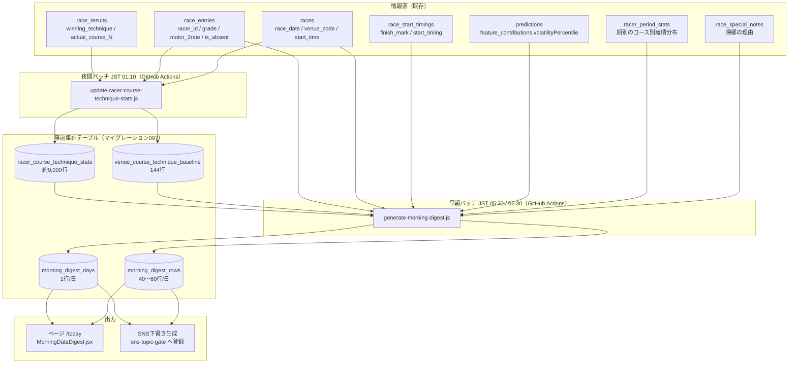

# 「本日のデータ一覧」ページ plan（システム設計）

spec: [spec.md](./spec.md) / screens: [screens.md](./screens.md) / 引き継ぎ: [handoff-memo.md](./handoff-memo.md)

Linear: [BOA-402](https://linear.app/boat-ai/issue/BOA-402)　モック（承認済み、2026-09-24・案A）: https://claude.ai/artifact/7Dytu5kJjB82f7xLngAoHP

ADR: [ADR-0070](../../adr/0070-morning-digest-precomputed-rows.md)（日次の抽出結果を行として持つ）／[ADR-0071](../../adr/0071-venue-adjusted-skill-delta.md)（会場構成を調整した地力指標）

マイグレーション案（**未適用**）: [097](../../db-migration/097_morning_data_digest.sql)

---

## 1. 全体構成



**設計の核**: ページとSNS下書きは `morning_digest_rows` / `morning_digest_days` **の2表だけ**を読む。抽出ロジックは早朝バッチの1箇所にしか存在しない（[ADR-0070](../../adr/0070-morning-digest-precomputed-rows.md)）。

---

## 2. データ設計

### 2.1 ER図（DDLから機械生成。`node scripts/maintenance/generate-er-diagram.js morning-data-digest`）

```mermaid
erDiagram
    morning_digest_rows }o--|| morning_digest_days : "digest_date"
    venue_course_technique_baseline {
        SMALLINT venue_code PK
        SMALLINT course PK
        DATE window_start
        DATE window_end
        SMALLINT window_days
        INTEGER runs
        NUMERIC(5,2) nige_rate
        NUMERIC(5,2) makuri_rate
        NUMERIC(5,2) nigashi_rate
        DATE last_updated
        TIMESTAMPTZ created_at
        TIMESTAMPTZ updated_at
    }
    racer_course_technique_stats {
        INTEGER racer_id PK
        SMALLINT course PK
        DATE window_start
        DATE window_end
        SMALLINT window_days
        INTEGER runs
        INTEGER nige_count
        NUMERIC(5,2) nige_rate
        NUMERIC(5,2) nige_expected
        INTEGER makuri_count
        NUMERIC(5,2) makuri_rate
        NUMERIC(5,2) makuri_expected
        INTEGER nigashi_count
        NUMERIC(5,2) nigashi_rate
        NUMERIC(5,2) nigashi_expected
        INTEGER runs_90d
        NUMERIC(5,2) nige_rate_90d
        NUMERIC(5,2) makuri_rate_90d
        NUMERIC(5,2) nigashi_rate_90d
        DATE last_updated
        TIMESTAMPTZ created_at
        TIMESTAMPTZ updated_at
    }
    morning_digest_days {
        DATE digest_date PK
        TIMESTAMPTZ generated_at
        SMALLINT venue_count
        SMALLINT race_count
        DATE window_start
        DATE window_end
        SMALLINT window_days
        BOOLEAN flying_data_complete
        SMALLINT[] suppressed_venues
        JSONB notes
        TIMESTAMPTZ created_at
    }
    morning_digest_rows {
        DATE digest_date PK
        TEXT section PK
        SMALLINT rank PK
        VARCHAR(20) race_id
        SMALLINT venue_code
        SMALLINT race_number
        TIME start_time
        INTEGER racer_id
        TEXT racer_name
        TEXT grade
        SMALLINT boat_number
        SMALLINT course
        NUMERIC(5,2) metric_value
        NUMERIC(5,2) metric_expected
        NUMERIC(5,2) metric_skill_delta
        NUMERIC(5,2) metric_venue_baseline
        NUMERIC(5,2) metric_predicted
        INTEGER sample_size
        BOOLEAN is_small_sample
        NUMERIC(5,2) rate_90d
        INTEGER sample_size_90d
        NUMERIC(5,2) motor_2rate
        NUMERIC(5,2) volatility_percentile
        JSONB detail
        TIMESTAMPTZ created_at
    }
```

`racer_course_technique_stats.racer_id` と `race_entries.racer_id` の間にFK制約は張らない（既存の `racer_aggregated_stats`・`racer_period_stats` と同じ方針。選手の引退・登録抹消で集計側が消えるのを避ける）。`morning_digest_rows` → `morning_digest_days` のみFK（`ON DELETE CASCADE`）。

### 2.2 指標の定義（ADR-0071）

共通の除外条件（全指標）:

```
races JOIN race_results JOIN race_entries
WHERE race_results.actual_course_1 IS NOT NULL      -- 進入コース不明の走を除く
  AND race_results.winning_technique IS NOT NULL AND <> ''
  AND COALESCE(race_results.is_cancelled, false) = false
  AND COALESCE(race_results.is_no_race, false) = false
  AND COALESCE(race_entries.is_absent, false) = false
  AND race_entries.racer_id IS NOT NULL
```

進入コースは `(ARRAY[actual_course_1..actual_course_6])[boat_number]`。**`race_results.course_1〜6` は艇番と恒等の無効列なので使わない**（[BOA-257](https://linear.app/boat-ai/issue/BOA-257)）。

| 指標 | 対象コース | 分母 | 分子 |
|---|---|---|---|
| 逃げ率 | 1 | そのコースへの進入走数 | `winning_technique='逃げ' AND rank1 = boat_number` |
| まくり率 | 1〜6 | 同上 | `winning_technique='まくり' AND rank1 = boat_number` |
| 逃がし率 | 2〜6 | 同上 | `winning_technique='逃げ'`（勝者が誰かは問わない） |

期待値・地力・予測:

```
expected      = その選手の各走の「venue_course_technique_baseline(その走の会場, コース)」の平均
skill_delta   = rate - expected                              （保存しない。読み取り側で引く）
predicted     = venue_course_technique_baseline(本日の会場, コース) + skill_delta
```

`predicted` は加法モデルのため理論上0〜100を外れうる。**初版は [0, 100] にクランプし、クランプが発生した行を `morning_digest_days.notes` に記録する**（実際にどれだけ発生するかを本番で観測してから、ロジット尺度への変更を判断する。ADR-0071 の影響節）。

### 2.3 母数と小標本の扱い

spec §5.3 の初期方針を、実測（spec §1.2）に基づいて確定する。

| 項目 | 値 | 根拠 |
|---|---|---|
| 抽出の最低母数 | `runs >= 10` | 地力窓（293日）で1コースの n≥10 は選手の95.7%を占める。これ未満は率として意味を成さない |
| 小標本フラグ | Wilson95%下限 < その指標の全国ベースレート | 逃げ率（ベースレート52.7%・p̂=70%）では n<35 が該当。まくり率（ベースレート3.7〜5.1%）では実質ほぼ全件が該当するため、**指標ごとにベースレートを変えて判定する** |
| 並び順 | `skill_delta` の降順（生の率ではない） | 生の率で並べると小標本が上位を占める |
| ベースラインの最低母数 | `venue_course_technique_baseline.runs >= 100` | これ未満の会場×コースは期待値が不安定なため抽出対象から外す |

Wilson95%下限の実装は `src/utils/wilson.js`（新規・純関数）に置き、バッチとフロントの両方から使う。

### 2.4 既存テーブルへの変更

**なし**。既存テーブルは読むだけ。

---

## 3. バッチ構成

ADR-0066 が「取得済みデータのDB内集計・統計更新（`aggregate-stats`・`update-*-stats` 等）」を**Vercel移行の対象外（GitHub Actionsのまま）**と明示しているため、両バッチとも GitHub Actions に置く。外部サイトへの通信は一切しない。

### 3.1 B1 夜間バッチ: `scripts/daily/update-racer-course-technique-stats.js`

- ワークフロー: `.github/workflows/aggregate-racer-course-technique-stats.yml`
- 実行: **JST 01:10**（`cron: '10 16 * * *'`）。`update-nige-outcome-distribution`（00:42）・`aggregate-course-baseline-stats`（00:50）の後ろに置き、重い全期間スキャンが同時に走らないようずらす
- 更新対象: `venue_course_technique_baseline`（144行）→ `racer_course_technique_stats`（約9,000行）の順。後者は前者を参照する
- **集計本体はRPC（SQL関数）側に寄せる**。基礎CTEは全期間で約56万行を読むため、Node側に生データを持たない。`compute_venue_course_technique_baseline()` と `compute_racer_course_technique_stats()` を097で定義し、Nodeは結果の144行＋約9,000行だけを受け取る（094 の `compute_st_course_baseline()` と同じ形）
- RPCにしない場合は `.range(from, from + 999)` のページネーション必須（Supabaseのデフォルト上限は1000行）。9,000行は確実に超える
- `window_start` / `window_end` / `window_days` は**実測値**を書く（365等の固定値を書かない）
- `upsertChangedRows`（`scripts/lib/unchangedRows.js`）で変更のある行だけ書く。**そのために `NUMERIC_SCALES` に 097 の4表分のエントリを追加する**（未登録だと `NUMERIC_SCALES[table] ?? {}` が空になり、NUMERIC列が毎日「変更あり」と判定される）
- 「集計結果が0行」はエラー、「変更が無くて書き込み0行」は正常、として区別する（`aggregate-course-baseline-stats.yml` と同じ扱い）

### 3.2 B2 早朝バッチ: `scripts/daily/generate-morning-digest.js`

- ワークフロー: `.github/workflows/generate-morning-digest.yml`
- 実行: **JST 05:30 と 06:30**（`cron: '30 20 * * *'` / `'30 21 * * *'`）。2回目は1回目が完全な結果を書けていれば何もしない
- `--date=YYYY-MM-DD` で任意日を再生成できる（バックフィル・障害復旧用）

#### 実行時刻の根拠（実測）

当日の `race_entries` と `predictions` の投入時刻（2026-09-18〜24、JST）:

| 日 | race_entries | predictions（unified） |
|---|---|---|
| 09-20 | 01:06 | — |
| 09-21 | 01:57 | — |
| 09-22 | 00:58 | — |
| 09-23 | 00:05 | — |
| 09-24 | 05:01〜05:09 | 05:09 |

`races-init` cron（`*/2 20-23,0-14`）が全会場ぶんを揃えた後に unified 予測を生成する構造のため、両者はほぼ同時刻に揃う。**最も遅かった実測が 05:09** のため 05:30 を1回目とし、さらに遅れた日のために 06:30 の2回目を置く。

#### 完全性チェック（不完全なまま書かない）

次をすべて満たしたときだけ書き込む。1つでも欠ければ**書かずに終了**し、2回目の実行に委ねる。

1. 対象日の `races` が1行以上ある
2. 対象日のすべての `race_id` に `race_entries` が存在する
3. 対象日の `predictions`（`model_id='unified'`）が全レースぶん存在する
4. `racer_course_technique_stats.window_end` が前日以降（B1が当日ぶん走っている）

2回目でも満たせなければ**ジョブを失敗させる**（`continue-on-error` は付けない）。「データが無い日」として黙って空の行を書かない。

#### セクションごとの生成

| section | 生成方法 |
|---|---|
| `nige` | 当日の1号艇の選手を `racer_course_technique_stats(racer_id, course=1)` と結合し、`nige_rate >= 70` かつ `runs >= 10` を抽出。`skill_delta` 降順で最大25件 |
| `makuri` | 当日の全艇を `(racer_id, course=枠番)` で結合し、`makuri_rate >= 25` かつ `runs >= 10` を抽出。**進入コース別の指標を枠番で引く**ため、`detail.entryCourseTendency` に枠→進入コース分布を併記する（FR-9） |
| `nigashi` | 当日の2〜6号艇を結合し、`nigashi_rate - nigashi_expected >= 15`（初期値）かつ `runs >= 10` を抽出 |
| `featured` | 上記3セクションの全候補から、`skill_delta` が最大の行のうち**イン崩れ指数が実績の方向と一致するもの**を1件選ぶ（詳細は §3.3） |
| `flying` | 前日（JST）の `race_start_timings.finish_mark = 'F'` を抽出。対象日が 2026-09-21 より前なら `morning_digest_days.flying_data_complete = false` を立てる |
| `returned` | 前日の出走表にいたが、当日も同一会場の開催が続いているのに当日の出走表にいない選手（FR-14）。**節境界ガード**: 1会場あたりの検出数が20件を超えたらその会場を除外し、`morning_digest_days.suppressed_venues` に記録する。`race_special_notes`（`category='absence'`）に該当行があれば `detail.reason` に理由を入れる |

#### まくりの枠番と進入コースの扱い（実装上の注意）

当日わかるのは枠番だけで、進入コースは確定していない。`makuri` セクションは「その選手が**枠番と同じコース**に進入した場合のまくり率」を出す。枠4の選手が3コースに入ることが多いなら、その旨を `detail.entryCourseTendency` で示す（モックの帯グラフ）。**枠番別の集計値を新たに持たない**（進入コース別が理論的に正しいという決定を曲げない。spec §5.2）。

### 3.3 `featured`（今日の注目レース）の選定ロジック

決定的であること（同じ入力に対し常に同じレースが選ばれる）が受入基準。

1. `nige` / `makuri` / `nigashi` の全候補行を集める
2. 各行に**方向一致スコア**を付ける
   - `nige` は「イン有利」方向。イン崩れ指数が低いほど一致（`consistency = 100 - volatility_percentile`）
   - `makuri` / `nigashi` は「イン不利」方向。イン崩れ指数が高いほど一致（`consistency = volatility_percentile`）
3. `score = skill_delta × (consistency / 100)` で並べ、最大の1件を選ぶ
4. 同点は `race_id` の昇順で決定的に解決する
5. `volatility_percentile` が NULL（`isFallback` の行）は候補から除外する
6. 候補が0件の日は `featured` を書かない（ページ側は「本日は該当なし」を出す）

選定理由の文は `detail.reason` にテンプレートで組み立てて保存する（数値の根拠を必ず含める。spec FR-6 の受入基準）。

---

## 4. サービス層・コンポーネント構成

### 4.1 サービス層

`src/services/supabaseDataService.js` に1関数を追加する。

```js
getMorningDigest(date)   // → { day: {...}, sections: { featured, nige, makuri, nigashi, flying, returned } }
```

- `morning_digest_days` と `morning_digest_rows` を `digest_date` で引く（2クエリ、いずれも小さい）
- `withCache` を使う。TTLは**当日は30分・過去日は7日**（既存の `getCacheTTL` が `race_id` の日付で判定する仕組みと同じ考え方。日付文字列から判定するヘルパーを流用する）
- `supabaseClient.js` は `.throwOnError()` 既定適用のため、**`if (error) return []` を書かない**（`.claude/rules/frontend-data-fetch.md`、[ADR-0069](../../adr/0069-query-error-propagation.md)）。失敗は例外として呼び出し元に伝える
- `src/` 配下で `createClient()` を直接呼ばない・`@supabase/supabase-js` を直接importしない（`npm run verify:query-errors` とCIで検査される）

### 4.2 コンポーネント

`src/components/digest/` を新設し、barrel export `index.js` を置く（screens.md §3）。

| ファイル | 役割 |
|---|---|
| `src/pages/MorningDataDigest.jsx` + `.css` | P-1本体。`?date=` の解釈、`getMorningDigest` の呼び出し、セクション配置 |
| `src/components/digest/DigestSection.jsx` | 見出し・説明文・空状態・`InlineFetchError` の受け口。**4箇所で共通利用** |
| `src/components/digest/DigestRaceCard.jsx` | 1行のカード。指標部分は `children` で差し替える。**3箇所で共通利用** |
| `src/components/digest/RateWithBaseline.jsx` | 率＋母数＋地力バッジ＋予測値＋小標本フラグ。**5箇所以上で共通利用** |
| `src/components/digest/FeaturedRaceCard.jsx` | S-1 |
| `src/components/digest/PeriodTrendSparkline.jsx` | 期別推移（インラインSVG。Rechartsは使わない） |
| `src/components/digest/EntryCourseTendencyBar.jsx` | 枠→進入コース分布の横積み棒 |
| `src/components/digest/FlyingRacerList.jsx` | S-5 |
| `src/components/digest/ReturnedRacerList.jsx` | S-5b |
| `src/utils/wilson.js` | Wilson信頼区間（純関数。バッチからも使う） |

既存の再利用: `Header` / `Breadcrumb` / `LoadingScreen` / `DataFetchError` / `InlineFetchError` / `useLocalizedPath` / `useSocialMeta` / `useRobotsMeta` / `GRADE_LABELS`。

**`CrossTabGrid`（phase a）は使わない**。本ページは縦1列のカードリストで、行軸×列軸の2次元表ではない（screens.md §3）。

### 4.3 ルーティング・SEO

- `src/AppRouter.jsx` に `<Route path="today" element={<MorningDataDigest />} />`
- **ja専用**。`src/config/languages.js` の `TRANSLATED_PATHS` に登録しない
- `scripts/generate-sitemap.js` の `staticPages` に `/today` を追加（**同一PRで必須**。フローA-4。`npm run verify:sitemap` が検知する）
- `useSocialMeta` の `canonical` は `?date=` の有無にかかわらず常に `/today`
- 選手名・会場名を表示する要素に `translate="no"`

---

## 5. SNS展開の接続

既存の sns-topic-gate（`docs/design/sns-topic-gate/`）に**新しいネタ種別**として乗せる。無人のクラウドRoutineは外部サイトを閲覧できないが、本機能は自社DBだけで完結するため制約に当たらない。

- `scripts/daily/generate-morning-digest.js` が書き込み後、`sns_topics` に1件登録する（種別 `morning_digest`）
- チャネル別の下書き生成は既存パイプライン（`docs/operation/sns-pipeline-{blog,note,x,tiktok,youtube}.md`）に委ねる。生成側は `morning_digest_rows` を読む
- 生成前に `getRecentRevisions()`（`scripts/lib/contentRevisionHistory.js`）と `getActiveInsights({platform, format, language})`（`scripts/lib/snsStrategyInsights.js`）を確認する（`.claude/rules/sns-content-generation.md`）
- `checkRiskRules(text, platform)`（`scripts/lib/riskRules.js`、ルール定義は `sns-video-studio/remotion/risk-rules.json`）を通し、該当を `risk_flags` に記録する（ブロックはしない）
- X向け本文のリンクは**常に `?date=` なしの `/today`**（OGPがAIスナップショット対象になるのは固定パスのみ。spec §3「やらないこと」）
- 「競艇」使用禁止（`<title>`・meta description のみ例外）
- **最終送信は1件ごとにユーザーの明示承認**。自動投稿はしない

### AIスナップショットへの追加

`/today` を `scripts/generate-ai-snapshots.js` と `src/config/aiCrawlerBots.js` の `resolveSnapshotPath` に追加する。ただし**スナップショットはビルド時生成**のため、日々変わる中身は入らない。**静的な説明部分（ページの目的・各指標の定義）だけをスナップショット化する**（`/winning-technique` が「実データ依存の分析タブを除外し、静的な機能説明部分のみをi18n JSONから生成する」のと同じ方式）。これによりX投稿のOGPカードは出るが、カード内の文言は日替わりにならない。

---

## 6. 失敗モードと監視

| 失敗モード | 対策 |
|---|---|
| B1 が失敗し統計が古いまま | `racer_course_technique_stats.window_end` が前日以降であることを B2 の完全性チェックで確認。満たさなければ B2 は書かない |
| B2 が出走表の投入前に走る | 完全性チェック（§3.2）で書かずに終了。2回目（06:30）でも満たせなければジョブ失敗 |
| 帰郷判定が節境界で誤爆 | 1会場20件超で抑制し `suppressed_venues` に記録。**黙って0件にせずログに残す** |
| フライング情報が不完全な過去日 | `flying_data_complete = false` を立て、ページに「この日のフライング情報は不完全です」と表示（spec FR-5） |
| 予測値のクランプ | 発生行数を `notes` に記録し、常態化したらロジット尺度へ変更を検討 |
| 画面側のクエリ失敗 | `.throwOnError()` により例外。セクション単位は `InlineFetchError` + `onRetry`。**空配列に化けさせない** |
| 変更が無い日も全行を書く | `NUMERIC_SCALES` に097の4表を追加（未登録だと毎日全行更新になる） |
| バッチ未実行の日にページを開く | `morning_digest_days` に行が無い＝「生成されていない」として表示し、「該当0件」と区別する |

`morning_digest_days` の `digest_date` が前日以前で止まっていないかを `scripts/maintenance/session-start-check.js` に足すかは `/step3` で判断する（既存の鮮度チェック群と同じ枠組み）。

---

## 7. 未確定事項（`/step3` までに決める、または独立レビューで検証させる）

| # | 項目 | 決め方 |
|---|---|---|
| 1 | `nigashi` の地力閾値（暫定 +15pt） | 実データで日次の該当件数を測り、5〜15件/日に収まる値にする |
| 2 | 小標本フラグの指標別ベースレート | まくり率はベースレートが3.7〜5.1%と低く、Wilson下限がこれを上回るのは容易。指標ごとに適切な比較対象を決める |
| 3 | `predicted` のクランプ vs ロジット尺度 | 初版はクランプ。本番でクランプ発生行数を観測してから判断 |
| 4 | `makuri` セクションが成立するか | 進入コース別・n≥10 だと本日2件しか出ない。閾値を下げるか、セクションを「まくり・まくり差しを含む」に広げるかを実データで判断 |
| 5 | RPCにするかNode側集計か | 56万行スキャンの実行時間を計測して決める。RPCにしない場合はページネーション必須 |
| 6 | `session-start-check.js` への鮮度チェック追加 | `/step3` |

---

## 8. 却下した設計（ADRに書くほどではないもの）

- **`racer_aggregated_stats` の `attack_distribution` / `defense_distribution` を使う**: 概念は同じだが、①期間窓が無い（全履歴）②コースが無効列 `course_N` 基準 ③分母が「勝利数」「敗北数」で出走数ではない、の3点で要件に合わない（spec §5.5）
- **既存 `winning_technique_stats`（会場×枠番×90日）を会場ベースラインに流用する**: 軸が枠番であり、本機能が採る進入コース軸と合わない。90日窓では会場×コースの母数も不足する
- **`racer_period_stats` を逃げ率の判定に使う**: 7.5年分あり母数は潤沢だが、①決まり手を持たず1コース1着率という代理指標になる（一致率95.47%）②公式データと自社集計で集計規則が異なり検算が複雑になる③期の終了後に公開されるため現在進行中の期が欠ける。**FR-8の期別推移の表示にのみ使う**
- **`race_start_timings.entry_course` を進入コースの情報源にする**: 実測でほぼ全件NULL（月あたり数件）
