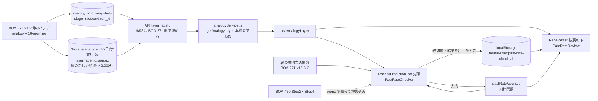
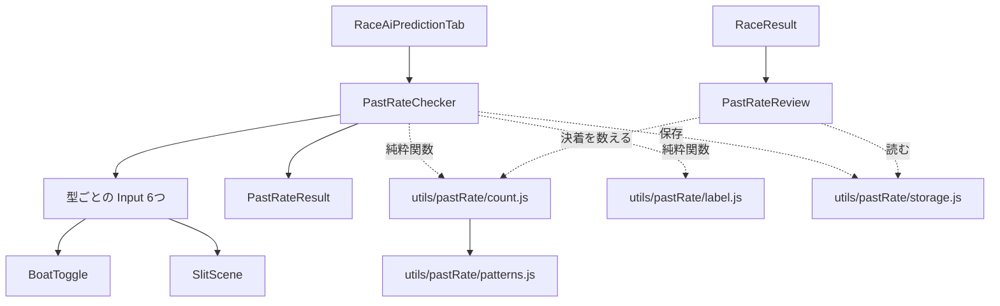

# 過去に発生した割合を見る plan

元: [spec.md](./spec.md)・[screens.md](./screens.md)。技術判断は [ADR-0081](../../adr/0081-past-rate-counted-on-client-from-layer-rows.md)（層の新しい順最大2,000行を画面側で数え、保存は端末内）。土台は BOA-271 v16（PR #1134 の `docs/design/analogy-finder/` の plan「BOA-635 との接続」、ADR-0085）の朝のバッチが作る `layer/{race_id}.json.gz`（2026-10-04 合意）。

## 全体の流れ

## データ設計

**本機能では新しいテーブル・カラム・バッチを作らない。** layer ファイルと `analogy_v16_snapshots` は BOA-271 v16 の朝のバッチが作る（形は spec「データ（土台）」。2026-10-04 合意、キー名は BOA-271 の実装で確定）。マイグレーションは本機能に無い（ER 図も無い）。

値の約束（`payout_3tan` は3連単、F・出遅れ・欠場の ST は NULL、実進入不明は NULL、不成立と1〜3着に返還艇が入るレースは母集団に入れない）は、v16 の `export_pool.js` の新しい列でも守り、BOA-271 側の pytest で固定する（2026-10-04 に依頼）。

端末内の保存形式は spec FR-5 のとおり。サーバーには何も送らない。

### 読み取りの量
- 1レースあたり最大2,000行 × 8列。gzip 後で数十KB の見込み（BOA-271 側が初回に実測。100KB を超えたら1,000件に下げる）。取得は部品を出すときに1回で、AI予想タブと結果タブで同じキャッシュを使う
- DB は snapshot（racecard の段）の1行を読むだけ。行そのものは Storage の静的ファイルなので、表示のたびの Disk IO はほぼ無い
- 取得の経路: Storage が非公開なので、service key で読む API を通す。BOA-635 で `GET /api/analogy/layer/[raceId]` を作る案（snapshot から run_id を引き、layer ファイルを読んで返す。キャッシュは BOA-271 の API と同じ規則: 締切前 `s-maxage=300`、締切後 `86400`、NULL・エラーは `no-store`）か、BOA-271 の API への相乗りかは BOA-271 側が決める（2026-10-04 時点で未定）
- 注記の期間は、切り詰めていなければ `pool_from`〜`pool_cutoff`、切り詰めたら `rows` の race_date の最小〜`pool_cutoff`。似ている理由は v16 spec B-3 の説明文を作る BOA-271 の共通関数（置き場所・名前は BOA-271 側で決める）に `conditions`・`n_total` を渡して作る

## フロントエンド

### ファイル構成

| ファイル | 役割 |
|---|---|
| `src/utils/pastRate/patterns.js` | スリット7形の定義（キー・判定関数・効く強さ）、強さの段の線（`SLIT_LEVELS`、1/100秒の整数）、1艇身の秒数（0.13）、全国の出現率（T0-2 で固定した値）。ST は `Math.round(st*100)` の整数にしてから判定する（浮動小数の境界ずれを避ける。spec 共通の数え方） |
| `src/utils/pastRate/count.js` | `countPastRate(rows, type, input)` → `{ n, count, excluded: { reason, count } \| null, breakdown }`。型ごとの判定（spec FR-1）。`orderPoints(input)`（点数）。`decisionOf(finishOrder)`（決着の行用） |
| `src/utils/pastRate/label.js` | `rateLabel(rate)` → `"standard" \| "rare" \| null`。線 x・y は定数（T0-1 で決めた値） |
| `src/utils/pastRate/storage.js` | `loadEntries()`・`saveEntry(entry, { deadline, now })`・`entriesForRace(raceId, { deadline })`。キー `boatai-user:past-rate-check:v1`（`boatai:` はデータキャッシュの全削除に巻き込まれるので使わない）、30日、上限1,000件、書く直前に読み直す、壊れた値・形の違う Entry を捨てる、例外の吸収（console に出す）、締切以降の Entry を振り返りから外す |
| `src/components/race/pastRate/PastRateChecker.jsx` | 外枠。型の切り替え・入力の状態（非制御／`value`・`onChange` の制御の両対応）・ボタン・結果の表示。保存は `persist` が true で締切前のときだけ |
| `src/components/race/pastRate/{Order,Boat1,Tenkai,Slit,Entry,PayoutBand}Input.jsx` | 型ごとの入力（screens） |
| `src/components/race/pastRate/BoatToggle.jsx` | 艇のボタン（公式色、`aria-pressed`）。このディレクトリ内でだけ使う |
| `src/components/race/pastRate/SlitScene.jsx` | スリットの SVG。props はコース順の ST の差の配列と表示サイズだけ（BOA-430 Step2 でも使える） |
| `src/components/race/pastRate/PastRateResult.jsx` | 結果（主文・ラベル・メーター・内訳・除いた件数・注記） |
| `src/components/race/pastRate/PastRateReview.jsx` | 結果タブの振り返り |
| `src/components/race/pastRate/PastRate.css` | `prc-` 接頭辞のクラス |

### 組み込み
- `RaceAiPredictionTab`: BOA-271 v16 で、節の描画を早期 return の分岐の外に出す（v16 plan のフロントエンドの節に「BOA-635 も同じ位置を使う」と記載済み）。同じ外側の位置の**先頭**に `PastRateChecker` を置く（中止のときは出さない）。`rows` が0行・取得中は出さない。取得に失敗したときは `InlineFetchError`（`onRetry` で `useAnalogyLayer` の再取得）。snapshot が無い・`status` が `empty_layer`／`absent` のときは出さない。`frontend-data-fetch.md` の3
- 締切: `getDeadlineDate(raceId, startTime)`（`src/utils/raceDeadlineStatus.js`）を `PastRateChecker` に `deadline` として渡す。`startTime` は今 `RaceAiPredictionTab` に渡っていないので、`PredictionPanel` から `raceStartTime={selectedRace?.startTime}` を新しい prop として渡す（オッズ一覧タブ `RaceOddsListTab` へ既に同じ値を渡している、`PredictionPanel.jsx:446`。値は `races.start_time` の先頭5文字で、締切の時刻と一致する）。無ければ null。null のときはレースが確定していなければ保存する（spec FR-5）
- `RaceResult`: 払戻表の下に `PastRateReview`（`raceId`・決着・`layer`・締切）。決着は `RaceResult` の `buildResultRows` が組み立てた着順（返還艇を外したもの）の position 1〜3 の艇。3着までそろわなければ決着の行を出さない。取得に失敗したときは `InlineFetchError`。不成立（`RaceResult` 内で既に求めている `outcome === RACE_OUTCOME.NO_RACE`）と `rows` が0行・snapshot なし・`empty_layer`／`absent` では出さない
- 決まり手のキーと DB の日本語の対応は `src/utils/turnPrediction.js` の `TECHNIQUE_NAMES` を使う（新しい対応表を作らない）

### 状態の持ち方
- 型ごとの入力は `PastRateChecker` の state に型別に持つ（型を切り替えても他の型の入力は残る。モックどおり）
- 結果は「最後にボタンを押したときの型と入力」から出し、入力が変わったら隠す
- `value`/`onChange` を渡されたときは、その型の入力を外の値で置き換える（BOA-430 Step4 のカート）

### 表示時の計算の量
最大2,000行×1型の判定。着順の流しは最大 1×5×4 の点数でも、判定は行ごとに3つの集合の包含だけ。100ms の要件に対して十分小さいので、メモ化（`useMemo`）は入力と `layer.rows` の参照だけをキーにする

## 既存サービス層・共通ライブラリとの連携
- データ取得: BOA-271 の `src/services/analogyService.js` に `getAnalogyLayer(raceId)` を足し、フック `useAnalogyLayer` を作る。API の呼び出しは同ファイルの既存の流儀に従う。キャッシュは `raceId` 単位で、NULL・エラーは残さない。本機能から `supabaseDataService.js` は呼ばない
- 似ている理由の文: BOA-271 v16 の層の説明文の関数（B-3。置き場所は BOA-271 側で決める）
- 締切: `src/utils/raceDeadlineStatus.js` の `getDeadlineDate`
- 決まり手: `src/utils/turnPrediction.js` の `TECHNIQUE_NAMES`
- 艇の色: `src/utils/colors.js` の `BOAT_COLORS`、艇番の表示は BOA-271 で切り出す `BoatBadge`
- localStorage の扱い: 既存の `src/hooks/useFirstVisit.js` 等は例外を吸収していない。本機能の `storage.js` は try/catch で包む（プライベートモード・容量超過で画面を壊さない）。既存箇所の直しは本機能のスコープ外

## 検証

| 何を | どこで |
|---|---|
| 6つの型の判定・分母・除いた件数・点数・ラベルの境界（x・y ちょうど） | `scripts/maintenance/verify-past-rate-count.js`（固定の行データ。`verify-registry.json` に ci で登録）。`src/utils/pastRate/` の純粋関数を import する |
| 保存（置き換え・30日・上限・締切後は保存しない・壊れた値・例外） | 同じ verify に保存の節を足す（localStorage は小さなメモリ実装を差し込む） |
| 画面の件数が実データと一致するか | 実装後の `data-accuracy-verifier`: 本番の数レースで、Storage の layer ファイルの行を別の手段（Python）で数えた値と画面の数字を照合する。layer ファイルの行が v16 の層の定義どおりかは、BOA-271 側の検証（`verify-analogy-v16.js`）に任せる |
| 受け入れ | `e2e/acceptance/past-rate-check.spec.js`（`acceptance-test-writer`）。行は録画再生（ADR-0077）。layer の API が録画に無い間は route で固定データを返す |
| レイアウト | `npm run test:layout` に AI予想タブの部品と結果タブの振り返りを足す（375/768/1024/1440/1920px） |

## 定番／レアの線の検証（tasks T0-1。分析のみ）
- 置き場所: `scripts/analysis/past-rate-check/label-threshold.py`。test 2026-04〜09 の各レースの比べる行は、BOA-271 v16 の層と同じ規則（そろえる条件が同じ層、そのレースの日より前の母集団、新しい順最大2,000件）で作る。v16 の `v16_defs.py`・`features.build` を import し、固定データで layer ファイルと同じ行が選ばれることを確かめる
- 判定のロジックは `src/utils/pastRate/count.js` と同じ式を Python に持つ（二重実装になるので、固定データで JS と Python の件数が一致することを確かめる小さな検査を同じディレクトリに置く。両方とも1/100秒の整数で比べ、固定データには差が線ちょうどの行を入れる。両方が浮動小数で一致したまま SQL とずれる、を防ぐため、固定データの期待値は SQL の numeric で出したものを使う）
- 手順と判定の規則は spec FR-3 で固定済み。結果を `docs/design/past-rate-check/analysis/label-threshold-result.md` に書き、採った x・y を spec と `label.js` に反映する
- 母集団の決着（スリットの ST・実進入・3連単）は、BOA-271 の値の約束（F・出遅れ・欠場は NULL 等）と同じ扱いで作る

## 残る判断（plan では決めない）
- 定番／レアの線の値（T0-1 の結果）
- 形に添える全国の出現率の値（T0-2 の結果）
