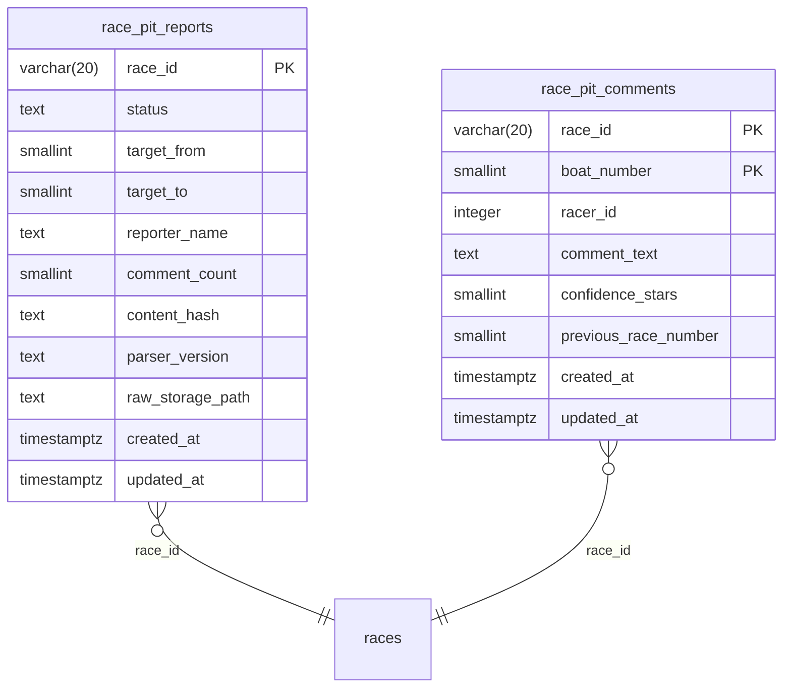

# ピットレポート（選手コメント）の取得・保存・読み取り plan

spec: `spec.md` / screens: `screens.md` / tasks: `tasks.md`
対応: [ADR-0066](../../adr/0066-scraping-execution-consolidation-to-vercel.md)（Vercel一本化）・[ADR-0058](../../adr/0058-data-refresh-frequency-optimization-principle.md)（取得頻度の4つの問い）・[ADR-0067](../../adr/0067-official-site-content-redisplay-policy.md)（再表示の方針）・`.claude/rules/data-acquisition.md`（完了の定義）
Linear: [BOA-379](https://linear.app/boat-ai/issue/BOA-379)

## 0. 方針の要約

- 取得は、Vercel Cron の窓型ジョブ `pit_reports`（`api/cron/pit-reports.js`）。共通ラッパ・予定表（`scrape_slots`）・レジストリ・サーキットブレーカーを使う。**`scrape_job_state.mode` が off（または行なし）の間は何もしない**。shadow（取得・解析のみ）・live（書き込み）
- 解析・書き込みの本体 `processPitReportRace`（`scripts/lib/pitReportJob.js`）は、定期取得と過去分のバックフィル（手動CLI）が共有する。パーサー `pitReportParser.js` は純関数
- 保存は2表（`race_pit_reports`: レース単位、`race_pit_comments`: 艇単位）。マイグレーション085（保存）と086（匿名への公開）を分ける
- 画面は、単独のSELECT（RPCに足さない）で読む（[§3](#3-読み取り経路の推奨)）
- 生HTMLは、内容が変わったときだけStorageへ保管する（Q1。[§4.5](#45-生htmlの保管q1)）

## 1. データ設計

### 1.1 ER図

マイグレーション[085](../../db-migration/085_race_pit_reports.sql)・[086](../../db-migration/086_race_pit_reports_public_read.sql)から機械生成（`node scripts/maintenance/generate-er-diagram.js pit-comments`）。



### 1.2 設計の要点

| 項目 | 内容 | 理由 |
|---|---|---|
| 2表構成 | レース単位（`race_pit_reports`）と艇単位（`race_pit_comments`） | 「未公開」「対象外」「コメントあり」を画面が区別するには、レース単位の状態が要る。艇単位の行は、将来の「選手ごとの過去のコメント」の土台（索引は作らない: YAGNI） |
| `status` | `published`（コメントあり、`comment_count>=1`）、`not_target`（公式ページが対象外と表示。`target_from`〜`target_to`は「7Rから12Rまで」「12Rが」の範囲） | 未公開のときは行を作らない（行なし＝未公開または未取得） |
| コメント本文 | `comment_text`は公式の表記のまま。末尾の「（コメント自信度・・★★☆）」だけ`confidence_stars`（0〜3）に分離。自信度が付かないコメント（【取材者寸評】）はNULL | 画面が「そのまま」表示する要件 |
| `content_hash` | 状態・レポーター・艇ごとの本文・自信度・前走・登録番号のSHA-256（HTMLの体裁には依存しない） | 再取得で内容が同じなら書かない（変更の無い行は書かない）。書き込み完了の目印 |
| 書き込みの順序 | 艇ごと → レース単位の行（`race_pit_reports`が「完了」の目印） | 途中で失敗しても、次の取得が書き直す（先に`race_pit_reports`を書くと、コメントを書けなかった状態で「変更なし」と判断される）。`race_pit_comments`の外部キーは`races`（`race_pit_reports`ではない） |
| 取得時刻 | `created_at`（初めて保存した時刻＝公開の検知時刻）、`updated_at`（変更のある行を書いた時刻）。071と同じ運用 | 公開時刻の計測。`captured_at`の別列は作らない |
| `raw_storage_path` | 生HTML（gzip）のStorage上のパス（生のパス。署名付きURLは入れない） | Q1。パス規約は`.claude/rules/sns-content-generation.md`と同じ |
| 外部キー | どちらも`races(race_id) ON DELETE CASCADE` | 書き込みは1日数十行で、検査コストは無視できる |
| RLS | 085: RLS有効・anon/authenticatedの権限を剥奪・ポリシーなし。086: `FOR SELECT`のポリシー＋`GRANT SELECT`（anon・authenticated）。書き込み系のポリシー・権限は付けない | BOA-370のRLS規律。`npm run verify:migration-rls`で検査 |

### 1.3 更新（履歴）の扱い

**公開後に内容が更新されるかは、実測の途中**（[spec.md §1.5](./spec.md)）。設計は、更新がある場合に備えて次の形にした（更新が無いことが分かれば、生HTMLの保管を外すだけで済む）。

- DBは**最新のみ**を持つ。内容が変わったら、艇ごと・レース単位の行を上書きし、`updated_at`を設定する
- 内容が変わるたびに、**生HTMLを別パスで保管**する（パスは内容ハッシュ。`raw/pitreport/{日付}/{race_id}/{ハッシュ先頭16桁}.html.gz`）。履歴の再現は、Storageの生HTMLから、同じパーサーで再解析する（履歴表は作らない: YAGNI）
- 更新頻度が高い・履歴を画面に出す要件が出た場合のみ、履歴表（`race_pit_comment_revisions`）を別途検討する

### 1.4 適用時のリスク（本番DDL。ユーザー承認のうえで、ユーザーが適用する）

| 項目 | 085（保存） | 086（公開） |
|---|---|---|
| 内容 | 新規テーブル2つ・RLS有効化・権限の剥奪のみ。既存テーブルは変更しない | ポリシー2つ・GRANT SELECTのみ。テーブル・行は変更しない |
| ロック | `races`への外部キー作成時の短い`SHARE ROW EXCLUSIVE`（`races`約4.5万行）。`lock_timeout 10s` | なし（ポリシー・権限のメタデータ） |
| 失敗時 | 1トランザクション（`BEGIN`〜`COMMIT`）。失敗なら何も変更されない | 同左。085が未適用なら、テーブルが無くて失敗（何も変更されない） |
| 未適用のDBでのコード | 共通ラッパ・`processPitReportRace`は、shadowでは動く（書かない）。liveでは、テーブルが無いと書かずに`error`を返す（成功にしない。[§4.6](#46-未適用のdbでの安全性)） | 画面のコードは、SELECTが失敗（401/権限エラー）した場合、セクションを出さない（[screens.md](./screens.md)） |
| ロールバック | `DROP TABLE race_pit_comments; DROP TABLE race_pit_reports;`（データは消える。他に影響なし） | ポリシー・GRANTの削除だけで、匿名の読み取りを止められる（データは残る） |
| 適用の順序 | **085 → コードのshadow → Storageバケット作成 → live → 画面のモック承認・実装 → 086** | 画面の実装後（公式サイトの文章の再公開の境目。[spec.md §4](./spec.md)） |
| 容量・IO | 日次の増加は約40〜110行・数十KB。過去分を充填しても数千行。Disk IO予算への影響は無視できる | なし |

## 2. データ品質の検査

- 出走表との突合: 解析した登録番号が`race_entries.racer_id`と一致しない艇があれば、書かずに`error`（別のレース・ずれた艇番へのコメント付与を防ぐ）
- 想定外の構造（艇の行が6でない、登録番号を読めない、前走のリンクに番号があるのに読めない、未知のメッセージ）は`parse_anomaly`として`error`にし、書かない（構造の変化を黙って書き込まない）
- 自信度が無いコメント・前走が空の艇は、実測で確認した正常な形（異常にしない）

## 3. 読み取り経路の推奨

現状の読み取り経路: レース詳細（`src/pages/RaceDetailPage.jsx`）は、`useDatePredictions(date)` → `supabaseDataService.getPredictions()` → RPC `get_predictions_by_date(_light)` で、その日の全レースを1回で取り、`PredictionPanel`のタブ（`RaceTabs`）に渡す。タブ内の追加データは、各タブが`supabaseDataService`の関数（`withCache`）で、`race_id`単位に直接SELECTする（`RaceBasicInfoTab`・`RaceBeforeInfoTab`等）。

| 案 | 内容 | 評価 |
|---|---|---|
| **A. 直前情報タブが、`race_id`単位に単独のSELECT（推奨）** | `getRacePitReport(raceId)`: `race_pit_reports`と`race_pit_comments`を、`race_id`で並列に2回SELECT。`withCache`（30分）。SG・G1・G2（と、グレード不明）のレースだけ | 既存の各タブと同じ流儀。RPCを変更しない。対象外のレース（約95%）ではリクエストが出ない。失敗を「対象外」に化けさせない（BOA-359の教訓）。**推奨** |
| B. `get_predictions_by_date`に`pitComments`を追加 | RPC 3関数（`get_predictions_by_date`・`_light`・`get_today_races`）を再定義 | 却下。過去に、後続マイグレーションの`CREATE OR REPLACE`で機能が上書きされる回帰が起きた（048→BOA-363）。全レース分に載せると、ほとんどのレースで使わないデータを毎回運ぶ。コメントは長文で、RPCの応答サイズと、`anon`の`statement_timeout`（3秒）への負荷を増やす。本番DDLが3関数分になる |
| C. 単独のRPC（`get_race_pit_report(race_id)`） | 2表を1回で返す関数 | 現時点では不要（2回の軽いSELECTで足りる）。`race_pit_comments`が`race_pit_reports`への外部キーを持たない（書き込み順序の理由。§1.2）ため、PostgRESTの埋め込み（1リクエスト）は使えない。リクエスト数を減らす必要が出たら検討 |

### 3.1 データの契約（案A）

```
GET /rest/v1/race_pit_reports?race_id=eq.{raceId}
    &select=status,target_from,target_to,reporter_name,comment_count,created_at,updated_at
GET /rest/v1/race_pit_comments?race_id=eq.{raceId}
    &select=boat_number,racer_id,comment_text,confidence_stars,previous_race_number
    &order=boat_number.asc
```

`supabaseDataService.getRacePitReport(raceId)` の戻り値（画面はこれだけを見る）:

| フィールド | 型 | 意味 |
|---|---|---|
| `state` | `"published"` / `"not_target"` / `"pending"` | `race_pit_reports`の行の`status`。行が無ければ`"pending"`（未公開または未取得） |
| `reporterName` | string / null | レポーター名（公式の表記のまま） |
| `capturedAt` | ISO文字列 / null | `created_at`（初めて保存した時刻。「取得: 15:42」の表示に使う） |
| `updatedAt` | ISO文字列 / null | `updated_at` |
| `targetRange` | `{from, to}` / null | `not_target`のときの対象範囲（「12Rのみ」等の表示に使える） |
| `comments` | `[{boatNumber, racerId, text, stars, previousRaceNumber}]`（枠番順） | `state==="published"`のときのみ。`stars`は0〜3 / null（自信度なし） |
| （エラー） | 例外 | 取得の失敗は、`pending`にも空にも化けさせず、例外（`fetchFailed`）。画面は、セクションごと出さない、または再試行を出す（screens.md） |

出典のリンクは、`raceId`（`YYYY-MM-DD-VV-RR`）から導出する（`buildPitReportUrl`と同じ規則。フロントに小さい純関数を置く）。

## 4. 取得ジョブ

### 4.1 ADR-0058の4つの問い

| 問い | 回答 | 根拠 |
|---|---|---|
| 変化頻度 | 公開前は空。**公開後は不変**の見込み（実測の途中。[spec.md §1.5](./spec.md)） | 過去日（最大275日前）のページが、当時の内容らしい形で取れる |
| 許容される鮮度 | 発走前に見せたい。公開後、数分〜10分以内に検知できればよい | 画面の目的（レース前の判断材料）。公開時刻の実測後に確定 |
| 可用性ウィンドウ | 公開時刻は**実測の途中**（[spec.md §1.4](./spec.md)）。過去日は275日前まで取得可 | 実測。窓を過ぎた取りこぼしは、バックフィルで補える |
| 最小十分頻度 | **1レース1スロット**。公開まで5分おきに再試行し、公開を検知したら終了（`done`）。公開後の再取得は、更新の実測（§1.3）で必要と分かるまでしない | 1ページ・変化はほぼ1回 |

### 4.2 窓・スロット（暫定。公開時刻の実測後に確定）

レジストリ `pit_reports`（`scripts/lib/scrapeJobs/registry.js`）:

| 項目 | 値 | 根拠 |
|---|---|---|
| 種別 | 窓型（`scrape_slots`） | 完了の定義B・Cを、他のジョブと同じ方法で計測できる |
| `offsets` | `[-60]`（発走の60分前から） | **暫定**。公開が発走の60分前より早いと分かれば、前倒しする。前走の後でしか書けない取材の性質から、発走60分前より前の公開は考えにくい（未確認） |
| `graceMin` | 240（発走+180分まで） | 公開が遅れる・発走後に公開される場合の取りこぼしの防止。過去日も取れるため、窓を過ぎた分はバックフィルで補える |
| `retrySec` | 300（5分） | 公開の検知の遅れを最大5分に。未公開の間の再試行が主なリクエスト源 |
| 再試行の間隔の調整 | `pendingRetrySec(発走までの分)`: 発走30分前より前は10分、発走30分前〜発走後10分は5分、それ以降は20分 | 公開が見込めない時間帯の無駄なアクセスを減らす。公開時刻の実測後に値を確定 |
| `leaseSec` / `claimLimit` / `concurrency` | 60秒 / 8 / 4 | 1スロット約8〜10秒（boatrace.jpの応答）×2巡（8÷4）＝約24秒 < リース−10秒。`validateRegistry`が検査 |
| `maxDurationSec` | 120 | ソフトデッドライン90秒 |
| cron | `* 22-23,0-15 * * *`（UTC。JST 07:00〜翌00:55の毎分） | 結果と同じ運用窓。最終レースの発走+数十分までの再試行。**毎分にする理由**: 5分間隔だと、起動の死活の記録（`last_tick_at`は5分に1回だけ書く）が最大10分に開き、監視の死活の閾値（`livenessStaleMin`=10分）に触れる。毎分の起動は、対象が無ければ読み取りのみ。取得の間隔は、予定表の再試行（`retryAt`）で制御する |
| `hosts` | `boatrace.jp` | サーキットブレーカー（ホスト単位、429/503） |

### 4.3 予定表のスロット（対象レースにだけ作る）

共通の`ensure_scrape_slots`（075）は、その日の全レースにスロットを作る。ピットレポートの対象はSG・G1・G2の一部で、全レースに作ると、G3・一般戦のスロット（約9割）が`claim`の枠（`claimLimit` 8）を占める。そのため、`createPitReportStore`（`scripts/lib/pitReportJob.js`）が、`ensureSlots`だけをジョブ固有にする。

- `races`の当日分から、SG（全レース）・G1・G2（7R以降）を選び、`scrape_slots`へ直接 upsert（`ON CONFLICT DO NOTHING`）。期限＋許容幅を過ぎたレースのスロットは作らない（共通の`ensure_scrape_slots`と同じ意味論）。共通ラッパの`claim`・完了・再試行は、共通のストアのまま
- 共通ラッパに、`createStore`（ストアの差し替え）の引数を1つ足した。既定は従来どおり（他のジョブに影響しない）
- 取得する候補のレースの規則（グレード×レース番号）は、`isPitReportCandidate`（`pitReportRows.js`）。**最終判定は、取得したページの文言**（最終日は12Rのみ等）

### 4.4 結果（outcome）と、監視

| ページの状態（`status`） | outcome | 書き込み |
|---|---|---|
| `comments`（コメントあり） | `ok` | 艇ごと＋レース単位（変更のあるときだけ） |
| `not_target` / `not_target_race`（ページが対象外と表示） | `skipped_not_target`（終端。共通の`FINAL_OUTCOMES`に追加） | `not_target`の行（範囲つき） |
| `target_pending`（対象レースで未公開） / `no_data` | `no_values`（再試行） | なし |
| `unrecognized`（想定外の構造）・出走表との不一致・書き込みの失敗 | `error`（再試行。許容幅を超えたら`expired`） | なし |

- 監視（`monitor.js`）: `skipped_not_target`は窓内取得率の分母に入れない（1行の変更）。`expired`は即時通知（対象レースで、許容幅まで公開を検知できなかった＝想定外）。**完了の定義Bの指標は「発走までに公開を検知できた割合」**（`done_at <= 期限(発走)`）と、公開検知の遅延の分布（`done_at − 発走`）で、`scrape_slots`から計測する（読み取りSQLは[tasks.md](./tasks.md)）
- 0件エラー: `comments`の解析が1件以上あることを期待件数（`rowsExpected=1`）として、`applyZeroRowGuard`が判定する

### 4.5 生HTMLの保管（Q1）

- **実装済みの最小の形**（`scripts/lib/rawHtmlArchive.js`）: `raw/pitreport/{日付}/{race_id}/{内容ハッシュの先頭16桁}.html.gz`（非公開バケット `raw-pages`。**バケットの作成はStorageの外部サービス設定のため、ユーザーの承認のもとで行う**）。内容が変わったとき（初回・更新）だけ、gzipして保管し、パスを`race_pit_reports.raw_storage_path`へ。保管に失敗しても、取得は失敗にしない（警告のみ。パスはNULL）
- 他のジョブに既存の保管実装は無い（`scripts/ml/storage-models.js`のモデル保管のみ）。optimal-scraping-design.md §2.2の台帳（`raw_snapshots`）は、まだ作られていない。本実装は、台帳を作らず、`race_pit_reports.raw_storage_path`に生のパスを持つ（1ページ種別に台帳は過剰）。他のページ種別（beforeinfo・racelist等）を保管する段階で、台帳へ移行するかを決める
- 容量: 1ページ約34KB（gzipで約7KB）。1日約6〜18ページ（内容が変わったとき）で、約0.1MB/日・約35MB/年
- 用途は内部の再解析のみ。再配布・公開しない（[spec.md §4.3](./spec.md)の判断の材料の4）
- 実測で、ピットレポートは取り直せる（過去日のページが275日前まで取れる）ため、保管は保険（公式が過去日の扱いを変える、パーサーの修正後に、公式サイトへ再アクセスせず再解析したい場合）

### 4.6 未適用のDBでの安全性

| 状態 | 挙動 |
|---|---|
| mode が off（行なし含む） | 共通ラッパが何もしない。取得も、DB・Storageへの書き込みもしない（`scrape_job_state`の`off`の行を作るのみ） |
| 085が未適用で shadow | 取得・解析のみ。書き込まない。`result_digest`を予定表へ記録 |
| 085が未適用で live | `detectPitReportSchema`（5分キャッシュ）が未適用を検知し、書かずに`error`（理由に「マイグレーション085が未適用」）。成功にしない。**085の適用後に live にする運用**（off→085→shadow→live） |
| 075（予定表）が未適用 | 共通ラッパが何もせず200（`scrape_schema_not_applied`） |
| Storageのバケットが無い | 警告のみ。パスはNULLで、コメントは保存する |

### 4.7 取得先への負荷（PRに書く見積り。ADR-0067）

- 対象ページ: SG・G1・G2の対象レースのみ。**開催のある日は6〜18ページ**（実測: 175開催日。6件が109日・12件が59日・18件が7日。最終日のG1・G2は7R〜11Rが「対象外」で1回ずつ終わる）
- 未公開の間の再試行: 公開の検知まで5分おき。公開が発走の何分前かで決まる（**実測の途中**）。仮に発走の30分前に公開されるなら、60分前から30分前まで7回/レース。18レースの日で、最大約130ページ/日、6レースの日で約45ページ/日（`pendingRetrySec`で、発走30分前より前は10分間隔にすると、さらに約1/3減る）
- 並列度: 1実行あたり同時4（`concurrency`）、`politeFetch`の同時20の上限内。1ページ約8〜10秒。ブレーカー（429/503が5件以上で全ジョブの取得を停止）
- 現状の取得（結果・オッズ等: 1日数千〜1.3万ページ）に対して、1%未満

## 5. 過去分のバックフィル（実行はしない）

| 項目 | 内容 |
|---|---|
| 目的 | 2025-12-03（`races`の最古）以降の、SG・G1・G2の対象レースのコメントを保存する。ユーザー決定「2025-12以降のデータは全てバックフィルする」（orchestration.md、2026-09-19） |
| 取得できるか | できる。**2025-12-20（275日前）まで、コメントが取れた**（[spec.md §1.3](./spec.md)）。保持期間の下限は未特定 |
| 対象日の特定 | 2026-02-03以降: `races.race_grade`（SG/G1/G2）から。1,488レース（対象日ごとに、G1・G2は7R〜12R、SGは1R〜12R）。**2025-12-03〜2026-02-02は、`race_grade`が空**（860開催日・10,308レース）。公式のスケジュールページ `gradesch?year={年}&hcd={01|02}`（SG・PG1、G1・G2の年間日程。**1回取得して、開催期間・会場（`jcd`）・イベント名が取れることを確認した**。2026年のG1・G2は1ページ）から特定する（2〜4リクエスト）。または、節メタの取り込み（monthlyschedule、別の子の担当）が済んだ後に、`races.race_grade`を埋める |
| リクエスト数 | 2026-02-03以降: 最大1,488（最終日のG1・G2は、7Rの「12Rが」で8R〜11Rを省ける。省いた場合は約1,330）。2025-12-03〜2026-02-02: 約50開催日×約7ページ≒約350（gradesch経由で特定した場合）。**合計約1,700ページ** |
| 順序 | 新しい日付から古い方へ（画面に効くのは最近の日）。開催日単位に、G1・G2は7Rから（最終日は「12Rが」で打ち切る）、SGは1Rから |
| 取得の間隔・負荷 | 逐次・ジッター付きの3〜6秒間隔・サーキットブレーカー・1夜あたり最大600ページ（約1時間）。**合計約2〜3時間・3夜**。夜間（JST 00:00〜05:00）。定期取得と同時に走らせない |
| 実行主体 | 手動CLI（`scripts/maintenance/backfill-pit-reports.js`。**未実装**。`processPitReportRace`を`skipCandidateCheck`つきで呼ぶ薄いCLI。既定はdry-run、`--apply`で書く。定期取得と解析・書き込みを共有し、二重実装しない）。ユーザーの端末、または、承認のうえで、GitHub Actionsの手動実行 |
| 生HTMLの保管 | 定期取得と同じ（内容ハッシュのパスで、二重に置かない）。約1,700ページ×約7KB≒約12MB |
| 冪等 | 内容ハッシュが同じなら書かない。何度実行しても同じ |
| 実行前の承認 | 取得（公式サイトへのアクセス）・DB書き込みは、着手のたびにユーザーの承認が要る（K/Bのバックフィルと同じ扱い） |
| 完了の定義A | 期待件数: 対象レース（`not_target`の範囲を除く）×コメントありの艇数。**「公式ページが空（コメントなし）のレース」は、期待件数から除く**（件数を報告）。充足率99%以上 |

## 6. 検証と完了の定義

- コード: `npm run verify:pit-report-job`（パーサー・行・ジョブ・予定表・DDL・変異検証。DBにも取得先にも接続しない）。関連の`verify:scrape-jobs`・`verify:scrape-monitor`・`verify:scrape-result-job`・`verify:migration-rls`・`verify:migration-numbers`・`verify:er-diagram`
- 本番（完了の定義。[tasks.md](./tasks.md)）: A（過去分を含む充足率）、B（公開検知の遅延の分布）、C（日次の自動計測）は、shadow→live→バックフィルの後に、本番DBの実測で確認する。**コードのマージは完了ではない**

## 7. リスクと未確認

| 項目 | 内容 |
|---|---|
| 公開時刻・公開後の更新 | 実測の途中（[spec.md §1.4・§1.5](./spec.md)）。窓・再試行間隔は暫定。shadowの`done_at`の分布（`created_at`との差）で、1〜2週間で確定できる |
| 対象範囲の変化 | 公式が対象範囲（7R〜12R・12Rのみ・SG全レース）を変える可能性。最終判定はページの文言のため、規則が外れても、取得の候補が変わるだけ（`not_target`として記録される） |
| パーサーの前提 | 実ページ約20ページ・120コメントで確認。HTMLの構造変化は、`parse_anomaly`（`error`・通知）で検知する |
| 公式サイトのポリシー | [ADR-0067](../../adr/0067-official-site-content-redisplay-policy.md)。選手コメントは自由記述の文章で、数値より著作物性が明確（[spec.md §4](./spec.md)）。承認済み（出典表記つき） |
| Storageバケット | 外部サービスの設定変更（ユーザーの承認が要る） |
| 予定表のスロットの生成 | ジョブ固有の`ensureSlots`（`scrape_slots`への直接upsert）。共通の`ensure_scrape_slots`の意味論（期限＋許容幅を過ぎたものは作らない）を再現。将来、共通RPCに対象レースの絞り込みが入れば、置き換える |
