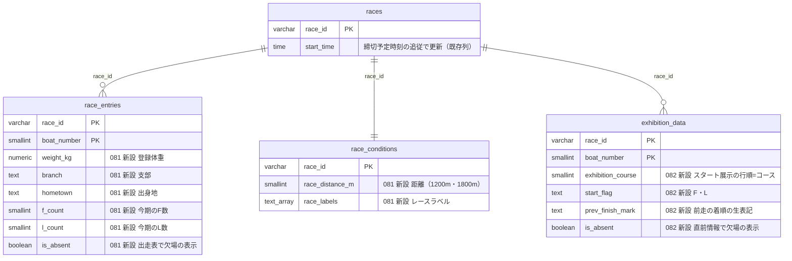

# 出走表・直前情報の全項目化とスキーマ拡張（F数・L数・登録体重・支部・欠場・展示進入・ラベル・距離）

対応: [optimal-scraping-design.md](../scraping-vercel-consolidation/optimal-scraping-design.md) §2.1〜2.5・[data-catalog.md](../scraping-vercel-consolidation/data-catalog.md) の N9・N10・N11・N13（F数・L数）・N14・N15・N17・N18・N19 / [orchestration.md](../scraping-vercel-consolidation/orchestration.md)（決定事項: 2026-09-20 に Q1〜Q10 を推奨案で承認） / 先行事例: [race-result-full-fields/plan.md](../race-result-full-fields/plan.md)（結果ページ。同じ構成・検証方式）

ユーザー承認（2026-09-20）: Q3=艇別・払戻明細・節を新設し既存列を拡張する。Q5=3連率・F数・L数の過去分は、Kファイルの累積から導出する（不一致ならracelistを取得）。Q7=契約テスト用の実ページHTMLは最小限をfixtureにコミットする。

**本書は、出走表（racelist）・直前情報（beforeinfo）の範囲**。fan（期別成績）・monthlyschedule・グレード補完（N13の平均ST・N16・N21・N22。マイグレーション083〜084）、結果系（#751）、オッズには触れない。本番DBへの適用・データ修正は、ユーザーの承認後（本書とコードは案）。

## 1. 現状で捨てていた項目（実測）

2026-09-21に、公式の出走表・直前情報の実ページ25件（合計、上限40件）と本番DB（読み取りのみ）で確認した。

| 項目 | 実例 | 旧実装 | 本変更 |
|---|---|---|---|
| F数・L数（今期） | 戸田 2026-06-19 4R の5号艇が `F0 / L1 / 0.18`、三国 2026-09-21 4R の2号艇が `F1 / L0` | 解析せず捨てる（N13） | `race_entries.f_count`・`l_count`（081案） |
| 登録体重 | `52.0kg`（`34歳/52.0kg`） | 捨てる（N14） | `race_entries.weight_kg`（081案） |
| 支部・出身地 | `福岡/福岡`、`東京/神奈川`（支部/出身地） | 捨てる（N14） | `race_entries.branch`・`hometown`（081案） |
| 欠場の表示 | 唐津 2026-09-16 12R の1号艇: 出走表・直前情報とも tbody に `is-miss`。結果ページの「欠」より前に分かる | 読まない（欠場の検出は「登録番号が読めない艇」で、実際は読める。効かない） | `race_entries.is_absent`・`exhibition_data.is_absent`（081・082案） |
| 締切予定時刻（同日12レース分） | 唐津 2026-09-16 8R: 朝の `races.start_time` は 12:04、ページは 12:05 | 解析せず、日中の変更に追従しない（N15） | `races.start_time` を、違うレースだけ更新する |
| レースラベル | 「安定板使用」（`label2 is-type1`）: 三国 2026-09-21 4R・宮島 2026-09-20 8R・唐津 2026-09-20 6R・大村 2026-09-07 1R | 捨てる（N17） | `race_conditions.race_labels`（081案） |
| **距離** | **1200m（三国 2026-09-21 4R・8R、津 2026-09-21 5R、宮島 2026-09-20 8R）**、1800m | 捨てる。data-catalog.md は「全て1800m」としていたが、誤り | `race_conditions.race_distance_m`（081案） |
| 展示進入（スタート展示の行順） | 戸田 2026-09-19 9R: 並びが 1,2,3,4,6,5（5号艇が6コース）。欠場艇の行は無く、コースは繰り上がる（唐津: 2〜6号艇が1〜5コース） | 読んで捨てる（N9） | `exhibition_data.exhibition_course`（082案） |
| 展示STのF表記 | `F.01`（戸田 2026-09-19 9R の2号艇）・`F.03`（住之江 2026-09-20 1R の5号艇）。L表記は未観測 | `isFlying` を解析して保存しない（N10） | `exhibition_data.start_flag`（`F`・`L`）（082案） |
| 前走の着順（数字でないとき） | 前走の着順が F・欠・落・転 等のとき、`prev_finish_rank` は NULL（内容が失われる） | `toIntOrNull` で NULL。実測: 前走のある2,203行（2026-09-10以降）のうち27行（1.2%） | `exhibition_data.prev_finish_mark`（082案） |
| 平均ST | `0.15`。「-」は集計期間内にデータなし | 解析せず捨てる | **保存しない**: 前期の値で、fan（期別成績）と一致する（別担当のN13。[data-catalog.md §2.1](../scraping-vercel-consolidation/data-catalog.md)）。パーサーは出力する |
| モーター・ボートの変更（赤表示） | 「モーター・ボート変更時は赤で表示されます。」の注記はあるが、ボートを変更した艇（児島 2026-09-21 7R の5号艇: 30→42、前日まで5日間30）のページに、赤の表示（is-fColor 系）は無かった | 取得なし | **列を作らない**（実ページで観測できない。§5） |

すでに保存している項目（展示タイム・チルト・プロペラの「新」・部品交換・調整重量・当日体重・前走の進入/ST/着順・気象）は、値を変えない（旧実装と同じ値。`verify:pre-race-parsers` が凍結した旧実装と比べる）。

### 実ページで確認した表記

| 表記 | 意味 | 実例（fixture） |
|---|---|---|
| tbody の `is-miss`（出走表: `class="is-miss is-fs12"`、直前情報: `class="is-fs12 is-miss"`） | 欠場。出走表は選手・成績が入ったまま。直前情報は体重・前走成績・調整重量が入り、展示タイム・チルト・プロペラが空。スタート展示の表に行が無い | 唐津 2026-09-16 12R（`racelist-2026-09-16-23-12-absent.html`・`beforeinfo-2026-09-16-23-12-absent.html`） |
| `F0 / L0 / 0.15`（3行のセル） | 今期のF数・L数・平均ST（前期）。**F1・L1 の表記を確認**（L1: 戸田 2026-06-19 4R の5号艇の選手。F1: 三国 2026-09-21 4R 他） | `racelist-2026-06-19-02-04-l1.html` |
| `-`（平均STのセル） | 集計期間内にデータなし（多摩川 2026-06-02 1R の6号艇、18歳の新人）。当地成績の `0.00` は、当地未経験の0（NULLではない） | `racelist-2026-06-02-05-01-avgst-dash.html` |
| `<span class="label2 is-type1">安定板使用</span>` | レースラベル。**他の種類（「進入固定」等）は未観測** | `racelist-2026-09-21-10-04-stabilizer-1200m.html` |
| `予選　　　　　 1800m`（`title16_titleDetail__add2020`） | ステージ名と距離（1200m・1800m） | 同上 |
| 締切予定時刻の表（`.table1.h-mt10`、行見出し「締切予定時刻」） | 同日12レース分。`races.start_time` と同じ値 | 全fixture |
| スタート展示の表: 行順=コース順、`F.01`（`is-fColor1`）、展示航走前は行が無い | 展示進入・展示ST | `beforeinfo-2026-09-19-02-09-f-exhibition.html`（並び 1,2,3,4,6,5）、`beforeinfo-2026-09-21-10-08-before-exhibition.html`（航走前） |
| 前走成績の着順は全角（`５`）、F・欠等も入りうる | NFKC正規化して保存 | 戸田・唐津の直前情報 |
| 気象のタイトル `HH:MM現在` / `N R時点` | 過去日は、その日の最終観測が返る（住之江 2026-09-20 1R の過去日ページに「20:34現在」） | `beforeinfo-2026-09-20-12-01-parts-f.html` |

**観測できなかったもの（未確認事項）**: モーター・ボート変更の赤表示、代替選手の表示、「安定板使用」以外のレースラベル、展示STの `L` 表記、information ページの変更・欠場の通知（児島 2026-09-21 は、ボート変更があったのに「お知らせなし」）。これらは、パーサーが `anomalies`（モーター・ボートのセルの未知の is-fColor 系クラス・スタート展示の行数の不一致・締切時刻の数の不一致）で記録し、生HTMLの保管（optimal-scraping-design.md §2.2、Q1）から再解析できる設計にしてある。

## 2. スキーマ



| マイグレーション | 内容 | 既存への影響 |
|---|---|---|
| [081](../../db-migration/081_race_entries_racelist_fields.sql) | `race_entries` に `weight_kg`・`branch`・`hometown`・`f_count`・`l_count`・`is_absent`、`race_conditions` に `race_distance_m`・`race_labels` を追加（NULL可・DEFAULTなし。CHECKは NOT VALID→VALIDATE） | メタデータのみの変更（`race_entries` 約26万行・87MB）。これらのテーブルにトリガーは無い（`pg_trigger` で確認）。RLS・ポリシーは変更しない |
| [082](../../db-migration/082_exhibition_data_beforeinfo_fields.sql) | `exhibition_data` に `exhibition_course`・`start_flag`・`prev_finish_mark`・`is_absent` を追加 | メタデータのみの変更（約17万行・20MB）。トリガー無し |

新しいテーブルは作らない（KISS: 既存の艇別・レース別の表に列を足せば足りる）。**RLS**: 既存テーブルへの列追加のため、ポリシー・権限は変わらない。`race_entries`・`race_conditions`・`exhibition_data` は076で匿名のSELECTが許可済みで、追加した列も匿名から読める（公式ページの再表示の範囲: ADR-0067）。既存の画面・RPCは列を明示して読み、`select("*")` はこれらのテーブルに無い（`src/`・`api/`・`scripts/` を grep で確認）ため、payload は変わらない。

設計上の判断:

- **`is_absent` は NULL=未判定**（081・082以前の行）。false=欠場の表示なし。読み手は `IS TRUE` で判定する
- **`race_labels` は NULL=未取得、`{}`=ラベルなしを確認**。CHECKは付けない（未観測のラベルが現れても書き込みを失敗させない）
- **`start_flag` のCHECKは `F`・`L`** のみ。`start_timing` の値は、旧実装と同じく F表記でも正（`F.01`→0.01）
- **`exhibition_course` は行順**（1〜6）。欠場艇・展示航走前は NULL。行数が欠場艇を除く艇数と違えば anomalies に記録する
- **`f_count`・`l_count` はレースごとの取得時点の値**（今期の累積は日々増えるため、後から取り直せない）。L数は、K系の区分（L0/L1）のうち、責任のある出遅れだけが数えられると推定される（多摩川 2026-06-01 5R でLとなった2艇のうち、翌日のページでL0のままの選手と、2026-06-19 のページでL1の選手がいた）。未確認
- **平均ST・登録体重の扱い**: 平均STは保存しない（fanと一致）。登録体重は、Bファイルにも履歴があるが、racelistの取得時点の値を持つ（BOA-271の身体属性）

## 3. 書き込み経路（マイグレーション未適用でも壊れない）

解析・行の組み立て・書き込みを分ける（Vercel化の T4b-06・T4b-09 を見据え、副作用のない関数とfsに依存しない形）。

| 層 | モジュール | 内容 |
|---|---|---|
| 解析（純関数） | `scripts/lib/raceListParser.js`・`scripts/lib/beforeInfoParser.js` | 全項目を型付きで出力。`anomalies` に構造の異常を記録。`parser_version` を持つ |
| 行の組み立て（純関数） | `scripts/lib/preRaceRows.js` | `buildRaceEntryRows`・`buildRaceConditionRow`・`buildExhibitionRows`（`extended` で新しい列を含める）、`planDeadlineUpdates`（締切予定時刻→`races.start_time`） |
| 適用状況の判定 | `scripts/lib/preRaceSchema.js`（汎用: `scripts/lib/schemaDetect.js`） | 対象の列を1回読んで（行は取らない）判定。5分キャッシュ。確認自体が失敗したら旧形式（安全側）、キャッシュしない |
| 書き込み | `scripts/daily/update-race-info.js`（A1）・`scripts/daily/scrape-exhibition-data.js`（A2） | 既存の `upsertChangedRows`（変更のある行のみ書く。`scripts/lib/unchangedRows.js`）。`optionalColumnGroups` で、判定後に列が無くなった場合も書き直す |

| 状態 | race_entries | race_conditions | exhibition_data |
|---|---|---|---|
| 081・082未適用 | 旧実装と同じ列のみ | 旧実装と同じ列のみ | 旧実装と同じ列のみ（欠場艇の行は書かない） |
| 081のみ適用 | 新しい列も書く | 距離・ラベルも書く | 旧形式 |
| 082のみ適用 | 旧形式 | 旧形式 | 展示進入・F/L・前走の着順の生表記・欠場も書く（欠場艇の行も書く） |

A1・A2の既存のCLI・GitHub Actions・`api/cron/exhibition.js` の動作は、新しい列が無い環境でも変わらない（`verify:pre-race-parsers` で、旧実装と行の内容が同じことと、未適用のDBで旧実装と同じ列だけを書くこと、再実行が書き込み0件であることを確認）。マイグレーションの適用は、コードのマージの前でも後でも安全（適用の反映は約5分後）。

### 締切予定時刻の追従（N15）

`races.start_time` は、予定表（`scrape_slots`）の期限の基準（[075](../../db-migration/075_scrape_slots_and_job_state.sql): 期限は保存せず `races.start_time` と `offset_min` から都度計算）で、出走表の「締切予定時刻」の行と同じ値。朝の値が日中に変わる（唐津 2026-09-16 8R で1分）ため、A1が出走表を取るたびに、会場の全レースの行と照合し、違うレースだけ `races.start_time` を更新する。

- 更新しない: 時刻が空（中止・順延）、同じ値、または180分を超えて動く値（別の日の値・書式の誤読の恐れ）
- **既存の挙動の変更**（A1が `races.start_time` を書くのは初めて）。予定表の期限は都度計算のため、更新後の値が次の判定から使われる。`syncDeadlines: false` で無効にできる
- 60分前の取得（A1）のたびに、同日12レース分を確認するため、開催中の更新は、そのレースの60分前まで反映されない（朝の値が最大約1時間残る）。追従を早めるなら、展示スロット（A2）でも出走表の時刻行を読む案がある（beforeinfo にも同じ表があり、A2は追加取得なしで読める。`parseBeforeInfoDocument` の出力に含めていないため、必要になったら追加する）

### 既存の集計・RPC・フロントへの影響

- 追加した列を、既存の画面・RPC・集計が読むことはない（列を明示して読む。`select("*")` 無し）。payload・集計結果は変わらない
- **A2で、欠場艇の行が `exhibition_data` に増える**（082適用後）。展示タイム・STは NULL、当日体重・前走成績・調整重量だけが入る。既存の読み手（`src/services/supabaseDataService.js`・`racerService.js`・`sherlockService.js` 等）は、展示タイム・STが NULL の行（展示STだけが先に出る会場で、既に存在する）を扱えるため、影響は無い見込み。読み手を `is_absent` 対応にするのは後続（欠場艇を予想・分析から除外するかの判断）
- **A1の欠場検出のログ**: 旧実装は「登録番号が読めない艇」を欠場としていたが、実際は読める。`is-miss` を使うように直した（ログ `欠場/代替の可能性` の対象が変わる。中止・順延の暫定検知（`computeCancellationTransition`）は、選手が1人も取れないことを条件にしており、影響しない）
- **A8（朝の初期化: `scripts/scrape-to-json.js`）は、変更していない**。朝の racelist にも同じ全項目があるが、書き込みは `generate-predictions.js` 経由で別の経路のため、T4b-07 で `parseRaceListPage` を使う形に置き換える（`races.start_time` の追従・F数・L数は、60分前のA1で書かれるため、当面は不要）

## 4. 検証

`npm run verify:pre-race-parsers`（`scripts/maintenance/verify-pre-race-parsers.js`。DBにも取得先にも接続しない）:

| 観点 | 内容 |
|---|---|
| 全項目の解析 | 実ページのfixture（出走表6件・直前情報5件）で、全項目が公式ページの表示どおり。合成（実ページの書き換え）で、L2・展示STのL表記・モーター/ボートの赤表示の疑い・空のページ |
| 旧解析との互換 | 凍結した旧実装（`__fixtures__/raceInfo/legacyRaceListParser.js`・`__fixtures__/beforeinfo/legacyExhibitionParser.js`）と、出走表10件・直前情報5件・気象だけの6ページで、既存の列の値・理由・行が同じ |
| 書き込み経路 | 未適用・適用済み・片方のみ適用・確認の失敗・dry-run。再実行が書き込み0件。`races.start_time` が違うレースだけ更新 |
| DDL案とコードの整合 | 追加列・CHECKの値が、コードが書く列・値と一致 |
| 変異検証 | パーサー・行の組み立て・DDL・書き込み経路を壊した20件で、検証が失敗する |

fixtureは、契約テスト用の最小限（公式ページの `<main>` のみ。ヘッダ・フッタ・スクリプトを除く）。全データ設計 Q7 の承認範囲。

## 5. N18（モーター・ボート変更）: 導出にする

「モーター・ボート変更時は赤で表示されます。」の注記があるが、変更のあった艇のページに赤の表示が無い（児島 2026-09-21 7R の5号艇）。information ページも「お知らせなし」で、変更を検知できる公式の表示を観測できなかった。一方、`race_entries` は艇のモーター番号・ボート番号を出走ごとに持つため、**同じ選手・節（会場×開催名）の前回の値との比較で導出できる**（2026-09-14〜20の出走で、ボートの変更を24件（約0.4%）、モーターの変更を0件確認。2026-07-01〜09-20 でもモーターの変更は0件）。導出の一例:

```sql
lag(boat_number_id) over (partition by venue_code, racer_id, race_title order by race_date, race_number) <> boat_number_id
```

列は作らない。実ページで赤の表示を観測できたときは、パーサーの `anomalies`（`motor_boat_marker:…`）が発見し、生HTMLから再解析できる。

## 6. N19: 3連率・F数・L数の過去分の導出（調査のみ。実装しない）

Q5は「Kファイルの累積から導出し、不一致ならracelistを取得」。現時点で検証できる範囲を、DB（`race_results`・`race_start_timings`・`race_entries`）とBファイル（2026-09-19、936行）で確認した。**Kファイルの本番アーカイブ（`kb_archive_*`）は空（0行）で、K/Bのfixtureは数日分のみ**のため、Kファイルの累積そのものでは検証できていない。

| 確認 | 結果 |
|---|---|
| Bファイルの全国勝率・2連率 ＝ racelistの値 | **一致**（大村 2026-09-19 1〜3R の18人、勝率・2連率とも完全一致）。当地の勝率・2連率は、4/18人で不一致（原因は未調査。節の途中で更新される値の、取得時点の差と推定） |
| 自社の結果から導出した2連率・3連率・勝率 vs racelistの値（2026-09-19の583人） | **完全一致は2連率で約5%（30/582）にとどまる**。ただし窓に強く反応する: 集計の開始日を 2025-12-01 → 2026-04-01 と近づけると、2連率の平均絶対誤差は 2.84 → 1.18 ポイント、2026-05-01（今期の初日）では 2.14 に悪化した。誤差の分布は1〜2レース分（1レース≒1.1ポイント）で、**窓は「直近約6か月（開始 2026-03-30〜04-01 付近）」に近く、期の初日（05-01）ではない**と推定される |
| 新人（2026-05-01以降にデビュー、全履歴がDBにある選手。7人） | 2連率は4/7、3連率は3/7が完全一致。不一致の選手は、自社の `race_results` の欠け（結果なし・欠場/Fの艇の着順）に起因する（`rank4〜6` の旧実装の誤り、BOA-362）。**新人はデビューからの累積で説明でき**、窓の開始日の特定にはならない |
| F数（12人、三国・児島の2026-09-21のracelist） | `race_start_timings.is_flying` の2026-05-01以降の件数と**12/12一致**。（4213は、2025-12-03以降では2件、2026-05-01以降では1件で、racelistは1）。窓の開始（05-01 か 03-30 か）は、この12人では区別できない |
| L数 | **自社の `race_start_timings` では導出できない**（`is_late_start` は全行false、出遅れの艇の行は077まで作られなかった）。Kファイルの `L0`・`L1` の区分が要る。L数に数えられるのは、L1（責任あり）だけの可能性がある（§2） |

**結論**:

1. **勝率・2連率（全国）は、導出不要**: Bファイル（2019-04〜の長期バックフィルの対象）に、racelistと一致する値がある
2. **3連率（全国・当地・モーター・ボート）・F数・L数は、Kファイルの累積から導出できる見込みだが、未検証**。窓の定義（直近約6か月か、期初か）が、自社データの誤差（1〜2レース）で確定できない。**Kファイル（公式・欠けなし）の累積で、Bファイルの2連率（=racelistと一致）を再現できる窓を先に決め、同じ窓で3連率・F数を出す**手順にする（2連率が100%近く一致する窓が見つかれば、その窓の3連率も信頼できる）
3. 導出できない場合（一致率が低い、または窓が節・会場で変わる）は、Q5どおり racelist の取得（約8,700リクエスト、2025-12〜）に切り替える。L数は、Kファイルの L0/L1 の扱い次第（L1のみを数える仮説を、Kの累積で検証する）
4. 検証の前提: K（と、Bの前日値との突合）の長期バックフィル（K3）が済むこと。**それまでは、racelistの取得時点の値を `race_entries` に持つ（081）ことが、2026-09-21以降の唯一の正確な出典になる**（今期の累積は日々変わり、後から取り直せない）

### 6.1 方針変更（2026-09-22、独立レビュー・ユーザー承認）: racelistの直接取得に切り替え

J4（K3のバックフィル後にKファイル累積の窓を検証する）を待たず、独立レビューでの再検証の結果、racelistページの直接再取得に切り替えた。モーター・ボートの3連率はモーター使用開始日（N26）と全履歴に依存するため、K3（K/Bの長期バックフィル）が完了しても、Kファイルの部分的な蓄積だけでは正確な3連率を再現できない可能性が高いと判断した（上記表の一致率5%は、この依存関係が主因と推定される）。

- 対象: 2025-12-03〜2026-02-14の8,888レース（race_entries 52,152行）で `global_3rate` がNULL（2026-09-22、本番DBの読み取りで実測）
- 実装: `scripts/maintenance/racelist-backfill.js`（plan/download/parse/load/status、kb-backfill.js等と同じ構成）・`scripts/lib/racelistBackfillRows.js`（行の組み立て）・`scripts/maintenance/verify-racelist-backfill.js`
- **上書き方針**: 実ページ確認（2025-12-03-01-07他、2026-09-22）で、過去日のracelistページを今再取得すると、`win_rate`・`motor_number`・`boat_number_id`等が、当時のスナップショット（発走60分前）と異なる値になることを確認した（節の途中のモーター・ボート交換、勝率のその後の更新が理由と推定）。そのため、書き込みは「既存値がNULLの列だけ」（`global_3rate`・`local_3rate`・`motor_3rate`・`boat_3rate`・`f_count`・`l_count`・`weight_kg`・`branch`・`hometown`・`is_absent`）に限定し、既に値のある列には一切触れない
- 見積り: 8,888リクエスト、逐次・3〜5秒間隔・日次上限2,000件で最短5夜（`plan`コマンドの実行結果）
- 実行（download・load --apply）は未実施。親チケット（BOA-353）の承認後に別途行う

## 7. ユーザー判断が要る点

| # | 判断 | 推奨 |
|---|---|---|
| J1 | 081・082の本番適用（メタデータのみの変更。開催時間帯を避ける） | 承認（コードは、未適用でも壊れない。適用の順序制約もない） |
| J2 | A1が `races.start_time` を更新する挙動の追加（既存の挙動の変更）。予定表の期限に影響する | 承認。不安なら `syncDeadlines: false` の既定にして、値の差を観測してから有効にする |
| J3 | N18（モーター・ボート変更）を列にせず導出にする | 承認（赤の表示が実在しない・観測できないため） |
| J4 | N19: Kファイルの累積での窓の検証を、K3のバックフィルの後に行う | ~~承認~~ → **2026-09-22に方針変更**。独立レビューでracelistの直接取得（§6.1）に切り替え、この検証は行わない |
| J5 | 距離（1200m）を、特徴量・分析で区別するかは、別途（BOA-271の寄与度分析）。data-catalog.md の「全て1800m」を訂正した | — |

## 8. 未確認事項

- モーター・ボート変更の赤表示（実例なし）、代替選手の表示、「安定板使用」以外のレースラベル（「進入固定」等）、展示STの `L` 表記（`F` のみ観測）
- L数の数え方（L1のみか）、F数・L数の窓（今期の初日か、直近約6か月か）
- 展示スロット（A2）の取得時点で、スタート展示の表がどこまで公開済みか（`exhibition_course` は、表の行が揃った時点の値。展示タイムだけ先に公開される会場では、A2は展示タイムの取得後にスキップされるため、後から公開されたスタート展示を取り直さない。実測: `start_timing` の充足は99.99%で、影響は小さい見込み）
- 1200m のレースが何周か（2周と推定）、開催の種別との関係
