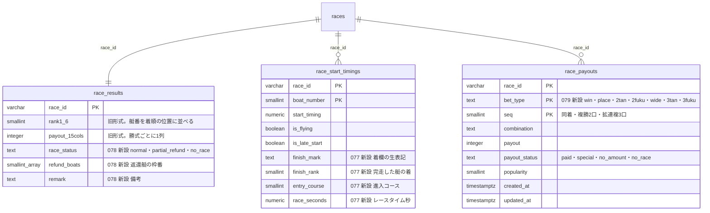

# 結果ページの全項目化とスキーマ拡張（着欄・返還・払戻明細・進入・レースタイム）

対応: [optimal-scraping-design.md](../scraping-vercel-consolidation/optimal-scraping-design.md) §2.5・[data-catalog.md](../scraping-vercel-consolidation/data-catalog.md) の N1〜N6・E1〜E6 / [orchestration.md](../scraping-vercel-consolidation/orchestration.md)（決定事項: 2026-09-20 に Q1〜Q10 を推奨案で承認）/ Linear [BOA-362](https://linear.app/boat-ai/issue/BOA-362)・[BOA-365](https://linear.app/boat-ai/issue/BOA-365)・[BOA-257](https://linear.app/boat-ai/issue/BOA-257)

ユーザー承認（2026-09-20）: Q3=艇別・払戻明細・節を新設し既存列を拡張する。Q4=返還・不成立・欠場を専用の列（`race_status`・`refund_boats`・`finish_mark`）で持ち、払戻の`¥100`を払戻として扱わない。Q6=既存の誤りデータを修正する（実行は、件数を提示して別途承認）。

**本書は、結果系（raceresult）の範囲**（N1〜N6）。節（N16）・選手系・オッズ等は別の担当。本番DBへの適用・データ修正は、ユーザーの承認後（本書とコードは案）。

## 1. 現状の誤り（実測）

| 誤り | 実例（2026-09-20に、公式の結果ページ16件と本番DBで確認） | 原因 |
|---|---|---|
| 非完走艇が着順に入る（BOA-362） | 唐津 2026-09-16 12R: 1号艇は着欄「欠」（表の最終行）なのに、DBは `rank6=1` | 着欄を読まず、表の先頭6行を着順とする |
| 返還・不成立の`¥100`が払戻に入る | 戸田 2026-09-19 9R（4艇がフライング）: 3連単・3連複等は「不成立 ¥100」なのに、DBは `payout_trio`・`payout_trifecta` が100 | 組番の位置の「不成立」を組番として、金額を払戻として保存 |
| 進入コースが枠番と恒等 | 全期間で `course_N<>N` が0件 | スタート情報の各行の Number セル（枠番の色分けの数字）を進入と読み違えた。**行順が進入コース順** |
| 出遅れ（L）の艇の行が無い | `is_late_start` が全行 false | ST欄が「L」（数字なし）のため、行を作らない |
| 同着の2口目以降を捨てる | 宮島 2025-12-11 1R（1着同着）: 3連単は1-2-5=780円・2-1-5=2,430円の2口だが、DBの列は1口だけ | 勝式ごとに1列 |

## 2. 結果ページの表記（実ページで確認したもの）

公式サイトへのリクエストは、本作業で合計29回（結果ページ23・Kファイル5・データ仕様ページ1）。UA `BoatraceAIBot/1.0`、逐次、3秒以上、429・503は0回。

### 着欄（着順表の左端。NFKC正規化後の値を `finish_mark` に保存）

| 表記 | 意味 | 返還 | 実例 |
|---|---|---|---|
| `１`〜`６`（全角数字） | 完走の着。**同着は同じ着が続く**（`１`,`１`,`３`…） | - | 宮島 2025-12-11 1R（1着同着）、徳山 2026-03-15 6R（3着同着） |
| `Ｆ` | フライング | する | 戸田 2026-09-19 9R（4艇）、大村 2026-08-07 1R（6艇） |
| `Ｌ` | 出遅れ（ST欄は「L」だけ） | する | 多摩川 2026-06-01 5R（2艇） |
| `欠` | 欠場 | する | 唐津 2026-09-16 12R、芦屋 2026-04-03 10R |
| `落` | 落水 | しない | 若松 2026-09-11 1R、多摩川 2026-09-10 12R |
| `転` | 転覆 | しない | 多摩川 2026-09-10 12R、2019-04-15 多摩川3R |
| `沈` | 沈没 | しない | 芦屋 2026-04-03 10R |
| `妨` | 妨害（失格） | しない | 若松 2026-09-11 1R |
| `エ` | エンスト（推定。凡例は未確認） | しない | 芦屋 2026-04-03 10R |
| `＿` | 順位なし。5艇がフライングの不成立レースで、唯一フライングしなかった艇 | しない | 浜名湖 2026-09-14 6R |
| `失`（失格） | 想定される表記。**実ページでは未観測** | - | - |

返還される艇は、結果ページの「返還」表（`refund_boats`）にそのまま載る。F・L・欠は返還、落・転・沈・妨・エは返還されない（実ページの返還表と一致）。

Kファイルの着欄コードとの関係（実例の突合）: K の `S0`・`S1` は、ページでは落・転のどちらにもなる（S0=落 若松 2026-09-11、S1=落 徳山 2026-03-15、S1=転 2019-04-15）。`S2`=妨、`K1`=欠、`F`=`Ｆ`。**Kのコードは責任区分、ページの表記は事故の種類**で、1対1に対応しない。Kファイルから履歴を充填する場合、`finish_mark` の語彙が粗くなる（§6）。

### 払戻表

| 表記 | 意味 | `payout_status` | 実例 |
|---|---|---|---|
| 組番あり・払戻金あり | 通常 | `paid` | - |
| 組番の位置が「特払」、払戻金`¥70` | 特払（払戻が投票額を下回る）。実際に払われる額 | `special`（payout=70） | 尼崎 2026-09-17 11R の単勝 |
| 組番あり・払戻金が空欄 | 特払の勝者の複勝（Kファイルでは、その艇の行が無い） | `no_amount`（payout=NULL） | 尼崎 2026-09-17 11R の複勝の1着艇 |
| 組番の位置が「不成立」、払戻金`¥100` | 不成立。**`¥100`は返還額で、払戻ではない** | `no_race`（payout=NULL） | 戸田 2026-09-19 9R の3連単等 |
| 同じ勝式の行が複数 | 同着の複数口、複勝2口、拡連複3口 | `seq` = 1, 2, … | 宮島 2025-12-11 1R の3連単2口 |

完走が2艇（4艇フライング）でも、単勝`¥100`と2連単`1-2 ¥100`（人気1）は**成立した払戻**（プールが1通りで1.0倍）。`¥100`という額だけでは、払戻か返還かを判別できない。**判別は組番の位置の「不成立」の表記で行う。**

### レース全体

| 項目 | 表記 |
|---|---|
| 返還 | 「返還」表に枠番。無ければ空 |
| 備考 | `【返還艇あり】`・`【同着あり】`。他の備考（事故・失格の理由）は、実ページでは未観測 |
| 決まり手 | 不成立のレースは空 |

### 進入コース（N4）

スタート情報の**行順が進入コース順**（欠場艇の行は無い）。`.table1_boatImage1Number` のテキストは枠番。**実ページ21レースで、行順から作った「艇Nの進入コース」が、本番DBの `actual_course_1〜6`（Kファイル由来）と全て一致**した。内訳は、フィクスチャ13件（2019年の1件を除く）と、手元で確認した8件（race_id: 2026-09-10-01-12・2026-09-13-05-12・2026-09-13-08-03・2026-09-14-09-09・2026-09-14-18-01・2026-09-14-19-08・2026-09-14-21-09・2026-08-31-23-09。フィクスチャには含めない）。進入が枠番と異なるレース（前づけ、欠場による繰り上がり）が17件、会場は14会場（桐生・戸田・多摩川・浜名湖・常滑・津・尼崎・宮島・徳山・下関・若松・芦屋・唐津・大村）。一般化の限界: 2025-12〜2026-09 の開催のサンプルで、全会場・全期間の網羅ではない（2019-04-15 のページで、同じ構造であることは確認した）。

## 3. スキーマ

生成: `node scripts/maintenance/generate-er-diagram.js race-result-full-fields`（DDLから逆算）を、既存の列を足して整えた。

| マイグレーション | 内容 | 既存への影響 |
|---|---|---|
| [077](../../db-migration/077_race_start_timings_boat_result.sql) | `race_start_timings` に `finish_mark`・`finish_rank`・`entry_course`・`race_seconds` を追加（NULL可・DEFAULTなし） | メタデータのみの変更。既存行はNULLのまま。旧形式の読み手は新しい列を読まない |
| [078](../../db-migration/078_race_results_status_refund.sql) | `race_results` に `race_status`・`refund_boats`・`remark` を追加（NULL可・DEFAULTなし） | メタデータのみ。**行のUPDATEが発生しない**ため `trg_update_predictions` は発火しない |
| [079](../../db-migration/079_race_payouts.sql) | 新規テーブル `race_payouts`（払戻明細）。RLS有効・ポリシーなし・anon/authenticatedの全権限を剥奪 | 新規テーブルのみ。読み手が無い間は、匿名から読めない |

設計上の判断:

- **既存列だけで足りる部分は、新テーブルを作らない**（KISS）。艇別の結果は既存の `race_start_timings`（1レース6行、主キー race_id+boat_number）に列を足す。払戻明細だけは、行として持たないと同着の複数口・特払・不成立を表せないため、新設する
- **`race_seconds`**（数値の秒）とした（optimal-scraping-design.md §2.5 の `race_time` ではなく）。`kb_archive_boats.race_seconds`（074）と型・単位を揃える。文字列のレースタイムは `race_results.race_time_1〜6` に残る
- **`start_flag` は作らない**。`is_flying`・`is_late_start` が既にあり、出遅れの艇の行を作るようにして解消する
- **`race_status` は NULL 可・DEFAULTなし。NULL=未判定**（078以前の行、または払戻表を読めなかった行）。`DEFAULT 'normal'` を付けると、過去の返還・不成立の行が、誤って「通常」に見えるため。読み手は `IS DISTINCT FROM 'no_race'` で判定する。過去分の充填は、返還・不成立のレースだけ更新する（全行UPDATEは `trg_update_predictions` を全行で発火させる）
- **`finish_mark` にCHECKを付けない**。未観測の表記（`失`等）が現れても、書き込みを失敗させず、パーサーの `anomalies` で検知する
- **`payout_status` と値の整合をCHECKで持つ**（paid=組番・払戻あり / special=払戻あり / no_amount=組番あり・払戻なし / no_race=組番なし・払戻なし）。DDLの文言とコードの一致は `verify:race-result-parser` で検査する
- **bet_type の命名**: `3tan`=3連単・`3fuku`=3連複（`kb_archive_races` の `payout_3tan`・`payout_3fuku` と同じ）。`race_results` の `payout_trifecta`=3連複・`payout_trio`=3連単 の逆転を持ち込まない

### 既存の列・機能との関係と、読み手への影響

| 既存の列・機能 | 本変更後 | 影響・後続 |
|---|---|---|
| `rank1〜3` | 完走が3艇以上のレースは変わらない。**完走が2艇以下（不成立に近いレース）は、NOT NULL制約のため旧実装どおり表の行順（非完走艇を含む）で埋める**（`race_status` で区別） | 完走2艇以下は、的中判定・着順集計が引き続き非完走艇を含む。読み手を `race_status`・`finish_rank` へ移行後、別のマイグレーションで NULL 許容にする |
| `rank4〜6` | **完走艇の4〜6着だけ**が入る（非完走艇は入らない。BOA-362の修正）。完走が4艇未満なら NULL | 画面（`RaceResult.jsx`・`basicInfoStats.js`・`supabaseDataService.js`）は、Kファイル同期が従来から rank4〜6 を NULL のまま残すため、NULL を扱える |
| `payout_*`・`popularity_*`（15列） | 不成立の勝式は **NULL**（旧: 100）。特払は70（旧と同じ）。**同着は先頭の1口だけ**（旧と同じ）。3連単・3連複の列名の逆転は変えない | `payout_trio`（3連単）は不成立で NULL になりうる（`calculate-venue-grade-stats.js` は従来から NULL を考慮）。読み手は `race_payouts` へ移行する |
| `trg_update_predictions`（`race_results` の INSERT/UPDATE で `predictions`・`bet_recommendations` を更新） | 変更しない | 的中判定は `rank1〜3` で行うため、**完走2艇以下・不成立のレースでは、非完走艇の rank による「的中」が残る**（払戻は NULL になる）。トリガーと `judgeAndUpdateHits` を `race_status` 対応にするのは後続（別の設計判断） |
| `course_1〜6`（枠番と恒等）・`is_cancelled`・`is_no_race`（全行false） | 変更しない（互換のため、旧実装と同じ値を書く） | 読み手の移行後に廃止。進入は `race_start_timings.entry_course`（当日）・`actual_course_1〜6`（Kファイル由来）を使う |
| `race_start_timings` の既存の読み手（`RaceResult.jsx`・`aggregate-racer-stats.js`・`update-top-start-stats.js`・RPC `get_race_st_predictability` 等） | **077適用後は、STの無い艇（欠場・出遅れ）の行が増える**（`start_timing` NULL） | 確認した読み手は全て `start_timing != null` を絞り込む、または SQL の `IS NOT NULL`・集計関数（NULLを無視）を使う。`result_digest` は、STのある行だけを比べる（077の前後で同じ値） |
| `result_digest`（shadow の一致率）・`check-result-shadow.js` | 比べる列は変えない。**非完走艇・不成立の払戻は、旧実装が書いた既存の行と値が違う**ため、shadow の不一致に出る | 修正（Q6）の前後で、不一致の理由が「旧実装の誤り」である。修正後は一致する |
| 完了判定（`isResultComplete`） | 不成立（全勝式が不成立）のレースは、決まり手・単勝が無くても**完了**とする（Vercel の `runForRaces` のみ） | 旧実装は「決まり手が未公開」として、期限まで毎分再取得し続けていた。GitHub Actions の経路（`scrapeAndSaveResults`）は従来どおり |

## 4. 書き込み経路（マイグレーション未適用でも壊れない）

`scripts/lib/raceResultSchema.js` が、077〜079の適用状況を、対象の列・テーブルを1回読んで（行は取らない）判定する（クライアントごとに5分キャッシュ。確認自体が失敗したら、旧形式で書く=安全側、キャッシュしない）。`scripts/lib/optionalColumns.js` の「列が無いエラーを見て除く」方式は、**書く行の集合そのもの**（STの無い艇の行）を切り替える今回の用途には向かないため、先に判定する。

| 状態 | race_results | race_start_timings | race_payouts |
|---|---|---|---|
| 未適用 | 旧実装と同じ列のみ | STを読めた艇の行のみ（旧実装と同じ） | 書かない |
| 077のみ適用 | 同上 | 全艇の行（着欄・着・進入・レースタイム） | 書かない |
| 078のみ適用 | + `race_status`・`refund_boats`・`remark` | 旧形式 | 書かない |
| 079のみ適用 | 旧形式 | 旧形式 | 払戻明細 |
| 全て適用 | 全列 | 全艇の行 | 払戻明細 |

適用の反映は、列・テーブルが現れてから約5分後（判定のキャッシュ）。**マイグレーションの適用は、コードのマージの前でも後でも安全**。適用順の制約もない（3つは独立）。

パーサー（`scripts/lib/raceResultParser.js`）は副作用のない純関数で、DB・取得先に接続しない。旧形式への変換（`raceResultRows.js` の `toLegacyResult`）で、`scripts/daily/scrape-results.js` の `parseRaceResultHtml` は旧実装と同じ形を返す。想定外の表記（未知の着欄・未知の組番）は握りつぶさず `anomalies` に残し、ログに警告を出す。

## 5. 検証

`npm run verify:race-result-parser`（DB・取得先に接続しない）:

- **実ページのフィクスチャ14件**（12件を新規に追加。`scripts/lib/__fixtures__/raceresult/`。通常・欠場・返還・不成立2種・同着2種・特払・落水/妨害・エンスト/沈没・出遅れ・転覆・2019年のページ）で、着欄・着・進入・レースタイム・返還艇・備考・払戻明細・状態を検証。本文部分の抜粋（連続する空白を畳んだ）で、フル版のページと解析結果が同一であることを確認済み
- **旧解析との互換**: 旧実装を凍結したもの（`legacyParseRaceResultHtml.js`）と全フィクスチャで比較。差は、非完走艇の rank4〜6 と不成立の払戻だけ（フィクスチャごとに、想定する差の項目を固定）
- **書き込み経路**: 未適用・全適用・077のみ・確認の通信エラー・判定のキャッシュ・result_digest の互換
- **DDL案とコードの整合**: 追加列・CHECKの値の一致、RLS・権限
- **Q6の監査**: DBの行だけの判定、Kファイルとの突合（実ファイル由来のフィクスチャ）、修正計画、`--apply` の中止条件
- **変異検証**: 進入の読み違え・不成立を払戻にする・特払・着欄・返還・状態・同着・出遅れ・レースタイム・rank4〜6・拡張の行の欠落など15件の変異で、検証が失敗することを確認

## 6. Q6: 既存データの修正計画（実行しない）

読み取り専用の監査（`scripts/maintenance/audit-race-result-anomalies.js`、既定は読み取りのみ。書き込みは `--apply --race-ids=... --confirm=件数` のときだけ）を、2026-09-20 に本番DBへ実行した結果。

### 実測（2025-12-04〜2026-09-20、race_results 43,199行）

**DBの行だけで分かる範囲（下限値）**:

| 項目 | 件数 |
|---|---|
| フライングの艇があるレース（`race_start_timings.is_flying`） | 663（1艇489・2艇122・3艇33・4艇12・5艇6・6艇1） |
| 欠場艇があるレース（Kファイル同期済みで `actual_course_N` が NULL） | 446 |
| rank4〜6 に非完走艇（F・欠）が入っている | 26（うち欠場艇が着順に入っている=BOA-362の型: 10） |
| rank1〜3 に非完走艇が入っている（完走2艇以下） | 19（構造上、当面残る。§3） |
| 3連単（`payout_trio`）=100（**3連単が100円になることは無い**ため、確実に返還額） | 26 |
| 3連複（`payout_trifecta`）=100（1.0倍の正しい払戻のことがある。非完走艇があるレースで100なら疑い） | 82（うち非完走艇あり 67） |
| 上記の疑いの和集合（誤りの可能性が高いレース） | 50 |

疑い50件の月別: 2025-12=3・2026-01=4・02=1・03=4・05=4・06=3・07=3・08=2・09=26。会場別: 01=1・02=3・03=4・04=3・06=1・07=5・09=3・11=2・12=2・13=2・14=2・15=3・16=4・17=3・19=1・20=1・21=4・22=1・23=2・24=3（05・08・10・18は0）。

**Kファイルとの突合（確定値。6日分）**: DBの行だけでは、落・転・沈・妨・エ・出遅れの艇（F・欠でない非完走艇）が見えないため、下限値は実際の一部でしかない。

| 開催日 | 突合したレース | rank4〜6 が誤り |
|---|---|---|
| 2026-09-08 | 132 | 9 |
| 2026-09-11 | 108 | 0 |
| 2026-09-16 | 156 | 10 |
| 2026-09-17 | 180 | 12 |
| 2026-09-18 | 180 | 10 |
| 2026-09-19 | 156 | 9 |
| **計** | 912 | **50**（DBの行だけの判定は、このうち19を検出。31は F・欠以外の非完走艇） |

- **誤りが出る期間**: `rank4〜6` を結果ページから全艇分（6艇）書く経路がある日に限る。日別の `rank6` の充足で見ると、**2026-09-08 と 2026-09-16〜20 が全レース6艇分**（他の日は、Kファイル同期が完走艇だけを書くため rank6 が欠ける＝誤りが入らない。2026-09-11 の突合で0件を確認）。2026-09-20 分は、Kファイルが未公開のため未突合
- 誤りの率は、この期間で約6%（50/912）
- 払戻の`¥100`（返還額）の確定は、突合した6日で1レース（2026-09-19 戸田9R。K の不成立の勝式と、DBの100の列が一致）。他の日は、DBの行だけの下限値（上表）のみ

### 修正の元データ（比較）

| 選択肢 | 内容 | 公式サイトへのリクエスト | 可否・評価 |
|---|---|---|---|
| A. Kファイル（1日=全会場） | 着欄（F・L・K・S）・不成立・特払・同着・進入・レースタイム・払戻明細。**確定値** | 2025-12-04〜2026-09-20 の291日=**291回**（1日1回。逐次・3秒間隔で約15分） | 可。着順・返還・不成立・払戻の確定に十分。**限界**: 着欄が責任区分（S0〜S2）で、落・転・沈・妨・エの区別が無い。備考が無い（【返還艇あり】等は導出可） |
| B. 結果ページの再取得（レース単位） | 全項目（着欄の生表記・返還表・備考を含む）。**確定値** | 誤りの疑いのあるレースだけ: 約150〜250回。全レース: 43,199回（約36時間）で非推奨 | 可（`--apply` が実装済み）。対象の特定に、A の突合が要る |
| C. DBの行だけ | 下限値のみ（上表）。F・欠でない非完走艇は特定できない | 0 | 不十分（誤りの約6割を見逃す） |

**推奨: AでレースIDの確定リストを作り、Bで、そのリストだけを修正する**。合計で約450〜550回（291+約150〜250。約30分）。修正は、`--apply` が、変更のある列だけを `UPDATE`（rank4〜6・払戻・人気・race_status・refund_boats・remark）し、艇別の行・払戻明細を書く（077・079の適用後）。

- **`race_results` の UPDATE は `trg_update_predictions` を発火する**（`predictions`・`bet_recommendations` の再UPDATE）。修正は変更のある行だけのため、数百件規模。不成立の払戻が NULL になり、`predictions.payout_*` も NULL になる（回収率の集計から、返還額の¥100が消える）
- **修正の順序**: 077〜079の適用後に実行すると、艇別・払戻明細・状態まで一度に埋まる。適用前でも、rank4〜6・払戻の修正だけは実行できる（`--apply` は適用状況を判定して、書ける列だけ書く）
- 過去分の**新しい列の充填**（正常なレースの `race_status`・`race_payouts`・艇別の着欄）は、Q6（誤りの修正）とは別の作業。Kファイル（1日1回）から、着・進入・レースタイム・払戻明細・状態を導出できる（K/B の長期バックフィル。[kb-longterm-backfill](../kb-longterm-backfill/plan.md)）。ただし `finish_mark` の語彙が粗くなる（S0〜S2）ため、履歴の `finish_mark` をどう持つか（Kの語彙のまま / 誤りのあるレースだけページで精密化 / NULL）は、ユーザー判断（§7）

## 7. ユーザー判断が要る点

| # | 判断 | 推奨 |
|---|---|---|
| 1 | 077〜079の本番適用（順序の制約なし。開催時間帯を避ける） | 承認後に適用。コードのマージとは独立 |
| 2 | Q6の修正の実行（§6の A→B。約450〜550回のアクセス、変更のある行だけのUPDATE） | 077〜079の適用後に、件数を再提示して承認を得てから実行 |
| 3 | 完走2艇以下のレースの `rank1〜3`（現状は非完走艇を含む）を NULL 許容にするか。読み手（RPC・画面・トリガー・集計バッチ）を `race_status`・`finish_rank` へ移行してから | 読み手の移行を別の設計として起票し、その後に別のマイグレーションで |
| 4 | 履歴の `finish_mark` の語彙（Kの責任区分か、ページの事故の種類か） | 履歴はKの語彙（`F`・`L`・`欠`・`S`）で持ち、誤り・非完走艇のあるレースだけページで精密化 |
| 5 | 的中判定（`trg_update_predictions`・`judgeAndUpdateHits`）を、不成立・返還のレースで除外する | 別の設計判断。回収率・的中率の定義（返還を成立扱いにするか）の決定が先 |

## 8. 未確認事項

- 着欄の表記の全種: `失`（失格）は未観測。`エ` の意味は公式の凡例で未確認。実ページで観測した9種（F・L・欠・落・転・沈・妨・エ・＿）は `FINISH_MARKS` に定義し、未知の表記は `anomalies` に出る
- 備考の全種: `【返還艇あり】`・`【同着あり】` のみ観測。事故・失格の理由が載るかは未確認
- 進入コース=行順の全会場・全期間での成立: 21レースの範囲で全て成立（§2）。網羅はしていない
- Kファイルの `L0`/`L1` と、ページの `Ｌ` の対応: 2005年のKファイルと2026年のページで、それぞれ確認したが、同じレースでの突合は未実施
- 2026-09-20 分・2026-09-08 と 2026-09-16 以外で、rank4〜6 を全艇分書いていた期間の正確な開始日（rank6 の日別充足から、09-08 と 09-16〜と推定。Kファイルとの突合は、上表の6日のみ）
- Vercel 本番でのパーサーの実行（バンドル・実行時間）。`cheerio` は既に `api/cron/*` の依存にあり、解析の計算量は旧実装と同程度
