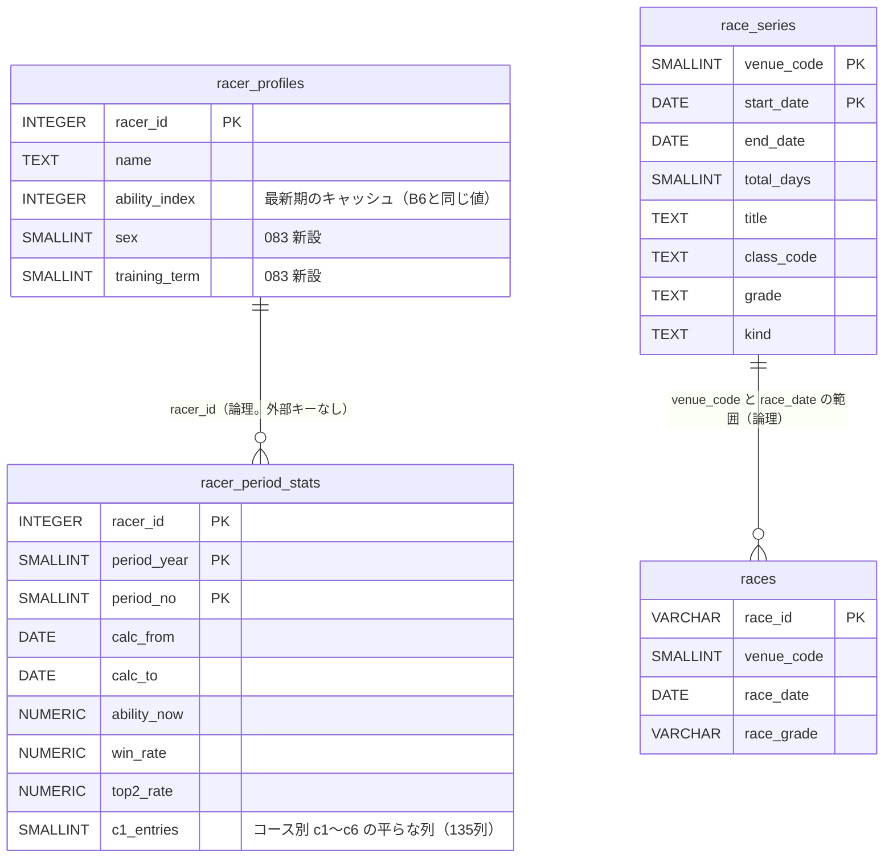

# 選手の期別成績（fan）と節メタ（月間スケジュール）の取り込み

対応: [optimal-scraping-design.md](../scraping-vercel-consolidation/optimal-scraping-design.md) §2.5 / [data-catalog.md](../scraping-vercel-consolidation/data-catalog.md) の N13（平均ST）・N16（節メタ）・N21（期別成績・能力指数・コース別成績）・N22（プロフィール全項目）/ [orchestration.md](../scraping-vercel-consolidation/orchestration.md)（決定事項）/ [kb-longterm-backfill/plan.md](../kb-longterm-backfill/plan.md)（K/Bの長期バックフィル。CLIの構成を揃えた）/ [ADR-0067](../../adr/0067-official-site-content-redisplay-policy.md)

ユーザー承認（2026-09-20）: 全データ設計の Q1〜Q10 を推奨案で承認。**Q2＝選手系の取得元は、選手別スクレイピング（B6）でなく公式の期別成績ファイル（fan）に置き換える。** Q3＝節・払戻明細・艇別を新設し既存列を拡張。Q1＝取り直せないページ以外の生ファイルは保管しない。ただし K・B・fan のファイルは、再解析の起点として保管する。

**本書は、コード・DDL案・検証までの成果物。本番DBへの書き込み・DDL適用、全期間の取得・投入は実行していない**（実行はユーザーの承認後）。

## 1. 結論

1. **fan は、公式ダウンロードページから 2001年10月（fan0110）〜現在の50ファイルを、認証なし・ヘッダ指定なしの GET で取得できる。** 1ファイル＝全選手（約1,550〜1,650人）×1期、約170〜185KB（LZH）。50ファイルで約8.7MB、50リクエスト。
2. **fan の値は、公式の選手ページ（期別成績・コース別成績・プロフィール）と一致し、本番DBの `racer_profiles`（B6が取得した値）とも一致した**（公式ページ: 選手11人・全項目、DB: 116人の能力指数・F・出遅れ・勝率で差0）。よって B6 の期別成績（1,627人×約8〜10秒）を fan で置き換えられる。過去期・全項目（コース別の進入・着回数・F/L/K/S）も取れる。
3. **月間スケジュール（節名・グレード色・開始日〜終了日）は、1か月1リクエスト**で全24会場分が取れ、2019-04まで遡れる。表の端に接する節は隣の月のページと突き合わせて確定する。取り込みは 92リクエスト（2019-03〜2026-10）。
4. **副次的な発見（要対応）: 本番DBの `races` に、節の初日の会場日が欠けている。** 月間スケジュールと突き合わせた結果、2026-07-29〜09-18 の節の初日125件のうち39件（約31%）が `races` に無い（[§9.5](#95-副次的な発見-races-に節の初日が欠けている)）。

## 2. 公式サイトの確認（実アクセス 23回、上限30回以内）

UA `BoatraceAIBot/1.0 (+https://github.com/rhapsody0919/boatrace-ai-predictor)`、逐次、間隔3.2秒以上、403/429/503 は0回（連続なら即中止する台帳付きで実行）。応答時間は約8〜10秒（この環境）。

| 対象 | 回数 | 内容 |
|---|---|---|
| ダウンロードページ（`extra/data/download.html`） | 1 | 50ファイルへのリンク、利用条件の記載 |
| fan の実ファイル（`static_extra/pc_static/download/data/kibetsu/fan{YYMM}.lzh`） | 8 GET＋2 HEAD | fan0110（最古）・0904・1104・1210・1310・1404・1904・2404（GET）、2510・2604（HEAD。Last-Modified の確認） |
| 選手ページ（`data/racersearch/{season,course,profile}?toban=`） | 7 | season（3448・3809）、course（3448・4365）、profile（3618・5186・3024） |
| raceindex（住之江 2026-09-01） | 1 | 節の初日・最終日・日目の確認 |
| 月間スケジュール（`race/monthlyschedule?ym=`） | 3 | 202608・202610・202004 |
| robots.txt | 1 | `User-agent: *` / `Disallow:`（全て許可） |

別セッションが 2026-09-20 に取得済みのもの（今回は再利用し、再取得していない）: fan2510・fan2604 の実ファイル、layout.html、月間スケジュール 202609・201904、選手の期別成績 5選手（3955・4177・5111・5158・5472）。

### 利用条件（ADR-0067）

ダウンロードページの記載は、「各年のレーサー期別成績（前期・後期）は、以下よりダウンロードできます」「LZH形式の圧縮ファイルは、解凍ソフトで解凍してからご利用ください」のみで、**fan 固有の利用条件・禁止事項の記載はない**。robots.txt は全許可。サイトポリシー（著作権等、禁止事項5「大量のアクセス」）は ADR-0067 のとおり（リスクを認識したうえでの現状維持）。生ファイルは内部の再解析用に非公開で保管するのみで、再配布しない。fan のデータを画面に出す場合は ADR-0067 の見直し契機（表示の量・範囲の変化）に当たりうるため、別途確認する。負荷は 50リクエスト（静的ファイル）で、K/Bの長期バックフィル（約5,400）の約1%。

### 提供範囲・提供終了リスク

- 50ファイルが連続（fan0110, 0204, 0210, 0304, …, 2510, 2604）。欠番なし。ページ上の見出しは「2026年 前期→fan2510、後期→fan2604」の並びで、ファイル名の年と期の対応が紛らわしい。**ファイル内の「年」「期」「算出期間」を正とする**（[§3](#3-fan-の形式)）。
- **Last-Modified**: 旧ファイルは全て 2020-04-27 に一括で更新（過去分は2020年に再整備）。近年の実測は、fan2404=2024-05-29、fan2510=2025-11-15、fan2604=2026-06-29（4月分は5月〜6月に、10月分は11月に公開されるとは限らない）。**公開時期は年により約1〜2か月ずれる。**
- 提供終了リスク: 同じ boatrace.jp 内の別サービス（mbrace.or.jp の番組表・競走成績の閲覧）は2025-03-05に終了済み。ダウンロード（fan・K・B）は現在も提供されているが、継続の保証はない。**生ファイルを早く保管する価値が高い**（[§10](#10-バックフィル計画実行しない)）。

## 3. fan の形式

Shift_JIS（cp932）の**固定長（バイト幅）**テキスト、CRLF区切り、LZH圧縮。1レコード＝1選手。レイアウトは公式の `extra/data/layout.html` と一致（`scripts/lib/fanPeriodParser.js` の表が実装）。

| 群 | 項目（バイト幅） |
|---|---|
| 識別・プロフィール | 登番(4)・名前漢字(16)・名前カナ(15)・支部(4)・級(2)・年号(1)・生年月日(6)・性別(1)・年齢(2)・身長(3)・体重(2)・血液型(2) |
| 期別成績 | 勝率(4、÷100)・複勝率(4、÷10)・1着回数(3)・2着回数(3)・出走回数(3)・優出回数(2)・優勝回数(2)・平均ST(3、÷100) |
| コース別（1〜6、各コース） | 進入回数(3)・複勝率(4、÷10)・平均ST(3)・平均スタート順位(3) |
| 級・能力指数・期 | 前期級・前々期級・前々々期級(各2)・前期能力指数(4)・今期能力指数(4)・年(4)・期(1)・算出期間の自(8)・至(8)・養成期(3) |
| コース別の着回数（1〜6、各コース） | 1〜6着回数(各3)・F・L0・L1・K0・K1・S0・S1・S2回数(各2) |
| コースなし | L0・L1・K0・K1回数(各2) |
| 出身地（2014年4月分以降） | 出身地(6) |

- **レコード長は416バイト（2014年4月分 fan1404 以降）、410バイト（〜2013年10月分 fan1310。出身地なし）。** fan0110・0904・1104・1210・1310 は410、fan1404・1904・2404・2510・2604 は416で、パーサーは長さで両方を読む（fan1304 は未確認だが、1210・1310 が410のため410とみなす）。他の長さは、握りつぶさず anomalies に残す。
- **「複勝率」は 2連対率**（全体は (1着+2着)/出走、コース別も (1着+2着)/進入）。10ファイルの全レコードで全体は一致（誤差は小数第1位の丸めのみ）。公式のコース別ページの「3連対率」は、コース別の1〜3着回数から導出する。
- **年・期の意味**: 「年」は算出期間の終了が4月の年、「期」は1=算出期間5/1〜10/31、2=算出期間11/1〜4/30。fan2604 は 2026年2期（算出 2025-11-01〜2026-04-30）、fan2510 は 2026年1期（算出 2025-05-01〜2025-10-31）。**10月分のファイル名の年は、ファイル内の「年」より1小さい。** ファイル名と期の一致は、取り込み時に検査する。
- **as-of の使い方**: レース日 D の選手成績には、`calc_to < D` で最新の期を使う。2019-04 のレースには fan1810（算出 2018-05〜2018-10）が要る。
- **値なし**: 出走0の選手は、fan では勝率等が0。公式ページは「-」。行への変換で、出走0なら勝率・2連対率・平均ST・今期能力指数を NULL、進入0のコースなら2連対率・平均ST・スタート順位を NULL にする（回数の0は0のまま）。
- 能力指数は、10ファイルで全て整数値（2桁で保存されているが小数部は常に0）。
- **支部の語彙は年により違う**: 〜fan1310 は41〜42種（都道府県レベル）、fan1404 以降は18種（支部の再編）。`branch` は原文のまま保持し、支部別の集計は期をまたぐ場合に注意する。

## 4. 公式の選手ページ・DB との一致

2026-09-21取得の実ページと、fan2604（フィクスチャ `scripts/lib/__fixtures__/fan/fan-sample.json`。fan2604 の12選手）を、`npm run verify:fan-period` で機械的に照合している。

| 照合 | 対象 | 結果 |
|---|---|---|
| 期別成績ページ（集計期間 2025/11/01〜2026/04/30） | 3448・3809・3955・4177・5111・5158 | 勝率・2連対率・出走・優出・優勝・平均ST・**能力指数（=今期能力指数）**・F回数・出遅れ（選手責任）・1〜6着回数が**全て一致** |
| 期別成績ページ（出走なし） | 5472 | ページは全項目「-」。fan は0 → NULL に変換（一致） |
| コース別成績ページ | 3448・4365 | 進入率（進入回数/出走）・3連対率（(1〜3着)/進入）・平均ST・スタート順が全コースで一致 |
| プロフィールページ | 3618（女）・5186（26歳）・3024（64歳） | 生年月日・身長・体重・支部・登録期・氏名・かなが一致。**表記の差**: 出身地は fan「広島」→ページ「広島県」、血液型 fan「O」→ページ「O型」、氏名の空白の入れ方が異なる |
| 本番DB `racer_profiles`（B6が2026-09-19〜20に取得） | 116選手（標本。2026-09-21にSELECT）。うち12選手の値を検証に固定 | 能力指数・F回数・出遅れ・勝率の差 **0**（NULL の選手も一致） |
| 同上 | 身長・体重・支部 | 差あり（身長5・体重7・支部2 / 116人）。DBは取得時点の値で、**fan の方が新しい** |

- **対応**: 「出遅れ回数（選手責任）」＝ L1 の合計（3448=L0 のみで0、3809=L1 で1）。「F回数」＝ コース別Fの合計。
- **`racer_profiles` は氏名・出身地・血液型を fan で上書きしない**（表記が異なるため。氏名の空白は RacerSearchBox が既に不揃いを吸収している）。fan で更新するのは、期別成績の5列・身長・体重・支部・性別・養成期。
- fan の選手数1,643人 vs `racer_profiles` 1,628人。fan にいて `racer_profiles` にいない選手が少なくとも15人（新人。B6の新人登録＝プロフィールページで補完する）。

## 5. スキーマ（DDL案。本番へ未適用）

| マイグレーション | 内容 | 既存への影響 |
|---|---|---|
| [083](../../db-migration/083_racer_period_stats.sql) | 新規 `racer_period_stats`（選手×期、135列、PK (racer_id, period_year, period_no)、索引1本）。`racer_profiles` に `sex`・`training_term`（nullable）を追加 | 新規テーブルは、RLS有効・anon/authenticated の権限なし。`racer_profiles` の列追加はメタデータのみ（約1,630行）で、既存の列・読み手には触れない |
| [084](../../db-migration/084_race_series.sql) | 新規 `race_series`（節。PK (venue_code, start_date)、索引1本） | 新規テーブルのみ。`races`・`race_conditions` には触れない（列追加・外部キーなし） |

設計上の判断:

- **コース別は jsonb ではなく平らな列**（数値はキー名を繰り返さない）。概算: jsonb 約1.3KB/行 vs 平ら約0.4KB/行。全50期（約8.2万行）で約100MB vs 約35MB、2019年以降の15期（約2.5万行）で約32MB vs 約11MB（**実測ではない**。DDL適用後に `pg_total_relation_size` で確認する）。列名は `c{N}_entries`・`c{N}_top2_rate`・`c{N}_avg_st`・`c{N}_avg_start_rank`・`c{N}_p1〜p6`・`c{N}_f/l0/l1/k0/k1/s0/s1/s2`、コースなし `nc_l0/l1/k0/k1`。`fanPeriodRows.js` の `STATS_COLUMNS` とDDLの一致を `verify:fan-period` が機械的に検査する。
- **外部キーなし**: `racer_profiles` に未登録の新人も保存でき、書き込みが FK 違反で止まらない。
- **`race_series` は `races` に列を足さない**: 別の担当が `races`・`race_conditions` を拡張中で競合を避ける。結合は `races.venue_code = race_series.venue_code AND races.race_date BETWEEN start_date AND end_date`。日目は `race_date − start_date + 1`。
- **適用時のリスク**: (1) 083の `ALTER TABLE racer_profiles ADD COLUMN` は ACCESS EXCLUSIVE ロックを取る（メタデータのみで瞬時）。`lock_timeout = 10s` を設定済み。適用前に長時間クエリが0件であることを確認する（079等と同じ手順）。(2) 新規テーブルは既定でRLS有効・権限なしのため、匿名から読めない（読み手を作るときに SELECT ポリシーと GRANT を追加）。(3) ロールバックは DROP TABLE（データ投入後は全行が消える。既存の読み手は影響なし）。(4) 容量は上の概算（DDL適用後に実測）。
- **B6 の `ability_index` は INTEGER**。fan の能力指数は全て整数値だが、将来に小数が現れた場合は、反映行で丸めて警告する（書き込みを壊さない）。

## 6. 既存機能への影響（grep で洗い出し）

`racer_profiles` を参照する箇所を全て確認した。**期別成績の5列（`ability_index`・`flying_count_period`・`false_start_count_period`・`period_label`・`official_win_rate_period`）を読む画面・RPC・スクリプトは、B6（書き込み側）と検算用の `scripts/analysis/verify-racer-season-stats-accuracy.js`、`scripts/analysis/data-health-report.js`（件数の集計）のみ。**

| 読み手 | 読む列 | fan導入後の影響 |
|---|---|---|
| `src/services/supabaseDataService.js`（`getAllRacersLite`） | racer_id・name・name_kana・branch・height_cm・weight_kg・registration_period・hometown・birth_date | **`branch`・`height_cm`・`weight_kg` が fan の最新値で更新される**（DBの古い値が直る。見た目の変更はこれのみ）。明示的な列指定のため、新規列 `sex`・`training_term` の影響なし。キャッシュキーは変更不要（24時間でブラウザが更新される） |
| `src/services/racerService.js`（選手個別ページ） | racer_id・name・name_kana・birth_date・height_cm・weight_kg・blood_type・branch・hometown・registration_period | 同上（身長・体重・支部が更新される）。**`blood_type`・`hometown`・`name` は上書きしない**（表記維持） |
| `scripts/daily/scrape-race-information.js`・`scripts/maintenance/backfill-race-entries-racer-id*.js`・`scripts/lib/racerNews/officialGradeAnnouncements.js` | racer_id・name | 影響なし（`name` は更新しない） |
| `scripts/analysis/racer-fortune-telling/validate-fortune-correlation.js` | birth_date 等 | 影響なし |
| RPC・ビュー | — | `racer_profiles` を参照する関数・ビューは、035・061 以外のマイグレーションに無い |
| `select("*")` で読む箇所 | — | 見つからない |

## 7. B6（選手別スクレイピング）との移行方針

B6 は `api/cron/racer-profiles.js`（PR #750。`scrape_job_state.mode` が off/shadow/live）と `scripts/lib/racerProfileSync.js`。**本PRでは変更しない**（参照のみ）。

| 段階 | 内容 | 前提 |
|---|---|---|
| 0（現在） | B6 と fan の `sync-profiles` が**併存**。同じ5列に同じ値を書く（116/116一致）ため、競合しても壊れない（冪等）。`sync-profiles` は「より新しい期の値が入っている行は書き戻さない」（`period_label` の辞書順）ため、期の切り替わり（5月・11月）でも後退しない | 083適用、fan取り込み済み |
| 1 | fan の公開（〜6月末・〜11月中旬）ごとに、`sync-profiles` を実行する（手動CLI。[§8](#8-取り込みcli日次cron)） | — |
| 2 | B6 を「新人登録のみ」に縮小する: `racer_profiles` に無い登録番号（直近の出走にいる）の**プロフィールページ1回**だけにし、期別成績ページ（1,627人×1回）の取得を廃止する。月次の全選手巡回（約15チャンク・約2.5時間、約1,630リクエスト/回）が不要になる | 段階1を1周期（半期）運用して、`racer_profiles` の5列と fan が全選手で一致することを実測 |
| 3 | B6 の月次の起動日（`runDaysOfMonth`）を廃止し、新人登録を日次の低頻度ジョブ（未登録の登録番号が出たときのみ）にする | 段階2の1か月の運用 |

**期の切り替わりの隙間**: 選手ページの期別成績は、算出期間の終了直後（4/30・10/31）に新しい期へ切り替わるとみられる（未確認。2026-09 時点で 2025/11/01〜2026/04/30 を表示）が、fan の公開は最大で約2か月遅れる（2026-06-29）。この間は、B6 を live にしておくと、期別成績が新しい期に更新され、fan は前の期のまま。`sync-profiles` の後退防止で、fan が古い値を書き戻すことはない。B6 を段階2で縮小するなら、**この隙間の期別成績は、fan の公開まで前の期のまま**になる（画面で使う場合は許容できるか要確認。現状、画面が読む列ではない）。

## 8. 取り込みCLI・日次Cron

### 8.1 CLI（`scripts/maintenance/fan-backfill.js`。kb-backfill.js と同じ構成）

| コマンド | 内容 |
|---|---|
| `plan` | 取得の見積り（リクエスト数・夜数）。ネットワーク・書き込みなし |
| `download` | 生LZHを `data/fan-archive/raw/kibetsu/` へ保存（ネットワークのみ）。マニフェスト（JSONL）に sha256・Last-Modified を記録 |
| `parse` | 生LZH → 中間JSON（`fan-period/v1`、`parsed/fanYYMM.json.gz`）。ネットワーク・DB不要。sha256 で生ファイルの改ざんを検知 |
| `load` | 中間JSON → `racer_period_stats`。既定は検証のみ、`--apply` で書き込み。変更の無い行は書かない（期ごとに既存を読み、`diffRows` の差分のみ upsert）。投入済みは `loaded.jsonl` でスキップ |
| `sync-profiles` | 最新期の値 → `racer_profiles`（既存行の update のみ。新規作成しない）。既定は検証のみ。083未適用でも、既存の列だけ更新する |
| `status` | 取得・解析・投入の状況 |

取得の安全策は kb-backfill.js と同じ（`scripts/lib/archiveDownloader.js` に共通化）: 逐次・3秒以上のジッター付き間隔（3秒未満は指定できない）・夜間窓（既定 JST 22-06。50リクエストの小規模のため `--window=any` でよい）・日次上限（既定100）・サーキットブレーカー（403は2回連続、429・503・5xx・接続失敗は3回連続で停止し、429・503・接続失敗は30秒〜5分の指数バックオフ。404が3回連続、LZHとして展開できない・レコードが500件未満の応答が3回連続でも停止）・中断再開（マニフェスト）・0件を成功にしない。**暦の上で最新の期のファイルが404（未公開）なのは想定内**として、完了扱いにせず、次回の実行で再試行する。終了コード 0=完了 / 1=エラー / 2=安全停止 / 4=サーキットブレーカー。

### 8.2 日次の定期取得（新しい期のファイルが公開されたとき）

**推奨: 当面は、Vercel Cron のジョブを実装せず、手動CLI（または対話セッションの開始時確認）で年2回実行する。** 理由: (1) 更新は年2回・約1,650行で、Cron の価値は「公開の検知」だけ。(2) Vercel の関数にはファイルシステムが無く、生LZH の保管に Supabase Storage のバケットと台帳（`raw_snapshots`）が要る。これは別の担当の設計（optimal-scraping-design.md §2.2）で、未実装。(3) 公開が約1〜2か月ずれるため、短い窓の予定表になじまない。

将来 Cron 化する場合の設計（PR #750 の日次ジョブの流儀。**実装しない**）:

| 項目 | 内容 |
|---|---|
| ジョブ | `racer_period`（`kind: "daily"`、`hosts: ["boatrace.jp"]`）。`scrape_job_state.mode` が off の間は何もしない（共通ラッパ） |
| 起動 | 毎日 JST 06:00 に1回。対象は `latestExpectedFanId(now)`（4月〜9月は fanYY04、10月〜3月は fanYY10）。取り込み済み（`racer_period_stats` に該当期の行あり）なら何もしない。なお、7月〜9月に fanYY04 がまだ404でも、この関数は「想定内の未公開」として扱う（公開遅延と欠落を区別できない）ため、期限（下記）超過の通知で補う |
| 検知 | 未取り込みなら GET（404＝未公開は想定内で、`last_target_date` を進めず翌日再試行）。4月1日・10月1日から最大105日間試行（Last-Modified の実測: 算出期間の終了から+29日（fan2404）・+60日（fan2604）・+15日（fan2510）。4月1日起点なら+58日・+89日）。105日（7月中旬・1月中旬）を超えて未公開ならSlack通知 |
| 処理 | 取得 → 生LZHをStorageへ保管 → 解析 → `racer_period_stats` upsert（約1,650行、200行/文）→ `racer_profiles` 反映。完了条件: 行数が記録された選手数と一致 |
| 負荷 | 1日1リクエスト。年間の合計は最大約210リクエスト（105日×2期）＋取得2件（約180KB×2） |

## 9. 月間スケジュール（N16）

### 9.1 ページの形式

`race/monthlyschedule?ym=YYYYMM`（選択肢は2016年〜）。5つの地区表（`table.is-spritedNone1`）。見出し（thead）が日付（「28 金」「1 火」…）で、**対象月の前後4日ずつを含む**（30日の月は38列、31日の月は39列。2026-09 は 2026-08-28〜10-04、2026-10 は 09-27〜11-04）。会場ごとに1つの tbody（th のリンクの `jcd=` が会場コード）。`td` が1日、`colspan=N` が N日間の節。`td` の class（`is-gradeColor…`）が色分け。節名は td 内のリンク。

| 色分け（class） | 意味 | グレード（`race_series.grade`） |
|---|---|---|
| SG・G1・G2・G3 | グレード | SG・G1・G2・G3 |
| Ippan | 一般 | ippan |
| Lady | オールレディース | NULL（G3相当か一般かは色分けから分からない） |
| Venus | ヴィーナスシリーズ | NULL |
| Rookie | ルーキーシリーズ | NULL |
| Takumi | マスターズリーグ | NULL |

- **リンクの `hd=` は節の初日ではない**（進行済みの節は最終日または当日、未来の節は初日）。日付は見出しの列から決める。
- **表の端に接する節**は窓の外へ続く可能性があり、**節名のリンクが無い**（実ページ3枚で、リンクの無い節は全て端に接していた。端以外でリンクの無い節は anomalies に出す）。開始日・終了日は隣の月のページと突き合わせて確定する（`mergeMonthlySchedules`）。節は最長でも7日程度で前後4日の余白があるため、隣の月で必ず全体が見える。範囲の両端の月は、前後1か月のページが要る（CLIの `load` が、無ければ停止する）。
- 会場コードはリンクの `jcd`。日付は、見出しの日の数字と全列で照合する（不一致は anomalies）。

### 9.2 検証（独立した3つの情報源）

| 情報源 | 結果 |
|---|---|
| 公式 raceindex（住之江 2026-09-01） | 「9/1 初日〜9/6 最終日」＝月間スケジュールの節（2026-09-01〜09-06、6日）と一致 |
| Kファイル 2019-04-15 | 蒲郡は「第4日」、多摩川は「第3日」。月間スケジュール（蒲郡 04-12〜04-16、多摩川 04-13〜04-18）から導出した日目と一致 |
| 本番DB `races`（2026-08-20〜09-19、9会場） | 終了日は全て一致。開始日は一致、または DB に初日の races が無い場合のみ1日ずれる（[§9.5](#95-副次的な発見-races-に節の初日が欠けている)） |

`verify:monthly-schedule` に、フィクスチャ（202608・202609・202610・201904 の一部会場）で組み込み済み。2020-04（COVID期）のページも、異常0で解析できることを確認した。

### 9.3 既存の `races.race_grade`・`race_conditions.series_day` との関係（重複・優先順位）

| 既存 | 現状 | 月間スケジュール由来（`race_series`）との関係 |
|---|---|---|
| `races.race_grade`（racelistの見出しの色分け。SG・G1・G2・G3・ippan。約77%が埋まる。2025-12・2026-01は欠落） | レース単位。racelist取得時に書く | **一次情報として優先**。`COALESCE(races.race_grade, race_series.grade)` で欠落を補う。食い違いの件数は取り込み後に実測する |
| `race_conditions.series_day`（何日目。約2.4%が埋まる） | racelistの日程タブ由来 | `race_date − race_series.start_date + 1` で導出できる（順延で日がずれた節は、実開催日とずれる。ずれの大きさは未計測） |
| index・raceindex（当日の節メタ。開催時間帯を含む） | 会場の集合のみ | 開催時間帯（モーニング・ナイター等）は月間スケジュールに無い。`race_series` に持たない（別途、index から） |
| Kファイル・Bファイルの見出し（節名の切り詰め、日目） | K/Bのアーカイブ表（074） | 節名の正式名称・グレードの補完に使える（`kb_archive_venue_days.race_grade` を `race_series` から補完する案は、別途） |

### 9.4 取り込み（`scripts/maintenance/monthly-schedule-backfill.js`）

fan-backfill.js と同じコマンド構成（`plan`・`download`・`parse`・`load`・`status`）。生HTMLは gzip で `data/monthly-schedule-archive/raw/YYYYMM.html.gz` に保存（ローカルの作業用。Storage台帳の対象外）。`load` は前後1か月の解析済みページで節を確定し、確定できない節・要確認があれば投入しない。`--refresh` で当月・翌月を取り直す（更新される項目のため）。

**定期取得の設計**（実装しない）: 月1回（毎月1日 JST 06:00）に当月・翌月の2ページを `--refresh` 相当で取り直し、`race_series` を更新する（数十行）。節の追加・グレード変更は月内にも起きうるため、週次でもよい（2ページ/週）。

### 9.5 副次的な発見: `races` に節の初日が欠けている

月間スケジュールの節の初日（会場×日）を、本番DBの `races`（`venue_code`・`race_date`）と突き合わせた（読み取りのみ）。

| 月 | 節の初日 | `races` が無い |
|---|---|---|
| 2026-07（7/29〜31） | 9 | 4（18・22・23が7/29、8が7/30） |
| 2026-08 | 72 | 11（8/4〜8/7に8、8/30に3） |
| 2026-09（〜9/18） | 44 | 24（9/1〜9/11に集中） |
| 計 | 125 | 39（約31%） |

- 欠けているのは**全て節の初日**（確認した 2026-08-28〜09-19 の会場日298件のうち、DBに無い27件は全て節の初日。初日以外は欠けがなく、DBの連続開催日の終了日は全て月間スケジュールと一致）。
- 2026-09-12以降の初日は欠けていない（9/12〜9/18の節の初日20件は全て存在）。BOA-325（初日のrace_id日付ズレの修正）が関係する可能性があるが、**原因は未調査**。
- 影響: 初日のレース（予想・結果・出走表）が、該当の会場日で欠ける。分析の母数・画面の初日の表示・完了の定義Aの件数（分母）に影響しうる。
- 本作業のスコープ外のため、追跡用の起票（`spawn_task`）に残した。`race_series` は、この種の欠落を継続的に検知する材料になる（「節の各日に `races` があるか」の突合）。

## 10. バックフィル計画（実行しない）

kb-longterm-backfill/plan.md に倣う。**実行はユーザーの端末（別のIPのVMでもよい）。** GitHub Actions・Vercel は、本番の取得と送信元が同じになり、ブロックの影響が本番に及ぶため避ける（ADR-0066: 新規の取得ジョブをGitHub Actionsへ追加しない）。

| データセット | 範囲 | リクエスト | 転送 | 所要（この環境の応答約9.5秒＋間隔平均4秒＝約13.5秒/件） | 夜数（上限200/夜） |
|---|---|---|---|---|---|
| fan（生LZH保管） | fan0110〜fan2604（50ファイル） | 50 | 約8.7MB | 約11分 | 1 |
| 月間スケジュール | 2019-03〜2026-10（92か月。2019-04〜2026-09 を投入するための前後1か月を含む） | 92 | 約6.5MB | 約21分 | 1 |
| 合計 | | **142** | 約15MB | 約32分 | 1（同じ夜に続けて実行できる） |

- **順序**: (1) fan（全50ファイルの生LZHを、提供終了リスクのため最初に保管）→ (2) 月間スケジュール。K/Bの長期バックフィルとは独立で、ホストは boatrace.jp（K/Bは mbrace.or.jp）。並行して走らせず、逐次で（別々の夜でもよい）。
- **最初の1回はカナリア**: `--max-requests=5` で5件だけ実行し、応答時間・エラー・403の有無を報告してから続ける。
- **IP対策**: 逐次（同時接続1）・3〜5秒のジッター付き間隔・夜間窓（JST 22時〜6時）・サーキットブレーカー（403は2回連続で停止）。停止（終了コード4）したら、同じIPで再開せず24時間以上空け、`--interval-min-ms` を倍にする。403が再発するなら、それ以上続けない。
- **投入の範囲**: DBへは、fan は **fan1810（算出 2018-05〜10）〜fan2604 の16ファイル**（2019-04 のレースの as-of に fan1810 が要る。約2.6万行、約11MB［概算］）から。古い34ファイルは、`parse` まで（BOA-271が2019年より前を要するときに `load`）。全50ファイルを入れても約8.2万行・約35MB［概算］で、容量の負担は小さいため、判断はユーザー。月間スケジュールは 2019-04〜2026-09（約9千行、約1MB）。
- **Disk IO**: fan の投入は1期約1,650行（200行/文・文の間隔0.5秒＝約9文）、16期でも約150文・約2分。月間スケジュールは約9千行・約45文。K/Bの投入（約1.1GBのWAL）に比べ、無視できる。**適用前後で、ダッシュボードの Disk IO 消費を確認する**（データ取得の完了の定義C）。
- **完了の定義**（`.claude/rules/data-acquisition.md`）: **A（件数）**: `racer_period_stats` は、期ごとの行数＝fan のレコード数（例: fan2604=1,643）、期数＝16（またはユーザーが選んだ範囲）。`race_series` は、月別の節数（2019-04で約100）。期待件数は `parse` の出力（`status`）から。分母から除くもの: なし（過去の確定ファイル）。**B（タイミング）**: 対象外（半期・月次の確定値。取得時刻は `created_at` に残る）。**C（継続監視）**: 新しい期のファイルの公開を検知する（[§8.2](#82-日次の定期取得新しい期のファイルが公開されたとき)）。取得後に `racer_profiles` の5列と fan が全選手で一致することを、1回実測して報告する。

## 11. 検証結果

`npm run verify:fan-period`（97項目、うち変異検証15）・`npm run verify:monthly-schedule`（46項目、うち変異検証8）。DB・公式サイトに接続しない。

- **fan**: 10実ファイル（fan0110・0904・1104・1210・1310・1404・1904・2404・2510・2604、計約1.6万レコード）を、パーサーで全件解析し、異常0（レコード長は410または416）。フィクスチャ（実ファイルから抜粋した18選手）で、公式ページ・DBの値との一致を検証（[§4](#4-公式の選手ページdb-との一致)）。
- **月間スケジュール**: 実ページ7枚（202608・202609・202610・201904・202004 ほか）で異常0。独立した3つの情報源との一致（[§9.2](#92-検証独立した3つの情報源)）。
- **DDL案**: 列の完全一致（135列・SERIES_COLUMNS）、numeric の丸め桁、CHECK の語彙（`CLASS_CODES`・`races.race_grade`）、RLS・権限。`npm run verify:migration-numbers`・`verify:migration-rls`・`verify:er-diagram` 成功。
- **CLI**: 403（2回連続で停止）・503（3回連続＋30秒→60秒のバックオフ）・404の連続・LZHでない応答・窓の外・日次上限・翌日の再開・最新期の未公開404（想定内で再試行）・0件の扱い・`--dry-run`。手作りの LZH（`-lh0-`）で、取得→展開→解析の経路を確認。
- **load / sync-profiles**（偽のDBクライアント）: 既定は検証のみ、`--apply` で書く、変更の無い行は書かない、値が変わった1行だけ書く、DDL未適用（テーブルなし・列なし）でも壊れない、書き込み失敗は `loaded` に記録しない、より新しい期の行を書き戻さない、`racer_profiles` に無い選手を作らない。
- **変異検証**: パーサー（氏名幅・2連対率の桁・算出期間の桁・昭和の起点・着回数の個数・旧レイアウト判定・ファイル名と期の検査）7件、行変換（出走0の扱い・出遅れのL0/L1・進入0の平均ST・期の識別子）4件、取得ループ（403の停止・間隔・未公開の完了扱い・日次上限）4件、月間スケジュール（見出しの日付の対応・終了列・端の断片の扱い・日数・グレードの決めつけ・会場コード）8件。全て、変異で検証が失敗する。

## 12. ユーザー判断が要る点

| # | 判断 | 推奨 |
|---|---|---|
| 1 | 083・084 の本番適用（適用前に長時間クエリ0件を確認） | 承認後に適用。コードのマージとは独立（DDL未適用でも、CLIの `load` は書かずに終了する） |
| 2 | fan・月間スケジュールの取得の実行（142リクエスト、約32分、ユーザー端末）。カナリア5件→残り | 承認後、fan → 月間スケジュールの順 |
| 3 | `racer_period_stats` に入れる期の範囲（16ファイル＝2019-04〜、または全50ファイル） | 16ファイル（fan1810〜fan2604）。古い分は必要になってから |
| 4 | B6 の縮小（段階2）の時期。新人登録のみへ | fan を1周期運用して一致を実測した後 |
| 5 | fan の日次Cron化（Storage・台帳が先） | 当面は手動（年2回） |
| 6 | 節の初日が `races` に欠けている件（39/125）の調査・修復 | 別途起票（本書は検知の材料のみ） |
| 7 | `race_series.grade` が NULL の節（オールレディース・ヴィーナス・ルーキー・マスターズ）のグレードの決め方 | `races.race_grade`（racelist）を優先し、無ければ NULL のまま。K/Bの節名からの補完は別途 |

## 13. 未確認事項

- fan1304 のレコード長（410とみなした。fan1210・fan1310 が410）。fan0204〜fan0810 等、未取得の40ファイルの形式（10ファイルの全レコードで異常0のため、同じ形式の可能性が高いが、全件は未確認。`parse` の anomalies で検知する）。
- fan の公開日（4月分・10月分が何日か）。Last-Modified は再アップロード日の可能性がある（旧ファイルは2020-04-27に一括）。次回の公開時に実測する（[§8.2](#82-日次の定期取得新しい期のファイルが公開されたとき)）。
- 月間スケジュールの取得できる最古（2016年の選択肢があるが、確認したのは2019-04・2020-04）。中止・順延が月間スケジュールにどう表示されるか（未確認。予定表のため、実開催日とずれる可能性）。
- 全24会場の月間スケジュールの実ページ（24会場）での確認は、7ページ（会場数は24）。フィクスチャは一部会場の抜粋。
- `racer_period_stats` の実際の行サイズ・容量（概算のみ。DDL適用後に実測）。
- fan にいて `racer_profiles` にいない新人の人数（少なくとも15人。B6の新人登録の実行状況による）。
- ユーザー端末での応答時間（この環境は約9.5秒）。
