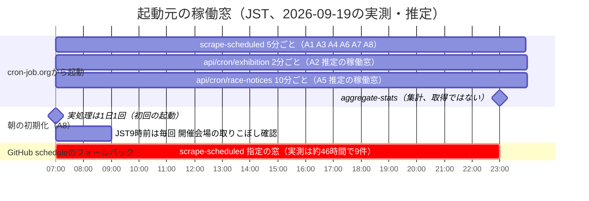
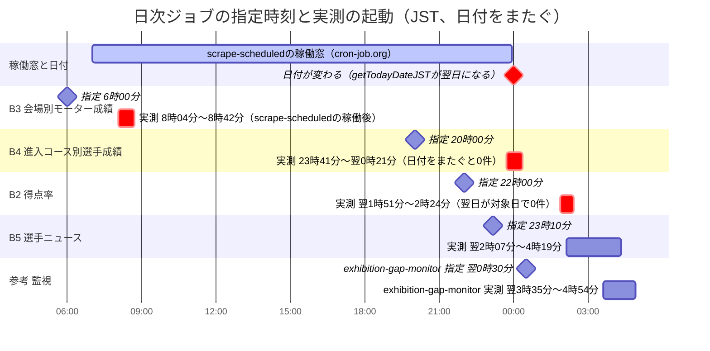
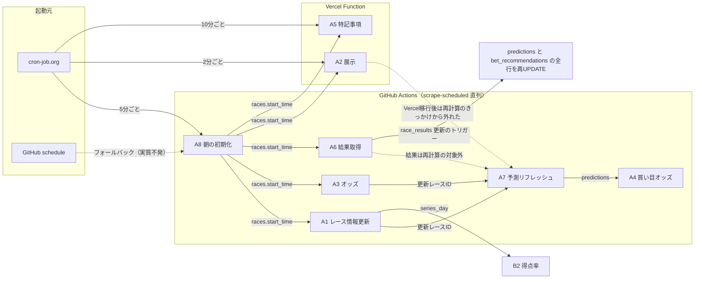

# スクレイピング（データ取得）全ジョブの一覧と時系列図

対応: Linear [BOA-343](https://linear.app/boat-ai/issue/BOA-343)（取得元・間隔の一覧化と図示）/ 入力先: 統合spec（WS3、[orchestration.md](./orchestration.md)）/ 前提: [ADR-0056](../../adr/0056-new-scraping-execution-placement-principle.md)（T1〜T5の分類）・[ADR-0066](../../adr/0066-scraping-execution-consolidation-to-vercel.md)・[完了の定義](../../../.claude/rules/data-acquisition.md)

## 1. この資料の範囲と調べ方

- 対象は、外部サイトを取得してDBに書く、または取得のきっかけになるジョブ。`.github/workflows/`の32ファイルと、`api/cron/`のVercel Functionを全て確認した。取得系は14ジョブ（6ワークフロー＋2 Vercel Function）。実行単位は8つ（6ワークフロー＋2 Vercel Function）で、ジョブは14に分けた（`scrape-scheduled.yml`が7ジョブを直列で束ねているため）。残り26ワークフローは、集計・学習・コンテンツ・SNS・監視・CIで、[§8](#8-対象外のワークフロー26ファイル)に名前と理由のみ書く
- 調査日は2026-09-19。根拠は次のとおり。推測で埋めず、確認できなかった項目は「未確認」と書く

| 根拠 | 内容 |
|---|---|
| コード | `.github/workflows/`、`scripts/daily/`、`scripts/lib/`、`api/cron/`、`vercel.json`（`crons`の記述なし＝Vercel純正Cronは未使用） |
| GitHub Actionsの実行履歴 | `gh run list`の`createdAt`・`event`・`conclusion`。`scrape-scheduled`は直近400件（2026-09-17 15:10〜09-19 13:40 JST）。ジョブのログは`gh run view --log`で、`scrape-point-rank` 3本、`scrape-venue-entry-course-stats` 3本、`scrape-venue-motor-stats`の失敗1本を確認 |
| Vercelのランタイムログ | 直近24時間の`/api/cron/*`の呼び出し件数と、直近の呼び出し時刻（読み取りのみ） |
| Supabase | 読み取り2回のみ。(1)`information_schema.columns`で取得時刻列の有無、(2)`race_results`の`result_at`の非NULL件数（9/15〜9/19） |
| 既存資料 | [orchestration.md](./orchestration.md)のベースライン（PR #713・#714の内容を含む）、[外部Cronのセットアップ](../../operation/external-cron-setup.md)、Linear BOA-313・342・343・344・349・350のコメント |

- 「タイミング分類」は[ADR-0056](../../adr/0056-new-scraping-execution-placement-principle.md)のT1（発走直前ウィンドウ）・T2（当日随時）・T4（前日〜日次）・T5（低頻度）と、[scraping-full-coverage/plan.md](../scraping-full-coverage/plan.md)のT3（結果取得と同じ頻度、レース後）を使う。Linear BOA-343のコメントは結果取得を窓型（T1側）にまとめているが、本資料は結果取得をT3と表記する（性質は窓型で、予定表方式の対象になる）
- 「完了の定義」のA・B・Cは、[data-acquisition.md](../../../.claude/rules/data-acquisition.md)の定義（A=件数、B=取得時刻列とタイミング、C=継続監視）

## 2. サマリー

### 2.1 ジョブ数

| 区分 | ジョブ | 数 |
|---|---|---|
| T1（発走直前ウィンドウ） | A1 レース情報更新、A2 展示、A3 オッズ、A4 買い目オッズ | 4 |
| T2（当日随時） | A5 特記事項 | 1 |
| T3（結果と同頻度） | A6 結果取得（中止確定・Kファイル同期・的中フラグ補完を含む） | 1 |
| 派生（外部取得なし、取得に連動） | A7 予測リフレッシュ | 1 |
| T4（前日〜日次） | A8 朝の初期化（全窓型ジョブの前提）、B1 公式コンピュータ予想、B2 得点率、B3 会場別モーター成績、B4 進入コース別選手成績、B5 選手ニュース | 6 |
| T5（低頻度） | B6 選手プロフィール・期別成績 | 1 |
| 合計 | | 14 |

| 実行基盤 | ジョブ |
|---|---|
| GitHub Actions（`scrape-scheduled.yml`、cron-job.org→GitHub API経由の5分間隔） | A1、A3、A4、A6、A7、A8、B1（7ジョブが1本の直列ジョブに同居） |
| GitHub Actions（GitHub自身のschedule、日次・月次の独立ワークフロー） | B2、B3、B4、B5、B6（5ワークフロー） |
| Vercel Function（cron-job.orgから直接） | A2（`/api/cron/exhibition`）、A5（`/api/cron/race-notices`）（2本） |
| Vercel純正Cron | 未使用（`vercel.json`に`crons`なし） |

### 2.2 主要な発見（詳細は§3〜§7）

1. **GitHubのscheduleは定刻に起動しない。日付や当日のレース表に依存するジョブが、日付を取り違えている。** 実測の遅延は約2〜5時間（[§4](#4-起動元と実測の起動遅延)）。`scrape-point-rank`（22:00 JST指定）は翌01:51〜02:24 JSTに起動し、対象日が翌日になって「開催会場なし」で0件を書く（ログ3回で確認）。`scrape-venue-entry-course-stats`（20:00 JST指定）も23:41〜翌00:21 JSTで起動し、3回中2回が翌日を対象日として0件保存だった（ログ3回で確認）。当日の`races`に依存する日次ジョブ（B2・B4）は、どちらも同じ構造で空振りしうる
2. **GitHubのフォールバックcron（`*/10`）は、実質、機能していない。** 約46時間で9件しか起動しない（同期間の理論値は約184回）。cron-job.org（5分間隔）は、391件全て定刻（5.0分間隔）で、単一障害点にはなっているが、実績は安定
3. **`scrape-scheduled`は、実行時間と取りこぼしの両方で限界に近い。** 実行の11.8%（400件中47件）がキャンセルされ、成功した実行の中央値は5.1分、90パーセンタイルは10分（5分間隔を超える）。両ステップが`continue-on-error: true`のため、失敗してもワークフローは成功に見える
4. **取得時刻列が無いテーブルがある。** `exhibition_data`・`race_entries`・`race_start_timings`・`race_conditions`（`created_at`のみ）・`races`（`updated_at`のみ、再計算のたびに上書き）。一方、`race_results.result_at`は存在し、直近5日の全行（156/156/180/180/70件）で非NULLだった。[orchestration.md](./orchestration.md)のベースラインは「`race_results`は`created_at`のみ」と記載しており、**事実と不一致**（[§6.1](#61-取得時刻列の有無orchestrationmdのベースラインとの差)）
5. **監視があるのは、展示（日次の欠落率）・特記事項（構造変化）・モーター成績と進入コース別成績（構造変化）だけ。** オッズ・結果・レース情報・買い目オッズ・得点率・選手ニュース・期別成績・朝の初期化には、件数・窓内取得・0件・未実行の監視が無い
6. **重複取得**（[§7.1](#71-重複取得)）: 買い目オッズ（A4）はオッズ（A3）と同じページを再取得。`beforeinfo`は3ジョブが取得し、気象は展示取得時の値を捨てている。Kファイルは同じ日を2関数が別々にダウンロードする
7. **取得漏れの候補**（[§7.2](#72-取得漏れ)）: `racer_series_points`が0件（原因は上記1）、`racer_profiles.ability_index`が0/1,627件（`scrape-racer-season-stats`は実行履歴0件）、`race_special_notes`が0件（正常か不明）、racelistのF数・L数・平均ST、スタート展示の進入順など

## 3. 全取得ジョブの一覧

凡例: 表は、ジョブIDごとに4枚に分ける（基本情報、取得元と保存先、依存と実行制御、完了の定義と移行難度）。T1/T2/T3（レース進行に連動）を先に、T4/T5（日次・低頻度）を後に置く。ページは全て`https://www.boatrace.jp/owpc/pc/`配下（別ドメインは明記）。`{jcd}`は会場コード、`{hd}`は日付（YYYYMMDD）、`{rno}`はレース番号。

### 3.A レース進行に連動するジョブ（T1・T2・T3・派生・前提）

#### 表A-1 基本情報（起動元・間隔・実測）

| ID | ジョブ | 分類 | 起動元 | 間隔・時刻（JST） | 実測の起動状況（詳細は[§4](#4-起動元と実測の起動遅延)） |
|---|---|---|---|---|---|
| A1 | レース情報更新（`update-race-info.js`） | T1 | cron-job.org→GitHub API（`workflow_dispatch`）→`scrape-scheduled.yml`。フォールバックはGitHub schedule | 5分ごと（07:00〜23:55）。各実行で、発走57〜63分前のレースだけ処理（1レース1〜2回） | dispatchは5.0分間隔で定刻。実行の11.8%がキャンセル |
| A2 | 展示データ（`scrape-exhibition-data.js`、Vercel版`api/cron/exhibition.js`） | T1 | cron-job.org→Vercel Function（直接）。GitHub側は同一コードを保持するが、リポジトリ変数`SKIP_EXHIBITION_ON_GHA=true`で休止（9/16〜） | 2分ごと。ドキュメントは07:00〜23:00、Vercelの24時間の呼び出し件数510件から、稼働窓は約17時間（07:00〜23:59相当）と推定。実効窓は発走27〜33分前と7〜18分前 | Vercelログで2分間隔・全て202を確認 |
| A3 | オッズ（`scrape-odds.js`） | T1 | A1と同じ（`scrape-scheduled.yml`） | 5分ごと。実効窓は発走57〜63分前、27〜33分前、18分前〜発走3分後（60/30/15/10/5/0分前の各±3分の合併） | A1と同じ |
| A4 | 買い目オッズ（`scrape-prediction-odds.js`） | T1 | A1と同じ | 5分ごと。発走60分以内（発走前）の全レースに毎回（1レース最大12回） | A1と同じ |
| A5 | レース特記事項（`scrape-race-information.js`、`api/cron/race-notices.js`） | T2 | cron-job.org→Vercel Function（直接） | 10分ごと。コード記載は07:00〜23:00。24時間の呼び出し件数102件から、稼働窓は約17時間（07:00〜23:59相当）と推定 | Vercelログで10分間隔を確認（cron-job.org側の登録内容は未確認） |
| A6 | 結果取得（`scrape-results.js`）。中止確定・Kファイル同期2種・的中フラグ補完を含む | T3 | A1と同じ | 5分ごと。発走5〜90分後の未完了レースを毎回取り直し。Kファイル同期は直近4日を毎回確認 | A1と同じ |
| A7 | 予測リフレッシュ（`generate-predictions.js`の`mainRefresh`） | 派生 | A1と同じ（同じジョブ内で、A1・A3の更新があったレースのみ） | 更新があった実行ごと（約8秒） | A1と同じ |
| A8 | 朝の初期化（`morning-init.js`＋`scrape-to-json.js`＋`generate-predictions.js`のフルモード＋unified予測） | T4（1日1回。A1〜A7の前提） | A1と同じ | 毎回起動されるが、実処理は1日1回（07:00の初回実行）。毎回、DB確認・取りこぼし確認が走る | 毎日の初回dispatchは07:00 JST（9/18・9/19で確認） |

#### 表A-2 取得元・保存先・目的

| ID | 取得元ページ | 保存先テーブル・列（主なもの） | 目的 |
|---|---|---|---|
| A1 | `race/racelist?rno&jcd&hd`（出走表・級別・レース名・ステージ・節日程タブ）、`race/beforeinfo?rno&jcd&hd`（気象）。1レース2ページ | `race_entries`: racer_id、player_name、grade、age、win_rate、local_win_rate、global_2rate、global_3rate、local_2rate、local_3rate、motor_number、motor_2rate、motor_3rate、boat_number_id、boat_2rate、boat_3rate（upsert: race_id,boat_number）。`race_conditions`: weather、wind_direction、wind_speed、wave_height、temperature、water_temperature、series_day、is_final_day、race_title、race_stage（upsert: race_id）。`races`: race_grade、cancellation_status、cancellation_check_streak（update） | 発走直前の出走表・選手/モーター成績、気象、節日数、中止・順延の暫定検知 |
| A2 | `race/beforeinfo?rno&jcd&hd`。1レース1ページ（展示タイムが公開されるまで、対象窓の間は繰り返し取得） | `exhibition_data`: exhibition_time、start_timing、tilt、propeller_change、parts_changed、adjustment_weight、today_weight、prev_race_no、prev_entry_course、prev_start_timing、prev_finish_rank（upsert: race_id,boat_number）。展示タイム非NULLの行があるレースはスキップ | 展示タイム・展示ST（買い目の最終判断材料）、部品交換・調整重量・当日体重・前走成績 |
| A3 | `race/oddstf`（単勝・複勝）、`race/odds3t`（3連単）、`race/odds3f`（3連複）、`race/odds2tf`（2連単・2連複）、`race/oddsk`（拡連複）。1レース最大5ページ（並列）、会場間1秒待機。結果取得済み（`race_results.payout_win`非NULL）はスキップ | `race_odds`: captured_at、odds_win_1〜6、odds_place_{1〜6}_{low,high}、trifecta_popular_{1〜3}、trifecta_odds_{1〜3}、trifecta_all、trio_all、exacta_all、quinella_all、wide_all（jsonb）（upsert: race_id,captured_at）。0分窓は、欠けた全通り系を過去のスナップショットで補完 | オッズ一覧タブ（BOA-311）、期待値・回収率分析（ADR-0054/0057） |
| A4 | `race/odds3t`、`race/odds3f`。1レース2ページ（5並列） | `prediction_odds`: trifecta_pred_/trifecta_odds_/trio_pred_/trio_odds_の`{standard,safe_bet,upset_focus}`、updated_at（upsert: race_id。1レース1行を上書き） | 予想の買い目の現在オッズ表示 |
| A5 | `race/information?rno=1&jcd&hd`（会場×日単位。事故・内規違反・減点、モーター・ボート変更、欠場・帰郷の3区分）。開催会場ごとに1ページ | `race_special_notes`: venue_code、race_date、category、racer_id、boat_number（常にNULL）、detail_text、structured_data、scraped_at（重複は無視するupsert）。`race_notices_health`: venue_code、check_date、had_success、last_reason、last_checked_at（毎回upsert） | 事故・変更・欠場の通知表示（BOA-318/319/320）。構造変化の監視用に成否を記録 |
| A6 | `race/raceresult?rno&jcd&hd`（順位・タイム・払戻・決まり手・進入・ST。未完了の1レース1ページ、500ms間隔で逐次）。Kファイル`https://www1.mbrace.or.jp/od2/K/{YYYYMM}/k{YYMMDD}.lzh`（別ドメイン。1日1ファイル、LZH圧縮） | `race_results`: rank1〜6、race_time_1〜6、payout_win、payout_place_1/2、payout_trifecta、payout_trio、payout_exacta、payout_quinella、payout_wide_1〜3、popularity_*、winning_technique、course_1〜6、result_at（upsert: race_id）。Kファイル由来: actual_course_1〜6、rank4〜6（update）。`race_start_timings`: start_timing、is_flying、is_late_start（upsert: race_id,boat_number）。`predictions`: is_hit_win/place/trifecta/trio/turn、payout_*（update）。`races.cancellation_status`（発走90分超で結果なしを`confirmed`に） | 結果・払戻、的中判定、ST、実進入コース |
| A7 | なし（DBの`race_entries`・`race_conditions`・`exhibition_data`・`races`・`racer_aggregated_stats`を読む） | `predictions`（対象race_idを削除してINSERT: model_id、top_pick、top_2nd、top_3rd、confidence、feature_contributions）、`races`（volatility_*、updated_at）。毎回、Vercel Deploy Hookを叩く（BOA-361） | 直前情報を反映した予想の再計算 |
| A8 | `race/index?hd`（開催会場一覧）、`race/raceindex?jcd&hd`（発走時刻）、会場ごと12レース分の`race/racelist`・`race/beforeinfo`（朝の1回）。JST9時前は、毎回`race/index`も取得して取りこぼしを確認 | `races`: race_id、race_date、venue_code、race_number、start_time、volatility_*、recommended_model、race_grade、first_boat_*、win_rate_*、motor_2rate_stddev、updated_at。`race_entries`（A1と同じ列＋ai_score_*）、`exhibition_data`（exhibition_time・start_timingのみ）、`race_conditions`、`predictions`。ランナー上の`data/races.json`（コミットしない） | 当日のレース表（`races.start_time`が全窓型ジョブの前提）、出走表の初期化、予想の初期生成 |

#### 表A-3 依存関係と実行制御

| ID | 依存関係（前後・きっかけ） | 実行制御 |
|---|---|---|
| A1 | 前: A8（`races.start_time`）。後: 更新があれば、同じ実行内でA7の対象になる。`race_conditions.series_day`はB2（得点率）が使う | `concurrency: scrape-scheduled`（`cancel-in-progress: false`）、`timeout-minutes`未設定（既定360分）、`git push`なし（`contents: read`）、`continue-on-error: true` |
| A2 | 前: A8。後: 本来はA7の対象だが、Vercel移行後は、GitHub側の`updatedRaceIds`に入らない（展示更新が再計算のきっかけから外れた影響は未検証） | Vercel: `maxDuration 300`、`waitUntil`でバックグラウンド継続（202を即返す）、`CRON_SECRET`認証、排他なし（2分間隔のため前回と重なりうる）、0件でも202 |
| A3 | 前: A8。後: 更新があれば同じ実行内でA7の対象。現状、30/15/10分前の再計算は実質オッズ取得が起点（推定） | A1と同じ。会場直列（BOA-342の実測で1回あたり約122秒） |
| A4 | 前: A7（`predictions`の3モデルの予想を読む） | A1と同じ。1回あたり約52秒（BOA-342の実測） |
| A5 | 前: A8（開催会場の決定） | Vercel: `maxDuration 300`、`waitUntil`、`CRON_SECRET`認証。`getRaceSchedule`はDBエラー時に空配列を返すため、DB障害時も200（「対象なし」）で終わる（2026-09-19 10:50 JSTのログで確認） |
| A6 | 前: A8。後: `race_results`のINSERT/UPDATEトリガー`trg_update_predictions`が`predictions`・`bet_recommendations`を再UPDATE（[orchestration.md](./orchestration.md)のWS8への入力）。Kファイルは開催日の夜〜翌日に公開されるため、当日を除く直近4日を毎回確認 | A1と同じ。結果取得39秒＋進入コース再同期78秒（BOA-349の不具合）ほか（BOA-342の実測）。`fixMissingHitFlags`が直近10日の`predictions`を毎回スキャン |
| A7 | 前: A1・A3の更新（展示・結果は対象外）。後: A4 | A1と同じ。約8秒（BOA-342の実測）。Vercelで動かせる見込み（[orchestration.md](./orchestration.md)のスパイク結果） |
| A8 | 後: A1〜A7の全て（`races`が空だと、後続は「スケジュール未登録」で早期終了する。9/16の障害時に発生）。B1は、この中で実行 | A1と同じ。`continue-on-error: true`。`execSync`（`scrape-to-json.js`・`generate-predictions.js`・`generate-unified-predictions.js`・`scrape-pcexpect.js`）、`git log`（`fetch-depth: 0`が必須）、`fs`（`data/races.json`）に依存。毎回、`races`の件数確認と、unified予測の欠落確認（`race_entries`・`predictions`を全件読む） |

#### 表A-4 完了の定義の現状と、Vercelへの移行の難易度

完了の定義の出典は、[orchestration.md](./orchestration.md)のベースライン（WS1の実測、PR #714）。WS1の実測範囲に無いものは「未確認」とした。

| ID | A: 件数 | B: 取得時刻列・タイミング | C: 監視 | 移行の難易度と注意点 |
|---|---|---|---|---|
| A1 | 未確認（`race_entries`・`race_conditions`の期待件数に対する充足率）。`series_day`の過去分、`today_weight`のNULLはWS5の対象 | `race_entries`は取得時刻列なし。`race_conditions`は`created_at`のみ。気象は発走60分前の1回のみ取得し、公式とずれる（9/15〜18の646レースで、保存時刻の中央値が発走60分前。BOA-358） | なし | 低〜中。`fs`・`git`・`execSync`は使わない（cheerioとsupabase-js）。所要は約10秒。注意: 窓の意味論（予定表方式で「期限＋許容幅」へ変更する案）、全行upsertの回転量（WS8(b)）、`beforeinfo`の重複取得（[§7.1](#71-重複取得)） |
| A2 | 行の有無99.5%、展示タイム非NULL基準98.2%（未達）。9/17が20件、9/18が29件の欠落（展示タイム非NULL基準） | 取得時刻列なし（計測不能）。WS2で`scraped_at`を追加予定 | あり: `exhibition-gap-monitor.yml`（日次、前日の欠落率が2%超でSlack）。窓内取得の監視は無い | 移行済み。注意: 排他なし（重複配信で壊れないのは、展示タイム取得済みのスキップとupsertによる）、実行時間（`waitUntil`内）の実測は未確認 |
| A3 | 全通り系オッズは9/16から保存（直近7日の充足21.7%、9/17・9/18は100%） | `race_odds.captured_at`あり（計測可）。窓内取得率（直近7日）: 60分前89.6%、30分前92.3%、15分前92.5%、10分前92.6%、5分前93.0%、0分前43.4%（0分窓は9/16開始）。全て98%未達。取りこぼしの81〜94%は、前後5分以内にキャンセルされた実行がある（BOA-344） | なし | 中〜高。取得ページ数が最多（[§5.4](#54-1レースあたりの取得ページ数推定)）。会場直列で約122秒。Vercelに移す場合は、会場並列化・分割が必要。並走中の二重書き込みは`source`列で区別（ADR-0059 4）。全通り系はjsonbで行が大きい（WAL） |
| A4 | 未確認 | `prediction_odds.updated_at`のみ（最終更新時刻。履歴なし） | なし | 低〜中。A3と同じページを重複取得しているため、移行より先に統合の要否を判断する価値がある（[§7.1](#71-重複取得)） |
| A5 | `race_special_notes`が0件（正常か不明。ログは「0件新規保存」が続く。WS5） | `race_special_notes.scraped_at`、`race_notices_health.last_checked_at`あり | あり: `race-notices-drift-monitor.yml`（日次、構造変化のみ）。0件の検知は無い | 移行済み。注意: `race_notices_health`を毎回upsert（13会場×約100回/日。変更の無い行を書かない方針に反する）、DB障害時に200で終わる |
| A6 | 月別充足率: 2025-12が93.0%、2026-01が94.5%、2026-03が91.0%（欠落は全て`race_results`に行が無いもの）。rank4〜6は直近7日で96.4%。9/15・9/16は`actual_course_1`がNULLの滞留が各1件（BOA-349） | **`race_results.result_at`あり**（9/15〜9/19の全742行で非NULL、本調査で確認）。取り直し時に上書きされるため、実質「最後の書き込み時刻」。`race_start_timings`は取得時刻列なし | なし | 高（一覧中で最大）。逐次500ms、DB書き込みが多い（的中フラグのUPDATEがN+1、`predictions`の10日スキャン）。Kファイルは`fetch`＋純JSのLZH展開（`@kirinsaninc/lhats`）でVercelでも動く見込み。移行前にBOA-349（進入コース再同期が毎回全件UPDATE）の修正が必要。結果は、払戻が発走5分後、スタート情報・決まり手が20分後以降（再設計案の意味論） |
| A7 | 対象外（取得ではない） | `predictions.predicted_at`あり。再計算のたびに更新される | なし | Vercelで動かせる見込み（条件付き。スパイクの結果は[orchestration.md](./orchestration.md)）。毎回のDeploy Hookが再デプロイを起こす（BOA-361）。`DELETE→INSERT`が非トランザクションで、予測が空になる瞬間がある |
| A8 | 未確認 | `races.updated_at`は再計算・更新のたびに上書きされ、取得時刻にならない | なし | **高。** `execSync`・`git log`・`fs`（`races.json`）・複数スクリプトの連鎖に依存し、Vercel化の最大の障壁（[ADR-0066](../../adr/0066-scraping-execution-consolidation-to-vercel.md)、WS4b）。実行時間は未確認。初回の07:00起動が、当日の最初の発走の窓に間に合うかも未確認 |

### 3.B 日次・低頻度のジョブ（T4・T5）

#### 表B-1 基本情報（起動元・間隔・実測）

| ID | ジョブ | 分類 | 起動元 | 指定の間隔・時刻（JST） | 実測の起動状況（詳細は[§4](#4-起動元と実測の起動遅延)） |
|---|---|---|---|---|---|
| B1 | 公式コンピュータ予想（`scrape-pcexpect.js`） | T4 | A8（`morning-init.js`）の中から`execSync`で実行 | 1日1回（朝の初期化時のみ） | A8と同じ |
| B2 | 今節得点率（`scrape-point-rank.js`、`scrape-point-rank.yml`） | T4 | GitHub Actions schedule（`0 13 * * *` UTC） | 毎日22:00 | 翌01:51〜02:24 JST（3回、+3時間51分〜+4時間24分） |
| B3 | 会場別モーター成績（`scrape-venue-motor-stats.js`、`scrape-venue-motor-stats.yml`） | T4 | GitHub Actions schedule（`0 21 * * *` UTC） | 毎日06:00 | 08:04〜08:42 JST（5回、+2時間04分〜+2時間42分） |
| B4 | 進入コース別選手成績（`scrape-venue-entry-course-stats.js`、`scrape-venue-entry-course-stats.yml`） | T4 | GitHub Actions schedule（`0 11 * * *` UTC） | 毎日20:00 | 23:41〜翌00:21 JST（3回、+3時間41分〜+4時間21分） |
| B5 | 選手ニュース（`collect-racer-news.js`、`collect-racer-news.yml`） | T4 | GitHub Actions schedule（`10 14 * * *` UTC） | 毎日23:10 | 翌02:07〜04:19 JST（10回、+2時間57分〜+5時間09分） |
| B6 | 選手プロフィール・期別成績（`scrape-racer-profiles.js`、`scrape-racer-season-stats.yml`） | T5 | GitHub Actions schedule（`0 0 1 * *` UTC、`0 0 8,15 5,11 *` UTC） | 毎月1日09:00、5月・11月は8日・15日09:00も | 実行履歴0件（`gh run list`が空）。初回の指定は2026-10-01 09:00 JST |

#### 表B-2 取得元・保存先・目的

| ID | 取得元ページ | 保存先テーブル・列（主なもの） | 目的 |
|---|---|---|---|
| B1 | `race/pcexpect?hd&jcd&rno`。全レース（逐次） | `external_predictions`: source、race_date、venue_code、race_no、payload（focus_2t、focus_3t、confidence、entry_prediction_image）、scraped_at、race_start_at（upsert: source,race_date,venue_code,race_no） | 公式コンピュータ予想との比較 |
| B2 | `race/pointrank?jcd&hd`。開催中の会場のみ（SG/G1等の記念競走にだけ表がある）、会場間1秒待機 | `racer_series_points`: venue_code、meet_start_date、racer_id、race_grade、player_name、grade、rank、score_rate、placements、total_points、penalty_points、remarks、scraped_at（upsert: venue_code,meet_start_date,racer_id） | 記念競走の今節得点率の表示（BOA-220/BOA-291） |
| B3 | 会場公式サイトのモーター成績ページ（別ドメイン。22会場。戸田・平和島はデータなしで対象外。宮島はPDF）。会場間の待機なし | `venue_motor_stats`: venue_code、motor_number、scraped_date、meet_count、race_count、final_count、championship_count、first/second/third_place_count、win_rate、top2_rate、top3_rate、accident_rate、best_time、avg_exhibition_time、stats_period_start/end、source_template（upsert: venue_code,motor_number,scraped_date）。加えて`data/analysis/venue-motor-stats-health.json`（成否履歴）をmasterへコミット | モーター成績の表示（`MotorConditionChart.jsx`、`supabaseDataService.js`が読む）。構造変化の監視用に成否を記録 |
| B4 | 会場公式サイトの`/modules/raceinfo/?page=index_racecourse`（別ドメイン。10会場）。当日の各レースを1ページずつ、同一会場は待機を入れて逐次 | `venue_entry_course_stats`: race_id、venue_code、waku、entry_course、racer_id、racer_name_raw、entry_rate、avg_st、place_rate_1〜6、stats_period_start/end、scraped_at（upsert: race_id,waku,entry_course）。加えて`data/analysis/venue-entry-course-stats-health.json`をmasterへコミット | 進入コース別の選手成績（BOA-293）。表示側（`src/`・`api/`）の読み手は、grepでは見つからなかった（未確認） |
| B5 | `site/news/racer/{YYYY}/{MM}/`（公式ニュースのレーサーデータカテゴリ。一覧ページのみ） | `racer_news`: racer_id、title、summary、source_url、source_name、published_at（insert）。`racer_profiles`を読んで選手を特定。特定できないものは`data/analysis/racer-news-pending-review/pending.json`に記録し、masterへコミット | 選手の節目記録のニュース掲載（ADR-0024） |
| B6 | `data/racersearch/profile?toban`（`racer_profiles`に未登録の選手のみ）、`data/racersearch/season?toban`（全選手）。`race_entries`に登場した全racer_id（約1,627人）を、500ms間隔で逐次 | `racer_profiles`: racer_id、name、name_kana、birth_date、height_cm、weight_kg、blood_type、branch、hometown、registration_period、grade_at_scrape、ability_index、flying_count_period、false_start_count_period、period_label、official_win_rate_period、official_updated_at、scraped_at。加えて`data/analysis/racer-fortune-telling/profile-scrape-report.json`をmasterへコミット | 能力指数・フライング回数等の公式集計値、選手プロフィールの自動登録（BOA-321/322） |

#### 表B-3 依存関係と実行制御

| ID | 依存関係 | 実行制御 |
|---|---|---|
| B1 | 前: A8（`races.start_time`。`getRaceSchedule`） | A8の`execSync`配下（`try/catch`で失敗しても続行） |
| B2 | 前: A1の`race_conditions.series_day`（開催初日を逆算）と`races.race_grade`。`series_day`が無い会場は、その日をスキップ（過去日の再試行なし）。取得対象日は、実行時点の`getTodayDateJST()` | `concurrency: scrape-point-rank`、`timeout-minutes`未設定、`git push`なし、`continue-on-error: true` |
| B3 | 前: なし（`scrape-scheduled`から読まれる箇所は、grepでは見つからなかった。読み手はフロントと監視スクリプトのみ）。ワークフローのコメントは「レース開始前、`scrape-scheduled`の稼働窓の前」を意図している | `concurrency: scrape-venue-motor-stats`、`timeout-minutes`未設定、**`git push`あり**（`git pull --rebase`→`git push`、再試行なし）、`continue-on-error: true`（取得ステップ）。`contents: write` |
| B4 | 前: A8とA1（`races`・`race_entries`に対象日の出走表がある会場のみ処理し、無い会場は「本日開催なし」でスキップ）。取得対象日は、実行時点の`getTodayDateJST()` | B3と同型（**`git push`あり**） |
| B5 | 前: `racer_profiles`（選手の特定） | `concurrency: collect-racer-news`（`cancel-in-progress: true`）、`timeout-minutes`未設定、**`git push`あり**、`continue-on-error: true` |
| B6 | 前: `race_entries`（選手一覧の母集団） | `concurrency: scrape-racer-season-stats`、`timeout-minutes`未設定、**`git push`あり**、`continue-on-error: true`。1,627人×500ms×（1〜2ページ）から、実行時間は約14〜27分と推定（実測なし） |

#### 表B-4 完了の定義の現状と、Vercelへの移行の難易度

| ID | A: 件数 | B: 取得時刻列・タイミング | C: 監視 | 移行の難易度と注意点 |
|---|---|---|---|---|
| B1 | 未確認 | `external_predictions.scraped_at`あり。公式予想が朝1回の取得で足りるか（発走前に更新されるか）は未確認 | なし | 低〜中。単純な`fetch`。A8から分離する必要がある |
| B2 | **`racer_series_points`が0件。** 直接原因は、22:00 JST指定の実行が翌01:51〜02:24 JSTに起動し、対象日が翌日になって「開催会場なし」になったこと（9/16・9/17・9/18の3回ともログで確認。BOA-291、PR #715）。記念競走以外に表が無い仕様上の空がありうるかは未確認 | `racer_series_points.scraped_at`あり | なし（0件テーブルの検知なし） | 低。開催会場が無い空振りの実行で約24秒（開催会場があれば、会場数×（取得＋1秒）が加わる。実測なし）。移行時は「起動時刻に依存せず、対象日を明示する」設計が必須（[§7.2](#72-取得漏れ)） |
| B3 | 未確認 | `scraped_date`（日付のみ）。時刻は計測不能 | あり: 構造変化の検知（14日連続失敗でSlack）。書き込み0件の検知は無い | 中。`git push`と`fs`書き込み（`health.json`）に依存するため、成否履歴をDBに移す必要がある（`race_notices_health`と同じ方式）。9/19 08:04 JSTの実行は、`git push`がmasterとの競合で失敗（BOA-360。データの書き込みは完了済み） |
| B4 | 対象日9/17（9/17 00:11 JST起動）と対象日9/18（9/18 00:21 JST起動）は0件保存、対象日9/18（9/18 23:41 JST起動）は1,296件保存（3回ともログで確認） | `scraped_at`あり | あり: 構造変化の検知（Slack）。0件の検知は無い | 中。B3と同じ`git push`・`fs`依存。当日の出走表があることが前提のため、起動時刻を予定表に結びつける必要がある |
| B5 | 未確認（月1〜2件と少ない） | `racer_news.created_at`のみ | あり（人手確認リスト`pending.json`をセッション開始時に確認する運用）。ジョブ自体の失敗検知は無い | 低〜中。`git push`（`pending.json`）に依存 |
| B6 | **`ability_index`が0/1,627件**（未実行。WS5） | `scraped_at`・`official_updated_at`あり | なし | 高。1回の実行が推定14〜27分で、Vercelの`maxDuration`300秒に収まらない（分割・再開が必須）。`git push`（`profile-scrape-report.json`）に依存 |

### 3.C 手動実行のスクリプト（スケジュール外）

定期実行はされないが、boatrace.jp・mbrace.or.jpを取得してDBに書く。バックフィルのロジックは、定期実行と共有する方針（[data-acquisition.md](../../../.claude/rules/data-acquisition.md)）。

| スクリプト | 内容 |
|---|---|
| `scripts/maintenance/backfill-results-by-race-id.js`、`backfill-exhibition-by-race-id.js` | 結果・展示の欠損レースを、レースID指定で補完（BOA-354、PR #711） |
| `scripts/maintenance/backfill-actual-course.js`、`backfill-rank456-from-kfile.js` | Kファイルから進入コース・rank4〜6を補完 |
| `scripts/maintenance/backfill-race-conditions.js`、`backfill-race-data.js`、`backfill-racer-ids.js`、`backfill-race-entries-racer-id*.js`、`backfill-start-timings.js`、`backfill-exhibition-time.js` | レース条件・レースデータ・選手ID・ST・展示タイムの補完 |
| `scripts/maintenance/backfill-*-hit*.js`、`backfill-place-hits.js`、`backfill-trifecta-trio.js` | 的中フラグの補完（DBのみ） |
| `scripts/maintenance/scrape-racer-profiles.js` | B6の本体。`--dry-run`・`--limit`で手動実行できる |
| `scripts/ml/backfill.py` | MLの学習用に、Kファイルから過去分を取得（Python） |
| `api/scrape-races.js` | Vercel Functionのオンデマンドエンドポイント（`beforeinfo`を取得）。リポジトリ内に参照が無く、24時間の呼び出し件数の上位25パスにも出ない。未使用の疑い（全期間の利用は未確認）。公開エンドポイントのため、呼ばれるとboatrace.jpへアクセスする |

## 4. 起動元と実測の起動遅延

### 4.1 起動元の系統

| 系統 | 構成 | 実測 |
|---|---|---|
| (1) cron-job.org→GitHub API（`workflow_dispatch`） | `scrape-scheduled.yml`（5分ごと）、`aggregate-stats.yml`（毎日23:00 JST、集計。取得ではない） | `scrape-scheduled`は391件全て、5.0分間隔・分の位置が常に0（定刻）。1日目（9/18）は07:00〜23:55の204件で欠けなし |
| (2) cron-job.org→Vercel Function（直接） | `/api/cron/exhibition`（2分）、`/api/cron/race-notices`（10分） | 直近24時間で510件、102件（間隔×約17時間と一致）。`race-notices`のcron-job.org側の登録内容は未確認（[外部Cronのセットアップ](../../operation/external-cron-setup.md)に記載なし） |
| (3) GitHub Actions自身のschedule | `scrape-scheduled.yml`のフォールバック（`*/10 22-23,0-13 * * *` UTC＝07:00〜22:59 JST）、`scrape-point-rank`・`scrape-venue-motor-stats`・`scrape-venue-entry-course-stats`・`collect-racer-news`・`scrape-racer-season-stats`、ほか集計・監視系 | 下表のとおり、定刻に起動しない |
| (4) Vercel純正Cron | 未使用 | `vercel.json`に`crons`なし |

### 4.2 GitHub Actionsのscheduleの起動遅延（実測）

出典: `gh run list --workflow <name> --limit <n> --json createdAt,event,conclusion`。遅延は、指定時刻と、直近の実行の`createdAt`の差。`event`が`schedule`のものだけを対象にした。

| ワークフロー | 指定（JST） | 実測の起動（JST） | 遅延 | 件数 |
|---|---|---|---|---|
| `scrape-venue-motor-stats` | 06:00 | 08:04、08:25、08:26、08:33、08:42 | +2時間04分〜+2時間42分 | 5（9/15〜9/19 JST） |
| `scrape-venue-entry-course-stats` | 20:00 | 23:41（9/18）、翌00:21（9/17→9/18）、翌00:11（9/16→9/17） | +3時間41分〜+4時間21分 | 3 |
| `scrape-point-rank` | 22:00 | 翌01:51（9/18→9/19）、翌02:23（9/17→9/18）、翌02:24（9/16→9/17） | +3時間51分〜+4時間24分 | 3 |
| `collect-racer-news` | 23:10 | 翌02:07〜翌04:19 | +2時間57分〜+5時間09分 | 10（9/9〜9/18） |
| （参考）`exhibition-gap-monitor` | 翌00:30 | 03:35〜04:54 | +3時間05分〜+4時間24分 | 5 |
| （参考）`aggregate-stats`のschedule | 23:00 | 翌02:26〜02:55 | +3時間26分〜+3時間55分 | 4（同時刻にcron-job.orgからのdispatchが、毎日23:00:29に定刻で入っている） |
| （参考）`calculate-accuracy` | 23:30 | 翌02:22〜04:32 | +2時間52分〜+5時間02分 | 8 |
| `scrape-scheduled`（フォールバック、`*/10`） | 07:00〜22:59の10分ごと | 約46時間（9/17 15:10〜9/19 13:40 JST）で9件のみ（うち3件はキャンセル）。9/19 02:03 JST（指定の窓外）にも1件 | 起動しない、または大幅に遅延 | 理論値は約184回 |
| （参考）`campaign-pipeline`（`*/30`） | 06:00〜23:59の30分ごと | 約19時間で6件 | 起動しない、または遅延 | 理論値は約26回 |

### 4.3 `scrape-scheduled`の実行（直近400件、9/17 15:10〜9/19 13:40 JST）

| 項目 | 実測 |
|---|---|
| 起動の内訳 | `workflow_dispatch` 391件、`schedule` 9件 |
| 結論の内訳 | success 351件、cancelled 47件（11.8%）、結論が空の実行2件（実行中またはキュー待ちと推定） |
| キャンセルの時間帯 | 07〜18時台（07時6件、12時9件、11時5件、15時7件など） |
| 実行時間（success 351件、`updatedAt`−`startedAt`） | 中央値5.1分、90パーセンタイル10.0分、最大39.3分 |
| 1回の内訳（BOA-342/349の実測1件、約379秒） | 準備70秒、オッズ122秒（会場直列）、結果取得39秒、過去日の進入コース再同期78秒（BOA-349）、予測更新8秒、買い目オッズ52秒、情報更新10秒 |

## 5. 1日のタイムライン図

### 5.1 起動元の稼働窓（レース進行に連動するジョブ）

レース進行に連動するジョブ（A1〜A7）は、絶対時刻ではなく、発走時刻との相対で動く（各実行が、その時刻に窓に入っているレースを処理する）。この図は、その「実行の起点」の稼働窓を示す。発走時刻の範囲（最初・最後の発走）は、本調査では取得していない（未確認）。

読み方: 各tickで、その時点で発走に対する窓に入っているレースだけが処理される（各ジョブの窓は§5.3の図）。GitHubのフォールバックは、赤のバー（`crit`）で「指定はあるが、実測ではほぼ機能していない」ことを示す。cron-job.orgの窓は、Vercelの呼び出し件数からの推定を含む（[§9](#9-未確認の項目)のU1）。

### 5.2 日次・低頻度ジョブ（指定と実測）

指定時刻は◆（マイルストーン）、実測の起動の範囲は横棒で示す。実測は、2026-09-14〜9-18の`schedule`起動の範囲。横棒の右端が翌日（9/20側）にはみ出すものは、日付が変わったあとに起動している。

| 読み取れること | 内容 |
|---|---|
| 依存の破れ（B3） | 「`scrape-scheduled`の稼働窓（07:00〜）より前に完了する」という意図は満たされない。08:04〜08:42に起動する。読み手が`scrape-scheduled`系に無いため、実害は確認できていない |
| 日付の取り違え（B2・B4） | 日付が変わった後に起動すると、`getTodayDateJST()`が翌日になる。翌日の`races`は、07:00の朝の初期化まで存在しないため、「開催会場なし」で0件になる |
| 起動時刻の幅（B5） | 実測の幅が2時間超（02:07〜04:19）。B5は当月と前月の一覧を取得するため、日付のずれに強く、実害は確認していない |
| 月次（B6） | 毎月1日09:00指定、5月・11月は8日・15日も。実行履歴0件のため、遅延は未測定 |

### 5.3 1レースの取得タイミング（発走15:00の例）

各窓は、発走時刻に対する±3分（閉区間）。cron-job.orgの5分間隔では、1つの窓に1〜2回の実行が入る（平均約1.2回）。展示のVercel版は、2分間隔。

```mermaid
gantt
    title 1レースの取得タイミング（発走15時00分の例、窓は各プラスマイナス3分）
    dateFormat HH:mm
    axisFormat %H:%M
    todayMarker off
    section 発走前
    A1 レース情報更新 racelistとbeforeinfo（60分前）    :a1, 13:57, 14:03
    A3 オッズ 60分前窓                                   :o1, 13:57, 14:03
    A4 買い目オッズ 発走60分前から毎回                   :p1, 14:00, 15:00
    A2 展示 30分前窓                                     :e1, 14:27, 14:33
    A3 オッズ 30分前窓                                   :o2, 14:27, 14:33
    A2 展示 15分前と10分前の窓（合併）                   :e2, 14:42, 14:53
    A3 オッズ 15 10 5 0分前の窓（合併、発走後3分まで）   :o3, 14:42, 15:03
    発走                                                 :milestone, s1, 15:00, 0m
    section 発走後
    A6 結果 払戻（5分後）から取り直し                    :r1, 15:05, 16:30
    A6 スタート情報・決まり手（20分後以降に公開）        :r2, 15:20, 16:30
    A6 中止・順延の確定（90分超で結果なし）              :crit, milestone, r3, 16:30, 0m
```

Kファイル（進入コース・rank4〜6）は、当日を対象にせず、翌日以降に同期される（下表）。

| タイミング | ジョブ | 取得ページ | 保存先 | 補足 |
|---|---|---|---|---|
| 発走の57〜63分前 | A1 レース情報更新 | racelist、beforeinfo | `race_entries`、`race_conditions`、`races` | 気象はここで1回のみ（BOA-358）。更新があれば、同じ実行内でA7が再計算 |
| 発走の57〜63分前 | A3 オッズ（60分前窓） | oddstf、odds3t、odds3f、odds2tf、oddsk | `race_odds` | 更新があれば、同じ実行内でA7が再計算 |
| 発走の60分前〜発走 | A4 買い目オッズ | odds3t、odds3f | `prediction_odds` | 5分ごと（最大12回）。A3と同じページ |
| 発走の27〜33分前 | A2 展示（30分前窓） | beforeinfo | `exhibition_data` | 公開前は空振り（`no_values`）。取得済みならスキップ |
| 発走の27〜33分前 | A3 オッズ（30分前窓） | oddstf 他4ページ | `race_odds` | |
| 発走の7〜18分前 | A2 展示（15分前・10分前窓の合併） | beforeinfo | `exhibition_data` | Vercel版は2分間隔。取得できるまで繰り返す |
| 発走の18分前〜発走の3分後 | A3 オッズ（15/10/5/0分前窓の合併） | oddstf 他4ページ | `race_odds` | 窓が連続し、5分ごとに取得される。0分窓は、欠けた全通り系を過去のスナップショットで補完 |
| 発走の5〜90分後 | A6 結果取得 | raceresult | `race_results`、`race_start_timings`、`predictions` | 未完了（払戻と決まり手が揃わない）の間、毎回取り直し。ST・決まり手の公開は20分後以降 |
| 発走の90分超 | A6 中止・順延の確定 | なし（DBのみ） | `races.cancellation_status` | 結果が無いレースを`confirmed`に |
| 翌日〜4日後 | A6 Kファイル同期 | mbrace.or.jpのKファイル | `race_results.actual_course_*`、`rank4〜6` | 当日を除く直近4日を、実行のたびに確認（未完了があるとき） |
| 10分ごと（1日中） | A5 特記事項 | race/information（会場単位） | `race_special_notes` | レース単位ではなく、会場×日単位 |

### 5.4 1レースあたりの取得ページ数（推定）

前提: cron-job.orgの実行間隔5分、1つの窓に平均1.2回の実行が入る、キャンセルされた実行は含めない。取得ページ数は、コードから数えた推定値で、実測ではない。

| ジョブ | 1レースあたりの回数 | 1回あたりのページ数 | 1レースあたりの合計（推定） |
|---|---|---|---|
| A1 レース情報更新 | 約1.2回 | 2 | 約2〜3 |
| A2 展示 | 3〜9回（公開時刻に依存） | 1 | 3〜9 |
| A3 オッズ | 約6.6回（1.2＋1.2＋4.2） | 5 | 約33 |
| A4 買い目オッズ | 最大12回 | 2 | 最大24 |
| A6 結果 | 約3〜6回 | 1 | 約3〜6 |
| 合計 | | | 約65〜75ページ（180レースの日で、約11,700〜13,500ページ） |

A4の最大24ページ（合計の約3分の1）は、A3が取得する`odds3t`・`odds3f`と同じページ（[§7.1](#71-重複取得)）。

### 5.5 ジョブとデータの依存関係

## 6. 完了の定義（A・B・C）の状況

### 6.1 取得時刻列の有無（orchestration.mdのベースラインとの差）

2026-09-19に`information_schema.columns`で確認した（1回の読み取り）。

| テーブル | 取得時刻の列 | 取得時刻としての性質 |
|---|---|---|
| `race_odds` | `captured_at` | 取得ごとに新しい行（履歴が残る）。計測可 |
| `race_results` | `created_at`、`result_at` | `result_at`はスクリプトが書き込み時刻を入れる。取り直しで上書きされるため、最後の書き込み時刻。**9/15〜9/19の全742行（156＋156＋180＋180＋70）で非NULL**（本調査で確認）。orchestration.mdのベースラインの「`created_at`のみ」は誤り |
| `race_special_notes` | `scraped_at` | 新規行の取得時刻 |
| `race_notices_health` | `last_checked_at` | 会場×日の最終確認時刻 |
| `external_predictions` | `scraped_at` | 取得時刻 |
| `racer_series_points`、`venue_entry_course_stats` | `scraped_at` | 取得時刻 |
| `racer_profiles` | `scraped_at`、`official_updated_at` | 取得時刻 |
| `venue_motor_stats` | `scraped_date`（日付のみ） | 時刻は不明 |
| `prediction_odds` | `updated_at` | 最終更新時刻のみ（履歴なし） |
| `predictions` | `predicted_at` | 再計算のたびに更新 |
| `races` | `created_at`、`updated_at` | `updated_at`は再計算・更新のたびに上書き |
| `race_conditions` | `created_at` | 初回INSERT時刻。更新で変わるかは未確認 |
| `racer_news` | `created_at` | 作成時刻 |
| **`exhibition_data`、`race_entries`、`race_start_timings`** | **なし** | 計測不能（WS2で`scraped_at`を追加予定） |

### 6.2 監視（C）の有無

| データセット | 件数の監視 | 窓内取得の監視 | 0件の検知 | 未実行の検知 | 構造変化の検知 |
|---|---|---|---|---|---|
| 展示（A2） | あり（日次、前日分、2%超でSlack） | なし | なし | なし | なし |
| 特記事項（A5） | なし | なし | なし | なし | あり（日次） |
| モーター成績（B3） | なし | 対象外 | なし | なし | あり（Slack） |
| 進入コース別成績（B4） | なし | 対象外 | なし | なし | あり（Slack） |
| 選手ニュース（B5） | なし | 対象外 | なし | なし | 人手確認リストのみ |
| レース情報（A1）、オッズ（A3）、買い目オッズ（A4）、結果（A6）、朝の初期化（A8）、公式予想（B1）、得点率（B2）、期別成績（B6） | なし | なし | なし | なし | なし |

`scrape-scheduled.yml`は、両ステップが`continue-on-error: true`のため、ステップが失敗してもワークフローは成功と表示される（400件中、success 351件・cancelled 47件・その他2件。failureは0件）。6ワークフローとも`timeout-minutes`は未設定（既定360分）。

## 7. 抜け漏れ・重複の洗い出し（BOA-343の項目3）

Linearへの起票は行っていない。以下は、起票できる粒度でまとめた一覧。各項目の確度は、「確認済み」（実行ログ・DB・コードで確認）、「コード確認」（コードで確認、公式ページの実物とは未照合）、「推定」で示す。

### 7.1 重複取得

| # | 内容 | 確度 | 関係するジョブ | 備考・方向性（決定ではない） |
|---|---|---|---|---|
| D1 | `odds3t`・`odds3f`を、A3（窓内）とA4（発走60分以内の毎回）が別々に取得している。A4は、予想の買い目1点ずつ（3モデル×2券種）を取るだけで、同じ全通りが`race_odds.trifecta_all`・`trio_all`に窓内で保存される | コード確認 | A3、A4 | 1レース最大24ページ（推定、全体の約3分の1）。A4を`race_odds`の最新スナップショットからの導出に置き換えられる可能性。ただし更新頻度（A4は5分ごと、`race_odds`は窓内のみ）の要件確認が必要 |
| D2 | `beforeinfo`を、A1（60分前、気象）・A2（30/15/10分前、展示）・A8（朝の初期化、12レース全て）の3ジョブが取得している。A2は同じページの気象も取得しているが、保存せずに捨てている | コード確認 | A1、A2、A8 | 気象を発走直前（A2）で保存すれば、A1の`beforeinfo`取得を省ける。BOA-358（気象の鮮度）と同じ根 |
| D3 | `racelist`を、A8（朝、`race_entries`の初期化）とA1（60分前）が取得し、同じレースの`race_entries`をほぼ同じ列で2回書いている（A8は`generate-predictions.js`のフルモード経由） | コード確認 | A8、A1 | 再取得は意図的（直前の変更を反映）だが、差分が無ければ書かない（WS8(b)）。A8の朝の取得が必要かは、要検討 |
| D4 | Kファイルを、進入コース同期（`syncActualCourseFromKFile`）と、rank4〜6同期（`syncRank456FromKFile`）が、同じ日について別々にダウンロードしている（直近4日×2関数） | コード確認 | A6 | 1回取得して両方を処理できる。BOA-349（毎回全件UPDATE）と合わせて修正できる |
| D5 | 展示のコードが2箇所に残る。GitHub側（休止中、`SKIP_EXHIBITION_ON_GHA`で切り戻し可能）と、`scrape-to-json.js`・`api/scrape-races.js`のbeforeinfo別パーサー（重複実装） | コード確認 | A2、A8 | 旧経路の削除（WS7）の対象。`api/scrape-races.js`は参照が無い（未使用の疑い） |
| D6 | `race_results.course_1〜6`（raceresultページのスタート情報テーブルから取得）は、実進入を表していない（全レースで艇番と一致。BOA-257）。実進入は、Kファイル由来の`actual_course_1〜6` | コード内コメントの記載（BOA-257の調査結果。本調査では再検証していない） | A6 | 不要な取得・列の整理候補 |
| D7 | 取得ジョブが、Vercelの再デプロイを引き起こす。`mainRefresh`とA8が、毎回Deploy Hookを叩く（BOA-361。9:00〜13:12 JSTで同一コミットの再デプロイが約22件。orchestration.mdの引用） | 推定（BOA-361の引用） | A7、A8 | 取得の重複ではないが、取得ジョブの副作用 |
| D8 | A8が、毎回（5分ごと）、`races`の件数確認と、unified予測の欠落確認（`race_entries`・`predictions`を全件読む）を実行する。JST9時前は、毎回`race/index`も取得 | コード確認 | A8 | DBの読み取りと、外部取得の重複。1日1回で足りる可能性（WS8(e)、WS4b） |
| D9 | `race_notices_health`を、10分ごとに13会場分upsertする（内容の変化が無くても） | コード確認 | A5 | 変更の無い行は書かない方針（WS8(b)）に反する |

### 7.2 取得漏れ

| # | 内容 | 確度 | 関係するジョブ | 備考 |
|---|---|---|---|---|
| G1 | **得点率（`racer_series_points`）が0件。** 22:00 JST指定の実行が翌01:51〜02:24 JSTに起動し、対象日が翌日になって「開催会場なし」。9/16・9/17・9/18の3回ともログで確認 | 確認済み | B2 | 直接原因。WS5・PR #715（BOA-291）で対応中。過去日を狙い直す再試行の仕組みが無い。記念競走以外に表が無い仕様上の空がどの程度あるかは未確認 |
| G2 | **進入コース別選手成績が、日付をまたぐと0件。** 20:00 JST指定が23:41〜翌00:21 JSTに起動し、3回中2回（対象日9/17・9/18）が、まだ`races`が無い翌日を対象日として0件保存。23:41 JSTに起動した1回（対象日9/18）のみ1,296件 | 確認済み | B4 | G1と同じ構造。起動が日付をまたぐ日は欠落する（確認できたのは3回のみ） |
| G3 | **選手プロフィール・期別成績（B6）が、一度も実行されていない。** 実行履歴0件、`racer_profiles.ability_index`が0/1,627件 | 確認済み | B6 | 初回の指定は2026-10-01 09:00 JST。WS5が手動の初回実行を検討 |
| G4 | 特記事項（`race_special_notes`）が0件。ログは「0件新規保存」が続く。正常（通知が無い）か、パースの失敗かが不明 | 確認済み（0件）、原因は未確認 | A5 | WS5 |
| G5 | 気象が発走60分前の1回のみ。展示取得時の値を捨てている。結果ページの気象（確定値）も未取得（コード上、`scrape-results.js`に気象の取得なし） | 確認済み（BOA-358）、結果ページの気象はコード確認 | A1、A2、A6 | WS9 |
| G6 | 展示タイムの欠落: 行の有無99.5%、展示タイム非NULL基準98.2%（9/17が20件、9/18が29件）。鳴門・丸亀・児島・江戸川などは、展示STが展示タイムより先に公開される | 確認済み | A2 | 完了の定義A（99%）に未達 |
| G7 | racelistの`td.is-lineH2`の先頭列（F数・L数・平均STが載る想定）を使っていない。`eq(1)`〜`eq(4)`（全国・当地・モーター・ボート）のみ取得。年齢の欄に併記されている想定の体重も、コードでは使っていない | コード確認（公式ページの実物とは未照合） | A1 | 公式ページに存在するかの確認が必要 |
| G8 | スタート展示（`beforeinfo`の3枚目のテーブル）の進入順（コース順）を保存していない。艇番でSTを対応づけるのみ | コード確認（公式ページの実物とは未照合） | A2 | 展示時点の進入（前づけの予兆）が使えない |
| G9 | 結果ページの返還・不成立・失格理由などを保存していない。`race_results.is_cancelled`・`is_no_race`は、スクレイパーが書かず（読むのは分析スクリプトのみ）、常に既定値のまま | コード確認 | A6 | 分析側が`is_cancelled=false`で除外しているが、これらの列は書かれていない |
| G10 | 当日の実進入コースは、Kファイル公開（開催日の夜〜翌日）まで取得できない（当日を対象にしない仕様） | コード確認 | A6 | 仕様上の制約。B（タイミング）の定義との関係を確認 |
| G11 | 計画済みで、対応するジョブが見つからないデータ: 前検ランキング、水面特性、潮汐、コンピ指数、レイアウト変更履歴（[scraping-full-coverage/plan.md](../scraping-full-coverage/plan.md)のFR-6、BOA-294〜296） | コード確認（ワークフロー・スクリプトに該当なし）、実装状況は未確認 | | plan.mdの計画のみ。未実装か、別の仕組みかは未確認 |
| G12 | 監視の抜け: オッズ・結果・レース情報・買い目オッズ・朝の初期化・得点率・選手ニュース・期別成績に、件数・窓内取得・0件・未実行の検知が無い。取得ステップの`continue-on-error: true`で、失敗が成功に見える | 確認済み | 全て | 完了の定義C |
| G13 | DB障害が、空の結果に化ける。A5は、`getRaceSchedule`がDBエラー時に空配列を返し、200で終わる。9/19 10:50 JSTのログで確認。9/16の障害時は、A8以降が「スケジュール未登録」で早期終了した | 確認済み | A5、全ジョブ | BOA-359（「失敗が空に化ける」問題の横展開）と同型 |

## 8. 対象外のワークフロー（26ファイル）

取得系ではないため対象外。取得ジョブのタイミングに影響しうる「DBを読む・書くバッチ」は、名前を示した。

| ワークフロー | 起動 | 対象外の理由 |
|---|---|---|
| `aggregate-stats.yml` | schedule（23:00 JST指定）＋cron-job.orgのdispatch（毎日23:00） | DBの集計（選手・会場統計）。外部取得なし |
| `calculate-accuracy.yml` | schedule（23:30 JST指定） | DBの集計（的中率、キャッシュ更新）。外部取得なし |
| `update-outcome-distribution.yml`、`update-nige-outcome-distribution.yml`、`update-losing-technique-stats.yml`、`update-top-start-stats.yml`、`update-winning-technique-stats.yml`、`update-exhibition-time-top-stats.yml` | schedule（00:30〜00:44 JST指定） | DBの集計（出目分布・決まり手・スタート・展示タイム）。外部取得なし |
| `generate-moriarty.yml`、`update-moriarty.yml`、`train-moriarty.yml` | schedule | 買い目推奨の生成・更新・学習。外部取得なし |
| `generate-poirot.yml`、`train-poirot.yml`、`train-sherlock.yml` | schedule | 予測モデルの生成・学習。外部取得なし |
| `campaign-pipeline.yml` | schedule（30分ごと、21:45 JSTに日次のまとめ） | 企画型SNS投稿の対象レース検出・結果書き戻し（DBのみ） |
| `content-ops-nightly-check.yml` | schedule | コンテンツ運用の夜間チェック |
| `post-x-animation.yml` | 手動のみ（scheduleは無効化中） | X（旧Twitter）への投稿（外部への書き込み） |
| `update-sitemap.yml` | schedule | サイトマップ・llms.txtの生成とSearch Consoleへの送信 |
| `update-google-sheets.yml` | `workflow_run`（"Scrape Race Data"の完了後）、手動 | 参照する"Scrape Race Data"は、2026-04-09に統合・削除済み（[外部Cronのセットアップ](../../operation/external-cron-setup.md)）。現行のワークフロー名に該当が無く、自動起動は発火しない（手動のみ有効） |
| `exhibition-gap-monitor.yml` | schedule（00:30 JST指定） | 展示の欠落率の監視（DBを読む）。完了の定義C（[§6.2](#62-監視cの有無)） |
| `race-notices-drift-monitor.yml` | schedule（00:30 JST指定） | 特記事項の構造変化の監視（DBを読む）。完了の定義C |
| `linear-sync.yml` | push・PR | Linearとの同期 |
| `slack-notify-pr.yml` | PR | Slackへの通知 |
| `e2e-smoke-test.yml`、`verify-cache-config.yml` | PR | CI |
| `deploy.yml.disabled` | 無効化済み | 旧GitHub Pagesデプロイ |

## 9. 未確認の項目

| # | 項目 | 確認方法 |
|---|---|---|
| U1 | cron-job.org側の実登録: `race-notices`の間隔・稼働窓、`exhibition`の実際の稼働窓（ドキュメントは07:00〜23:00、Vercelの件数からは約17時間と推定）、`aggregate-stats`以外のdispatch | cron-job.orgの画面。本資料はVercelの呼び出し件数からの推定 |
| U2 | WS1の実測範囲に無いデータセット（`race_entries`・`race_conditions`・`prediction_odds`・`external_predictions`・`venue_motor_stats`・`venue_entry_course_stats`・`racer_news`）の完了の定義A（充足率） | DBの実測（WS1のレポートの拡張） |
| U3 | `race_conditions.created_at`が更新で変わるか、`race_start_timings`の取得時刻 | DBの列定義とデフォルト、トリガーの確認 |
| U4 | A2（Vercel）の`waitUntil`内の実行時間、メモリ、エラー率 | Vercelのログ（Duration）。今回は件数のみ取得 |
| U5 | racelistのF数・L数・平均ST、スタート展示の進入順、raceresultの返還情報など、公式ページに存在するのに未取得のデータ（G7〜G9） | 公式ページの実物とコードの突合 |
| U6 | 計画済みのFR-6のデータ（前検ランキング・水面特性・潮汐・コンピ指数・レイアウト変更履歴）の実装有無（G11） | plan.md・tasks.md・Linear（BOA-294〜296）の確認 |
| U7 | A8（朝の初期化）の実行時間、boatrace.jpへの負荷、初回の07:00起動が最初の発走の窓に間に合うか。最初・最後の発走時刻の範囲 | 実行ログ、`races.start_time`の分布 |
| U8 | 公式コンピュータ予想（B1）が、朝の1回の取得で足りるか（発走前に更新されるか） | 公式ページの更新タイミングの確認 |
| U9 | B6の実行時間（本資料は500ms×1,627人×1〜2ページからの推定14〜27分） | 手動の初回実行（WS5）での実測 |
| U10 | Deploy Hookの起動回数（BOA-361のorchestration.mdの引用で、本調査では再計測していない） | Vercelのデプロイ履歴 |
| U11 | `venue_entry_course_stats`を読む表示側の有無 | `src/`・`api/`の追加調査（grepでは、読み手が見つからなかった） |
| U12 | `api/scrape-races.js`の全期間の利用有無 | Vercelのログ（全期間） |
| U13 | 記念競走以外に表が無い仕様上の空が、`racer_series_points`の0件にどの程度含まれるか（G1） | 表のある日（SG/G1開催日）に、日付を取り違えない条件での再取得 |
| U14 | 展示の更新が予測リフレッシュの起動条件から外れた影響（A2→A7） | [orchestration.md](./orchestration.md)の未確認事項に記載済み |

## 10. 再現手順

- 起動遅延: `gh run list --workflow <ファイル名> --limit 12 --json createdAt,event,conclusion`（`event`が`schedule`のものの`createdAt`と、指定時刻の差）
- `scrape-scheduled`: `gh run list --workflow scrape-scheduled.yml --limit 400 --json createdAt,startedAt,updatedAt,event,conclusion`
- 日付の取り違え: `gh run view <run-id> --log`で、`scrape-point-rank`の「対象日」「開催会場なし」、`scrape-venue-entry-course-stats`の「スクレイピング開始 (日付)」「完了: 0/0会場成功」を確認
- Vercelの呼び出し件数: Vercelのランタイムログ（`/api/cron/exhibition`・`/api/cron/race-notices`、直近24時間、requestPathで集計）
- 取得時刻列: `information_schema.columns`で、対象テーブルの`%scraped%`・`%captured%`・`result_at`・`created_at`・`updated_at`等を確認
