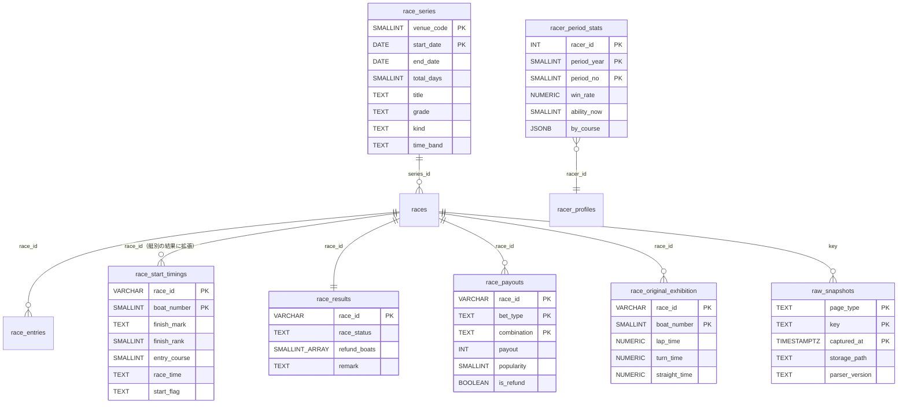

# 全データの最適な取得設計（取得単位・タイミング・保存）の提案

対応: [data-catalog.md](./data-catalog.md)（全項目の洗い出し・突合・価値評価。本書の入力）/ [plan.md](./plan.md)（承認済みの統合設計。予定表・共通ラッパ）/ [backfill-plan.md](./backfill-plan.md) / [job-inventory.md](./job-inventory.md) / [ADR-0057](../../adr/0057-odds-capture-frequency-and-full-grid-scope.md)・[ADR-0058](../../adr/0058-data-refresh-frequency-optimization-principle.md)・[ADR-0066](../../adr/0066-scraping-execution-consolidation-to-vercel.md)・[ADR-0067](../../adr/0067-official-site-content-redisplay-policy.md) / Linear [BOA-365](https://linear.app/boat-ai/issue/BOA-365)・[BOA-366](https://linear.app/boat-ai/issue/BOA-366)

> **この文書は提案であり、ユーザー未承認である。** 承認済みの[plan.md](./plan.md)を置き換えず、その上に追加・変更する項目を示す。既存文書は書き換えていない（修正案は[§5](#5-既存文書への修正提案)）。コード・マイグレーション・本番DBへの書き込みは含まない。§2.5のスキーマ・ER図は設計案で、DDLは承認後に別PRで作る。

ユーザー方針（2026-09-20）: 「全データの最適なスクレイピング設計・処理が揃ってから、バックフィルをするのが綺麗」。

## 0. 結論

1. **取得の単位は「ページ」とし、1回の取得でそのページの全項目を解析する。** 項目単位の追加取得（現状の同一ページの重複取得D1〜D4）を無くす。パーサーは副作用を持たない`parse(html) → 全項目の型付きオブジェクト`にし、定期取得とバックフィルで共有する。
2. **選手系（期別成績・能力指数・コース別成績・プロフィール）は、公式の期別成績ファイル（fan）で置き換える。** 1ファイル＝全選手・1半期で、2001年後期以降の履歴も取れる。1,627人分の選手別スクレイピング（B6、月1回、約1,630リクエスト/回、未実行）は不要になる。過去分の「直近1期のみ」の制約も解消する。**（[data-catalog.md §2.11](./data-catalog.md#211-期別成績ファイルfan)で、公式ページとの値の一致を実確認）**
3. **既存データに誤りがある。** 欠場艇が着順に入る（BOA-362の原因確定）、返還・不成立の`¥100`が払戻列に入る。新規取得より前に、結果取得のパーサーを「着欄・返還・備考を読む」形に直す必要がある（[data-catalog.md §5](./data-catalog.md#5-実測で判明した不整合データの正確性)）。
4. **生データは、「取り直すと同じ値にならないページ」だけ、Storageに圧縮して保管する**（beforeinfo・racelist・pcexpect・information。約1.6GB/年、DBには載せない）。取り直せるページ（結果・K/B/fan・節メタ）は保管しない（K/B/fanのファイルは、別セッションの方針どおり保管）。
5. **取得先への負荷は、現行の推定約12.0〜13.4千リクエスト/日から、約8.0千（全ホスト合計）へ、約3〜4割減る**（[§2.7](#27-取得先への負荷の総量見積り)。再試行の回数は未実測）。減らせる主因は、買い目オッズの重複取得（A4）、直前情報の重複取得。選手別スクレイピング（B6）は、実行すると月約1,630リクエストかかる想定だった分が、不要になる。
6. **バックフィルは、設計（パーサーの全項目化とスキーマ拡張）が揃った後、「ファイル系（fan・K/B・月間日程）」→「導出」→「ページ系（範囲を絞る）」の順**にする（[§4](#4-バックフィルへの示唆)）。重い項目（pcexpect・オッズ最終値・全期間のbeforeinfo）は、見送りを推奨する。

## 1. 位置づけ

| 項目 | 扱い |
|---|---|
| 承認済みで変えないもの | Vercel Functions + Vercel Cronへの一本化（ADR-0066）、予定表（`scrape_slots`・`scrape_job_state`）と共通ラッパ（plan.md）、完了の定義A/B/C、オッズの6窓×全通り（ADR-0057）、公式サイトの再表示方針（ADR-0067） |
| 本書が追加・変更を提案するもの | パーサーの全項目化、選手系の取得元（fan）、返還・不成立・着欄の扱い、節メタの取得元、生データの保管、スキーマ拡張、レジストリへのジョブ追加、A4（買い目オッズ）の廃止 |
| 別の子エージェントが検討中のもの（重複して作らない） | K/Bファイルのバックフィルのコマンドライン（CLI）と、生ファイル保存・全項目の中間JSON化。本書は、その項目の網羅性を確認するための項目リスト（[data-catalog.md §2.9・§2.10](./data-catalog.md#29-kファイル競走成績)）を提供する |

## 2. 設計原則の検討

### 2.1 取得単位: 1ページ1回・全項目解析

| 選択肢 | 内容 | 評価 |
|---|---|---|
| A. 項目単位（現状） | 必要な項目のためにジョブごとにページを取得 | racelistを2回、beforeinfoを3ジョブ（A1・A2・A8）、odds3t/odds3fを2ジョブ（A3・A4）が取得。項目を足すたびに取得が増える。**却下** |
| B. ページ単位・全項目解析（推奨） | 1回の取得で、そのページの全項目を型付きオブジェクトに解析し、書き込み側（writer）が必要な表へ射影する | 取得が増えない。項目の追加は解析の追加のみ。パーサーを取得から分離でき、定期取得・バックフィル・生データからの再解析が同じ関数を使う |

- **解析する範囲**: [data-catalog.md](./data-catalog.md)で「必須」「望ましい」と判定した項目、および解析の追加コストが極小で後から取り直せない項目。「不要（導出可）」（今節成績、単勝人気など）は解析しない（YAGNI）。
- **契約テスト**: ページ種別ごとに、fixture（実ページのHTML）から全項目が取れることをテストする。既存のfixture（racelist 5種、pointrank 3種、Kファイル3日分など）に、本調査で取得した実ページ（raceresult 2種、beforeinfo、resultlist等）を加える案（リポジトリにコミットするHTMLの範囲は、ADR-0067の再配布方針との関係でユーザー判断。[§3](#3-ユーザーが判断すべき点)Q7）。
- **構造変化の検知**: 「想定外の見出し・セル数・未知のclass」を`outcome='parse_anomaly'`として予定表に記録し、通知する（既存の構造監視A5・B3・B4を汎用化。完了の定義C）。今回のような「着欄を読まない」「返還を金額として読む」誤りは、契約テストと突合（[§2.8](#28-検証と監視)）で検出する。
- **実装の形**: 既存の`scripts/daily/*`のパーサー部分を、fs・DB書き込みを持たない純関数に切り出す（plan.md §2.1「取得ロジックは既存の`scripts/daily/*.js`を再利用する」と整合）。

### 2.2 生データの保管

「解析結果だけ保存し、HTMLは捨てる」（現状）では、パーサーの誤りや新しい項目の追加のたびに、公式サイトへ取り直す必要がある。**取り直せない（取り直すと別の値になる）ページ**では、これが取り返しのつかない損失になる。

**実測に基づく、ページごとの「取り直せるか」**（[data-catalog.md §1](./data-catalog.md#1-情報源の全体マップ)）:

| ページ | 過去日に同じ値が返るか | 生データの保管 |
|---|---|---|
| beforeinfo | 気象は**返らない**（当日の最終観測）[実:backfill-plan]。他の項目は返る | 保管する（展示確定直後の1点） |
| racelist | 直前変更（欠場・モーター交換）後の**最終版**を返す。60分前の版は復元できない | 保管する（60分前の1点） |
| information | 過去日は空を返した（3ページ）[実:backfill-plan] | 保管する（変化があった時点） |
| pcexpect | 公開当時の予想と一致するか**未確認** | 保管する（初回取得の1点） |
| raceresult・resultlist・K・B・fan・monthlyschedule・index | 返る（確定値） | ページは保管しない。K・B・fanは、ファイルが小さく、再解析の起点なので保管する |
| オッズ5ページ | 最終値のみ返る。窓ごとの値は復元できない | 保管しない（解析結果のjsonbが全通りを保持しており、HTMLに残る追加情報が無い[推]） |

| 選択肢 | 内容 | 容量（実測の圧縮サイズ: beforeinfo 9.1KB、raceresult 9.7KB、racelist 10.0KB、pcexpect 10.3KB、resultlist 11.0KB） | 評価 |
|---|---|---|---|
| A. 保管しない（現状） | 解析結果のみ | 0 | 取り直せないページの誤りを、後から直せない。**非推奨** |
| B. 取り直せないページのみStorageに保管（推奨） | 上表の「保管する」ページ | 1日約460オブジェクト×約9.5KB ≒ 4.4MB/日 ≒ **約1.6GB/年**（153レース/日の実測平均。本文領域のみに絞ると約1/3の見込み、未計測） | DBの容量・Disk IOに影響しない（Storageへの書き込み）。DBには台帳（下記）のみ |
| C. 全ページ・全スナップショットを保管 | オッズの窓ごとの5ページ等も | 1日約7,000ページ×約9KB ≒ 63MB/日 ≒ 約23GB/年 | 過剰。オッズの再解析に必要な情報が解析結果に残っている |

- **保管の形**: Storageの`raw/{page_type}/{YYYY-MM-DD}/{race_id または 会場コード}/{取得時刻}.html.gz`（非公開バケット）。DBに、台帳`raw_snapshots`（`page_type`・`key`・`captured_at`・`storage_path`・`bytes`・`sha256`・`parser_version`・`run`）を置く。台帳は、**取得時刻の記録を兼ねる**（完了の定義B。取得時刻列が無いテーブルでも窓内取得率を計測できる、というplan.md §3の予定表と同じ役割を補う）。行数は約460行/日（約170千行/年、約25MB/年）。
- **再解析**: 台帳から対象を選び、Storageから読み、`parse`を通して、同じwriterで書き込む（公式サイトへのアクセスは不要）。
- **ADR-0067との関係**: 保管は内部の解析用途に限り、再配布・公開しない。ただし、生のコンテンツの複製を保管することは、これまでの方針（取得した値の集計・加工結果の表示）より一歩踏み込む。本書は法的見解ではなく、リスク認識のうえでの現状維持というADR-0067の範囲に収まるかは、ユーザー判断（[§3](#3-ユーザーが判断すべき点)Q1）。

### 2.3 ページごとの取得窓と回数（ADR-0058の4つの問い）

4つの問い（変化頻度・許容される鮮度・可用性ウィンドウ・最小十分頻度）を、各ページに機械的に適用した。**現行**はjob-inventory §3・§5.3、**提案**は最小十分な回数。窓の数値は、公開時刻の実測（U7・U10等）で調整する。

| ページ | 変化頻度 | 許容される鮮度 | 可用性ウィンドウ | 提案（最小十分な取得） | 現行 |
|---|---|---|---|---|---|
| racelist | 前日に確定。当日は欠場・モーター交換で稀に変化 | 予測の入力は直前の値 | 過去日は最終版を返す（60分前の版は復元不可） | 朝1回（全レース、`races`初期化）＋発走60分前1回（予定表`race_info`）。**両方とも全項目解析**（F数・L数・体重・支部・締切時刻・ラベル・節日程・変更表示） | 朝1回（A8）＋60分前1回（A1）。項目は一部のみ |
| beforeinfo | 展示航走後に確定（展示タイム・ST・スタート展示・チルト等）。気象は時刻とともに変化 | 展示後は数分 | 展示公開前は空。気象は観測時点付きで、過去日は取れない | 展示スロット1本（`-33`〜`-7`分、公開まで120秒間隔で再試行）で、**気象を含む全項目**を取得。**朝のbeforeinfo（A8）と60分前のbeforeinfo（A1）は廃止** | 展示3〜9回＋A1 1.2回＋A8 1回。気象は展示取得時の値を捨てている（D2） |
| raceresult | 払戻は発走5分後、ST・決まり手は20分後以降で確定 | 数分〜十数分 | 過去日も取得可 | 予定表`result`（`+5`〜`+90`分、300秒間隔）。完了条件は「着欄・払戻・返還・備考・ST・決まり手が揃う」。**全項目解析** | 3〜6回。着欄・返還・備考を読まない |
| resultlist | 各レースの確定後に更新 | 日次でよい | 過去日も取得可 | 会場の最終レースの`+90`分後に1回（1リクエスト＝12レース）。DBと突合し、不一致のレースのみ再取得（[§2.8](#28-検証と監視)） | なし |
| オッズ5ページ | 発売中は随時変化 | 6窓（60/30/15/10/5/0分前）。ADR-0057 | 締切後は最終値のみ | **現行維持**（6窓×5ページ×全通り）。**A4（買い目オッズ）を廃止**し、`race_odds`の最新スナップショットからの導出にする（D1） | A3＋A4（同じ`odds3t`・`odds3f`を最大24ページ重複） |
| pcexpect | 公開後は不変の見込み[推:未確認] | 前日〜当日朝 | 過去日の値が当時の値か未確認 | 朝または前日に1回（チャンク処理）。PDF経由（会場×日1ファイルに12レース分の見込み）は未検証（U8） | 朝の一括（約27分） |
| information | 当日随時 | 数十分 | 過去日は空 | 15分間隔（ADR-0058の当初の判断）。**ただし0行の原因（N28）が確定するまで、現行の10分間隔を維持**し、原因確定後に見直す | 10分×開催会場（約1,300ページ/日） |
| raceindex・index | 節日程は前日以降に確定 | 日次 | 過去日も取得可 | indexは朝1回（開催会場・グレード・節名・時間帯）。raceindexは廃止し、締切時刻・節日程はracelist（毎レースで同日12レース分の時刻行と節日程タブを含む）から取る | raceindexの締切時刻のみ（連番割当、欠番でずれる構造） |
| monthlyschedule | 年間予定（確定後は不変） | 週次で十分 | 過去月も取得可 | 月1回（当月・翌月）。履歴はバックフィル | なし |
| rankingmotor | 節の初日前夜に確定（前検）。節内で2連対率が更新 | 節の初日の朝 | 過去日も取得可 | **会場×節1回**（初日の朝。約3リクエスト/日） | なし |
| pointrank | 節の各日の終了後 | 日次 | 過去日も取得可 | 現行維持（B2）。導出できる可能性は[§4](#4-バックフィルへの示唆) | B2 |
| K・Bファイル | Bは前日〜当日、Kは開催日の夜〜翌日に確定 | 日次 | 全期間取得可 | B: 朝1回（＋当日夕方に更新確認）。K: 翌朝1回。**直近4日を毎回確認する現行方式は廃止**し、予定表のスロット（日付単位）にする（D4）。ファイルは保管 | Kを直近4日毎回ダウンロード（2関数が別々。D4） |
| fan | 半期（4月・10月）に更新 | 半期 | 2001後期〜取得可 | 4月・10月の初旬に、成功まで1日1回試行（年2回成功＝年数リクエスト）。ファイルは保管 | なし（選手別のB6が未実行） |
| racersearch profile | 新人のみ | 数日 | — | racelistに、fanに未収録の新しい登録番号が出たときのみ（1選手1ページ） | 新人のみ（同じ） |
| stadium | 四半期 | 四半期 | 当時の値は不可 | 静的属性（水質・干満差ほか）を年1回、24ページ。集計値は取得しない（導出可） | なし |
| BOATCAST オリジナル展示 | 展示後に確定[推:公開時刻は未検証（U7）] | 発走前 | 過去日も取得可 | 予定表`original_exhibition`（展示と同じ窓＋発走後も再試行。403は「未公開または対象外の会場」として、対象外は期待件数から除外）。1レース1リクエスト。別ホスト | なし |
| BOATCAST `bc_mst` | モーター交換時 | 月次 | — | 月1回（24ファイル） | なし |
| 会場サイト（B3・B4） | 日次 | 日次 | 不可 | 現行維持（`git push`と`fs`依存の除去は既存の移行計画どおり） | B3・B4 |

- **`racelist`の60分前の再取得は、予定表の窓型スロット**（plan.md §3.6の`race_info`）として維持する。ただし取得するページはracelistのみで、気象は展示スロットに寄せる。
- **展示の窓**: plan.md §3.6の「展示は1本のスロットに畳む」案（`-33`〜`-7`分）を前提とする。展示の公開時刻の分布は未実測（U6）で、WS2の取得時刻列と予定表のログで実測し、外れる場合は現行の3窓に戻す（レジストリの変更のみ）。

### 2.4 重複項目の、正とする取得元

同じ項目が複数のページ・ファイルにある場合、**「どれを正とするか」を決める**。正でない取得元は、突合（検証）と履歴の補完にのみ使う。

| 項目 | 正 | 突合・補完 | 理由 |
|---|---|---|---|
| 展示タイム・展示ST・チルト・体重・部品・前走 | beforeinfo | Kファイル（展示タイム、履歴）、BOATCAST（重複、使わない） | 公式の一次ページ。当時値 |
| 展示進入（スタート展示のコース順） | beforeinfo（行順） | BOATCAST stt（同一） | 実ページで行順＝コース順を確認 |
| 発走前の気象 | beforeinfo（観測時点付き） | — | 観測時点があるのはbeforeinfoのみ（WS9） |
| 確定した気象（記録用） | raceresult（気温・水温を含む） | Kファイル（天候・風向・風速・波高。気温・水温は無い） | 結果ページが全項目 |
| 着順・払戻・決まり手・ST | raceresult | resultlist（日次の照合）、Kファイル（翌日以降の突合・履歴） | 全項目が揃う。K・resultlistは、突合に使う |
| **実進入コース** | **raceresultのスタート情報の行順**（当日）※ | Kファイル（翌日以降。**正**にするのは突合が一致した後） | 1レースで確認。一般化は検証が必要（[§6](#6-未確認事項と検証計画)V1）。検証が通れば、Kファイル同期（G10）を、突合専用にできる |
| 出走表の全国・当地・モーター・ボートの成績 | racelist（今期の累積） | Bファイル（勝率・2率、履歴） | 3連率はracelistのみ |
| 平均ST（前期）・F数以外の期別成績・能力指数 | fan | racersearch season（新人・検算） | 全選手を1ファイルで取得。値の一致を確認 |
| F数・L数（今期） | racelist | Kファイルの累積（履歴の導出） | fanの値は前期で、racelistの今期の値と異なる（実測） |
| プロフィール（生年月日・身長・体重・血液型・支部・出身地・性別・養成期） | fan | racersearch profile（fan未収録の新人） | 全項目・全選手 |
| コース別の進入率・入着率・平均ST（選手別） | fan（前期）、自社の結果（当期の累積） | 会場サイトのB4（10会場、会場別の直近12か月） | fanは全国の期別。B4は会場別。**役割が異なるため併存。ただしB4の価値は、自社の`race_results.actual_course`による導出（ADR-0064）で代替できる可能性があり、要再評価** |
| グレード・節名・種別・開催期間 | monthlyschedule（履歴）・index（当日） | racelist（グレードclass）、Kファイル・Bファイルの見出し | 節メタの一次情報 |
| 締切予定時刻 | racelist（毎レースの取得で更新） | Bファイル（履歴） | 日中の変更に追従できる |
| 前検タイム・節のモーター/ボート2連対率 | rankingmotor | — | 公式の一次ページ |
| オリジナル展示 | BOATCAST | — | 他に無い |
| 払戻（履歴）・人気 | Kファイル | raceresult | 履歴の一括取得 |

### 2.5 スキーマ

選択肢を比較する。

| 選択肢 | 内容 | 評価 |
|---|---|---|
| A. 既存テーブルへの列追加のみ | 新項目を`race_entries`・`race_results`等に列として足す | 変更が小さい。ただし、艇別の着欄・払戻の複数口（同着）・返還は、既存の「着順の位置に艇番を入れる（`rank1〜6`）」「払戻を1行に1列ずつ」という構造に収まらない |
| B. 縦持ちの汎用表（EAV: 項目名と値の行） | `(key, item, value)`で全項目を格納 | 追加はDDL不要。ただし行数が項目数（数十）倍になり、BOA-271が必要とする特徴量の行列（レース×艇×数十項目）の取得が重くなる。Disk IO予算（WAL・更新の回転量）に不利。**却下**（項目の構成が会場で異なるオリジナル展示も、4キー（一周・半周・まわり足・直線）の固定列で足りる） |
| C. 生データ層＋整形層の2層 | 生データはStorage（[§2.2](#22-生データの保管)）、整形層は既存の型付きテーブルを拡張＋艇別・払戻明細・節を新設 | 推奨。DBは型付きの整形層のみで、生データはDBに持たない |

**推奨: C（段階導入）**。既存の列は残し、新しい表・列を足す。読み手の移行が済むまで二重に持つ（並走）。

**追加・拡張の案**（DDLは承認後）:

| 対象 | 追加内容 | 解消する項目 |
|---|---|---|
| `race_start_timings`（艇別の表。実質「艇別の結果」に拡張） | `finish_mark`（着欄の生表記: 1〜6/F/L0/L1/K0/K1/S0〜S2/欠/失/転/落/沈/妨 等）、`finish_rank`（完走艇のみ）、`entry_course`（スタート情報の行順）、`race_time`、`start_flag`（F/L） | N1・N4・N5・N6・E1・E4。`rank1〜6`・`course_1〜6`・`actual_course_1〜6`・`race_time_1〜6`・`is_late_start`は、読み手の移行後に廃止 |
| `race_results` | `race_status`（通常・一部返還・不成立・中止）、`refund_boats`（返還艇の枠番の配列）、`remark`（備考） | N2・E2・E3。`is_cancelled`・`is_no_race`は廃止 |
| `race_payouts`（新規、払戻明細） | `race_id`・`bet_type`・`combination`・`payout`・`popularity`・`seq`（同着の複数口）・`is_refund` | N2・N3。返還・不成立の`¥100`を払戻として扱わない。`payout_*`・`popularity_*`の15列を、読み手の移行後に廃止（3連単・3連複の列名の逆転E6も解消） |
| `exhibition_data` | `exhibition_course`（展示進入）、`start_flag`（F/L）、`propeller_new`（プロペラ新） | N9・N10 |
| `race_original_exhibition`（新規） | `race_id`・`boat_number`・`lap_time`・`half_lap_time`・`turn_time`・`straight_time`・`measure_status`・`fetched_at` | N25。会場により項目が異なるため、該当しない項目はNULL |
| `race_entries` | `weight_kg`・`branch`・`f_count`・`l_count`・`motor_changed`・`boat_changed` | N13・N14・N18。既存の`created_at`・`updated_at`（WS2）と併用 |
| `race_series`（新規、節） | `venue_code`・`start_date`（主キー）・`end_date`・`total_days`・`title`・`grade`・`kind`（一般/女子/ルーキー/マスターズ等）・`time_band`（モーニング/サマータイム/ナイター/ミッドナイト）・`source` | N16。`races.series_id`で参照。`race_grade`の欠落（2025-12・2026-01）・`series_day`の履歴の穴を解消 |
| `racer_period_stats`（新規、選手×期） | `racer_id`・`period_year`・`period_no`（主キー）・算出期間・級・前期/前々期/前々々期の級・勝率・2連対率・出走回数・1/2着回数・優出・優勝・平均ST・前期/今期の能力指数・`by_course`（jsonb、6コース分の進入回数・複勝率・平均ST・平均スタート順位・1〜6着回数・F/L0/L1/K0/K1/S0〜S2回数） | N21。as-of結合（レース日から該当期を引く）用。1選手1期1行（約1,650行/期）。15期（2019〜）で約25千行 |
| `racer_profiles` | `sex`・`training_term`（養成期）を追加。全列をfanで更新 | N22 |
| `motor_pretest`（新規） | `venue_code`・`series_start`・`racer_id`・`motor_number`・`motor_2rate`・`boat_number`・`boat_2rate`・`pretest_time`・`pretest_rank` | N23 |
| `motor_generations`（新規、または`venues`の拡張） | `venue_code`・`start_date`（`bc_mst`由来） | N26 |
| `raw_snapshots`（新規、台帳） | [§2.2](#22-生データの保管) | 取得時刻の記録・再解析 |

本番データの修正（返還・不成立の既存レースの`¥100`をNULLにする、欠場艇の着順を直す）は、DDLとは別に、本番DBの書き込みになる。**ユーザー承認と、修正前後の件数の実測**が要る（[§3](#3-ユーザーが判断すべき点)Q6）。

### 2.6 Vercel Cron・予定表との整合

plan.md §2.3（Cron一覧）・§3.6（ジョブ定義）への追加・変更案。cron式はUTC、JSTを併記する。

| ジョブ | 種別・窓 | 完了条件 | 変更点 |
|---|---|---|---|
| `race_info`（A1） | 窓型 `-60`分（許容3分） | `race_entries`・`race_conditions`・`races.start_time`が書け、racelistを保管 | **取得ページをracelistのみに**（beforeinfoを廃止）。F数・L数・体重・支部・ラベル・節日程・変更表示を解析 |
| `exhibition`（A2） | 窓型 `-33`〜`-7`分 | 展示タイム非NULLが揃う。**気象・スタート展示の進入・F/L・チルト等の全項目を書く**。beforeinfoを保管 | 気象を採用（D2）。取得成功後に予測リフレッシュ（案1）。**`race_info`から気象取得を外す** |
| `original_exhibition`（新規） | 窓型 `-33`〜`+90`分 | BOATCASTの`bc_oriten`が取得できた、または対象外会場（江戸川）と判定 | 期待件数から対象外を除外。403は再試行し、許容幅を超えたら`expired` |
| `result`（A6） | 窓型 `+5`〜`+90`分 | 着欄・払戻・返還・備考・ST・決まり手が揃う | **着欄・返還・備考・スタート情報の行順を読む**。`race_payouts`・艇別の結果に書く |
| `result_reconcile`（新規） | 日次型 会場の最終レース+90分 | resultlistとDBが一致（不一致は該当レースを再取得） | 1リクエスト＝12レース |
| `odds`（A3） | 窓型 6窓 | 現行どおり | 変更なし |
| ~~`prediction-odds`（A4）~~ | 廃止 | — | `race_odds`の最新スナップショットから導出（D1）。**表示の鮮度要件（現行5分ごと）の確認が要る** |
| `pcexpect`（B1） | 現行案どおり | — | 変更なし（PDFは未検証） |
| `series_meta`（新規） | 日次（朝）＋月次 | index・monthlyscheduleから`race_series`を更新 | `races-init`の中で、節の属性を書く |
| `motor_pretest`（新規） | 節の初日の朝 | rankingmotorが取得できた | 会場×節1回 |
| `bfile_sync`・`kfile_sync`（新規、plan.mdの`kfile-sync`を拡張） | 日次（B: 朝＋夕、K: 翌朝） | ファイルを保管し、解析（全項目）して、突合 | D4を解消。`raceresult`由来の値との突合結果を記録 |
| `racer_period`（新規） | 半期（4月・10月の初旬に、成功まで日次で試行） | fanを保管し、解析して`racer_period_stats`・`racer_profiles`に書く | **B6（`racer-profiles`、月次）を置き換える** |
| `racer_profile_new`（B6の縮小版） | 随時（未登録の登録番号が出たとき） | profileページから登録 | 新人のみ |
| `stadium_static`・`bc_motor_start` | 年次・月次 | — | 極小 |

plan.md §2.3のCron登録数は25本。本案で、新規を約6本追加し、廃止（A4、B6の月次）を差し引いて、**約30本**（上限100）。共通ラッパ（認証・排他・冪等・0件エラー・バックオフ・サーキットブレーカー（BOA-368））の要件は変えない。

### 2.7 取得先への負荷の総量見積り

ADR-0067が、新しい取得・頻度の引き上げに「負荷の見積り」を求めるため、現行と提案を比べる。前提: **1日153レース**（`races`44,676件÷292日の実測平均）、開催約12.75会場/日。「現行」はjob-inventory §5.4・§3の推定（実測ではない）。「提案」は本書の設計による推定で、**再試行の回数は未実測**（U6・U7）。

| ページ・取得 | 現行（リクエスト/日） | 提案（リクエスト/日） | 備考 |
|---|---|---|---|
| racelist | 約340（朝153＋60分前約184） | 306 | 朝1＋60分前1（各153） |
| beforeinfo | 約800〜1,700（展示3〜9回＋60分前1.2回＋朝1回、各レース） | 約612（展示約4回/レース） | 気象を含む全項目を展示スロットの1回で取得。朝・60分前を廃止 |
| オッズ5ページ（A3） | 約5,050（約33ページ/レース） | 約4,590（30ページ/レース） | 窓を維持。窓ごとの1回成功を基本とする |
| 買い目オッズ（A4） | 最大約3,670（最大24ページ/レース） | 0 | 廃止（導出） |
| raceresult | 約460〜920（3〜6回） | 約540（約3.5回） | 再試行の間隔を300秒に |
| pcexpect | 153 | 153 | 現行どおり |
| information | 約1,330（10分×開催会場） | 約1,330（0行の原因確定後に約890） | 10分→15分は、原因確定後に見直す |
| resultlist・pay（照合） | 0 | 約14 | 新規 |
| index・monthlyschedule・rankingmotor・pointrank | 約5（pointrank） | 約10 | 節メタ・前検 |
| racersearch season・profile | 0（B6は未実行。実行すると月約1,630） | 約0（新人のみ） | fan（年2ファイル）で置き換え |
| Kファイル・Bファイル（mbrace.or.jp） | 約8（K: 直近4日×2関数） | 2 | 別ホスト |
| BOATCAST | 0 | 約310（オリジナル展示約2回/レース）＋約1 | 別ホスト（同じ運営） |
| 会場サイト（B3・B4） | 約170 | 約170 | 現行どおり |
| **合計** | **約12.0〜13.4千** | **約8.0千**（boatrace.jpのみ約7.6千） | **約3〜4割減** |

- 提案のうち最大の項目はオッズ（約65%）。ADR-0057の窓と全通り捕捉は、ユーザー判断済みのため変更しない。さらに減らす場合の選択肢（`60`・`30`分前の窓では3連単のみ等）は、ADR-0057の再検討になる（提案しない）。
- 1日あたりの合計に加え、**ピーク**（日中の同時刻に窓が集中する）は、plan.mdの並列度上限とサーキットブレーカー（BOA-368）で制御する。

### 2.8 検証と監視

パーサーの誤りを、完了の定義Aの充足率では検出できない（行は存在し、値が入っている。[data-catalog.md §5](./data-catalog.md#5-実測で判明した不整合データの正確性)）。**値の正しさを、独立した情報源との突合で継続的に検証する。**

| 突合 | 内容 | 頻度・費用 |
|---|---|---|
| resultlist ↔ DB | 会場×日の12レースの着順・決まり手・3連単/2連単の払戻・返還の有無 | 1会場日=1リクエスト |
| Kファイル ↔ DB | 着順・進入・ST・払戻・展示タイム・気象（レース見出し） | 1日1ファイル。**スタート情報の行順＝進入順の全レースでの検証**（[§6](#6-未確認事項と検証計画)V1）を兼ねる |
| 契約テスト（fixture） | 実ページのHTMLから全項目が取れる | CI（ローカルで実行） |
| `parse_anomaly` | 想定外の見出し・セル数・未知のclass | 取得のたびに記録し、閾値超過でSlack |
| `raw_snapshots` の欠落 | 保管対象のページで、台帳の行が無いレース | 日次（完了の定義C） |

## 3. ユーザーが判断すべき点

| # | 判断 | 選択肢 | 推奨 | 根拠・注意 |
|---|---|---|---|---|
| Q1 | 生データの保管 | (a)しない (b)取り直せないページのみStorage（約1.6GB/年） (c)全部（約23GB/年） | **(b)** | 取り直せないページの誤りを後から直せる。DBに影響しない。ADR-0067の範囲内かは、ユーザー判断（内部保管・非公開・再配布なし） |
| Q2 | 選手系の取得元 | (a)選手別スクレイピング（B6）を実行 (b)**fanに置き換え** | **(b)** | 過去期・全選手・全項目を1ファイルで取得。B6は1,627人分（月約1,630リクエスト）で、直近1期のみ。値の一致は実確認済み |
| Q3 | スキーマ | (a)既存列の拡張のみ (b)縦持ち汎用 (c)**艇別・払戻明細・節の新設＋既存列の拡張（生データはStorage）** | **(c)** | 着欄・返還・同着は既存構造に収まらない。EAVは行数・IOで不利 |
| Q4 | 返還・不成立・欠場の扱い | (a)現状 (b)**`race_status`・`refund_boats`・`finish_mark`を持ち、払戻の`¥100`を払戻として扱わない** | **(b)** | 実測で、45レース（F発生438中）の払戻が汚れている。回収率・期待値・BOA-271の母数に影響 |
| Q5 | 3連率・F数・L数の過去分 | (a)racelistを約8,700回取得（backfill-plan）(b)**Kファイルの累積から導出し、サンプルで検証** | **(b)**、検証で不一致なら(a) | 公式アクセスを増やさない。定義（今期累積か等）の一致は、Bファイルの2連率との突合で検証できる（[§6](#6-未確認事項と検証計画)V2） |
| Q6 | 既存データの修正 | (a)しない (b)**返還・不成立の`¥100`と、欠場艇の着順を、修正する** | **(b)（別途、件数を提示して承認）** | 本番DBの書き込み。修正前後の実測が要る |
| Q7 | 契約テスト用の実ページHTMLのコミット | (a)しない（合成データのみ）(b)最小限を、fixtureとして（既に実ページ由来のfixtureがある） | (b)（既存の運用どおり） | ADR-0067の再配布方針との関係は、ユーザー判断 |
| Q8 | 買い目オッズ（A4）の廃止 | (a)維持 (b)**`race_odds`からの導出** | **(b)** | job-inventoryのD1（重複）の解消で、最大約3,670リクエスト/日を削減。表示の鮮度要件（5分ごと）を確認してから |
| Q9 | バックフィルの重い項目（[§4](#4-バックフィルへの示唆)） | pcexpect（約27,200）、オッズ最終値、全期間のbeforeinfo（約44,700〜約41万）、raceresultの気温・水温（約44,700） | **見送り（または後回し）を推奨**。ユーザー未確認（orchestration.md PR #731の記述と同じ論点） | BOA-271に不要または効果が未確認 |
| Q10 | 日次照合ページの利用 | resultlist・pay | resultlistは採用、payは日付指定の確認後 | 監視の質。1リクエストで足りる |

## 4. バックフィルへの示唆

### 4.1 前提

- ユーザー決定（2026-09-20、[orchestration.md](./orchestration.md)の決定事項。PR #731）: バックフィルの範囲は**取得できる最古（2019-04頃を目標）から現在まで**のK/Bファイル。IP制限を避けるため、逐次・ジッター付き間隔・サーキットブレーカー・日次上限・夜間で、慎重かつ効率よく。K/Bのバックフィルのコマンドラインと保存設計は、別の子エージェントが検討中。
- [backfill-plan.md](./backfill-plan.md)の「2025-12より前は補填しない」は、この決定で置き換わった。本書は、それ以外のデータセットについて、**設計が揃った後の順序と深さ**を示す。
- **「設計が揃ってから」の意味**: (1)パーサーの全項目化（[§2.1](#21-取得単位-1ページ1回全項目解析)）、(2)スキーマの拡張（[§2.5](#25-スキーマ)）、(3)返還・着欄の扱いの決定（Q4）、が済んでから実行する。同じパーサー・同じwriterを使い、バックフィル専用の別実装を作らない。過去の生データは、K/B/fanのファイルを保管しておけば、パーサーの修正後に再解析できる。

### 4.2 データセット別の順序と深さ

リクエスト数は、`races`が2025-12-03〜（44,676レース、292日）、2019-04〜は約2,730日×約153レース≒約41万レースと推定（過去の1日あたりレース数は未確認）。2,500リクエスト/日（backfill-plan §5.3）で換算した日数を併記する。

| 順序 | データセット | 取得元 | 深さ | リクエスト | 日数 | 判断 |
|---|---|---|---|---|---|---|
| 1 | 選手の期別成績・能力指数・コース別・プロフィール | fan | 2019前期〜（全期は2001後期〜の約50ファイル） | 15（全期約50） | 1日 | **実施**（backfill-planの「直近1期のみ」が解消する） |
| 2 | 節メタ（グレード・節名・種別・開催期間・時間帯） | monthlyschedule（月次）、Kファイル・Bファイルの見出し | 2019-04〜 | 約90（月1） | 1日 | **実施**（`race_grade`欠落の解消。日付の解析は要検証U12。backfill-planの「race/index 88回」を置き換え） |
| 3 | 結果・払戻・人気・ST・着欄・展示タイム・進入・気象4項目・節日数・体重・支部・級・勝率・2率・モーター/ボートNo・2率・今節成績・締切時刻 | K・Bファイル | 2019-04〜（別エージェントが設計中） | 約5,400（K・B各約2,700） | 別途 | **実施**（バックフィルの背骨。本書の項目リスト[data-catalog.md §2.9・§2.10](./data-catalog.md#29-kファイル競走成績)との網羅性を確認） |
| 4 | 3連率・F数・L数・平均ST・今節成績（as-of） | **導出**（Kファイルの累積、fanの前期値） | 3と同じ | 0（検証に約100） | — | **実施（検証つき）**。racelist約8,700回を不要にする。導出が公式値と一致しなければ、racelistの取得に切り替える（[§6](#6-未確認事項と検証計画)V2） |
| 5 | 前検タイム・節のモーター/ボート2連対率 | rankingmotor（会場×節1回） | 2025-12〜 | 約830 | 1日 | 実施（安価で、機力の新規シグナル）。2019〜は約7,600 |
| 6 | オリジナル展示 | BOATCAST | 2025-12〜（決定済み）。遡及限度の特定に二分探索約12回 | 約44,700 | 約18夜 | 実施（決定済み）。2025-12より前は、限度を特定してからBOA-271の必要性で判断 |
| 7 | チルト・体重・部品・調整重量・前走・展示進入 | beforeinfo（過去日、気象を除く） | 2025-12〜 | 約44,700 | 約18夜 | **後回し**。効果は、2026-09-10以降の実データ（約7千行）でBOA-271の寄与度を先に測ってから判断。2019〜の約41万は見送り |
| 8 | 気温・水温 | raceresult（過去日） | 2025-12〜 | 約44,700 | 約18夜 | **後回し**（Kファイルに無い項目。効果は未計測） |
| 9 | 公式コンピュータ予想 | pcexpect | — | 約27,200（2025-12〜） | 約11日 | **見送りを推奨**（BOA-271に不要というデータサイエンス評価。公開当時の値か未確認） |
| 10 | オッズの時系列・最終値 | — | — | — | — | **見送り**（窓は復元不可。最終値は、払戻・人気で足りる） |
| 11 | 特記事項 | — | — | — | — | 見送り（過去日は空の見込み。0行の原因確定が先、N28） |
| 12 | 得点率 | — | — | — | — | **導出を検討**（自社の結果から。減点の扱いは要検証）。pointrankの節ごとの最終日（約40〜60回）は、導出の検証用 |
| 13 | 日次照合・resultlist | — | — | — | — | バックフィルには使わない（Kファイルで足りる） |

- **導出できる項目を、取得しない**ことが、取得先への負荷を最も減らす（4・12）。3連率・F数・平均STの導出は、K/Bのバックフィルが済んだ後にしかできない（順序3→4）。
- **BOA-271の母数**（2019-04〜）は、順序1〜4で満たせる。5〜8は、機力・直前情報のテーマの説明力を上げるが、母数を決める項目ではない。

### 4.3 backfill-plan.mdの更新案

| 項目 | 現在の記述 | 更新案 |
|---|---|---|
| §1.1 範囲 | 2025-12より前は補填しない | 2026-09-20の決定で、K/Bは2019-04〜（orchestration.md PR #731）。本書の順序3以外（5〜8）は2025-12〜を基本とする |
| §3.1 #14 選手期別成績 | 条件付き（直近1期のみ） | **可**（fanファイルで全期。2001後期〜）。season取得（1,627リクエスト）を廃止 |
| §3.1 #6 グレード | race/indexを88回 | monthlyscheduleを約90回（2019-04〜）、または節の見出し（Kファイル）から |
| §3.1 #7 出走表の3連率 | racelistを約8,692回 | Kファイルの累積から導出し、サンプルで検証（Q5） |
| §3.2 合計 | 約71,300リクエスト（必須に近いもの） | 順序1〜4は約5,500、5〜6は約45,500。7〜9は判断（Q9） |
| §5.6 完了の定義B | 対象外 | 変更なし |

## 5. 既存文書への修正提案

既存文書は書き換えていない。承認後の修正案。

| 文書 | 修正案 |
|---|---|
| [job-inventory.md](./job-inventory.md) | G7（F数・L数・平均ST）: 公式ページに実在すると確認。G8（スタート展示の進入順）: 実在を確認（行順）。G9（返還・不成立）: 実在を確認し、現状は`¥100`を払戻として保存していると判明（[data-catalog.md §5](./data-catalog.md#5-実測で判明した不整合データの正確性)E2）。G10（当日の実進入）: raceresultのスタート情報の行順で取れる見込み（検証V1）。G11（FR-6）: 前検ランキングはrankingmotorで代替できる。D6（`course_1〜6`）: 原因を特定（行順を進入順として読まず、艇番として読んでいた）。新たな重複の追記: pcexpectと出走表の重複（racelistで取得済み） |
| [plan.md](./plan.md) | §2.3・§3.6のCron・ジョブ定義に、[§2.6](#26-vercel-cron予定表との整合)の追加・変更を反映。§3.3のスキーマに、[§2.5](#25-スキーマ)を追加。§11に、Q1・Q2・Q3・Q4・Q8を追加 |
| [backfill-plan.md](./backfill-plan.md) | [§4.3](#43-backfill-planmdの更新案)のとおり |
| ADR | 新規ADR（候補）: 「パーサーの全項目化と生データの保管」「選手系のfan化」。ADR-0057は、plan.mdの予定表への更新（承認済み）と、展示の窓の意味論に併せて更新（既存の更新予定） |
| [data-acquisition.md](../../../.claude/rules/data-acquisition.md) | tasks.mdのテンプレートに「ページの全項目を解析し、契約テストで検証した」行を追加 |
| Linear | BOA-365の項目を、[data-catalog.md §3](./data-catalog.md#3-未取得未保存低充足の項目一覧価値評価つき)のN1〜N31に沿って分割起票（優先度: N1・N2・N4・N9・N13・N16・N21・N28が必須）。BOA-362の原因を追記。BOA-281のオリジナル展示を、`race_original_exhibition`の設計に接続 |

## 6. 未確認事項と検証計画

[data-catalog.md §6](./data-catalog.md#6-未確認事項)のU1〜U12に加え、設計の前提として検証が必要なもの。

| # | 内容 | 方法・費用 |
|---|---|---|
| V1 | スタート情報の行順＝進入順が、全レースで成り立つか（本調査は戸田9Rの1レースのみ） | 過去日のraceresultを約200レース取得し、Kファイルの`actual_course`と突合（約200リクエスト）。**成り立てば、当日の実進入が取れ、Kファイル同期（G10）は突合専用にできる**。BOA-257の修正の前提 |
| V2 | Kファイルの累積から、racelistの3連率・F数・L数を導出できるか | Bファイルの勝率・2率（今期累積）を、Kファイルの累積から再計算して一致を確認（追加の公式アクセスなし）。3連率・F数は、racelistのサンプル約100レースと突合（約100リクエスト） |
| V3 | 返還・不成立・特払いの表記の全種と、備考の文言 | 該当レース（DBで45レース）から約20レースのraceresultを取得 |
| V4 | 展示・オリジナル展示の公開時刻の分布 | WS2の取得時刻列と予定表のログで実測（土日を含む7日） |
| V5 | fanの公開時期（4月・10月の何日）と、2604の1,643件と`racer_profiles`1,628件の差 | 次回の公開時に確認。差分の選手は、profileページで補完 |
| V6 | 出走表PDF・コンピューター予想PDFの内容（pcexpectを1ファイルで取れるか） | PDFを1件取得 |
| V7 | odds_win_6の欠落（N31）、`information`の0行（N28）の原因 | 既存データの調査（DBとHTMLの突合） |
| V8 | 生データ保管の容量（本文領域のみの圧縮サイズ） | 数ページで計測 |

## 7. Geminiの設計案の吟味

`docs/proposal/gemini-scraping-design.md`（リポジトリ未コミット。メインチェックアウトのファイルを参照。2026-09-19、[ADR-0067](../../adr/0067-official-site-content-redisplay-policy.md)で言及）を、実測・既存の実装と照合した。

| Geminiの主張 | 照合 | 採否 |
|---|---|---|
| 公式APIが無く、HTMLスクレイピングが実質唯一の解決策 | 概ね正しいが、**公式のダウンロード（K・B・fan）が主力になる**。特にfan（期別成績）は言及が無い | 部分採用。K・B・fanを主力にする |
| LZH（K/B）は、区切りが無く、氏名の切り詰め・3桁の番号で列が結合し、パースが困難 | Kファイルは既に`kfileParser.js`で解析でき、実ファイルで欠場・F・S0/S1/S2の行も規則的（[F]）。氏名は登録番号で結合すれば不要（Bファイルの氏名は全角4字固定）。3桁の結合は、実ファイルでは未再現（モーター・ボート番号は2桁が多く、未確認） | 採用しない（K/Bを避けない）。氏名は使わず登番で結合 |
| Kの払戻が999.9倍で丸められる | Kファイルの払戻は円単位（例: 3連単29,050円、[実:backfill-plan]）。999.9倍の丸めは、オッズ画面の表示上の制約と推測される（未検証）。払戻（円）を正とすれば、影響を受けない | 払戻（円）を正とする |
| pyjpboatrace等のOSSを使う | 既存の自前パーサーがあり、PythonはVercel（Node）と不整合 | 不採用 |
| 失敗時はSelenium/Playwrightへフォールバック（ボット対策） | 本調査の42回は、素の`fetch`（UA `BoatraceAIBot/1.0`）で、boatrace.jp・mbrace.or.jp・BOATCASTとも200（429・503は0回）。ヘッドレスは不要で、Vercelに重い | 不採用。ブロックの検知（403・CAPTCHA・想定外のHTML）の通知は、BOA-368で採用 |
| エクスポネンシャル・バックオフとジョブキュー（Celery） | 予定表の「期限＋許容幅＋再試行」（plan.md）で同等以上。Celeryは不要 | 概念のみ採用（既にplan.mdに含まれる） |
| オリジナル展示は、23会場の個別ドメイン・個別パーサーが必要 | BOATCASTで全会場が同一形式（[BOA-281調査](../../issues/boatcast-original-exhibition-investigation.md)） | 不採用（個別パーサー不要） |
| サーキットブレーカー・ランダムな遅延・並列を避ける | ADR-0067・BOA-368で採用済み | 採用済み |
| 過去5〜7年分をバルク収集し、以降はローリング。古すぎるデータはコンセプトドリフトで有害 | 保存と学習期間は別。保存は全期間（2019-04〜、ユーザー決定）とし、モデルは期間を切って使う | 保存は全期間、学習は期間を切る |
| 着順異常フラグ・特払い・同着（1対多の払戻）のスキーマ要件 | **実測で裏付け**（欠場艇が着順に入る、`¥100`が払戻に入る。[data-catalog.md §5](./data-catalog.md#5-実測で判明した不整合データの正確性)） | 採用（`finish_mark`・`race_payouts`） |
| 直前情報は締切15分前から、オリジナル展示は12分前から | 実効窓は、展示が発走30分前ごろと7〜18分前（job-inventory §5.3）。公開時刻は未実測 | 採用しない。予定表の窓で実測して調整 |
| 時系列オッズは30/15/5分前 | 現行は6窓（ADR-0057）で、より細かい | 不採用（現行が上回る） |
| 情報解析（著作権法30条の4）で適法、再配布は不可 | ADR-0067の判断（一般論で、専門家の確認は無い）。生データの保管は、内部・非公開に限る | D1で、ユーザー判断 |
