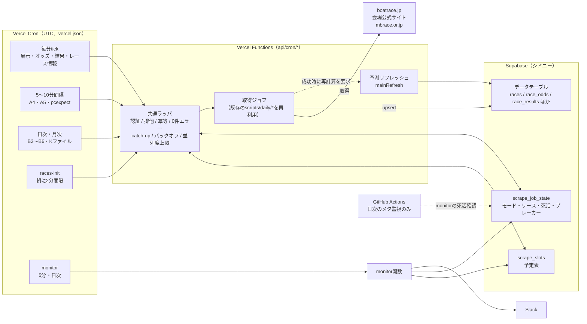
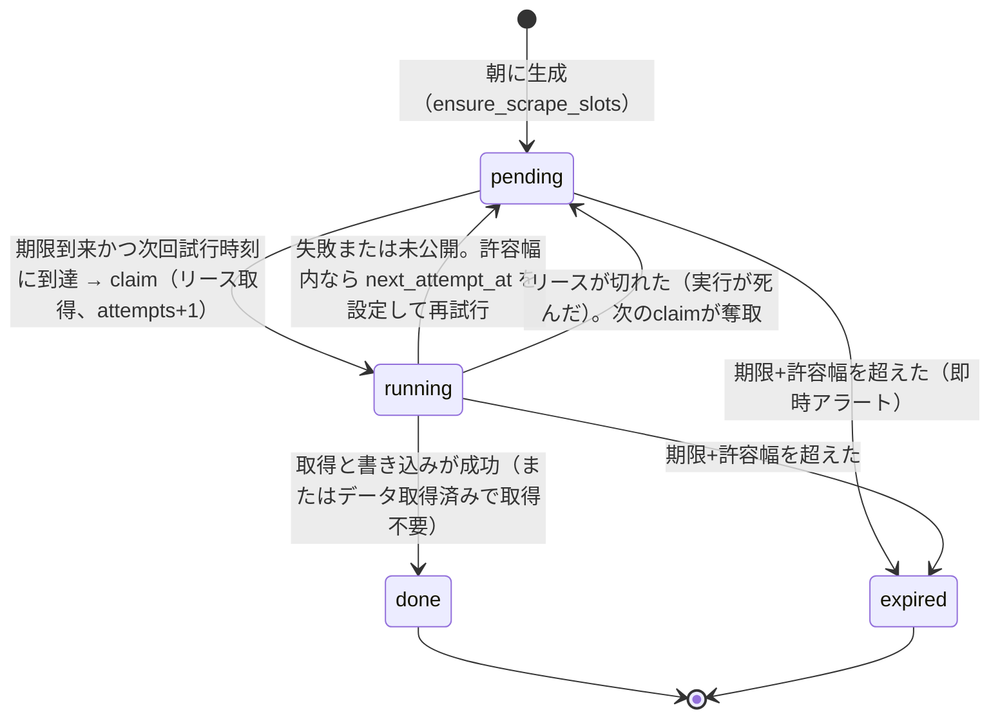
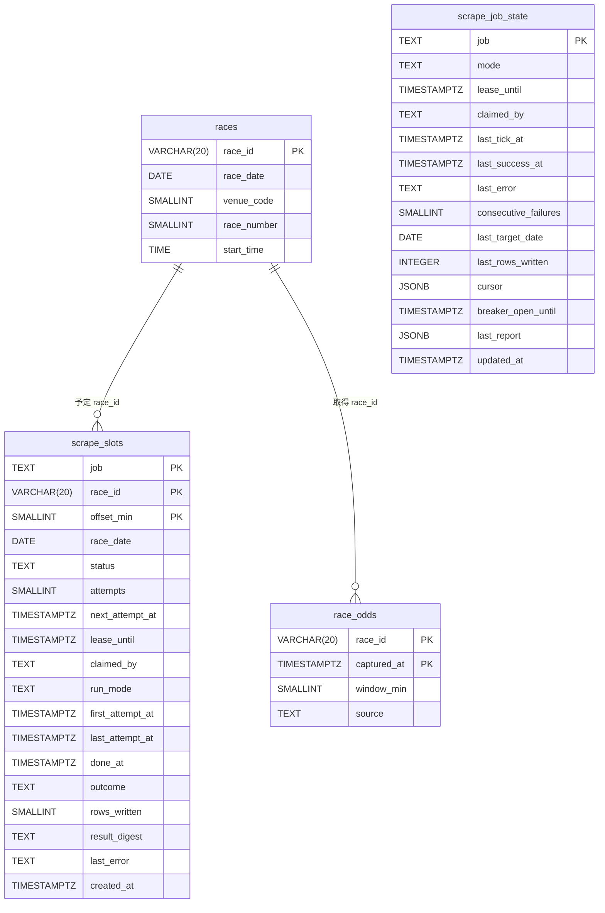
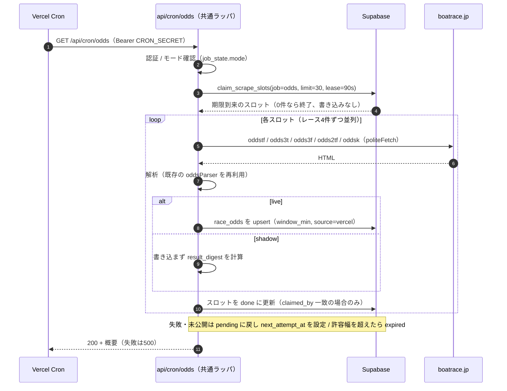
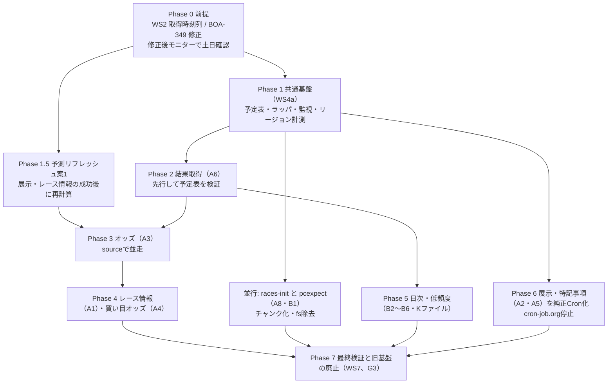
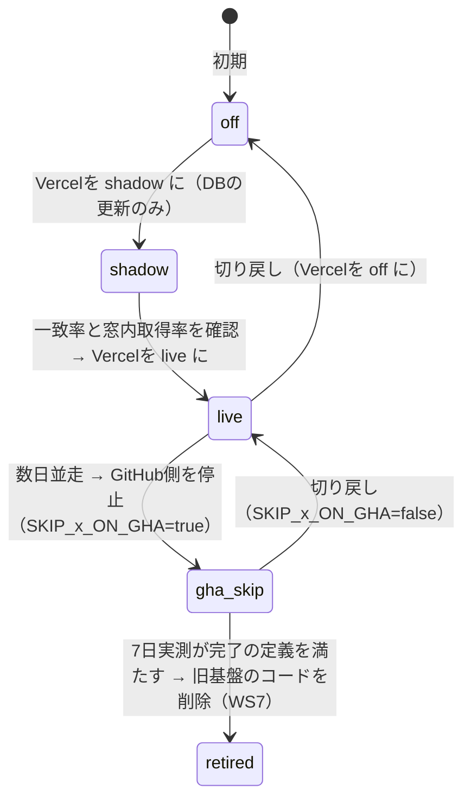

# データ取得基盤のVercel一本化 統合設計 plan（ドラフト）

> **この文書は、ユーザー未承認のドラフトである。** 親（オーケストレーター）の推奨案に基づく提案であり、決定事項ではない。[§11 要判断](#11-要判断ユーザー未承認)の4点（予定表テーブル・起動元・予測リフレッシュのきっかけ・着手順）は、いずれも推奨案で記述している。ユーザーが承認・修正した後に、正式な設計（plan.md・tasks.md）として確定し、G1（統合specの承認）とする。承認までは、コード・マイグレーション・ワークフローの変更に着手しない。
>
> 本文書はコードもマイグレーションも含まない。§3のスキーマ・ER図は設計案であり、DDLは承認後に別PRで作る（ER図は、DDL作成後に`node scripts/maintenance/generate-er-diagram.js scraping-vercel-consolidation`で再生成して置き換える）。

対応: [ADR-0066](../../adr/0066-scraping-execution-consolidation-to-vercel.md) / [完了の定義](../../../.claude/rules/data-acquisition.md) / 体制の正本 [orchestration.md](./orchestration.md) / 全ジョブの一覧 [job-inventory.md](./job-inventory.md) / タスク分解 [tasks.md](./tasks.md) / Linear [BOA-353](https://linear.app/boat-ai/issue/BOA-353)（索引）

## 0. 目的と範囲

**目的**: 全データ取得を、Vercel Functions + Vercel Cronの1基盤に集約し、全データセットが完了の定義のA（件数）・B（取得タイミング）・C（継続監視）を、本番DBの実測で満たす状態にする（[ADR-0066](../../adr/0066-scraping-execution-consolidation-to-vercel.md)）。

**範囲**（[job-inventory.md](./job-inventory.md)の取得系14ジョブ）:

| 区分 | ジョブ |
|---|---|
| 窓型（レース進行に連動。予定表方式の対象） | A1 レース情報更新、A2 展示、A3 オッズ、A6 結果取得 |
| 連続実行（窓なし、レース前の一定期間に繰り返す） | A4 買い目オッズ、A5 特記事項 |
| 派生 | A7 予測リフレッシュ |
| 前提（`races`の初期化） | A8 朝の初期化（`morning-init`）、B1 公式コンピュータ予想（A8の中で実行されている） |
| 日次・低頻度 | B2 得点率、B3 会場別モーター成績、B4 進入コース別選手成績、B5 選手ニュース、B6 選手プロフィール・期別成績 |
| 補助（A6の内部処理を、独立ジョブとして切り出す） | Kファイル同期（進入コース・rank4〜6）、結果の当日夜の再取得（catch-up） |

**範囲外**: DB内集計・統計更新・モデル学習・SNS・sitemap等（[ADR-0066](../../adr/0066-scraping-execution-consolidation-to-vercel.md)の対象外に従いGitHub Actionsのまま）。過去分のバックフィルの実施（WS5。ただし取得ロジックは共有する）。Supabaseの計算リソース・Disk IO対策（WS8。ただし本設計の書き込み量は§9で見積もる）。

## 1. 設計の前提（確認した事実）

推測で埋めず、根拠を付ける。確認できなかったものは[§13](#13-未確認事項と確認方法)に集約する。

| # | 事実 | 根拠 |
|---|---|---|
| F1 | 全Vercel関数が、`getRaceSchedule(date)`経由で`races`テーブル（`start_time`）に依存する。`getRaceSchedule`は、DBエラー時も空配列を返す（失敗が「対象なし」に化ける） | `scripts/lib/raceSchedule.js` 28〜44行、[job-inventory.md](./job-inventory.md) G13 |
| F2 | 現行の窓判定は、各`run()`が内部で`new Date()`を使い「実行した瞬間に窓に入っているレース」を処理する。窓の外れは、その実行では処理されない（未配信・遅延の自己修復が無い） | `scripts/lib/raceSchedule.js`（`getRacesInWindow`）、`scripts/daily/scrape-*.js` |
| F3 | `race_odds`は、主キー`(race_id, captured_at)`で、取得のたびに新しい行を追加する（窓を識別する列が無い）。窓内取得率は、`captured_at`と発走時刻から後付けで計算している | `docs/db-migration/001_schema.sql` 302行〜、`scripts/daily/scrape-odds.js` 440行付近 |
| F4 | `morning-init.js`は、`execSync`で`scrape-to-json.js`（`data/races.json`をfsへ書く）→`generate-predictions.js`（`races.json`をfsから読み、`races`・`race_entries`・`predictions`等をDBへ書く）→`generate-unified-predictions.js`→`scrape-pcexpect.js`を順に呼ぶ。`shouldRegen`の判定は`git log`に依存する。`generate-unified-predictions.js`と`scrape-pcexpect.js`は、import時に`main()`が無条件に走る（CLI前提） | `scripts/daily/morning-init.js` 154〜307行、`scripts/daily/generate-unified-predictions.js` 314行、`scripts/daily/scrape-pcexpect.js` 232行 |
| F5 | **朝の初期化（2026-09-19 02:04 JST、13会場・156レース）の実測は、合計2,030秒（33.8分）。** 内訳: `scrape-to-json`が282秒（1会場あたり約21.7秒）、`generate-predictions`（フル）が約8秒、unifiedが約14秒、**`scrape-pcexpect`が約1,647秒（約27分、1レースあたり約10.6秒。1秒の待機のほか、1リクエストが約9秒かかっていた）**。単一のVercel関数（最大800秒）には収まらないため、分割が必須。なお、完了ログの後、Deploy Hookの呼び出しの記録までに約77秒かかっていた（原因は未確認） | GitHub Actionsの実行ID 35372045403のログ（`gh run view --log`）のタイムスタンプ。2026-09-19に、本設計の作成中に読み取りのみで確認 |
| F6 | 同じ朝の初期化でも、初期化済みの日は13〜24秒で終わる（実行ID 35399570594・35399934482・35284814218）。つまり、重いのは「その日の初回」のみ | 同上 |
| F7 | `mainRefresh`（予測の再計算）は、`fs`・`git`・`execSync`を使わずDBの読み書きと純関数の計算で完結する。ただし(a)Supabase未設定時に`process.exit(1)`する、(b)`process.argv`から日付を読む、(c)毎回`VERCEL_DEPLOY_HOOK`を叩く（BOA-361で毎時の先頭5分に抑制済み）。関数内で使う前に、これらの除去が要る | `scripts/daily/generate-predictions.js` 1396〜1620行、`scripts/lib/deployHookPolicy.js` |
| F8 | `scrape-results.js`の`scrapeAndSaveResults`は、未確定のレースを1件ずつ、`raceresult`を取得→500ms待機で逐次処理する。GitHub Actionsの1回の結果取得は約39秒（BOA-342の実測）。Vercelでの所要時間は**未測定** | `scripts/daily/scrape-results.js` 762〜863行 |
| F9 | 既存のVercel関数（`api/cron/exhibition.js`・`race-notices.js`）は、`waitUntil`でバックグラウンド実行し、即座に202を返す。cron-job.orgの30秒タイムアウトへの対応であり、副作用として、実処理の失敗がHTTPの応答に現れない（[spec.md](../scraping-serverless-migration/spec.md)の決定事項2） | `api/cron/exhibition.js`、`docs/design/scraping-serverless-migration/spec.md` |
| F10 | Vercel Cronは、`vercel.json`の`crons`（パスとUTCのcron式）で宣言し、production deploymentでのみ動く。`CRON_SECRET`を設定すると`Authorization: Bearer`ヘッダーが付く。関数のリージョンは、`vercel.json`の`regions`でプロジェクト単位、`functions`でパス単位に指定できる | Vercel公式ドキュメント（2026-09-19、ドキュメント検索で確認）。Cron登録数100/プロジェクト・Proは1分精度・関数最大800秒・前回実行中でも次が起動しうる・未配信・重複・リトライ無しは[ADR-0066](../../adr/0066-scraping-execution-consolidation-to-vercel.md)の確認済みの記述に従う |
| F11 | 実行基盤の遅延: GitHubのscheduleは定刻より2〜5時間遅れ、フォールバックcronは約46時間で9件しか動かない。cron-job.orgの5分間隔は391件全て定刻。`scrape-scheduled`は400件中47件（11.8%）がキャンセルされる | [job-inventory.md](./job-inventory.md) §4 |
| F12 | 1レースあたりの取得ページ数は約65〜75（推定）。180レースの日で約11,700〜13,500ページ | [job-inventory.md](./job-inventory.md) §5.4 |
| F13 | プロジェクトのVercel関数のリージョン・Fluid Computeの有効化は、Vercel MCPの`get_project`では取得できなかった。既定のリージョンも、ドキュメント検索では確認できなかった | 2026-09-19の確認。[§13](#13-未確認事項と確認方法)のU1 |

## 2. アーキテクチャ

### 2.1 全体構成

要点:

- **起動元はVercel Cronのみ。** cron-job.orgと、取得系のGitHub Actionsは、移行完了後に廃止する（[§6](#6-起動元と死活監視要判断b)）
- **エンドポイントは1ジョブ1ファイル**（`api/cron/{job}.js`）。共通ラッパを経由し、ジョブごとに`maxDuration`・リージョン・切り替え（モード）を独立に設定できる。既存の`exhibition.js`・`race-notices.js`と同じ配置
- **取得ロジックは既存の`scripts/daily/*.js`を再利用する**（二重実装しない）。既存の`run(schedule, date)`は残し、内側に「レース×窓」単位の入口（例: `runForRaces(races, options)`）を追加する
- **予定表（`scrape_slots`）は、窓型ジョブの「期限が来て未完了のものだけ」を実行するための台帳**であり、同時に、窓内取得率・遅延・未実行を計測する元データになる

### 2.2 共通ラッパの責務

WS4aで最初に作る。各データセットの移行より先に、1つの子で作る（[orchestration.md](./orchestration.md) WS4a）。

| 責務 | 設計 | 根拠 |
|---|---|---|
| 認証 | `Authorization: Bearer ${CRON_SECRET}`を定数時間比較（既存の`isAuthorized`を共通化） | 既存実装の踏襲 |
| モード | `scrape_job_state.mode`（`off`／`shadow`／`live`）を毎回読む。`off`なら何もしない。`shadow`なら、取得・解析までして予定表に結果を記録するが、データテーブルへは書かない。切り替えはDBの更新のみ（再デプロイ不要）。Vercelの環境変数は、変更が新しいデプロイにのみ反映されると理解しており（今回、公式ドキュメントでは確認できていない。U17）、再デプロイなしに切り替えられるよう、モードの置き場にしない | 切り戻しを即時にするため（[§4.7](#47-切り替えと切り戻し)） |
| 排他 | 予定表の行単位のリース（`lease_until`）。窓型でないジョブ（日次・A4・A5）は、`scrape_job_state`のジョブ単位のリース | Vercel Cronは前回実行中でも次を起動しうる |
| 冪等 | データテーブルへの書き込みは、自然キーのupsert（変更のある行のみ）。完了の記録は、リースを持つ実行のみが行える（`claimed_by`が一致する場合のみ更新） | 重複配信・リース奪取後の二重実行でも壊れない |
| 0件エラー | 「期待件数が0でないのに0件」を、`outcome='error'`として記録し、通知の対象にする。DB障害は「対象なし」に化けさせず、例外にする（`getRaceSchedule`に例外モードを追加。BOA-359と同型） | 完了の定義の§1、[job-inventory.md](./job-inventory.md) G13 |
| catch-up | 窓型は、期限を過ぎて未完了のスロットを、許容幅の間、毎分再試行する（予定表そのものが自己修復）。日次は、対象日を実行時刻に依存せず解決し（§4.3）、補足の起動を重ねる | Vercel Cronのbest-effort |
| リージョン | ジョブ単位で`vercel.json`の`functions`に指定（[§8](#8-リージョン取得先への負荷バックオフ)） | F10 |
| 監視フック | 実行のたびに、予定表の状態更新に加えて、`scrape_job_state`の`last_tick_at`（5分に1回だけ書く）と`last_success_at`を更新する | [§7](#7-監視完了の定義c) |
| 429/503のバックオフとサーキットブレーカー（BOA-368） | 取得は共通の`politeFetch`（15秒タイムアウト、429/503は指数バックオフ＋ジッターで2回まで）。連続して閾値を超えたら、ホスト単位のブレーカー（`scrape_job_state`の`host:boatrace.jp`行の`breaker_open_until`）を開き、全ジョブの取得を止める。予定表の行は、pendingのまま許容幅内で再試行され、超過すればexpiredとして通知される | ADR-0067（別PRで追加中、未マージ）が、この要件を共通ラッパの要件とした |
| 並列度上限 | 1実行あたりの同時取得を、ジョブごとに固定（例: レース4件×各レースのページ並列）。現行の「会場内12レース×5ページ＝最大60同時」より緩やかにする | 取得先への負荷（[§8](#8-リージョン取得先への負荷バックオフ)） |
| 応答方式 | **`waitUntil`を使わず、処理の完了後に200/500を返す。** Vercel Cronは30秒のタイムアウトが無く、失敗をHTTPステータスとして残せるため。ジョブの`maxDuration`の内側で、ソフトデッドライン（`maxDuration`−30秒）を超えたら新しいスロットを取らずに終える | F9の副作用の解消 |

### 2.3 Cron一覧（案）

cron式はUTC。JSTの運用時間帯を併記する。運用窓は、現行cron-job.orgの07:00〜23:55に合わせ、JST 07:00〜23:59（UTC 22:00〜翌14:59）とする。登録数は下表で25本（上限100/プロジェクト）。

| エンドポイント | cron式（UTC） | JST | 種別 | 備考 |
|---|---|---|---|---|
| `/api/cron/exhibition` | `* 22-23,0-14 * * *` | 毎分 07:00〜23:59 | 窓型スロット | A2 |
| `/api/cron/odds` | `* 22-23,0-14 * * *` | 毎分 | 窓型スロット | A3 |
| `/api/cron/result` | `* 22-23,0-14 * * *` | 毎分 | 窓型スロット | A6。試行の間隔は予定表の`next_attempt_at`で5分に制御する |
| `/api/cron/race-info` | `* 22-23,0-14 * * *` | 毎分 | 窓型スロット | A1 |
| `/api/cron/prediction-odds` | `*/5 22-23,0-14 * * *` | 5分 | 連続 | A4。D1（A3との重複）の判断が先（§4.1） |
| `/api/cron/race-notices` | `*/10 22-23,0-14 * * *` | 10分 | 連続 | A5。cron-job.orgから移す |
| `/api/cron/races-init` | `*/2 20-23,0 * * *` | 05:00〜09:59、2分 | チャンク | A8。会場チャンクを、終わるまで進める（§4.2）。終わった日は何もしない |
| `/api/cron/pcexpect` | `*/5 22-23,0-14 * * *` | 5分 | スロット（日次型） | B1。レースごとのスロット（§4.2） |
| `/api/cron/kfile-sync` | `0 22 * * *`、`0 3 * * *` | 07:00、12:00 | 日次 | Kファイル（進入コース・rank4〜6）。1回のダウンロードで両方を処理（D4の解消） |
| `/api/cron/result-catchup` | `50 14 * * *` | 23:50 | 日次 | 当日のexpiredした結果を、再取得して補填する |
| `/api/cron/point-rank` | `0 13 * * *`、`30 14,16 * * *` | 22:00、23:30・01:30 | 日次＋補足 | B2 |
| `/api/cron/entry-course-stats` | `0 11 * * *`、`30 13 * * *`、`30 15 * * *` | 20:00、22:30、00:30 | 日次＋補足 | B4 |
| `/api/cron/venue-motor-stats` | `0 21 * * *`、`0 23 * * *` | 06:00、08:00 | 日次＋補足 | B3 |
| `/api/cron/racer-news` | `10 14 * * *`、`10 16 * * *` | 23:10、01:10 | 日次＋補足 | B5 |
| `/api/cron/racer-profiles` | `*/10 0-3 1 * *`、`*/10 0-3 8,15 5,11 *` | 09:00〜12:59（毎月1日、5・11月は8・15日も） | 月次（チャンク） | B6。1,627人を300人程度ずつ |
| `/api/cron/scrape-monitor` | `*/5 22-23,0-14 * * *`、`10 15 * * *` | 5分、00:10（日次サマリー） | 監視 | §7 |
| `/api/cron/scrape-cleanup` | `0 19 * * *` | 04:00 | 保守 | 予定表の古い行の削除（§3.9） |

（予測リフレッシュは、案1では、展示・レース情報の関数の内側から呼ぶため、独立したCronを持たない。案3へ進む場合のみ、`/api/cron/predict-refresh`を毎分で追加する。§5）

## 3. 予定表方式の設計案

### 3.1 意味論

[BOA-313の再設計検討メモ](./orchestration.md)（予定表方式）に従う。

| 項目 | 現行 | 案 |
|---|---|---|
| 実行の契機 | 実行が「窓の中心±3分」に入っていれば処理する（実行時刻は窓内でばらつく。0分窓は、締切の3分前になりうる） | **期限（発走のw分前）を過ぎた最初の起動**で処理する。許容幅（既定3分）の間、失敗時は再試行する |
| 期限の持ち方 | 持たない（実行の瞬間に判定） | **保存しない。** `races.start_time`と窓のオフセットから都度計算する（発走時刻の変更・順延・中止に追従） |
| 窓内取得率 | 中心±3分に取得できたレースの割合（完了の定義B） | **定義は変えない**（比較可能性のため）。許容幅3分のジョブ（オッズ・レース情報）は、新方式の取得が`[期限, 期限+3分]`に入るので、旧定義の`[中心-3, 中心+3]`に含まれる。予定表の`done_at`から計測する。**展示は例外**: 新しい取得範囲（33〜7分前）は、旧定義の窓（30・15・10分前の各±3分）と一致しないため、展示の窓内取得率は、旧定義の窓と新しい範囲の両方で集計する（§7） |
| 窓を逃した場合 | 記録が無い（取りこぼしが見えない） | 許容幅を超えた未完了のスロットは`expired`になり、即時に通知される |

これは[ADR-0057](../../adr/0057-odds-capture-frequency-and-full-grid-scope.md)の窓の意味論（「±3分窓」→「期限＋許容幅」）を更新する。窓の数（60/30/15/10/5/0分前）・全通り捕捉の範囲は変えない。ADR-0057の更新は、本設計の承認後に行う。

### 3.2 状態遷移

補足:

- `done`と`expired`は終端。`expired`の再取得は、ジョブごとの後追い（結果は当日夜のcatch-up、展示・オッズは手動のバックフィルCLI）で行う。`expired`の記録自体は残し、遅延として計測し続ける
- 確定した中止・順延のレース（`races.cancellation_status='confirmed'`）は、claim時に`outcome='cancelled_race'`として終わらせ、窓内取得率の分母から外す
- 発走時刻が遅れた場合、既に`done`のスロットは再オープンしない（既知の限界。実害は小さいと見込むが、頻度は[§13](#13-未確認事項と確認方法)U9で確認する）

### 3.3 スキーマ案

**マイグレーションは作らない**（設計のみ）。番号は、着手時に`origin/master`の最大番号（2026-09-19時点で070）を確認する。

#### `scrape_slots`（予定表）

| 列 | 型 | 説明 |
|---|---|---|
| `job` | text NOT NULL | ジョブ名（`exhibition`／`odds`／`result`／`race_info`／`pcexpect`）。CHECK制約は付けず、アプリ側のレジストリで管理する（ジョブの追加をDDLなしにするため） |
| `race_id` | varchar(20) NOT NULL、`races(race_id)`へのFK（ON DELETE CASCADE） | 対象レース |
| `offset_min` | smallint NOT NULL | 発走との相対（分）。負が発走前（`-60`＝60分前）、正が発走後（`5`＝5分後） |
| `race_date` | date NOT NULL | 索引・保持期間用の非正規化（`races.race_date`と同値） |
| `status` | text NOT NULL DEFAULT `'pending'` | `pending`／`running`／`done`／`expired`（CHECK） |
| `attempts` | smallint NOT NULL DEFAULT 0 | 試行回数 |
| `next_attempt_at` | timestamptz | 次回の試行を許す時刻（バックオフ。NULLは即時） |
| `lease_until` | timestamptz | `running`の有効期限。**許容幅の短いジョブ（オッズ・レース情報。3分）では、許容幅より短くする**（[BOA-313のロック導入への警告](../scraping-serverless-migration/spec.md)。解除条件を長くすると窓を取りこぼす）。許容幅の長いジョブ（結果・公式予想）は、処理時間に合わせて長くしてよい |
| `claimed_by` | text | 実行の識別子（リースの所有者。完了の更新は、これが一致する場合のみ） |
| `run_mode` | text | `live`／`shadow`（並走中の区別。`shadow`の`done`は、窓内取得率の集計に含めない） |
| `first_attempt_at` / `last_attempt_at` / `done_at` | timestamptz | 遅延（`done_at`−期限）の計測元。**取得時刻列が無いテーブルでも、窓内取得率を予定表から計測できる** |
| `outcome` | text | `ok`／`partial`／`no_values`（未公開）／`skipped_have_data`／`error`／`breaker_open`／`cancelled_race` |
| `rows_written` | smallint | 書き込んだ行数（0件エラーの判定） |
| `result_digest` | text | 解析結果のハッシュ（shadow時に、既存基盤が書いた値との一致を比較する） |
| `last_error` | text | 直近のエラー（500字程度で切る） |
| `created_at` | timestamptz DEFAULT now() | |

- **一意制約（主キー）**: `(job, race_id, offset_min)`。重複起動・重複生成が無害になる
- **索引**: `(race_date, job)` の部分索引 `WHERE status IN ('pending','running')`（毎分のclaimは、この小さな索引のみを見る）、`(race_date)`（保持期間の削除・集計）
- **期限は保存しない。** claimの中で、`races.start_time`と`offset_min`から計算する（JST固定: `(race_date + start_time) AT TIME ZONE 'Asia/Tokyo'`に`offset_min`分を足す）

#### `scrape_job_state`（ジョブ状態）

| 列 | 型 | 説明 |
|---|---|---|
| `job` | text PRIMARY KEY | ジョブ名。ホスト単位のブレーカーは、疑似ジョブ名`host:boatrace.jp`で同じ表に持つ |
| `mode` | text NOT NULL DEFAULT `'off'` | `off`／`shadow`／`live`（CHECK）。切り替え・切り戻しの操作点 |
| `lease_until` / `claimed_by` | timestamptz / text | 窓型でないジョブ（日次・A4・A5）の排他 |
| `last_tick_at` | timestamptz | 起動の死活。**5分に1回だけ書く**（毎分だと同じ行が1日1,000回更新され、無駄なdead tupleになる） |
| `last_success_at` / `last_error` / `consecutive_failures` | timestamptz / text / smallint | 最終成功・エラー・連続失敗数 |
| `last_target_date` | date | 日次ジョブが最後に成功した対象日（catch-upの冪等性） |
| `last_rows_written` | integer | 直近の書き込み行数（0件エラーの判定） |
| `cursor` | jsonb | チャンク処理の進捗（`races-init`の会場、`racer-profiles`の位置） |
| `breaker_open_until` | timestamptz | サーキットブレーカー |
| `last_report` | jsonb | ジョブ固有の成否履歴（B3・B4のhealth.json相当。`git push`依存の除去先） |
| `updated_at` | timestamptz | |

#### `race_odds`の拡張（既存テーブルへの列追加）

| 列 | 型 | 説明 |
|---|---|---|
| `window_min` | smallint NULL | 窓（`-60`〜`0`）。新基盤の行のみ設定。旧基盤の行はNULLのまま（窓は`captured_at`から後付けで計算する現行の方法を継続） |
| `source` | text NOT NULL DEFAULT `'gha'` | 取得元（`gha`／`vercel`）。並走期間の二重書き込みを区別する（[ADR-0059](../../adr/0059-new-endpoint-timeout-security-monitoring-standards.md) 4）。`DEFAULT`付きの列追加は、メタデータの変更のみで済む |
| 一意索引 | `(race_id, window_min)` `WHERE source='vercel' AND window_min IS NOT NULL` | 窓内の再試行が、同じ行を更新するようにする（行が増えない）。既存行への影響が無い部分索引 |

他のデータテーブルは、既に自然キー（`race_id`・`race_id+boat_number`等）を持つ上書き型なので、`source`列を追加しない（並走中の二重書き込みは、同じ行の上書きになり無害。展示のPhase 1で実績あり）。取得時刻列（`created_at`・`updated_at`）は、WS2（[orchestration.md](./orchestration.md)）が追加する。

### 3.4 ER図

新規テーブルを導入する設計のため掲載する（[sdd-workflow.md](../../../.claude/rules/sdd-workflow.md)）。**手書きの設計案**であり、DDL作成後に機械生成へ置き換える。

`scrape_job_state`はFKを持たない独立表（`job`は`scrape_slots.job`と論理的に対応するが、疑似ジョブ名（`host:boatrace.jp`）を持つため、FKにしない）。`race_odds`は、追加する2列と主キーのみを示した（既存の列は省略）。

### 3.5 操作（DBの関数）

ロジックの二重管理を避けるため、排他に関わる操作のみDBの関数（RPC）にし、それ以外はアプリ側で行う。

| 操作 | 種類 | 内容 |
|---|---|---|
| `ensure_scrape_slots(date, defs)` | RPC | その日の`races`×ジョブ定義（オフセット）から、スロットを一括生成する（`ON CONFLICT DO NOTHING`）。races-init完了時と、tickから10分に1回呼ぶ（後から`races`が増えた場合の追従） |
| `claim_scrape_slots(job, limit, lease_sec, worker, defs)` | RPC | 1回のSQLで、(1)期限+許容幅を過ぎた`pending`／リース切れの`running`を`expired`にする、(2)期限到来かつ次回試行時刻に到達した`pending`（またはリース切れの`running`）を、`FOR UPDATE SKIP LOCKED`で最大`limit`件取り、`running`・リース・`attempts+1`・`claimed_by`を設定して返す。確定中止のレースは`cancelled_race`で終わらせる。1回の呼び出しで1クエリ（何も無ければ書き込みなし） |
| 完了・再試行・失敗の記録 | アプリ側の更新 | `WHERE job=… AND race_id=… AND offset_min=… AND claimed_by=$自分`の条件付き更新。リースを奪われていれば0行更新になり、データ側は冪等な書き込み済みなので無害 |

### 3.6 ジョブ定義（レジストリ）

ジョブごとの窓・許容幅・再試行・リース・並列度・完了条件を、コードのレジストリ（例: `scripts/lib/scrapeJobs/registry.js`）で定義する。値は初期案で、WS4a・各移行タスクの実測で調整する。

| ジョブ | 窓（`offset_min`） | 許容幅（分） | 再試行の間隔 | リース | 1回のclaim上限・並列 | 完了条件 |
|---|---|---|---|---|---|---|
| `race_info`（A1） | `-60` | 3 | 60秒 | 90秒 | 40件・4 | `race_entries`・`race_conditions`が書けた（変更なしも完了） |
| `exhibition`（A2） | `-33`（展示公開の最初の機会）、期限は`-7`まで | 26（`-33`から`-7`） | 120秒 | 90秒 | 40件・4 | `exhibition_time`が非NULLで存在する（既にあれば取得せず`skipped_have_data`）。未公開は`no_values`で再試行 |
| `odds`（A3） | `-60`、`-30`、`-15`、`-10`、`-5`、`0` | 3 | 60秒 | 90秒 | 30件・4レース（各5ページ並列） | 5ページとも取得・解析でき、`race_odds`が書けた。一部のみは`partial`で再試行（同じ行を更新） |
| `result`（A6） | `5` | 85（`+5`から`+90`） | 300秒 | 180秒 | 40件・4 | `payout_win`・`winning_technique`が揃う（現行の完了判定と同じ）。`+90`分で未完了なら`expired`→既存の中止・順延の確定処理へ |
| `pcexpect`（B1） | `-720`（朝から取得可能） | 690（`-720`から`-30`） | 600秒 | 300秒 | 20件・3 | `external_predictions`が書けた |

- **展示は、現行の3窓（30/15/10分前）を、1本のスロットに畳む案**とした。現行の3窓は、実質「30分前に初回取得、15・10分前に未取得ならリトライ」の意味であり（BOA-55）、リトライを予定表の機能に任せれば1本で足りる。行数が減り、状態が単純になる。ただし、展示の公開時刻の分布を実測していないため（§13 U6）、公開が窓（30分前〜7分前）の外に出る場合や、再試行の間隔が過剰な場合は、**現行の3窓の構成に戻す**（レジストリの変更のみで戻せる）
- 結果の払戻（発走5分後）・スタート情報（20分後以降）は、同じ`raceresult`ページから取れるため、1本のスロットにし、完了条件で両方を確認する（現行と同じ判定）。窓の計測は、`done_at`（全て揃った時刻）と、`race_results.result_at`で行う
- 窓型でないジョブ（A4買い目オッズ・A5特記事項）は、スロットにしない。ジョブ単位のリースで排他し、間隔（5分・10分）をCronで持つ

### 3.7 1レースの取得の流れ

### 3.8 最小案との比較（要判断(a)）

| 観点 | 最小案（`race_odds`に`window_min`列＋一意制約のみ） | 推奨（予定表テーブル＋`race_odds`の`window_min`・`source`） |
|---|---|---|
| 追加するDDL | 1テーブルへの列追加のみ | 新規2テーブル＋RPC 2本＋`race_odds`の2列 |
| 対象 | オッズのみ（展示・結果・レース情報には、同じ列を各テーブルに足す必要がある） | 窓型の全ジョブに共通 |
| 「期限が来て未完了」の発見 | オッズ行の有無から、毎分、`races`と突き合わせて計算する（行が無い＝未完了）。失敗・試行回数・エラーは残らない | 予定表で直接発見でき、試行回数・エラー・遅延が残る |
| 排他（リース） | 別に仕組みが要る | 予定表の行に組み込み済み |
| 完了の定義B・C（取得時刻・成否・0件・未実行の計測） | オッズは可。`exhibition_data`・`race_results`等は、取得時刻列（WS2）に頼る。「試行したが失敗」は計測できない | 全ジョブで、予定表から窓内取得率・遅延・expired・未実行を同じSQLで計測できる |
| 並走中の二重書き込み | `source`列が別途要る | `race_odds.source`＋予定表の`run_mode` |
| 監視の実装 | ジョブごとに個別のSQL | 共通の1つのSQL |
| 実装コスト・リスク | 小。ただし他のジョブで後から同じ作業を繰り返す | 中。共通基盤を先に作る必要があるが、以降の移行は同じ型の繰り返しになる |
| 主なリスク | 展示・結果でも窓型の管理が必要になった時点で、結局予定表が要る（二度手間） | 予定表がSPOF（DBが落ちれば取得も落ちるが、書き込み先も同じDBなので追加の弱点にならない）。claimの不具合でスロットが詰まる（リースの失効で自己修復。shadowで先に検証する） |

**推奨: 予定表を最初から導入する。** 理由は、(1)完了の定義B・Cの計測（取得時刻・成否・試行回数）を、全ジョブで同じ方法で満たせる、(2)取得時刻列が無いテーブルの窓内取得率も測れる、(3)最小案の場合も、展示・結果を移す時点で同じ機能が必要になり二度手間になる。最初の適用対象は結果取得（Phase 2）で検証し、その後オッズへ広げる。

### 3.9 保持期間と書き込み量

- **保持期間**: 予定表は60日（`scrape-cleanup`が、`race_date`が60日より古い行を日次で削除する）。7日の窓内取得率（完了の定義B）と、月次の傾向を見るのに足りる
- **行数**: 1日あたり、`race_info`1本＋`exhibition`1本＋`odds`6本＋`result`1本＋`pcexpect`1本＝10本/レース。180レースで約1,800行、24会場（288レース）で約2,900行。60日保持で約11万〜17万行（1行約150バイトの見込みで約16〜26MB、索引込み。実サイズは未確認）
- **書き込み**: 1スロットあたり、claim（UPDATE）と完了（UPDATE）の最低2回。再試行が約3割としても、1日あたり約4,700回のUPDATE（約0.7MB/日のWAL見込み）。生成のINSERTは約1,800回（約0.2MB）。`predictions`（1回のINSERTで約190KB）と比べて小さい。詳細は[§9](#9-disk-io)

## 4. データセットごとの移行計画

### 4.1 全ジョブの移行先

[job-inventory.md](./job-inventory.md)の14ジョブと補助処理。「難度」はjob-inventory.mdの評価に従う。

| ID | ジョブ | 現状の起動元 | 移行先 | 種別 | 難度 | 主な作業・注意点 |
|---|---|---|---|---|---|---|
| A2 | 展示 | cron-job.org→Vercel（移行済み） | Vercel Cron＋スロット（`exhibition`） | 窓型 | 低 | 純正Cronへ寄せる。`waitUntil`を廃止し、スロット化。WS2の取得時刻列が前提（並走比較） |
| A5 | 特記事項 | cron-job.org→Vercel（移行済み） | Vercel Cron（10分） | 連続 | 低 | 純正Cronへ寄せるのみ。`race_notices_health`の毎回upsertは、変更のある行のみに（D9）。DB障害が200になる問題（G13）を修正 |
| A6 | 結果取得 | GitHub Actions | Vercel Cron＋スロット（`result`） | 窓型 | **高** | BOA-349の修正が前提。逐次+500msを4並列に。的中フラグ補完（`fixMissingHitFlags`）は、完了したレースのみを対象にし、直近10日のスキャンを毎回やめる（日次で1回に）。Kファイル同期は、独立ジョブへ（D4を解消） |
| A6補助 | Kファイル同期 | 同上（A6の内部） | Vercel Cron（日次、07:00・12:00 JST） | 日次 | 中 | 進入コースとrank4〜6の同期を、1回のダウンロードで処理。LZH展開（`@kirinsaninc/lhats`）が関数内で動くかを、Previewで確認 |
| A6補助 | 結果のcatch-up | なし（新設） | Vercel Cron（日次、23:50 JST） | 日次 | 低 | 当日expiredになった結果を、再取得して補填する（完了の定義Aを守る） |
| A3 | オッズ | GitHub Actions | Vercel Cron＋スロット（`odds`） | 窓型 | **高** | 6窓×5ページ。会場直列を、レース単位の並列（上限あり）に。`race_odds.window_min`・`source`を追加。**予測リフレッシュのきっかけが消える**ので、案1（§5）が先。並走は`source`で区別 |
| A4 | 買い目オッズ | GitHub Actions | Vercel Cron（5分） | 連続 | 低〜中 | D1（A3と同じページの重複取得）の判断が先。A3の`race_odds`最新行からの導出に置き換えられるなら、移行せずに廃止する（要件確認: 更新頻度）。判断が付くまでは、現状のロジックのまま移す |
| A1 | レース情報更新 | GitHub Actions | Vercel Cron＋スロット（`race_info`） | 窓型 | 低〜中 | 全行upsertを、変更のある行のみに（WS8(b)）。気象の取得は、展示側（BOA-358、PR #724）に一部移っている。D2・D3の判断（`beforeinfo`・`racelist`の重複）は、移行後に見直す |
| A7 | 予測リフレッシュ | GitHub Actions（A1・A3の更新後に同一ジョブ内） | Vercel（案1: 展示・レース情報の関数の内側から呼ぶ） | 派生 | 中 | §5。`process.exit`・`process.argv`・Deploy Hookの除去。二重実行の防止 |
| A8 | 朝の初期化 | GitHub Actions | Vercel Cron（`races-init`、チャンク） | チャンク | **高（最大の障壁）** | §4.2。`races.json`（fs）・`execSync`・`git log`の除去。**移行完了（G3）の必須条件** |
| B1 | 公式コンピュータ予想 | A8の中（`execSync`） | Vercel Cron＋スロット（`pcexpect`） | スロット（日次型） | 中 | §4.2。約27分（実測）を、複数の呼び出しに分割 |
| B2 | 得点率 | GitHub Actions（22:00指定、実測は約4時間遅れ） | Vercel Cron（日次＋補足） | 日次 | 低 | 対象日を、実行時刻でなく「直近の指定時刻」から解決（§4.3）。G1（0件）の恒久対策。0件エラー（記念競走がある日のみ） |
| B3 | 会場別モーター成績 | GitHub Actions | Vercel Cron（日次＋補足） | 日次 | 中 | `git push`・`fs`（health.json）を、`scrape_job_state.last_report`へ。会場間の待機なし（負荷の見積りを追加） |
| B4 | 進入コース別選手成績 | GitHub Actions | Vercel Cron（日次＋補足） | 日次 | 中 | B3と同型。G2（日付をまたぐと0件）の恒久対策。当日の出走表が前提のため、対象日を明示 |
| B5 | 選手ニュース | GitHub Actions | Vercel Cron（日次＋補足） | 日次 | 低〜中 | `pending.json`のコミットを、DBの表へ（セッション開始時チェック`session-start-check.js`の読み先も変更）。**判断が要る**（§11の追加判断） |
| B6 | 選手プロフィール・期別成績 | GitHub Actions（実行履歴0件） | Vercel Cron（月次、チャンク） | 月次 | **高** | 推定14〜27分を、300人程度ずつに分割し再開可能に（`cursor`）。初回は手動（WS5）。`git push`（`profile-scrape-report.json`）を`last_report`へ |

補助のスクリプト（`api/scrape-races.js`：未使用の疑い）は、利用の有無を確認（§13 U11）したうえで、使われていなければ削除する。

### 4.2 朝の初期化（`morning-init`）の分解と、`races`初期化の移行

F4・F5のとおり、`morning-init`は、(a)取得、(b)予測の生成（計算）、(c)公式予想の取得、(d)変更検知による再生成、(e)Deploy Hookを、1本のスクリプトに束ねている。次のとおり分解する。

| 機能 | 現状 | 移行後 |
|---|---|---|
| (a) `races`・`race_entries`・`race_conditions`・`exhibition_data`の初期化 | `scrape-to-json`が`data/races.json`（fs）へ書き、`generate-predictions`（フル）が読んで書く | `races-init`関数（**チャンク処理**）。`scrape-to-json`の取得部分を、ファイルに書かず**メモリ上のデータを返す関数**にし、`generate-predictions`の書き込み部分（`races.json`の読み込み以降）を、**データを引数で受け取る関数**にする。1回の呼び出しで、会場を数件（目安4会場）ずつ処理し、進捗を`scrape_job_state.cursor`に保存する |
| (a2) 開催会場の取りこぼし確認（9時前のみ） | `ensureAllVenuesScraped`（`execSync`） | `races-init`の中で、会場一覧（`race/index?hd=`、1リクエスト）と`races`の会場を突き合わせ、不足の会場を、同じチャンク処理に追加する |
| (b) unified予測の生成 | `ensureUnifiedPredictions`（`execSync`で別スクリプト。約14秒） | `generate-unified-predictions.js`の`main()`を、CLIガードの付いた関数に分けて、`races-init`の最後のチャンクで呼ぶ |
| (c) 公式コンピュータ予想 | `scrape-pcexpect.js`（`execSync`。実測約27分） | スロット化（`pcexpect`。`races`の生成後、レースごとに1本）。1回のclaimで最大20件・3並列とし、5分ごとのCronで進める。1レース約10.6秒（実測）のため、20件を3並列で約75秒。180レースで、約9回の呼び出し、約45分。取得が発走までに間に合えばよい（朝1回で足りるか、発走前に更新されるかは§13 U7で確認） |
| (d) 予測スクリプトの変更検知による再生成 | `git log -1`と`races.updated_at`の比較（`fetch-depth: 0`が必須） | **`git`を使わず、予測ロジックの内容ハッシュ**（ビルド時に、`generate-predictions.js`と依存の内容から計算して保存）を、`scrape_job_state`（`predict-code-hash`）に保存したものと比較する。ハッシュが変わったら、その日の全レースを`mainRefresh`（`forceTouchRaces`）で再生成する。**この機能を廃止して手動のCLI再生成にする**選択肢もある（頻度が低い。§11の追加判断） |
| (e) Deploy Hook | 初期化の最後に必ず叩く | `races-init`の最後のチャンクの完了時に1回。`decideDeployHook`と同じ抑制の方針（毎時の先頭に限らず、初期化完了時は必ず叩く。CDNキャッシュの更新のため） |

**実行時間の見積り（実測に基づく）**: `scrape-to-json`は、13会場で282秒（1会場約21.7秒、F5）。24会場の日は約520秒になり、単一の関数（最大800秒）に収まるが余裕が小さく、リージョンによる遅延（§8）でさらに伸びうる。4会場ずつのチャンクなら、1回約90秒、24会場で6回（約9分）。`races-init`は、朝の**05:00 JST**から起動する（現行は07:00開始で、初回の完了が07:35頃。最初の発走の窓（60分前）に対して余裕が小さい）。開始時刻を早める案は、§11の追加判断とする。

**スロットの生成**: `races-init`の各チャンク完了時に、追加された`races`の分を`ensure_scrape_slots`で生成する。

### 4.3 `scrape-scheduled`の分割と、日次ジョブの日付解決

現行の`scrape-scheduled`は、7ジョブ（A1・A3・A4・A6・A7・A8・B1）を1本の直列ジョブに束ねている（両ステップが`continue-on-error: true`、失敗しても成功に見える）。次のとおり、ジョブ単位に分割し、それぞれを独立のCron・関数にする（§2.3）。分割の効果として、(1)ジョブごとの失敗が予定表・`scrape_job_state`で見える、(2)結果取得（約117秒）が、オッズや予測を詰まらせない、(3)移行を1ジョブずつ進められる。

**日次ジョブの日付解決**（G1・G2の恒久対策）: GitHubのscheduleが定刻より数時間遅れ、`getTodayDateJST()`が翌日になって「開催会場なし」になった（`racer_series_points`が0件）。Vercel Cronは定刻に近いが保証されないため、次のとおりにする。

- **対象日は、実行時刻ではなく、「ジョブの指定時刻」から解決する。** `resolveTargetDate(now, 指定時刻HH:MM)`＝「now以前で最も近い、JSTの指定時刻の日付」。B2（22:00指定）が翌01:30に起動しても、対象日は前日のまま
- **補足の起動を重ねる**（§2.3）。`scrape_job_state.last_target_date`が対象日と一致していれば何もしない（冪等）。最初の起動が失敗・未配信でも、補足の起動が回収する
- **0件エラー**: 期待件数が0でない日（B2は、記念競走が開催されている日）に0件なら、`error`として通知する。「開催会場なし」で終わる正当な場合と区別するため、ジョブごとに、期待件数の判定関数を持つ

### 4.4 1回の呼び出しの粒度と実行時間

関数の最大実行時間は800秒（ADR-0066）。ジョブごとに、`maxDuration`と、ソフトデッドライン（`maxDuration`−30秒で新しいスロットを取らない）を設定する。**Vercel上の所要時間は、現時点でほぼ未測定**。下表は、根拠のある実測（GitHub Actions、F5・F8）と、推定を区別する。

| ジョブ | 1回の処理量の上限 | 見積り | 根拠・状態 | `maxDuration` |
|---|---|---|---|---|
| `race_info` | 40件×4並列 | 約10秒 | 現行の10秒（BOA-342の実測、GitHub Actions） | 120 |
| `exhibition` | 40件×4並列 | 約10秒 | 直近の最大が26レース（オーケストレーション調査）。既存関数は300秒枠で実績あり | 120 |
| `odds` | 30件×4並列（各5ページ） | 数十秒（**未測定**） | 現行は会場直列で約122秒（BOA-342）。並列化で短縮する見込みだが未確認 | 300 |
| `result` | 40件×4並列 | 約15秒（**未測定**） | 現行は逐次+500msで約39秒（BOA-342）。4並列で短縮する見込み | 300 |
| `pcexpect` | 20件×3並列 | 約75秒 | 1レース約10.6秒（実測、F5） | 300 |
| `races-init`（チャンク） | 会場4件 | 約90秒＋書き込み | 1会場約21.7秒（実測、F5）＋`generate-predictions`約8秒＋unified約14秒 | 800 |
| `predict-refresh`（案1では展示・レース情報の関数内） | 40レース | 約8秒（他セッションの引用） | orchestration.mdのスパイク結果（26レース時か未確認） | 展示・レース情報の枠内 |
| `kfile-sync` | 4日分×1ダウンロード | 60秒未満（**未測定**） | 推定 | 300 |
| `racer-profiles`（チャンク） | 300人×最大2ページ | 約5分（推定） | 1,627人・500ms間隔の推定14〜27分（job-inventory.md） | 800 |

### 4.5 移行の順序と依存

依存の理由:

- **Phase 2（結果）を先行する**（要判断(d)）: 予測リフレッシュのきっかけに関わらず（結果は再計算の対象外）、GitHub Actionsの実行時間（379秒）を最も短縮でき（結果関連が約117秒）、予定表とラッパを、影響の小さい1ジョブで検証できる。前提は、BOA-349の修正（結果取得をVercelへ移しても、進入コース再同期の不具合が引き継がれるため）と、修正後のモニターでの土日（9/19・9/20）の確認（BOA-313 Step 4のゲート）
- **Phase 1.5（予測リフレッシュの案1）は、Phase 3（オッズ）の前**: オッズをVercelへ移すと、GitHub Actionsの再計算のきっかけが消える。展示更新が既に再計算のきっかけから外れている（2026-09-16〜、[ADR-0066](../../adr/0066-scraping-execution-consolidation-to-vercel.md)の影響の項）ので、Phase 1.5で先に手当てする
- **`races-init`・`pcexpect`は、Phase 2〜5と並行して別の子で進める**: 対象ファイルが独立している一方、規模が大きく（F5）、G3の必須条件のため、直列の最後に置くと遅れる
- **展示・特記事項（既にVercel）の純正Cron化は、Phase 1の後ならいつでもよい**が、cron-job.orgの停止は最後（Phase 7）。冗長化の期間を確保する

### 4.6 並走検証の方法

| ジョブ | 並走の方式 | 区別の方法 | 期間 |
|---|---|---|---|
| A6 結果、A1 レース情報 | **shadow → live（二重書き込み）。** まず`shadow`（取得・解析のみ、予定表に`result_digest`を記録）で、既存基盤が書いた値との一致率と、窓内取得率を計測する。次に`live`（同じ行を上書き）へ | 予定表の`run_mode`。データ側は上書き型なので、区別は不要（二重書き込みは無害） | shadow 3日（土日のいずれか1日を含む）＋live並走 3日 |
| A2 展示、A5 特記事項（既にVercelで稼働） | 変わるのは起動元（cron-job.org→純正Cron）と、展示のスロット化のみ。**純正Cronを追加し、cron-job.orgと並走する**（同じエンドポイント。展示は取得済みのスキップとリース、特記事項は重複を無視するupsertで無害）。展示は、スロット化で取得の挙動（3窓→1本）が変わるため、WS2の取得時刻列で、旧方式（現行）と新方式の窓内取得率を比較する | 展示: 予定表と、WS2の取得時刻。特記事項: `scraped_at`・`race_notices_health` | 3日以上（展示は土日を含む）。その後に(ユーザー)cron-job.orgのジョブを停止 |
| A3 オッズ | **`live`の二重書き込み（`source`で区別）。** `race_odds`は行が増える履歴表のため、shadowでの検証は、`result_digest`（最新の行との一致）に限る | `race_odds.source`（`gha`／`vercel`）、`window_min` | 3〜7日（ADR-0059 4の実績）。窓別の窓内取得率を、`source`ごとに比較する |
| A8 `races-init` | **shadow → live。** `shadow`（05:00 JSTに取得・解析のみ。書き込まず、会場・レース数・出走表のダイジェストを記録）で起動し、07:00にGitHub Actionsの初期化が書いた値（`races`の件数・`race_entries`の艇数・`start_time`）と比較する。一致を確認して`live`にすると、Vercelが05:00に書き、GitHub側の`morning-init`は、初期化済みとして、既存の確認処理（取りこぼし会場の確認・予測の再生成の要否・unifiedの欠落確認）のみを行う。GitHub側を止める操作は不要で、切り戻しはVercelを`off`にするのみ（GitHubが07:00に初期化する） | `scrape_job_state`のジョブ別、ダイジェスト | shadow 3日＋live 3日 |
| B2〜B6 | 日次ジョブなので、`live`で同日に両方を実行する（上書き型）。0件・件数を比較 | 予定表なし。`last_report`と、データ側の`scraped_at` | 各3〜7日（B6は月次のため、手動の1回で確認） |

- **取得先への負荷**: 並走中は、そのジョブの取得が2倍になる（ADR-0067の要件: 負荷の見積りをspecに書く）。並走は**1ジョブずつ**行い、同時に2つ以上のジョブを並走させない。例: オッズ（1レース約33ページ）の並走で、180レースの日に約5,900ページ/日の追加。ブレーカー（§2.2）で保護する
- **完了の定義Bの最終実測**は、並走とは別に、**切り替え後（Vercel単独）の土日を含む直近7日**で行う（早朝・閑散日だけは根拠にしない）

### 4.7 切り替えと切り戻し

**切り替え（cutover）の手順**（1ジョブずつ）:

1. Vercelのジョブを`shadow`にする（`scrape_job_state.mode`をDBで更新。再デプロイ不要）。一致率・窓内取得率・エラーを確認する
2. `live`にする（二重書き込みの並走）。データは上書き型なので、両方が動いても無害。オッズのみ`source`で区別
3. 並走の結果（窓内取得率が、旧基盤と同等以上）を確認し、GitHub側を止める。**リポジトリ変数`SKIP_<JOB>_ON_GHA=true`のトグル**（[BOA-313 Step 3](../scraping-serverless-migration/spec.md)で実績あり）。コードは削除しない
4. 切り替え後の7日（土日を含む）で、完了の定義A・B・Cを実測する。満たさなければ、切り戻す

**切り戻し（rollback）の手順**: 順序を逆にして、取得の空白を作らない。(1)`SKIP_<JOB>_ON_GHA=false`にして、GitHub側を再開する（次の実行から即時）。(2)Vercelのジョブを`off`（または`shadow`）にする。どちらもコード変更・再デプロイは不要。切り戻しの条件は、BOA-313 Step 4と同じ（窓内取得率が並走前より悪化、Vercelのエラー率が有意に上昇、クォータ超過）。

| 操作 | 誰が | 備考 |
|---|---|---|
| Vercelのジョブの`mode`更新 | Agent（DBの更新。本番DBへの書き込みは、ユーザーの承認を得て実行） | |
| `SKIP_<JOB>_ON_GHA`の変更 | ユーザーの承認後にAgent（リポジトリ設定の変更） | |
| cron-job.orgのジョブの停止・再開 | **ユーザー**（外部サービスの操作。Agentは実行できない） | Phase 6・7 |
| マイグレーションの適用（本番DDL） | **ユーザー承認後**、ユーザーの対話ターミナル、またはManagement API（過去の実績。自動モードでは拒否される） | 各PRの手順に明記 |

### 4.8 旧基盤の廃止条件（G3）

次を全て満たしたとき、旧基盤（cron-job.orgのジョブ・取得系のGitHub Actionsワークフロー）を停止・削除する（WS7）。

1. `morning-init`を含む全取得処理が、Vercelへ移行済み（`races-init`・`pcexpect`・Kファイル・日次ジョブを含む）
2. 全データセットが、完了の定義A・B・Cを、本番DBの実測で満たしている（実測の証拠付き）
3. **旧基盤を止めた状態で、土日を含む7日間、本番データが欠けない**ことを実測で確認している（`SKIP_*_ON_GHA=true`の状態で観測。この間、GitHub Actionsは、コードを残したまま停止）
4. `scrape-scheduled.yml`・`scrape-point-rank.yml`等の取得系ワークフローと、`continue-on-error`の見直し、`docs/operation/external-cron-setup.md`の廃止・更新、cron-job.orgの全ジョブの削除

## 5. 予測リフレッシュの連動（要判断(c)）

**問題**: 予測リフレッシュの対象（`updatedRaceIds`）は、`scrape-scheduled.js`で、レース情報更新（60分前）とオッズの各窓（60/30/15/10/5/0分前）の更新から作られ、結果は除外される。展示は、Vercelへ移った現在、含まれない（コードの流れからの推定。実挙動は未確認、U8）。`generate-predictions`は`exhibition_data`を読むが、オッズは予測の入力に含まれない（orchestration.mdのスパイク結果）。したがって、オッズをVercelへ移すと、現状の再計算のきっかけが消える。

頻度の見積り（現状約6.6回/レース/日、約1,200回/日。案1は約3回、案2は約12回）は、[orchestration.md](./orchestration.md)のスパイク結果からの引用で、コードからの推定であり、実測ではない。

| 案 | 内容 | 再計算の頻度（推定） | 実装 | 主な利点 | 主なリスク |
|---|---|---|---|---|---|
| **1（推奨）** | Vercel側の展示・レース情報の取得が、変更を書いたとき、同じ関数の中で、該当レースの`mainRefresh`を呼ぶ | 1レースあたり約3回/日（現状約6.6回、約55%減）。180レースで約540回 | 小（`REFRESH_ON_VERCEL`フラグ。GitHub側は、`updatedRaceIds`からオッズ由来の追加を外す） | 予測の入力（展示・出走表）が変わった時だけ再計算する。Disk IOが減る。ADR-0066と整合。案3への予行になる | 展示・レース情報の関数の実行時間が、再計算（約8秒）だけ延びる。**GitHubの再計算と併走させない**（同じレースで`predictions`の`DELETE→INSERT`が交差する）ため、フラグの切り替えが必要 |
| 2 | GitHub Actionsで、発走60分以内のレースを毎回再計算する | 約12回/日（約+80%） | 小 | Vercelの変更が不要 | Disk IOが悪化しうる（`predictions`は1回のINSERTで約190KB）。ADR-0066（取得系の一本化）と方向が逆。GitHubの遅延・キャンセルの影響を受け続ける |
| 3 | 再計算を予定表の予定（`predict_refresh`）にして、展示・レース情報の成功を条件に実行する | 案1と同程度、または入力ハッシュで更に減らせる | 大（予定表の完成が前提。WS4a後） | 再計算も排他・再試行・計測の対象になる。バッチ処理（複数レースを1回で）にできる | 予定表とWS4aの完成待ち。案1の後に到達できる |

**推奨: 案1を先に実装し、予定表が安定した後に、案3へ発展させる。** 理由: (1)最小のPRで、現在起きている「展示更新が再計算のきっかけから外れた」問題（U8）を解消できる、(2)Disk IOを減らす方向、(3)`mainRefresh`は、Vercel上で動く見込みが高い（F7）。**前提の除去**: `process.exit`→例外、`process.argv`の日付→引数、Deploy Hook→`decideDeployHook`の抑制を維持しつつ、Vercel環境変数`VERCEL_DEPLOY_HOOK`の有無を確認する（U10）。`predictions`の`DELETE→INSERT`が非トランザクションで、間に予測が空になる瞬間がある問題（orchestration.mdの副次的な発見）は、WS8(c)で扱う。

**併走の防止**（案1）: 再計算は、(a)展示・レース情報の関数内で、そのスロットのリースを持つ実行が、変更を書いた直後にのみ呼ぶ（変更が無い・未公開の試行では呼ばない）。(b)同じレースの再計算は、レース情報（60分前）と展示（33分前以降）で30分以上離れ、同じスロットはリースで排他されるため、Vercel内では同時に走らない。(c)残る併走は、GitHub側の再計算との間のみで、フラグ（`REFRESH_ON_VERCEL`と、GitHub側の`updatedRaceIds`からオッズ由来を外す変数）で排他する。(d)案1の最小PRは、予定表・共通ラッパより前に、現行の`api/cron/exhibition.js`（リースが無い）へ入れる。この間は、2分間隔の呼び出しが重なった場合に、同じレースを2回再計算しうる（再計算は冪等で、展示は取得済みのスキップがあるため頻度は低い。許容する）。完全な排他は、展示のスロット化（T4b-06）で得る。`predictions.predicted_at`は買い目オッズ更新でも更新されるため、再計算の実施判定には使えない。詳細は、案1の実装時（tasks.md T4b-03）に確定する。

## 6. 起動元と死活監視（要判断(b)）

| 案 | 内容 | 利点 | リスク |
|---|---|---|---|
| **A（推奨）: 純正Cronのみ** | Vercel Cronだけで起動する。cron-job.orgは廃止する | [ADR-0066](../../adr/0066-scraping-execution-consolidation-to-vercel.md)（一本化）と整合。外部サービスへの依存が無い。cron-job.orgの30秒タイムアウトが無くなる。予定表方式は、未配信を次の1分の起動で回収でき、重複は一意制約で無害なので、Cronのbest-effortと相性が良い | cron-job.orgの実行履歴という二重監視を失う。Vercel Cronの未配信が続く障害があった場合、Cron側に代替が無い |
| B: cron-job.orgを副の起動元として残す | Vercel Cron（主）と、cron-job.org（副。同じエンドポイントを叩く）の冗長化 | 純正Cronの未配信を補える。実行履歴が残る | ADR-0066（一本化）の趣旨に反する。二重起動が常態になる（リースと冪等で無害だが、無駄な起動と、どちらが動いたかの分析が複雑になる）。外部サービスの管理（`CRON_SECRET`のローテーション）が続く |

**推奨は案A。** cron-job.orgの実行履歴の喪失は、**起動元の死活監視**で代替する。

**死活監視の設計**:

1. **1次（Vercel上）**: `scrape-monitor`（5分ごと）が、運用窓の中で、`scrape_job_state.last_tick_at`が10分以上更新されていないジョブを検知する（tickが届いていない＝Cronの未配信または関数の障害）。`last_tick_at`は5分に1回しか書かないため、10分（書き込み2回分）を基準にして誤報を避ける。予定表の`last_attempt_at`（直近の実行時刻）も見る
2. **2次（メタ監視）**: 監視自体が死んでいないかを、GitHub Actionsの**日次**のワークフローで確認する（`scrape_job_state`の`scrape-monitor`の`last_tick_at`の鮮度。既存の`exhibition-gap-monitor.yml`と同じ方式。GitHubのscheduleは数時間遅れるが、「監視の死活は1日単位で足りる」ため許容）。これは取得ではなく監視のため、ADR-0066の対象外（GitHub Actionsのまま）
3. Slackの通知先は、既存の`SLACK_WEBHOOK_URL`（GitHubのシークレット）。**Vercelの環境変数には無い可能性が高い**（U10）ため、ユーザーが設定する必要がある（tasks.mdの依頼事項）

リスク: Vercelの障害でCronもmonitorも止まる場合は、2次のメタ監視（日次）が検知する（最大で約1日遅れる）。これで足りるかは、ユーザーの判断（§11の追加判断）。

## 7. 監視（完了の定義C）

予定表とジョブ状態から、次を計測し、閾値超過を既存のSlackに通知する。**`scrape-monitor`の実行自体の成否も、`scrape_job_state`に記録する**（監視が動いていることの確認、§6の2次）。

| 指標 | 定義 | 閾値 | 通知 |
|---|---|---|---|
| 窓内取得率 | ジョブ×窓ごとの、`done`（`outcome='ok'`）かつ`done_at`が`[期限, 期限+3分]`の割合。分母は、確定中止（`cancelled_race`）を除く。直近7日と当日。**展示は、旧定義の窓（30・15・10分前の各±3分）と、新しい範囲（33〜7分前）の両方で集計する**（§3.1） | 98%未満（欠落率2%以内。完了の定義B） | 日次サマリー。当日分が閾値を割り込んだら5分ごとのチェックで通知 |
| 遅延 | `done_at`−期限のp50・p95 | 許容幅（3分）の超過（p95） | 日次サマリー |
| `expired` | 許容幅を超えて未完了になったスロットの件数 | **1件でも即時通知**（ジョブ・レース・窓・最終エラーを付ける） | 即時 |
| 未実行 | `attempts=0`のまま`expired`になったスロット（Cronの未配信・tickの死活・claimの不具合の兆候） | 1件でも即時通知 | 即時 |
| 0件 | 期待件数が0でないのに`rows_written=0`の実行。日次ジョブの`last_rows_written=0`（期待あり） | 検知したら通知 | 即時 |
| 死活 | `scrape_job_state.last_tick_at`の鮮度（運用窓内） | 10分以上更新なし | 即時 |
| 連続失敗・ブレーカー | `consecutive_failures`≧3、`breaker_open_until`が未来 | 検知したら通知 | 即時 |
| 件数の充足率（完了の定義A） | 既存の`scripts/analysis/data-health-report.js`（WS1、PR #714）の指標を、日次で自動実行し、期間×会場の充足率が99%未満なら通知 | 99%未満 | 日次 |
| 空テーブル | 0件のテーブル（`racer_series_points`等）を日次で検知 | 検知したら通知 | 日次 |
| Disk IO | 大量書き込み（バックフィル・全件更新）の前後で、ダッシュボードの消費を確認（自動計測の手段は未確定。orchestration.mdの未確認事項） | 手動 | 完了報告に含める |

計測は、予定表のSQL（5分ごとは当日の行のみ、重い7日集計は1時間に1回）で行い、Disk IOを抑える。

## 8. リージョン・取得先への負荷・バックオフ

**リージョン**: DBはap-southeast-2（シドニー）。取得先（boatrace.jp、会場公式サイト、mbrace.or.jp）は日本。プロジェクトの現在の関数のリージョンは**未確認**（F13。既定のリージョンは確認できていない）。ジョブごとに性質が異なる。

| ジョブの性質 | 例 | 有利と考えられるリージョン | 理由（仮説。要測定） |
|---|---|---|---|
| 取得が主（ページ数が多い） | オッズ（1レース5ページ）、結果、pcexpect | hnd1（東京） | 取得先への往復が短い。ただし、取得先が海外のIPを制限する場合は、逆の懸念（その確認も測定に含める） |
| DBの往復が主（クエリ数が多い） | 予測リフレッシュ（数十クエリ）、races-init（書き込みが多い） | syd1（シドニー） | DBへの往復が短い |

**決め方**: 推測で決めず、Phase 1で、プローブ関数（一時的。リージョンをsyd1・hnd1の2通りに指定）で、次を測る（tasks.mdのT4a）。(1)Supabaseの軽い読み取りのRTT（10回の中央値）、(2)boatrace.jpの代表ページ（`raceresult`・`odds3t`）の取得時間と成功率（10回）、(3)実行リージョンの確認（`VERCEL_REGION`）。結果から、**ジョブ単位に**リージョンを決める（`vercel.json`の`functions`でパス単位に指定できる。F10）。仮説どおりなら、取得が主のジョブはhnd1、`predict-refresh`・`races-init`はsyd1になる。ジョブ内でDBの往復と取得が混在する場合は、1レースあたりの（取得回数×取得のRTT＋DBのクエリ数×DBのRTT）の小さい方を選ぶ。

**取得先への負荷**（ADR-0067の要件の一部。ADR-0067は別PR（`docs/decisions-legal-backfill-ws2`ブランチ）で追加中で、`origin/master`には未マージのため、リンクは張らない）: 

- 現行は、会場内12レース×5ページの同時取得（最大60同時）を、会場間1秒待機で回している。新方式は、1実行あたりの並列度を、レース4件（各5ページ並列で最大20同時）に下げる
- 1レースあたりのページ数（約65〜75）は増やさない。予定表方式は、窓ごとに1回（成功すれば再取得しない）のため、現行の「窓内に複数回の実行が入る（約1.2回）」より少ない見込み
- 429/503のバックオフとサーキットブレーカー（§2.2）。閾値の初期値は、直近2分間で429/503が5件以上（または連続3件）でブレーカーを開き、60秒後に半開（1件だけ試行）。値は、Phase 2の実測で調整する
- 並走中の負荷（§4.6）は、ジョブごとに、追加のページ数を見積もる
- boatrace.jpのレート制限・IPブロックの閾値は、公表されていない（U3）。段階的に増やして（Phase 2は、`shadow`で一部の会場のみ→全会場）、拒否率を監視する

## 9. Disk IO

Disk IO予算が逼迫している（Small、ベースライン174Mbps。orchestration.md）。本設計の書き込み量を、行数×行サイズで見積もる（1日あたり、180レース、約150バイト/行の見込み。**行サイズは未確認**）。

| 対象 | 書き込み | 見積り | 備考 |
|---|---|---|---|
| `scrape_slots`の生成 | INSERT 約1,800行/日 | 約0.27MB | `ON CONFLICT DO NOTHING`。10分ごとの追従は、衝突のみで書き込みなし |
| `scrape_slots`の更新 | claim・完了で約2回/スロット＋再試行（約3割）＝約4,700回/日 | 約0.7MB/日 | 変更のあるスロットのみ。何も期限が来ていないtickは、書き込みなし（claimのSELECT相当） |
| `scrape_job_state`の更新 | 運用窓17時間×12回（5分に1回）×約8ジョブ（毎分のtick4本・5〜10分間隔のジョブ4本）＝約1,600回/日、加えて日次・チャンクのジョブの更新（数十回） | 小（少数の行の更新。HOTが効く見込みだが未確認） | 毎分ではなく5分に1回に間引く（毎分のtick4本を毎分書くと約4,100回/日） |
| `race_odds` | 1レース×6窓で、1日約1,080行。再試行は同じ行の更新（`window_min`の一意索引） | 現行と同等以下（現行は窓内で約1.2回書く。予定表方式は窓ごとに1行） | 1行あたりのサイズ（全通りのjsonb）は**未確認**（`pg_column_size`で実測） |
| 他のデータテーブル | 現行と同じ（自然キーのupsert。変更のある行のみ書く方針） | 削減方向（WS8(b)） | GHAの二重書き込みは並走期間のみ |
| 予測の再計算（案1） | 約540回/日（現状約1,200回の推定、約55%減） | 減る | `predictions`は1回のINSERTで約190KB、DELETEで約96KB（orchestration.mdの実測）。**最大の削減要因** |
| 監視のSELECT | 5分ごとに当日の予定表（約1,800行）、1時間ごとに7日集計（約12,600行） | 小 | 集計は、`race_date`の索引で範囲を絞る |

- 予定表とジョブ状態の追加分（約1MB/日）は、`predictions`の再計算の削減（約660回/日×約190KB＝約125MB/日の見込みの一部）に比べて無視できる。ただし、これは推定であり、**実測での確認が要る**（`pg_stat_user_tables`の`n_tup_upd`・`n_tup_ins`、およびダッシュボードのDisk IO消費。Phase 2の前後で確認し、完了報告に含める）
- 1レースの`race_odds`行は、全通りのjsonb（3連単120通り等）を含む。行サイズの実測が要る（U4）

## 10. リスクと対策

| # | リスク | 影響 | 対策 |
|---|---|---|---|
| R1 | Vercel Cronのbest-effort（未配信・遅延） | 窓を逃す | 予定表が、許容幅の間、毎分再試行（自己修復）。未配信は`attempts=0`の`expired`として検知。死活監視（§6） |
| R2 | 重複配信・前回実行中の次の起動 | 二重取得・二重書き込み | claimのリース（`SKIP LOCKED`）。データは自然キーのupsert。完了の更新は`claimed_by`一致のみ |
| R3 | 関数のタイムアウト（`races-init`約34分の実測など） | 途中で切れ、データが欠ける | チャンク処理と`cursor`（再開可能）。ソフトデッドライン。1回の処理量の上限（§4.4）。リースの失効で残りを次の実行が拾う |
| R4 | 取得先のブロック・レート制限（Vercelの共有IPからの取得が拒否される可能性） | 取得の全面停止 | 並列度の上限、バックオフ、サーキットブレーカー（BOA-368）。Phase 2の`shadow`で、拒否率を先に計測。切り戻し手順（§4.7） |
| R5 | リージョンの遅延（シドニーのDBと、日本の取得先） | 予定表の期限+許容幅に間に合わない | プローブ関数で、ジョブ単位に決める（§8）。単位はジョブ（`functions`でパス単位） |
| R6 | 並走期間の二重書き込み（`race_odds`の行の水増し） | 窓内取得率の水増し | `race_odds.source`、予定表の`run_mode`。集計は`source`ごとに |
| R7 | 予測再計算の二重実行（GitHubとVercelの併走） | `predictions`の`DELETE→INSERT`が交差し、予測が空になる | 併走させない（フラグで、どちらか一方のみ）。フラグ切り替えの手順をtasks.mdに明記 |
| R8 | `races`初期化（A8）の移行の失敗 | 全窓型ジョブが対象レースを見つけられない（F1） | `races-init`を`shadow`→`live`で検証し（§4.6）、GitHub側の`morning-init`は、移行完了まで、止めずに残す（G3）。`races`が空の場合の検知（§7の0件） |
| R9 | `getRaceSchedule`が、DB障害を「対象なし」にする（F1） | 全ジョブが黙って何もしない | 例外モードを追加し、ラッパは、DBエラーを500として記録し通知（BOA-359と同型） |
| R10 | 予定表がSPOF・claimの不具合でスロットが詰まる | 取得が止まる | リースの失効で自己修復。`shadow`で先に検証。予定表の障害時は、ジョブを`off`にしてGitHub側へ切り戻せる |
| R11 | Vercelのコスト（Active CPU・呼び出し回数） | 費用の増加 | 概算: 毎分のtickジョブ4本×約1,020回/日（運用窓17時間）＝約4,100回、5〜10分間隔の4本×約100〜200回＝約600回、`races-init`約300回、日次・補足約30回で、合計約5,000回/日。何も期限が来ていないtickは、claimの1クエリで終わる。**Active CPUの課金は未確認**（U5）。Phase 2の後に、Vercelの使用量で実測 |
| R12 | 発走時刻の変更（順延・繰り下げ）に、`done`済みのスロットが追従しない | 窓の意味がずれる | 既知の限界として許容し、頻度を実測（U9）。必要なら`done`の再オープンを追加 |
| R13 | 1レース単位のリース（90秒）を超える処理（`odds`のページ取得が遅い） | 二重取得（無駄な取得。データは冪等） | リースをジョブごとに調整（レジストリ）。リージョン計測の結果で見直す |
| R14 | Previewデプロイでは、Cronが発火しない（productionのみ） | PRで動作を検証できない | Previewでは、`CRON_SECRET`付きの手動リクエストで検証。本番投入は`mode=off`→`shadow`の順で、影響なしに確認 |
| R15 | `SLACK_WEBHOOK_URL`が、Vercelの環境変数に無い | 通知が届かない | ユーザーに設定を依頼（tasks.md）。設定確認を、監視の完了条件に含める |
| R16 | 展示スロットの構造変更（3窓→1本の畳み込み）で、展示の取得率が悪化 | 展示の窓内取得率が下がる | 展示公開時刻の分布を先に実測（WS2の取得時刻列＋ログ）。悪化したら、3窓の構成へ戻す（レジストリの変更のみ） |

## 11. 要判断（ユーザー未承認）

**4点とも、推奨案で記述している。** 承認・修正後に、正式な設計として確定する。

### (a) 予定表テーブルを最初から導入するか

| 選択肢 | 内容 |
|---|---|
| **推奨: 最初から導入する** | `scrape_slots`・`scrape_job_state`を新設し、最初の適用対象は結果取得（Phase 2）。その後にオッズ |
| 代替: 最小案で先行 | `race_odds`に`window_min`列＋一意制約のみ。展示・結果は、取得時刻列（WS2）に頼る |

- **理由**: [§3.8](#38-最小案との比較要判断a)の比較のとおり、完了の定義B・Cの計測（取得時刻・成否・試行回数）を全ジョブで同じ方法で満たせる。取得時刻列が無いテーブルの窓内取得率も予定表から測れる。最小案は、展示・結果を移す時点で結局予定表が要り、二度手間になる
- **リスク**: 新規2テーブル＋RPCの追加（共通基盤を先に作る必要がある）。claimの不具合でスロットが詰まる可能性（リースの失効と`shadow`での先行検証で軽減）。DDLは本番への適用にユーザーの承認が要る
- **承認で確定するもの**: スキーマ（§3.3）、ジョブ定義（§3.6）、ADR-0057の窓の意味論の更新

### (b) 起動元

| 選択肢 | 内容 |
|---|---|
| **推奨: 純正Cronのみ** | Vercel Cronだけ。cron-job.orgは廃止 |
| 代替: cron-job.orgを副の起動元に残す | 冗長化 |

- **理由**: ADR-0066（一本化）と整合。予定表方式は、未配信を次の1分で回収でき、重複を一意制約で無害にできるので、Cronのbest-effortと相性が良い。実行履歴の喪失は、死活監視（§6）で代替する
- **リスク**: Vercel Cronの障害時に代替の起動元が無い（監視で検知はできるが、自動回復はしない）。cron-job.orgの二重監視を失う。冗長化が必要と判断する場合は、`SKIP`と同じ考え方で、副の起動元を、後から追加できる（エンドポイントは同じ）
- **承認で確定するもの**: cron-job.orgの停止時期（Phase 7）、死活監視の閾値

### (c) 予測リフレッシュのきっかけ

| 選択肢 | 内容 |
|---|---|
| **推奨: 案1** | Vercel側の展示・レース情報の取得成功後に再計算 |
| 案2 | GitHub Actionsで、発走60分以内を毎回再計算 |
| 案3 | 予定表の予定（`predict_refresh`）にして、展示の成功を条件に実行 |

- **理由**: [§5](#5-予測リフレッシュの連動要判断c)の比較のとおり。案1は、最小のPRで、現在起きている「展示更新が再計算のきっかけから外れた」問題を解消でき、Disk IOも減る（約55%減の推定）。案3は、予定表の安定後に発展させる到達点
- **リスク**: `mainRefresh`をVercelで動かす前提の除去（`process.exit`・`process.argv`・Deploy Hook）。GitHubの再計算との併走で`DELETE→INSERT`が交差する（フラグの切り替えで併走させない）。スパイクは、コードの読み取りのみで、実際のデプロイでの検証は未実施（26レース時の約8秒が他セッションの引用であることを含む）
- **承認で確定するもの**: 案1の最小PRの範囲（`REFRESH_ON_VERCEL`のフラグ）、Phase 1.5の位置づけ

### (d) 着手順

| 選択肢 | 内容 |
|---|---|
| **推奨: Phase 2（結果取得）を先行** | 前提は、BOA-349の修正（PR #716でマージ済み）と、修正後のモニターでの土日（9/19・9/20）の確認 |
| 代替: オッズ（Phase 3）を先行 | GitHub Actionsのキャンセル（オッズの取りこぼしの主因）が、早く解消する |

- **理由**: 結果取得は、予測のきっかけに関わらず、影響範囲が小さく、GitHub Actionsの実行時間を約117秒短縮できる（379秒→約262秒の見込み）。予定表とラッパを、リスクの低い1ジョブで検証できる。オッズは、取得ページ数が最多で（1レース約33ページ）、予測リフレッシュのきっかけにも影響するため、最初の検証には重い
- **リスク**: 結果取得を先行しても、オッズの取りこぼしの根本原因（GitHub Actionsのキュー詰まり）の解消は、Phase 3まで遅れる（ただし、結果が外れると、GitHub Actionsの実行時間が約4.4分に収まり、5分間隔を下回る見込みで、キャンセルは減る）。結果取得の所要時間は未測定（F8）で、Vercelで想定より長い可能性
- **承認で確定するもの**: Phase 2着手のゲート（BOA-350・BOA-352・BOA-354の対応と、土日の確認）

### 設計上の追加判断（親が確認）

| # | 論点 | 推奨 | 理由・リスク |
|---|---|---|---|
| e | 展示スロットを、現行の3窓から1本に畳むか（§3.6） | 1本に畳む | 行数・状態が単純になる。ただし公開時刻の分布が未確認（U6）で、悪化したら3窓へ戻せる（レジストリの変更のみ） |
| f | `races-init`の起動を、07:00から05:00 JSTへ早めるか（§4.2） | 早める | 現行は07:00開始で初回完了が07:35頃の見込みで、最初の発走の窓（60分前）に対して余裕が小さい。2026-09-19は、GitHubの遅延起動により02:04 JSTに初期化が動き、当日分（13会場）が取得できていた（実測）ため、05:00でも取得できる見込みが高い（当日分の公開開始時刻は未確認）。取得先への朝の負荷が、早朝に移るだけ |
| g | 予測ロジックの変更検知による再生成（`git log`依存）を、内容ハッシュで残すか、廃止するか | 内容ハッシュで残す | 頻度は低いが、廃止すると、ロジック変更後の全レース再生成が手動になる。廃止も選べる（簡素化） |
| h | 並走の期間（shadow 3日＋live 3日、オッズは3〜7日）と、1ジョブずつ進める点 | 提案のとおり | 取得先の負荷を抑えるため。全体の期間が伸びる（ジョブ数×約6日） |
| i | B5（選手ニュース）の`pending.json`のコミットを、DBの表へ移すか | 移す（`git push`依存の除去が、G3に必須） | セッション開始時チェック（`session-start-check.js`）の読み先の変更が要る。運用の変更を伴うため |
| j | 死活監視の2次（GitHub Actionsの日次）で足りるか（§6） | 足りるとする | 最大約1日の検知遅れを許容する。より早い検知が要るなら、外部サービスへの依存が戻る |

## 12. 既存設計との関係

**この文書は、既存ドキュメントを編集しない。** 置き換える範囲（supersede）と、有効のままの範囲を、ここで明記する。承認後、置き換わる箇所には、既存文書側から本文書への参照を追記する（別PR）。

### `docs/design/scraping-full-coverage/`（spec・plan・tasks）

| 箇所 | 扱い |
|---|---|
| plan.md「全体アーキテクチャ」の図と、FR-8のマッピング表の「実行基盤」列（T4/T5は新規GitHub Actions、T2はcron-job.org起動のVercel Function） | **置き換え**（[ADR-0066](../../adr/0066-scraping-execution-consolidation-to-vercel.md)で既に方向は置き換え済み。本文書の§2・§4.1が具体化） |
| plan.md FR-1〜FR-7の「データ設計」（テーブル定義）、パーサー・保存形式、ADR-0054（jsonb保存）・[ADR-0055](../../adr/0055-venue-site-scraper-template-strategy.md)（会場テンプレート） | **有効**（本文書は触らない） |
| plan.md FR-4・ADR-0057の窓の数・全通り捕捉の範囲（6窓） | **有効**。ただし窓の**意味論**（「±3分窓」→「期限＋許容幅」）は本文書で更新（承認後にADR-0057を更新） |
| plan.md・tasks.mdの頻度（FR-1: 10分、FR-2: 月次等、ADR-0058の4つの問い） | **有効**。実行基盤の記述のみ置き換え |
| tasks.md「FR-1のcron-job.orgにジョブを追加する」「FR-4のオンデマンド更新（`api/odds/refresh.js`）」 | 前者は**置き換え**（純正Cron）。後者は、オンデマンド更新は本文書の範囲外（有効のまま残り、別に扱う） |
| tasks.mdの進捗（チェック済みのタスク） | **有効**（履歴）。未完了のうち、実行基盤に関わるものは本文書のtasks.mdへ |

### `docs/design/scraping-serverless-migration/spec.md`（BOA-313）

| 箇所 | 扱い |
|---|---|
| Phase 1（展示）のStep 1〜4・実績・欠落率の追記 | **有効**（履歴・根拠。展示の純正Cron化の入力） |
| 「アーキテクチャ」のcron-job.org→Vercel Function、30秒タイムアウトへの案B（`waitUntil`） | **置き換え**（純正Cronでは30秒制約が無く、`waitUntil`は失敗を隠す。§2.2の応答方式） |
| 「Phase 2・Phase 3への展開」（結果・オッズを同じ手順で移す） | **置き換え・具体化**（本文書の§4・§4.6・§4.7。予定表方式・shadow・モード切り替えを追加） |
| 「切り戻し条件・切り戻し手順」（`SKIP_EXHIBITION_ON_GHA`のトグル） | **有効・踏襲**（本文書の§4.7が、同じ方式を全ジョブへ） |
| 「未確定事項」1（cron-job.orgの間隔）・2（`run()`の一括upsert）・3（並走の長さ） | 1は**解消**（純正Cronの毎分＋予定表）。2・3は本文書で再検討（§4.6の並走期間） |

### `docs/proposal/scraping-serverless-migration/investigation.md`

調査記録として**有効のまま**（Vercelの制約調査。Hobby前提の記述は、追記のとおりProへ移行済み）。

### ADR

| ADR | 扱い |
|---|---|
| [ADR-0054](../../adr/0054-odds-all-combinations-storage-format.md) | 有効 |
| [ADR-0056](../../adr/0056-new-scraping-execution-placement-principle.md) | [ADR-0066](../../adr/0066-scraping-execution-consolidation-to-vercel.md)により、T2・T4/T5の配置は置き換え済み。「T1を旧オーケストレーターに追加しない」は継続 |
| [ADR-0057](../../adr/0057-odds-capture-frequency-and-full-grid-scope.md) | 窓の数・全通りは有効。**窓の意味論を更新する**（承認後、追記または新ADR） |
| [ADR-0058](../../adr/0058-data-refresh-frequency-optimization-principle.md) | 有効（頻度決定の4つの問い） |
| [ADR-0059](../../adr/0059-new-endpoint-timeout-security-monitoring-standards.md) | 1「`waitUntil`パターン」は、純正Cronでは**置き換え**（同期実行）。2〜4は有効（並走時の`source`区別を含む） |
| [ADR-0066](../../adr/0066-scraping-execution-consolidation-to-vercel.md) | 有効。本文書が具体化する。承認後、「移行specは統合改訂する」の参照先を本文書に補正する（WS3の成果） |

## 13. 未確認事項と確認方法

推測で埋めていない項目。確認方法と担当タスクを付ける。

| # | 未確認事項 | 確認方法 | タスク |
|---|---|---|---|
| U1 | 現在のVercel関数のリージョン、Fluid Computeの有効化、既定のリージョン | Vercelのダッシュボード（プロジェクト設定）、関数のログ、`VERCEL_REGION`を返すプローブ | T4a-04 |
| U2 | Vercelから、boatrace.jp・会場公式サイト・mbrace.or.jpへの取得の成功率・遅延（syd1とhnd1の比較） | プローブ関数（一時的）で、各10回。拒否・遅延を記録 | T4a-04 |
| U3 | boatrace.jpのレート制限・IPブロックの閾値（Vercelの共有IPの扱いを含む） | 公表なし。`shadow`で、段階的に増やしながら、拒否率を監視 | T4b-02 |
| U4 | `race_odds`・`scrape_slots`の1行のサイズ（全通りのjsonbを含む） | `pg_column_size`（読み取りのみ、軽い集計）、DDL適用後の実測 | T4a-02 |
| U5 | Vercelの使用量（Active CPU・呼び出し回数）の課金見込み。毎分tickが4本（約4,100回/日）の起動を含む | Phase 2の前後で、Vercelの使用量画面を確認 | T4b-02 |
| U6 | 展示データの公開時刻の分布（発走の何分前に、展示タイムが公開されるか） | WS2の取得時刻列（`exhibition_data`の`created_at`／`updated_at`）と、`races.start_time`の差。会場別（展示STが先に出る会場を含む） | T4b-06 |
| U7 | 公式コンピュータ予想（B1）が、朝の1回の取得で足りるか（発走前に更新されるか）。1リクエスト約9秒かかる原因（サーバーの応答か、制限か） | 公式ページの更新タイミングの確認。取得時刻を変えた比較 | T4b-08 |
| U8 | 展示の更新が予測リフレッシュの起動条件から外れた影響（2026-09-16以降） | `predictions.predicted_at`は買い目オッズ更新でも更新されるため判別不能。再計算の実行ログ（GitHub Actionsのログ）から、展示由来の再計算の有無を確認 | T4b-03 |
| U9 | 発走時刻の変更（順延・繰り下げ）の頻度 | `races.updated_at`と`start_time`の変更履歴は無いため、当日の`race_id`の`start_time`をスナップショットで比較（予定表の運用後に、`first_attempt_at`と期限のずれで検知） | T4a-10 |
| U10 | Vercelの環境変数に、`SLACK_WEBHOOK_URL`・`VERCEL_DEPLOY_HOOK`が設定されているか | Vercelのダッシュボード（ユーザー）。値は確認せず、名前の有無のみ | T4a-01（依頼） |
| U11 | `api/scrape-races.js`の全期間の利用有無 | Vercelのログ（全期間）。参照がリポジトリ内に無いことは確認済み | T7-04 |
| U12 | `races-init`のチャンク処理の、24会場の日の所要時間（Vercel上） | Phase 2と並行して、プローブで会場数を変えて実測 | T4b-07 |
| U13 | `scrape-results`のVercel上の所要時間（4並列化の効果） | Phase 2の`shadow`で、1回の呼び出しの所要時間を予定表・ログから実測 | T4b-02 |
| U14 | `predictions`の`UNIQUE`制約の有無、`mainRefresh`の約8秒が26レース時の値か、週末のピーク（180レース超の日）の実測 | スキーマの確認（読み取り）、Vercelでの案1のPRの実行時間 | T4b-03 |
| U15 | Kファイルの`@kirinsaninc/lhats`（LZH展開）がVercel関数内で動くか | Previewでの手動リクエスト | T4b-05 |
| U16 | Vercel Cronの未配信・重複配信の実際の頻度 | 予定表の運用中、`attempts=0`の`expired`と、1スロットの二重claimを計測 | T4a-10 |
| U17 | Vercelの環境変数の変更が、再デプロイなしに、既存のデプロイの関数へ反映されるか（本設計は、反映されない前提で、モードをDBに持つ） | ダッシュボードでテスト用の変数を変更し、既存のデプロイの関数から読み取れるかを確認 | T4a-10 |

## 14. 承認後の作業

承認（G1）後に、次を行う（本PRの範囲外）。

1. 本文書とtasks.mdを、正式版として確定（ドラフトの注記を外す）。ユーザーが修正した要判断は反映する
2. ADR-0057の窓の意味論の更新、ADR-0066の参照先の補正（[§12](#12-既存設計との関係)）
3. `docs/design/scraping-full-coverage/`・`scraping-serverless-migration/`に、本文書への参照（置き換え箇所の注記）を追記
4. orchestration.mdのWS3を完了、WS4a・WS4bを着手可能に更新
5. tasks.mdの最初のタスク（WS4aのスキーマ確定・マイグレーション案）に着手
