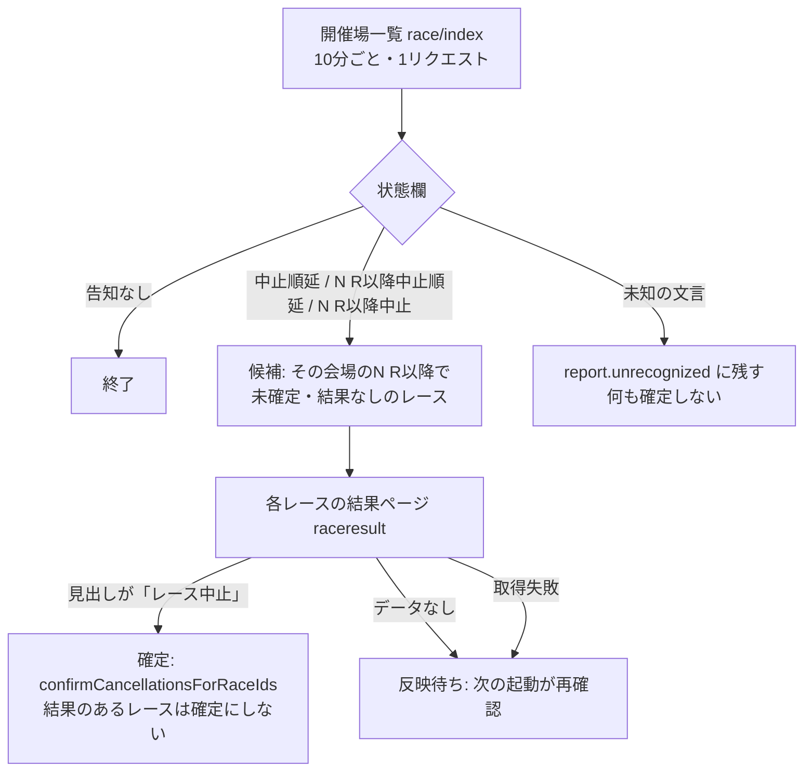

# 順延・中止の早期確定（`race_status`）

対応: [orchestration.md](./orchestration.md) / [tasks.md T4b-18](./tasks.md) / 既存仕様: [race-cancellation-detection](../race-cancellation-detection/spec.md)・[ADR-0039](../../adr/0039-race-cancellation-schema.md)・[ADR-0040](../../adr/0040-confirmed-cancellation-detection-location.md)・[ADR-0041](../../adr/0041-tentative-cancellation-streak-tracking.md)

## 1. 問題（2026-09-21の実測）

戸田(02)・江戸川(03)が日全体の順延、津(09)が5R以降の順延（1〜4Rは実施）、三国(10)が10R以降の中止になった。

| 会場 | DB（`races`・`race_results`、14:33 JST時点） | 公式 |
|---|---|---|
| 戸田・江戸川 | 1〜6R（発走時刻 10:00〜10:30）だけ`confirmed`。7〜12R（13:45〜）は`null` | 開催場一覧「中止順延」。結果ページは、確認した戸田7R・江戸川12Rとも「レース中止」 |
| 津 | 1〜4Rに結果あり。5Rは`confirmed`。6〜12Rは`null` | 「5R以降中止順延」。結果ページは、確認した5・6・12Rとも「レース中止」 |
| 三国 | 10Rだけ`confirmed`。11・12Rは`null` | 「10R以降中止」 |

確定が遅れる機序: `races.cancellation_status='confirmed'`は「発走+90分を超えても`race_results`が無い」ことからの推定でしか書かれない（GitHub Actions `scrape-results.js`の`confirmOverdueCancellations`、Vercel `result`ジョブの`onTick`は`shadow`のため未稼働）。日全体が順延でも、12Rが確定するのは発走（DBの朝の値 16:35）+90分＝18:05になる。その間:

- `scrape-monitor`の`evaluateExpired`が、結果スロット（`unexecuted:result:…`）・他ジョブのスロットを「未実行・expired」として通知する（`isCancelledRace`は`confirmed`のみ除外）
- 画面は「受付中」「結果反映待ち」のまま（`RaceCard`は`confirmed`のみ「中止」表示）
- `races_init`のshadow比較で、順延会場が不一致になる。公式の締切予定時刻が仮の値（10:00から6分刻み）に置き換わり、DBの朝の値と合わない。DBの1〜6Rが仮の値と一致し7〜12Rが朝の値のままなのは、`update-race-info`の`planDeadlineUpdates`が、変化が`maxShiftMin=180`分を超える行を更新しないため（推定。コードから確認、実行ログは未確認）

既存の暫定検知（`tentative`）は、この日には効かない。`update-race-info`は「選手情報が0人」を3回連続で検知したときだけ`tentative`にするが、順延日の出走表（racelist）には選手が載っている（戸田・津とも`race_entries`は6艇。`entries=6`をDBで確認）。

## 2. 公式ページのシグナル（2026-09-21に実ページで確認）

| # | シグナル | 粒度 | 確認結果 | 採否 |
|---|---|---|---|---|
| S1 | racelist・beforeinfo・raceresultの日付タブ「順延」（`li.is-active2`内） | 会場×日 | 戸田・江戸川・津で表示。**津は1〜4Rを実施した日でも「順延」**（結果あり）。日付タブは「その日が節の日数に数えられない」意味で、「そのレースが中止」とは言えない | 却下（単独で確定に使えない） |
| S2 | 開催場一覧`race/index?hd=YYYYMMDD`の会場行の状態欄 | 会場×日、**N R以降** | 戸田・江戸川=「中止順延」、津=「5R以降中止順延」、三国=「10R以降中止」。他は「N R以降発売中」「最終Ｒ発売終了」。1リクエストで全会場。2026-09-09の江戸川（12/12確定）は、過去日でも「中止順延」が残る。一部中止（2026-09-12の三国）は、過去日には残らない（当日のみ） | **採用（候補の絞り込み）** |
| S3 | 結果ページ`raceresult`の見出し`h3.title12_title` | レース | 中止・順延のレースは「レース中止」。発走前の通常レースは「※ データはありません。」（尼崎12Rで確認）。結果ありのレースは結果の表。**DB上の発走時刻の前でも表示される**（江戸川12R、DB 16:25、14:33時点で「レース中止」）。ただし、告知の直後から表示されるかは未確認 | **採用（レース単位の確認）** |
| S4 | `race/information`（`race_notices`ジョブが10分ごとに取得） | 会場×日 | 戸田・尼崎とも「現在、お知らせはありません」のみ。順延の告知は載らない | 却下 |
| S5 | racelistの選手数0人（既存の`tentative`） | レース | 順延日でも選手は載る | 効かない（既存のまま残す） |
| S6 | 締切予定時刻が仮の値（10:00から6分刻み） | 会場×日 | 戸田・江戸川は10:00・10:06…11:11。津は6R以降が13:26から約6分刻み（1〜5Rは実時刻）。実時刻と仮の値の見分けが付かない | 却下（判定に使えない） |

## 3. 設計案の比較

| 案 | 内容 | 誤確定の危険 | 追加リクエスト | 判定 |
|---|---|---|---|---|
| A | racelistの日付タブ「順延」で、その会場の未実施の全レースを確定 | 中（津は前半実施済みで、「実施済み」の判定が要る。日中に「順延」が付く時刻も未確認） | 0（`race_info`が既に取得） | 却下 |
| B | 開催場一覧の告知だけで、N R以降を確定 | 低〜中（告知の文言が既知の形でも、確定は戻せない） | 1回/起動 | 却下（確認が1系統） |
| **C（採用）** | **B＋レース単位の結果ページで「レース中止」を確認してから確定** | **低（公式の2画面が一致したものだけ）** | 1回/起動＋確定前の候補レース分（1回のみ。確定後は候補から外れる） | **採用** |
| D | `race_notices`ジョブに相乗り | — | — | 却下: 告知ページ（`information`）には順延が載らない。責務が混ざり、`live`稼働中のジョブに`shadow`検証なしで書き込みが入る |
| E | 90分ルールの待ち時間を短縮 | 高（実施が遅れただけのレースを中止にする） | 0 | 却下 |
| F | 結果ページの「レース中止」表示を、`result`ジョブのスロットで検知（発走時刻に検知） | 低 | 0 | 補完案（§7）。発走時刻まで待つため、早期確定の目的は果たせない |

C を選ぶ理由: 確定（`confirmed`）は、UIで「中止」と表示され、`computeCancellationTransition`が上書きせず、手動取り消しも無い（[spec.md](../race-cancellation-detection/spec.md)）。誤確定は戻せないため、S2（会場単位の告知）だけでは足りず、S3（レース単位の公式表示）と突き合わせる。S2は、S3を全レースに毎回取りに行く（288ページ/起動）のを避ける絞り込みとして使う。

## 4. 採用設計

### 4.1 既存仕様との関係（`tentative`/`confirmed`）

| 項目 | 扱い |
|---|---|
| `tentative`（選手0人の3回連続。`cancellationStatus.js`） | 変更しない。本設計は`tentative`を書かない（順延日は選手が載るため入口にならない。`update-race-info`が`racersFound`で`tentative`をリセットする既存挙動と衝突しない） |
| `confirmed` | 書くのは本ジョブと既存の90分ルール。どちらも`confirmCancellationsForRaceIds`経由で、**結果（`race_results`）のあるレースは確定にしない**・**確定済みは上書きしない**。`tentative`のレースは`confirmed`に上がる（`computeCancellationTransition`は`confirmed`を上書きしない） |
| 既存の90分ルール（GitHub Actions・Vercel `result`のonTick・`result-catchup`） | 変更しない。本ジョブが先に確定していれば、後から来た90分ルールは、確定済みを除いて何もしない（冪等）。本ジョブが確定できなかったレース（告知の無い中止・結果ページの反映遅れが長引いた場合）は、従来どおり90分後に確定する |
| 一部中止（津・三国型） | 状態欄の「N R以降」で、N R以降だけを候補にする。1〜N−1Rには触れない。結果のあるレースは、告知と矛盾しても確定せず、`report.contradictions`に残す |

### 4.2 ジョブ配置

専用の`continuous`ジョブ`race_status`を新設する（`scripts/lib/raceStatusJob.js`、`api/cron/race-status.js`、レジストリ、`vercel.json`）。Vercel Cron + 共通ラッパ（認証・リース・モード・失敗の記録）に載る（[ADR-0066](../../adr/0066-scraping-execution-consolidation-to-vercel.md)）。

- cron: `*/10 21-23,0-14 * * *`（UTC。JST 06:00〜23:59の10分ごと）。`races_init`（05:00〜）の後の朝の告知から、夜間開催の最終レースまで。事前の順延判断は前日夜にも出うるため、朝の初回起動で拾う
- `scrape_job_state`に行が無い（デプロイ直後）は`off`＝何もしない。`shadow`は取得・解析のみで、`races`へ書かず`report.wouldConfirm`に、確定するはずのレースを残す。`live`で書く。切り替えはDBの更新のみ（承認後にユーザーが実施）
- 取得: 開催場一覧1ページ＋候補のレース分の結果ページ。並列4、`politeFetch`（タイムアウト・429/503バックオフ・ブレーカー）。1ページ約8〜10秒のため、日全体順延の2会場（24レース）で約1分。ソフトデッドライン（maxDuration 300秒−30秒）で打ち切り、残りは次の起動が処理する
- 確定の根拠は、ログに「公式の告知（開催場一覧＋結果ページ）」と出す（`confirmCancellationsForRaceIds`の`reason`引数。既定は従来のまま）

### 4.3 失敗の扱い（0件・障害を成功にしない）

| 事象 | 扱い |
|---|---|
| 開催場一覧の取得失敗 | 失敗（HTTP 500、`consecutive_failures`加算、`scrape-monitor`が通知） |
| 一覧から会場を1つも読めない（構造の変化） | 失敗（「告知なし」の成功にしない） |
| 結果ページを試みた全件で失敗 | 失敗 |
| `races`・`race_results`の読み取り失敗 | 失敗（「候補なし」にしない） |
| 一部の結果ページが失敗・「データなし」 | 成功。`report.errors`・`report.notOnPage`に残し、次の起動が再確認 |
| 状態欄に未知の文言（「中止」「順延」を含む） | 何も確定せず`report.unrecognized`に残す |
| 告知のある日に、確定が0件（結果ページが全て「データなし」） | 成功（反映待ち。`notOnPage`に残る）。長引く場合は`shadow`の比較で見つける（§6） |
| ブレーカーが開いている | `skipped: breaker_open`（失敗にしない） |

### 4.4 期待される効果

| 項目 | 変更前 | 変更後 |
|---|---|---|
| 順延レースの確定時刻 | 発走（DBの朝の値）+90分（12Rは夕方） | 告知から最大10分＋結果ページの反映 |
| `scrape-monitor`の誤報 | `unexecuted`・`expired`（確定までの間） | `isCancelledRace`が確定済みを除外し、誤報しない |
| `claim_scrape_slots` | 確定まで、順延レースのオッズ・展示・出走表の取得スロットが走り続ける | 確定済みのレースの`pending`は`cancelled_race`で終端（既存の挙動）され、無駄な取得が止まる |
| 画面 | 確定まで「受付中」 | 確定後は「中止」（`RaceCard`・`PredictionPanel`の既存分岐） |
| `races_init`のshadow比較 | 順延会場が不一致 | 確定したレースを比較から外す（`compareRaceDigests`の`excludeRaceIds`。`check-morning-init-shadow.js`が`confirmed`を渡す）。件数を「比較対象外」として出す |

`races.start_time`（順延日は朝の値と仮の値が混在）は、更新しない。確定済みのレースは、予定表・監視・比較のいずれからも除外されるため、時刻の正しさは不要。

## 5. 書き込み量・Disk IO（[data-acquisition.md](../../../.claude/rules/data-acquisition.md)の要件）

- 書き込み先は`races.cancellation_status`のみ。**未確定→確定への1回だけ**（確定済みは候補から外れる。変更の無い行は書かない）。1日の書き込み: 通常日0行、日全体順延の会場1つで最大12行（1回のUPDATE `IN`）、台風で24会場なら最大288行
- `races`は既に更新の回転が大きい（累積で更新44.5万/生存4.4万行、[orchestration.md](./orchestration.md)のベースライン）が、本ジョブの追加は、日全体の順延日でも数十行/日で、Disk IOへの影響は無視できる（`cancellation_status`は短いTEXT。WAL量の実測は未実施）
- 読み取り: 告知のある起動のみ`races`（会場×日、最大24会場×12行）と`race_results`（候補のレース）。告知の無い日は、開催場一覧の1リクエストのみでDBを読まない（通常日 約108起動/日）
- 外部リクエスト: 通常日 108回/日（開催場一覧）。順延日は、確定までの候補レース×1回（確定後は取得しない）。反映待ちが長引くレースは、10分ごとに1回再確認する

## 6. 展開手順（ユーザー承認・操作が要る。本PRでは実施しない）

1. PRをマージ（Vercelに`/api/cron/race-status`のCronが登録される。`scrape_job_state`に行が無いため`off`で、何もしない）
2. `scrape_job_state`の`race_status`を`shadow`にする（DBの更新。承認後）。順延・中止が起きた日に、`last_report`を確認する:
   - `announced`が、公式の開催場一覧の状態欄と一致する
   - `wouldConfirm`（最大24件）が、その後に既存基盤（90分ルール）が確定したレースと一致する（`select race_id from races where race_date = '…' and cancellation_status = 'confirmed'`と突き合わせる）
   - `unrecognized`が空か、既知の形でない文言を人が見て、`classifyStatusText`に追加する
   - `contradictions`が空（告知と結果が矛盾するレースが無い）
3. 順延日の`shadow`で、告知から`wouldConfirm`に載るまでの時間と、`notOnPage`（結果ページの反映遅れ）の長さを実測する。告知（開催場一覧の状態欄）から結果ページの「レース中止」表示までの遅延を、この実測で確認する（2026-09-21は告知の後に取得したため、告知の直後から出るかは未確認。発走時刻の前に表示されること自体は江戸川12Rで確認済み）。表示が告知より大きく遅れるなら、本設計の効果は「S3待ち」に縮むため、案Bへの緩和（S2だけで確定）を、追加の根拠（過去の順延日の全件一致等）とともに再検討する
4. 一致が確認できたら`live`にする（承認後）。GitHub Actionsの90分ルールは、そのまま並走してよい（冪等）
5. 完了の定義（[data-acquisition.md](../../../.claude/rules/data-acquisition.md)）は、tasks.md T4b-18の3行で判定する

## 7. 未確認事項・残課題

- 告知が出る時刻（前日夜・当日朝・途中）と、結果ページの「レース中止」が反映される時刻。実測は次の順延日の`shadow`（手順3）
- 「N R以降中止」が告知された後に、再開・撤回された例の有無（確定は戻せない）。撤回が起きうるなら、確定前に「告知が2回の起動で連続して見えた」条件を足す
- 状態欄の文言の網羅。実ページで確認できたのは「中止順延」「N R以降中止順延」「N R以降中止」。「順延」単独・「中止」単独・「N R以降順延」は、想定の形として分類しているが実例は未確認。未知の文言は確定せず`unrecognized`に残す
- 補完案F: 結果ページの「レース中止」表示を、`result`ジョブ（`shadow`）のスロット処理でも検知し、`no_values`ではなく「確定」と扱えば、告知を取りこぼした中止（開催場一覧に載らない形）を、発走時刻に確定できる。`result`ジョブの`live`化と合わせて検討する
- 過去日の遡及: 開催場一覧は、全日順延は過去日にも残り（2026-09-09の江戸川で確認）、一部中止は残らない。過去の確定漏れの棚卸しは、結果ページの「レース中止」表示（過去日でも取得できるかは未確認）で行う
