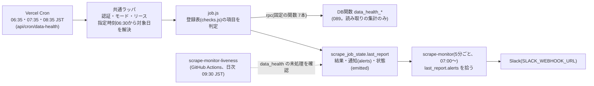

# 予定表・共通ラッパの実環境での検証手順書（tasks.md T4a-10）

対応: [plan.md](./plan.md) §3.5・§10（R1・R2・R14）・§13（U9・U16・U17） / [tasks.md](./tasks.md) T4a-10

本番DBのテーブル（`scrape_slots`・`scrape_job_state`）がある状態でしかできない検証の手順。DBに関わらない部分（期限計算のJST・許容幅・リース・冪等・ブレーカー・0件エラー等）は、DDLの適用前に、次のコマンドで検証済み（PGliteとインメモリのストア）。

| コマンド | 内容 |
|---|---|
| `npm run verify:scrape-slots-sql` | マイグレーション075をPGlite（インメモリPostgreSQL）に適用し、RPCの意味論（期限・許容幅・リース・奪取・確定中止・日付またぎ・順延の追従）を検証（`npm i --no-save @electric-sql/pglite`が要る） |
| `npm run verify:scrape-jobs` | 共通ラッパ・politeFetch・ブレーカー・レジストリ・`resolveTargetDate` |
| `npm run verify:scrape-monitor` | 監視・cleanup・メタ監視・`api/cron/*`と`vercel.json`の整合 |
| `npm run verify:scrape-result-job` | 結果取得・Kファイル同期・catch-up（WS4b。DB・取得先なし。実際の結果ページのフィクスチャで解析・digest・shadowが書かないこと・中止確定・cron窓を検証） |
| `npm run verify:scrape-daily-jobs` | 日次・低頻度ジョブ（得点率・進入コース別・モーター成績・選手ニュース・選手プロフィール。WS4b。DB・取得先なし。対象日の解決（G1・G2の再発防止）・off/行なし/075未適用で何もしない・shadowが書かない・冪等・0件・チャンクの再開・履歴・monitor・配線を検証。変異検証済み） |
| `npm run verify:gha-skip-gate` | フェイルセーフ付きSKIP（P。DB・ネットワークなし。偽のclientで、変数false=DBを読まず常に実行・Vercel健全=スキップ・shadow/off/起動が古い/連続失敗/ブレーカー/未処理/読み取り失敗・タイムアウト・不正な値=実行を検証。変異検証済み） |

## 前提

1. マイグレーション075を本番へ適用済み（T4a-03。**ユーザーの承認後**）。適用後、PostgRESTのスキーマキャッシュに反映されていること（Supabaseは通常DDLの直後に自動で更新する。反映されていない場合は、SQL Editorで`NOTIFY pgrst, 'reload schema';`）
2. Vercelの環境変数（Production）に、`CRON_SECRET`・`SUPABASE_URL`・`SUPABASE_SERVICE_KEY`・`SLACK_WEBHOOK_URL`が設定済み（値は確認せず、名前の有無のみ。T4a-01）
3. このPRがマージされ、本番にデプロイ済み

**Previewでは、Cronが発火しない**（Productionのみ。plan.md R14）。Previewでの検証は、`CRON_SECRET`付きの手動リクエストで行う。Previewには、Deployment Protectionがかかっている場合があり、その場合は保護のバイパスの設定（`x-vercel-protection-bypass`ヘッダー）が要る。Previewの環境変数（Preview環境に`CRON_SECRET`・`SUPABASE_*`があるか）は未確認。無い場合は、Productionで疑似ジョブを（`mode=shadow`で）実行する。**本番の予定表・ジョブ状態への書き込み（下記の`INSERT`・`UPDATE`）は、ユーザーの承認を得てから実行する**（`pseudo`・`pseudo_verify`のジョブ名の行のみ）。

## A. DBのRPCの検証（二重claim・リースの奪取・期限計算・expired）

```
node --env-file=.env.local scripts/maintenance/verify-scrape-slots-on-db.js            # dry-run（何をするかを表示）
node --env-file=.env.local scripts/maintenance/verify-scrape-slots-on-db.js --execute  # 実行（承認後）
```

`scrape_slots`に`job='pseudo_verify'`の行（`--date`のレース分。既定は今日）を作り、終了時に削除する。他のジョブ・テーブルには書かない。時刻は`p_now`で固定するため、実行時刻に依存しない（対象日のracesが41件以上必要）。

| 確認 | 期待 |
|---|---|
| `ensure_scrape_slots`の冪等 | 全レース分を作成、再実行は0件 |
| 期限計算（JST） | 期限の1秒前には取れず、期限ちょうどに取れる（期限＝発走時刻をJSTとして扱い−60分） |
| 二重claim（**PGliteでは検証できない並行実行**） | 8本の同時`claim`で40件を取り、同じスロットを2つの実行が取らない（重複0件） |
| リースの奪取 | リース切れの`running`を別workerが取り`attempts`が2になる。奪われた旧workerの完了の更新は0行 |
| expired | 許容幅を超えた未完了は`expired`。一度も`claim`されなかったものは`attempts=0`（未実行） |

実行後の確認（読み取り）: `SELECT count(*) FROM scrape_slots WHERE job='pseudo_verify';` が0（後片付け済み）。

## B. Vercel上の疑似ジョブ（`api/cron/scrape-pseudo`）での検証

疑似ジョブは、取得先へアクセスせず、予定表のスロットを消化するだけ（`resultDigest`に、処理した実行とattemptを残す）。Cronには登録しない。

準備（承認後）: 
```sql
INSERT INTO scrape_job_state (job, mode) VALUES ('pseudo', 'shadow')
ON CONFLICT (job) DO UPDATE SET mode = 'shadow';
```
リクエスト: `curl -s -H "Authorization: Bearer $CRON_SECRET" "https://www.boat-ai.jp/api/cron/scrape-pseudo"`（`$CRON_SECRET`はシェルに渡すが、値は出力・記録しない）。1回目は、最初の起動のため予定表（`race_date`＝今日のレースの`-60`分スロット、期限+30分の間のもの）を生成して消化する。

| 確認 | 手順 | 期待 |
|---|---|---|
| モードのゲート | `mode='off'`で呼ぶ → `skipped: mode_off`。行を削除して呼ぶ → 行が`off`で作られ`skipped` | 書き込みなし（`scrape_slots`に行が増えない） |
| 認証 | `Authorization`なし・誤りで呼ぶ | 401 |
| 重複配信・二重claim | `?sleepMs=3000`を付けて**同時に2件**のリクエストを送る（`curl ... & curl ... & wait`）。2件の`claimed`の合計が、消化された行数と一致 | `SELECT race_id, attempts FROM scrape_slots WHERE job='pseudo' AND status='done' AND attempts > 1;` が0行。各`resultDigest`の`worker`が、2つの実行のどちらか一方のみ |
| リースの奪取（実環境） | 疑似ジョブのリースは20秒。`?sleepMs=25000`で1件目を実行中（25秒）に、別のリクエストを21秒後に送る | 2件目が同じスロットを奪取して`attempts=2`、1件目の完了は`claimed_by`不一致で記録されない（関数ログに「リースを失っていたため記録しませんでした」）。最終的に`done`は2件目の`worker` |
| 期限計算 | 消化された行で`done_at - 期限`（`(race_date + races.start_time) AT TIME ZONE 'Asia/Tokyo' - 60分`）を確認 | 期限以降。JSTとして扱われている（9時間ずれていない） |
| 環境変数の変更が、再デプロイなしに反映されるか（plan.md U17） | Vercelのダッシュボードで`SCRAPE_PSEUDO_PROBE`を追加・変更（**再デプロイしない**）→ 疑似ジョブを呼ぶ → `resultDigest`の`probe=`を確認 | 反映されない（新しいデプロイにのみ反映）場合、本設計の前提（モードをDBに持つ）が正しい。反映される場合は、その旨を`plan.md`のU17に記録 |
| 監視（`scrape-monitor`） | `pseudo`を`shadow`にし、`ensure`された（期限を過ぎていない）スロットを、疑似ジョブを呼ばずに放置して、許容幅（30分）を超えさせる | `scrape-monitor`（5分ごと）が、`expired`（未実行 attempts=0）をSlackへ通知する。同じスロットの再通知はしない。`SLACK_WEBHOOK_URL`が無い場合は、監視の実行が失敗し（`scrape_job_state`の`scrape-monitor`の`last_error`）、メタ監視が検知する |
| メタ監視 | Actionsの`Scrape Monitor Liveness`を手動実行（`workflow_dispatch`） | `scrape-monitor`の`last_tick_at`が新しければOK。運用窓（JST 07:10〜23:59）の外では`SKIP` |
| 後片付け | 検証後 `UPDATE scrape_job_state SET mode='off' WHERE job='pseudo';`、`DELETE FROM scrape_slots WHERE job='pseudo';`。疑似ジョブが不要になったら、`api/cron/scrape-pseudo.js`と`registry.js`の`pseudo`を削除 | `off`の疑似ジョブの`expired`は、監視が通知しない |

## C. Vercel Cronの未配信・重複の頻度（plan.md U16）

疑似ジョブ・実ジョブを`shadow`で本番Cronから動かした後に、次を集計する（読み取りのみ）。

- 未配信: `scrape_slots`の`attempts=0`のまま`expired`になった件数（`SELECT job, count(*) FROM scrape_slots WHERE status='expired' AND attempts=0 GROUP BY 1;`）。`scrape-monitor`が即時通知する
- 重複配信: 同じ分に、同じエンドポイントが2回起動された回数。Vercelのランタイムログ（`/api/cron/scrape-monitor`の呼び出し時刻）から、分単位で集計する。予定表側では、二重claimは起きない設計のため、`attempts`の増加ではなく、リース中の`claim`が0件で終わった実行（`claimed: 0`）の増加として現れる
- 死活: `scrape_job_state.last_tick_at`の更新間隔（5分ごとの書き込みのため、最大約5分の間隔）と、`scrape-monitor`の`liveness`通知の有無

## D. 順延の追従（plan.md U9）

期限は保存せず、`races.start_time`から都度計算するため、発走時刻が変わればまだ`done`でないスロットは新しい期限に追従する（PGliteの検証で確認済み: `verify-scrape-slots-sql.js`）。既に`done`のスロットは再オープンしない（既知の限界）。**発走時刻の変更の頻度**は、運用開始後に、`first_attempt_at`と期限のずれ（期限より前に`first_attempt_at`がある行＝期限が後ろへずれた）から計測する:

```sql
SELECT s.job, count(*) AS moved
FROM scrape_slots s JOIN races r ON r.race_id = s.race_id
WHERE s.first_attempt_at IS NOT NULL
  AND s.first_attempt_at < ((r.race_date + r.start_time) AT TIME ZONE 'Asia/Tokyo') + make_interval(mins => s.offset_min)
GROUP BY 1;
```

## E. shadowからliveへの切り替え時の注意（レビュー指摘）

`shadow`で`done`になったスロットは、`live`に切り替えても再取得されない（データテーブルへ書いていないのに、その窓は「済み」になる）。GitHub側の停止（`SKIP_*_ON_GHA=true`）は、`live`に切り替え、少なくとも1つ後の窓が`live`で完了したのを確認してから行う。急ぐ場合は、切り替え直後に、許容幅の内側の`shadow`の`done`を戻す:

```sql
UPDATE scrape_slots
   SET status='pending', done_at=NULL, outcome=NULL, run_mode=NULL, next_attempt_at=NULL
 WHERE job='<ジョブ>' AND run_mode='shadow' AND status='done' AND race_date=<今日>;
```

（期限+許容幅を過ぎたスロットは、次の`claim`で`expired`になるため、戻しても再取得されない。`expired`は通知される。）

## F. 結果取得（`result`・`result_catchup`）の切り替え（tasks.md T4b-02-3〜5、T4b-05-2）

対象: `api/cron/result.js`（毎分、JST 07:00〜翌00:59）、`api/cron/result-catchup.js`（23:50・翌00:30 JST）。コードのマージ・本番デプロイ後に始める。マージ直後は、`scrape_job_state` に行が無い（または `off`）ため、両ジョブは何も取得せず何も書かない（行が無い場合は、`mode='off'` の行を1つ作るだけ。`mode` は変更しない）。

操作の区分: **読み取りSQL・確認スクリプトはAgentが実行してよい。`scrape_job_state` の `mode` の更新（書き込み）と、リポジトリ変数の変更は、ユーザーの承認を得てから行う。**

共通の状態確認（読み取り）:

```sql
SELECT job, mode, last_tick_at, last_success_at, consecutive_failures, last_error,
       last_rows_written, last_target_date, breaker_open_until
  FROM scrape_job_state
 WHERE job IN ('result', 'result_catchup', 'kfile_sync') OR job LIKE 'host:%'
 ORDER BY job;
```

### F1. shadow（3日。土日のいずれか1日を含む）

開始（承認後）。`result` と `result_catchup` を同時に `shadow` にする（どちらも取得・解析のみで、データテーブルへ書かない）:

```sql
INSERT INTO scrape_job_state (job, mode) VALUES ('result', 'shadow'), ('result_catchup', 'shadow')
ON CONFLICT (job) DO UPDATE SET mode = 'shadow', updated_at = now();
```

shadow の間、GitHub Actions側の結果取得は、そのまま動く（Vercel側は取得先へ、レースごとに約1回ずつ余分に取得する。1日あたり、約180〜290ページ）。

毎日の確認（読み取り）:

```
node --env-file=.env.local scripts/maintenance/check-result-shadow.js --days=3
```

`result_digest`（shadow が解析した値のハッシュ）を、既存基盤が `race_results`・`race_start_timings` に書いた値から計算したハッシュと比べ、一致率・不一致のレース・遅延（完了−発走5分後）のp50・p95・試行回数を出す。

```sql
-- shadow が、データテーブルへ書いていないこと（rows_written が全て0）
SELECT count(*) AS shadow_rows_written_nonzero
  FROM scrape_slots WHERE job = 'result' AND run_mode = 'shadow' AND rows_written > 0;          -- 期待: 0

-- 状況（JSTの直近3日。確定中止のレースを除く）
WITH s AS (
  SELECT s.*, ((r.race_date + r.start_time) AT TIME ZONE 'Asia/Tokyo') + make_interval(mins => s.offset_min) AS deadline
    FROM scrape_slots s JOIN races r ON r.race_id = s.race_id
   WHERE s.job = 'result'
     AND s.race_date >= (now() AT TIME ZONE 'Asia/Tokyo')::date - 3
     AND r.cancellation_status IS DISTINCT FROM 'confirmed')
SELECT coalesce(run_mode, '未着手') AS run_mode,
       count(*) AS total,
       count(*) FILTER (WHERE status = 'done' AND outcome = 'ok') AS ok,
       count(*) FILTER (WHERE status = 'expired') AS expired,
       count(*) FILTER (WHERE status = 'expired' AND attempts = 0) AS unexecuted,
       round((percentile_cont(0.5) WITHIN GROUP (ORDER BY extract(epoch FROM done_at - deadline) / 60)
              FILTER (WHERE status = 'done' AND outcome = 'ok'))::numeric, 1) AS p50_min,
       round((percentile_cont(0.95) WITHIN GROUP (ORDER BY extract(epoch FROM done_at - deadline) / 60)
              FILTER (WHERE status = 'done' AND outcome = 'ok'))::numeric, 1) AS p95_min
  FROM s GROUP BY 1 ORDER BY 1;

-- 取得先の拒否（429・503）とブレーカー
SELECT count(*) AS retried_with_429_503 FROM scrape_slots
 WHERE job = 'result' AND race_date >= (now() AT TIME ZONE 'Asia/Tokyo')::date - 3
   AND (last_error LIKE '%429%' OR last_error LIKE '%503%');
SELECT job, breaker_open_until, last_error, updated_at FROM scrape_job_state WHERE job LIKE 'host:%';
```

Vercelのダッシュボード（Logs・Usage）で、`/api/cron/result` の関数の所要時間（p95）・500の応答数・Active CPUと呼び出し回数を確認する（plan.md U5・U13）。

**成功基準（全て満たせば live へ）**:

| 項目 | 基準 |
|---|---|
| ダイジェストの一致率 | 99%以上（不一致は原因を調べる。公式ページの後日訂正なら許容、解析の差なら修正）。比較できた行が、1日あたり全レースの9割以上 |
| shadow の完了率（確定中止を除く） | `ok` が98%以上。`unexecuted`（`attempts=0` の expired）は0件 |
| 1回の呼び出しの所要時間 | p95が240秒以下（`maxDuration` 300秒、ソフトデッドラインは270秒）。着手を見送った（`deferred`）スロットが、頻発していない |
| 取得先の拒否 | 429・503が0件、ブレーカーが一度も開いていない |
| 500の応答・連続失敗 | 0件。`consecutive_failures` が3以上になっていない |
| shadow の書き込み | 上の `shadow_rows_written_nonzero` が0 |

shadow の間に出うる誤報: 中止・順延のレースは、shadow では `onTick`（中止・順延の確定）が動かないため、GitHub側が確定するまで、スロットが `no_values` で再試行され、最後は `expired`（`run_mode='shadow'`）になる。shadow の `expired` は監視が通知しない（`evaluateExpired`）。集計の `expired` には、こうしたレースが含まれる。

ロールバック（shadow を止める）: `UPDATE scrape_job_state SET mode = 'off', updated_at = now() WHERE job IN ('result', 'result_catchup');`

### F2. live に切り替えて3日並走

`shadow` で `done` になったスロットは、live にしても再取得されない（前の§E）。**切り替えは、その日の最後のレースの許容幅が過ぎた後（翌 00:20 JST 以降）か、早朝（07:00 JST より前）に行う**（許容幅の内側の `shadow` の `done` が無い時間帯）。日中に切り替える場合は、§Eの、`shadow` の `done` を戻すSQLを、ジョブを `result` にして、直後に実行する。

切り替え（承認後）:

```sql
UPDATE scrape_job_state SET mode = 'live', updated_at = now() WHERE job IN ('result', 'result_catchup');
```

live の間、GitHub Actions側の結果取得も動き続ける（同じ行を上書きする。値が同じ行は、両方とも書かない＝変更のある行のみ書く）。

確認（読み取り）:

```sql
-- 結果の充足率（前日以前。確定中止を除く。決まり手・払戻が揃うレースの割合も）
SELECT r.race_date, count(*) AS races,
       count(*) FILTER (WHERE rr.race_id IS NOT NULL) AS with_result,
       count(*) FILTER (WHERE rr.payout_win IS NOT NULL AND rr.winning_technique IS NOT NULL) AS complete
  FROM races r LEFT JOIN race_results rr ON rr.race_id = r.race_id
 WHERE r.race_date BETWEEN (now() AT TIME ZONE 'Asia/Tokyo')::date - 4 AND (now() AT TIME ZONE 'Asia/Tokyo')::date - 1
   AND r.cancellation_status IS DISTINCT FROM 'confirmed'
 GROUP BY 1 ORDER BY 1;

-- 書き込み量（並走前後の24時間の差を比べる。二重書き込みで増えていないこと。tasks.md T0-02と同じ）
SELECT relname, n_tup_ins, n_tup_upd, n_tup_hot_upd
  FROM pg_stat_user_tables WHERE relname IN ('race_results', 'race_start_timings', 'predictions');
```

Vercel側のスロットの状況は F1 の「状況」のSQL（`run_mode = 'live'`）。`check-result-shadow.js` は、live のスロットの遅延・expired の件数も出す。

**成功基準（3日、土日を含む）**:

| 項目 | 基準 |
|---|---|
| 結果の充足率 | 前日以前の `complete` が、確定中止を除くレースの99%以上（並走前より悪化していない） |
| live のスロット | `expired` が0件（出た場合は理由を説明でき、後日の catch-up で補填されている）。遅延のp95が、shadow の値と同程度 |
| 書き込み量 | `race_results`・`race_start_timings` の1日あたりの `n_tup_upd` が、並走前の24時間より増えていない |
| 中止・順延の確定 | 1日あたりの確定件数が、並走前と同程度（`cancellation_status='confirmed'` の件数。大きく増えたら、誤って確定していないかを、結果ページで確認する） |
| catch-up | 23:50 の実行が `incomplete: true` になった日は、翌 00:30 に完了し、`last_target_date` が対象日になる |

ロールバック: `UPDATE scrape_job_state SET mode = 'off', updated_at = now() WHERE job IN ('result', 'result_catchup');`（GitHub側は動いたままなので、取得の空白は無い）。

### F3. GitHub側の停止（`SKIP_RESULTS_ON_GHA`、`SKIP_KFILE_ON_GHA`）

前提: F2が成功基準を満たし、live で、少なくとも1つ後の窓が live で完了している。Kファイル同期は別の変数（`SKIP_KFILE_ON_GHA`）で止める（`SKIP_RESULTS_ON_GHA=true` だけでは、GitHub側のKファイル同期は動き続ける）。Kファイル同期の停止は、§G2の基準を満たしてから。両方を止めた場合、GitHub Actionsは結果取得の呼び出し自体を行わない（`scrape-scheduled.js`）。

手順（承認後。リポジトリ変数の変更）:

```
gh variable set SKIP_KFILE_ON_GHA --body true --repo rhapsody0919/boatrace-ai-predictor
gh variable set SKIP_RESULTS_ON_GHA --body true --repo rhapsody0919/boatrace-ai-predictor
```

（次のGitHub Actionsの実行から反映される。コード変更・再デプロイは不要。`gh` は、このプロジェクトのアカウント（rhapsody0919）で実行する。）

停止後の7日（土日を含む）の実測（tasks.md T4b-02-5）:

```
gh run list --workflow scrape-scheduled.yml --repo rhapsody0919/boatrace-ai-predictor --limit 300 --json conclusion,status,createdAt,updatedAt
```

- GitHub Actionsの1回の実行時間: 379秒 → 約262秒の見込み（結果関連の約117秒が減る）
- キャンセル率: 11.8%（400件中47件、plan.md F11）から低下しているか
- 完了の定義（A・B・C）: F2の充足率のSQL、`result` の窓内取得率（監視の日次サマリー）、`expired` の件数・監視の通知

ロールバック（順序を守る。取得の空白を作らない）:

1. `gh variable set SKIP_RESULTS_ON_GHA --body false --repo rhapsody0919/boatrace-ai-predictor`（と、`SKIP_KFILE_ON_GHA` も `false`）。次のGitHub Actionsの実行から、結果取得・Kファイル同期が再開する
2. Vercel側を止める場合は、GitHub側の再開を確認してから `UPDATE scrape_job_state SET mode = 'off', updated_at = now() WHERE job IN ('result', 'result_catchup', 'kfile_sync');`

`mode` が `off` の間に積み上がった `pending` のスロットは、監視が通知しない（`off` のジョブは対象外）。`scrape-cleanup` が古い行を整理する。

## G. Kファイル同期（`kfile_sync`）の切り替え（T4b-05-1・T4b-05-3）

対象: `api/cron/kfile-sync.js`（07:00・12:00 JST）。当日を除く直近4日について、進入コース・rank4〜6を、同じ日のKファイル1回のダウンロードで同期する。未同期のレースが無い日は、ダウンロードしない。マージ直後は `off`（何もしない）。

### G1. LZH展開の動作確認（plan.md U15）と shadow

`mode` を `shadow` にしてから、手動リクエストで、Vercel関数の中でLZHの展開が動くかを確認する（`probe`。書き込み・同期なし。取得先へ1リクエスト）:

```sql
INSERT INTO scrape_job_state (job, mode) VALUES ('kfile_sync', 'shadow')
ON CONFLICT (job) DO UPDATE SET mode = 'shadow', updated_at = now();
```

```
curl -s -H "Authorization: Bearer $CRON_SECRET" "https://www.boat-ai.jp/api/cron/kfile-sync?probeDate=2026-09-19"
```

（`$CRON_SECRET` はシェルに渡すが、値は出力・記録しない。）期待: `probe: {downloaded: true, chars: <数十万>, races: 100以上}`。`downloaded: false` なら、その日のKファイルが未公開・開催なし。500なら、展開・取得の失敗（応答の `error`）。

shadow を1日（07:00・12:00の実行）動かして確認する:

```sql
SELECT last_success_at, last_target_date, last_rows_written, last_error, last_report
  FROM scrape_job_state WHERE job = 'kfile_sync';
```

`last_report.days[]` に、直近4日それぞれの、`actualCourse.status`・`rank456.status`（`nothing_pending`＝同期済み・ダウンロードなし、`synced`＝ダウンロードして解析、`kfile_unavailable`＝未同期があるのにKファイルが未公開、`kfile_error`）と、書くはずの件数（`updated`。shadow は dryRun のため書かない）が入る。

**成功基準（shadow 1日）**: `problems` が空（`kfile_error`・`pending_check_failed`・`no_races_parsed` が無い）。`unpublished` が、12:00の実行の後に空。`synced` の日は、`updated` が、GitHub側の同期が後で書いた件数と一致する（`nothing_pending` だけの日は、shadow が確認するものが無い。probe で展開の動作は確認済み）。

ロールバック: `UPDATE scrape_job_state SET mode = 'off', updated_at = now() WHERE job = 'kfile_sync';`

### G2. live（3日並走）

```sql
UPDATE scrape_job_state SET mode = 'live', updated_at = now() WHERE job = 'kfile_sync';
```

GitHub側の同期も動き続ける（同じ値の上書きは、どちらも書かない）。確認（読み取り。結果確定済みのレースについて、進入コース・rank4〜6の充足）:

```sql
SELECT r.race_date,
       count(*) FILTER (WHERE rr.rank1 IS NOT NULL) AS finished,
       count(*) FILTER (WHERE rr.rank1 IS NOT NULL AND rr.actual_course_1 IS NULL AND rr.actual_course_2 IS NULL AND rr.actual_course_3 IS NULL
                          AND rr.actual_course_4 IS NULL AND rr.actual_course_5 IS NULL AND rr.actual_course_6 IS NULL) AS course_missing,
       count(*) FILTER (WHERE rr.rank1 IS NOT NULL AND rr.rank4 IS NULL) AS rank4_missing
  FROM race_results rr JOIN races r ON r.race_id = rr.race_id
 WHERE r.race_date BETWEEN (now() AT TIME ZONE 'Asia/Tokyo')::date - 5 AND (now() AT TIME ZONE 'Asia/Tokyo')::date - 1
 GROUP BY 1 ORDER BY 1;
```

**成功基準**: `course_missing` が、前日以前で0件。`rank4_missing` は、並走前（GitHub側のみ）の件数を上回らない（3着以内しか完走しない等で、構造的に残るレースがある。分母の定義は tasks.md T4b-05 の本番実測）。`last_report.problems` が空。`consecutive_failures` が0。

ロールバック: `mode = 'off'`（GitHub側は動いたまま）。

### G3. GitHub側の停止

F3の手順（`SKIP_KFILE_ON_GHA=true`）。停止後、`course_missing` が0のまま、`kfile_sync` の `last_target_date` が毎日更新されることを、7日確認する（未更新なら監視が `daily_overdue` を通知する）。ロールバックはF3。

## H. 結果のcatch-up（`result_catchup`）の確認

`result` と同じ `shadow` → `live`（F1・F2）。確認するのは次の点。

```sql
SELECT last_success_at, last_target_date, last_rows_written, last_error, last_report
  FROM scrape_job_state WHERE job = 'result_catchup';
```

- 23:50 JST の実行: 対象日の結果のスロットに、まだ `pending`・`running` があれば、`last_report.openSlots > 0`・応答が `incomplete: true`（対象日を処理済みにしない）
- 翌 00:30 JST の実行: `last_target_date` が対象日になる（以降の起動は `already_done`）
- `last_report.candidates`（再取得の対象＝expired のスロット）と `outcomes`。`unresolved` に残ったレースは、結果ページで、まだ結果が無いか（中止・順延）を確認する
- live のとき、`confirmedCancellations`（発走+90分を超えて結果の無いレースの確定）と、`hitFlags`（直近10日の的中フラグの補完。`missing` が0でなければ、`fixed` が補完した件数）
- 0件エラー（再取得の対象があるのに、1件も取得・解析できなかった）が出たら、`last_error` に「0件」と出て、監視が通知する

## I. 切り戻しの早見表

| 状況 | 操作 | 影響 |
|---|---|---|
| shadow・live の Vercel側に問題 | `UPDATE scrape_job_state SET mode = 'off' WHERE job IN ('result','result_catchup','kfile_sync')` | Vercel側が止まる。GitHub側が動いていれば、取得の空白なし |
| GitHub停止後に問題 | ①`SKIP_*_ON_GHA` を `false` → ②Vercel側を `off`（順序を守る） | 次のGitHub Actionsの実行から再開 |
| 中止・順延を誤って確定した疑い | 対象レースの結果ページを確認し、結果がある場合は `UPDATE races SET cancellation_status = NULL WHERE race_id = '<race_id>'`（承認後）。`result_catchup` の live は、確定済みのレースを再取得しない | 該当レースの結果は、手動のバックフィル（`scripts/maintenance/backfill-results-by-race-id.js`）で補う |

## J. 予測リフレッシュ案1の有効化と効果の実測（tasks.md T4b-03-4、plan.md §5）

`REFRESH_ON_VERCEL`（Vercel）と`SKIP_ODDS_REFRESH_ON_GHA`（GitHubのリポジトリ変数）は、どちらも既定off＝現行動作。組み合わせと順序の考え方は`scripts/lib/predictionRefresh.js`の冒頭。DBに関わらない部分（トグル・併走・書き込み方式・取得失敗時の挙動）は、`npm run verify:prediction-refresh`で検証済み。

### J-0. 有効化の前に、ユーザーの判断が要る点

1. **unifiedの日全体の再生成が止まる**（plan.md §5「unifiedの扱い」）。今は、再計算（削除→挿入）が`unified`の行も消し、次のGitHub Actionsの`ensureUnifiedPredictions`が日全体を約170回/日再生成している。upsert方式はunifiedを触らないため、この再生成が止まり、Disk IOは大きく減るが、unifiedのイン崩れバッジが朝の気象で固定される。許容するか、展示後のunified再生成を先に作るか、を決める。確認クエリ（有効化前の現状）:
   ```sql
   -- unified の最新の predicted_at が、発走の何分前後か（終了済みレース。負＝発走後）
   WITH st AS (SELECT race_id, ((race_date + start_time) AT TIME ZONE 'Asia/Tokyo') AS start_at FROM races WHERE race_date = '<今日>')
   SELECT count(*) AS races,
     round(percentile_cont(0.5) WITHIN GROUP (ORDER BY extract(epoch FROM (st.start_at - p.predicted_at))/60)::numeric, 1) AS p50_min_before_start
   FROM predictions p JOIN st USING (race_id)
   WHERE p.model_id = 'unified' AND p.race_id LIKE '<今日>-%' AND st.start_at < now();
   ```
   有効化後は、この中央値が大きく正（朝の値のまま）になる。
2. **`VERCEL_DEPLOY_HOOK`をVercelの環境変数（Production）に設定するか**。`mainRefresh`は、毎時の先頭5分以内に、更新があれば、Deploy Hookを叩く（BOA-361）。今は、GitHub側の再計算がこれを担っているが、案1でGitHub側の再計算がレース情報の起点のみになると、叩く機会が減る。Vercel側の環境変数が無ければ、Vercel経路は叩かない（`VERCEL_DEPLOY_HOOK 未設定`のログ）。時間ごとの再デプロイ（AIクローラー向けスナップショットの更新等）を維持するなら、設定する（値は確認せず、名前の有無のみ。plan.md U10）。

### J-1. 有効化の手順（レースの無い時間帯に行う。併走が起きない）

| 手順 | 操作 | 確認 |
|---|---|---|
| 1 | （ユーザー）このPRがマージされ、本番にデプロイ済みであることを確認する。既定offのため、この時点で動作は変わらない | 展示の関数が従来どおり動く（`api/cron/exhibition`のログに`展示データ取得`。`予測の再計算（Vercel）`は出ない） |
| 2 | （ユーザー）VercelのProductionの環境変数に`REFRESH_ON_VERCEL=true`を追加し、**再デプロイする**（環境変数の変更は、新しいデプロイにのみ反映される。plan.md U17）。F-0の2も、同時に | 再デプロイ完了 |
| 3 | 翌朝、最初の展示の取得（発走約33分前）の後、Vercelのランタイムログ（`/api/cron/exhibition`）を確認する | `🤖 予測の再計算（Vercel）: Nレース`→`predictions: M件（Nレース、upsert）`→`🏁 リフレッシュ完了`。エラー（`予測の再計算エラー`）が無い |
| 4 | 下のF-2の「再計算後の鮮度」「空のレース」のクエリで、Vercel経路が正しく書けていることを確認する | 全て期待どおり |
| 5 | （ユーザーの承認後）GitHubのリポジトリ変数`SKIP_ODDS_REFRESH_ON_GHA=true`を設定する。次のGitHub Actionsの実行から、オッズ起点の再計算が外れる（再デプロイ不要） | 実行ログに`オッズ起点の予測リフレッシュを除外`と、`predictions: …（Mレース、upsert）` |
| 6 | 土日を含む7日間、F-2で効果と鮮度を実測する | 下記 |

順序が重要: **Vercelを先にon、GitHubを後にon**（空白を作らない。逆にすると、展示の変更を起点にする再計算が、どこにも無い時間ができる）。手順2〜5の間に併走が起きても、Vercel側はupsert方式のため、予測が空になったり書き込みが衝突したりはしない（無駄な再計算が増えるだけ。GitHub側は、手順5までは削除→挿入のままのため、同じレースを同時に再計算した場合のみ、その回のGitHub側の書き込みが失敗しうる。レースの無い時間帯に切り替えれば起きない）。

### J-2. 効果と正しさの実測

**再計算の回数（主指標）**。GitHub Actionsのログと、Vercelのログから数える。
```bash
# GitHub: 1日分の scrape-scheduled の実行から、再計算の対象レース数を集計する（3件に1件など標本でよい。標本率で割り戻す）
gh run list --workflow=scrape-scheduled.yml --limit 400 --json databaseId,createdAt,conclusion
gh run view <run id> --log | grep "予測リフレッシュ対象"
```
Vercel側は、ランタイムログの`予測の再計算（Vercel）: Nレース`のNを、日ごとに合計する（Vercel MCPの`get_runtime_logs`、またはダッシュボード）。1レースあたりの再計算回数＝（GitHubの合計＋Vercelの合計）÷その日のレース数（`SELECT count(*) FROM races WHERE race_date = '<日>'`）。**基準（有効化前、2026-09-15〜19の実測）: 約5.0〜5.8回/レース/日。見込み: 約2.2〜3.2回（約45〜60%減）。**

**predictionsの書き込み量（補助指標。DB全体の累積カウンタの差分）**。
```sql
-- 有効化前後の同じ曜日（例: 日曜）の 07:00 と 23:59 JST に、それぞれ実行して差分を取る
SELECT now(), n_tup_ins, n_tup_upd, n_tup_del, n_tup_hot_upd, n_dead_tup
FROM pg_stat_user_tables WHERE relname = 'predictions';
```
注意: 有効化後は、再計算が「削除→挿入」（`n_tup_del`＋`n_tup_ins`）から「upsert」（`n_tup_upd`）に変わり、さらにunifiedの日全体の再生成（`n_tup_upd`。約170回/日×約160行）が止まる。したがって`n_tup_ins`だけでなく、`n_tup_ins + n_tup_upd + n_tup_del`の合計と、内訳の変化で見る。**回数の減少（約55%）と、方式の変更（削除＋挿入→更新1回）と、unifiedの再生成の停止は、別々の要因**であり、合計の変化は約55%より大きくなる見込み。Disk IOの実消費は、Supabaseのダッシュボードで、同じ時間帯を比較する。

**再計算後の鮮度（正しさ）**。有効化後の終了済みレースで、予測が、展示・気象の最終書き込みより後に書かれていること（`exhibition_data.created_at`・`updated_at`は、9/19夜以降の行にある）。
```sql
WITH ex AS (
  SELECT race_id, max(coalesce(updated_at, created_at)) AS ex_last
  FROM exhibition_data WHERE race_id LIKE '<日>-%' AND created_at IS NOT NULL GROUP BY 1
), pr AS (
  SELECT race_id, min(predicted_at) AS pred_min
  FROM predictions WHERE race_id LIKE '<日>-%' AND is_shadow = false AND model_id IN ('standard','safeBet','upsetFocus') GROUP BY 1
)
SELECT count(*) AS races,
  count(*) FILTER (WHERE pr.pred_min >= ex.ex_last) AS fresh,
  count(*) FILTER (WHERE pr.pred_min <  ex.ex_last) AS stale,
  count(*) FILTER (WHERE pr.pred_min IS NULL) AS no_prediction
FROM ex LEFT JOIN pr USING (race_id);
```
期待: `stale = 0`、`no_prediction = 0`。**有効化前（2026-09-20の46レース）は、fresh 46・stale 0**（オッズの窓の再計算が、展示の後に走っていたため）。

**空のレースが残っていないこと**（完了の定義Aの充足率）:
```sql
SELECT count(*) AS races_with_entries_but_no_prediction
FROM (SELECT DISTINCT race_id FROM race_entries WHERE race_id LIKE '<日>-%') e
WHERE NOT EXISTS (SELECT 1 FROM predictions p WHERE p.race_id = e.race_id AND p.model_id = 'standard' AND p.is_shadow = false);
```
期待: 0（朝の初期化が済んだ日。発走前のレースを含む）。

**Vercelの所要時間（plan.md U14）**: `/api/cron/exhibition`の呼び出しの所要時間（Vercelのランタイムログ）から、再計算の有無で差を見る。26レース・週末のピーク（180レース）の日を含める。推定は、iad1で最大約8〜10秒/回（syd1なら約1〜2秒）。

### J-3. 切り戻し（空白を作らない順序）

1. （ユーザー）GitHubのリポジトリ変数`SKIP_ODDS_REFRESH_ON_GHA`を`false`にするか、削除する（次の実行から、オッズ起点の再計算が復活。再デプロイ不要）
2. （ユーザー）Vercelの環境変数`REFRESH_ON_VERCEL`を`false`にするか、削除して、**再デプロイする**（展示の関数が、再計算を呼ばなくなる）

どちらもコード変更は不要。GitHub側を先に戻す（Vercelが再デプロイ中に、再計算の空白ができない）。

## 結果の記録

検証したら、結果（実行したコマンド・SQLと出力）を、tasks.md T4a-10のチェックとともに、PRの説明または`orchestration.md`に記録する。U16・U17は、plan.md §13の表に結果を追記する。

## K. 特記事項（A5、race-notices）の共通ラッパへの切り替え（tasks.md T4b-11）

対応: `api/cron/race-notices.js`・`scripts/lib/raceNoticesJob.js`・レジストリの`race_notices`・`vercel.json`のcrons。DBに関わらない部分（モード・リース・DB障害を200にしない・会場の失敗の扱い・変更のある行のみ・並列度・配線）は`npm run verify:race-notices-job`で検証済み。

**A5は、既に本番で稼働している**（cron-job.orgが10分ごとに、同じエンドポイントを叩く）。共通ラッパはモードのゲートを掛けるため、**`scrape_job_state`の`race_notices`が`off`（または行なし）だと、マージ後、cron-job.orgの呼び出しも何もしなくなり、特記事項の取得が止まる**。次の順序を守る。

### K-1. マージ前（本番DBへの書き込み。ユーザーの承認後）

`live`の行を先に作る（マージ前の現行コードは、この行を読まないため、影響しない）。
```sql
INSERT INTO scrape_job_state (job, mode) VALUES ('race_notices', 'live')
ON CONFLICT (job) DO UPDATE SET mode = 'live';
```
（075の適用後。`scrape_job_state`が無ければ、共通ラッパは「075未適用」として何もせず200で終わり、同じく取得が止まる。前提: 075は適用済み）

### K-2. マージ後: 稼働の確認（cron-job.orgと並走）

マージ後、Vercel Cron（10分ごと）とcron-job.org（10分ごと）の両方が、同じエンドポイントを叩く。ジョブ単位のリースで、同時には1つだけが走り、書き込みは変更のある行のみ・重複を無視するupsertのため、二重に起動されても無害。

| 確認 | 手順 | 期待 |
|---|---|---|
| ゲート | `curl -s -H "Authorization: Bearer $CRON_SECRET" "https://www.boat-ai.jp/api/cron/race-notices"` | `success: true`・`mode: "live"`・`venuesChecked`が当日の開催会場数・`venuesFailed`が空 |
| 死活・成功の記録 | `SELECT job, mode, last_tick_at, last_success_at, last_error, consecutive_failures, last_report FROM scrape_job_state WHERE job = 'race_notices';` | `last_success_at`が10分以内、`last_error`なし、`last_report`に`digest`・`venuesChecked` |
| 集計行の書き込み削減（D9） | `SELECT check_date, count(*) FROM race_notices_health WHERE check_date = '<今日>' GROUP BY 1;` を、朝と夕方に | 会場数のまま（従来と同じ）。`last_checked_at`が朝の値のまま（変更が無い会場は、書き直さない） |
| 二重起動が無害 | Vercelのランタイムログ（`/api/cron/race-notices`）で、同じ10分の枠に2件のリクエスト（cron-job.orgとVercel Cron）があり、片方の応答が`skipped: lease_held`、または2回とも処理（`healthWritten: 0`） | データが増えない・エラーなし |
| cron-job.org側の表示 | cron-job.orgの実行履歴 | **30秒を超えた実行は、cron-job.org側だけが「失敗（タイムアウト）」と表示する**（関数は完走する。以前は、即時に202を返していた）。会場数×約8〜10秒÷6並列（13会場で約20秒、24会場で約40秒）。連続失敗でジョブが自動無効化される設定なら、並走は短期間にとどめる |

### K-3. cron-job.orgの登録内容の確認と、停止（ユーザー作業）

- 確認（plan.md・job-inventory.md U1）: race-noticesのジョブの、URL（`/api/cron/race-notices`）・間隔・稼働窓（JST 07:00〜23:59か）・Authorizationヘッダー
- Vercel Cronでの稼働（K-2）を、数日（土日を含む）確認した後、cron-job.orgの`race-notices`のジョブを停止する。停止後は、Vercel Cronのみで動く（JST 07:00〜23:50の10分ごと）。**切り戻し**: cron-job.orgのジョブを再開する（Vercel Cronと並走してよい）。または`UPDATE scrape_job_state SET mode = 'off' WHERE job = 'race_notices';`で、両方を止める（従来のコードへは、PRのrevertで戻す）

### K-4. shadow（任意）

特記事項の一覧は、公式ページが節の累積を毎回表示するため、`shadow`で数回の取得を飛ばしても、次の`live`の実行で追いつく（データは失われない）。取得・解析の一致だけを確認したい場合の手順（夜間に短時間）:
```sql
UPDATE scrape_job_state SET mode = 'shadow' WHERE job = 'race_notices';   -- 取得・解析のみ。DBへ書かない
-- 1〜2回の実行（10分ごと）を待つ
SELECT last_report FROM scrape_job_state WHERE job = 'race_notices';       -- notesParsed・venuesChecked・venuesFailed・digest
UPDATE scrape_job_state SET mode = 'live' WHERE job = 'race_notices';      -- 必ず戻す
```
`shadow`の間は、`race_special_notes`・`race_notices_health`は書かれない（取得の継続は止まる）。`digest`は、解析した通知の一覧（会場・日付・区分・本文）のハッシュで、`live`の実行の`digest`と同じ内容なら一致する。

### K-5. 継続監視（完了の定義C）

- 失敗: 共通ラッパが`scrape_job_state`の`consecutive_failures`・`last_error`に記録し、`scrape-monitor`が3回以上の連続失敗を通知する（DB障害・全会場の取得失敗）
- 構造変化: 既存の`race-notices-drift-monitor.yml`（`race_notices_health`の`had_success`・`last_reason`を日次で畳み込む）。変更のある行のみの書き込みでも、判定に必要な情報は失われない
- **未整備**: `race_notices`（continuous）の死活（`last_success_at`が古い）は、`scrape-monitor`の死活判定の対象外（対象は窓型）。Cronの未配信・関数の障害で、特記事項が止まっても、通知されない。WS4aの`scrape-monitor`の拡張として、別タスクで追加する（`last_success_at`が運用窓内で30分以上古い、など）
- `race_notices_health.last_checked_at`は、変更のある行のみ書くため、最終確認の時刻ではない。`scripts/analysis/data-health-report.js`の鮮度（`max(last_checked_at)`）は、この表では、実際より古く出る。最終確認は`scrape_job_state.last_success_at`

## L. 日次・低頻度ジョブ（B2〜B6）の切り替え（tasks.md T4b-12〜T4b-16）

対象: `point_rank`（得点率）・`entry_course_stats`（進入コース別選手成績）・`venue_motor_stats`（会場別モーター成績）・`racer_news`（選手ニュース）・`racer_profiles`（選手プロフィール・期別成績）。DBに関わらない部分（対象日の解決・off/行なし/075未適用で何もしない・shadowが書かない・冪等・0件の扱い・チャンクの再開・履歴・配線）は`npm run verify:scrape-daily-jobs`で検証済み。

### L-0. 共通の前提・順序

- **マージ直後は、全ジョブが`off`（行なし）で、何も取得せず何も書かない**（本番の挙動は変わらない）。最初のCron起動で、`scrape_job_state`に`off`の行が作られる。
- **1ジョブずつ進める**（plan.md §4.6 (h)）。同時に2つ以上のジョブを並走させない。順序の推奨: 得点率 → モーター成績 → 進入コース別（L-6の要判断の後）→ 選手ニュース（080適用後）→ 選手プロフィール（月次のため、次の起動（JST 10/2 03:00）の前に手動確認）。
- 日次ジョブの`shadow`は、対象日を処理済みにしないため、**指定時刻と補足の起動のたびに（1日2〜3回）取得する**。shadowの取得先への追加リクエスト（1日あたり）: 得点率 約45ページ（開催約15会場×3回、boatrace.jp）／進入コース 最大約360ページ（10会場×12レース×3回。各会場サイトは1日に最大36リクエスト、逐次・300ms間隔）／モーター成績 約44ページ（22会場×2回。各ドメイン2リクエスト）／選手ニュース 4ページ。shadowは**1日で十分**（次の日に`live`へ）。
- 共通の確認（読み取り。値は出力しない）:
  ```sql
  SELECT job, mode, last_tick_at, last_success_at, last_target_date, last_rows_written,
         last_error, consecutive_failures, cursor, last_report
    FROM scrape_job_state
   WHERE job IN ('point_rank','entry_course_stats','venue_motor_stats','racer_news','racer_profiles');
  ```
- モードの切り替え（DBの更新のみ。再デプロイ不要。**本番DBへの書き込みのため、ユーザーの承認後**）:
  ```sql
  INSERT INTO scrape_job_state (job, mode) VALUES ('<job>', 'shadow')
  ON CONFLICT (job) DO UPDATE SET mode = 'shadow', updated_at = now();   -- live のときは 'live'。切り戻しは 'off'
  ```
- **`shadow`から`live`に切り替えた同じ日**: shadowで取得した会場・チャンクの進捗を、liveは引き継がない（モードが違う記録は使わない）。liveが、その日の分を全て取得して書く。
- GitHub側を止める変数（リポジトリ変数。**ユーザーの承認後**）: `gh variable set <変数名> --body true`。切り戻しは`gh variable delete <変数名>`（未設定＝従来どおり実行）。停止しても、コード・ワークフローは残る。
- 構造変化・失敗率の通知: 各ジョブは、通知したい事項を`last_report.alerts`に書き、`scrape-monitor`（5分ごと）がSlackへ通知する（Vercelの`SLACK_WEBHOOK_URL`が要る。plan.md U10）。従来の「GitHub Actionsのdriftチェック→Slack」は、GitHub側を止めると動かなくなるため、この経路に置き換わる。**構造変化の履歴（連続失敗日数）は、`last_report.health`に、Vercelのshadow/live開始時点から積み直す**（従来の`data/analysis/*-health.json`の値は引き継がない）。既に構造起因の失敗が続いている会場は、通知が最大14日遅れる。

### L-1. 得点率（`point_rank`、T4b-12）

`api/cron/point-rank.js`（22:00・23:30・翌01:30 JST）。対象日は、指定時刻22:00から解決する（G1: GitHub Actionsの遅延起動で対象日が翌日になった問題の恒久対策）。

**shadow（1日）**: 成功基準は、対象日の`last_report.venues`（会場ごとの`rows`・`grade`・`seriesDay`・`meetStartDate`）が、GitHub側が書いた`racer_series_points`と一致すること。

```sql
SELECT last_report->>'date' AS target_date, last_report->'expectedVenues' AS expected_venues,
       last_report->'rowsParsed' AS rows_parsed, last_report->'venues' AS venues, last_error
  FROM scrape_job_state WHERE job = 'point_rank';
SELECT venue_code, meet_start_date, count(*) AS rows, max(scraped_at) AS last_scraped
  FROM racer_series_points WHERE meet_start_date >= (now() AT TIME ZONE 'Asia/Tokyo')::date - 10
 GROUP BY 1, 2 ORDER BY 2, 1;
```

**表のある日（SG/G1の開催日）を含める**: 開催会場日の約94%は、表が無いのが仕様のため、`rowsParsed`が0でも正常（`expectedVenues`が0）。比較できるのは、表のある日だけ。SG/G1の開催が無い週は、shadowを延長し、開催日の22:00以降に確認する。

**live（3日並走。表のある日を1日以上含める）**: 成功基準: `last_target_date`が毎日、その日の日付になる。対象日を取り違えた日（GitHub側の遅延起動の日）に、Vercelが正しい対象日で書いている。エラー（`consecutive_failures`）が0。`racer_series_points`の行数が、GitHub側だけの日と一致する（upsertのため、二重に書いても行は増えない）。

**GitHub側の停止**: `SKIP_POINT_RANK_ON_GHA=true`。7日後の確認: 各対象日の`racer_series_points`（表のある日）が、対象日の22:00以降・日付が変わる前後に書かれている（`scraped_at`）。`last_target_date`の遅れが、指定時刻から3時間を超えない（超えると`scrape-monitor`が`daily_overdue`を通知する）。

ロールバック: `mode = 'off'`（GitHub側が動いていれば空白なし）。GitHub側を止めた後は、①`gh variable delete SKIP_POINT_RANK_ON_GHA` ②Vercel側を`off`。

### L-2. 進入コース別選手成績（`entry_course_stats`、T4b-13）

`api/cron/entry-course-stats.js`（20:00・22:30・翌00:30 JST）。**読み手が無い（L-6）ため、取得を続けるかの判断が先**。続ける場合:

**shadow（1日）**: 成功基準: `last_report.venues[]`の会場ごとの`rows`が、GitHub側が書いた当日の`venue_entry_course_stats`の会場別行数と一致する（1レース36行）。`last_report.health`に、開催のあった会場ごとの履歴が入る（`git push`・`data/analysis/*-health.json`は使わない）。

```sql
SELECT last_report->>'date' AS target_date, last_report->'venuesWithRaces' AS venues_with_races,
       last_report->'settledVenues' AS settled, last_report->'venues' AS venues, last_report->'alerts' AS alerts, last_error
  FROM scrape_job_state WHERE job = 'entry_course_stats';
SELECT venue_code, count(*) AS rows, max(scraped_at) AS last_scraped
  FROM venue_entry_course_stats WHERE race_id LIKE (to_char((now() AT TIME ZONE 'Asia/Tokyo')::date, 'YYYY-MM-DD') || '%')
 GROUP BY 1 ORDER BY 1;
```

**live（3日並走）**: 成功基準: 対象日の`last_target_date`が更新される。**日付をまたぐ起動（G2）の日でも、対象日の行が入る**（`race_id`の日付が対象日、`scraped_at`が22:30・00:30でもよい）。一時的な失敗の会場があった日は、補足の起動（22:30・00:30）が、その会場だけを再取得して埋める（`settledVenues`が増える）。0件エラー（取得した全会場が0行）は、`last_error`に「0件」と出る。

**GitHub側の停止**: `SKIP_ENTRY_COURSE_ON_GHA=true`。7日後の確認: 対象10会場の開催日ごとに、`venue_entry_course_stats`が入っている（充足の実測はtasks.md T4b-13の「本番実測」）。

ロールバック: L-1と同じ順序。

### L-3. 会場別モーター成績（`venue_motor_stats`、T4b-14）

`api/cron/venue-motor-stats.js`（06:00・08:00 JST）。会場は別ドメイン、同時4会場。

**shadow（1日）**: 成功基準: `last_report.venues[]`が、22会場のうち取得できた会場の行数（`rows`）を持ち、GitHub側が書いた当日の`venue_motor_stats`（`scraped_date`）と会場別に一致する。`reason`が付く会場（唐津: 新モーター切替期間の`no_data_rows`等）は、GitHub側の`health.json`の最終の理由と一致する。

```sql
SELECT last_report->>'date' AS target_date, last_report->'venues' AS venues, last_report->'alerts' AS alerts, last_error
  FROM scrape_job_state WHERE job = 'venue_motor_stats';
SELECT venue_code, count(*) AS rows FROM venue_motor_stats
 WHERE scraped_date = (now() AT TIME ZONE 'Asia/Tokyo')::date GROUP BY 1 ORDER BY 1;
```

**live（3日並走）**: 成功基準: `last_target_date`が毎日更新（06:00の起動、遅れて08:00の補足）。`last_report.health`の`consecutiveFailDays`が、同じ会場の失敗が続く間、**1日1しか増えない**（補足の起動で二重に数えない）。書き込み: upsertのため二重でも行は増えない。**GitHubの`git push`競合（BOA-360）は、`SKIP_MOTOR_STATS_ON_GHA=true`の後、ワークフローの実行が無くなるため起きなくなる**。

**GitHub側の停止**: `SKIP_MOTOR_STATS_ON_GHA=true`。7日後の確認: 各日の`scraped_date`の行が、対象22会場ぶん（モーター数×日）入っている。取得時刻の実測用に、`last_report`（成功時のみ更新）と`last_success_at`を使う（tasks.md T4b-14の「タイミング実測」）。

ロールバック: L-1と同じ順序。

### L-4. 選手ニュース（`racer_news`、T4b-15）

`api/cron/racer-news.js`（23:10・翌01:10 JST）。**前提: マイグレーション080（`racer_news_pending`）を、ユーザーの承認後に適用する**（RLS有効・anonの権限なし。未適用のまま`shadow`・`live`にすると、照合が失敗して`error`になる）。

**shadow（1日）**: 成功基準: `last_report`の`articles`（一覧の記事数）・`skipped`（処理済み・対象外）・`generated`・`pending`（書いたはずの件数）が、GitHub側の実行（同じ日の`racer_news`・要確認リスト）と矛盾しない。月1〜2件と少ないため、`generated`・`pending`は0が普通。

**live（並走）**: 成功基準: **二重の投入が無い**。

```sql
SELECT source_url, count(*) FROM racer_news GROUP BY 1 HAVING count(*) > 1;   -- 0行
SELECT id, status, reason, detected_at FROM racer_news_pending ORDER BY detected_at DESC LIMIT 20;
```

`session-start-check.js`の`racerNews`に、`dbError`が出ない（DBの要確認リストを読めている）こと。移行期間は、GitHub側の`pending.json`とDBを、idで統合して数える（DBが優先）。要確認の承認・却下は`node scripts/maintenance/resolve-racer-news-pending.js`（フローC-4）。

**GitHub側の停止**: `SKIP_RACER_NEWS_ON_GHA=true`。停止後、`data/analysis/racer-news-pending-review/pending.json`は更新されなくなる（残置。未確認の項目が残っていれば、先に承認・却下する）。

ロールバック: L-1と同じ順序。

### L-5. 選手プロフィール・期別成績（`racer_profiles`、T4b-16）

`api/cron/racer-profiles.js`（**夜間**。従来のGitHub Actions（`scrape-racer-season-stats.yml`）と同じ日付の式。UTC基準の毎月1日、5月・11月は8日・15日も、UTC 18:00〜20:50の10分間隔＝**JSTでは毎月2日、5月・11月は9日・16日も、03:00〜05:50**。開催時間帯（9:00〜21:00 JST）を避け、開始時に選手一覧・直近の出走を読むDB負荷を夜間に寄せる。最後のチャンクの終了は05:55頃で、07:00 JST前に完了する）。約1,630人を、1回（300秒）あたり約110人ずつ、登録番号の昇順に処理する（**同時4・1ページ約8〜10秒。約15回、約2.5時間**）。位置は`scrape_job_state.cursor`（`afterRacerId`＝最後に処理した登録番号）。**月次のため、次の月次（UTC 2026-10-01 18:00＝JST 10/2 03:00）の前に、手動リクエストで確認する**。

**手動の動作確認（少数）**: `mode`を`shadow`にして、1回の処理人数を絞る（書き込まない。取得先へ、人数×最大2リクエスト）:

```
curl -s -H "Authorization: Bearer $CRON_SECRET" "https://www.boat-ai.jp/api/cron/racer-profiles?chunk=5"
```

（`$CRON_SECRET`は値を出力・記録しない。）期待: `success: true`・`processed: 5`・`remaining`が約1,620・`afterRacerId`が5人目の登録番号。続けて同じリクエストを繰り返すと、`afterRacerId`が前進する。`last_report.chunk.durationSeconds`が、5人のぶんの実測（**U9: 1人あたりの所要時間の実測。同時4・politeFetch込み**）。確認後、`cursor`を消す（`UPDATE scrape_job_state SET cursor = NULL WHERE job = 'racer_profiles';`）か、翌月の対象日になれば、自動で先頭から始まる。

**live（JST 10/2）**: 03:00の起動から、10分ごとに続きを処理する（`last_target_date`・`cursor.targetDate`は、JSTの日付＝`2026-10-02`）。成功基準:

```sql
SELECT last_target_date, cursor->>'afterRacerId' AS after_racer_id, cursor->>'done' AS done,
       cursor->'stats' AS stats, last_report->'chunk'->>'processed' AS last_chunk_processed,
       last_report->'chunk'->>'durationSeconds' AS last_chunk_seconds, last_error, consecutive_failures
  FROM scrape_job_state WHERE job = 'racer_profiles';
SELECT count(*) FILTER (WHERE ability_index IS NOT NULL) AS with_ability, count(*) AS total,
       max(official_updated_at) AS last_official_updated FROM racer_profiles;
```

- 05:50の最後の起動までに`cursor.done`が`true`になり、`last_target_date`が`2026-10-02`になる（間に合わなければ、`scrape-monitor`が06:00に`daily_overdue`を通知する。窓は3時間（18回の起動）で、必要な約15回に対し余裕は3回。その場合は、`?chunk=`でなく、`mode`を維持したまま、手動で数回リクエストして続きを進める）
- `stats.seasonFailed / stats.seasonTargets`が5%以内（超えると、サイクルの完了時に`last_report.alerts`で通知される）
- 連続20件の失敗（サイトの停止等）は、`error`（500）で、`cursor`を進めない。`consecutive_failures`が3以上で、`scrape-monitor`が通知する
- 期別成績が変わっていない選手は書かない（`stats.seasonUnchanged`）。2回目以降の月は、大半が`unchanged`になる

**GitHub側の停止**: `SKIP_RACER_SEASON_ON_GHA=true`（ワークフローも同じ日の03:00 JST起動）。停止後の最初の月次（JST 11/2と、期の切り替え直後の11/9・11/16）で、Vercelのみで、全選手が処理される（`ability_index`・`official_updated_at`）ことを確認する。

ロールバック: L-1と同じ順序。GitHub側の再開後は、Vercelを`off`（同じ選手を二重に取得しない）。

### L-6. 調査の結果と、ユーザーの判断が要る点

**T4b-13-2（進入コース別成績の読み手、job-inventory U11）**: `src/`・`api/`・`scripts/`に、`venue_entry_course_stats`を読む箇所は**無い**（書き込み・構造変化の検知・`data-health-report.js`の件数計測・パーサーの検証だけ）。RLSも、076で「読ませない設計」（anonからHTTP 401）。`docs/design/course-entry-tendency-rework/spec.md`（背景6）は、このデータが**会場別ではなく選手の全国直近12か月の集計**で、走数を併記する方針とも合わないため、「表示には使わず、自前計算の全国値の検証にのみ使う」に変更している（同specでユーザーの確認待ちと記載）。→ **要判断**: (a)取得を続ける（検証用。負荷は最大約120リクエスト/日・10会場サイト）か、(b)取得を止める（ジョブを移行せず、GitHub側も停止する）。

**T4b-12-2（得点率の仕様上の空、job-inventory U13）**: 
- 2026-08-01〜09-20（51日）の開催会場日637のうち、SG/G1は35（5.5%）、G3は48、一般戦は554。SG/G1が1会場以上ある日は31日（61%）。
- 表のある日目の実測（公式ページ、9会場日）: 多摩川G1の3日目・4日目に49名の表あり／G3の1・2日目、一般戦の1・4・5・6日目は表なし（「データはありません」）。徳山G1の1〜3日目は表なし（2026-09-19の既存の確認）。→ **表があるのは、SG/G1の中盤以降**（節によって3日目から）。コードの期待条件（SG/G1の4日目以降）は保守的で、表があれば日目を問わず書く。
- したがって、`racer_series_points`の0件のうち、仕様上の空は大半（一般戦・G3のみの会場日）。期待件数が0でない日は、SG/G1の4日目以降の会場がある日（節の日数からの概算で約17/51日）に限られる。**日付の取り違え（G1）の影響は、この日にだけ出る**。2026-09-16〜18の0件のうち、欠落した可能性があるのは、徳山G1の5・6日目（9/16・9/17）と、多摩川G1の3日目（9/18。表あり）。多摩川G1の1・2日目は、表の有無が未確認。現状の`racer_series_points`は49行（多摩川G1、2026-09-19の1回のみ）。`race_conditions.series_day`は2026-09-16以降のみ取得されており、それ以前の日は、開催初日を逆算できない。
- 過去分: `hd`に過去日を指定しても表が返る（9/18で確認。内容が当該日時点の得点率かは未確認）。遡及の取得はWS5で確認する。

**T4b-14-1（モーター成績の負荷）**: 現状（GitHub Actions）は、22会場＋宮島のPDFを、待機なしで逐次に取得する（実測: 2026-09-19、取得ステップ全体で29秒）。各会場は別ドメインのため、**同一ホストへのリクエストは1日1〜2件（宮島のみ、一覧＋PDFの2件）**で、待機を置く理由が無い。Vercelでは、同時4会場に上限を設け、politeFetch（15秒タイムアウト・429/503のバックオフ・会場サイトごとのブレーカー）を通す。合計は1日あたり約24〜48リクエスト（補足の起動で失敗した会場のみ再取得）。追加した待機は無い（会場間の待機は、別ドメインのため効果が無い）。

**T4b-16（選手プロフィールの実行時間・maxDuration）**: boatrace.jpの応答は、racersearch/seasonも1件約8.6〜10.1秒（2026-09-20、2件の実測。他のページと同じ）。逐次だと1,627人で約4.3時間になるため、同時4にした。`maxDuration`は800秒（2026-09-20、ユーザーがダッシュボードでFluid Computeの有効を確認したため、当初の300秒から引き上げた。レジストリの`maxDurationSec`・`leaseSec`も800）。1回あたり約300人（`RACER_PROFILES_CHUNK`の上限）、全体で約6回（約1時間）で終わる見込み（窓は3時間・18回の起動で、余裕がある）。実測は、shadowの実行時間で確認する。

**その他の要判断**:
1. 進入コース別成績を、取得し続けるか（上記）
2. 080の適用（`racer_news_pending`。RLS有効・anonの権限なし。ユーザーの承認後）
3. 選手プロフィールの`maxDuration`を800にするか（Fluid Computeの確認。800にすれば、窓（3時間）に対する余裕が増える）

## M. オッズ取得（`odds`）の切り替え（tasks.md T4b-04-3〜5）

対象: `api/cron/odds.js`（毎分、JST 07:00〜23:59）。コードのマージ・本番デプロイ後に始める。マージ直後は、`scrape_job_state` に `odds` の行が無い（または `off`）ため、何も取得せず何も書かない（行が無い場合は、`mode='off'` の行を1つ作るだけ。`mode` は変更しない）。GitHub側の `SKIP_ODDS_ON_GHA` は未設定（既定）のため、従来どおり動く。`npm run verify:scrape-odds-job`（DB・取得先に接続しない）で、取得・解析・行の組み立て・冪等・再試行・shadow が書かない・off で何もしない・切り替えの仕組みを検証済み。

操作の区分: **読み取りSQL・確認スクリプトはAgentが実行してよい。`scrape_job_state` の `mode` の更新（書き込み）と、リポジトリ変数・Vercelの環境変数の変更は、ユーザーの承認を得てから行う。**

### M-0. 取得先への負荷の見積り（ADR-0067の要件）

| 項目 | 見積り |
|---|---|
| 1スロット（1レース×1窓） | 5ページ（`oddstf`・`odds3t`・`odds3f`・`odds2tf`・`oddsk`）を並列に取得。1ページの応答は約8〜10秒（plan.md §8の実測） |
| 1レースあたり | 6窓×5ページ＝30ページ/日。部分的な取得失敗の再試行（全ページ再取得）を約1割と見て**約33ページ/日** |
| 1日あたり | 180レースで約5,400〜5,900ページ、24会場（288レース）で約8,600〜9,500ページ。**shadow・live の各期間で、この量が、GitHub Actions側の現行の取得（同じ量）に上乗せされる（並走中は取得先へ約2倍）** |
| 同時接続 | 1実行あたり、スロット4件×5ページ＝最大20（`politeFetch` の並列上限も20）。現行の「会場内12レース×5ページ＝最大60同時」より緩やか。1回の起動で最大24スロット（6波、約60〜70秒）。会場間の待機は無い（レース単位の並列に置き換えた） |
| 保護 | ホスト単位のサーキットブレーカー（直近2分間に429/503が5件以上で全ジョブの取得を止める。plan.md §8）、`politeFetch` の429/503の指数バックオフ（2回まで）。ブレーカーが開いている間、スロットは `breaker_open` で再試行が遅れ、許容幅（3分）を過ぎれば `expired` として通知される |
| DBへの書き込み | `race_odds` に約6行/レース/日（1行の平均約2KB。2026-09-20の実測 2,047バイト）＝180レースで約2.2MB/日。`scrape_slots` に約6行/レース/日（生成）＋claim・完了の更新。GitHub側の行（約5.2行/レース/日）と別に増える（並走中） |

**並走は1ジョブずつ**（plan.md §4.6）: 他のジョブ（結果取得 `result` 等）が並走中の間は、`odds` を `shadow` にしない。着手の順序は、ユーザーが決める。

### M-1. 有効化の順序（案1が先）

オッズ取得をGitHub側で止めると、オッズ起点の予測リフレッシュのきっかけも消える（`scrape-scheduled.js` の `oddsRaceIds` が空になる）。**案1（上の §J）が有効になってから止める。**

| 順 | 操作 | 誰が | 確認 |
|---|---|---|---|
| 1 | 案1を有効化する（J-1: `REFRESH_ON_VERCEL=true`→再デプロイ→`SKIP_ODDS_REFRESH_ON_GHA=true`）。J-2で、再計算後の鮮度（`stale = 0`）・空のレース（0）を確認 | ユーザーの承認後 | J-2 |
| 2 | `odds` を `shadow`（M-2） | ユーザーの承認後 | M-2 |
| 3 | `odds` を `live`（M-3。GitHub側と並走） | ユーザーの承認後 | M-3 |
| 4 | `SKIP_ODDS_ON_GHA=true`（M-4） | ユーザーの承認後 | M-4 |

| `REFRESH_ON_VERCEL` | `SKIP_ODDS_REFRESH_ON_GHA` | `SKIP_ODDS_ON_GHA` | 状態 |
|---|---|---|---|
| off | off | off | 現行 |
| on | on | off | 案1（オッズは従来どおりGitHub側。オッズ起点の再計算は外れている） |
| on | on | on | **目標**（オッズはVercel、再計算は展示・レース情報の起点のみ） |
| off または on | off | on | **避ける**: 展示・気象の変更を起点にする再計算が無い（off）、または、併走になる（on）。`scrape-scheduled.js` は、この状態で警告ログ（`SKIP_ODDS_ON_GHA=true ですが SKIP_ODDS_REFRESH_ON_GHA=true ではありません`）を出す |

GitHub側は Vercel の環境変数（`REFRESH_ON_VERCEL`）を読めないため、警告は `SKIP_ODDS_REFRESH_ON_GHA` が `true` でないときだけ出る。`REFRESH_ON_VERCEL` が off のまま `SKIP_ODDS_REFRESH_ON_GHA=true` にする状態（J-1の順序違反）は、警告では検知できない。

共通の状態確認（読み取り）:

```sql
SELECT job, mode, last_tick_at, last_success_at, consecutive_failures, last_error,
       last_rows_written, breaker_open_until
  FROM scrape_job_state
 WHERE job = 'odds' OR job LIKE 'host:%'
 ORDER BY job;
```

### M-2. shadow（3日。土日のいずれか1日を含む）

開始（承認後）。**最終レースの0分窓の許容幅が過ぎた後（22:50 JST 以降）か、早朝（07:00 JST より前）に行う**（途中の窓が、shadow で `done` にならないように）:

```sql
INSERT INTO scrape_job_state (job, mode) VALUES ('odds', 'shadow')
ON CONFLICT (job) DO UPDATE SET mode = 'shadow', updated_at = now();
```

shadow は、取得・解析のみで `race_odds` へ書かない。予定表の `scrape_slots.result_digest` に、**構造のダイジェスト**（何が取れたか。単勝6・複勝6・全通り5券種の組み合わせのキー集合。値は含めない）を残す。オッズの値は数分で変わるため、値のダイジェストは、時刻がずれた既存基盤の行と一致しない（`scripts/lib/scrapeJobs/oddsDigest.js` の冒頭）。

毎日の確認（読み取り）:

```
node --env-file=.env.local scripts/maintenance/check-odds-shadow.js --days=3
```

日付×run_mode×状態・outcome の件数、窓別（-60〜0）の完了率、shadow のダイジェストと、同じレースの既存基盤（`source='gha'`）の行（スロットの期限の前後5分以内で最も近いもの）のダイジェストの一致率（一致 / 不一致 / 比べる行なし）、遅延（完了−期限）のp50・p95、試行回数の分布、expired・未実行の件数を出す。

```sql
-- shadow が、race_odds へ書いていないこと（どちらも期待 0）
SELECT count(*) AS vercel_rows FROM race_odds WHERE source = 'vercel';
SELECT count(*) AS shadow_rows_written_nonzero
  FROM scrape_slots WHERE job = 'odds' AND run_mode = 'shadow' AND rows_written > 0;

-- スロットの状況（今日。窓別・outcome別）
SELECT offset_min, run_mode, status, outcome, count(*) AS slots,
       round(avg(attempts), 2) AS avg_attempts, max(attempts) AS max_attempts
  FROM scrape_slots
 WHERE job = 'odds' AND race_date = (now() AT TIME ZONE 'Asia/Tokyo')::date
 GROUP BY 1, 2, 3, 4 ORDER BY 1, 2, 3, 4;

-- partial・error・no_values の理由（今日の未完了・期限切れ）
SELECT race_id, offset_min, status, outcome, attempts, last_error
  FROM scrape_slots
 WHERE job = 'odds' AND race_date = (now() AT TIME ZONE 'Asia/Tokyo')::date
   AND (status = 'expired' OR outcome IN ('partial', 'error'))
 ORDER BY race_id, offset_min LIMIT 50;
```

取得先の反応（Vercelのランタイムログ、`/api/cron/odds`。Vercel MCPの `get_runtime_logs`）: 429・503・`取得に失敗しました`・`単勝オッズ取得失敗` の件数と、関数の所要時間（`maxDuration` 300秒に対し、通常は約60〜70秒）。ブレーカー（`scrape_job_state` の `host:boatrace.jp` の `breaker_open_until`）が開いた回数。

**成功基準（3日、土日を含む）**:

| 項目 | 基準 |
|---|---|
| 窓別の完了率（shadow の `done` かつ `ok`、確定中止を除く） | 全窓で98%以上（完了の定義B。GitHub側の現行値は89〜94%、0分窓は43%。この差が、新方式の狙い） |
| 構造の一致率 | 99%以上（不一致は、Vercelが取れて既存基盤が取れていない差か、逆かを、レースごとに確認する。全通り系の券種欠落は、`partial` として `last_error` に列名が残る） |
| 遅延（完了−期限）のp95 | 3分以内（許容幅）。p50は、毎分の起動＋約10秒の取得で、1分前後の見込み |
| `expired`・未実行 | 0件（出た場合は、理由を説明できる。未実行＝`attempts=0` はCronの未配信の兆候） |
| `partial` の頻度 | 全スロットの5%未満。特定の券種が、特定のレース・会場で恒常的に取れない場合は、M-6の「未確認事項」の判断（最終試行を `ok` で受け入れるか）が要る |
| 取得先の拒否 | 429・503が0件。ブレーカーが開かない |
| 関数の所要時間 | p95が100秒以内（リース120秒、`maxDuration` 300秒） |

ロールバック: `UPDATE scrape_job_state SET mode = 'off', updated_at = now() WHERE job = 'odds';`（GitHub側は動いたままなので、取得の空白は無い）。

### M-3. live に切り替えて3〜7日並走

`shadow` で `done` になったスロットは、live にしても再取得されない（前の§E）。**切り替えは、その日の最終レースの0分窓の許容幅が過ぎた後（22:50 JST 以降）か、早朝（07:00 JST より前）に行う。** 日中に切り替える場合は、§Eの、`shadow` の `done` を戻すSQLを、`job='odds'` にして、直後に実行する。

切り替え（承認後）:

```sql
UPDATE scrape_job_state SET mode = 'live', updated_at = now() WHERE job = 'odds';
```

live の間、GitHub側のオッズ取得も動き続ける。**書き込みは別の行**になる（GitHub側: `window_min` がNULLで `source='gha'`、毎回の取得で新しい `captured_at` の行。Vercel側: `(race_id, window_min)` の一意索引で、窓ごとに1行。再試行は同じ行を更新）。`race_odds` を読む機能（EV分析・`generate-unified-trifecta-reference.js` 等）は `captured_at` の最新の行を使うため、並走中は、どちらの行も最新になりうる（内容は同じ形式）。

確認（読み取り）:

```sql
-- 窓別の窓内取得率を、source ごとに比較する（確定中止を除く。<from>・<to> は YYYY-MM-DD。土日を含む期間）
--   gha    : 旧定義（発走の N分前 ± 3分に、取得（captured_at）があるレースの割合）
--   vercel : 窓 -N の行の captured_at（最後の試行の時刻）が [期限, 期限+3分] に入るレースの割合
--   vercel_complete : 上に加えて、全通り5列がそろっているもの
WITH r AS (
  SELECT race_id, ((race_date + start_time) AT TIME ZONE 'Asia/Tokyo') AS st
    FROM races
   WHERE race_date BETWEEN '<from>' AND '<to>' AND start_time IS NOT NULL
     AND cancellation_status IS DISTINCT FROM 'confirmed'),
w(win) AS (VALUES (60), (30), (15), (10), (5), (0)),
d AS (SELECT r.race_id, r.st, w.win FROM r CROSS JOIN w)
SELECT d.win AS window_before_min,
       count(*) AS races,
       round(100.0 * count(*) FILTER (WHERE EXISTS (
         SELECT 1 FROM race_odds o
          WHERE o.race_id = d.race_id AND o.source = 'gha'
            AND o.captured_at BETWEEN d.st - (d.win + 3) * interval '1 minute' AND d.st - (d.win - 3) * interval '1 minute')) / count(*), 1) AS gha_pct,
       round(100.0 * count(*) FILTER (WHERE EXISTS (
         SELECT 1 FROM race_odds o
          WHERE o.race_id = d.race_id AND o.source = 'vercel' AND o.window_min = -d.win
            AND o.captured_at BETWEEN d.st - d.win * interval '1 minute' AND d.st - (d.win - 3) * interval '1 minute')) / count(*), 1) AS vercel_pct,
       round(100.0 * count(*) FILTER (WHERE EXISTS (
         SELECT 1 FROM race_odds o
          WHERE o.race_id = d.race_id AND o.source = 'vercel' AND o.window_min = -d.win
            AND o.captured_at BETWEEN d.st - d.win * interval '1 minute' AND d.st - (d.win - 3) * interval '1 minute'
            AND o.trifecta_all IS NOT NULL AND o.trio_all IS NOT NULL AND o.exacta_all IS NOT NULL
            AND o.quinella_all IS NOT NULL AND o.wide_all IS NOT NULL)) / count(*), 1) AS vercel_complete_pct
  FROM d GROUP BY d.win ORDER BY d.win DESC;
```

（ベースライン: 2026-09-18・19の336レースで、gha_pct は 60分前89.0%・30分前92.0%・15分前92.6%・10分前92.6%・5分前94.3%・0分前92.0%。`vercel_*` は0。この期間の GitHub 側の実行の詰まり・キャンセルが、欠落の主因。会場別の内訳が要る場合は、`d` に会場（`substring(race_id, 12, 2)`）を足して GROUP BY する。）

```sql
-- 全通り5列の充足（source ごと。今日）
SELECT source, count(*) AS rows,
       count(*) FILTER (WHERE trifecta_all IS NOT NULL AND trio_all IS NOT NULL AND exacta_all IS NOT NULL
                          AND quinella_all IS NOT NULL AND wide_all IS NOT NULL) AS complete
  FROM race_odds WHERE race_id LIKE (to_char((now() AT TIME ZONE 'Asia/Tokyo')::date, 'YYYY-MM-DD') || '-%')
 GROUP BY 1;

-- 予定表から見た遅延と完了（live。plan.md §7）
SELECT s.offset_min, count(*) AS slots,
       count(*) FILTER (WHERE s.status = 'done' AND s.outcome = 'ok') AS done_ok,
       count(*) FILTER (WHERE s.status = 'expired') AS expired,
       round(percentile_cont(0.5) WITHIN GROUP (ORDER BY extract(epoch FROM (s.done_at - ((r.race_date + r.start_time) AT TIME ZONE 'Asia/Tokyo' + s.offset_min * interval '1 minute')))/60)::numeric, 2) AS delay_p50_min,
       round(percentile_cont(0.95) WITHIN GROUP (ORDER BY extract(epoch FROM (s.done_at - ((r.race_date + r.start_time) AT TIME ZONE 'Asia/Tokyo' + s.offset_min * interval '1 minute')))/60)::numeric, 2) AS delay_p95_min
  FROM scrape_slots s JOIN races r USING (race_id)
 WHERE s.job = 'odds' AND s.run_mode = 'live' AND s.race_date BETWEEN '<from>' AND '<to>'
 GROUP BY 1 ORDER BY 1;

-- 書き込み量（並走前後の24時間の差を比べる。tasks.md T0-02と同じ）
SELECT relname, n_tup_ins, n_tup_upd, n_tup_hot_upd
  FROM pg_stat_user_tables WHERE relname IN ('race_odds', 'scrape_slots', 'scrape_job_state', 'predictions');
```

`check-odds-shadow.js` は、live のスロットの遅延・expired の件数も出す。

**成功基準（3〜7日、土日を含む）**:

| 項目 | 基準 |
|---|---|
| 窓別の窓内取得率（`vercel_pct`） | 全窓で、`gha_pct` 以上、かつ98%以上（完了の定義B。0分窓を含む） |
| 全通り5列の充足（`vercel_complete_pct`） | `vercel_pct` と同じ（`partial` が最終試行で残らない） |
| live のスロット | `expired` が0件（出た場合は理由を説明でき、`last_error` で原因が分かる）。遅延のp95が3分以内 |
| 取得先の拒否 | 429・503が0件。ブレーカーが開いていない（並走で取得が約2倍になっている期間） |
| 書き込み量 | `race_odds` の増加が、見込み（約6行/レース/日＝約2.2MB/日）の範囲。`predictions` の書き込みが、並走前より増えていない（オッズ起点の再計算は案1で外れている） |
| 予測 | J-2の「空のレース」が0、`stale = 0`（オッズの取得元が変わっても、再計算のきっかけは変わらない） |

ロールバック: `UPDATE scrape_job_state SET mode = 'off', updated_at = now() WHERE job = 'odds';`（GitHub側は動いたままなので、取得の空白は無い。Vercelが書いた `source='vercel'` の行は残る。読む側は `captured_at` の最新を使うため、害は無い）。

### M-4. GitHub側の停止（`SKIP_ODDS_ON_GHA`）

前提: M-1の順序（案1が有効）を満たし、M-3が成功基準を満たし、live で、少なくとも1つ後の窓が live で完了している。

手順（承認後。リポジトリ変数の変更）:

```
gh variable set SKIP_ODDS_ON_GHA --body true --repo rhapsody0919/boatrace-ai-predictor
```

（次のGitHub Actionsの実行から反映される。コード変更・再デプロイは不要。`gh` は、このプロジェクトのアカウント（rhapsody0919）で実行する。）実行ログに `オッズ取得をスキップ（SKIP_ODDS_ON_GHA=true。Vercelが担当）` が出る。**買い目オッズ（A4、`prediction_odds`）は止まらない**（別の処理。T4b-10）。

停止後の7日（土日を含む）の実測（tasks.md T4b-04-5）:

```sql
-- GitHub側の書き込みが止まったこと（今日の source='gha' の行が、停止時刻以降は増えない）
SELECT source, count(*) AS rows, max(captured_at) AS last_captured
  FROM race_odds WHERE race_id LIKE (to_char((now() AT TIME ZONE 'Asia/Tokyo')::date, 'YYYY-MM-DD') || '-%')
 GROUP BY 1;
```

M-3の窓内取得率のSQLを、停止後の7日で実行する（`vercel_pct`・`vercel_complete_pct`。`gha_pct` は0になる）。件数（完了の定義A）は、期待件数＝レース数（確定中止を除く）×6窓、実測＝`source='vercel'` の行数（窓別・会場別）。**全通り系の保存は2026-09-16から**のため、期待件数の起点は、取得開始日（Vercelでの `live` 開始日）以降のみ（ユーザーの承認が要る。tasks.md T4b-04のデータ項目）。

```
gh run list --workflow scrape-scheduled.yml --repo rhapsody0919/boatrace-ai-predictor --limit 300 --json conclusion,status,createdAt,updatedAt
```

- GitHub Actionsの1回の実行時間: 379秒のうち、オッズ取得は約122秒（会場直列）。結果取得（約117秒）も止めていれば、約140秒に近づく見込み。止めていなければ約257秒
- キャンセル率: 11.8%（400件中47件、plan.md F11）から低下しているか
- 完了の定義（A・B・C）: 上のSQL、`odds` の窓内取得率（監視の日次サマリー）、`expired` の件数・監視の通知

停止後、ADR-0057の窓の意味論（「±3分窓」→「期限＋許容幅」）を、この時点の実測を添えて更新する（tasks.md T4b-04-5）。

### M-5. 切り戻し（順序を守る。取得の空白を作らない）

1. `gh variable set SKIP_ODDS_ON_GHA --body false --repo rhapsody0919/boatrace-ai-predictor`（または変数を削除）。次のGitHub Actionsの実行から、オッズ取得が再開する（窓の意味論が「±3分の窓に実行が入れば取る」なので、再開後の直近の窓から取れる。止めていた間の窓は取り戻せない）
2. Vercel側を止める場合は、GitHub側の再開を確認してから `UPDATE scrape_job_state SET mode = 'off', updated_at = now() WHERE job = 'odds';`
3. 案1（`REFRESH_ON_VERCEL`・`SKIP_ODDS_REFRESH_ON_GHA`）は、別の切り戻し（J-3）。`SKIP_ODDS_ON_GHA` を戻すだけでは、オッズ起点の再計算は復活しない（`SKIP_ODDS_REFRESH_ON_GHA=true` のまま）。展示の変更を起点にした再計算（Vercel）は動き続けるため、予測が古いまま残ることは無い

`mode` が `off` の間に積み上がった `pending` のスロットは、監視が通知しない（`off` のジョブは対象外）。`scrape-cleanup` が古い行を整理する。

### M-6. 継続監視（完了の定義C）と未確認事項

- 窓内取得率・遅延・`expired`・未実行・0件・死活・連続失敗・ブレーカー: 既存の `scrape-monitor`（5分ごと）・`scrape-summary`（日次サマリー）が、`odds` を窓型として自動で対象にする（レジストリの `kind: "window"`）。`live` になってから通知される
- **未確認事項**: (1) 特定の券種（拡連複など）が、特定のレースで恒常的に公開されない場合、その窓のスロットは `partial` の再試行の末に `expired` になり、通知される（取れた分は `race_odds` に書き込み済み）。shadow・liveで頻度を確認し、多い場合は「最終試行では、単勝が取れていれば `ok` として受け入れる」への変更を、ユーザーに提示する。(2) `trifecta_popular_*`・`trifecta_odds_*`（3連単人気上位）は、`scrape-odds.js` の `scrapeTrifectaOdds` のセレクタ（`.is-p3-0 tbody tr`）が `odds3t` のページに一致せず、**本番の全行がNULL**だった（2026-09-10〜20の実測）。公式の `odds3t` に「人気順」の表は無く（120通りの組番順グリッドのみ。`.is-p3-0` はそのグリッドの `<tbody>` 自身のクラス）、2026-09-21に、グリッドからオッズの低い順に3件を求める形へ修正した（GitHub Actions・Vercelの共有部品。修正のデプロイ後の行から非NULLになり、それ以前の行はNULLのまま）。構造のダイジェストには、修正後も含めない（`trifecta_all` から導出できる冗長な情報で、値が時刻で変わり、修正前の行との比較が壊れるため）。(3) 拡連複・複勝の一部が公開されないレースの有無は、実データで確認していない（複勝は、本番の約1割の行でNULL）

## N. 朝の初期化（`races_init`）と公式コンピュータ予想（`pcexpect`）の切り替え（tasks.md T4b-07-7・T4b-07-8・T4b-08-3・T4b-08-4）

対象: `api/cron/races-init.js`（2分ごと、JST 05:00〜23:58。朝の初期化に加え、予測ロジックの変更検知を終日行う）、`api/cron/pcexpect.js`（5分ごと、JST 05:00〜23:59）。コードのマージ・本番デプロイ後に始める。マージ直後は、`scrape_job_state` に `races_init`・`pcexpect` の行が無い（または `off`）ため、何も取得せず何も書かない（行が無い場合は、`mode='off'` の行を1つ作るだけ。`mode` は変更しない）。GitHub側の `SKIP_MORNING_INIT_ON_GHA`・`SKIP_PCEXPECT_ON_GHA` は未設定（既定）のため、従来どおり動く。

検証済み（DB・取得先に接続しない）: `npm run verify:morning-init-refactor`（分けた後の取得・生成・書き込みが、分ける前の出力と完全に一致する。実ページのfixtureと、旧実装で作ったgolden）、`npm run verify:morning-init-jobs`（off・行なしで何もしない、shadowが書かない、チャンクの再開、冪等、失敗・バックオフ・ブレーカー、初期化済みの会場を書かない、後始末、予測ロジックの変更検知、公式予想のスロット、配線・監視）。どちらも変異検証済み（PRの説明に、変異の一覧と結果）。

操作の区分: **読み取りSQL・確認スクリプトはAgentが実行してよい。`scrape_job_state` の `mode` の更新（書き込み）と、リポジトリ変数の変更は、ユーザーの承認を得てから行う。**（[cutover-fast-track.md](./cutover-fast-track.md) §10: `pcexpect` は復旧可能なため、基準を満たせば親が行ってよい。**`races_init` は、切り替えの瞬間にユーザーのgoを残す**）

### N-0. 実測と、取得先への負荷の見積り（ADR-0067の要件）

**所要時間・更新性の実測（2026-09-21、tasks.md T4b-07-6・T4b-08-2・T4b-08-3、plan.md U7・U12）**。公式サイトへのアクセスは、合計33回（上限40回）、UA `BoatraceAIBot/1.0`、429・503は0件:

| 項目 | 実測 |
|---|---|
| 1会場（桐生、12レース）の取得（新実装の `scrapeVenue`・strict・`politeFetch`・並列度6） | **29.0秒**、25リクエスト（発走時刻1＋12レース×直前情報・出走表）、全て200、同時リクエストは最大12。内訳: 発走時刻のページ約9.3秒＋2波（6レースずつ）×約10秒。ローカル回線からの実測だが、応答時間はリージョン・実行元によらない（plan.md §8） |
| 会場一覧・発走時刻・出走表・直前情報の1ページ | 9.3〜10.2秒（4件） |
| 公式予想（`pcexpect`）の1ページ | 約9.2秒（3件を2.5秒間隔で逐次取得して34.1秒） |
| GitHub Actions上の従来の初期化（2026-09-19、13会場・156レース） | 2,030秒（`scrape-to-json` 282秒＋予測約22秒＋`scrape-pcexpect` 1,647秒。plan.md F5） |
| 見積り: 24会場の日 | 会場は順次処理（1会場約29秒＋予測の計算・書き込み約数秒）で、24会場で約12〜14分。1回の呼び出しは最大8会場（約4〜5分）のため、3回の起動（約6〜8分）。ソフトデッドライン770秒の内側に十分収まる。**書き込み（`generateAndWriteFromRacesData`）のVercel上の所要時間は未測定。shadowでは書き込まないため、liveの初日に実測する（Vercelのログ）** |
| 見積り: pcexpect | 1レース約9.2秒。1回の起動＝20件を3並列で約65〜75秒。156〜288レースで8〜15回（40〜75分）。05:00 JSTから始まり、最初の発走（08:32）の期限（発走30分前＝08:02）に間に合う（従来は、初期化の完了が07:07で、期限の約1時間前） |

**公式コンピュータ予想は、朝1回の取得で足りる（plan.md U7）**: 2026-09-21 02:25 JST に保存した `external_predictions.payload` と、8.5時間後（10:59 JST）に再取得した payload が、未発走の3レース（住之江12R・桐生12R・丸亀12R）で完全一致（ダイジェスト一致3/3）。2026-09-10〜21の全レースで、公式予想の保存は、朝の1回のみ（`scraped_at` は初期化の時刻）。**確認できていないこと**: 発走直前（30分以内）に更新されるか。shadowで、05:00以降に取得した payload と、GitHubが02:00頃に書いた値の一致（一致率99%以上の基準）で、間接的に確認する。更新が頻繁なら、shadowの不一致として現れる（その場合は窓型への変更を、ユーザーに提示する）。

**取得先への負荷**:

| 項目 | 見積り |
|---|---|
| `races_init` の shadow・live | 1日あたり、会場一覧2リクエスト＋1会場25リクエスト。13会場で327、24会場で602リクエスト。同時接続は最大12（従来の GitHub Actions は最大24）。**shadow の間は、GitHub側の初期化（同量）と並走するため、その日だけ約2倍になる（1日約330〜600リクエスト。1日全体の約12〜13千リクエストの約3〜5%）** |
| `pcexpect` の shadow・live | 1レース1リクエスト。156〜288リクエスト/日。**shadow の間は、GitHub側（同量）と並走** |
| 保護 | ホスト単位のサーキットブレーカー（全Vercelジョブで共有）、`politeFetch` の429/503の指数バックオフ（2回まで）。ブレーカーが開いている間、`races_init` は失敗にせず終わり、`pcexpect` のスロットは再試行が遅れる |
| DBへの書き込み（live） | 従来の初期化と同じ内容（races・race_entries・exhibition_data・predictions・race_conditions。変更のある行のみ）。predictions は会場ごとの削除→挿入（従来と同じ。初期化の時間帯は発走前で、的中フラグは無い）。`external_predictions` は1レース1行（upsert）。`scrape_slots` は約1,800〜2,900行/日（他のジョブと共通） |

**並走は1ジョブずつ**（plan.md §4.6）: `result`・`result_catchup` が shadow の間に、`races_init`・`pcexpect` の shadow を同時に始めるかは、ユーザーが決める（追加の取得は、両者を合わせても1日約500〜900リクエストで、結果取得のshadow（約700ページ/日）と同程度）。

### N-1. 全体の流れ（短縮手順）

ユーザーの方針（2026-09-21）: **shadow 1日で基準を満たせば、live化とGitHub側停止を同時に行う**。

| 順 | 操作 | 誰が | 確認 |
|---|---|---|---|
| 1 | `races_init`・`pcexpect` を `shadow`（N-2）。翌朝の05:00 JST から、`races_init` が shadow で動く（`pcexpect` は、有効化の直後から、これから発走30分前になるレースについて動く） | ユーザーの承認後 | N-2 |
| 2 | 1日分の shadow の結果が、N-2の成功基準を満たす | — | `check-morning-init-shadow.js --strict` |
| 3 | **live化とGitHub側停止を同時に行う**（N-4）: `pcexpect` は日中に、`races_init` は、次の05:00 JST の前に | `races_init` はユーザーのgo。`pcexpect` は、親が対話中に | N-5 |
| 4 | 初めての live の朝（05:00〜06:00 JST）を観測する | ユーザー／親 | N-5 |
| 5 | 7日（土日を含む）の実測が、完了の定義A・B・Cを満たす | — | N-5 |

**GitHub側を止めても、フェイルセーフがある**: `SKIP_MORNING_INIT_ON_GHA=true` でも、JST 07:00 になっても当日の `races` が1件も無ければ、GitHub側の `morning-init.js` が従来どおり初期化する（`scripts/lib/racesInit/ghaSkip.js`）。Vercel の `races-init` が失敗した日でも、最悪、従来と同じ時刻（07:00過ぎ）に初期化される。**live化とGitHub側停止を同時に行っても、最悪の場合は現状と同じ**（取得の空白は作らない）。このフェイルセーフは、`races` の有無だけを見る（Vercel の `mode`・成功時刻は見ない）ため、Vercelが一部の会場だけ書いて止まった場合（races が1件以上ある）は、GitHubは動かない。その場合は、監視（08:00 JST の `races-init` 未完了の通知）で検知し、`SKIP_MORNING_INIT_ON_GHA=false` に戻す（次のGitHub Actionsの実行が、取りこぼし会場を追加する）。

共通の状態確認（読み取り）:

```sql
SELECT job, mode, last_tick_at, last_success_at, consecutive_failures, last_error,
       last_rows_written, last_target_date, breaker_open_until,
       cursor->>'targetDate' AS cursor_date, cursor->>'mode' AS cursor_mode, cursor->>'done' AS done,
       jsonb_array_length(cursor->'settled') AS settled, jsonb_array_length(cursor->'targets') AS targets
  FROM scrape_job_state
 WHERE job IN ('races_init', 'pcexpect', 'predict-code-hash') OR job LIKE 'host:%'
 ORDER BY job;
```

### N-2. shadow（1日。土日のいずれか1日を含むと、なお良い）

開始（承認後）:

```sql
INSERT INTO scrape_job_state (job, mode) VALUES ('races_init', 'shadow'), ('pcexpect', 'shadow')
ON CONFLICT (job) DO UPDATE SET mode = 'shadow', updated_at = now();
```

- `races_init` は、cronが JST 05:00〜23:58 に起動する（2026-09-21に終日へ拡大）。**日中に shadow にすると、次の起動（2分以内）で、当日の shadow が始まる**（対象日は指定時刻05:00から解決するため、取得・解析のみで書き込まない。取得先へは、24会場分の取得が1回、日中に加わる）。`?venues=24` の手動リクエスト（`Authorization: Bearer {CRON_SECRET}`）でも実行できる
- `pcexpect` は、有効化の直後（次の5分ごとの起動）から、その日の未発走のレースについて動く。**日中に shadow にすると、既に発走30分前を過ぎたレースのスロットは作られない**（`skip_lapsed`）。1日分の標本にするには、前日の夜（最後のレースの後）に shadow にして、翌朝05:00〜の全レースを標本にする

shadow の間、GitHub側の初期化・pcexpect は、そのまま動く。shadow は、取得・解析のみで、`races`・`race_entries`・`predictions`・`external_predictions` などへは書かない（`races_init` は、DBの `races` も読まない）。

毎日の確認（読み取り。**`races_init` の shadow の記録（cursor）は、翌日の最初の起動（05:00 JST）で上書きされる。その日のうちに、GitHub側が初期化した後に実行する**）:

```
node --env-file=.env.local scripts/maintenance/check-morning-init-shadow.js
```

`races_init`: 会場・レース・艇数・完了・所要時間（起動〜最後の成功）・再試行した会場と、レースごとのダイジェスト（発走時刻、艇ごとの枠・登録番号・級別・年齢・モーター番号・ボート番号）を、GitHub側が `races`・`race_entries` に書いた値から同じ関数で計算したダイジェストと比べた 一致 / 不一致 / DBに行なし / shadowに無い。`pcexpect`: 状態・outcome・run_mode の件数、expired・未実行、shadow の完了（ok）の payload のダイジェストと `external_predictions.payload` のダイジェストの一致、完了時刻の発走前の余裕。

```sql
-- shadow が、データテーブルへ書いていないこと（期待 0）
SELECT count(*) AS shadow_rows_written_nonzero
  FROM scrape_slots WHERE job = 'pcexpect' AND run_mode = 'shadow' AND rows_written > 0;

-- pcexpect の状況（JSTの直近3日。確定中止のレースを除く）
SELECT coalesce(s.run_mode, '未着手') AS run_mode, count(*) AS total,
       count(*) FILTER (WHERE s.status = 'done' AND s.outcome = 'ok') AS ok,
       count(*) FILTER (WHERE s.status = 'expired') AS expired,
       count(*) FILTER (WHERE s.status = 'expired' AND s.attempts = 0) AS unexecuted,
       max(s.attempts) AS max_attempts
  FROM scrape_slots s JOIN races r ON r.race_id = s.race_id
 WHERE s.job = 'pcexpect'
   AND s.race_date >= (now() AT TIME ZONE 'Asia/Tokyo')::date - 3
   AND r.cancellation_status IS DISTINCT FROM 'confirmed'
 GROUP BY 1 ORDER BY 1;

-- 取得先の拒否（429・503）とブレーカー
SELECT count(*) AS retried_with_429_503 FROM scrape_slots
 WHERE job = 'pcexpect' AND race_date >= (now() AT TIME ZONE 'Asia/Tokyo')::date - 3
   AND (last_error LIKE '%429%' OR last_error LIKE '%503%');
SELECT job, breaker_open_until, last_error, updated_at FROM scrape_job_state WHERE job LIKE 'host:%';
```

Vercelのダッシュボード（Logs・Usage）で、`/api/cron/races-init`・`/api/cron/pcexpect` の関数の所要時間（p95）・500の応答数・429/503のログを確認する（DBには残らない）。

**成功基準（全て満たせば live へ。数値）**:

| 項目 | 基準 |
|---|---|
| `races_init` のダイジェストの一致率 | 99%以上、不一致0件（原因が公式ページの後日訂正と分かったものだけ許容）。**比較できたレースが、その日の全レースの90%以上**（「DBに行なし」が多い＝GitHub側がまだ初期化していない時刻に比べていないか確認） |
| `races_init` の「shadowに無い」 | 0件（shadow が取りこぼした会場・レースが無い） |
| `races_init` の完了 | `done=true`。所要時間（起動〜最後の成功）が、13会場の日は15分以内、24会場の日は25分以内。再試行した会場が0件（再試行が出た日は、原因（Vercelのログ）を確認し、同じ原因が2日続いたら live にしない） |
| `races_init` の失敗 | `consecutive_failures` が0。500の応答が0件。1回の呼び出しの所要時間のp95が、640秒以下（`maxDuration` 800秒の80%）。ソフトデッドライン中断が0件（1回の呼び出しの会場数が8未満で終わっているのは正常） |
| `pcexpect` のダイジェストの一致率 | 99%以上、不一致0件。標本は、その日の全スロットの70%以上 |
| `pcexpect` の完了率（確定中止を除く） | `ok` が98%以上。`expired` が0件、`unexecuted`（`attempts=0` の expired）が0件 |
| `pcexpect` の余裕 | 完了時刻が、発走30分前より前（`check-morning-init-shadow.js` の「発走前の余裕」の最小が正、p5が60分以上） |
| `pcexpect` の所要時間 | 1回の呼び出しのp95が、240秒以下（`maxDuration` 300秒の80%） |
| 取得先の拒否 | 429・503が0件（Vercelログ）、ブレーカーが一度も開いていない（`host:boatrace.jp` の `breaker_open_until` が NULL、通知なし） |
| shadow の書き込み | 上の `shadow_rows_written_nonzero` が0 |
| 通知 | 日次サマリー（scrape-summary、00:10 JST）が、Slackへ届いている（cutover-fast-track.md G6） |

ロールバック（shadow を止める）: `UPDATE scrape_job_state SET mode = 'off', updated_at = now() WHERE job IN ('races_init', 'pcexpect');`

shadow の間に出うる注意: shadow の `pcexpect` は、GitHub側（02:00〜07:00頃に全レース分を取得）と、同じデータを二重に取得する。`scrape-monitor` は shadow の `expired`・窓内取得率を通知しない（`check-morning-init-shadow.js` の出力で確認する）。`races_init` の shadow は、DBを読まず、全会場を取得・解析する。GitHub側が、まだ一部の会場しか初期化していない時刻に比べると、「DBに行なし」が多く出る（不一致ではない）。

### N-3. 予測ロジックの変更検知による再生成（従来の `git log` 依存の置き換え。T4b-07-5、設計判断(g)）

`races_init` が `live` の間、起動のたび（2分ごと、05:00〜23:58 JST）に、予測ロジックのソース（`generate-predictions.js`・`turnPrediction.js`・`venueParameters.js`・`winningTechniques.js`）の内容ハッシュを、`scrape_job_state` の `job='predict-code-hash'` の行（`last_report.hash`）と比べる。同じなら、DBへの問い合わせは1回（この行の読み取り）のみ。**変わっていたら、当日の、発走前のレースだけ**を `mainRefresh`（`forceTouchRaces`・upsert）で再生成する（発走済みのレースは、的中フラグを保つため対象外。従来のGitHub版は全レースを再生成してフラグをリセットしていた）。

```sql
SELECT job, mode, last_report, updated_at FROM scrape_job_state WHERE job = 'predict-code-hash';
```

- 初回（行が無い）は、基準を保存するのみ（再生成しない）。以降、予測ロジックを変更してデプロイした後の最初の起動で、再生成が走る
- **範囲（2026-09-21にユーザーが、終日を承認）**: 従来のGitHub版は、5分ごと・終日、コミットを検知して再生成した。Vercel版も、`races_init` のcronを `*/2 20-23,0-14 * * *`（JST 05:00〜23:58）にして、終日検知する（処理済みの日の起動は、ジョブの状態の読み取りとハッシュの行の読み取りのみ。約570回/日）
- 再生成に失敗した場合は、保存済みのハッシュを元に戻し、次の起動が再試行する（`consecutive_failures` が増え、3回連続で通知）。手動で基準を取り直す場合は、この行を削除する（次の起動で、現在のハッシュを基準として保存し、再生成しない。本番DBへの書き込みのため、承認後）

### N-4. live化とGitHub側停止（同時。短縮手順）

前提: N-2の成功基準を満たしている。**順序を守る**（取得の空白を作らない）:

**(1) `pcexpect`（日中。親が対話中に行ってよい）**

1. shadow で `done` になったスロットのうち、**期限＋許容幅（発走30分前）がまだ過ぎていないものだけ**を `pending` に戻す（shadow の `done` は、live に切り替えても再取得されない。cutover-fast-track.md §4.2）:

   ```sql
   UPDATE scrape_slots s
      SET status='pending', done_at=NULL, outcome=NULL, run_mode=NULL, next_attempt_at=NULL,
          result_digest=NULL, rows_written=NULL
     FROM races r
    WHERE r.race_id = s.race_id AND s.job = 'pcexpect' AND s.run_mode = 'shadow' AND s.status = 'done'
      AND s.race_date = (now() AT TIME ZONE 'Asia/Tokyo')::date
      AND ((r.race_date + r.start_time) AT TIME ZONE 'Asia/Tokyo')
          + make_interval(mins => s.offset_min + 690) >= now();
   ```

   （既に発走30分前を過ぎたレースの公式予想は、GitHub側が朝に書いた値がそのまま残る）
2. `UPDATE scrape_job_state SET mode = 'live', updated_at = now() WHERE job = 'pcexpect';`
3. 同じ操作で `gh variable set SKIP_PCEXPECT_ON_GHA --body true --repo rhapsody0919/boatrace-ai-predictor`（GitHub側の初期化の中の pcexpect の段だけを止める。GitHub側が初期化する日にだけ効く）
4. 最初の live の完了（次の5分ごとの起動）を確認する: `SELECT count(*), max(scraped_at) FROM external_predictions WHERE source='pcexpect_official' AND race_date = (now() AT TIME ZONE 'Asia/Tokyo')::date AND scraped_at > now() - interval '10 minutes';`

**(2) `races_init`（次の05:00 JST の前。ユーザーのgo）**

1. `UPDATE scrape_job_state SET mode = 'live', updated_at = now() WHERE job = 'races_init';`（shadow の cursor は引き継がれない）
2. 同じ操作で `gh variable set SKIP_MORNING_INIT_ON_GHA --body true --repo rhapsody0919/boatrace-ai-predictor`（GitHub側の `morning-init` は、JST 07:00 までは何もせず、07:00 を過ぎて `races` があれば何もしない。フェイルセーフはN-1）
3. 翌朝の 05:00 JST から、Vercel が初期化する（**この初日の朝は、05:00〜06:00 に観測する**。N-5）

**日中に `races_init` を live にする場合**: cronが終日（05:00〜23:58）動くため、live 化の次の起動（2分以内）で、当日の処理が走る（GitHub側が初期化済みなら、live の最初の起動は「初期化済みの会場は書かず、後始末のみ」。`?venues=24` の手動リクエストでも、既に `races` がある会場は処理しない＝初期化済みの予測・的中フラグを上書きしない設計）。**書き込みの初回の実測は、live 化の翌朝の05:00**（GitHub側のフェイルセーフが07:00に肩代わりする）。

### N-5. live の初日の観測（05:00〜06:00 JST）と、完了の定義の実測

```sql
-- 進捗（毎分程度で確認）
SELECT job, mode, last_success_at, consecutive_failures, last_error, last_target_date,
       cursor->>'done' AS done, jsonb_array_length(cursor->'settled') AS settled, jsonb_array_length(cursor->'targets') AS targets,
       cursor->'attempts' AS attempts, cursor->'finalize' AS finalize
  FROM scrape_job_state WHERE job = 'races_init';

-- 件数（期待: races＝開催会場×12、race_entries＝races×6、standard・safeBet・upsetFocus・unified はそれぞれ races と同数）
WITH d AS (SELECT to_char((now() AT TIME ZONE 'Asia/Tokyo')::date, 'YYYY-MM-DD') AS date)
SELECT (SELECT count(*) FROM races, d WHERE race_id LIKE d.date || '-%') AS races,
       (SELECT count(DISTINCT substr(race_id, 12, 2)) FROM races, d WHERE race_id LIKE d.date || '-%') AS venues,
       (SELECT count(*) FROM race_entries, d WHERE race_id LIKE d.date || '-%') AS entries,
       (SELECT count(*) FROM races, d WHERE race_id LIKE d.date || '-%' AND start_time IS NULL) AS null_start_time,
       (SELECT count(*) FROM external_predictions, d WHERE race_date::text = d.date AND source = 'pcexpect_official') AS pcexpect;
SELECT model_id, count(*) FROM predictions
 WHERE race_id LIKE (to_char((now() AT TIME ZONE 'Asia/Tokyo')::date, 'YYYY-MM-DD') || '-%') AND is_shadow = false
 GROUP BY 1 ORDER BY 1;

-- 予定表が生成されたこと（有効な窓型ジョブごと）
SELECT job, count(*) AS slots, count(*) FILTER (WHERE status = 'done') AS done, count(*) FILTER (WHERE status = 'expired') AS expired
  FROM scrape_slots WHERE race_date = (now() AT TIME ZONE 'Asia/Tokyo')::date GROUP BY 1 ORDER BY 1;
```

**完了の定義B（`races`）**: 「当日の最初の発走の60分前までに、その日の `races` が全会場分揃っている」。`races.created_at` は、書き込みの時刻（従来の GitHub 側の初期化は、全会場をまとめて1回で書くため、全レースが同じ時刻。Vercel は会場ごと）:

```sql
SELECT race_date, count(*) AS races,
       min(created_at) AT TIME ZONE 'Asia/Tokyo' AS first_created,
       max(created_at) AT TIME ZONE 'Asia/Tokyo' AS last_created,
       min(start_time) AS first_start,
       (max(created_at) AT TIME ZONE 'Asia/Tokyo')::time <= (min(start_time) - interval '60 minutes') AS met
  FROM races WHERE race_date >= (now() AT TIME ZONE 'Asia/Tokyo')::date - 7 GROUP BY 1 ORDER BY 1;
```

（従来の実測: 2026-09-17・18は07:07完了で、最初の発走08:32＝期限07:32の25分前。9/19〜21は01:00〜02:00台に完了していた。live後は、05:00開始・約15分で、期限の約2時間前に揃う見込み。）

7日（土日を含む）の実測（完了の定義A・B・C）: 件数（2025-12-03以降のレース数×6艇。`racer_id` 非NULL）、`races` の揃う時刻（上のSQL）、`external_predictions` の充足率（発走30分前までに取得済みの割合: `scraped_at <= race_start_at - interval '30 minutes'`）。継続監視は、`scrape-monitor`（`races_init` の日次の期限超過＝08:00 JST・当日の `races` が0件・会場の連続失敗・後始末の失敗の通知）と `pcexpect`（窓型。`expired`・未実行・窓内取得率・死活）。

### N-6. 切り戻し（順序を守る。取得の空白を作らない）

| 状況 | 操作 | 影響 |
|---|---|---|
| shadow の Vercel側に問題 | `UPDATE scrape_job_state SET mode = 'off', updated_at = now() WHERE job IN ('races_init','pcexpect');` | Vercel側が止まる。GitHub側が動いているため、取得の空白なし |
| live の初日に、`races_init` が終わらない・失敗が続く | ①`gh variable set SKIP_MORNING_INIT_ON_GHA --body false --repo rhapsody0919/boatrace-ai-predictor`（次のGitHub Actionsの実行＝5分以内から、`morning-init` が、取りこぼし会場の追加・unified の確認まで行う。races が0件なら全会場を初期化する（約34分）。07:00を過ぎれば、変数がtrueのままでも、フェイルセーフが初期化する）②Vercelを `off`（`UPDATE scrape_job_state SET mode = 'off', updated_at = now() WHERE job = 'races_init';`） | 最悪でも、従来と同じ時刻（07:00過ぎ）に初期化される。Vercel が一部の会場だけ書いた場合、GitHub側が、無い会場だけを追加する（従来の `ensureAllVenuesScraped`） |
| `pcexpect` の問題 | ①`gh variable set SKIP_PCEXPECT_ON_GHA --body false ...` ②Vercelを `off` | GitHub側の pcexpect は、GitHub側が初期化する日にだけ動く（Vercelが初期化して races が存在する日は、動かない）。その日の公式予想は、Vercelを `live` に戻すか、`node scripts/daily/scrape-pcexpect.js --date <日付>`（手動、全レースで約27分）で補う |
| 予測ロジックの変更検知が誤って再生成を繰り返す | `predict-code-hash` の行の `last_report`（`failedRegeneration`）と `races_init` の `last_error`・Vercelのログを確認する。緊急時は `races_init` を `off` にする（検知は live のときだけ動く） | 予測が古いまま残るだけ（次の再計算・翌朝の初期化で更新される） |

Vercelが `live` で書いた行は、切り戻し後もそのまま残る（上書き型でGitHub側と同形）。

### N-7. 未確認事項

(1) 書き込み（`generateAndWriteFromRacesData`）のVercel上の所要時間（shadowでは測れない。live初日にVercelのログで確認し、1回の会場数の上限（8）を調整する）。(2) 予測の計算（`racer_aggregated_stats` の取得を含む）が会場ごとに呼ばれるため、1会場あたりのDB読み取り（選手数十〜百人分）が24回繰り返される（従来は1回）。書き込みの行数は従来と同じだが、読み取りが増える。Smallでの影響は、live初日に確認する。(3) `VERCEL_DEPLOY_HOOK` がVercelの環境変数にあるか（無ければ、Deploy Hook は叩かれず、`finalize.hook` に `no_hook` が残る。`mainRefresh` の毎時のHookと同じ前提。plan.md U10）。(4) 発走直前に公式予想が更新されるか（N-0。shadow の一致率で間接的に確認）。(5) 後始末の unified の生成（日全体で約14秒）が、Vercelで動くか（`generate-unified-predictions.js` は fs・execSync に依存しない）。(6) shadow の比較は当日中に限る（翌日の最初の起動で cursor が上書きされる。N-2）。(7) 予測ロジックの変更検知が、Vercel の関数のバンドルの中から、予測ロジックのソースファイルを読めるか（読めなければ、検知を止めて警告を出す。ハッシュの行が作られない＝`SELECT ... WHERE job='predict-code-hash'` が0行のままなら、読めていない）


## P. フェイルセーフ付きSKIP（自動フェイルオーバー）

対応: [cutover-fast-track.md](./cutover-fast-track.md) §6 / 実装: `scripts/lib/ghaSkipGate.js`・`scripts/maintenance/gha-skip-gate.js`・`scripts/daily/scrape-scheduled.js`・日次5ワークフローの`gate`ジョブ / 検証: `npm run verify:gha-skip-gate`（DB・ネットワークなし。偽のclientと、判定の要を1つずつ壊した15の変異）

### P-0. 何が変わるか

従来の`SKIP_<JOB>_ON_GHA=true`は静的な停止で、Vercelが止まっても、人間が変数を戻すまで取得が止まった（無人の夜間は危険）。**変数を`true`にしても、GitHub側は、実行の都度`scrape_job_state`を読み、Vercelが健全なときだけスキップする**。不健全・不明（`mode`がlive以外、Vercelの起動が止まっている、対象日が未処理、DBの読み取りの失敗・タイムアウト・不正な値）のときは、従来どおり実行する（迷ったら実行。上書き型のため、二重に取得してもデータは壊れない）。

- 通常時: 二重取得なし（GitHub側はスキップ）。Vercelが止まった・live以外に戻したときは、GitHub側が自動で肩代わりする。人間の操作は要らない
- **変数が未設定・`false`のときは、DBを読まず、現行と完全に同じ動作**（既定は変わらない。`verify:gha-skip-gate`(a)で、全対象変数×未設定・空・false・0・no・1・yes等について、clientが1回も呼ばれないことを確認）
- 判定と理由は、GitHub Actionsのログに出る。例: `[gha-skip] SKIP_ODDS_ON_GHA: スキップ: Vercelが健全（odds: live・最終起動2分前・最終成功1分前）` / `[gha-skip] SKIP_ODDS_ON_GHA: 実行: odds: mode=shadow（liveではない）`

### P-1. ジョブ別の判定条件

全ジョブ共通: `mode = 'live'`（shadowは`last_success_at`を更新するため、modeの確認が必須）、連続失敗が3回未満（monitorの通知閾値と同じ）。

| 変数 | Vercel側のジョブ（全て健全のときだけスキップ） | 種別 | 健全の条件（共通に加えて） | 許容 |
|---|---|---|---|---|
| `SKIP_ODDS_ON_GHA` | `odds` | 窓型 | 起動が新しい（`last_tick_at`）・取得先`host:boatrace.jp`のブレーカーが閉じている | 起動12分以内（Cronは毎分、tickは5分に1回書く。正常でも最大約6分古い） |
| `SKIP_RESULTS_ON_GHA` | `result` + `result_catchup` | 窓型 + 日次 | `result`は上と同じ。`result_catchup`は、指定時刻23:50から解決した対象日（日中は前夜分）を処理済み（`last_target_date`） | 同上 / 前夜の23:50・00:30の処理が済んでいること |
| `SKIP_KFILE_ON_GHA` | `kfile_sync` | 日次 | 指定時刻07:00の対象日（07:00以降は当日）を処理済み | 07:00・12:00の処理 |
| `SKIP_POINT_RANK_ON_GHA` | `point_rank` | 日次 | 指定時刻22:00の対象日を処理済み | — |
| `SKIP_ENTRY_COURSE_ON_GHA` | `entry_course_stats` | 日次 | 指定時刻20:00の対象日を処理済み | — |
| `SKIP_MOTOR_STATS_ON_GHA` | `venue_motor_stats` | 日次 | 指定時刻06:00の対象日を処理済み | — |
| `SKIP_RACER_NEWS_ON_GHA` | `racer_news` | 日次 | 指定時刻23:10の対象日を処理済み | — |
| `SKIP_RACER_SEASON_ON_GHA` | `racer_profiles` | 日次（チャンク） | 対象日（03:00指定）を処理済み、**または処理中**（03:00以降に成功があり、直近の成功が40分以内・ブレーカーが閉じている） | 成功40分（cronは10分間隔・1チャンク最大約13分のため、成功は最大約20分おき） |
| `SKIP_ODDS_REFRESH_ON_GHA` | — | **対象外** | 予測リフレッシュ。Vercel側の`REFRESH_ON_VERCEL`（環境変数）と連動しており、DBのジョブ状態では判定できない。現行の静的な変数のまま | — |
| `SKIP_RACE_INFO_ON_GHA` | `race_info` | 窓型 | 起動が新しい（`last_tick_at`）・取得先`host:boatrace.jp`のブレーカーが閉じている（tasks.md T4b-09。Q） | 起動12分以内 |
| `SKIP_EXHIBITION_ON_GHA` | `exhibition` | 窓型（**従来の経路を持つ**） | `mode`が**live**のときだけ、上の窓型と同じ判定。`mode`が行なし・off・shadowの間は、従来の経路（`api/cron/exhibition.js`のcron-job.org起点・`scrape_job_state`を使わない。BOA-313）が動いており、DBの状態では判定できないため、**従来どおり静的にスキップ**（`LEGACY_PATH_JOBS`。GitHubが二重に動き出さない。本番の`SKIP_EXHIBITION_ON_GHA=true`の意味を変えない）（T4b-06。Q） | 起動12分以内（live のとき） |

**窓型が`last_success_at`ではなく`last_tick_at`で判定する理由**: 窓型の成功は、処理するスロットがあった実行でしか更新されない。レースの無い時間帯（夜間・朝の最初の窓の前）は、Vercelが正常でも成功が半日以上古く見え、GitHubが誤って二重に動く。「起動し続けている（tick）・失敗が続いていない・取得先のブレーカーが閉じている」なら、成功が無いのは処理対象が無いだけ、と扱う。実測の確認: 2026-09-21 02:15〜02:22 UTC（JST 11:15〜11:22）に、`result`（shadow）の`last_tick_at`は、1〜6分前（5分に1回の書き込みのため）。

**日次が「前日分が済んでいれば健全」ではなく「当日の対象日を処理済み」を要求する理由**: 前日分だけを見ると、当日のVercelの失敗（例: 22:00の得点率が失敗）を救えず、その日のデータが欠ける。VercelとGitHubは同じ時刻に起動するため、判定ステップは、指定時刻から10分以内なら、Vercelの完了を30秒おきに最大10分まで待つ（`--wait`。二重取得を避ける）。待っても完了しなければ実行する。指定時刻から10分を過ぎて起動したGitHub（通常はこちら。スケジュール起動は数分〜数時間遅れる）は、待たずに、その時点の状態で判定する。

### P-2. 未整備・限界（切り替え前に承知しておくこと）

- **フェイルオーバーの遅れ（窓型）**: Vercelが止まってから、GitHubが肩代わりするまで、最大で約17分（tickの許容12分 + GitHubの実行間隔5分）。その間に期限が来たオッズの窓は、取りこぼす可能性がある（オッズは永久損失）。第一の検知は、`scrape-monitor`の`expired`通知（即時）。この遅れを縮めるなら、`GHA_SKIP_POLICY.tickMaxAgeMin`を下げる（下限は、tickの書き込み間隔5分+cronの間隔1分の約6分）
- **部分的な失敗は検知しない**: 一部のスロットだけ失敗し、他が成功している場合、連続失敗の回数は増えず（成功でリセット）、GitHubは肩代わりしない。これは`scrape-monitor`の窓内取得率・`expired`通知の領域
- **日次・月次の判定は、GitHub側の起動時点のスナップショット**: 起動後にVercelが止まっても、その回は救えない（特に`racer_profiles`は、03:00に「処理中」と判定してスキップした後、Vercelが途中で止まると、その月の残りが未処理になる。次の月次のGitHub起動まで気づけない）。監視（`scrape-monitor`の日次の期限超過）で検知し、`workflow_dispatch`で手動実行する。**GitHub側の日次の起動を、数時間後にもう1回足すこと**（gateが、済みならスキップするため安全）は、有効な補強だが、ワークフローのスケジュール変更のため、別途の判断（ユーザー）
- Vercel Cronの運用窓の外（JST 00:00〜06:59。oddsは07:00〜23:59、resultは07:00〜00:59）では、tickが古い。この時間帯にGitHub側に処理があれば、GitHubが実行する（従来と同じ。窓型の処理は、レースのある時間帯にしか無い）
- `result_catchup`の指定時刻23:50〜翌00:30は、当日分が未処理のため、GitHubの結果取得が（あれば）実行される。夜間で、対象がほとんど無いため、影響は小さい
- **共通原因**: Vercelの停止は救えるが、GitHub Actionsも同時に止まっている場合は当然救えない。また、DBが止まっている場合、判定も取得の書き込みも失敗する（判定は「実行」になる）
- 判定の読み取りは、5分ごとのオーケストレーターで1回（対象ジョブ+取得先の行のみ、数百バイト）。変数が`true`のときの、レースのある回だけ

### P-3. 切り替え手順への反映

各ジョブの手順（F3・G3・L・M-4）の「GitHub側の停止（変数を`true`）」は、そのまま。変わるのは、**停止後の見え方**:

1. 変数を`true`にした後も、GitHub側のワークフロー・スクリプトは動く。Vercelが健全なら、判定ステップのログに`スキップ`と出て、取得はしない（従来の「ジョブが起動しない」との違い: 日次ワークフローでは`gate`ジョブが1つ動く（約20秒〜最大10分）。`scrape`ジョブは`skipped`になる）
2. **Vercelが不健全になった（またはlive以外に戻した）ときは、GitHubが自動で実行する**。切り戻しの操作（変数を戻す）は、恒久的に戻すとき以外は要らない
3. 停止後7日の実測（完了の定義B）に、次を加える: GitHubのログで`[gha-skip] ...: 実行:`が出た回数と理由。**0回が理想**。出ていれば、Vercelが不健全だった期間があった（理由でどの条件かが分かる）。その間は、GitHub側が取得しているため、取得の欠落は起きにくいが、完了の定義Bの「Vercelでの窓内取得率」の対象期間から、その期間を分けて集計する
4. 日次ジョブの停止は、`SKIP_*`を`true`にする前に、**Vercelの`live`で、少なくとも1回、対象日が処理済み（`last_target_date`）になっていること**を確認する（P-4のSQL）。処理済みが無いと、gateは毎回「実行」になり、停止していないのと同じになる（安全側）

### P-4. 確認

**Vercelが健全か（読み取りのみ）**:

```sql
SELECT job, mode,
       round(extract(epoch FROM (now() - last_tick_at)) / 60)    AS tick_age_min,     -- 窓型: 12未満なら起動している
       round(extract(epoch FROM (now() - last_success_at)) / 60) AS success_age_min,  -- 参考（窓型は、処理対象が無ければ古くてよい）
       consecutive_failures,                                                          -- 3未満
       last_target_date,                                                              -- 日次: 対象日と一致
       breaker_open_until                                                             -- host:boatrace.jp等。NULLか過去
  FROM scrape_job_state
 WHERE job IN ('odds','result','result_catchup','kfile_sync','point_rank','entry_course_stats',
               'venue_motor_stats','racer_news','racer_profiles','host:boatrace.jp','host:mbrace.or.jp')
 ORDER BY job;
```

**GitHub側の判定を、今この状態で読む（DBへの書き込みなし）**: 変数をコマンドラインで付けて、判定のみを実行する（リポジトリ変数は変わらない。`GITHUB_OUTPUT`が無ければ、標準出力のみ）:

```bash
SKIP_ODDS_ON_GHA=true node --env-file=.env.local scripts/maintenance/gha-skip-gate.js SKIP_ODDS_ON_GHA
# → [gha-skip] SKIP_ODDS_ON_GHA: スキップ: Vercelが健全（...） または 実行: <理由>、続けて skip=true|false
```

**実行履歴（GitHub側）**: オーケストレーターのログは`gh run view <id> --log`で、`[gha-skip]`を検索する。日次は、`gate`ジョブのログ。

### P-5. 動作確認の手順（フェイルオーバーが実際に働くこと）

切り替え（`SKIP_*=true`）の直後、**復旧可能なジョブ（結果取得）で1度、確認する**（取り直せるため。オッズは、取りこぼしが永久損失のため、この確認の対象にしない。確認するなら、次の窓が遠い時間帯に、親が観測しながら）。

1. `SKIP_RESULTS_ON_GHA=true`・Vercelの`result`・`result_catchup`が`live`の状態で、GitHubのオーケストレーターのログに`[gha-skip] SKIP_RESULTS_ON_GHA: スキップ: Vercelが健全（result: ...）`が出ることを確認する（結果取得が動く時間帯）
2. **Vercelの`result`を、一時的に`shadow`に戻す**（DBの更新。**本番DBへの書き込みのため、ユーザーの承認後**）:
   ```sql
   UPDATE scrape_job_state SET mode = 'shadow', updated_at = now() WHERE job = 'result';
   ```
3. 次のオーケストレーターの実行（5分以内）のログで、`[gha-skip] SKIP_RESULTS_ON_GHA: 実行: result: mode=shadow（liveではない）`と、`結果取得: N件`（GitHub側の取得が再開）が出ることを確認する
4. **`live`に戻す**（`UPDATE scrape_job_state SET mode = 'live', updated_at = now() WHERE job = 'result';`）。次の実行で、`スキップ`に戻ることを確認する
5. 手順2〜4の間にVercelが消化したスロットは、`run_mode='shadow'`の`done`になり、`live`に戻した後も再取得されない。その間の結果は、GitHub側（手順3で再開）が、結果の無いレースを取得して埋める。データは欠けないが、この間は、Vercelの窓内取得率（`live`のみ集計）に入らない。完了の定義Bの7日実測から、この時間帯を除く（記録しておく）
6. 日次ジョブ（例: `point_rank`）の確認: 指定時刻の後に、`workflow_dispatch`で手動実行し、`gate`ジョブが`スキップ`（処理済み）、`scrape`ジョブが`skipped`になることを確認する。フェイルオーバーの確認は、`mode`を`shadow`に戻して、もう一度手動実行し、`gate`が`実行`、`scrape`ジョブが実行されることを確認する（その後`live`に戻す）

### P-6. 切り戻し

- フェイルセーフ付きSKIP自体を無効にする（従来の静的なSKIPに戻す）ことは、できない（コードの変更が要る）。ただし、**変数を`false`にすれば（または削除すれば）、DBを読まない従来の実行**になり、この機構の影響は無い
- 恒久的にVercelを止めるとき: 従来どおり、変数を`false`にして、Vercel側を`off`にする（cutover-fast-track.md §7）。変数が`true`のままでも、Vercelが`off`なら、GitHubが実行する（自動）

## Q. レース情報（`race_info`、A1）・展示（`exhibition`、A2）の切り替え（tasks.md T4b-09・T4b-06）

対象: `api/cron/race-info.js`（新設）・`api/cron/exhibition.js`（スロット化。従来の経路を残す）。どちらも毎分（JST 07:00〜23:59）、`vercel.json`のCronで起動する。取得・解析・書き込みは、`scripts/daily/update-race-info.js`・`scrape-exhibition-data.js`の`runForRaces`（既存の`run`と解析・行の組み立て・書き込みを共有。出走表・直前情報の全項目化のPR #756の解析）を、共通ラッパ経由で消化する（`scripts/lib/scrapeJobs/preRaceHandlers.js`）。検証は`npm run verify:scrape-pre-race-job`（DB・取得先に接続しない。実ページのフィクスチャ。変異検証つき）。`verify:gha-skip-gate`・`verify:prediction-refresh`・`verify:pre-race-parsers`も通る。

操作の区分: **読み取りSQL・確認スクリプトはAgentが実行してよい。`scrape_job_state`の`mode`の更新（書き込み）は、復旧可能なジョブとして、親が対話中に実行してよい（cutover-fast-track.md §10）。リポジトリ変数・Vercelの環境変数の変更は、ユーザーの承認。cron-job.orgの停止はユーザー作業。**

### Q-0. 展示公開時刻の分布の実測（plan.md U6、T4b-06-1。2026-09-21実施）

WS2の取得時刻列（`exhibition_data.created_at`）と`races.start_time`の差。**列が入っているのは、2026-09-20以降の行のみ**（それ以前の行は`created_at`がNULL）。標本は9/20（168レース）・9/21の午前（34レース）の計202レース。従来の取得は、発走の27〜33・12〜18・7〜13分前の窓（2分間隔）だけを見ており、**`created_at`は「最初に取得できた時点」＝公開時刻の上限**（窓の間の18〜27分前・7分前より後は見ていない）。

| 最初に展示データが書かれた時点（発走の何分前） | レース数 |
|---|---:|
| 28〜31分前（30分前の窓） | 5 |
| 16〜19分前（15分前の窓の先頭） | 109 |
| 13〜16分前 | 61 |
| 10〜13分前 | 21 |
| 7〜10分前 | 6 |
| 7分前より後 | 0 |

- 全体: 最も早い30.6分前、中央値16.2分前、95%が17.6分前以内、最も遅い8.6分前。**202レース全てで、展示タイムが7分前までに取得できた**（202件とも、最初の書き込みの時点で展示タイムが入っていた。展示STだけが先に書かれた行は、この標本に無い）
- 会場別: 遅い側は住之江（12。最遅8.6分前・中央値14.1）・尼崎（13。9.0・13.7、13分前より後が16件中7件）・大村（24。10.8・13.6）・徳山（18。9.8・12.3）・三国（10。9.5・15.6）。鳴門（14）・丸亀（15）・宮島（17）・尼崎（13）は、最大28〜31分前に取得された（30分前の窓）
- **決定: レジストリの展示定義（1本のスロット、`-33`〜`-7`、再試行120秒。承認済みの判断(e)）を、そのまま採る**（3窓へ戻さない）。理由: 標本の最早30.6分前・最遅8.6分前が、`-33`〜`-7`に収まる。**リスク**: 従来の窓は7分前で終わるため、7分前より後の公開（尾部）は観測できない。最遅8.6分前に対し、余白は約1.6分。尾部が出る場合は、`graceMin`を26→29（`-4`分まで）にするだけ（レジストリの変更のみ。`verify-scrape-monitor.js`の展示の許容幅26の期待値も更新する）。shadow・liveの`check-pre-race-shadow.js --job=exhibition`が、完了の発走前の分数（最小・p05・p50・p95）を出すため、尾部は観測できる

```sql
-- 再測定（読み取り。発走の何分前に最初の展示データが書かれたか。会場別。created_at が入る 2026-09-20 以降）
WITH e AS (
  SELECT race_id, min(created_at) AS first_created
    FROM exhibition_data WHERE race_id >= '<from>' AND created_at IS NOT NULL GROUP BY 1),
r AS (
  SELECT race_id, substring(race_id, 12, 2) AS venue, ((race_date + start_time) AT TIME ZONE 'Asia/Tokyo') AS st
    FROM races WHERE race_date >= '<from>' AND start_time IS NOT NULL AND cancellation_status IS DISTINCT FROM 'confirmed')
SELECT venue, count(*) AS races,
       round(min(extract(epoch FROM (st - first_created)) / 60)::numeric, 1) AS min_before,
       round(percentile_cont(0.5) WITHIN GROUP (ORDER BY extract(epoch FROM (st - first_created)) / 60)::numeric, 1) AS p50,
       round(max(extract(epoch FROM (st - first_created)) / 60)::numeric, 1) AS max_before
  FROM r JOIN e USING (race_id) GROUP BY 1 ORDER BY 1;
```

### Q-1. マージで何が変わるか（本番の挙動は変わらない）

| | マージ直後（`scrape_job_state`に該当の行が無い・`off`） | 備考 |
|---|---|---|
| `race_info` | 何も取得せず、何も書かない（`off`の行を作るだけ） | GitHub側の`update-race-info`は従来どおり動く。`SKIP_RACE_INFO_ON_GHA`は未設定 |
| `exhibition` | **従来の経路がそのまま動く**（cron-job.org起点・2分間隔・`waitUntil`・202）。予定表・ジョブ状態は使わない。本番に`exhibition`の行は無く、行が無い・テーブル未適用・読み取り失敗のときも、従来の経路 | Vercel Cron（毎分）の起動は、`off`のとき**何もしない**（従来の経路を二重に動かさず、取得先への負荷を増やさない）。判定は`User-Agent`が`vercel-cron/1.0`か |
| `SKIP_EXHIBITION_ON_GHA`（本番でtrue） | 意味を変えない。`mode`がlive以外の間は、従来どおり**静的にスキップ**（`LEGACY_PATH_JOBS`。P-1） | liveになった後は、他のジョブと同じフェイルセーフ付き（Vercelが不健全ならGitHubが肩代わり） |

**展示は、「行を先に`live`で作る」方式ではなく、従来の経路を`mode`の`off`側に残す方式にした**（安全な方）。理由: 本番の展示は従来の経路に依存しており、「行が無い＝何もしない」にすると、マージだけで展示が止まる。`off`＝従来の経路のため、切り戻しは`mode`を`off`にするだけで、展示が従来の経路で再開する（cron-job.orgが動いている間）。**cron-job.orgを止めた後は、`off`にしても展示は動かない**（従来の経路は、cron-job.org起点のため）。cron-job.orgの停止は、liveの安定後のユーザー作業。

| `mode` | 従来の経路（cron-job.org起点のみ） | スロットの経路（Vercel Cron・cron-job.orgの両方の起動） |
|---|---|---|
| 行なし・`off` | 動く | 動かない |
| `shadow` | 動く（データを書く） | 取得・解析のみ（データへ書かない。予定表に`result_digest`） |
| `live` | 動かない | 動く（展示データ・気象を書く。案1の再計算も） |

`shadow`・`live`で、cron-job.orgの起動がスロットの経路に入るときは、cron-job.orgのタイムアウト（30秒）に、スロットの処理（約60〜70秒）が掛からないよう、バックグラウンド（`waitUntil`）で処理して202を即座に返す（従来の経路と同じ応答）。結果は予定表・Vercelログで確認する。Vercel Cronの起動は、処理の完了後に200/500を返す。

### Q-2. 事前条件と順序（案1が先）

- 予測リフレッシュ案1（`REFRESH_ON_VERCEL=true`）が有効であること（2026-09-21 23:10 JST以降の有効化を承認済み。J-1・J-2）。**`race_info`をliveにしてGitHub側を止めると、レース情報起点の再計算のきっかけがGitHub側から消える**ため、Vercel側の再計算（`REFRESH_ON_VERCEL`）が前提。`REFRESH_ON_VERCEL`がoffのまま`SKIP_RACE_INFO_ON_GHA=true`にする状態は、GitHub側の警告では検知できない（GitHubはVercelの環境変数を読めない）ため、順序を守る
- 案1の有効化と、同じ観測窓（約1日）にしない（cutover-fast-track.md G8）。**着手は、案1の確認（J-1手順3・4、J-2）の後**
- `race_info`と`exhibition`は、独立に切り替えられる。**同じ観測窓にしない**（G8）。着手順の推奨: 展示（従来の経路が動いており、切り戻しが最も軽い）→ レース情報
- 1回のCron起動で、`race_info`・`exhibition`とも最大24スロット（6波、約60〜70秒）。変更を書いたレースの予測の再計算は、全スロットの完了後に、日付ごとに1回だけ`mainRefresh`（upsert方式）を呼ぶ（`maxDuration`は、`race_info`180秒・`exhibition`300秒）

### Q-3. 取得先への負荷の見積り（ADR-0067の要件。推定）

| 項目 | 現行 | 新方式 |
|---|---|---|
| `race_info`（A1）の1レース | racelist＋beforeinfoの2ページ（60分前の窓で1〜2回） | **racelistの1ページ**（許容幅3分で60秒おきに再試行。通常は1回）。**beforeinfoは取らない（D2の解消）** |
| `exhibition`（A2）の1レース | beforeinfo。30/15/10分前の窓（2分間隔）。公開まで、窓の中で繰り返す（約5回） | beforeinfo。`-33`分から公開まで120秒おき（公開の約-17分まで、約8回）。**1レースあたり約+3回の増**（公開の直後に取れる分の代価）。公開後は`skipped_have_data`で取得しない |
| 1日（180レース） | racelist約180〜270＋beforeinfo約1,100〜1,200（A1約200＋展示約900） | racelist約180＋beforeinfo約1,400（展示のみ）。**beforeinfoの合計は約+200〜300、racelistは約-0〜90** |
| 同時接続 | — | 1実行あたり最大4スロット（並列度4。`politeFetch`の上限は20） |
| shadow中 | — | 従来の経路・GitHub側が動き続けるため、スロットのshadowが**上乗せ**（展示は、取得済みでも取得するため、beforeinfoが約2倍。レース情報はracelistが約2倍）。**1日**に限る |

保護: ホスト単位のサーキットブレーカー（全ジョブ共有）、`politeFetch`の429/503のバックオフ。**「1ページ1回で全項目」の原則（optimal-scraping-design.md §2.1）どおり、beforeinfoは展示の1本、racelistはレース情報の1本**（朝の`races-init`の取得は、別の移行）。

### Q-4. 展示（`exhibition`）の切り替え

**着手前の確認（読み取り）**:

```sql
SELECT job, mode, last_tick_at, last_success_at, consecutive_failures, last_error, breaker_open_until
  FROM scrape_job_state WHERE job IN ('exhibition', 'host:boatrace.jp') ORDER BY job;
-- 期待: exhibition の行は無い（従来の経路）。host:boatrace.jp のブレーカーが開いていない
```

**手順A（推奨、切り替えの短縮方針）: shadow 1日 → live**

1. shadowを開始（承認後。**最終レースの許容幅が過ぎた後（22:40以降）か早朝に行う**。日中なら、途中のスロットがshadowで`done`になるが、手順3で戻す）:
   ```sql
   INSERT INTO scrape_job_state (job, mode) VALUES ('exhibition', 'shadow')
   ON CONFLICT (job) DO UPDATE SET mode = 'shadow', updated_at = now();
   ```
   - 従来の経路は動き続け、データを書く。スロットは、取得・解析のみ（`exhibition_data`・気象へ書かない）
   - **shadowでは、挙動差（3窓→1本）を測れない**。従来の経路が書いた行と、構造・値が一致するか、スロットが範囲内に取得できるかを見る
2. 翌日（または当日の夕方）に確認（読み取り）:
   ```
   node --env-file=.env.local scripts/maintenance/check-pre-race-shadow.js --job=exhibition --days=2
   ```
   日付×run_mode×状態・outcome、shadowのダイジェストと従来の経路が書いた`exhibition_data`のダイジェストの一致率、遅延・**完了の発走前の分数（最小・p05・p50・p95。公開時刻の分布）**、試行回数、`expired`・未実行を出す。
   ```sql
   -- shadow が書いていないこと（期待: 0）
   SELECT count(*) AS shadow_rows_written_nonzero FROM scrape_slots
    WHERE job = 'exhibition' AND run_mode = 'shadow' AND rows_written > 0;
   -- 展示が未公開・展示STのみ・エラーの内訳（今日）
   SELECT outcome, count(*) AS slots, round(avg(attempts), 2) AS avg_attempts, max(attempts) AS max_attempts
     FROM scrape_slots WHERE job = 'exhibition' AND race_date = (now() AT TIME ZONE 'Asia/Tokyo')::date GROUP BY 1;
   ```
3. liveへ切り替え（親が対話中に。日中でよい）。**その前に、shadowで`done`になった当日のスロットのうち、期限+許容幅がまだ過ぎていないものを`pending`に戻す**（cutover-fast-track.md §4.2の期限つきSQL。許容幅は展示の26）。これを行わないと、shadowが`done`にしたスロットは、liveでは再取得されず、従来の経路も止まるため、そのレースの展示データが欠落しうる:
   ```sql
   UPDATE scrape_slots s
      SET status = 'pending', done_at = NULL, outcome = NULL, run_mode = NULL, next_attempt_at = NULL,
          result_digest = NULL, rows_written = NULL
     FROM races r
    WHERE r.race_id = s.race_id AND s.job = 'exhibition' AND s.run_mode = 'shadow' AND s.status = 'done'
      AND s.race_date = (now() AT TIME ZONE 'Asia/Tokyo')::date
      AND ((r.race_date + r.start_time) AT TIME ZONE 'Asia/Tokyo')
          + make_interval(mins => s.offset_min + 26) >= now();
   UPDATE scrape_job_state SET mode = 'live', updated_at = now() WHERE job = 'exhibition';
   ```
   - liveになると、従来の経路（cron-job.org起点）は動かなくなり、Vercel Cronとcron-job.orgの起動は、どちらもスロットの経路に入る（リースと取得済みのスキップで無害）
   - **`SKIP_EXHIBITION_ON_GHA`（本番でtrue）はそのまま**。liveになると、GitHub側は、Vercelが不健全なときだけ展示を肩代わりする（P-1）
4. 最初の実書き込み（次の窓）がliveで完了することを確認し、当日中に細かく確認する（下のQ-4-1）。**cron-job.orgの`Vercel Exhibition Cron`の停止は、liveで1日以上安定して動いてから、ユーザーが行う**（G7）。停止後も、Vercel Cronがスロットの経路を動かす

**手順B（直接live）**: shadowを省いて、手順3のSQLだけで`live`にする（`pending`に戻す対象が無いため、最初のUPDATEは0行）。従来の経路が止まるため、**書き込みの経路・気象の書き込み・案1の再計算を、liveの最初の日に手順4で確認する**。復旧可能なジョブのため許容できる（切り戻し: `mode='off'`）。

**Q-4-1. live後の確認と成功基準（G1〜G8）**

```sql
-- (1) 展示の取得の、新方式の範囲内の取得率と、公開時刻の分布（live に切り替えた日以降。<from>・<to> は YYYY-MM-DD）
--     t_obtained: 展示タイムが入った時点の代理（展示タイムを持つ行の、最初の created_at/updated_at）
WITH e AS (
  SELECT race_id, min(coalesce(updated_at, created_at)) AS t_obtained
    FROM exhibition_data
   WHERE race_id >= '<from>' AND race_id < '<to>~' AND exhibition_time IS NOT NULL AND created_at IS NOT NULL GROUP BY 1),
r AS (
  SELECT race_id, ((race_date + start_time) AT TIME ZONE 'Asia/Tokyo') AS st
    FROM races WHERE race_date BETWEEN '<from>' AND '<to>' AND start_time IS NOT NULL
     AND cancellation_status IS DISTINCT FROM 'confirmed')
SELECT count(*) AS races,
       round(100.0 * count(e.race_id) FILTER (WHERE e.t_obtained <= r.st - interval '7 minutes') / count(*), 2) AS obtained_by_minus7_pct,
       round(100.0 * count(e.race_id) FILTER (WHERE e.t_obtained <= r.st) / count(*), 2) AS obtained_by_start_pct,
       round(percentile_cont(0.5) WITHIN GROUP (ORDER BY extract(epoch FROM (r.st - e.t_obtained)) / 60)::numeric, 1) AS p50_min_before,
       round(percentile_cont(0.05) WITHIN GROUP (ORDER BY extract(epoch FROM (r.st - e.t_obtained)) / 60)::numeric, 1) AS p05_min_before
  FROM r LEFT JOIN e USING (race_id);

-- (2) 予定表から見た完了・期限切れ・未実行・試行回数（live）
SELECT s.run_mode, s.status, s.outcome, count(*) AS slots,
       count(*) FILTER (WHERE s.status = 'expired' AND s.attempts = 0) AS unexecuted,
       round(avg(s.attempts), 2) AS avg_attempts
  FROM scrape_slots s WHERE s.job = 'exhibition' AND s.race_date BETWEEN '<from>' AND '<to>' GROUP BY 1, 2, 3 ORDER BY 1, 2, 3;
```

- 旧方式（従来の経路。9/20・21の標本）との比較（T4b-06-4）: **窓ごとの率の直接比較はできない**（新方式のスロットの範囲33〜7分前と、旧方式の3つの窓が一致しないため。plan.md §3.1）。代わりに、(1)の`obtained_by_minus7_pct`（旧: 202/202＝100%）・`obtained_by_start_pct`と、`p50_min_before`（旧: 16.2分前。窓の量子化を含む）で比べる。**新方式は、公開の直後（120秒以内）に取れるため、`p50_min_before`は旧より大きい（早い）見込み**。展示タイム非NULL基準（`exhibition_time IS NOT NULL`）
- 成功基準（G1〜G8。cutover-fast-track.md §4.1）:

| 基準 | 内容 |
|---|---|
| G1 一致率 | shadowのダイジェストの一致率99%以上（標本は、その日の全スロットの70%以上）。不一致は、レースごとに原因を確認する |
| G2 未実行 | `expired`が0件（うち`attempts=0`が0件）。展示は、中止・順延のレースで期限切れになりうる。その場合は、`expired`の`last_error`と`races.cancellation_status`で、中止・順延であることを説明できる |
| G3 所要時間 | 1回の呼び出しの所要時間のp95が、`maxDuration`（300秒）の80%以内。Vercelのランタイムログ（Vercel MCPの`get_runtime_logs`、`/api/cron/exhibition`）。1回の起動は通常約60〜70秒 |
| G4 取得先 | ブレーカーが一度も開かない。429・503がVercelログに無い |
| G5 遅延 | (1)の`obtained_by_minus7_pct`が98%以上、`obtained_by_start_pct`が旧方式以上。各スロットの完了−期限が許容幅（26分）以内 |
| G6 監視 | `scrape-summary`（日次サマリー）・`scrape-monitor`のSlack通知が届く。liveのジョブは、窓内取得率（新しい範囲。plan.md §7）・`expired`・未実行・死活を、監視が集計する |
| G7 時間帯 | 日中、親が対話中に切り替える |
| G8 観測窓 | 他のジョブの切り替え・有効化と、同じ観測窓にしない（レース情報の切り替えは、展示のliveが1日安定してから） |

- 気象: 展示のスロットも、従来と同じく、取得のたびに気象（`race_conditions`の気象列・`weather_observed_at`）を書く（変更のある行のみ）。`weather_observed_at`が更新され続けることを確認する（BOA-358）
- 案1の再計算: `REFRESH_ON_VERCEL=true`のとき、展示または気象を書いたレースについて、全スロットの完了後に`mainRefresh`を呼ぶ。応答の`refresh`（`refreshed`・`raceIds`）とVercelログ（`予測の再計算（Vercel）`）で確認する。J-2の鮮度（`stale=0`）・空のレース（0）を確認する

**Q-4-2. 切り戻し（1コマンド。取得の空白を作らない）**

```sql
UPDATE scrape_job_state SET mode = 'off', updated_at = now() WHERE job = 'exhibition';
```

- 従来の経路が、cron-job.org起点で再開する（次の起動から。cron-job.orgを止めていなければ）。スロットの経路は止まる（`pending`のスロットは、`off`の間は通知されない。`scrape-cleanup`が整理する）
- **cron-job.orgを止めた後で`off`にすると、展示の取得は再開しない**。その場合は、(a)cron-job.orgの`Vercel Exhibition Cron`を再開する（ユーザー）、または(b)GitHub側の展示を復帰する（`gh variable set SKIP_EXHIBITION_ON_GHA --body false --repo rhapsody0919/boatrace-ai-predictor`。コードは残っている）
- 共通原因障害（Vercel本番の不具合）は、独立に戻せない。`live`のときのフェイルセーフ（Vercelが不健全ならGitHubが肩代わり。P）で対処する

### Q-5. レース情報（`race_info`）の切り替え

**着手前**: Q-2の順序（案1が有効）。**live化は**、展示のliveの後の別の日（同じデータを扱うため。G8）。**shadowの開始は、展示のliveより前でよい**（書き込みがなく、独立に測れる。2026-09-21に、展示のshadowと並べて開始した。取得先へは、racelistが1日約2倍になるだけ）。

**手順: shadow 1日 → live → GitHub側の停止**

1. shadowを開始（承認後。レースの無い時間帯に）:
   ```sql
   INSERT INTO scrape_job_state (job, mode) VALUES ('race_info', 'shadow')
   ON CONFLICT (job) DO UPDATE SET mode = 'shadow', updated_at = now();
   ```
   shadowは、出走表（racelistのみ）を取得・解析し、race_entries・race_conditions・racesへは**一切書かない**（中止・順延の暫定検知・`start_time`の追従も書かない）。予定表に`result_digest`を記録する。GitHub側のレース情報更新は動き続ける
2. 確認（読み取り）:
   ```
   node --env-file=.env.local scripts/maintenance/check-pre-race-shadow.js --job=race_info --days=2
   ```
   ```sql
   SELECT s.run_mode, s.status, s.outcome, count(*) AS slots, round(avg(s.attempts), 2) AS avg_attempts,
          count(*) FILTER (WHERE s.status = 'expired') AS expired
     FROM scrape_slots s WHERE s.job = 'race_info' AND s.race_date = (now() AT TIME ZONE 'Asia/Tokyo')::date GROUP BY 1, 2, 3;
   ```
3. liveへ切り替え（親が対話中に。日中でよい）。shadowで`done`のスロットの`pending`への復帰（許容幅3分）を、期限つきで先に行う:
   ```sql
   UPDATE scrape_slots s
      SET status = 'pending', done_at = NULL, outcome = NULL, run_mode = NULL, next_attempt_at = NULL,
          result_digest = NULL, rows_written = NULL
     FROM races r
    WHERE r.race_id = s.race_id AND s.job = 'race_info' AND s.run_mode = 'shadow' AND s.status = 'done'
      AND s.race_date = (now() AT TIME ZONE 'Asia/Tokyo')::date
      AND ((r.race_date + r.start_time) AT TIME ZONE 'Asia/Tokyo')
          + make_interval(mins => s.offset_min + 3) >= now();
   UPDATE scrape_job_state SET mode = 'live', updated_at = now() WHERE job = 'race_info';
   ```
   liveの間、GitHub側のレース情報更新も動き続ける（上書き型。変更のある行のみ書くため、二重に書いても、後の側は変更なしで0件）
4. 確認（live）: 上の確認に加えて、G1〜G8（Q-4-1）を`race_info`に読み替える。窓内取得率は、`race_info`のスロットの`done_at`が`[期限, 期限+3分]`（旧定義と一致）。
   ```sql
   -- 今日の、出走表の追加列（081。体重・F数）の充足（liveが書いた行を含む）
   SELECT count(*) AS entries,
          count(*) FILTER (WHERE weight_kg IS NOT NULL) AS with_weight,
          count(*) FILTER (WHERE f_count IS NOT NULL) AS with_f_count
     FROM race_entries WHERE race_id LIKE (to_char((now() AT TIME ZONE 'Asia/Tokyo')::date, 'YYYY-MM-DD') || '-%');
   -- 中止・順延の暫定検知（tentative）の件数。方式が変わる（下の注意）
   SELECT cancellation_status, count(*) FROM races
    WHERE race_date = (now() AT TIME ZONE 'Asia/Tokyo')::date GROUP BY 1;
   ```
5. GitHub側を止める（リポジトリ変数。**承認後**。前提: liveで少なくとも1つ後の窓がliveで完了、`REFRESH_ON_VERCEL=true`）:
   ```
   gh variable set SKIP_RACE_INFO_ON_GHA --body true --repo rhapsody0919/boatrace-ai-predictor
   ```
   フェイルセーフ付き（P）: Vercelが健全なときだけスキップ。不健全・不明ならGitHubが実行する。ログに`[gha-skip] SKIP_RACE_INFO_ON_GHA: スキップ: Vercelが健全（race_info: live・最終起動...）`。**GitHub側のレース情報起点の再計算は、GitHubの`update-race-info`を止めると自然に無くなる**（この時点でGitHub側の再計算は不要。tasks.md T4b-09-3）
6. 切り戻し: `gh variable set SKIP_RACE_INFO_ON_GHA --body false --repo rhapsody0919/boatrace-ai-predictor`（次のGitHubの実行から再開）→ `UPDATE scrape_job_state SET mode = 'off', updated_at = now() WHERE job = 'race_info';`。Vercelが`live`で書いた行は、そのまま残る（上書き型でGitHub側と同形）

**変わる挙動（注意）**:

- **気象**: 発走60分前の気象（旧: `update-race-info`がbeforeinfoから取得）は、取らなくなる。気象は、展示のスロットが、公開前の試行も含めて、取得のたびに書く（-33分から。約-17分の公開まで）。`race_info`のスロットが書く`race_conditions`の行は、気象の列を含まない（既存の値を上書きしない）。**発走60分前〜33分前の間の予測は、朝の気象を使う**。確認（読み取り。今日）:
  ```sql
  SELECT count(*) AS races,
         round(percentile_cont(0.5) WITHIN GROUP (ORDER BY extract(epoch FROM ((r.race_date + r.start_time) AT TIME ZONE 'Asia/Tokyo' - c.weather_observed_at)) / 60)::numeric, 1) AS p50_observed_min_before_start
    FROM races r JOIN race_conditions c USING (race_id)
   WHERE r.race_date = (now() AT TIME ZONE 'Asia/Tokyo')::date AND c.weather_observed_at IS NOT NULL;
  ```
- **中止・順延の暫定検知**: 従来は、発走60分前の窓（±3分。実行の間隔5分）で、選手0人の取得が1〜2回しか数えられず、連続3回の`tentative`に届きにくかった。新方式は、許容幅3分の間、60秒おきに再試行するため、**選手が0人のページが続けば3回に届き、`tentative`になりやすくなる**（BOA-254の意図に近づく変更）。**通信・HTTPエラー（取得先の失敗）は、従来は「選手情報なし」に数えていたが、新方式は数えない**（中止と取り違えない）。live後の`tentative`の件数を確認し、誤検知（発走までに選手が現れる）が多ければ、報告する
- **再計算**: 従来は、60分前の窓で取得できたレースを全て再計算していた（変更の有無に依らない）。新方式は、**変更を書いたレースだけ**（案1）

### Q-6. 予測リフレッシュとの組み合わせ

| `REFRESH_ON_VERCEL` | `SKIP_ODDS_REFRESH_ON_GHA` | `SKIP_RACE_INFO_ON_GHA` | 状態 |
|---|---|---|---|
| on | on | off | 案1（レース情報はGitHubが再計算の起点。Vercelのrace_infoがliveなら、併走。upsert同士は衝突しない） |
| on | on | on | **目標**（レース情報・展示ともVercelが変更を起点に再計算） |
| off | 任意 | on | **避ける**: レース情報起点の再計算がどこにも無い |

### Q-7. 継続監視（完了の定義C）と未確認事項

- `scrape-monitor`（5分ごと）・`scrape-summary`（日次サマリー）は、`race_info`・`exhibition`を窓型として自動で対象にする（`live`になってから通知される。`off`・`shadow`のジョブの未claimの`expired`は分母に入れない）
- **未確認事項**: (1)展示の公開時刻の尾部（7分前より後）は、従来の窓では観測できなかった。live後の`check-pre-race-shadow.js`（完了の発走前の分数）で確認する（Q-0）。(2)展示のスロットの再試行（120秒おき）が、従来より取得先へのリクエストを約+3回/レース増やす（Q-3）。負荷が問題なら、`retrySec`を180秒にする（レジストリの変更のみ）。(3)081の追加列が朝の初期化で書かれない間、最初の`race_info`が全行を書く（初日のDisk IOで確認する）。(4)日中の`races.start_time`の追従（N15）は、shadowでは書かれず、liveから効く。(5)`exhibition`の`SKIP_EXHIBITION_ON_GHA`のフェイルセーフは、liveになってから初めて効く（それまでは静的）

## R. ピットレポート（`pit_reports`、選手コメント）の切り替え（tasks.md T4b-17、[pit-comments/plan.md](../pit-comments/plan.md)）

対象はSG・G1・G2の対象レースのみ（1日6〜18ページ）。**適用の順序: 085 → shadow → Storageバケット → live → （画面の実装後）086**。いずれも本番の変更のため、ユーザーの承認が要る。

### R-1. マイグレーション085の適用（承認後）

`docs/db-migration/085_race_pit_reports.sql`（ファイル冒頭の手順。1トランザクション）。適用後: 2表が存在しRLS有効・anonのSELECT権限なし（ファイル冒頭の確認SQL）、`docs/db-migration/APPLIED.md`の085を「適用済み」に更新。**085が未適用の間は、`live`にしない**（未適用のDBでは、liveのスロットが`error`になる）。

### R-2. shadow（SG・G1・G2の開催日が、通常日・最終日・SG初日を含むように、1〜2週間）

```sql
INSERT INTO scrape_job_state (job, mode) VALUES ('pit_reports', 'shadow')
ON CONFLICT (job) DO UPDATE SET mode = 'shadow', updated_at = now();
```

確認（読み取り）:

```sql
-- shadow がデータテーブルへ書いていないこと（期待: 0）
SELECT count(*) FROM race_pit_reports;

-- 対象レースのスロットと結果。ok=コメントあり、skipped_not_target=ページが対象外（最終日の7R〜11R等）、no_values=未公開、error=要調査
SELECT race_date, outcome, count(*), min(attempts), max(attempts)
  FROM scrape_slots WHERE job = 'pit_reports' AND run_mode = 'shadow' AND race_date >= current_date - 7
 GROUP BY 1, 2 ORDER BY 1, 2;

-- 公開の検知時刻の分布（分。発走からの相対。負が発走前）。窓（offsets・graceMin・pendingRetrySec）を確定する材料
SELECT s.race_id,
       round(extract(epoch FROM (s.done_at - ((r.race_date + r.start_time) AT TIME ZONE 'Asia/Tokyo'))) / 60) AS detected_min_from_start,
       s.attempts
  FROM scrape_slots s JOIN races r USING (race_id)
 WHERE s.job = 'pit_reports' AND s.outcome = 'ok' AND s.race_date >= current_date - 14
 ORDER BY 2;

-- 解析の不一致・構造の変化（error の理由）
SELECT race_id, last_error FROM scrape_slots
 WHERE job = 'pit_reports' AND outcome = 'error' AND race_date >= current_date - 7;
```

shadowは、`ok`で完了する（データには書かない）ため、`done_at`が「公開を最初に検知した時刻」になる（再試行の間隔5〜10分の精度）。公開後の更新の有無は、shadowでは、完了後に再取得しないため測れない。liveの初回の1〜2週間、同じレースを完了後に手動で再取得して、`result_digest`を比べる（または、`race_pit_reports.updated_at`が`created_at`と違うレースを数える）。

### R-3. Storageバケット（承認後）とlive

1. Supabase Dashboardで、非公開バケット`raw-pages`を作成する（外部サービスの設定変更。公開設定・ポリシーは付けない）。バケットが無くても、コメントは保存される（`raw_storage_path`がNULLになるのみ）
2. `UPDATE scrape_job_state SET mode = 'live', updated_at = now() WHERE job = 'pit_reports';`
3. 確認: `race_pit_reports`の`created_at`・`comment_count`、`race_pit_comments`の行数（6/レース）、`raw_storage_path`が`raw/pitreport/...`、公式ページとのサンプル突合（3レース）、2回目以降の取得で`rows_written = 0`（変更なし）

### R-4. 切り戻し

`UPDATE scrape_job_state SET mode = 'off' WHERE job = 'pit_reports';`（データは残る。他のジョブ・画面に影響しない）。匿名の読み取りを止める場合は、086のロールバック（ポリシーとGRANTの削除）。

### R-5. 継続監視（完了の定義C）

`scrape-monitor`（5分）・`scrape-summary`（日次）が、`pit_reports`の`expired`・未実行・死活・連続失敗を通知する（既存の仕組み。ジョブ固有の設定は不要）。`skipped_not_target`は窓内取得率の分母から除外される。

## U. 汎用の日次監視（`data_health`、完了の定義C）の導入（tasks.md T7-06）

件数の充足率と0件のテーブルを、DBの実測から日次で自動計測し、閾値未達を既存のSlack通知に流す（[完了の定義C](../../../.claude/rules/data-acquisition.md)）。既存の`exhibition-gap-monitor.yml`（展示のみ）を、データセットごとの登録表に汎用化したもの。**適用の順序: 089 → shadow → live**。いずれも本番の変更のため、ユーザーの承認が要る。マージしても挙動は変わらない（既定`off`）。

### U-0. 仕組み



- **期待件数のSQL**は、データセットごとの固定の関数（`scripts/lib/dataHealth/functions.js`が正本。マイグレーション089は、そこから生成）。呼び出し元が任意のSQLを渡す口は無い（引数は日付のみ。SECURITY INVOKER・STABLE・`search_path`固定・期間は最大32日・service_roleのみEXECUTE・本体に書き込み／DDL／動的SQLなし。`npm run verify:data-health-job`が機械検査する）
- **閾値・分類・除外**は、登録表（`scripts/lib/dataHealth/checks.js`）で宣言する。分母の定義（開催中止(`confirmed`)を除く・rank4〜6は完走艇数まで・全券種オッズは2026-09-17以降）は、`data-health-report.js`と共有する（`coverageSpec.js`。二重実装しない）
- **書き込み**は、共通ラッパが行う`scrape_job_state`（`job='data_health'`）の`last_report`だけ。データテーブルへは書かない
- **実行時刻**: 06:35 JST（本番1回）と07:35・08:35（補足。処理済みなら何もしない）。指定時刻は06:30。根拠: (1)前日分が確定した後（最終レースの結果は22時台、`result_catchup`は23:50・00:30）、(2)`races_init`（05:00〜）・月次の`racer_profiles`（03:00〜05:50）・会場別モーター成績（06:00）の後、(3)オッズの窓・毎分のジョブが動き出す07:00の前（読み取りの集計を、混雑の前に終える）、(4)`scrape-monitor`の通知は07:00から拾うため、通知の遅れが小さい
- **評価の終端**は、対象日の前日（06:35の実行なら前日）。期間は直近7日（Disk IOへの配慮。全期間の月別は週次・月曜）

### U-1. 登録した項目（2026-09-21時点。実測は§U-5）

| 分類 | 項目（id） | 期待件数（分母） | 閾値 | 除外・注意 |
|---|---|---|---|---|
| 件数 | 結果(rank1)・決まり手・レース種別・ST(行の有無/値)・展示(行の有無/exhibition_time)・オッズ(1件以上)（`coverage.*`） | 開催中止(`confirmed`)を除いたレース | 99% | 母数30件未満は判定しない |
| 件数 | 着順4位以降（`coverage.rank4_6`） | 完走艇数を確定できたレース（着欄`finish_mark`）＋確定できずrank4〜6がそろうレース。判定不能は分母外（BOA-381） | 99% | Kファイル由来のため確定ラグ1日（前々日まで評価） |
| 件数 | 実進入（`coverage.actual_course`） | 開催中止を除いたレース | 99% | 確定ラグ1日（Kファイルは翌朝07:00・12:00 JSTの同期で確定。06:35の実行時点で前日分は未確定） |
| 件数 | 全券種オッズ5種すべて・各種（`coverage.odds_all`・`trio_all`・`exacta_all`・`quinella_all`・`wide_all`・`trifecta_all`） | 開催中止を除いたレース | 99% | 4種は2026-09-17以降のみ（取得開始前は対象外）。`trifecta_all`は全期間 |
| 件数 | 出走表の拡張列（`pre_race.weight_kg`・`f_count`・`l_count`・`branch`・`is_absent`、081） | 開催中止を除いたレースの出走行（6艇分） | 99% | 2026-09-22以降（081の適用日の翌日。9/21は途中から） |
| 件数 | レース条件の距離・ラベル（`pre_race.race_distance_m`・`race_labels`、081） | 開催中止を除いたレース | 99% | 同上 |
| 件数 | ピットレポート（`pit_reports.report`、085） | 対象レース（SG全レース・G1/G2の7R以降。開催中止を除く）のうち`race_pit_reports`の行があるもの（公開済み・対象外のいずれも「確認済み」） | **95%（暫定）** | 2026-09-22以降。平常時の実測が無いため暫定。live後の実測で見直す |
| 件数 | 節（`race_series.covered`、084） | 開催のあった会場×日のうち、節が覆っているもの | 99% | **テーブルが空の間は「未導入」**（警告しない）。取り込み後に有効になる |
| 件数 | 選手の期別成績（`racer_period_stats.covered`、083） | 出走した選手（重複なし）のうち、いずれかの期の成績があるもの | **97%（暫定）** | 空の間は「未導入」。新人は公開前で成績が無い。取り込み後の実測で見直す |
| 件数(info) | 結果の月別充足率（`result.monthly`、全期間） | 月ごとの、開催中止を除いたレースの結果あり | 99% | **週次（月曜）・通知しない**（既知の欠損月2025-12・2026-01・2026-03。バックフィル後に`severity`を`alert`にする） |
| 空テーブル | `races`・`race_entries`・`race_results`・`race_conditions`・`race_start_timings`・`exhibition_data`・`race_odds`・`race_payouts`・`racer_profiles`・`racer_series_points`・`venue_entry_course_stats`・`venue_motor_stats`・`external_predictions`・`race_pit_reports` | 1行以上 | — | **0件は通知**（forbid） |
| 空テーブル | `race_special_notes` | — | — | **0件でも警告しない**（info。0件が正常かの確認中。2026-09-21時点で0件。確認できたらforbidか削除） |
| 空テーブル | `race_series`・`racer_period_stats` | — | — | 取り込み前は「未導入」（pending） |

**誤警告・重複通知の避け方**: (1)開催中止・順延の確定済みレース（`confirmed`）は分母から外す。順延・中止の確定が遅れる日は、`race_status`ジョブ（別PR）が早期確定する。翌朝06:35の評価は、最終レースの約8時間後で、通常の90分ルールの確定を待つのに十分 (2)開催の無い日・取得開始前の期間は、分母0または対象外で、欠損にしない (3)4項目以上が同時に未達なら、先頭に「共通原因（DB・取得基盤の障害、順延・中止の未確定、取得ジョブの停止）を先に疑う」要約を付ける (4)同じ未達は毎日通知しない（§U-3の状態機械）

### U-2. マイグレーション089の適用（承認後）

`docs/db-migration/089_data_health_functions.sql`（ファイル冒頭の手順。1トランザクション。関数の作成と権限のみで、テーブル・データを読み書きしない。再適用しても失敗しない）。適用後の確認SQLはファイル冒頭（7行。`security_definer=false`・`anon_exec=false`・`authenticated_exec=false`・`service_role_exec=true`）。`docs/db-migration/APPLIED.md`の089を「適用済み」に更新する。

適用前でも、`data_health`は`off`（行なし）のため何も起きない。**089が未適用のまま`shadow`・`live`にすると、全ての関数の呼び出しが失敗し、実行の失敗として記録される**（`consecutive_failures`が増え、3時間処理されなければ`scrape-monitor`が日次の期限超過を通知する。メッセージに「マイグレーション089が未適用の可能性」が出る）。

### U-3. shadow（1〜2日）

```sql
INSERT INTO scrape_job_state (job, mode) VALUES ('data_health', 'shadow')
ON CONFLICT (job) DO UPDATE SET mode = 'shadow', updated_at = now();
```

翌朝06:35 JST以降に確認（読み取り）:

```sql
-- 実行の成否と、通知するはずだった内容（shadowは通知を出さない）
SELECT last_success_at, last_target_date, last_error,
       last_report->'summary' AS summary,
       last_report->'wouldAlert' AS would_alert,
       last_report->'errors' AS errors
  FROM scrape_job_state WHERE job = 'data_health';

-- 項目ごとの充足率
SELECT c->>'id' AS id, c->>'status' AS status, c->>'rate' AS rate, c->>'num' AS num, c->>'den' AS den
  FROM scrape_job_state, jsonb_array_elements(last_report->'checks') c
 WHERE job = 'data_health' ORDER BY 2, 1;
```

確認すること: (1)`errors`が空、(2)`wouldAlert`に、実際の欠損として妥当なものだけが出ていて、誤警告（順延日・取得開始前・Kファイルの確定前・母数の小さい日）が無い、(3)`status`が`not_introduced`・`not_applicable`の項目が、意図どおり。閾値・除外の見直しは、`checks.js`の変更（PR）で行う。shadowは、通知の状態（`emitted`）を更新しない（liveの初日に、その時点の未達が初回として1回通知される）。

手元の確認（DBに書かず、Slackにも出さない）: `node scripts/maintenance/check-data-health.js --target-date YYYY-MM-DD [--weekly]`（関数と同じSQLを、読み取り専用のManagement APIで実行する。089の適用前でも使える。要`SUPABASE_ACCESS_TOKEN`）。

### U-4. live（承認後）

```sql
UPDATE scrape_job_state SET mode = 'live', updated_at = now() WHERE job = 'data_health';
```

- 通知は、`scrape-monitor`（5分ごと、07:00 JST〜）が`last_report.alerts`を拾い、既存の`SLACK_WEBHOOK_URL`へ送る（Vercelの環境変数。`scrape-monitor`が使うものと同じ。未設定なら、`scrape-monitor`の実行が失敗として記録される）。`alerts`は有効期限（起動から4時間）付きで、06:35の実行の通知は10:35まで。1回の実行につき1回だけ届く（`scrape-monitor`は同じ通知を6時間おきに再通知するが、有効期限がそれより短い）
- **初回に通知される見込みのもの**: 2026-09-16のオッズ欠損（BOA-352の障害。取り直せない。`coverage.trifecta_all`が直近7日の合計で98.5%）。この日が7日の窓から外れる2026-09-24の実行で解消する
- **通知の一意性（状態機械）**: 未達の項目ごとに、`last_report.emitted`に状態を持つ。初回は通知、欠損が前回の観測より増えたら「（悪化）」で通知、7日以上続いたら「（継続中）」で再通知、同じ内容を毎日は通知しない。回復すると状態を消し、再発は初回として通知する。**前日に出した通知が、`scrape-monitor`の通知済みの記録（`scrape_job_state`の`scrape-monitor`の`last_report.notified`）に無ければ、「（前回の通知が届いていないため再通知）」として出し直す**（`scrape-monitor`の停止・Slack送信の失敗で、有効期限内に届かなかった場合に、7日間黙り込まないため。記録を読めないときは判定しない）。実行できなかった関数（一部の失敗）は「検査を実行できませんでした」として通知する（同様に一意）
- **確認**: 通知の到着（初回）、`last_report.alerts`の内容、翌日に同じ通知が来ないこと

### U-5. 本番の実測（2026-09-21、登録した各SQLの動作確認。本PRの完了報告に添付）

`npm run check:data-health -- --target-date 2026-09-21 --weekly`（評価の終端は2026-09-20、直近7日=09-14〜09-20）の結果と、`EXPLAIN (ANALYZE, BUFFERS)`（各関数と同じSQL）:

| 関数 | 実行時間 | バッファ（shared hit。read=0） |
|---|---|---|
| `data_health_coverage`（7日） | 285 ms | 65,802（race_oddsのjsonb（TOAST）が約45,000） |
| `data_health_pre_race_fields` | 28 ms | 8,000 |
| `data_health_pit_reports` | 1 ms | 62 |
| `data_health_race_series` | 2 ms | 58 |
| `data_health_racer_period_stats` | 20 ms | 7,204 |
| `data_health_monthly_result`（全期間、週次） | 65 ms | 2,691 |
| `data_health_table_rows` | 1 ms | 28 |

Disk IO: 1日1回。全て共有バッファに載っており、ディスクからの読み取り（read）は無かった。最大は`data_health_coverage`で、`race_odds`の全券種jsonb（1レース約1.8KB×6窓×約1,200レース）の読み取り（キャッシュが冷えている場合は、約500MB（65,802バッファ×8KB）の読み取りが、日に1回）。`data-health-report.js`は同じSQLを14日で実行している。live後にダッシュボードのDisk IOを確認する（未確認事項）。

### U-6. 監視自体の失敗の検知

| 失敗 | 検知 |
|---|---|
| 全ての関数の失敗（089の未適用・DB障害） | 実行の失敗（`consecutive_failures`）。補足の起動（07:35・08:35）が再試行。3時間（09:30 JST）処理されなければ、`scrape-monitor`が「日次ジョブが未処理 data_health」を通知 |
| 一部の関数の失敗 | 成功した項目は判定し、失敗した関数を「検査を実行できませんでした」として通知 |
| Cronの未配信・デプロイの失敗 | 上と同じ（日次の期限超過） |
| `scrape-monitor`自体の停止 | `scrape-monitor-liveness`（GitHub Actions、日次09:30 JST）が、`scrape-monitor`の鮮度と、`data_health`が対象日を処理したか（live: `last_target_date`、shadow: `last_success_at`）を確認し、異常時にSlackへ通知 |
| `data_health`が`off`のまま | 検知しない（意図的な無効化と区別できないため）。tasks.md T7-06-3で`live`を確認する |

### U-7. 新しい項目（データセット）の足し方（BOATCASTのN25・N23・N29等）

1. **関数を足す**: `scripts/lib/dataHealth/functions.js`の`DATA_HEALTH_FUNCTIONS`に1件足す。`body`は、日別の行（`d`列＝`race_date::text`と、数値の列）を返す固定のSELECT。期待件数（分母）の列と実件数（分子）の列を持たせる。中止・順延の除外（`cancellation_status is distinct from 'confirmed'`）・取得開始日以降のみ、といったルールは、SQLか登録表の`since`で表す。`migration`に、そのデータセットのマイグレーションのファイル名を書く
2. **DDLを生成して貼る**: `node scripts/maintenance/render-data-health-functions.js <関数名>`の出力を、そのデータセットのマイグレーションに貼る（関数の権限（REVOKE・GRANT）・COMMENTまで含まれる。手で書き写さない）。**`data_health_table_rows`に空テーブルの検知を足す場合**は、関数の本体に一覧があるため、`TABLE_ROWS_TABLES`にも足し、`--migration`または関数名で再生成した`CREATE OR REPLACE`を、そのマイグレーションに貼る
3. **登録表に宣言する**: `scripts/lib/dataHealth/checks.js`の`COUNT_CHECKS`に、関数名・分子の列・分母の列・閾値（既定99%。変える場合は`note`に理由）・`since`（取得開始日）・`lagDays`（確定ラグ）・`requiresTable`（テーブルが空の間は未導入）・`minDenominator`を宣言する。空テーブルの扱いは`EMPTY_TABLE_POLICIES`に足す
4. **検証**: `npm run verify:data-health-job`（登録表の整合性、マイグレーションと`functions.js`の一致、権限、PGliteでの意味論）。関数のテスト（固定データでの期待値）は、`verify-data-health-job.js`の(c)に足す。適用前の本番の値の確認は`npm run check:data-health`

### U-8. 切り戻し

`UPDATE scrape_job_state SET mode = 'off' WHERE job = 'data_health';`（データは残る。他のジョブ・画面に影響しない）。089のロールバックは、ファイル冒頭（`DROP FUNCTION IF EXISTS`。先に`off`に戻す）。

### U-9. 未確認事項

- **Disk IO**: `data_health_coverage`のDisk IO（キャッシュが冷えている場合の約500MB/日）。live後にダッシュボードで確認する。過大なら、`race_odds`の項目（`odds`・`odds_all`・各種）だけを、期間を短くした別の関数に分ける（登録表の宣言は変えずに済む）
- **閾値の妥当性**: ピットレポート（暫定95%）・期別成績（暫定97%）は、平常時の実測が無い。shadow・live後に見直す。既存の項目は、2026-09-14〜09-20の実測で、`coverage.trifecta_all`（BOA-352の障害の1日）以外は99%以上
- **順延日の実地確認**: 順延・中止の確定が遅れる日（`race_status`ジョブのlive化前）に、翌朝の評価で誤警告が出ないこと。次の順延日で確認する
- `race_special_notes`が0件で正常かの確認（info→forbid か削除）
