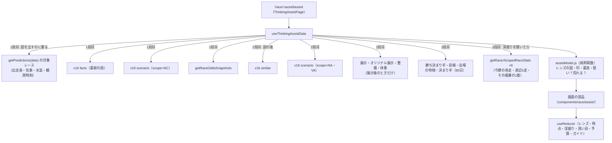

# 思考アシスト plan（BOA-430）

- 入力: [spec.md](./spec.md)（FR-1〜11・FR-3a、D-1〜D-34）、[screens.md](./screens.md)、承認モック [mock/APPROVED.md](./mock/APPROVED.md)（v7、Artifact Version 10）
- 種別: UI だけの新規ページ。新しいテーブル・カラム・マイグレーション・バッチは無い（spec「やらないこと」）。本番 DB への書き込みも無い
- ADR: [0086 データは既存の関数と v16 API を画面で組み合わせる](../../adr/0086-thinking-assist-compose-existing-sources.md)、[0087 類似レースの割合をどこで数えるか](../../adr/0087-thinking-assist-similar-race-counting.md)（提案中。ユーザーの判断が要る、下「未決」P-1）

## 未決（plan で見つかった、ユーザーの判断が要るもの）

### P-1 類似レースの割合をどの件数で数えるか（D-34「層の全件」が多くのレースで今の API では出せない）
- D-34 で「類似レースの件数は層の全件」に決まった。推奨の根拠は「今日の例（徳山10R、層63件）では v16 の既定 min(400, 層) と同じ値になる」だった
- plan で本番の API を確かめたところ、層は多くのレースで大きい。2026-10-07 の36レース（24場から各1・6・12R の一部）では、層が2,000件を超えたのが31レース（最大58,312件。1号艇A1・勝率差の段階4・勝率トップ1号艇の層）。2,000件以下は5レース（G1 の3レース 1,246〜1,612件と、準優勝戦 786件・優勝戦 317件）で、800件以下は準優勝戦・優勝戦の2レースだけ
- 画面で数えられる範囲: similar API の `neighbors` は似ている順の上位800件まで、layer API の `rows` は新しい順の2,000件まで。どちらも、層が大きいと層の全件にならない。層の全件の1着・万舟・3連単を返す API は無い
- 案は ADR 0087。推奨は **(C) 龍神ソナーと同じ「似ている順の上位 min(400, 層) 件」**。理由: 呼び名「類似レース」と用語の「?」の「龍神ソナーの類似レースと同じ」（D-20）が、そのまま本当になる。新しいバッチが要らない。今日の例（63件）は D-34 と同じ値。層の全件にしたいなら (A) バッチ（BOA-271 のレーン）に層の集計を足す必要がある
- 推奨の誤りの記録: D-34 の推奨は、層が小さい準優勝戦の例だけで判断していた（作る側の抜け）

### P-2 徳山の決まり手の期間
- モックは直近1年（2,196レース）を DB から数えた。既存の関数 `getWinningTechniqueStats` は直近90日だけ返す
- 推奨: 直近90日に変え、見出しを「直近90日」にする（新しい集計を作らない。既存の会場ページと同じ値になる）。判断が割れる話ではないので、P-1 と一緒に一言確認する

## 全体の構成



- 1段目が揃ったら図を描く（N-5 の2秒）。2段目は届いた所から埋める。3段目は深掘りを開いたときに、その艇から取る（spec U-5 の判断: 開いたときに取る。6艇分を最初に取ると、今節の各走の表のためだけに6本の問い合わせを毎回出すことになる）。6艇比較で「今節」「平均ST の直近5走」を出すときは、6艇分を取り揃えてから出す（読み込み中の表示）

## データ（使う関数と取り出し方）

すべて既存。新しい集計・API・テーブルは作らない（ADR 0086）。

| 画面の値 | 出どころ | 取り出し方・注意 |
|---|---|---|
| 出走表（級・名前・勝率・当地・F・年齢・体重・モーター2連率） | `getPredictions(date)` の対象レースの players、`getRaceEntryOfficialRatesBreakdown`、`getRaceEntryWeights` | RaceDetailPage と同じ取り方（date はレース ID から） |
| 気象（風・波・天候・気温・水温・観測時刻） | `getPredictions` の `weather{…, waterTemperature, observedAt}` | 展示前は出さない（FR-2） |
| 時点（展示前／展示後）と v16 の状態 | v16 facts の `status`（`resolveStatus`） | 展示後の段があれば展示後を既定。文言は v16 screens「状態」にそろえる（FR-11） |
| 6艇中の今日の順位・今日の値 | facts `today.items{values, positions}` | 差がつく材料の札・盤の印 |
| 差がつく材料 | facts `facts[範囲]` を `factRows`（analogyFacts.js） | judge は v16 のまま。範囲は `today.scope_keys[艇]` |
| 全国・級の並びが同じ（件数・1号艇の1着・万舟） | scenario `scope=NC` の `cells.all.forms.any.{n, b1_win, manshu, payout_known}` | 返還を除く母集団（D-25・U-7。差がつく材料の 3,339件は返還を含むので、件数が違う理由を畳んで書く） |
| 全国の全レース（比べる基準） | scenario `scope=NA` の同じセル | 全レース共通の値。万舟の分母は `payout_known` |
| 徳山の全レース（参考の線） | scenario `scope=VA` の同じセル（返還を除く）と、facts `VA` の `usual["1"].win`（返還を含む） | 2種類を「件数が違う理由」に書く（Codex F01） |
| 形・進入・手がかり・攻める艇 | scenario（NC）`cells.*`・`hints`・`attack` | 1号艇の範囲。既存の `slitForms`・`entryType`・`hintRows` |
| 風速の区分の艇番別1着 | facts `VA` の `wind[区分]` | 区分は展示後 `exhibition.wind_band`、展示前は出さない。`windWaveView` を使う |
| 類似レース（件数・1着・決まり手・万舟・3連単） | similar の `neighbors`・`n_layer`・`conditions` | 件数の定義は P-1。`aggregateNeighbors`・`trifectaList` を使い、万舟は `payout_3tan >= 10000` を数える小さな関数を足す（analogyAggregate.js に。v16 の画面には使わない） |
| 展示・展示ST・オリジナル展示・チルト・部品交換 | `getRaceExhibitionTimeBreakdown`・`getRaceStPredictabilityBreakdown`・`getRaceOriginalExhibition`・`getRaceMotorMaintenanceBreakdown` | 展示後だけ。F の展示ST は最良の候補から外す（raceIndicators と同じ） |
| 前検タイムと順位 | `getMeetScoreboard(raceId, venueCode).pretestByRacer` | 深掘り |
| 今節の各走（日・R・進入・ST・展示・着・点）、今節より前の5走、その艇番の1着 | `getRacerScopedRaceStats(racerId)`（直近2年）を `buildMeetResults`・`getRecentRaces`（basicInfoStats.js）で絞る | 今節の平均着順点は v16 `today.items.series_score`（前日まで）。表の平均の式は `SCORE_POINTS`（seriesPoints.js）で、v16 の値と一致を確かめる（再現テスト） |
| 勝ち決まり手（直近90日） | `getRaceTechniqueProfileBreakdown(raceId)` | 深掘り |
| 会場の特徴（水質・型・決まり手） | `getVenueCharacteristics`・`getWinningTechniqueStats` | 期間は P-2 |
| オッズ（3連単120通り・取得時刻） | `getRaceOddsSnapshots`（最新の行）。当日・締切90分前以内は `fetchLiveOdds` を押したときだけ | 自動更新しない（FR-8） |

- 部品交換・欠場など v16 の状態の扱いは v16 と同じ（欠場があれば v16 の部分を出さない。図・買い目は5艇で描く。screens「状態」）
- 優勝戦・準優勝戦の判定は v16 の `today.round`（`hidesSeriesScoreLine`）

## コンポーネントと置き場所

```
src/pages/ThinkingAssistPage.jsx          ページ。ルート・フラグ・データ・状態の束ね
src/hooks/useThinkingAssistData.js        3段の取得（上の図）。各取得は {status, data} で返し、失敗は部分ごとに
src/utils/assistModel.js                  純粋関数: レンズごとの図のモデル・印・最良（bestOf）・堅い？荒れる？の判定・級の並び
src/utils/oddsMath.js                     合成オッズ・人気順・配分（均等／均等払戻）・丸めた後の倍率の幅・点数（RaceOddsListTab から移す）
src/data/thinkingAssistCopy.js            ja 専用の文言・用語の「?」（morningDigestCopy.js と同じ方式）
src/data/theoryCatalog.js                 セオリーカードの辞書（screens「セオリーカードの最初の組」）
src/components/race/assist/
  AssistViewSwitch.jsx                    上部の「出走表とタブ／思考アシスト」（D-22。RaceDetailPage でも使う）
  AssistHeader.jsx                        会場・R・ラウンドの「傾向 ›」・気象・時点・オッズの時刻
  RoughCard.jsx                           堅い？荒れる？の枠（小さいバー2本＋級の並びの絵）
  ClassLineup.jsx                         級の並びの絵（固定の艇＋入れ替わってもOK）
  LensBar.jsx                             レンズ・問い・使い方の1行・ガイドの切り替え
  RaceLaneBoard.jsx                       案②レーン（図・数字・印・何着の候補・6艇比較の2段目）
  LensSummary.jsx                         軸・展開・機力・買い目の要約（中で4つに分ける）
  BoatDeepDive.jsx                        深掘り（札・値・今節の並び・1走ずつの表・差がつく材料）
  RunsTable.jsx                           1走ずつの表（今節・今節より前の5走）
  BaseBar.jsx                             基準つきバー（D-21）と普通のバー。数字は押すと開く
  ScopeTable.jsx                          「数え方は2つ」の条件の表（畳む）
  BottomSheet.jsx                         シートの枠（role="dialog"、Esc・背景で閉じる、フォーカスを戻す）
  TheorySheet.jsx / GlossarySheet.jsx / VenueSheet.jsx / MarkSheet.jsx
  BetFooter.jsx / BetSummary.jsx          固定フッターと組んだ買い目（配分・注意）
  GuideOverlay.jsx                        ガイド5段（光らせ・吹き出し・フッターを隠す）
  ThinkingAssist.css                      トークンだけで書く（N-7）
```

- 再利用（`.claude/rules/component-reuse.md`）: `BoatBadge`、`BOAT_COLORS`・`BOAT_LINE_COLORS`、`bestOf`・`.ind-best`（FR-3a）、`wilsonInterval`、analogy の `TechniqueBars`・`TrifectaList`・`SlitShapeIcon`。analogy の部品のうち文言を中の i18n（`aiPredictionTab.analogy.*`）で引くものは、そのまま使えるもの（棒・3連単の並び）だけ使う。v16 の文言は変えない（spec 回答3）。シート・用語集の部品は既存に無いので新しく作る（`TermHintButton` はツールチップで、表・絵を出せない）
- `oddsMath.js` への移動（Codex U03）: `compositeOdds`・`formatOdds`・`latestSnapshotWith` を `RaceOddsListTab.jsx` から移して export し、`RaceOddsListTab` は import に変えるだけ。計算は変えない。移す前後で既存タブの表示が同じことを E2E（既存の直前情報・オッズのテスト）で確かめる
- 3連単の人気順・配分・丸めた後の倍率の幅は新しく `oddsMath.js` に書く（既存に無い）

## 状態

`useReducer` 1つ（ページの中だけ。URL・localStorage に残さない。FR-7・FR-11）。

| キー | 中身 | 既定 |
|---|---|---|
| lens | axis／flow／power／bet | axis |
| stage | pre／post | 展示後の段があれば post |
| deep | 艇番 or null | null |
| metric | 6艇比較の項目 or null | null |
| runsOpen | 1走ずつの表の開閉 | false |
| bets | {1:Set, 2:Set, 3:Set} | 空 |
| budget・mode | 予算・均等／均等払戻 | 1000・均等払戻 |
| guide | 段 0〜4 or null | null |
| sheet | 開いているシート（種類と ID） | null |

- 例外: 上部の切り替え（D-22）だけ、選んだ方を `localStorage["boatai-user:race-view"]`（"assist"／"classic"）に残す。読み書きは try/catch（featureFlags.js と同じ）
- 艇を選ぶ操作は既存の `?boat=` の URL クエリ（ADR 0084）とは別。思考アシストの深掘りは URL に残さない（FR-7 と同じ扱い）

## ルート・機能フラグ・入口

- ルート: `src/AppRouter.jsx` の `LocalizedRoutes` に `race/:raceId/assist` を足す。ja 専用なので `lng === "ja"` のときだけ登録する（ほかの言語は NotFound）。`/race` は `TRANSLATED_PATHS` に前方一致で入っているので、`languages.js` の翻訳済みの判定から `/race/{id}/assist` を外す（hreflang・言語切り替えに出さない）。`/today` と同じ「ja 専用」の区分（`.claude/rules/i18n-new-pages.md`）
- 機能フラグ: `featureFlags.js` に `THINKING_ASSIST_PUBLIC = false` と `?assist=1`（`boatai-user:thinking-assist-preview`）を足す。既存の `readPreviewFlag` を、キーとクエリ名を引数で受ける形にまとめて両方で使う（DRY）
- フラグが無いとき: `/race/{id}/assist` は開ける（URL 直接。spec FR-1）。レース詳細に切り替えを出さない
- フラグがあるとき: RaceDetailPage の `page-header` の直後（タブの外、`RaceDetailPage.jsx` の header と読み込みの分岐の間）に `AssistViewSwitch`。`boatai-user:race-view` が "assist" なら、レース詳細を開いたときに思考アシストへ移る（D-22「選んだ方を次も開く」）。移るのは同じレース ID のまま
- `pageViewPath`（`raceUrlState.js`）の RACE_PATH に /assist を足す（GA4 のページ種別を分ける）

## 最良の色・着順の色（FR-3a）

- `assistModel.js` の `bestBoats(items)` が、項目ごとに `bestOf(candidates, dir, {digits})` を呼んで Set を返す。向きと桁の表は spec FR-3a（既存の `raceIndicators.jsx` と同じ）。表と図はその Set を見て `.ind-best` を付けるだけ
- 着順の色は `RaceHistoryTable.css` の 1着＝金・5・6着＝赤と同じ指定を、トークンで書く（既存の CSS をコピーせず、同じトークンを使う）

## 堅い？荒れる？・基準つきバー

- 判定は `wilsonInterval`（wilson.js）で、ぶれ幅が全国の全レースの値と重ならないときだけ高め・低め（D-21）。`judgeGap`（v16）とは別物（v16 は2つの率の差の判定）なので混ぜない
- n＝0（層が空・範囲の件数が0）は、その行を出さず「数えるレースが無い」（Codex U02）

## テスト

| 何を | どこで |
|---|---|
| 合成オッズ・人気順・点数（同じ艇の重複を除く）・均等／均等払戻の配分・丸め・余り・最低額の判定（F05）・丸めた後の倍率の幅（F06） | `scripts/maintenance/verify-odds-math.js`（verify-registry に `ci` で登録。手計算の固定の値で） |
| 級の並びの範囲・最良の Set・優勝戦の日の今節の点の扱い（F03）・展示前の文の出し分け（F04）・堅い？荒れる？の判定・類似レースの万舟の数え方 | `scripts/maintenance/verify-thinking-assist-model.js`（同上。モックの徳山10R の値を固定データに） |
| 今節の平均着順点の式と v16 の値の一致（8.57＝60点÷7走） | 同上 |
| 受け入れ（spec・screens だけから） | `e2e/acceptance/thinking-assist.spec.js`（acceptance-test-writer。v16 の応答は `analogy-v16-fixture.js` の方式で固定） |
| ルート・フラグ・既存タブに影響が無い | `e2e/smoke.spec.js` に1本（フラグ無しで切り替えが出ない、`/race/{id}/assist` が開く） |
| 5幅の横スクロール | `e2e/layout.spec.js` の `PAGES` に足す |
| 承認モックとの差 | `mock-diff-checker`（画面の PR で CI が緑になった後） |

- 新しい集計は無いので `data-accuracy-verifier` は対象外（spec N-8）。ただし類似レースの万舟（P-1）と範囲の件数の取り出しは、モックの値（DB から数えた）と API から取った値が一致することを verify で固定する

## i18n

- ja 専用（spec 既定値）。文言は `src/data/thinkingAssistCopy.js` にまとめ、`t()` を通さない。`verify-jsx-japanese.js` の ROOTS に入る `RaceDetailPage.jsx` から import する `AssistViewSwitch` だけは、4言語のキー（`raceDetail.assistSwitch.*`）を足す（レース詳細は翻訳対象のため）
- 公開前に区分を決め直す（spec U-4）

## 実装の順（tasks.md で分ける）

1. 共通の下ごしらえ: `oddsMath.js` への移動（既存の挙動は変えない）、`featureFlags` の共通化、ルートと ja 専用の判定
2. データの取得（`useThinkingAssistData`）と `assistModel.js`（純粋関数と verify）
3. 画面の骨格: ヘッダー・堅い？荒れる？・レンズ・案②レーン・固定フッター
4. 各レンズの要約と深掘り・1走ずつの表・6艇比較
5. シート（セオリー・用語・会場・マークシート）とガイド
6. 上部の切り替え（RaceDetailPage 側も）
7. 受け入れ E2E・layout・smoke・mock-diff-checker・ファン評価ループ（新しいページなので「ファン評価あり」）

## リスク

- 問い合わせの数: 1レースで最大およそ20本（6艇分の選手の成績は深掘りを開いたときだけ）。v16 の API は60秒キャッシュ、Supabase の関数は既存の `boatai:` キャッシュを通る
- v16 の展示後の段が作られていない日（handoff §4、`exhibition_missing`）: 展示後の値は展示の取得関数から描き、v16 の展示後の部分（展示の形・手がかりの今日）は出さない（FR-11）
- 1号艇の展示タイムの偏り（約0.02秒）: 展示の最良の金枠は既存と同じ判定で付ける（既存のレース詳細も補正していない）。注記の札は残す
