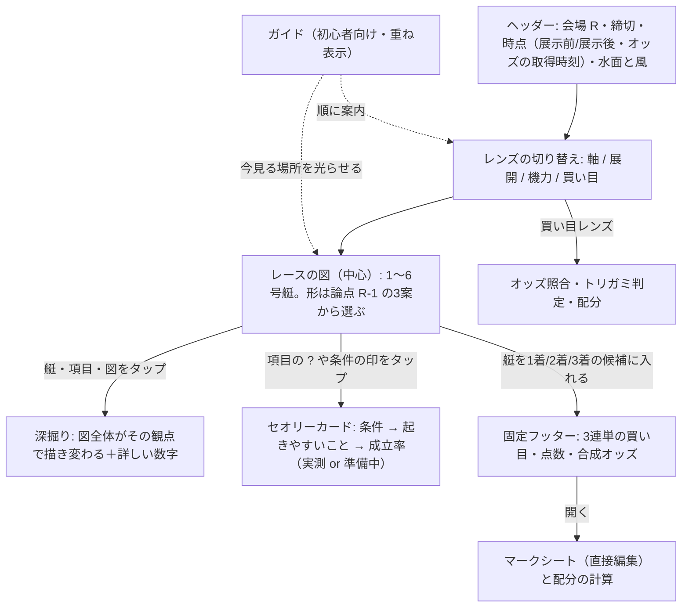

# 思考アシスト spec

種別: UI機能（新規ページ。集計の新設は無く、BOA-271 v16 の API と既存のサービス関数を読む）
対応Linearチケット: BOA-430（関連: BOA-271 v16 龍神ソナー、BOA-277、BOA-274、BOA-426）

- 入力: [request.md](./request.md)（BOA-430 本文・v16 との差分・ユーザーの好み）、[handoff.md](./handoff.md)（ユーザー回答 1〜4・食い違い (a)〜(e)・思考フレームワークの要件、2026-10-06 確定）
- 承認の流れ: この spec → screens.md → Artifact のモック（出走表の形は3案を並べる）→ ユーザー承認 → plan・tasks → 実装。モック承認まで実装しない
- 見せ方の判断は案＋推奨でオーケストレーター経由でユーザーに出す（代理判定・自動マージなし）

## コンセプト（ユーザー原文、2026-10-06。この spec の土台）
- 初心者から上級者までのありとあらゆる予想スタイルの一助となるサイト
- 既存大手サイト(日和)の数字が多くて迷うという課題を解決したい
- ありとあらゆるセオリーをユーザーが覚えてなくても、必要な時にポンって感じで表示してくれるサイト
- 現状のボートレースにありがちなUI(出走表)をどうすべきか、も議論の一つ。ユーザーはそのUIに慣れているはずだが、数字が多くて脳内処理が増える原因の一つでもある
- 図やグラフ、絵などで新感覚
- ユーザーが見たい情報をタップしたり、深堀したいときに、画面全体がアクティブに図やグラフ、数字などを表示されるようなるイメージ。(ユーザーは表示されるものをただ見るのではなく、深掘りすることが可能なUI/UX)
- 迷わずにユーザーが考えるスタイルで新感覚UI/UXを実現したい

## 位置づけ
- 目的は「数字だらけで認知負荷が高い」を軽くすること。最初は数字を少なく、図で見せ、ユーザーがタップした所だけ数字を出す
- 出すのはデータとセオリー（知識）。モデルの指数・AIの推奨買い目は出さない（下「生データ主義の意味」）
- 予想を組み立てるのはユーザー。ページは見る順番（ガイド）と、関係するデータ・セオリーを近くに出す
- 龍神ソナー（BOA-271 v16）とは役割を分ける。龍神ソナーは「過去レースの傾向を深く見る節」、このページは「1レースの予想を組み立てる場所」。数えた値は v16 の API をそのまま使い、新しい集計は作らない

### 生データ主義の意味（食い違い (e)、2026-10-06 確定）
- 出さない: モデルの指数・スコア、AIの推奨買い目・本命印、AIの見立て（SHAP の割合。v16 FR-E）、既存の AI 予想（展開予測・イン崩れ注意度・Holmes 等）
- 出してよい: 公式のデータ、過去レースの集計（件数・割合・ぶれ幅）、6艇の中の順位、それらを図・グラフにしたもの、オッズとそこから計算した値（人気順・合成オッズ）
- 文言は「過去レースの傾向」系にする（「AIの予想ではない」「過去レースを数えた値」は使わない。request.md §1）

## 画面の骨格

一本道のウィザードにしない（食い違い (c)）。1つの画面の中心に「レースの図」を置き、上の「レンズ」で見方を切り替える。初心者にはその上に「ガイド」を重ねる。買い目はどのレンズでも下に固定で残る。

## 論点 R-1 出走表の形（モックで3案を並べ、ユーザーが選ぶ）

食い違い (b)。公式の出走表に慣れている一方で、数字の多さが負荷の原因になっている。3案を同じレース・同じレンズで描き比べる。

| 案 | 中心の図 | 慣れ | 図での見やすさ | 375px での密度 |
|---|---|---|---|---|
| ① 公式の縦並び＋数字を図に | 1〜6号艇の行。各行の数字を小さな棒・点・順位の印に置き換え、数字はタップで出す | 高い | 中（行の中の小さな図） | 1行に図2〜3個 |
| ② 6艇のレーン | 横に「スリット（スタート）」、縦に1〜6コース。レンズに応じて、艇の位置・矢印（攻め）・帯（足）などを重ねる | 中（スリット表は見慣れている） | 高い（展開・スタートが一目） | 図1枚＋下に1行ずつ |
| ③ 艇ごとのカード | 1艇1枚のカード（上下2段）を縦に6枚。カードの中に、そのレンズの図を1つ | 中 | 中 | カード6枚で縦に長い |

- どの案も残すもの: 1〜6号艇の上からの並び、公式の艇色（白・黒・赤・青・黄・緑、`src/utils/colors.js` の `BOAT_COLORS`）
- どの案も守ること: 最初の表示で1艇あたりの数字は2個まで（非機能要件 N-2）。それ以上はタップで出す
- 推奨は screens.md で、ファンパネル（`discussion-panel`）を通してから書く。決めるのはユーザー

## 思考フレームワーク一覧と対応表（ユーザー追加要件、2026-10-06）

ボートレースの予想スタイルを洗い出した一覧。モックと最終の UI がそれぞれの思考に沿っているかを、下の対応表で最終チェックする（受入基準 FR-9）。出典: request.md の deep research 節・セオリー一覧（Gemini の整理）、外部の解説（[kcbn.jp セオリー20選](https://kcbn.jp/theory/)、[cosboa スジ舟券](https://www.cosboa.org/knowledge/sujihunaken/)、[boat-gold イン逃げしやすい場](https://boat-gold.com/boat-race-inside-run/)）。外部の数値は転記しない。

| # | フレームワーク | 何を考えるか | 主に見るデータ | データ | 主なレンズ |
|---|---|---|---|---|---|
| FW-01 | イン信頼型 | 1号艇が逃げるか。逃げるなら2・3着を絞る | 1号艇の級別・勝率・1コース成績、会場のイン1着率、差がつく材料（1号艇の1着） | あり | 軸 |
| FW-02 | イン崩れ・波乱狙い | 1号艇が負ける条件があるか | 1号艇の平均ST・F持ち、2号艇の壁、風、展示 | あり | 軸 |
| FW-03 | 壁読み | 2・3コースが壁になるか（F持ち・スタートが苦手で壁が壊れるか） | 2・3号艇の平均ST・F本数・コース別成績 | あり | 軸・展開 |
| FW-04 | 進入読み | 前付け・枠なり・深インになるか | 枠なり率・展示進入・進入の型（v16 ①） | あり（起こし位置は無し） | 展開 |
| FW-05 | スタート・スリット読み | スリットでどこが凹み、どこが出るか | 平均ST（コース別）・展示ST・スリットの7形・手がかり（v16） | あり | 展開 |
| FW-06 | 1マークの展開読み（決まり手） | 誰がまくる・差すか | 決まり手の傾向、類似レースの決まり手（v16） | あり（コース別の差し・まくり差しの回数は無い） | 展開 |
| FW-07 | スジ買い | 決まり手から2着以降を連動させる（3まくりなら3-4 等） | 攻める艇・スリットの形ごとの結果（v16 ③④）・着順の流れ | あり | 展開・買い目 |
| FW-08 | 機力重視 | モーターの良し悪し | モーター2連率・今節の成績 | あり | 機力 |
| FW-09 | 展示重視 | 当日の足色 | 展示タイム（順位と差）・展示ST・オリジナル展示（会場ごと）・今節の展示タイムの推移 | あり（展示後） | 機力 |
| FW-10 | 調整読み | チルト・部品交換・体重から意図や不調を読む | チルト（6艇の中での違い）・部品交換（事実だけ）・体重 | あり（展示後） | 機力 |
| FW-11 | 選手買い（格） | 実力の高い選手・推しの選手 | 級別・全国勝率・2連率・直近の1着率 | あり | 軸（艇のタップ） |
| FW-12 | 当地・コース巧者 | この会場・このコースが得意か | 当地勝率・コース別1着率・コース別平均ST | あり | 軸・展開 |
| FW-13 | 今節の調子・勝負駆け | 今節の成績と、予選突破に必要な着順 | 節間成績・得点率・必要得点・今節の平均ST | あり | 軸・機力 |
| FW-14 | 水面・気象読み | 会場の特徴と、風・波でイン有利か外有利か | 会場のコース別成績・風速・波高（v16 今日の風・波） | あり（追い風・向かい風の区別は無い） | ヘッダー・展開 |
| FW-15 | 潮読み | 満潮・干潮で水面が変わる | 潮位・潮の時刻 | 無し | セオリーカード（文のみ） |
| FW-16 | 番組・ラウンド読み | 企画レース・グレード・優勝戦/準優勝戦 | 級別の組み合わせ・グレード・ラウンド | あり（企画レースの判定は無い） | ヘッダー・軸 |
| FW-17 | 過去傾向・類似レース | 似た条件のレースはどう決まったか | 類似レース・よく出た3連単・差がつく材料（v16） | あり | 展開・買い目 |
| FW-18 | 穴狙い | 人気薄が来る条件があるか | 人気順・オッズ・展示の良い外の艇・万舟の割合（v16 ④） | あり | 機力・買い目 |
| FW-19 | オッズ・妙味型 | 人気と実力のずれ | オッズ・人気順と、データ上の位置の並べ比べ | あり | 買い目 |
| FW-20 | 点数絞り・資金配分 | トリガミを避け、予算をどう割るか | 合成オッズ・配分の計算 | あり | 買い目 |
| FW-21 | 初心者（何を見ればいいか分からない） | 見る順番が欲しい | ガイド | ― | ガイド |

対応表（screens.md とモックで埋め、最終の UI でもう一度確かめる）の列:

| # | レンズ | どこをタップ | 何が出るか（図・数字） | セオリーカード | 最初の表示の数字 |
|---|---|---|---|---|---|

- 全21行を埋める。「データ無し」の行（FW-15 等）は「セオリーカードの文のみ（成立率は準備中）」と書いて埋める
- 1つのフレームワークに必要なタップは3回以内（非機能要件 N-3）

## 機能要件

優先度: P0＝モックと本実装の両方に必須、P1＝本実装に必須（モックは静的でよい）、P2＝本実装の後半・公開時

### FR-1 ページと入口（P0）
- 新しいルート `/race/:raceId/assist`（raceId は `YYYY-MM-DD-VV-RR`）。言語プレフィックスの下には置かない（ja 専用で始める。下「既定値」）
- 既存のレース詳細・出走表・タブは変えない（BOA-430 本文 思想5）
- 公開までは入口を出さない。URL を直接開いたときだけ見える。機能フラグは `src/config/featureFlags.js` に足す（`?assist=1` で覚える既存の方式に合わせる）
- 公開時（P2）にレース詳細の上部（タブの外）に入口を1つ置く。AI予想タブの中には置かない（回答4）
- 龍神ソナーへ「もっと詳しく見る」で行ける（request.md §3 導線）。AI予想（展開予測・イン崩れ注意度）とは直接つながない
- 受入基準: フラグが無い状態でレース詳細に入口が出ない。`/race/{id}/assist` を開くと表示される。既存の E2E（smoke）が変わらず通る

### FR-2 ヘッダー（P0）
- 会場・R・締切時刻・グレード・ラウンド（優勝戦/準優勝戦は v16 の判定）・級別の組み合わせ
- 水面と気象: 天候・風向・風速・波高・気温・水温（観測時刻つき）。図（風の矢印・波の段）で出し、数字は小さく
- 時点: 「展示前」「展示後」。v16 の `status` に従う（展示後の段が保存されるまで展示後は選べない。文言は v16 screens「状態」を使う）。オッズは「{HH:MM}時点のオッズ」（取得時刻）
- 受入基準: 展示前に展示タイム・展示ST・チルト・部品交換・展示進入・風・波が出ない。オッズの時刻が出る

### FR-3 レースの図（中心）（P0）
- 1〜6号艇を論点 R-1 で選んだ形で描く。どのレンズでも同じ図の上に、レンズの内容を重ねる
- 最初の表示は図と最小の数字（N-2）。数字はタップで出す
- 艇をタップ: その艇の深掘り（FR-5）。艇を買い目の候補に入れる操作（FR-7）とは別の操作にする（誤操作を避ける）
- 受入基準: レンズを切り替えても艇の並び・色・位置が変わらない（重ねる内容だけ変わる）

### FR-4 レンズ（P0）
4つ。切り替えの位置は screens で決める。どのレンズでも買い目（FR-7）は残る。

| レンズ | 問い | 図に重ねるもの（例。確定は screens） | データの出どころ |
|---|---|---|---|
| 軸 | 1号艇は逃げるか、誰が1着候補か | 1号艇の信頼の目安（範囲での1号艇の1着率と件数）、2・3号艇の壁（平均ST・F持ち）、差がつく材料のうち差が大きい項目（judge=large）の印 | v16 facts（today・facts の VC/NC）、出走表（F本数・級別・勝率）、コース別成績 |
| 展開 | スタートでどこが出て、誰が攻めるか | スリット（平均ST の並び、展示後は展示ST）、手がかりが当てはまる形、進入の型、攻める艇の矢印、類似レースの決まり手 | v16 facts の course_st・hints、scenario、similar、展示データ |
| 機力 | 足が良いのはどの艇か | モーター2連率の順位、展示タイムの順位と差（1号艇は速く出やすい注記）、オリジナル展示（会場ごとの項目）、チルトが6艇の中で違う艇、部品交換の事実 | 出走表、展示データ、オリジナル展示 |
| 買い目 | 組んだ買い目はオッズに見合うか | 買い目ごとのオッズと人気順、合成オッズ、トリガミの判定、配分、類似レースでよく出た3連単（参照） | オッズのスナップショット、v16 similar |

- 「差がつく材料」は v16 の判定（`factRows` の judge）をそのまま使う。AIの見立て（FR-E）は出さない（回答2）
- 受入基準: 4レンズの切り替えで買い目・選んだ艇が保たれる。どのレンズにもモデルの指数・AIの推奨が出ない

### FR-5 深掘り（タップ）（P0）
- 艇・項目・図の部分をタップすると、画面全体がその観点で描き変わる（例: 2号艇の平均ST をタップ → 図が6艇の平均ST の比較になり、2号艇のコース別の平均ST が広がる）。コンセプト「画面全体がアクティブに」
- 戻る操作は1つ（閉じる・もう一度タップ）。深掘りの中でさらに1段だけ開ける（2段まで）
- 選手の詳しい情報（級別・勝率・当地・コース別・今節）は艇のタップで出す（FW-11〜13）
- 受入基準: ページを開いたときに取ったデータで描ける深掘りは、取り直しの待ちが出ない。6艇分のコース別成績のように後から取るものは、読み込み中を出す

### FR-6 セオリーカード（P0）
食い違い (a)。覚えていなくても、必要なときにポンと出る知識。

- 出し方: 項目・図の部分の「?」、または「今日当てはまる」の印をタップすると、その場にカードが出る（画面を移らない）。どの項目にカードがあるかの一覧は screens で決める
- カードの形: 条件 → 起きやすいこと → 自前DBでの成立率（件数・ぶれ幅・成り立たなかった割合も）
- 成立率を実測で出すもの（v16 のデータで数えられるもの）:
  - スリットの7形（形ごとの1号艇の1着率・攻める艇の1着率。scenario）
  - 進入の型（型ごとの出現率・1号艇の1着率。scenario）
  - 平均STの手がかり8条件（当てはまるとき/当てはまらないときの形の率。hints）
  - 差がつく材料（項目が6艇で一番良い/悪いときの率。facts）
  - 1号艇の展示タイムの偏り（同じ選手でも1号艇のとき約0.02秒速い。v16 T1-5）
- それ以外のセオリー（風・潮・チルト・F持ち・企画レース・会場の法則・スジの一般論など）は文だけで、成立率の欄は「準備中」
- 「今日当てはまる」の印は、v16 が今日の値で既に判定しているもの（手がかりの当否・展示の進入の型・展示の形・差がつく材料の今日の位置）にだけ付ける。新しい自動検出は作らない
- 相反するセオリーが同時に当てはまるときは両方出す（例: 追い風＝イン有利 と 強い追い風＝1が流れて差し）
- 表現: 「〜が起きやすい傾向」＋件数・率。「鉄板」「大本線」等の断定・利益保証は使わない（`sns-video-studio/remotion/risk-rules.json`）。外部記事・Gemini の数値は転記しない
- 受入基準: 実測のカードに件数と率と範囲が出る。準備中のカードに数値が出ない。「今日当てはまる」の印が v16 の判定と一致する

### FR-7 買い目（固定フッター）とマークシート（P0）
- 券種は3連単だけ
- フッターに常に: 買い目の要約（例「3連単 1-34-2345（6点）」）・点数・合成オッズ（オッズがあるとき）
- 1着・2着・3着の候補を艇ごとに入れる操作（どのレンズでも）。フッターを開くとマークシート風の編集（1着/2着/3着×1〜6）
- 状態はページ内だけ（URL・localStorage に残さない）。レンズの切り替え・深掘りで消えない
- 受入基準: 候補の組み合わせから点数が正しく出る（同じ艇の重複を除く）。レンズを切り替えても買い目が残る。再読み込みで消える

### FR-8 オッズ照合と配分（買い目レンズ）（P1）
- オッズ: 最新のスナップショット（`race_odds`、発走60/30/15/10/5/0分前）。当日・締切90分前以内は既存のライブ取得（`/api/odds/live`）で取り直すボタンを置く（自動更新しない）。必ず取得時刻を出す
- 人気順: 3連単120通りのオッズの昇順で付ける
- トリガミの判定: 合成オッズ1.0未満をトリガミとして印を付ける（固定の10倍基準は使わない）
- 配分の計算: 予算を入れると「均等」と「均等払戻（どれが当たっても払戻がほぼ同じ）」を計算する。100円単位で丸め、丸めた後の払戻と合成オッズを出す
- 出さないもの: ケリー基準など「いくら賭けるべきか」の推奨、期待値の判定（下「未確定」U-3）
- 注記: オッズは締切まで動く。フライング・欠場があると返還で配当が変わる
- 受入基準: 合成オッズ＝1÷Σ(1/オッズ) が手計算と一致。配分の合計が予算以下。オッズが無いレースでは計算を出さず1行で知らせる

### FR-9 思考フレームワークの対応表（P0）
- 上の一覧の21行すべてについて、モックと最終の UI で「どのレンズ・どのタップで何が出るか」を対応表に書き、ユーザーに見せる
- 受入基準: 対応表に空欄が無い。各行の操作が3タップ以内（N-3）。モックの承認時と実装の完了時（受け入れ E2E の後）の2回確かめる

### FR-10 ガイド（初心者向けの重ね表示）（P1）
- 同じ画面の上に、見る順番を案内する（例: ①水面と風 → ②1号艇 → ③壁と攻める艇 → ④足 → ⑤買い目）。各段で該当するレンズに切り替え、見る場所を光らせ、一言の問いを出す
- いつでも閉じられる・飛ばせる・戻れる。ガイドを閉じても状態（買い目・レンズ）は残る
- 順番の中身は request.md の「実戦で見る順番」を土台に screens で決める
- 受入基準: ガイドの各段で該当のレンズと場所が示される。閉じても買い目が残る

### FR-11 状態（P1）
- v16 の状態（展示前・展示の反映中・締切後に展示後が無い・欠場・保存が無い・取得の失敗）は v16 screens「状態」の文言にそろえる。v16 のデータが無い部分だけ出さず、出走表・オッズで描ける部分は描く
- 「間に合わない」「失敗」「エラー」の類は出さない（2026-10-02 の決定）
- 受入基準: v16 のデータが無いレースでも、図・買い目・オッズは使える

## スコープ

### やること
- 新規ページ `/race/:raceId/assist`（フラグ付き）、FR-1〜FR-11
- Artifact のモック（出走表の形3案）と承認
- セオリーカードの仕組みと、最初のカードの組（実測5系統＋文だけのカード）
- 公開時の入口（P2）

### やらないこと
- 既存のレース詳細・出走表・AI予想タブの変更（入口の1つを除く）。AI予想タブの整理（request.md §1）
- 新しい集計・バッチ・DB の変更。本番 DB への書き込み
- AIの見立て（v16 FR-E）・既存の AI 予想・指数の表示
- セオリーの辞書の拡充、条件の自動検出の新設、データの棚卸しが要る条件（潮位・起こし位置・深イン・企画レースの判定・周回展示の足色・コース別の差し/まくり差しの回数・F の未消化日数）→ 別チケット
- 3連単以外の券種、ケリー基準、期待値の判定、投票の連携、買い目の保存・共有
- 龍神ソナーの独立タブ化（回答4）

## 非機能要件
- N-1 モバイルファースト: 375〜430px を基準。`npm run test:layout` の5幅で横スクロールなし
- N-2 認知負荷: 最初の表示で1艇あたりの数字は2個まで（艇番・級別などの記号は数えない）。それ以上はタップで出す
- N-3 どの思考フレームワークも、ページを開いてから3タップ以内に主な情報に届く（対応表で確かめる）
- N-4 締切前の短い時間でも読める密度（食い違い (d)。時間で機能を絞らない）
- N-5 表示の応答: ページを開いてから2秒以内に図が出る（v16 の API・既存の取得を並列に。6艇分のコース別成績は後から）
- N-6 a11y: 艇色だけで区別しない（艇番を必ず添える）。図は `role="img"` と aria-label。タップ領域 44px 以上
- N-7 用語: 画面内で「競艇」禁止。`design-tokens.css` のトークン、`!important` 禁止。和文と英数字の間に空白を入れない
- N-8 新しい集計が無いので `data-accuracy-verifier` は対象外。合成オッズ・配分・人気順・点数の計算は再現テストで固定する

## 制約・前提

### 使うデータ（棚卸し 2026-10-06、`src/services/supabaseDataService.js` 等）
| 用途 | 出どころ | 時点 |
|---|---|---|
| 出走表（級別・勝率・2連率・当地・モーター・ボート・F/L・年齢・体重） | `getPredictions` の players、`getRaceEntryOfficialRatesBreakdown`、`getRaceEntryWeights` | 展示前（体重は発走60分前） |
| 展示（展示タイム・展示ST・展示進入・チルト・部品交換） | `getRaceExhibitionTimeBreakdown`・`getRaceStPredictabilityBreakdown`・`getRaceMotorMaintenanceBreakdown` | 展示後（展示進入は 2026-09-21 以降） |
| オリジナル展示 | `getRaceOriginalExhibition`（会場ごとに項目が違う） | 発走30分前ごろ |
| 気象 | race_conditions（観測時刻つき） | 展示の取得時 |
| コース別成績・平均ST | `getRacerScopedRaceStats`（1選手ずつ）＋ `courseGridStats.js`・`stConsideration.js` | 展示前 |
| 今節（節間成績・得点率・必要得点・今節の平均ST） | `getMeetScoreboard`・`seriesPoints.js`・`basicInfoStats.js` | 展示前 |
| 龍神ソナー | `/api/analogy/{facts,similar,scenario}/[raceId]?stage=`、フック `useAnalogyV16.js`、`analogyFacts.js`・`analogyScenario.js` | racecard／exhibition |
| オッズ | `getRaceOddsSnapshots`（race_odds）、`getRaceFinalOdds`、`fetchLiveOdds` | 発走60〜0分前 |
| 艇色 | `src/utils/colors.js` `BOAT_COLORS`・`BOAT_LINE_COLORS`、`BoatBadge.jsx` | ― |

- 無いデータ: 潮汐（BOA-295 でスコープ外）、起こし位置、F の未消化日数、コース別の差し・まくり差しの回数、人気順の既存の並べ替え（このページで計算する）
- v16 の前提をそのまま引き継ぐ: 進入の実データの欠落（BOA-523）、事故情報（BOA-279）。母集団・範囲・ぶれ幅の定義は v16 spec「共通の定義」
- 部品の再利用: `src/components/race/analogy/`（SlitShapeIcon・OutcomeBars・TrifectaList・FinishSankey・RateBar・NoteList 等）は props で文言を渡して使う。v16 側の既存の文言は変えない（回答3）。`.claude/rules/component-reuse.md` に従う
- 法的: 免責文（予想は結果を保証しない）を既存のレース詳細と同じ扱いで置く。投票は扱わない
- 1号艇の展示タイムは系統的に約0.02秒速い（v16 T1-5）。展示タイムの順位を出す所には注記する

## 既定値で決定した事項（ユーザーが後から覆せる）
| 項目 | 既定値 | 根拠 |
|---|---|---|
| トリガミの基準 | 合成オッズ1.0未満 | 点数と配分で閾値が変わるため固定の10倍は誤判定する（request.md Step4 調査） |
| 券種 | 3連単だけ | handoff §1 の既定値 |
| データの時点 | 龍神ソナーは最新の段（展示後があれば展示後）、オッズは最新の取得時点。どちらも時刻を出す | 同上 |
| i18n | ja 専用でモック・実装を始める。公開前に区分を決め直す（`.claude/rules/i18n-new-pages.md`） | 同上 |
| 買い目の保持 | ページ内だけ | 同上。会員・保存の仕組みが無い |
| 最初の表示の数字 | 1艇2個まで（N-2） | コンセプト「数字が多くて迷う」への数値の基準。モックで多すぎ/少なすぎが分かれば変える |
| 深掘りの深さ | 2段まで | 戻り方が分からなくなるのを避ける |
| 人気順 | 3連単120通りのオッズの昇順 | 公式の人気順と同じ考え方 |
| 配分の丸め | 100円単位 | 舟券の最小単位 |
| ページの URL | `/race/:raceId/assist` | BOA-430 本文の例 |

## 未確定事項
| # | 項目 | いつ・誰が決めるか |
|---|---|---|
| U-1 | 出走表の形（R-1 の3案） | モックでユーザーが選ぶ（推奨は screens でファンパネルを通して書く） |
| U-2 | レンズの切り替えの位置・ガイドの段の中身・セオリーカードの最初の組（どの項目に ? を付けるか） | screens.md で案＋推奨、モックでユーザー承認 |
| U-3 | オッズ・妙味型（FW-19）の見せ方: オッズと「類似レースでの出現率」を並べるだけにするか、比べた値（オッズ×出現率）まで出すか。比べた値は期待値の判定に近く、「推奨しない」と衝突しうる | モックで案＋推奨（推奨: 並べるだけ）、ユーザーが決める |
| U-4 | 公開時の i18n 区分 | 本実装の後半（公開前）にユーザー |
| U-5 | 6艇分のコース別成績を開いたときに取るか、深掘りで取るか（N-5 との兼ね合い） | plan.md（技術判断） |
| U-6 | 公開の時期と入口の文言 | 公開前にユーザー |
