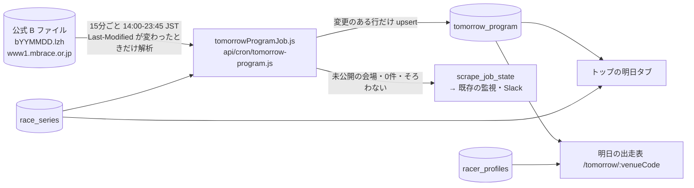
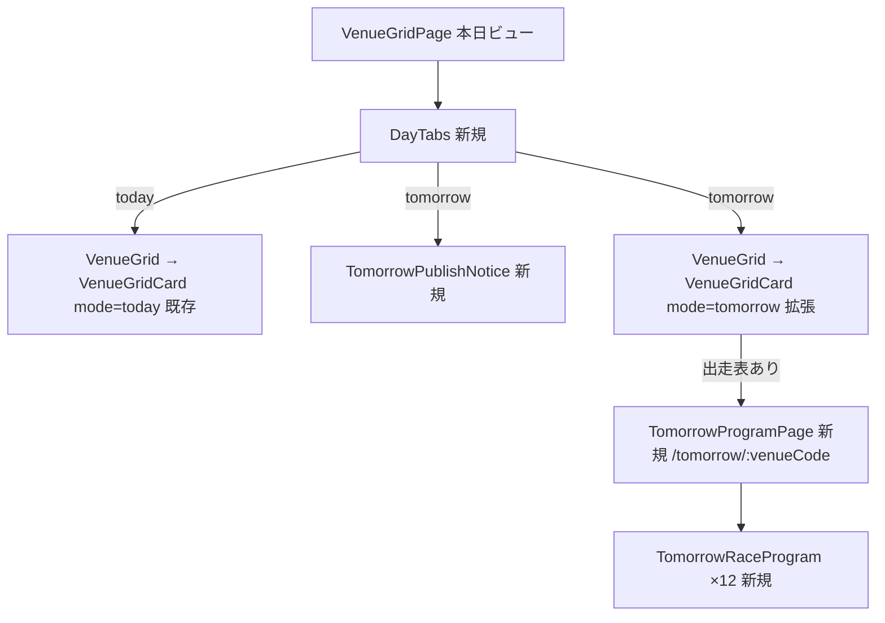

# 明日の出走表 plan

spec: [spec.md](./spec.md) / screens: [screens.md](./screens.md) / ADR: [0084](../../adr/0084-tomorrow-program-separate-table-from-b-file.md)

## 1. 全体の流れ



当日の流れ（races・race_entries・朝の初期化・予想）には一切触れない。

## 2. データ設計

マイグレーション案: [`docs/db-migration/123_tomorrow_program.sql`](../../db-migration/123_tomorrow_program.sql)（未適用。コードのマージより先にユーザーが適用する）

```mermaid
erDiagram
    tomorrow_program {
        date race_date PK
        smallint venue_code PK
        smallint race_number PK
        smallint boat_number PK
        text series_title
        smallint series_day
        boolean is_final_day
        text stage
        smallint distance_m
        time deadline_time
        integer racer_id
        text racer_name_raw
        smallint age
        text branch
        smallint weight
        text class
        numeric(4,2) national_win_rate
        numeric(5,2) national_2rate
        numeric(4,2) local_win_rate
        numeric(5,2) local_2rate
        smallint motor_number
        numeric(5,2) motor_2rate
        smallint boat_id
        numeric(5,2) boat_2rate
        text series_results_raw
        timestamptz source_modified_at
        timestamptz created_at
        timestamptz updated_at
    }
```

- 1行＝1艇。レース・節の項目は艇の行に重ねる（1日最大1,728行。表を分けるほどの量ではない）
- 名前は B ファイルの表記のまま（4文字で切れる）。正式名は画面が `racer_profiles`（匿名で読める）から登番で引く。未登録は B の名前
- `source_modified_at`（B ファイルの Last-Modified）と `created_at`・`updated_at` で、公開→取り込みの遅れを実測する
- 外部キー・既存テーブルへのリレーションは無し（`racer_id` は `racer_profiles.racer_id` と同じ値だが FK は張らない。新人の未登録で取り込みを止めないため）

### 書き込み量（Disk IO）

- 1日: 初回の最大1,728行の INSERT。以降は B ファイルの更新（夕方〜夜に数回）で値が変わった行だけ UPDATE（実測では準優・選手交代等で数十〜数百行）
- Last-Modified が変わらない tick は解析も書き込みもしない（1日40 tick のうち大半）
- 掃除: 対象日を過ぎた行を1日1回 DELETE（最大1,728行）

## 3. 取得ジョブ（(a)）

### 3.1 配置

| ファイル | 役割 |
|---|---|
| `api/cron/tomorrow-program.js`（新規） | `createScrapeCronHandler({ job: "tomorrow_program", run })`。`maxDuration` は registry と同値 |
| `scripts/lib/tomorrowProgramJob.js`（新規） | 1 tick の本体。対象日の決定 → B ファイル取得（条件付き） → 解析 → 行の組み立て → 変更行だけ upsert → 公開状況の集計と報告 |
| `scripts/lib/kbFileParser.js`（拡張） | `parseBText` の会場に `pending`（「データ更新待ち」の文言だけの会場）を足す。今は空会場として返し、開催なしと区別できない |
| `scripts/lib/scrapeJobs/registry.js`（追加） | `tomorrow_program: { kind: "continuous", leaseSec: 120, maxDurationSec: 120, hosts: ["mbrace.or.jp"] }` |
| `vercel.json`（追加） | `*/15 5-14 * * *`（UTC。JST 14:00〜23:45） |

既存部品を使う: `buildKbUrl("B", date)`・`decodeLzhText`（kbFileParser.js、`kfile_sync` で Vercel 上の LZH 展開が稼働済み）、`upsertChangedRows`（`scripts/lib/unchangedRows.js`、`stampUpdatedAt: true`）、Cron 共通ラッパ（認証・リース・モード off/shadow/live）。

### 3.2 1 tick の処理

1. 対象日 = JST の今日+1。JST 14:00 より前は何もしない（vercel.json の時間帯外の手動起動も同じ）
2. B ファイルを取得。前回の `Last-Modified`（`scrape_job_state.cursor` に保存）と同じなら、ここで終了（解析・書き込みなし）
3. `parseBText` で解析。会場ごとに
   - 出走表あり（12R×6艇） → 行を組み立てる
   - `pending`（更新待ち） → 書かない。未公開として数える
   - 出走表が12Rに満たない・艇が6に満たない → 欠場等の正当な理由があり得るため書くが、件数を報告に出す
4. 行は全列をそろえて `upsertChangedRows`（キー集合の違う行を混ぜると NULL で上書きされる既知の落とし穴を避ける）
5. 報告: `race_series` で対象日に節がある会場数 m、出走表を書いた会場数 n、未公開の会場、書いた行数、`source_modified_at`。shadow では書かずに件数だけ
6. 最終 tick（23:45）で n < m なら `last_error` に未公開の会場を記録し、既存の監視（`scripts/lib/scrapeJobs/monitor.js`）経由で Slack に流す

### 3.3 失敗の扱い

- 取得・展開・解析の失敗は例外にし、共通ラッパの `consecutive_failures` に乗せる（握りつぶさない）
- 書き込み0件の tick は、Last-Modified が変わらなかった場合（正常）と、変わったのに出走表のある会場が0（異常）を区別する。後者はエラー

### 3.4 掃除

- `race_date < JST の今日` の行を消す。既存の掃除（`scrape-cleanup`）に対象表として足す。足せない構造なら、この job の最初の tick（14:00）で消す（`/step3` で既存の掃除を読んで決める）

## 4. 画面（(b)）

### 4.1 ルート

| パス | 画面 | i18n |
|---|---|---|
| `/`（`?day=tomorrow`） | トップの明日タブ（S1） | 翻訳対象（既存） |
| `/tomorrow/:venueCode` | 明日の出走表（S2） | 翻訳対象。`TRANSLATED_PATHS` に `/tomorrow` を登録。sitemap 対象外（日替わり。`EXPECTED_EXCLUSIONS`） |

`/venue/:venueCode` の配下にしない（本日の会場ページと日付の意味が混ざる）。

### 4.2 データ取得（`src/services/supabaseDataService.js` に追加）

| 関数 | クエリ | 使う画面 |
|---|---|---|
| `getTomorrowVenueSummary(date)` | `tomorrow_program` を `race_date=date, race_number=1, boat_number=1` で select（≤24行。節名・日次・1R締切） ＋ `race_series` を `start_date<=date<=end_date` で select（節の期間・グレード） | S1 |
| `getTomorrowProgram(date, venueCode)` | `tomorrow_program` を `race_date, venue_code` で select（≤72行） ＋ `racer_profiles` を登番で select（正式名） | S2 |

- いずれも `withCache`（TTL は短め。15分ごとの更新に合わせ5分）。エラーは throw（画面は `DataFetchError`）
- 明日タブを開くまで呼ばない（本日タブの速度を変えない）
- RPC は作らない（≤72行の単純な select で足り、RPC の `CREATE OR REPLACE` によるキーの取りこぼしの経路を増やさない）

### 4.3 コンポーネント（screens.md）



- `VenueGridCard` の明日の状態: `program`（出走表あり。グレードは `race_series.grade`、無い節は `kind` の表示名）／`waiting`（節あり・未公開）／`none`（節なし。BOA-225 の次開催日を併記）
- 公開状況の案内（`TomorrowPublishNotice`）: 公開前（n=0）と公開途中（0<n<m）と全公開（n=m、非表示）
- 列（モック承認待ち）: 艇・選手・級・全国勝率・当地勝率・モーター。モーター2連率0の表示もモック承認で決める

## 5. 既存への影響

| 対象 | 影響 |
|---|---|
| races・race_entries・朝の初期化・予想・監視の0件判定 | なし（別テーブル） |
| `parseBText` の既存の呼び出し元（`fix-opening-day-entries-from-b.js` 等） | 会場に `pending` が増えるだけ。空会場として扱っていた処理は、`pending` を見なくても従来どおり動く（races が空の会場） |
| トップの本日タブ | タブの追加のみ。初期表示は本日（`?day` なし） |
| sitemap・AI スナップショット | `/tomorrow/*` は対象外に登録 |

## 6. テスト

- 解析: `parseBText` の `pending` 判定（B ファイルの実物の断片を fixture にして、更新待ちの会場と出走表のある会場が混ざるケース） → `scripts/maintenance/verify-kb-file-parser.js` に追加
- ジョブ: 対象日（0時台・14時前・23時台）、Last-Modified 不変で書かない、更新待ちの会場を書かない、shadow で書かない → `scripts/maintenance/verify-tomorrow-program-job.js`（新規、registry `ci`。supabase はモック）
- 画面: 受け入れ E2E（acceptance-test-writer、時計を固定して4状態）、`e2e/layout.spec.js` に `/tomorrow/:venueCode` と `/?day=tomorrow`
- データ精度: 実データで1会場の明日の出走表が B ファイルと全艇一致（data-accuracy-verifier）

## 7. 完了の定義（data-acquisition.md §2）

- A 件数: 対象日に節がある会場×12R×6艇（中止・欠場を除く）の99%以上が、23:45 までに入っている。実測クエリを完了報告に添付
- B タイミング: `created_at − source_modified_at` の分布を土日を含む直近5日で実測（目標: 30分以内が98%以上）
- C 継続監視: 最終 tick でそろわない会場、Last-Modified が変わったのに0件、ジョブの未実行を Slack に流す
