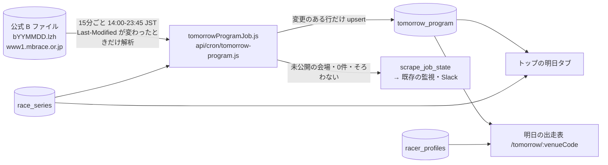
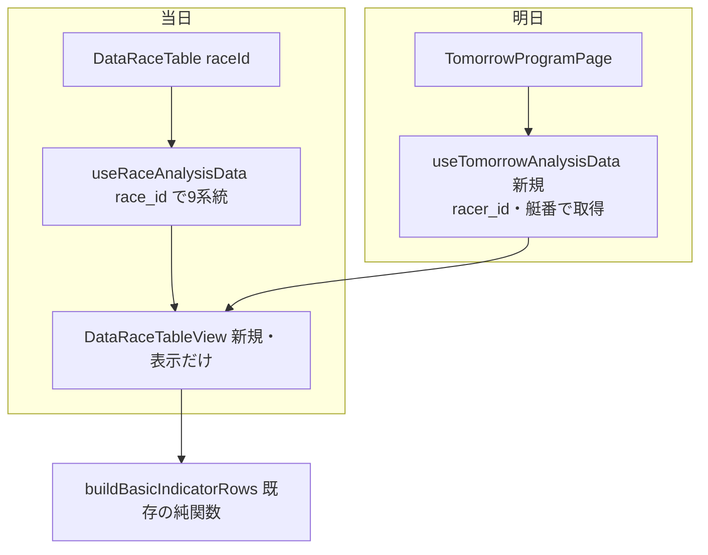

# 明日の出走表 plan

spec: [spec.md](./spec.md) / screens: [screens.md](./screens.md) / ADR: [0084](../../adr/0084-tomorrow-program-separate-table-from-b-file.md)

## 1. 全体の流れ



当日の流れ（races・race_entries・朝の初期化・予想）には一切触れない。

## 2. データ設計

マイグレーション案: [`docs/db-migration/123_tomorrow_program.sql`](../../db-migration/123_tomorrow_program.sql)（未適用。コードのマージより先にユーザーが適用する）

```mermaid
erDiagram
    tomorrow_program {
        date race_date PK
        smallint venue_code PK
        smallint race_number PK
        smallint boat_number PK
        text series_title
        smallint series_day
        boolean is_final_day
        text stage
        smallint distance_m
        time deadline_time
        integer racer_id
        text racer_name_raw
        smallint age
        text branch
        smallint weight
        text class
        numeric(4,2) national_win_rate
        numeric(5,2) national_2rate
        numeric(4,2) local_win_rate
        numeric(5,2) local_2rate
        smallint motor_number
        numeric(5,2) motor_2rate
        smallint boat_id
        numeric(5,2) boat_2rate
        text series_results_raw
        timestamptz source_modified_at
        timestamptz created_at
        timestamptz updated_at
    }
    tomorrow_program_venues {
        date race_date PK
        smallint venue_code PK
        text status
        text series_title
        smallint series_day
        boolean is_final_day
        smallint race_count
        timestamptz source_modified_at
        timestamptz created_at
        timestamptz updated_at
    }
```

- `tomorrow_program`: 1行＝1艇。レース・節の項目は艇の行に重ねる（1日最大1,728行）
- `tomorrow_program_venues`: 1行＝1会場（B ファイルに会場ブロックがある会場だけ）。status は published / pending。行が無い会場＝明日開催なし。B ファイル未公開の間は0行。公開状況の分母 m はこの表の行数（race_series は10月分が未取得で不完全なため、開催の有無に使わない。グレード表示だけに使う）
- 保存する列は上の ER 図のとおり。parseBText の出力のうち保存しないもの: venue_name（venue_code で足りる）・title_short・day_label（series_day・is_final_day で足りる）・stage_raw（stage で足りる）・date_in_body（対象日のガードに使うだけ）・正規化済みの name（name_raw を racer_name_raw に保存）
- 名前は B ファイルの表記のまま（4文字で切れる）。正式名は画面が `racer_profiles`（匿名で読める）から登番で引く。未登録は B の名前
- `source_modified_at` は「行の値が最後に変わったときの B ファイルの Last-Modified」。比較対象からは外し（`ignoreColumns`）、値が変わった行にだけ入れる（ファイル更新のたびに全行を書き直さないため）
- `created_at`・`updated_at` と `source_modified_at` で、公開→取り込みの遅れを実測する
- 外部キー・既存テーブルへのリレーションは無し（`racer_id` は `racer_profiles.racer_id` と同じ値だが FK は張らない。新人の未登録で取り込みを止めないため）

### 書き込み量（Disk IO）

- 1日: 初回の最大1,728行の INSERT。以降は B ファイルの更新（夕方〜夜に数回）で値が変わった行だけ UPDATE（実測では準優・選手交代等で数十〜数百行）
- Last-Modified が変わらない tick は解析も書き込みもしない（1日40 tick のうち大半）
- 掃除: 対象日を過ぎた行を1日1回 DELETE（最大1,728行）

## 3. 取得ジョブ（(a)）

### 3.1 配置

| ファイル | 役割 |
|---|---|
| `api/cron/tomorrow-program.js`（新規） | `createScrapeCronHandler({ job: "tomorrow_program", run })`。`maxDuration` は registry と同値 |
| `scripts/lib/tomorrowProgramJob.js`（新規） | 1 tick の本体（§3.2） |
| `scripts/lib/kbFileParser.js`（拡張） | `parseBText` の会場に `pending`（本文が「この場のデータ更新は、いましばらくお待ちください。」だけ）を足す。既存の呼び出し元（kbArchiveRows・kbResultsBackfillRows・kb-backfill・fix-opening-day-entries-from-b・verify 2本）は races・entries しか見ないので影響なし |
| `scripts/lib/scrapeJobs/registry.js`（追加） | `tomorrow_program: { kind: "continuous", activeWindowJst: ["14:00", "23:59"], leaseSec: 120, maxDurationSec: 120, hosts: ["mbrace.or.jp"] }` |
| `scripts/lib/scrapeJobs/monitor.js`（拡張） | continuous の死活判定（運用窓 07:00〜23:59・25分。monitor.js:451-470）で、registry に `activeWindowJst` があればその窓だけで判定する。無いと毎日 07:25〜14:00 に死活の誤報が出る |
| `scripts/lib/scrapeJobs/cleanup.js`（追加） | 2表の `race_date < 今日` を削除（scrape-cleanup、04:00） |
| `vercel.json`（追加） | `*/15 5-14 * * *`（UTC。JST 14:00〜23:45）。Vercel の Cron 数の上限に余裕があるかを T3 で確認する（既存45件） |

既存部品: `buildKbUrl("B", date)`・`decodeLzhText`（kbFileParser.js。kfile_sync は kfileParser.js の独自展開だが、どちらも `@kirinsaninc/lhats` の LhaReader で Vercel 上の稼働実績がある）、`politeFetch`（レスポンスヘッダーを保持）、`upsertChangedRows`（`scripts/lib/unchangedRows.js`）、Cron 共通ラッパ（認証・リース・モード off/shadow/live・cursor の保存）、`last_report.alerts` による通知（monitor.js:474-487 の job_report 経路）。

### 3.2 1 tick の処理

1. 対象日 = JST の今日+1。JST 14:00 より前は何もしない
2. cursor は `{ date, lastModified, mode }`。対象日か mode が違えば無視する（共通ラッパは mode を問わず cursor を保存するため、shadow で保存した値で live が止まらないように。日付をまたいだ比較をしないように）
3. B ファイルを取得する
   - 404 → 未公開。成功として件数0で報告する（例外にしない。14時台に連続失敗の誤報を出さないため）。JST 17:00 以降も 404 なら `alerts` に入れる
   - 200 で Last-Modified が cursor と同じ、かつ DB の件数（venues の行数・published の会場×72）がそろっている → 解析・書き込みをせず終了。DB の件数が足りなければ（行が消えた等）同じファイルで処理し直す
4. 本文の日付（`date_in_body`）が対象日と違えば書かずにエラー（取り違えたファイルのガード）
5. `parseBText` で解析し、会場ごとに
   - 出走表あり → `tomorrow_program` の行（全列をそろえる）と、venues の行（published）
   - `pending` → venues の行（pending）だけ。出走表は書かない
   - 12R・6艇に満たない会場 → 書くが、件数を報告に出す
6. 書き込み: `upsertChangedRows` を次の設定で使う
   - `chunkColumn: "venue_code"`。読み出しは `race_date = 対象日` で絞り、1チャンク4会場以下（288行以下。PostgREST の1000行上限に掛からない）。ヘルパーが絞り込みの条件を受け取れなければ受け取れるように拡張する（既定の `chunkColumn` は `race_id` で、この表には無い）
   - `deadline_time` は DB が返す表記（既存の time 列で実測してから決める。`HH:MM:SS` なら `HH:MM:00` にそろえる）で書き、毎回「変更あり」にしない
   - `source_modified_at` は `ignoreColumns`。`TIMESTAMP_COLUMNS`・`NUMERIC_SCALES` に新しい表を登録する
   - `stampUpdatedAt: true`
   - 再現テスト: 同じファイルを2回処理すると、2回目の書き込みが0件
7. 報告（`last_report`）: ファイルの会場数 m、published 数 n、pending の会場、書いた行数、Last-Modified。shadow は書かずに件数だけ
8. 通知: JST 22:00 以降の毎 tick（最終 tick に頼らない。Vercel Cron は best-effort）で n < m なら `alerts`（key `tomorrow_program_incomplete`、text に未公開の会場、until は翌日 14:00）に入れる。判定は DB の件数で行うので、3. で早期終了する tick でも行う

### 3.3 失敗の扱い

- 取得（404 以外）・展開・解析・日付の不一致は例外にし、共通ラッパの `consecutive_failures` に乗せる（3回で通知）
- 「Last-Modified が変わったのに会場ブロックが0」はエラー。初公開の版で全会場が pending のことはありうるが、pending も会場ブロックとして数えるので誤報にならない

### 3.4 掃除

- `scrape-cleanup`（`scripts/lib/scrapeJobs/cleanup.js`、04:00）に2表の `race_date < 今日` の削除を足す（`client.from(...).delete().lt("race_date", today)`。rowsWritten に加算）

## 4. 画面（(b)）

### 4.0 出走表の方針（2026-10-02 ユーザー承認）

明日の出走表は、当日のレース詳細の「データ出走表」（`DataRaceTable`、艇が列・指標が行の転置表）と**同じ部品・同じ行の並び**にする。前日に値がある行を全部出し、前日に出せない行（当日体重・級別横の F/L バッジ）は出さず、表の下に「展示・当日体重・F/L は当日朝から」と案内する。6列の簡易版（モックの版1）はやめた。ファン4人パネルの推奨と、ユーザーの「当日の出走表と同じにすればよい」による。

| 行（`buildRowDefs` の key） | 前日の値の出所 |
|---|---|
| 見出し（艇番・選手名） | `tomorrow_program`（名前は `racer_profiles` の正式名） |
| 級別・勝率 | `tomorrow_program.class`・`national_win_rate`（F/L バッジは出さない） |
| 当地勝率・全国2連率 | `tomorrow_program.local_win_rate`・`national_2rate` |
| モーター2連率・機力バッジ | `getMotorPowerIndex(venue, motor, 90, 締切前の仮の race_id)`（当日と同じ自社集計の2連率・機力指数・sample_count）。実績なしの判定は BOA-702 の `isMotorUnrated` |
| 調子（勝率Δ） | B の `national_win_rate` と、選手の約90日前の `race_entries.win_rate`（racer_id で引く） |
| 平均ST・枠番勝率 | `racer_aggregated_stats`（racer_id で直接。当日は predictions 経由だが、元の値は同じ） |
| ST安定度・決まり手型・単勝回収率 | RPC 3本（`get_race_st_predictability`・`get_race_technique_profile`・`get_race_return_rate`、029）は `race_entries` を race_id で引くので、明日には使えない。**「艇番と racer_id の組」を引数に取る版を新設**する（本体の集計は同じ。マイグレーション123に同梱し、匿名に EXECUTE を GRANT。113 の方針を確認する） |
| 今節の前走 | 同じ会場の今節（節の初日は `findMeetStartDate`）の `race_entries`・`race_results` を racer_id で引く。初日は「今節初戦」 |
| 当日体重・展示系 | 出さない（表の下に案内） |

### 4.1 ルート

| パス | 画面 | i18n |
|---|---|---|
| `/`（`?day=tomorrow`） | トップの明日タブ（S1） | 翻訳対象（既存） |
| `/tomorrow/:venueCode` | 明日の出走表（S2） | 翻訳対象。`TRANSLATED_PATHS` に `/tomorrow` を登録。sitemap 対象外（日替わり。`EXPECTED_EXCLUSIONS`） |

`/venue/:venueCode` の配下にしない（本日の会場ページと日付の意味が混ざる）。

### 4.2 部品の切り出し



- `DataRaceTable.jsx` の表示部分（見出し・行・セル・注記、DataRaceTable.jsx:93-167）を `DataRaceTableView({ players, rows, ... })` に切り出す。当日の `DataRaceTable` は今のまま `useRaceAnalysisData` で analysis を作って View に渡す（当日の見た目・挙動は変えない。既存の E2E がそのまま通ること）
- 明日の行は `buildBasicIndicatorRows` に、明日用の `analysis` と、除外する行（当日体重）・`gradeBadge` なし（F/L を出さない）を渡して作る。`buildBasicIndicatorRows` に「除外する key」の引数が無ければ足す
- `players` は `tomorrow_program` から当日と同じ形（`{ number, name, racerId, grade, winRate, localWinRate, global2Rate, motor2Rate }`）に組み立てる純関数を置く

### 4.3 データ取得（`src/services/supabaseDataService.js` に追加）

| 関数 | クエリ | 使う画面 |
|---|---|---|
| `getTomorrowVenueSummary(date)` | `tomorrow_program_venues` を `race_date=date` で select（≤24行。status・節名・日次） ＋ `tomorrow_program` を `race_date=date, race_number=1, boat_number=1` で select（1R締切） ＋ `race_series` を `start_date<=date<=end_date` で select（グレードだけ） | S1 |
| `getTomorrowProgram(date, venueCode)` | `tomorrow_program` を `race_date, venue_code` で select（≤72行） ＋ `racer_profiles` を登番で select（正式名） | S2 |
| `useTomorrowAnalysisData(date, venueCode, entries)`（hook） | 4.0 の表の各行。会場の全レース分（≤72艇）をまとめて取り、レースごとに分ける（レースごとに9系統×12R を呼ばない） | S2 |

- いずれも `withCache`（明日分は5分）。エラーは throw し、画面は `InlineFetchError`（当日と同じ。失敗を「—」の羅列に化けさせない、BOA-359）
- 明日タブを開くまで呼ばない（本日タブの速度を変えない）
- RPC の新設は ST安定度・決まり手型・単勝回収率の3本だけ。それ以外は単純な select

### 4.4 コンポーネント（screens.md）

- `VenueGridCard` の明日の状態: `program`（venues=published。グレードは `race_series.grade`、引けなければ出さない）／`waiting`（venues=pending）／`none`（venues に行が無く、他の会場には行がある。BOA-225 の次開催日を併記）／`before`（venues が0行＝B 未公開。「—」）
- 選手名: `racer_profiles.name` の全角空白（可変長）を表示用に1つにまとめる純関数を `src/utils/` に置く（既存に無い）。再現テスト付き
- 公開状況の案内（`TomorrowPublishNotice`）: 公開前（venues 0行）と公開途中（n<m）と全公開（n=m、非表示）
- 明日の出走表ページ: レースごとに見出し（R番号・締切予定 HH:MM（JST））＋ `DataRaceTableView`＋表の下の案内。12レース分を縦に並べる

## 5. 既存への影響

| 対象 | 影響 |
|---|---|
| races・race_entries・朝の初期化・予想・監視の0件判定 | なし（別テーブル） |
| `parseBText` の既存の呼び出し元（`fix-opening-day-entries-from-b.js` 等） | 会場に `pending` が増えるだけ。空会場として扱っていた処理は、`pending` を見なくても従来どおり動く（races が空の会場） |
| トップの本日タブ | タブの追加のみ。初期表示は本日（`?day` なし） |
| 当日のデータ出走表（DataRaceTable） | 表示部分を View に切り出すだけ。見た目・挙動は変えない（既存の E2E で確認） |
| RPC 029 の3本 | 変えない。艇番×racer_id を引数に取る版を新設する |
| sitemap・AI スナップショット | `/tomorrow/*` は対象外に登録 |

## 6. テスト

- 解析: `parseBText` の `pending` 判定（B ファイルの実物の断片を fixture にして、更新待ちの会場と出走表のある会場が混ざるケース） → `scripts/maintenance/verify-kb-file-parser.js` に追加
- ジョブ: 対象日（0時台・14時前・23時台）、404 は成功で件数0・17時以降は alerts、Last-Modified 不変で DB がそろっていれば書かない・そろっていなければ処理し直す、cursor の日付・mode 違いは無視、本文の日付違いはエラー、pending の会場は出走表を書かない、shadow で書かない、同じファイル2回目の書き込み0件、22時以降の未公開で alerts → `scripts/maintenance/verify-tomorrow-program-job.js`（新規、registry `ci`。supabase・fetch はモック）
- 監視: `activeWindowJst` の窓外で死活を出さない → `verify-scrape-monitor.js` に追加
- 画面: 受け入れ E2E（acceptance-test-writer、時計を固定して4状態）、`e2e/layout.spec.js` に `/tomorrow/:venueCode` と `/?day=tomorrow`
- データ精度: 実データで1会場の明日の出走表が B ファイルと全艇一致（data-accuracy-verifier）

## 7. 完了の定義（data-acquisition.md §2）

- A 件数: 対象日に節がある会場×12R×6艇（中止・欠場を除く）の99%以上が、23:45 までに入っている。実測クエリを完了報告に添付
- B タイミング: `created_at − source_modified_at` の分布を土日を含む直近5日で実測（目標: 30分以内が98%以上）
- C 継続監視: 22時以降の未公開の会場・17時以降の未公開（404）は `alerts`、取得失敗は consecutive_failures、ジョブの未実行は monitor の死活（`activeWindowJst` の窓内）で Slack に流す

## 8. 設計レビュー2回目（§4 画面）の反映（2026-10-02）

design-reviewer の指摘12件。すべて一次情報（本番の読み取り・コード）で裏付けがあり、採用した。§4 の記述より、この節を優先する。

| # | 指摘（重大度） | 決定 |
|---|---|---|
| 1 | RPC を「基準日」にすると同日の前の走が抜け、race_id 版と値が変わる（重要。10/1 江戸川72艇中25艇で差） | 新版の引数は `(p_boats int[], p_racer_ids int[], p_before text)`。`pe.race_id < p_before` で比べる（明日の画面は `'YYYY-MM-DD'`（明日）、検証は実際の race_id を渡す）。集計窓の下限は 029 と同じ `now()` 基準。関数名は既存と別（`get_boats_st_predictability`・`get_boats_technique_profile`・`get_boats_return_rate`。同名 overload は PostgREST の解決があいまい） |
| 2 | T5b を 123 に同梱する話と tasks の順序が矛盾（重要） | T5b を T2（適用）の前に移し、123 に入れてから適用する。同じファイルで `GRANT EXECUTE ... TO anon, authenticated`（113 の方針、verify-migration-rls が検査）。`check-anon-access.js` の `ANON_RPCS` に3本を足す。123 の「元に戻す」に DROP FUNCTION、APPLIED.md の説明を直す |
| 3 | 機力バッジは motorDeepLink があるときだけリンクとして出て、spec は分析への遷移を禁じている。行ラベルも分析へのリンク（重要） | spec どおり明日の表にはリンクを置かない。View に `linkRows: false`（行ラベルを span）を足し、`buildRowDefs` は motorDeepLink が無いときもバッジを非リンクの span で出せる引数（`motorBadgeAsText: true`）を足す。既定の挙動（当日・一覧カード）は変えない |
| 4 | getMotorPowerIndex をモーターごとに呼ぶと1ページ約135リクエスト（重要） | 会場単位の一括取得にする。窓内の race_entries を `.in(motor_number, 全台)` でページング（約4,000行）、race_results を1〜2回で取り、getMotorPowerIndex の集計式を純関数に切り出して共有する（同じ式で当日と値が一致することを再現テストで固定） |
| 5 | モーター入れ替えの前夜は venue_motor_start_dates が旧世代のままで、旧モーターの成績が明日の表に出る（重要、推測を含む） | B の会場内のモーター2連率が全艇0なら新世代とみなし、再計算せず B の値と「交換直後」の注記を出す（当日の全艇0の扱いと同じ）。入れ替え前日の bc_mst の実例は T5 の shadow 期間に1件確認する |
| 6 | 当地勝率・当地2連率が B と当日の race_entries で約24%の艇が食い違う（重要。10/2 1008艇中240件、最大6.8） | 明日の表は B の値（前日時点の公式番組表）を出す。ページの注記「M/D HH:MM 時点（JST）の公式番組表です」で前日時点の値であることは示している。差の原因（集計期間の定義の違いと推測）は T11 で公式の定義を確認し、spec に残す。全国勝率・級別・全国2連率は一致 |
| 7 | 平均ST・枠番勝率の元の値は 23:00 の集計後でしか当日と同じにならない。`venue_code=0` の絞り込みが無い（軽微） | `.eq("venue_code", 0)` を明記。形は `{boatNumber, avgST: avg_st, courseRaceCounts: course_race_counts}` を `toWakuRacerStats` に通す（BOA-302 の境界と同じ）。前日の集計の値であることは、ページの注記の趣旨に含める |
| 8 | モーター行は当日の recalc と同じ形（`rate_source`・`motor_2rate` のフォールバック・`sample_count`）が要る（軽微） | 明日の行は `{ rate_source: "recalc", motor_2rate: actual_rate2 ?? B.motor_2rate, sample_count, power_index, motor_number }`。組み立てを純関数にして再現テスト（BOA-702 の isMotorUnrated で未使用が「—」になること） |
| 9 | players の組み立てで当日の `\|\| ""` 変換を再現する（軽微） | 組み立ての純関数に含め、再現テスト（当地勝率 0.00 が当日と同じく「—」） |
| 10 | 今節の前走は当日と同じ `groupIntoMeetBeforeRace` を使う方が確実（軽微。09-23〜10-02 の5,787件で一致を確認済み） | `groupIntoMeetBeforeRace(past, \`${date}-${vv}-00\`)` を使い、getRaceMeetPrevRuns の後半（中止の除外・結果待ち）を racer_id×艇番の入力で共有する。明日2走する選手は両方の表で「今日の最後の走」になる（前日時点の情報として許容。spec に記載） |
| 11 | 調子の過去クエリに `.range()` が無い（軽微） | 一括版は `fetchAllByIn` 系で取る |
| 12 | DataRaceTable の切り出しの注意（CSS の import・id・trackEvent・CSS の方針）（軽微） | `DataRaceTable.css` を View 側で import。`id="data-race-table"` は当日の外枠にだけ残す。明日はリンクを置かないので trackEvent は不要。新規 CSS は作らず既存の `.drt-` を使う（screens C5 の記述を合わせる）。当日の DOM（クラス・id・順序）が変わらないことを、`.drt-` を参照する E2E 5本（layout・race-detail-wide-screen・smoke・race-detail-mobile-table・flying-late-badge）で確認 |
