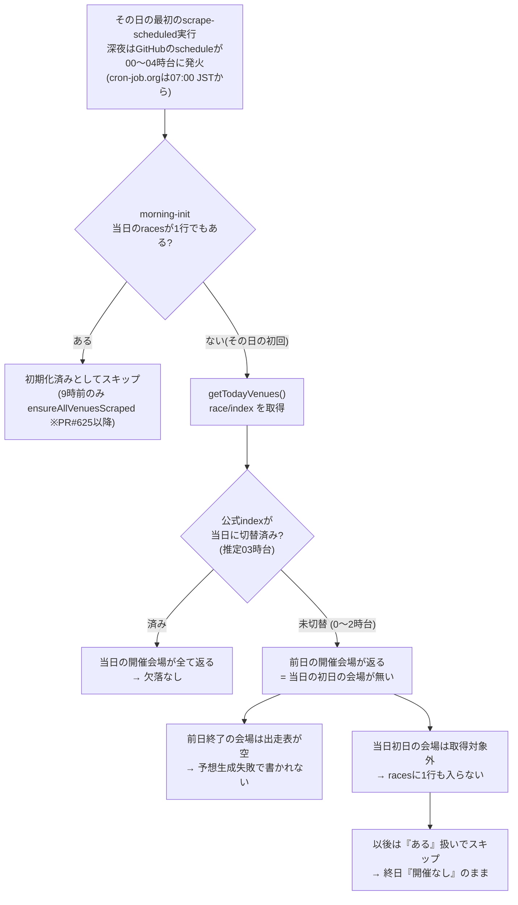

# racesテーブルで節の初日の会場日が欠ける問題（調査・修復案）

調査日: 2026-09-21。調査は読み取りSQLと公式サイトの閲覧のみ。修復（§9）は、ユーザー承認（方式A・予想は生成しない）のうえ、2026-09-21〜22に本番へ書き込んだ。DDLは無い。欠けた会場日の一覧は [`data/analysis/races-opening-day-missing/missing-venue-days.json`](../../data/analysis/races-opening-day-missing/missing-venue-days.json)。

## 1. 結論

- **原因**: 朝の初期化（`scripts/daily/morning-init.js`）が「その日の`races`が1行でもあれば初期化済み」として1日1回しか取得しない設計（2026-04-09〜）で、その1回が公式`race/index`ページの日付切替（ロールオーバー、推定03時台）より前に走ると、`getTodayVenues()`が**前日の開催会場一覧**を返し、当日から始まる節（初日）の会場が取得対象から漏れる。漏れた会場は、その日の間に再取得されない。
- **欠けた初日のレースは「そもそも作られていない」**。別のrace_id・別のrace_dateで保存されている痕跡も、作られた後に消えた痕跡も無い。
- **規模**: 2026-04-10〜09-11の節の初日366件のうち**125件（34.2%）、55日分**。1,500レース程度（125会場日×12R）。2025-12-04〜04-09は0件。
- **すでに止まっている**: 2026-09-12 10:48 JSTのPR #625（`getTodayVenues(date)`へ`hd=`を明示指定）以降、深夜0〜2時台に初期化された5日（9/13・14・15・19・20、初日9件）は全て存在する。**新たな欠落は出ていない**。残っているのは過去分の穴埋めのみ。
- **BOA-325とは無関係**。BOA-325の「初日」は自社データの初日（2025-12-03、race_idの日付ズレ120件）で、節の初日ではない。

## 2. 事象と規模

節の初日の判定は、公式の月間スケジュール（`race/monthlyschedule?ym=`、2025-11〜2026-10の12ページ）を`mergeMonthlySchedules`で節に束ね、`races`の(venue_code, race_date)と突き合わせた。範囲は2025-12-04〜2026-09-21の公式会場日3,820件。

| 月 | 節の初日 | 欠落 | 初日以外の欠落 |
|---|---:|---:|---:|
| 2025-12 | 68 | 0 | 0 |
| 2026-01 | 81 | 0 | 0 |
| 2026-02 | 61 | 0 | 0 |
| 2026-03 | 68 | 0 | 0 |
| 2026-04 | 66 | 5（4/10以降のみ） | 0 |
| 2026-05 | 72 | 23 | 2 |
| 2026-06 | 72 | 34 | 0 |
| 2026-07 | 77 | 28 | 2 |
| 2026-08 | 72 | 11 | 1 |
| 2026-09 | 49 | 24（9/11まで） | 0 |
| 計 | 686 | **125** | 5 |

- 節の日目別の欠落は、1日目が125/686、2日目が0/685、3日目以降が計4件（下記の中止）。**初日に集中している**。
- 初日以外の5件（津7/30〜8/1、尼崎5/17〜18）は、公式の`raceindex`が「7月30日中止」「5月17日中止」等で「データはありません」を返すことを確認した（各1回）。**正常（順延・中止）で、この問題ではない**。
- 欠落125件の関連9テーブル（`race_entries`・`race_results`・`race_conditions`・`predictions`・`race_odds`・`race_payouts`・`exhibition_data`・`race_start_timings`・`scrape_slots`）の行数は、race_idの`YYYY-MM-DD-VV`前方一致で**全て0**。

## 3. 原因

### 3.1 根拠（コード・実データ）

1. **コード**: `scripts/scrape-to-json.js`の`getTodayVenues()`は、PR #625（2026-09-12）より前は`https://www.boatrace.jp/owpc/pc/race/index`（`hd=`なし）を取得していた。`morning-init.js`は`count > 0`なら初期化済みとして再取得しない（`ensureAllVenuesScraped`は#625で追加）。
2. **実行ログ（1サンプル）**: GitHub Actions実行ID 34615016237（2026-09-12 00:16 JST、対象日2026-09-12）のログに`Found 12 venues open today: [2,3,5,6,12,13,14,16,17,20,21,24]`。これは**9/11の公式開催会場と完全に一致**し、9/12の公式開催会場（2,5,6,8,9,10,12,16,17,18,20,21,24）ではない。9/12から始まる8・9・10・18（徳山ほか3会場）が欠け、9/11で終了した3・13・14は「選手データが不足しています」「予想生成失敗」で書かれなかった（書き込みは108件=9会場）。欠けた4会場は当日10:00 JSTに手動で補填されている（`races`のcreated_atが2バッチ）。
3. **作成時刻と欠落率**（2026-02-02〜09-20、初日が存在する日。日ごとの最初の`created_at`をJSTで区分）:

   | 最初のraces作成時刻 | 初日 | 欠落 | 欠落率 |
   |---|---:|---:|---:|
   | 00時台 | 83 | 71 | 86% |
   | 01〜02時台 | 66 | 49 | 74% |
   | 03時台 | 60 | 5 | 8% |
   | 04時台 | 73 | 0 | 0% |
   | 07時台以降 | 252 | 0 | 0% |

   2〜3月は同条件でも欠落0件（次項のとおり旧方式が補っていた）。5〜8月に限ると、最初の作成が07時前の日は初日96/104（92%）が欠落し、07時以降の日は0/189。
   最初の作成時刻がばらつく理由: 07:00 JST前の実行は、cron-job.orgではなくGitHub Actionsの`schedule`イベント。2026-09-14の00:00〜07:30 JSTの実行履歴は、01:25 JSTの`schedule`が1件と、07:00 JSTからの`workflow_dispatch`（5分毎）のみで、9/12の初期化実行（ID 34615016237）も`schedule`だった。フォールバックcronの窓（`*/10 22-23,0-13`=UTC、JST 7〜22時）の外で発火する理由は未確認。
4. **4月9日の方式変更**: PR（コミット`0d3174900`、2026-04-09 10:47 JST、BOA-58 Phase 5）で、毎時実行の`scrape.yml`（JST 3〜22時、毎回`scrape-to-json`を再実行）を廃止し、`morning-init`を「racesが空の場合のみ」に統合した。毎時方式では、深夜の1回目が前日一覧で漏れても後続の実行が拾えていた。DBでも、`races`が1日に複数バッチで作られた日が2025-12〜03月に81/118日あり、5月〜8月は0/123日（全日単一バッチ、`created_at`のばらつき0分）。初日欠落の初出は**4月10日00:04 JST**（切替の翌日）。
5. **修正の効果**: #625（`hd=`指定）以降の9/13（00:25 JST・初日7,11,19,22）・9/14（01:31・4）・9/15（00:58・14）・9/19（02:08・6）・9/20（01:06・1,10）は、いずれも初日が全て存在する。

### 3.2 推定であり未確認の点

- 公式`race/index`が日付切替を行う時刻は直接観測していない（03時台に欠落が5/60まで下がり、04時台以降は0/325であることからの推定）。深夜0〜4時台に`hd=`なしのindexを取得すれば観測できるが、今回は未実施。
- 1サンプルのログ（9/12）で機構を確認した。別日の実行ログも見たかったが、調査の終盤でGitHub APIへの接続が失敗し取得できなかった。上記3.1の3〜4がその代わりの統計的な裏付け。

## 4. 3つの仮説の判定

| 仮説 | 判定 | 根拠 |
|---|---|---|
| (a) そもそも作られていない | **該当** | 上記3.1の2（実行ログで取得対象の会場に含まれていない）、欠落日は日ごとに単一バッチ |
| (b) 別のrace_id・別のrace_dateで保存 | 否定 | 2025-12-04以降の44,832行で、race_idの日付部分とrace_dateの不一致は0件。公式日程に無い会場日（36件、§7-1）の中に、欠落した初日の前後1日に当たるものは無い |
| (c) 作られた後に消えた | 否定 | `pg_stat_user_tables`の`races.n_tup_del`は累計240（2025-12-08の統計リセット以降）。BOA-325の修正スクリプト（120件×2回）で説明がつき、1,500行規模の削除は起きていない。`races`をDELETEするコードもBOA-325スクリプト以外に無い |

注: (a)と(c)は、子テーブルのCASCADEにより「関連テーブルが0行」というデータだけでは区別できない。区別の根拠は、実行ログ・`n_tup_del`・作成バッチの単一性。

## 5. 影響範囲

- **画面**: 該当会場日は、その日終日「開催なし」表示（例: 住之江は9/1が初日だが、9/1のDBは9会場。K/Bで確認した9/1の実際の開催は12会場）。
- **データ分析**: 4/10〜9/11は節の初日（第1日）が34%欠けるため、節の日目別の集計・選手の節成績・会場別集計に、初日固有の傾向が反映されない。`race_conditions.series_day`の分布は、初日が過少になる。
- **予想の的中率**: 該当日は`predictions`も無く、集計の母数に入っていない。
- 2025-12〜03月は影響なし。

## 6. 修復案

対象は**125会場日・55日（2026-04-10〜09-11）**、約1,500レース・約9,000艇。実行はしない。

### 6.1 方式の比較

| 方式 | 中身 | リクエスト数（推定） | 取れる項目 | 課題 |
|---|---|---:|---|---|
| **A: 公式サイトの過去日ページ** | racelist・raceresult（＋beforeinfo）を、欠落会場日のみ、逐次3秒以上で取得。既存パーサーを再利用 | 約3,000〜4,500（24〜36/会場日）。約3〜5時間 | races・race_entries（3連率含む）・race_conditions・race_results・展示・ST | `scrape-to-json`・`generate-predictions`が「今日」固定（`racesData.date !== today`で例外）。`--date`対応の改修が要る。予想が副産物で生成される |
| **B: K/Bファイル（mbrace.or.jp）** | 日単位のK（成績）・B（番組表）を55日分取得 | **110**（約6分）。グレードは`race/index`で55回補完 | 出走表（3連率なし）・着順・ST・展示タイム・進入・天候・払戻 | 本体テーブル用の変換が未実装（承認済みの設計は別アーカイブ表への保存で、DDL074は未適用、`kb_archive_*`は現在0件）。Bのローカル勝率が本体（racelist由来）と値が一致しない列がある |
| C: 何もしない | 穴を注記して残す | 0 | — | 初日34%欠落のまま、日目別分析が歪む |

**推奨は A**（本体テーブルの値の定義を、既存の日次データと揃えられる）。ただし取得コスト（3〜5時間の逐次取得）は、別セッションが同じ端末のIPで実行中のK/Bの長期バックフィル（2020-01を夜間再開待ち）と競合するため、実行時間帯を分ける。B（K/B）は、承認済みのアーカイブ表への投入が完了してから、本体へ`INSERT ... SELECT`で昇格させる経路もあるが、その変換設計が別途要る。

公式サイト側の実在は確認済み（2026-09-01 住之江1Rで、racelist・beforeinfo・raceresult・odds3tが全て200・データあり、K/Bも200。K/Bの9/1は12会場で、`races`に無い12・13・24を含む）。

### 6.2 復元する項目と、しない項目

| 項目 | 復元 | 理由 |
|---|---|---|
| races・race_entries・race_conditions・race_results | する | 過去日ページから取得可能 |
| exhibition_data・race_start_timings | する（方式Aでbeforeinfoを含める場合） | 過去日ページに残る |
| race_odds（6窓） | しない | 締切前の時点値は遡って取れない |
| predictions（各モデル） | **しない（要判断）** | 予想は「その時点で公開した値」。遡って作ると、的中率集計に混ざる（生成する場合は`is_shadow=true`等で分離が要る） |
| scrape_slots | しない | 過去分のスロットは不要 |

`races.volatility_*`は全てNULL許容（確認済み）で、予想無しでも行は作れる。

### 6.3 本番書き込みの手順（承認後に実行）

1. `git switch`で専用ブランチを切り、`scripts/maintenance/`に**手動実行のCLI**を追加する（取得ロジックは日次と共有し二重実装しない、`.claude/rules/data-acquisition.md`）。入力は`missing-venue-days.json`。日付を明示でき、`--dry-run`を既定にする。
2. dry-runで、対象125会場日の取得・解析だけを行い、会場日ごとのレース数（12前後）・艇数・中止の有無を出力する。1〜2会場日（例: 住之江9/1、津・尼崎の中止でない初日）を本番へ先行書き込みし、画面と件数を検証する。
3. 段階的に全件を書き込む。**書き込み件数の期待値**: races約1,500・race_entries約9,000・race_conditions約1,500・race_results約1,500（初日が中止だった会場日はここから除く）。
4. 完了の実測（`.claude/rules/data-acquisition.md` 2.A）: 同じ突き合わせ（月間スケジュール×races）で、節の初日の欠落が0であることを、本番DBの実測クエリで確認する。既存の中止扱い（`cancellation_status`）の分は分母から除外して報告する。
5. 大量書き込みの前後でDisk IO消費を確認する（Supabase Smallで警告の実績あり）。

### 6.4 再発防止

| # | 対策 | 状態 |
|---|---|---|
| 1 | `getTodayVenues(date)`に`hd=`を明示指定 | **済み**（PR #625、以降の欠落0） |
| 2 | 9時前の`ensureAllVenuesScraped`（開催会場とracesの差分を再取得） | **済み**（PR #625） |
| 3 | Vercel移行後の`races-init`（`api/cron/races-init.js`、T4b-07-4）でも、05:00 JST以降に起動し、`race/index?hd=`＋会場差分チェックを継承する。現在の計画（tasks.md）は継承済みだが、コードは未作成 | 計画済み。**実装時に、本書の欠落条件（0〜2時台の1回取得）を回帰テストにする** |
| 4 | **月間スケジュール由来の初日充足チェック**（節の初日で`races`が0件の会場日を検出）。公式の月間スケジュールは月1リクエストで、`hd=`やindexの状態に依存しない独立な照合元になる。`content-ops-nightly-check.yml`等の日次監視から、閾値超過でSlack通知する | 未実装（本書の突き合わせ方法がそのまま使える） |
| 5 | 完了の定義C: 「08:00 JSTに当日の`races`が0件」「会場の取りこぼし」を検知（tasks.md T4b-07の継続監視項目） | 計画済み（未実装） |

## 7. 調査で見つかった別件（今回の修復対象外）

1. **公式日程に無い会場日が36件、DBに存在する**（2026-01-09・01-11・02-03・03-06・03-08・03-09・04-11）。3/8・3/9は各20会場で、公式の約13会場より多く、両日の会場集合が同一。原因は未調査。4/11の2・8・10・16は「前日（4/10）に終了した会場」に近く、旧方式で前日会場の空データが書かれた可能性があるが、確認していない。別チケットで調査が必要。
2. `kb_archive_races`は現在0件（K/Bの長期バックフィルは、生LZHの取得のみが進行中で、DBへの投入は未実施）。

## 8. 再現方法

- 節の初日: `scripts/lib/monthlyScheduleParser.js`（`parseMonthlySchedule`→`mergeMonthlySchedules`、ブランチ`worktree-agent-a238125c073c20945`にあり、masterには未反映）で12ページから843節を確定。未確定23節は範囲外の端のみ。
- 突き合わせ: 節ごとの(venue_code, 開始日〜終了日)を展開し、`races`の`(race_date, venue_code)`の`distinct`と左結合。
- 公式サイトへのアクセスは20回（月間スケジュール12・中止確認2・過去日ページ4・K/B 2）。UA`BoatraceAIBot/1.0`、逐次3.5秒間隔、403/429/503は0回。

## 9. 修復の実施結果（2026-09-21 21:03〜09-22 08:37 JST）

方式A（公式サイトの過去日ページ）で、予想は生成せずに補った。CLIは`scripts/maintenance/backfill-opening-day-races.js`（既定dry-run、`--apply`で書き込み。取得・書き込みは日次・Vercel Cronと共有する`runForRaces`3本）。検証は`npm run verify:opening-day-backfill`。

### 9.1 実施内容

| 項目 | 内容 |
|---|---|
| 対象 | 欠落リストの125会場日（2026-04-10〜09-11） |
| 事前 | dry-runで125会場日の出走表（1R）を取得: 全件12レース分の出走表あり（中止・未公開0件）。日目を読めなかったのは6/3の2会場日のみ |
| 先行 | 住之江2026-09-01の1会場日を先に書き込み、件数・画面（レース詳細、コンソールエラー0件）・Kファイルとの突き合わせを確認 |
| 全件 | 125会場日すべて`done`（失敗0）。リクエスト4,500（1会場日36。先行の1会場日36と、全件実行4,464の合計）、403/429/503は0回。所要は約11.5時間（取得器の間隔3.5秒に加え、書き込みと同時稼働のK/Bバックフィルの影響） |
| 記録 | `data/analysis/races-opening-day-missing/backfill-report.json`（会場日ごとの状態・件数・段階別の集計） |

### 9.2 本番の実測（完了の定義A）

125会場日（1,500レース）について、`races`との突き合わせで確認した。

| テーブル | 実測 | 期待 | 備考 |
|---|---:|---:|---|
| races | 1,500 | 1,500 | 125会場日すべてに存在。`start_time`のNULLは0 |
| race_entries | 9,000 | 9,000 | 全レース6艇、`racer_id`のNULLは0 |
| race_conditions | 1,500 | 1,500 | 気象のNULLは2 |
| exhibition_data | 8,856 | 8,856 | 1,476レース×6艇。展示タイムNULLは9艇 |
| race_results | 1,476 | 1,476 | 通常1,436・返還あり（`partial_refund`）40 |
| race_payouts | 14,747 | — | |
| race_start_timings | 8,856 | 8,856 | |
| predictions | 0 | 0（生成しない） | |

- 期待の分母からは、**開催されていない2会場日（下記9.3）の24レース**を除いた（結果・展示が無いのは、この24レースのみ）。充足率は100%。
- **Kファイルとの突き合わせ**（独立の別経路）: 住之江2026-09-01の全12レースで、着順（1〜3着）・3連単・3連複の払戻が一致した。
- 払戻の列名`payout_trifecta`（3連複）・`payout_trio`（3連単）は、既知の取り違え仕様（[`trifecta-trio-naming-swap.md`](./trifecta-trio-naming-swap.md)）どおり。

### 9.3 欠落リストの2件は、実際には開催されていなかった

（CLIは、結果・展示が全て無い会場日を`done`と記録していたため、実測で発見した。レビュー指摘を受け、値の無いレースがある会場日は`done_with_gaps`と記録し、再実行の対象にするよう修正した。）

2026-06-03の江戸川（3）と蒲郡（7）は、公式の月間スケジュールでは6/3が節の初日だが、公式の`raceindex`は「6月3日順延（江戸川）」「6月3日中止（蒲郡）」「6月4日初日」と表示する。**実際の初日は6/4**で、6/4の`races`は元々存在した。したがって欠落125件のうち、真の取りこぼしは**123件**。

出走表のページには当日のレースが載っていたため、この2会場日は結果・展示が無いまま`races`・`race_entries`・`race_conditions`が作られた。既存の中止確定の処理（`confirmCancellationsForRaceIds`、BOA-254）で、24レースを`cancellation_status='confirmed'`にした（中止確定のレースは、完了の定義の分母から除外される）。これらの日目（`series_day`）はNULL。

### 9.4 補っていないもの（要判断ではなく、方針どおり）

- `predictions`・オッズ・`scrape_slots`は、生成・取得していない。`races`の`volatility_*`・`first_boat_*`はNULL（予想側の値）。
- `race_results.result_at`と各行の`created_at`は、バックフィルの実行時刻（取得時刻の意味では、実際に取得した時刻）。日付（`race_date`）が古く、`predictions`が無い行として区別できる。
- 結果ページの想定外の着欄表記（例: 住之江2026-09-01 10Rの5号艇「不」）は、既存のパーサーの扱い（着順を付けない）のまま。今回の対象外。

