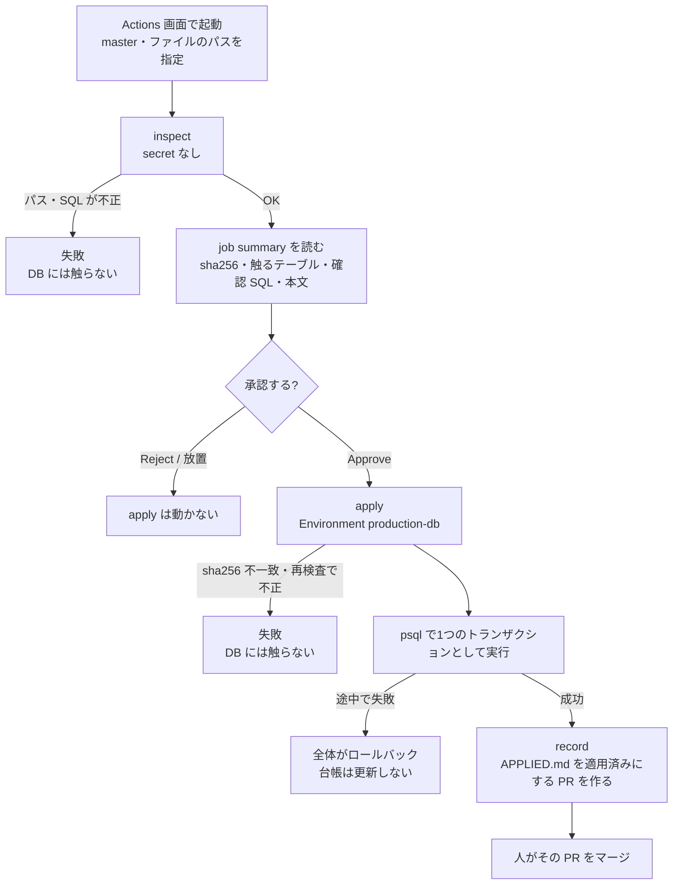

# 本番 DB へのマイグレーション適用（db-apply ワークフロー）

`docs/db-migration/` のマイグレーション1本を、GitHub Actions の画面から本番 DB（Supabase）に適用する。
承認は GitHub Environments の required reviewer（ユーザー本人）が1タップで行う。
これまでの「Supabase Dashboard の SQL Editor に全文を貼って実行」を置き換える。

- ワークフロー: `.github/workflows/db-apply.yml`
- 検査のロジック: `scripts/lib/dbApplySql.js`（CLI は `scripts/db/db-apply.js`）
- 検証: `npm run verify:db-apply`（Quality Gates で PR ごとに実行）

## 流れ

| job | 何をするか | secret | 書き込み権限 |
|---|---|---|---|
| inspect | master からの起動か確認、パスの検証、HEAD に通常ファイルとしてあるか確認、SQL の検査、job summary の出力 | 読まない | なし |
| apply | 承認を待つ。承認後、同じコミットを取り出し sha256 を再照合・再検査してから psql で実行 | `SUPABASE_DB_URL`（この job だけ） | なし |
| record | 最新の master に対して APPLIED.md を更新するブランチを作り、PR を開く | 読まない | contents・pull-requests |

### 承認の前に止めるもの（inspect）

- パスが `docs/db-migration/NNN_英小文字.sql`（`013b_` のような枝番は可）でない。`..`・`/` を含められないので、ディレクトリの外は指定できない
- 起動した時点の master のコミットに、そのファイルが通常ファイル（シンボリックリンク不可）として無い
- トランザクションに包めない文: `CONCURRENTLY`（CREATE/DROP/REINDEX）、`VACUUM`、`ALTER SYSTEM`、`CREATE/DROP DATABASE`、`CREATE/DROP TABLESPACE`、`SUBSCRIPTION` の操作、`REINDEX SYSTEM/DATABASE`、`DISCARD ALL`
- トランザクション制御（`BEGIN`・`COMMIT`・`ROLLBACK`・`SAVEPOINT` 等）。ただし「先頭の文が `BEGIN`、最後の文が `COMMIT`」の1組だけは許す（現行のマイグレーションの書き方。下記）
- psql のメタコマンド（`\!` `\i` `\copy` 等。`\!` はランナー上でシェルを実行できる）
- `COPY`（データの投入はこのワークフローでは扱わない）、`BEGIN ATOMIC` の関数本体（文の区切りを判定できない。`$$` で書く）
- 閉じていない文字列・`$$`・コメント

これらを含むマイグレーション（既存では `CREATE INDEX CONCURRENTLY` の 050・055）は、従来どおり SQL Editor で手で適用する。

### トランザクションの包み方

| ファイルの書き方 | 実行 |
|---|---|
| トランザクション制御が無い | `psql -X -v ON_ERROR_STOP=1 --single-transaction -f <file>` |
| 先頭の文が `BEGIN`、最後の文が `COMMIT`（116〜122 の書き方） | `psql -X -v ON_ERROR_STOP=1 -f <file>`（ファイル自身の BEGIN〜COMMIT が1つのトランザクション） |

どちらも、途中の文が失敗すれば psql はそこで止まって接続を閉じ、トランザクション全体が戻る。
`--single-transaction` と、ファイル内の `BEGIN`/`COMMIT` を同時に使うと、ファイルの `COMMIT` の時点で確定してしまい、以後の文が単独で実行される（psql の仕様）。そのため2つの形に分けている。

## 初回設定（ユーザーが行う）

### 1. 接続文字列を取る（Supabase Dashboard）

1. Supabase Dashboard でプロジェクトを開き、上部の **Connect** を押す
2. **Connection String** タブで **Session pooler** を選ぶ（Type は URI）
3. 表示された `postgresql://postgres.<project-ref>:[YOUR-PASSWORD]@aws-0-<region>.pooler.supabase.com:5432/postgres` の `[YOUR-PASSWORD]` を DB のパスワードに置き換える
   - パスワードが分からなければ Project Settings > Database で再設定する（既存の接続に使っているなら、その接続も直すことになるので注意）
   - パスワードに `@` `:` `/` `?` `#` `%` を含むなら URL エンコードする（例: `@` → `%40`）

**Session pooler を使う理由**

| 接続先 | GitHub Actions から | 判断 |
|---|---|---|
| Direct connection（`db.<ref>.supabase.co:5432`） | IPv6 のみ（IPv4 は有料アドオン）。GitHub のホステッドランナーは IPv6 に出られないため繋がらない | 使わない |
| Transaction pooler（`:6543`） | IPv4 で繋がるが、トランザクションごとに裏の接続が入れ替わる。`SET`（`LOCAL` でないもの）等のセッション単位の設定が次の文に効かない | 使わない |
| **Session pooler（`:5432`）** | IPv4 で繋がり、1回の psql の間は同じ接続を使う。マイグレーションの実行に向く | **使う** |

### 2. Environment `production-db` を作る（GitHub）

リポジトリの Settings > Environments > New environment で `production-db` を作り、次を設定する。

| 設定 | 値 | 理由 |
|---|---|---|
| Required reviewers | 自分（rhapsody0919） | 適用の前に必ず本人が承認する |
| Prevent self-review | **OFF** | 起動するのも承認するのも本人1人のため。ON だと自分で起動した run を自分で承認できない |
| Wait timer | 0（設定しない） | |
| Allow administrators to bypass | OFF のまま（任意） | |
| Deployment branches and tags | **Selected branches and tags** で `master` だけ | master 以外から起動した run はこの Environment を使えない（ワークフロー側でも master 以外は落とす） |
| Environment secrets | `SUPABASE_DB_URL` = 手順1の接続文字列 | 承認後の job だけが読める。リポジトリの secret には置かない |

### 3. Actions に PR を作らせる許可（GitHub）

Settings > Actions > General > Workflow permissions で **Allow GitHub Actions to create and approve pull requests** にチェックを入れる。
入れないと、適用は成功しても record job（台帳の PR を作る）が失敗する（その場合の対処は「失敗したとき」）。

## 毎回の手順

1. 適用したいマイグレーションが master にマージ済みであることを確認する（PR のブランチ上のファイルは適用できない）
2. Actions > **DB Apply (production)** > **Run workflow**
   - Use workflow from: `master`
   - 適用するファイル: `docs/db-migration/122_venues_first_win_rate_race_count.sql` のようにリポジトリ直下からのパス
3. 起動した run を開き、**inspect** の job summary を読む
   - ファイル・sha256・行数・実行のしかた（single-transaction / file-transaction）
   - 触るテーブル（CREATE/ALTER/INSERT/UPDATE/DELETE/DROP/TRUNCATE の対象。DO ブロック・関数本体の中は出ない）
   - 冒頭コメントの確認 SQL（適用前に SQL Editor で読み取りだけ実行して状態を確かめる、適用後に結果を照合する）
   - 文の一覧と本文（400行を超える分はリンク先で読む）
   - 「台帳では既に適用済み」の注意が出ていれば、再適用してよいかを確かめる
4. 問題なければ **Review deployments** > `production-db` にチェック > **Approve and deploy**。やめるなら **Reject**
5. apply が成功すると、record が `db-apply/<ファイル名>-<run番号>` ブランチで APPLIED.md の PR を作る
   - GITHUB_TOKEN が作った PR には他のワークフロー（Quality Gates）が自動では走らない。PR を一度閉じて開き直すと走る
   - 中身（適用状況の列）を確認してマージする。「確認した根拠」の列を書き足すならこの PR に足す
6. ファイル冒頭の「適用後の確認」を実行する。RPC を変えたなら `node --env-file=.env.local scripts/maintenance/verify-rpc-output-keys.js` も実行する（CLAUDE.md の自動レビュー4）

## 失敗したとき

| どこで | DB | 台帳 | 対処 |
|---|---|---|---|
| inspect | 触っていない | 変わらない | summary の理由を直したマイグレーションを master にマージし、新しく起動する |
| apply の sha256 照合・再検査 | 触っていない | 変わらない | 起こらない想定（同じコミットを取り出している）。起きたら run を残して調べる |
| apply の psql | **全体がロールバック済み**（1つのトランザクション） | 変わらない（record は動かない） | ログの `psql:<file>:<行>: ERROR:` を見てマイグレーションを直し、master にマージして新しく起動する。`lock_timeout` 切れなら時間を置いて **Re-run jobs** でもよい（再承認が要る） |
| record | **適用済み** | 変わらない | **apply を再実行しない**。record だけを **Re-run failed jobs** で再実行する（失敗した job だけが動き、apply は再実行されない）。それでも無理なら APPLIED.md を手で直す PR を出す |

- **Re-run all jobs** は apply も含めてやり直す（承認がもう一度要る）。適用済みのものを再適用しないよう、record の失敗では使わない
- 同時に2本は走らない（`concurrency: db-apply`。2本目は1本目が終わるまで待つ）

## Claude（AI）は起動・承認しない

起動（`gh workflow run db-apply` や API の dispatch）・deployment の承認（`pending_deployments`）・Environments の変更は、ユーザー本人だけが行う。
Claude の `gh` はユーザーと同じアカウントで認証されているため API では承認できてしまうが、`.claude/hooks/guard-deploy-approval.sh`（PreToolUse）がこれらのコマンドを止めている。
Claude の役割は、マイグレーションを書いて PR にすることと、適用後の確認（読み取り）まで。

## 範囲外: データの一括投入

数万行規模のデータ投入（既存の upsert スクリプト。`scripts/maintenance/` のバックフィル等）は、このワークフローでは扱わない（`COPY` もここで拒否する）。
SQL ファイル1本を1トランザクションで流す形に合わず、所要時間・Disk IO・途中失敗時の再開の考え方が違うため。
必要になったら、同じ Environment の承認を前段に置いた別のワークフローにする（今は作らない）。
