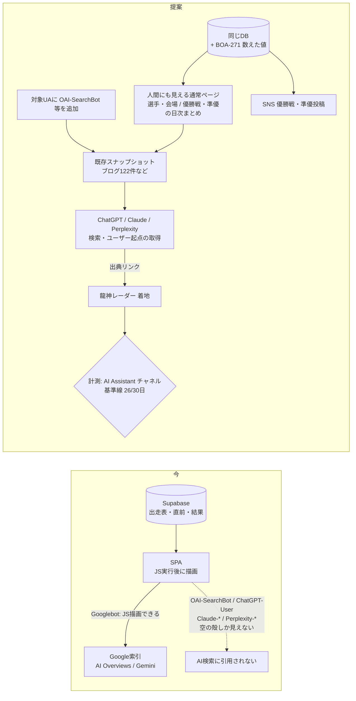
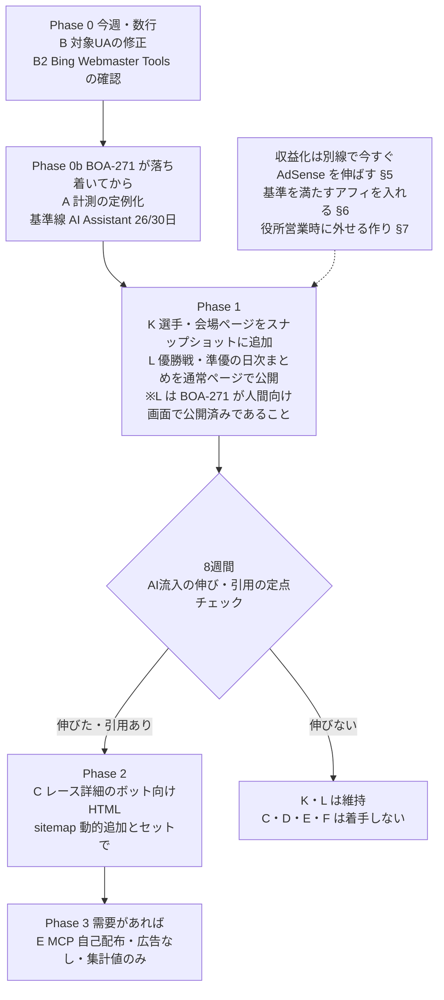

# AIエージェント時代の集客・収益化戦略（検証と提案）

調査と提案のみ。実装は含まない。入力はユーザーと Gemini の相談記録（`~/boatrace-data-archive/strategy/競艇データの見方と選手戦法.md`）と、2026-10-05 時点のユーザーの注力（①BOA-271・BOA-430 の UI/UX、②271/430 の分析で優勝戦・準優の特徴を SNS 投稿、③この戦略でマネタイズ）。

## 結論（先に）

1. Gemini 案の骨格（AI 検索に引用される HTML を主、MCP/API を副、着地ページで収益化）は方向として妥当。ただし**前提の半分は一次情報と食い違う**。特に「競合はAIをブロックしている」「MCP の返り値にアフィリエイトを入れる」「公営競技アフィリは1件1,500〜4,000円」「データは公式DLファイルだから安全」は誤りか裏付けなし（下の検証表）
2. **AIに読めていないのは競合ではなく龍神レーダー自身**。ボートレース日和はサーバー描画で robots.txt も全ボット許可。龍神レーダーは SPA で、レースページ・一覧ページはAIクローラーに空の殻しか返していない。しかもスナップショットの対象UAに ChatGPT 検索用の OAI-SearchBot 等が入っていない。まずここを直すのが最小の第一歩（配列に5つ足すだけ）
3. MCP/ChatGPT App のディレクトリ掲載は、**広告・スポンサー表示を禁止**している（OpenAI・Anthropic とも）。「MCP経由で広告を見せる」は配布経路の規約と両立しない。MCP は収益源ではなく、やるなら開発者向けの無料の窓口
4. AI 経由の流入は GA4 の「AI Assistant」チャネルで **26セッション/30日（ja 流入約2,390の約1.1%、2026-08 時点）**。AI 施策だけで収益を語れる規模ではない。収益は**既に入っている AdSense を伸ばすこと**と、**ブランド基準を満たすアフィリエイトを全部入れること**で取りに行き、AI 施策は集客（PV）の一つとして扱う（§5〜§7）
5. 中身は BOA-271 の「数えた値」（過去の実際の件数・割合とぶれ幅）がそのまま使える。Gemini 例文の「カドまくり指数88%」「本線4-5」型の断定は、BOA-617 の「的中率の土俵で戦わない」と衝突するので採らない。ボット専用ページを新しく作るより、**人間にも見える通常ページ（選手・会場ページ、優勝戦・準優の日次まとめ）を既存のスナップショットに載せる**方が安く、クローキングの心配も無い。②の SNS 投稿と素材を共有する

## 1. Gemini の主張の検証

| # | Gemini の主張 | 判定 | 一次情報・根拠 |
|---|---|---|---|
| 1 | 事実データ（着順・ST・風速）に著作権は無い | **概ね正しい。ただし不十分** | 著作権法2条1項1号（創作的表現が対象）。一方、データベースの選択・体系に創作性があれば12条の2で保護され、創作性が無くてもデッドコピーを競合事業に使うと不法行為になりうる（翼システム事件、東京地判平13.5.25）。さらに下の#2の規約がある |
| 2 | 公式ダウンロードデータを使えば規約上クリーン | **前提違い。規約の拘束力は限定的だが、リスクは残る** | 龍神レーダーは公式DLの K ファイル（`scripts/lib/kfileParser.js`、`www1.mbrace.or.jp/od2/K`）に加え、**公式サイトの HTML**（出走表 racelist・直前 beforeinfo・結果 raceresult・オッズ odds*、`scripts/daily/`）や BOATCAST（`race.boatcast.jp`）を取得している。公式サイトポリシーは「著作権法が定める場合もしくは個々のコンテンツに個別の利用条件が示されている場合を除き、著作権者の許諾なく、私的使用など法律によって認められる範囲を超えて、無断で使用（複製、改ざん、頒布などを含む。）することはできません」、禁止事項に「大量の情報送受信及び大量のアクセスなど、本サイトの運営に支障を与える行為」、リンクは事前申請・原則トップページ・「営利目的のリンクはお断り」。DLページにも個別の利用条件は無い（[サイトポリシー](https://www.boatrace.jp/owpc/pc/extra/policy.html)、[DLページ](https://www.boatrace.jp/owpc/pc/extra/data/download.html)）。「無断使用不可」は著作権を根拠にした文言で、著作物でない事実データそのものを縛る力は弱く、閲覧者との契約として成立するかも疑わしい。**現実のリスクは2つ**: DB の丸写しによる不法行為（#1）と、「大量アクセス」条項。後者について ADR 0057 はオッズ取得だけで boatrace.jp へ1日約5,400リクエストを想定し、礼儀正しさは未検証としている |
| 3 | ボートレース日和は AI をブロックし、AI ボットは既存サイトで「詰まる」 | **誤り** | 2026-10-05 取得: 日和の robots.txt は `User-Agent:*` で一部 PHP だけ Disallow、AI ボットの拒否なし。トップ HTML（86KB）に会場・開催日・R がサーバー描画で入り、JSON-LD（WebSite・BreadcrumbList）もある。OAI-SearchBot の UA で 200。llms.txt は 404、MCP の公開は見当たらない。**読めないのは龍神レーダー（SPA）の方** |
| 4 | 日和は MCP・構造化 API・AI 経由アフィをやっていない | 正しい（公開情報の範囲） | llms.txt 404、公開 API・MCP の告知なし。ただし #3 のとおり HTML はAIに読める |
| 5 | llms.txt を置けば AI が読む | **効果は未確認** | Google は「Search（AI Overviews・AI Mode を含む）は llms.txt を無視する」とガイドに明記（2026-06-15 更新、Search Central）。他社も読む保証は公開されていない。龍神レーダーは既に `public/llms.txt` を設置済みなので、追加投資は不要 |
| 6 | AI 検索ボット向け HTML を作れば ChatGPT 等が引用する | **仕組みは正しい。条件付き** | OpenAI: ChatGPT 検索の出典に出るには OAI-SearchBot の許可が必要（「Sites that are opted out of OAI-SearchBot will not be shown in ChatGPT search answers」）。ユーザーの質問時に取りに来るのは ChatGPT-User（[OpenAI bots](https://developers.openai.com/api/docs/bots)）。ChatGPT 検索は Bing 等の検索プロバイダの結果も使うという見方があるが、OpenAI の公式記述では未確認（二次情報）。龍神レーダーのスナップショット対象 UA は `GPTBot/ClaudeBot/PerplexityBot/Google-Extended/facebookexternalhit/Twitterbot`（`src/config/aiCrawlerBots.js`）で、**OAI-SearchBot・ChatGPT-User・Claude-SearchBot・Claude-User・Perplexity-User が無い**。`Google-Extended` は robots.txt 用のトークンで、取得時の UA ではない。配信対象パスもブログ・`/winning-technique`・`/today`（ビルド時固定）だけで、**レース詳細（`/race/:raceId`）・一覧・選手・会場ページは対象外** |
| 7 | 当日の「福岡12R」をAIに聞くと龍神レーダーが出る | **時間軸に難あり** | 検索インデックスは分単位で更新されない。当日レースはユーザー起点の取得（ChatGPT-User 等）頼みになる。どのページを取りに行くかは AI 側の検索結果次第で、新興ドメインの個別レースURLが選ばれる保証は無い |
| 8 | GPT Store に出せば一般ユーザーが使う | **前提が古い＋規約が壁** | 現在は Apps SDK（MCP ベース）のアプリディレクトリ。提出ガイドラインは「Plugins must not serve advertisements and must not exist primarily as an advertising vehicle」、禁止商品に「Real-money gambling services, casino credits, sportsbook wagers」（[App submission guidelines](https://developers.openai.com/apps-sdk/app-submission-guidelines)）。Anthropic のディレクトリも広告・スポンサー表示・広告目的のソフトを不可（[Software Directory Policy](https://support.claude.com/en/articles/13145358-anthropic-software-directory-policy)）。データ分析アプリなら賭博サービスには当たらない可能性があるが、**返り値に `contextual_offer` を入れる設計は掲載不可** |
| 9 | MCP は公開しただけでは呼ばれない | 正しい | ユーザーが接続を登録して初めて使われる。ディレクトリ掲載は #8 の制約 |
| 10 | 公営競技アフィは1件1,500〜4,000円、AdSense の数十倍 | **裏付けなし** | 公開情報で確認できたのは WINTICKET（競輪・オート）のアクセストレード／バナーブリッジ案件で、アプリインストール1件 275円の例。テレボート自体の ASP 案件は公開情報で見つからない。ネット銀行の口座開設案件は ASP に存在するが、「テレボート用」と訴求してよいかは各案件の掲載規約次第（ASP にログインしないと確認できない、未確認） |
| 11 | 予想サイトの LINE・メアド登録案件（2,000〜5,000円） | **採るべきでない** | 国民生活センターがギャンブル必勝法・予想情報の情報商材トラブルを注意喚起している類型（[情報商材](https://www.kokusen.go.jp/soudan_topics/data/infoproducts.html)）。信用・役所広告の両方に致命的 |
| 12 | 21時以降は「ミッドナイト競輪で取り返す」訴求 | **採るべきでない** | 損失の取り戻しを促す訴求で、ギャンブル等依存症対策の趣旨と正面衝突。役所広告の方針とも逆 |
| 13 | AdSense はクリック数十円、併用が王道 | 概ね正しい。**龍神レーダーは既に導入済み**（§5） | Google パブリッシャー制限の「オンラインギャンブル」は、日本のユーザー向けは例外国に含まれる（[パブリッシャー制限](https://support.google.com/publisherpolicies/answer/10437795?hl=ja)）。Vercel は Hobby だと AdSense 掲載が商用利用として不可だが、**既に Pro へ移行済み**（ADR 0057）で障害にならない。アフィリエイトを置く場合はステマ規制（景表法、2023-10 施行）により広告である旨の表示が要る |
| 14 | Next.js で SSR にすればよい | 正しいが重い | ADR 0032 でフル SSR 移行は数週間規模として見送り済み。必要なページだけボット向け HTML を返す既存方式の延長で足りる |

### Gemini 例文と事業制約の衝突

| 例文 | 衝突する制約 | 代わりの書き方（BOA-271 の数えた値） |
|---|---|---|
| 「4号艇のカドまくり指数88%」「本線4-5、4-1」 | BOA-617「的中率・回収率の土俵で戦わない」、BOA-271「ブラックボックスの予想をしない。主役は数えた値」 | 「2019/4/1以降、{会場}で級別の組み合わせが同じ優勝戦は{n}件。4号艇が3着以内に入ったのは{k}件（{p}%、ぶれ幅{a}〜{b}%）」 |
| 「必勝」「確実に仕留める」 | 誇大表現の回避（景表法・BOA-617） | 使わない |
| 画面内の「競艇」 | `.claude/rules/code-style.md`（画面内不可、`<title>`・meta・OGP は暫定で可） | ボット向け HTML の本文も画面内と同じ扱いで「ボートレース」。title・meta のみ例外の範囲で可 |
| 「龍神レーダー指数によると」 | 独自の名前付き指数は予想の断定に読まれやすい | 主語は「龍神レーダーの集計では」。値は件数と割合 |

## 2. 龍神レーダーの実情

- **配信の穴**: レース詳細（`/race/:raceId`）・一覧（`/races/{日付}`、`/races/{日付}/{会場}`）は SPA の殻（`

`）だけ。Googlebot は JS を描画するので Google 索引（AI Overviews・Gemini）には載りうるが、OpenAI・Anthropic・Perplexity の取得には中身が見えない（`docs/reference/seo-architecture-constraints.md`、ADR 0032）
- **発見の穴**: sitemap にあるのは一覧（日付7件・日付×会場84件）・選手320件・ブログ122件・会場24件など。**個別レースの URL は載っておらず**、一覧も殻なので、ボットがリンクをたどって個別レースに着く経路が無い。レース単位のボット向け HTML を作っても、それだけでは見つけてもらえない
- **ビルド時スナップショットはレースに使えない**: 日替わりの中身を入れられない（`/today` も定義だけ）。レース単位で出すなら**リクエスト時に DB から HTML を作る関数**が要り、ADR 0032 で却下した案C（オンデマンド）を採り直すことになる。人間向け画面と別テンプレートになるので内容のずれ（クローキングに近い状態）も起きやすい。Google は動的レンダリングを「似た内容ならクローキングではない」としていたが、2024年に推奨をやめている
- **時間で古くならないページが既にある**: 選手ページ（現役A1の320件を index 化済み）・会場ページは sitemap に載っていて、日替わりでないのでビルド時スナップショットに載せられる。「{選手名} 成績」「{会場} 傾向」型の質問と相性がよい
- **素材**: BOA-271 v16（`docs/design/analogy-finder/spec.md`、feature/boa-271-fr2-strat）は、優勝戦・準優勝戦の判定規則（v2、82件の一致検査つき）、数えるレースの範囲（VC/NC/NCR/VA/VG/NA）、Wilson のぶれ幅、30件未満は割合を出さない規則を持つ。**AI 向け HTML と SNS 投稿は、この集計の文章版を出すだけで済む**。新しい指標を作らない
- **事業制約**: 役所広告を将来の収益源として残している（memory: kyoutei_terminology_ban_rationale）。AdSense・アフィを入れるとその選択肢と衝突しうる（役所側の出稿審査がギャンブル広告の併載をどう見るかは未確認）
- **計測**: GA4 の既定チャネル「AI Assistant」は取れている（`data/analysis/i18n-demand/report-2026-08-26.json`、30日で26セッション。Organic Search 1,449、Direct 736）。未着手なのは PR#468 のフォローアップ「定点観測の定例化」と、Vercel ログのボット UA 別集計

## 3. 選択肢の比較

| 選択肢 | 効果（見込み） | 費用 | リスク | 必要な事業判断 |
|---|---|---|---|---|
| A. 計測の定例化（既存 GA4 AI Assistant チャネルの週次化、Vercel ログのUA別集計、公式への取得総量） | 判断の前提が揃う | 小 | なし | なし |
| B. 対象UAの修正（OAI-SearchBot・ChatGPT-User・Claude-SearchBot・Claude-User・Perplexity-User を追加） | 既存スナップショット（ブログ122件等）が ChatGPT 検索等に出る前提が揃う。人間向け画面を描画したものなのでクローキングの問題は無い | 極小（配列に5つ） | ほぼなし | なし |
| B2. Bing Webmaster Tools の登録確認・IndexNow | ChatGPT 検索が Bing を使っているなら効く（未確認） | 極小 | なし | なし |
| K. 選手・会場ページを既存のビルド時スナップショットに追加 | 時間で古くならない質問に効く。発見経路は sitemap に既にある | 小〜中（生成対象を足す） | 小（ビルド時間の増加） | なし |
| L. 優勝戦・準優の日次まとめを**通常ページ**として公開（BOA-271 の数えた値の文章版。SNS 投稿と同じ素材） | 引用の可能性は中。人間にも見えるのでクローキングの心配なし。既存のスナップショット・sitemap に乗る | 小〜中（BOA-271 が人間向け画面で公開済みであることが前提） | 毎日のデプロイが要る。自動生成ページの量産に見えないよう SG・G1 の優勝戦・準優に限る | 対象範囲 |
| C. 優勝戦・準優のレース詳細にボット向け HTML（リクエスト時生成） | K・L より当日性は高いが、発見経路（sitemap への動的追加・一覧ページの配信）も別に要る | 中（関数＋テンプレート＋sitemap＋ADR） | 人間向け画面との内容のずれ | K・L の結果を見てから |
| D. 全レースのボット向け HTML | 量は増えるが、質の薄い自動生成ページの大量化はスパム判定・クロール予算の懸念 | 中〜大 | 中 | C の結果を見てから |
| E. MCP（自己配布・無料・広告なし、URL 登録式） | 小（開発者・ギーク層のみ）。ブランド露出 | 中（同じ集計 API を薄く包む） | 生データを返すと規約#2のリスクが上がる。集計値に限る | 生データを出さない線引き |
| F. ChatGPT App / Claude ディレクトリ掲載 | 一般ユーザーへの露出は最大 | 中〜大＋審査 | 広告・アフィは掲載不可。賭博カテゴリ扱いで落ちる可能性 | 広告なしで出す価値があるか |
| G. AdSense を伸ばす（導入済み。§5） | 同意率・手動枠・PV の掛け算で伸びる | 小〜中 | UX 低下、CLS の再発 | 同意の取り方（§5） |
| H. ブランド基準を満たすアフィを全部入れる（§6） | 旅行・宿泊（会場ガイド）が最有力、ほかは未知数 | 小〜中 | ステマ規制の表示義務、ASP の掲載可否 | なし（基準は §6 で定義） |
| I. 基準を満たさないアフィ（予想サイト・情報商材・借入・取り返し訴求） | — | — | 信用・依存症・役所広告に致命的 | 不採用 |
| J. 有料 API（生データ・集計の販売） | 小〜中 | 大（課金・SLA） | 規約#2で最もリスクが高い（データの頒布そのもの） | 振興会への許諾の要否 |

## 4. 推奨: MVP と段階計画

- **MVP は Phase 0 の UA 修正**（配列に5つ足すだけ）。ブログ122件などの既存スナップショットが ChatGPT 検索等に出る前提条件で、遅らせた分だけ基準線の計測も遅れる。BOA-271 の作業と衝突しない
- **Phase 1 は人間にも見える通常ページで行う**。新しい指標は作らず、BOA-271 の「数えた値」を文章化する。ボット専用ページを作らないので、内容のずれ（クローキング）と発見経路の問題が起きない。L はユーザーの注力②（優勝戦・準優の SNS 投稿）と素材を共有する
- **主要な内容は人間向け画面と同じにする**。ボットにだけ見える主張は書かない（AI の出典から来た人が引用元を画面で見つけられないと信用を損なう）
- レース詳細のボット向け HTML（C）は、K・L で引用が出てから。やる場合は sitemap への動的追加と一覧ページの配信をセットにする
- **収益化は AI 施策と別の線で今すぐ進める**（ユーザー決定 2026-10-05: 役所広告が最優先だが、PV が増えないと営業できないので当面は AdSense・アフィを優先）。役所に営業する時点で外せる作りにする（§7）

### 測り方

| 指標 | 取り方 | 目安 |
|---|---|---|
| AI 経由セッション | GA4 既定チャネル「AI Assistant」と参照元（chatgpt.com / perplexity.ai / gemini.google.com / claude.ai / copilot.microsoft.com 等）を週次集計（`/growth-report` に追加） | 基準線 26/30日（2026-08）。Phase 1 後 8週で2倍以上を「伸びた」とみなす |
| ボット取得数 | Vercel のログで UA 別（OAI-SearchBot・ChatGPT-User・Claude-*・Perplexity-*）・パス別の件数 | Phase 0 後に取得が出てくること（配信が届いている証拠） |
| 引用の定点チェック | 週1回、固定10問（例「{会場}の優勝戦の過去の傾向は」「{選手名}の成績は」）を ChatGPT・Perplexity・Gemini に投げ、出典に boat-ai.jp が出た数を記録 | 8週で1問以上の継続的な引用 |
| 着地後の回遊 | AI 経由セッションの2ページ目到達率 | サイト平均以上なら AI 経由の質は高い |
| 公式への取得総量 | 1日あたりの boatrace.jp へのリクエスト数（ADR 0057 の想定 約5,400/日 を実測で確認） | 「大量アクセス」条項への説明ができる水準か |

撤退条件: Phase 1 後 8週で AI 経由セッションが基準線から伸びず、引用も0なら、K・L は維持（費用が小さい）したまま追加投資を止める。

## 5. AdSense: 現状と伸ばし方

### 現状（コードで確認）
- 導入済み。`public/ads.txt`（pub-4942038531343866）、`src/utils/analytics.js` の `initAdSense`
- **自動広告（Auto Ads）のみ**。手動の広告枠（`<ins class="adsbygoogle">`）は src に無い。SPA のページ遷移ごとに `refreshAdsOnRouteChange` が再スキャンを促す（`src/AppRouter.jsx`）
- **Cookie 同意バナーで「同意」を押した人にだけ読み込む**（`initTrackingIfConsented`、`CookieConsent.jsx`）。拒否・未回答の人には広告が出ない。GA4 も同じ条件なので、GA4 の PV（ja 約1万PV/月）は「広告を出せる PV」とほぼ同じ母数
- 収益の実績（RPM・表示回数・クリック）はリポジトリにも MCP にも無く、確認できない。**AdSense 管理画面の直近28日の「ページ RPM」「表示回数」「推定収益」を共有してもらえれば、以下の見込みを実数に置き換える**

### 伸ばし方（効きそうな順）

| # | 打ち手 | 効き方 | 費用 | 注意 |
|---|---|---|---|---|
| 1 | **同意の取り方を見直す** | 日本の外部送信規律（電気通信事業法、2023-06 施行）は「通知・公表」「同意」「オプトアウト」のいずれかでよく、同意を必須にしていない。日本向けは「プライバシーポリシーで公表＋オプトアウト可」にすると、同意しない人にも広告が出る（パーソナライズしない広告に限る等の選択肢もある）。同意率が5割なら、出せる PV が最大で約2倍 | 小 | GA4 の数値も同時に増えて時系列が切れる（`ga4MeasurementBreaks.js` に記録）。EEA・英国の利用者には Google 認定の同意管理（CMP）が要るので、言語ではなく地域で分ける。プライバシーへの姿勢というブランド判断を含む |
| 2 | **手動の広告枠を少数入れる** | 自動広告は SPA で枠が少なくなりがち。滞在の長い場所（レース詳細のタブの下、ブログ本文の中ほど、選手ページの下）に、高さを先に確保した枠を置く | 小〜中 | CLS の再発（2026-09 に修正した経緯）。高さ固定で防ぐ。分析の主役（数えた値・表）の上や間には置かない |
| 3 | **自動広告の設定を点検する** | 管理画面でアンカー・モバイル全画面（vignette）・ページ内の広告数の上限を確認。vignette は収益に効くが体験を損ねやすい | 極小 | 設定は管理画面のみ（ユーザー作業） |
| 4 | **ギャンブル系の広告カテゴリを管理画面で止められるようにしておく** | 役所営業時の切り替え（§7） | 極小 | 止めると単価は下がる |
| 5 | PV を増やす | 本書の AI 施策（§4）・SNS・通常 SEO | — | 収益は PV に比例 |

見込み（仮定）: 出せる PV 約1万/月 × RPM 100〜500円 ＝ 月1,000〜5,000円。#1 で出せる PV が増え、#2 で RPM が上がる。実数は管理画面の値で置き換える。

## 6. アフィリエイト: ブランド基準と案件一覧

ユーザー方針（2026-10-05）: マネタイズできて、龍神レーダーのブランドを損ねないものは全部入れて収益を最大化する。

### ブランド基準（全部満たすものだけ載せる）

| # | 基準 | 理由 |
|---|---|---|
| B1 | 的中・回収・儲かることを保証も示唆もしない（「必勝」「勝てる」「回収率◯%」の文言・素材を使わない） | BOA-617・景表法の優良誤認 |
| B2 | 射幸心・損失の取り戻しを煽らない（「軍資金」「取り返す」「今だけ」「負けた後に」等の訴求、時間帯で煽る出し分けをしない） | ギャンブル等依存症対策の趣旨、信用 |
| B3 | 広告である旨を必ず表示する（「PR」「広告」をリンク・バナーの近くに） | 景表法のステマ規制（2023-10 施行） |
| B4 | 投票サービス・投票用口座の案件には「20歳未満は投票できません」と依存症の相談窓口へのリンクを添える | 公営競技の年齢制限、依存症対策 |
| B5 | 違法・グレーなものを載せない（オンラインカジノ、予想サイト、情報商材、必勝法） | 違法性・国民生活センターの注意喚起の類型 |
| B6 | 借入・資金づくりを連想させるものを載せない（カードローン、消費者金融、後払い、クレジットカードを「投票資金」と結びつける訴求） | 依存症・信用 |
| B7 | 画面に出る素材（バナー画像・文言）に「競艇」を含めない | `.claude/rules/code-style.md` |
| B8 | 分析の主役（数えた値・表・グラフ）の上や間に置かない。CLS を起こさない | UX |
| B9 | 1か所の設定で、カテゴリごとに消せる（§7） | 役所営業時の切り替え |

### 基準を満たす案件の種類と優先順位

見込みは相対評価（料率・承認条件は ASP に登録しないと分からず、未確認）。

| 優先 | 種類 | 置き場所 | 見込み | 理由・注意 |
|---|---|---|---|---|
| 1 | **旅行・宿泊**（楽天トラベル、じゃらん、一休、Booking.com、Klook 等） | 会場ガイド（24会場×4言語、`/venues/:slug`）、SG・G1 の節ページ | 中〜高 | 「現地観戦」という文脈がそのまま宿泊・交通につながる。ギャンブル色が無く、役所営業時も残せる。海外向けは Booking.com・Klook |
| 2 | **ネット銀行の口座開設**（テレボート対応の銀行） | 使い方ガイド・初心者向けブログ | 中 | 単価は高めとされる（未確認）。B4 を添える。「投票用」と訴求してよいかは各案件の規約次第 |
| 3 | **公営競技の公式系ネット投票**（オッズパーク、楽天競馬、SPAT4、WINTICKET、チャリロト等） | 使い方ガイド・初心者向けページ | 小〜中 | WINTICKET はアプリ1件 275円の例。B2・B4 を厳守。登録特典は事実だけを書き、時間帯で出し分けない。テレボート自体の案件は公開情報で見つからない |
| 4 | **書籍・観戦グッズ**（Amazon アソシエイト、楽天アフィリエイト。入門書・選手本・双眼鏡・観戦用品） | ブログ・選手ページ・会場ガイド | 小 | 単価は低いがブランドに合う。役所営業時も残せる |
| 5 | **交通**（レンタカー、高速バス、航空券） | 会場ガイド | 小 | 1 と同じ文脈 |
| 6 | **動画・データ分析の学習**（データ分析講座、プログラミング学習等） | 「AI用にコピー」・分析ツール周辺 | 小 | 文脈は弱い。後回し |
| — | 載せない: 予想サイト・情報商材・オンラインカジノ・借入・必勝法、損失の取り戻しを煽る出し分け | — | — | B2・B5・B6 |

最初に入れるのは 1（旅行・宿泊）と 4（書籍・グッズ）。ブランドへの影響が小さく、役所営業時も外さずに済む。2・3 は B4 の表示を作ってから入れる。

## 7. 役所営業時に外しやすい作り

役所広告は最優先だが、PV が増えないと営業できない。当面は AdSense・アフィを優先し（ユーザー決定 2026-10-05）、営業の時点で外せる作りにしておく。

- 収益化の出し入れを**1つの設定ファイル**（例: `src/config/monetization.js`）に集める。カテゴリごとに on/off（`adsense`・`affiliate.travel`・`affiliate.bank`・`affiliate.betting`・`affiliate.goods` 等）。アフィのリンク・バナーは共通の部品経由でだけ出す
- 営業時に外す・変えるもの:

| 対象 | 営業時の扱い |
|---|---|
| 投票サービス・投票用口座のアフィ（優先 2・3） | off |
| AdSense | 管理画面でギャンブル系カテゴリを止める。役所の条件次第で off（`initAdSense` と `ads.txt` の2か所） |
| 旅行・書籍・交通のアフィ（優先 1・4・5） | 役所の条件次第。原則は残す |
| `<title>`・meta・OGP の「競艇」（暫定例外） | 外す（ルール上の既定どおり） |
| プライバシーポリシーの広告の記述 | 残った広告に合わせて直す |

- 役所の審査条件は知人に確認してから決める（未確認）。分かった時点で上表を確定する

## 8. 振興会に問い合わせない前提での運用

ユーザー決定（2026-10-05）: 問い合わせない。代わりに次の運用でリスクを下げる。

| # | 運用 | 今の状態 |
|---|---|---|
| 1 | 公式サイトへの取得は**直列・間隔を空ける**。1日あたりの総リクエスト数の上限を決め、超えたら止まるようにする | 取得元ごとの実測が無い（ADR 0057 の想定はオッズだけで約5,400/日）。まず実測する（Phase 0b の計測に含める） |
| 2 | 取得の UA に連絡先を明示する | 済み（`BoatraceAIBot/1.0 (+GitHubのURL)`） |
| 3 | **生データを再配布しない**。API・MCP・CSV ダウンロードで出走表・結果・オッズの生値を返さない。出すのは集計値・加工値と画面表示 | 守れている。MCP をやる場合も集計値に限る（§9） |
| 4 | 公式のロゴ・写真・動画・PDF をそのまま載せない | 要点検（今回は未確認） |
| 5 | 公式へのリンク: サイトポリシーは「原則トップページ」「営利目的のリンクはお断り」。今は出走表・オッズ等へのディープリンクがある（`src/` に数か所） | 利用者の利便が大きく、業界でも一般的なので残す。停止を求められたら外す |
| 6 | 停止要請への備え: 取得元ごとに止めるスイッチを持ち、連絡が来たら即日止められるようにする | 未整備 |

## 9. MCP・ディレクトリ掲載とは（非エンジニア向け）

- **MCP（Model Context Protocol）**: ChatGPT や Claude などの AI に「道具」を渡すための共通の差し込み口。龍神レーダーが MCP サーバーを用意すると、AI が会話の途中で「龍神レーダーに今日の◯◯の優勝戦の過去データを聞く」ことができるようになる。Web ページを AI が読みに来るのとは違い、AI が龍神レーダーのデータを直接受け取る
- **ただし勝手には使われない**。利用者が自分の AI の設定画面で「この MCP をつなぐ」と登録して初めて使われる。一般のファンが自分で登録することはまずない
- **ディレクトリ掲載**: OpenAI（ChatGPT のアプリ一覧）や Anthropic（Claude のコネクタ一覧）が運営する「公式アプリストア」のようなもの。載ると、一般の利用者がボタン1つで龍神レーダーをつなげるようになる。審査があり、**広告・スポンサー表示の入ったものは載せられない**。OpenAI は実金のギャンブルサービスも禁止している（龍神レーダーは分析で、投票サービスではないが、審査でどう扱われるかは分からない）

| | 得られるもの | 要るもの |
|---|---|---|
| MCP（自分で配布） | AI に詳しい層への露出。「AI で使えるボートレース分析」というブランド | 集計値を返す窓口の開発と保守。生データを返さない線引き（§8-3）。収益は直接は生まない |
| ディレクトリ掲載 | 一般の ChatGPT・Claude 利用者への露出 | 上記に加えて審査対応。返す内容に広告・アフィを一切入れない。賭博の扱いで落ちる可能性 |

AdSense・アフィで稼ぐ今の方針では、MCP は「直接は稼がない宣伝の窓口」にとどまる。

改めての推奨: **(a) Phase 3 まで着手しない**。Web ページで AI に引用されるか（§4）を先に確かめ、引用・流入が伸びて「AI から直接使いたい」需要が見えたら、広告なしの自己配布 MCP（b）を検討する。ディレクトリ（c）はその後。

## 10. ユーザーの決定（2026-10-05）

| # | 項目 | 決定 |
|---|---|---|
| 1 | Phase 0 の時期 | UA 修正と Bing の確認は今週、計測の定例化は BOA-271 の後 |
| 2 | Phase 1 の範囲 | 選手・会場ページをスナップショットに追加＋SG・G1 の優勝戦・準優の日次まとめ（日次まとめは BOA-271 が人間向け画面で公開されてから） |
| 3 | AdSense | 導入済み。伸ばし方は §5（同意の取り方の見直しは要判断。下の残る判断） |
| 4 | アフィリエイト | ブランドを損ねないものは全部入れる。基準と一覧は §6 |
| 5 | 役所広告との優先順位 | 当面は AdSense・アフィを優先。営業時に外せる作りにする（§7）。審査条件は知人に確認 |
| 6 | 振興会への問い合わせ | しない。運用は §8 |
| 7 | MCP・ディレクトリ | §9 の説明を受けて改めて判断（推奨 a） |

### 残る判断（新しく出たもの）
| # | 決めること | 案 | 推奨 |
|---|---|---|---|
| R1 | 日本向けの広告・計測を同意なしで出すか（§5-#1） | a 日本向けは「公表＋オプトアウト」に変え、同意なしでも出す / b パーソナライズしない広告に限って同意なしで出す / c 今のまま同意必須 | **b**。出せる PV を増やしつつ、プライバシーへの姿勢を保てる。GA4 の時系列が切れる点は記録する |
| R2 | 最初に入れるアフィ | a 旅行・宿泊＋書籍・グッズから / b 全種類を一度に / c 銀行・投票サービスから | **a**。ブランドへの影響が最小で、役所営業時も残せる |
| R3 | MCP（§9） | a Phase 3 まで着手しない / b 広告なしの自己配布 MCP を先に出す / c ディレクトリ申請 | **a** |

## 11. セカンドレビュー（second-opinion-reviewer）と対応

初版（ユーザー回答前）に対するレビュー。§5〜§10 はユーザー回答（2026-10-05）を受けた改訂で、このレビューの対象外。

判定は「条件付きで支持」。指摘7件と対応:

| # | 重大度 | 指摘 | 対応 |
|---|---|---|---|
| 1 | 高 | 「AI 経由は数えられていない／ほぼゼロ」は事実と違う。GA4 の AI Assistant で 26/30日。閾値300は現状の11.5倍で、達しても AdSense 数百円。AdSense はサイト全体に入るので、AI 流入で収益化を決めるのは軸がずれている | **採用**。基準線26を明記し、「AI 施策の継続」と「収益化」を別の判断に分けた（結論4、§4。初版の決定事項。2026-10-05 のユーザー回答で §10 に置き換え） |
| 2 | 高 | レース詳細は `/race/:raceId` で sitemap に個別レースが無く、一覧も殻なので、ボット向け HTML を作っても見つけてもらえない | **採用**（コードと sitemap で確認）。§2 に「発見の穴」を追加し、レース詳細のボット向け HTML（C）は sitemap 動的追加とセットで Phase 2 に下げた |
| 3 | 中 | ボット専用テンプレートは人間向け画面と内容がずれやすい。動的レンダリングは 2024年に Google が推奨をやめた | **採用**。「主要な内容は人間向け画面と同じ。ボット専用の主張は書かない」を §4 に明記。L は BOA-271 の人間向け公開を前提条件にした |
| 4 | 中 | より安い代替案（選手・会場ページのスナップショット追加、優勝戦・準優の日次まとめを通常ページで公開）を比べていない | **採用**。§3 に K・L を追加し、Phase 1 の本命を C から K・L に替えた。L の「自動生成ページの量産に見える」懸念は、SG・G1 の優勝戦・準優に限ることで抑える |
| 5 | 中 | #2 は「規約が緩くない」が言い過ぎ（事実データを縛る力は弱い）。一方「大量アクセス」条項の具体量（ADR 0057 の約5,400リクエスト/日）が抜け。問い合わせの切り替え条件に収益化を入れていない | **採用**。#2 の判定を直し、取得総量を計測に入れ、初版の推奨を「収益化の前に問い合わせ」に変えた（その後ユーザーは「問い合わせない」と決定。運用は §8） |
| 6 | 低 | Phase 0 を後回しにする推奨は自分の結論（費用最小の MVP）と矛盾。推奨が保守側に偏り、AdSense を退ける根拠が定量的でない | **採用**。UA 修正だけ今週に分け、AdSense はサイト全体の見込み額（仮定）を添えた。保守寄りの推奨自体は、収益額が小さい割に役所広告・UX を失うコストが戻しにくいという理由で維持 |
| 7 | 低 | ChatGPT 検索が Bing の索引も使っているなら、Bing Webmaster Tools と IndexNow が安い打ち手 | **一部採用**。根拠が二次情報なので「未確認」と明記した上で、費用がほぼゼロのため Phase 0 に確認だけ入れた |

レビューが確認できなかった点（BOA-271 の人間向け公開時期、役所の出稿審査、ChatGPT 検索の索引元、AdSense RPM・銀行アフィの実単価）は、いずれも本書でも未確認のまま。RPM とアフィ単価は ASP・AdSense に登録しないと分からないため、登録しない制約のもとでは仮定にとどまる。
