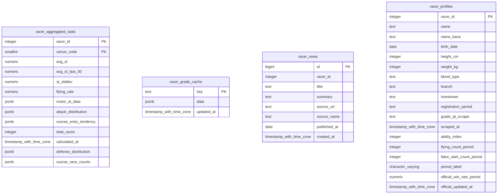
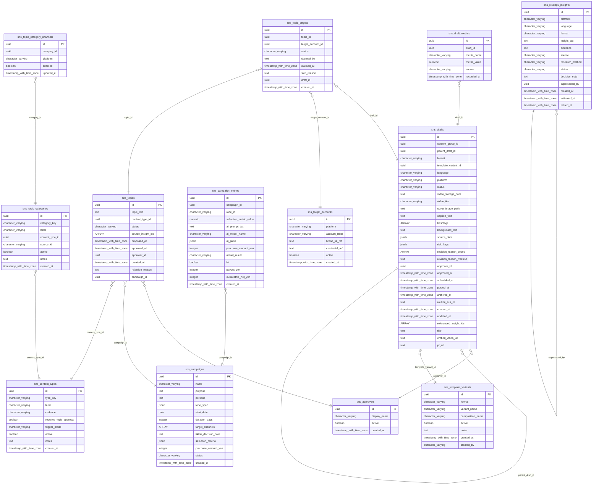

# データベース設計書

龍神レーダー Supabaseデータベースの設計仕様。

---

## 目次

1. [概要](#概要)
2. [テーブル一覧と使用状況](#テーブル一覧と使用状況)
3. [コアテーブル詳細](#コアテーブル詳細)
4. [テーブル関係図](#テーブル関係図)
5. [ソースコード別テーブル使用状況](#ソースコード別テーブル使用状況)
6. [スキーマの差異と課題](#スキーマの差異と課題)

---

## 概要

### データベース情報

| 項目 | 値 |
|------|-----|
| プラットフォーム | Supabase (PostgreSQL) |
| スキーマファイル | `docs/db-migration/001_schema.sql` |
| RPC関数 | `docs/db-migration/007_RPC_FUNCTIONS.sql` |

### 設計の経緯

1. **初期設計** (`scripts/db/SCHEMA_DETAIL.md`): 8テーブル構成
2. **拡張設計** (`docs/db-migration/001_schema.sql`): 17テーブル + ビュー構成
3. **追加テーブル** (`docs/db-migration/008_venue_rules.sql`): ルール管理用2テーブル

**現在の運用**: 拡張設計のうち、一部のテーブルのみを実際に使用中。

---

## テーブル一覧と使用状況

### 実際に使用中のテーブル

| テーブル名 | 用途 | 使用場所 |
|-----------|------|---------|
| `predictions` | AI予測データ | フロント、日次スクリプト、分析 |
| `race_results` | レース結果 | フロント、日次スクリプト、分析 |
| `races` | レース基本情報 | 日次スクリプト、分析 |
| `race_entries` | 出走選手情報 | 日次スクリプト、分析 |
| `race_conditions` | 天候等条件 | 予測生成スクリプト |
| `exhibition_data` | 展示タイム・ST | 予測生成スクリプト、フロント |
| `race_start_timings` | 本番ST | 結果スクレイピング |
| `racer_aggregated_stats` | 選手集計統計 | 予測生成（攻防分布等） |
| `models` | モデルマスタ | 日次スクリプト |
| `venues` | 会場マスタ | メンテナンススクリプト |

### 定義済みだが未使用のテーブル

| テーブル名 | 設計意図 | 未使用理由 |
|-----------|---------|-----------|
| `race_odds` | オッズ情報 | スクレイピング未実装 |
| `bet_filters` | フィルタ条件マスタ | ルールはコードにハードコード |
| `bet_recommendations` | 賭け推奨判定 | ルールマッチはコードで実行 |
| `daily_bet_summary` | 日次集計 | フロントでリアルタイム計算 |
| `user_visible_summary` | ユーザー向けサマリー | フロントでリアルタイム計算 |
| `model_performance_daily` | モデル日次パフォーマンス | 未実装 |
| `model_experiments` | A/Bテスト管理 | 未実装 |

### 追加定義されたテーブル（部分的使用）

| テーブル名 | 用途 | 使用状況 |
|-----------|------|---------|
| `venue_rules` | 会場別ルール定義 | `RulePerformance.jsx`で参照（現在は未使用） |
| `rule_applications` | ルール適用ログ | `daily-rule-tracking.js`で使用（現在は未使用） |

### 旧スキーマのテーブル（参照のみ）

| テーブル名 | 備考 |
|-----------|------|
| `results` | `race_results`に統合。一部スクリプトに残存参照あり |
| `daily_accuracy` | 未使用。`check-jan10.js`に残存参照あり |
| `racers` | `race_entries`にリネーム |
| `volatility` | `races`テーブルに統合 |

---

## コアテーブル詳細

### predictions

AI予測データを格納。最も頻繁にアクセスされるテーブル。

```sql
CREATE TABLE predictions (
    prediction_id SERIAL PRIMARY KEY,
    race_id VARCHAR(20) NOT NULL,        -- '2026-01-04-01-01' 形式
    model_id VARCHAR(50) NOT NULL,       -- 'standard', 'safeBet', 'upsetFocus'

    -- 予測内容
    top_pick SMALLINT NOT NULL,          -- 1着予測 (1-6)
    top_2nd SMALLINT,                    -- 2着予測 (1-6)
    top_3rd SMALLINT,                    -- 3着予測 (1-6)
    confidence SMALLINT,                 -- 信頼度 (0-100)

    -- 詳細スコア
    scores JSONB,                        -- 各艇のスコア（未使用）
    feature_contributions JSONB,         -- 展開予測+選手統計（下記参照）

    -- 結果照合（トリガーで自動更新）
    is_hit_win BOOLEAN,
    is_hit_place BOOLEAN,
    is_hit_trifecta BOOLEAN,
    is_hit_trio BOOLEAN,

    -- 配当
    payout_win INTEGER,
    payout_place INTEGER,
    payout_trifecta INTEGER,
    payout_trio INTEGER,

    -- メタ
    is_shadow BOOLEAN DEFAULT FALSE,
    predicted_at TIMESTAMPTZ DEFAULT NOW()
);
```

**インデックス:**
- `idx_predictions_race` (race_id)
- `idx_predictions_model` (model_id)
- `idx_predictions_race_model` (race_id, model_id)

**feature_contributions の構造:**

```jsonc
{
  "turnPrediction": {
    "patterns": [              // 上位3パターン（展開予測）
      { "course": 1, "technique": "逃げ", "probability": 0.52, "name": "1コース逃げ" },
      // ...
    ],
    "technique": "逃げ",       // 最有力決まり手
    "probability": 0.52,       // 最有力パターンの確率
    "winnerCourse": 1,         // 最有力1着コース
    "distribution": [...],     // 各コース勝率分布
    "boatStrengths": [...]     // 各艇の総合力
  },
  "racerStats": [              // 6艇の攻防統計
    {
      "boatNumber": 1,
      "course": 1,
      "attackDistribution": { "nige": 0.95, "sashi": 0.02, ... },
      "defenseDistribution": { "nigasare": 0.05, "sasare": 0.1, ... },
      "courseRaceCounts": { "1": 150, "2": 5, ... }
    },
    // ... 計6艇分
  ]
}
```

**使用パターン:**
```javascript
// フロントエンド (supabaseDataService.js)
supabase.from('predictions')
  .select('*')
  .eq('race_id', raceId)

// 日次スクリプト (generate-predictions.js)
supabase.from('predictions')
  .upsert(predictionData)  // feature_contributions含む
```

---

### racer_aggregated_stats

選手ごとの集計統計。`aggregate-racer-stats.js --all` で日次更新（`aggregate-stats.yml`）。

| カラム | 型 | 説明 |
|--------|-----|------|
| `racer_id` | integer | 選手登録番号（PK） |
| `venue_code` | integer | 会場コード（0=全会場集計）（PK） |
| `avg_st` | decimal(5,3) | 平均スタートタイミング |
| `avg_st_last_30` | decimal(5,3) | 直近30走の平均ST |
| `st_stddev` | decimal(5,3) | ST標準偏差 |
| `flying_rate` | decimal(5,4) | フライング率 |
| `attack_distribution` | JSONB | コース別決まり手分布 |
| `defense_distribution` | JSONB | 1コース時の被決まり手分布 |
| `course_race_counts` | JSONB | コース別出走数・勝利数 |
| `course_entry_tendency` | JSONB | 枠番→コース進入傾向 |
| `total_races` | integer | 総レース数 |

**複合PK:** `(racer_id, venue_code)`

**更新頻度:** 日次（`aggregate-stats.yml` — JST 23:00）

**データソース:** `race_entries` + `race_start_timings` + `race_results` から集計

**使用箇所:** `turnPrediction.js`（展開予測）、`generate-predictions.js`（スコア計算）

**使用パターン:**
```javascript
// 予測生成時 (generate-predictions.js)
supabase.from('racer_aggregated_stats')
  .select('*')
  .in('racer_id', racerIds)
  .eq('venue_code', 0)  // 全会場集計

// 集計スクリプト (aggregate-racer-stats.js)
supabase.from('racer_aggregated_stats')
  .upsert(record, { onConflict: 'racer_id,venue_code' })
```

---

### race_results

レース結果（着順・配当）を格納。

```sql
CREATE TABLE race_results (
    race_id VARCHAR(20) PRIMARY KEY,

    -- 着順
    rank1 SMALLINT NOT NULL,
    rank2 SMALLINT NOT NULL,
    rank3 SMALLINT NOT NULL,

    -- 配当
    payout_win INTEGER,                  -- 単勝
    payout_place_1 INTEGER,              -- 複勝1着
    payout_place_2 INTEGER,              -- 複勝2着
    payout_trifecta INTEGER,             -- 3連複
    payout_trio INTEGER,                 -- 3連単

    -- レース状況
    is_cancelled BOOLEAN DEFAULT FALSE,
    is_no_race BOOLEAN DEFAULT FALSE,

    -- 進入コース（結果確定後）
    course_1 SMALLINT,
    course_2 SMALLINT,
    course_3 SMALLINT,
    course_4 SMALLINT,
    course_5 SMALLINT,
    course_6 SMALLINT,

    -- 決まり手
    winning_technique VARCHAR(20),

    result_at TIMESTAMPTZ,
    created_at TIMESTAMPTZ DEFAULT NOW()
);
```

**使用パターン:**
```javascript
// フロントエンド
supabase.from('race_results')
  .select('*')
  .in('race_id', raceIds)

// 日次スクリプト (scrape-results.js)
supabase.from('race_results')
  .upsert(resultData)
```

---

### races

レース基本情報を格納。

```sql
CREATE TABLE races (
    race_id VARCHAR(20) PRIMARY KEY,     -- '2026-01-04-01-01' 形式

    -- 基本情報
    race_date DATE NOT NULL,
    venue_code SMALLINT NOT NULL,        -- 1-24
    race_number SMALLINT NOT NULL,       -- 1-12
    start_time TIME,

    -- ボラティリティ
    volatility_score SMALLINT,           -- 0-100
    volatility_level VARCHAR(10),        -- 'low', 'medium', 'high'
    recommended_model VARCHAR(50),
    volatility_reasons JSONB,

    -- 1号艇情報（分析用に非正規化）
    first_boat_grade VARCHAR(5),
    first_boat_win_rate DECIMAL(5,3),
    first_boat_motor_2rate DECIMAL(5,2),

    -- メタ
    created_at TIMESTAMPTZ DEFAULT NOW(),
    updated_at TIMESTAMPTZ DEFAULT NOW(),

    UNIQUE(race_date, venue_code, race_number)
);
```

**race_id 形式:**
```
2026-02-05-03-07
    │       │  └─ レース番号（07 = 7R）
    │       └──── 会場コード（03 = 江戸川）
    └──────────── 日付（YYYY-MM-DD）
```

---

### race_entries

出走選手情報を格納。

```sql
CREATE TABLE race_entries (
    race_id VARCHAR(20) NOT NULL,
    boat_number SMALLINT NOT NULL,       -- 1-6

    -- 選手情報
    player_name VARCHAR(50),
    grade VARCHAR(5),                    -- 'A1', 'A2', 'B1', 'B2'
    age SMALLINT,

    -- 成績情報
    win_rate DECIMAL(5,3),
    local_win_rate DECIMAL(5,3),
    global_2rate DECIMAL(5,2),
    local_2rate DECIMAL(5,2),

    -- 機材情報
    motor_number SMALLINT,
    motor_2rate DECIMAL(5,2),
    boat_number_id SMALLINT,
    boat_2rate DECIMAL(5,2),

    -- AIスコア（モデル別）
    ai_score_standard INTEGER,
    ai_score_safe_bet INTEGER,
    ai_score_upset_focus INTEGER,

    PRIMARY KEY (race_id, boat_number)
);
```

---

### models

モデルマスタ。

```sql
CREATE TABLE models (
    model_id VARCHAR(50) PRIMARY KEY,    -- 'standard', 'safeBet', 'upsetFocus'

    display_name VARCHAR(100),
    description TEXT,
    model_type VARCHAR(20),

    -- 状態
    status VARCHAR(20) DEFAULT 'development',
    is_public BOOLEAN DEFAULT FALSE,

    -- 実績サマリー
    total_predictions INTEGER DEFAULT 0,
    hit_rate_win DECIMAL(5,4),
    recovery_rate_win DECIMAL(5,4),

    created_at TIMESTAMPTZ DEFAULT NOW(),
    updated_at TIMESTAMPTZ DEFAULT NOW()
);
```

**初期データ:**
```sql
INSERT INTO models (model_id, display_name, model_type, status, is_public) VALUES
    ('standard', 'スタンダード', 'standard', 'production', TRUE),
    ('safeBet', '本命狙い', 'safe', 'production', TRUE),
    ('upsetFocus', '穴狙い', 'upset', 'production', TRUE);
```

---

### venues

会場マスタ。

```sql
CREATE TABLE venues (
    code SMALLINT PRIMARY KEY,           -- 1-24
    name VARCHAR(20) NOT NULL,
    water_type VARCHAR(10),              -- 'fresh', 'sea', 'brackish'
    cluster VARCHAR(20),                 -- 'in_strong', 'out_strong', 'balanced'
    avg_first_win_rate DECIMAL(5,4),
    avg_volatility_score DECIMAL(5,2),
    updated_at TIMESTAMPTZ DEFAULT NOW()
);
```

---

### race_conditions

天候・水面コンディション情報を格納。

```sql
CREATE TABLE race_conditions (
    race_id VARCHAR(20) PRIMARY KEY,

    -- 天候
    weather VARCHAR(10),
    wind_direction VARCHAR(10),
    wind_speed DECIMAL(4,1),
    wave_height SMALLINT,
    temperature DECIMAL(4,1),          -- 気温
    water_temperature DECIMAL(4,1),    -- 水温

    -- レースグレード
    race_grade VARCHAR(10),            -- SG, G1, G2, G3, 一般
    race_title VARCHAR(100),

    -- 節情報（未取得）
    series_day SMALLINT,
    is_final_day BOOLEAN,

    created_at TIMESTAMPTZ DEFAULT NOW()
);
```

---

### exhibition_data

展示航走データを格納。15分間隔ワークフロー（scrape-exhibition.yml）で取得。

```sql
CREATE TABLE exhibition_data (
    race_id VARCHAR(20) NOT NULL,
    boat_number SMALLINT NOT NULL,

    exhibition_time DECIMAL(5,2),      -- 展示タイム（秒）
    start_timing DECIMAL(4,2),         -- 展示ST（秒）

    created_at TIMESTAMPTZ DEFAULT NOW(),

    PRIMARY KEY (race_id, boat_number)
);
```

**使用パターン:**
```javascript
// 予測生成 (generate-predictions.js)
supabase.from('exhibition_data')
  .upsert(exhibitionRows)

// フロントエンド (supabaseDataService.js)
supabase.from('exhibition_data')
  .select('*')
  .eq('race_id', raceId)
```

---

### race_start_timings

本番レースのスタートタイミング情報。

```sql
CREATE TABLE race_start_timings (
    race_id VARCHAR(20) NOT NULL,
    boat_number SMALLINT NOT NULL,

    start_timing DECIMAL(4,2),         -- 本番ST（秒）
    is_flying BOOLEAN DEFAULT FALSE,   -- フライング
    is_late_start BOOLEAN DEFAULT FALSE, -- 出遅れ

    created_at TIMESTAMPTZ DEFAULT NOW(),

    PRIMARY KEY (race_id, boat_number)
);
```

---

## テーブル関係図

**2026-09-15更新**: 以下は`mcp__supabase__list_tables`で取得した本番スキーマの実データから機械生成した、現在稼働中の全54テーブルの俯瞰図。旧ASCII図（実使用9テーブルのみを手動で描いたもの）はSNSマーケティングハブ（13テーブル）・選手データ（4テーブル）等を欠いており、情報の陳腐化を機械的に防げない手動更新の限界そのものだったため置き換えた。上記「テーブル一覧と使用状況」「コアテーブル詳細」は初期設計時点の記述のままで、この置き換えに合わせた更新はしていない（未使用と書かれている`race_odds`等が実際は使用中など、既に事実と異なる箇所がある）。テーブルの現況はこちらのセクションを正とする。

`docs/db-migration/`のDDL履歴を積み上げて再構成する方式は、DROP TABLE・RENAME等を正しく追えず「今も実在するとは限らないテーブル」が混ざるリスクがあるため、稼働中のスキーマを直接取得する方式を採用した（個別機能のER図（`docs/design/{slug}/plan.md`）がDDLからの機械生成なのと対照的に、こちらは生きたスキーマからの機械生成）。

**54テーブル**（`public`スキーマ）を4つのドメインに分類する。個別機能の新規テーブル・新規リレーションは各`docs/design/{slug}/plan.md`のER図（`node scripts/maintenance/generate-er-diagram.js {slug}`で生成）を参照。こちらは全体の俯瞰用。

**鮮度について**: この文書はスキーマのスナップショットであり、自動更新されない。再生成する場合は`mcp__supabase__list_tables`を実行し、このスクリプトと同じロジックで再構成すること（スクリプト自体はリポジトリに常設していない、一度きりの生成物）。

### ドメイン一覧

| ドメイン | テーブル数 |
|---|---|
| レース基礎データ・会場 | 21 |
| 選手データ | 4 |
| 予測・モデル・回収率 | 16 |
| SNSマーケティングハブ | 13 |

### レース基礎データ・会場

| テーブル | 行数 | PK |
|---|---|---|
| `exhibition_data` | 163261 | race_id, boat_number |
| `exhibition_time_top_stats` | 144 | id |
| `losing_technique_stats` | 854 | id |
| `nige_outcome_distribution` | 535 | id |
| `outcome_distribution` | 2384 | id |
| `race_conditions` | 33411 | race_id |
| `race_entries` | 263016 | race_id, boat_number |
| `race_history_cache` | 1 | key |
| `race_notices_health` | 13 | venue_code, check_date |
| `race_odds` | 131302 | race_id, captured_at |
| `race_results` | 42450 | race_id |
| `race_special_notes` | 0 | id |
| `race_start_timings` | 236914 | race_id, boat_number |
| `races` | 43837 | race_id |
| `rule_applications` | 0 | id |
| `top_start_stats` | 144 | id |
| `venue_grade_boat_stats` | 518 | venue_code, race_grade, boat_number |
| `venue_motor_stats` | 3792 | venue_code, motor_number, scraped_date |
| `venue_rules` | 10 | id |
| `venues` | 24 | code |
| `winning_technique_stats` | 611 | id |

**他ドメインとの関係**:
- `bet_recommendations.race_id` → `races.race_id`
- `sns_campaign_entries.race_id` → `races.race_id`
- `model_bet_candidates.race_id` → `races.race_id`
- `prediction_odds.race_id` → `races.race_id`
- `predictions.race_id` → `races.race_id`



```mermaid
erDiagram
    exhibition_data }o--|| races : "race_id"
    race_conditions }o--|| races : "race_id"
    race_entries }o--|| races : "race_id"
    race_odds }o--|| races : "race_id"
    race_results }o--|| races : "race_id"
    race_start_timings }o--|| races : "race_id"
    races }o--|| venues : "venue_code"
    rule_applications }o--|| venue_rules : "rule_id"
    exhibition_data {
        character_varying race_id PK
        smallint boat_number PK
        numeric exhibition_time
        numeric start_timing
        numeric tilt
        text propeller_change
        ARRAY parts_changed
        numeric adjustment_weight
        numeric today_weight
        integer prev_race_no
        integer prev_entry_course
        numeric prev_start_timing
        integer prev_finish_rank
    }
    exhibition_time_top_stats {
        bigint id PK
        smallint venue_code
        smallint boat_number
        integer race_count
        integer fastest_count
        numeric fastest_rate
        integer win_count_when_fastest
        numeric win_rate_when_fastest
        date last_updated
        timestamp_with_time_zone created_at
    }
    losing_technique_stats {
        bigint id PK
        smallint venue_code
        smallint boat_number
        text losing_technique
        integer count_90days
        integer total_losses_90days
        numeric percentage
        date last_updated
        timestamp_with_time_zone created_at
    }
    nige_outcome_distribution {
        bigint id PK
        smallint venue_code
        smallint first_boat
        smallint second_boat
        smallint third_boat
        integer count_90days
        integer total_races
        numeric probability
        integer avg_payout
        date last_updated
        timestamp_with_time_zone created_at
    }
    outcome_distribution {
        bigint id PK
        smallint venue_code
        smallint first_boat
        smallint second_boat
        smallint third_boat
        integer count_90days
        integer total_races
        numeric probability
        integer avg_payout
        date last_updated
        timestamp_with_time_zone created_at
    }
    race_conditions {
        character_varying race_id PK
        character_varying weather
        character_varying wind_direction
        numeric wind_speed
        smallint wave_height
        numeric temperature
        numeric water_temperature
        character_varying race_title
        smallint series_day
        boolean is_final_day
        timestamp_with_time_zone created_at
        character_varying race_stage
    }
    race_entries {
        character_varying race_id PK
        smallint boat_number PK
        character_varying player_name
        character_varying grade
        smallint age
        numeric win_rate
        numeric local_win_rate
        smallint motor_number
        numeric motor_2rate
        smallint boat_number_id
        numeric boat_2rate
        integer ai_score_standard
        integer ai_score_safe_bet
        integer ai_score_upset_focus
        numeric global_2rate
        numeric local_2rate
        numeric global_3rate
        numeric local_3rate
        numeric motor_3rate
        numeric boat_3rate
        integer racer_id
    }
    race_history_cache {
        text key PK
        jsonb data
        timestamp_with_time_zone updated_at
    }
    race_notices_health {
        smallint venue_code PK
        date check_date PK
        boolean had_success
        text last_reason
        timestamp_with_time_zone last_checked_at
    }
    race_odds {
        character_varying race_id PK
        timestamp_with_time_zone captured_at PK
        numeric odds_win_1
        numeric odds_win_2
        numeric odds_win_3
        numeric odds_win_4
        numeric odds_win_5
        numeric odds_win_6
        character_varying trifecta_popular_1
        numeric trifecta_odds_1
        character_varying trifecta_popular_2
        numeric trifecta_odds_2
        character_varying trifecta_popular_3
        numeric trifecta_odds_3
        jsonb trifecta_all
        numeric odds_place_1_low
        numeric odds_place_1_high
        numeric odds_place_2_low
        numeric odds_place_2_high
        numeric odds_place_3_low
        numeric odds_place_3_high
        numeric odds_place_4_low
        numeric odds_place_4_high
        numeric odds_place_5_low
        numeric odds_place_5_high
        numeric odds_place_6_low
        numeric odds_place_6_high
    }
    race_results {
        character_varying race_id PK
        smallint rank1
        smallint rank2
        smallint rank3
        integer payout_win
        integer payout_place_1
        integer payout_place_2
        integer payout_trifecta
        integer payout_trio
        boolean is_cancelled
        boolean is_no_race
        smallint course_1
        smallint course_2
        smallint course_3
        smallint course_4
        smallint course_5
        smallint course_6
        character_varying winning_technique
        timestamp_with_time_zone result_at
        timestamp_with_time_zone created_at
        smallint rank4
        smallint rank5
        smallint rank6
        character_varying race_time_1
        character_varying race_time_2
        character_varying race_time_3
        character_varying race_time_4
        character_varying race_time_5
        character_varying race_time_6
        integer payout_exacta
        integer payout_quinella
        integer payout_wide_1
        integer payout_wide_2
        integer payout_wide_3
        smallint popularity_trifecta
        smallint popularity_trio
        smallint popularity_exacta
        smallint popularity_quinella
        smallint popularity_wide_1
        smallint popularity_wide_2
        smallint popularity_wide_3
    }
    race_special_notes {
        bigint id PK
        smallint venue_code
        date race_date
        character_varying category
        integer racer_id
        smallint boat_number
        text detail_text
        jsonb structured_data
        timestamp_with_time_zone scraped_at
    }
    race_start_timings {
        character_varying race_id PK
        smallint boat_number PK
        numeric start_timing
        boolean is_flying
        boolean is_late_start
    }
    races {
        character_varying race_id PK
        date race_date
        smallint venue_code
        smallint race_number
        time_without_time_zone start_time
        smallint volatility_score
        character_varying volatility_level
        character_varying recommended_model
        jsonb volatility_reasons
        character_varying first_boat_grade
        numeric first_boat_win_rate
        numeric first_boat_motor_2rate
        numeric win_rate_stddev
        numeric win_rate_avg
        numeric motor_2rate_stddev
        timestamp_with_time_zone created_at
        timestamp_with_time_zone updated_at
        numeric first_boat_avg_st
        character_varying race_grade
        text cancellation_status
        smallint cancellation_check_streak
    }
    rule_applications {
        integer id PK
        text rule_id
        text race_id
        integer bet_amount
        boolean is_hit
        integer payout
        timestamp_with_time_zone created_at
        timestamp_with_time_zone updated_at
    }
    top_start_stats {
        bigint id PK
        smallint venue_code
        smallint boat_number
        integer race_count
        integer top_start_count
        numeric top_start_rate
        integer win_count_when_top_start
        numeric win_rate_when_top_start
        date last_updated
        timestamp_with_time_zone created_at
    }
    venue_grade_boat_stats {
        smallint venue_code PK
        text race_grade PK
        smallint boat_number PK
        integer race_count
        integer wins
        integer top2
        integer top3
        jsonb technique_breakdown
        integer payout_count
        integer manshu_count
        bigint payout_trio_sum
        timestamp_with_time_zone updated_at
    }
    venue_motor_stats {
        smallint venue_code PK
        smallint motor_number PK
        date scraped_date PK
        smallint meet_count
        smallint race_count
        smallint final_count
        smallint championship_count
        smallint first_place_count
        smallint second_place_count
        smallint third_place_count
        numeric win_rate
        numeric top2_rate
        numeric top3_rate
        numeric accident_rate
        numeric best_time
        numeric avg_exhibition_time
        date stats_period_start
        date stats_period_end
        text source_template
    }
    venue_rules {
        integer id PK
        text rule_id
        text venue_code
        text bet_type
        jsonb conditions
        text description
        numeric expected_recovery
        text reliability
        integer sample_size
        boolean is_active
        timestamp_with_time_zone created_at
        timestamp_with_time_zone updated_at
    }
    venues {
        smallint code PK
        character_varying name
        character_varying water_type
        character_varying cluster
        numeric avg_first_win_rate
        timestamp_with_time_zone updated_at
    }
    winning_technique_stats {
        bigint id PK
        smallint venue_code
        smallint boat_number
        text winning_technique
        integer count_90days
        integer total_races
        numeric percentage
        date last_updated
        timestamp_with_time_zone created_at
    }
```

### 選手データ

| テーブル | 行数 | PK |
|---|---|---|
| `racer_aggregated_stats` | 1638 | racer_id, venue_code |
| `racer_grade_cache` | 1 | key |
| `racer_news` | 5 | id |
| `racer_profiles` | 1627 | racer_id |



### 予測・モデル・回収率

| テーブル | 行数 | PK |
|---|---|---|
| `accuracy_cache` | 3 | key |
| `bet_filters` | 0 | filter_id |
| `bet_recommendations` | 13204 | race_id, model_id |
| `daily_bet_summary` | 0 | date, model_id |
| `external_predictions` | 16627 | id |
| `model_bet_candidates` | 0 | race_id, model_id, pattern_index, bet_rank |
| `model_experiments` | 0 | experiment_id |
| `model_performance_daily` | 51 | model_id, date |
| `models` | 5 | model_id |
| `mycroft_predictions` | 5436 | race_id |
| `poirot_predictions` | 19680 | race_id, model_version |
| `prediction_odds` | 21996 | race_id |
| `predictions` | 132156 | prediction_id |
| `race_outcome_frequencies` | 2689 | venue_code, rank1_boat, rank2_boat, rank3_boat, window_days |
| `user_visible_summary` | 0 | summary_id |
| `watson_predictions` | 5436 | race_id |

**他ドメインとの関係**:
- `predictions.race_id` → `races.race_id`
- `prediction_odds.race_id` → `races.race_id`
- `bet_recommendations.race_id` → `races.race_id`
- `model_bet_candidates.race_id` → `races.race_id`



```mermaid
erDiagram
    bet_filters }o--|| models : "model_id"
    bet_recommendations }o--|| bet_filters : "filter_id"
    bet_recommendations }o--|| models : "model_id"
    daily_bet_summary }o--|| models : "model_id"
    model_bet_candidates }o--|| models : "model_id"
    model_experiments }o--|| models : "treatment_model_id"
    model_experiments }o--|| models : "control_model_id"
    model_performance_daily }o--|| models : "model_id"
    user_visible_summary }o--|| models : "model_id"
    models }o--|| models : "parent_model_id"
    predictions }o--|| models : "model_id"
    accuracy_cache {
        text key PK
        jsonb data
        timestamp_with_time_zone updated_at
    }
    bet_filters {
        integer filter_id PK
        character_varying name
        character_varying model_id
        jsonb conditions
        integer total_races
        integer hit_count
        integer total_payout
        numeric recovery_rate
        date valid_from
        date valid_to
        boolean is_active
        timestamp_with_time_zone created_at
        timestamp_with_time_zone updated_at
    }
    bet_recommendations {
        character_varying race_id PK
        character_varying model_id PK
        character_varying recommendation
        jsonb reasons
        integer filter_id
        numeric expected_value
        numeric expected_hit_rate
        integer expected_payout
        boolean actual_hit
        integer actual_payout
        numeric recommendation_score
        timestamp_with_time_zone created_at
        numeric bet_fraction
    }
    daily_bet_summary {
        date date PK
        character_varying model_id PK
        integer all_races
        integer all_hits
        integer all_payout
        numeric all_recovery_rate
        integer recommended_races
        integer recommended_hits
        integer recommended_payout
        numeric recommended_recovery_rate
        integer skipped_races
        integer skipped_hits
        integer skipped_payout
        numeric skipped_recovery_rate
        numeric recovery_improvement
        integer profit_if_all
        integer profit_if_recommended
    }
    external_predictions {
        bigint id PK
        character_varying source
        date race_date
        smallint venue_code
        smallint race_no
        jsonb payload
        timestamp_with_time_zone scraped_at
        timestamp_with_time_zone race_start_at
        timestamp_with_time_zone created_at
        timestamp_with_time_zone updated_at
    }
    model_bet_candidates {
        character_varying race_id PK
        character_varying model_id PK
        smallint pattern_index PK
        character_varying pattern_technique
        numeric pattern_probability
        smallint bet_rank PK
        character_varying bet_combo
        numeric predicted_probability
        numeric odds
        numeric expected_value
        text reasoning_story
        jsonb similar_condition_stats
        timestamp_with_time_zone created_at
    }
    model_experiments {
        integer experiment_id PK
        character_varying name
        text description
        character_varying control_model_id
        character_varying treatment_model_id
        date start_date
        date end_date
        integer control_predictions
        numeric control_hit_rate
        numeric control_recovery_rate
        integer treatment_predictions
        numeric treatment_hit_rate
        numeric treatment_recovery_rate
        numeric p_value
        boolean is_significant
        character_varying conclusion
        text notes
        character_varying status
        timestamp_with_time_zone created_at
    }
    model_performance_daily {
        character_varying model_id PK
        date date PK
        integer total_predictions
        integer win_hits
        integer place_hits
        integer trifecta_hits
        integer investment
        integer payout_win
        integer payout_trifecta
        numeric recovery_rate_win
        numeric recovery_rate_trifecta
        jsonb by_venue
        jsonb by_volatility
    }
    models {
        character_varying model_id PK
        character_varying display_name
        text description
        character_varying model_type
        character_varying version
        character_varying parent_model_id
        ARRAY target_venues
        smallint target_volatility_min
        smallint target_volatility_max
        timestamp_with_time_zone trained_at
        date training_data_from
        date training_data_to
        integer training_race_count
        jsonb hyperparameters
        jsonb feature_list
        character_varying status
        boolean is_public
        integer total_predictions
        numeric hit_rate_win
        numeric recovery_rate_win
        timestamp_with_time_zone last_evaluated_at
        timestamp_with_time_zone created_at
        timestamp_with_time_zone updated_at
        double_precision hit_rate_place
        double_precision hit_rate_trifecta
        double_precision hit_rate_trio
        double_precision recovery_rate_place
        double_precision recovery_rate_trifecta
        double_precision recovery_rate_trio
    }
    mycroft_predictions {
        character_varying race_id PK
        jsonb rank_order
        jsonb win_probs
        jsonb scores
        jsonb attention_evidence
        timestamp_with_time_zone model_trained_at
        timestamp_with_time_zone predicted_at
    }
    poirot_predictions {
        character_varying race_id PK
        character_varying model_version PK
        jsonb win_probs
        integer top_pick
        integer top_2nd
        integer top_3rd
        numeric trifecta_prob
        timestamp_with_time_zone predicted_at
    }
    prediction_odds {
        character_varying race_id PK
        character_varying trifecta_pred_standard
        numeric trifecta_odds_standard
        character_varying trio_pred_standard
        numeric trio_odds_standard
        character_varying trifecta_pred_safe_bet
        numeric trifecta_odds_safe_bet
        character_varying trio_pred_safe_bet
        numeric trio_odds_safe_bet
        character_varying trifecta_pred_upset_focus
        numeric trifecta_odds_upset_focus
        character_varying trio_pred_upset_focus
        numeric trio_odds_upset_focus
        timestamp_with_time_zone updated_at
    }
    predictions {
        integer prediction_id PK
        character_varying race_id
        character_varying model_id
        smallint top_pick
        smallint top_2nd
        smallint top_3rd
        numeric confidence
        jsonb scores
        jsonb feature_contributions
        boolean is_hit_win
        boolean is_hit_place
        boolean is_hit_trifecta
        boolean is_hit_trio
        integer payout_win
        integer payout_place
        integer payout_trifecta
        integer payout_trio
        boolean is_shadow
        timestamp_with_time_zone predicted_at
        boolean is_hit_turn
    }
    race_outcome_frequencies {
        smallint venue_code PK
        smallint rank1_boat PK
        smallint rank2_boat PK
        smallint rank3_boat PK
        smallint window_days PK
        integer total_occurrences
        integer sample_races
        numeric appearance_rate
        integer avg_payout
        numeric recovery_rate
        timestamp_with_time_zone updated_at
    }
    user_visible_summary {
        integer summary_id PK
        character_varying period_type
        date period_start
        date period_end
        character_varying model_id
        integer all_total
        numeric all_hit_rate
        numeric all_recovery_rate
        integer rec_total
        numeric rec_hit_rate
        numeric rec_recovery_rate
        integer rec_avg_payout
        integer rec_profit
        numeric rec_profit_rate
        integer skip_saved
        timestamp_with_time_zone updated_at
    }
    watson_predictions {
        character_varying race_id PK
        jsonb rank_order
        jsonb win_probs
        jsonb scores
        jsonb explanations
        timestamp_with_time_zone model_trained_at
        timestamp_with_time_zone predicted_at
    }
```

### SNSマーケティングハブ

| テーブル | 行数 | PK |
|---|---|---|
| `sns_approvers` | 2 | id |
| `sns_campaign_entries` | 20 | id |
| `sns_campaigns` | 1 | id |
| `sns_content_types` | 3 | id |
| `sns_draft_metrics` | 0 | id |
| `sns_drafts` | 289 | id |
| `sns_strategy_insights` | 5 | id |
| `sns_target_accounts` | 5 | id |
| `sns_template_variants` | 87 | id |
| `sns_topic_categories` | 12 | id |
| `sns_topic_category_channels` | 60 | id |
| `sns_topic_targets` | 424 | id |
| `sns_topics` | 85 | id |

**他ドメインとの関係**:
- `sns_campaign_entries.race_id` → `races.race_id`



---

## ソースコード別テーブル使用状況

### フロントエンド (src/)

| ファイル | テーブル | 操作 |
|---------|---------|------|
| `ruleMatchService.js` | predictions | SELECT |
| `ruleMatchService.js` | race_results | SELECT |
| `ruleMatchService.js` | races | SELECT |
| `adminRuleService.js` | predictions | SELECT |
| `adminRuleService.js` | race_results | SELECT |
| `supabaseDataService.js` | races | SELECT |
| `supabaseDataService.js` | models | SELECT |
| `supabaseDataService.js` | predictions | SELECT |
| `RulePerformance.jsx` | venue_rules | SELECT (未使用) |
| `RulePerformance.jsx` | rule_applications | SELECT (未使用) |

### 日次スクリプト (scripts/daily/)

| ファイル | テーブル | 操作 |
|---------|---------|------|
| `generate-predictions.js` | races | UPSERT |
| `generate-predictions.js` | race_entries | UPSERT |
| `generate-predictions.js` | predictions | UPSERT |
| `generate-predictions.js` | race_conditions | UPSERT |
| `generate-predictions.js` | exhibition_data | UPSERT |
| `scrape-results.js` | races | SELECT |
| `scrape-results.js` | race_results | UPSERT |
| `scrape-results.js` | race_start_timings | UPSERT |
| `scrape-results.js` | predictions | SELECT, UPDATE |
| `calculate-accuracy.js` | predictions | SELECT |
| `calculate-accuracy.js` | race_results | SELECT |
| `calculate-accuracy.js` | models | UPDATE |

### 分析スクリプト (scripts/analysis/)

| ファイル | テーブル | 操作 |
|---------|---------|------|
| `collect-venue-stats.js` | predictions | SELECT |
| `collect-venue-stats.js` | race_results | SELECT |
| `collect-venue-stats.js` | race_entries | SELECT |
| `analyze-venue-*.js` | predictions | SELECT |
| `analyze-venue-*.js` | race_results | SELECT |
| `analyze-venue-*.js` | race_entries | SELECT |

### メンテナンススクリプト (scripts/maintenance/)

| ファイル | テーブル | 操作 |
|---------|---------|------|
| `update-venue-stats.js` | races | SELECT |
| `update-venue-stats.js` | venues | SELECT, UPDATE |
| `backfill-*.js` | predictions | SELECT, UPDATE |
| `backfill-*.js` | race_results | SELECT |

---

## スキーマの差異と課題

### 1. 設計と実装の乖離

**当初設計されたが未使用のテーブル:**

| テーブル | 設計意図 | 現状 |
|---------|---------|------|
| `bet_recommendations` | DBでルール判定結果を保存 | コードでリアルタイム計算 |
| `daily_bet_summary` | 日次集計をDB保存 | フロントでリアルタイム計算 |
| `user_visible_summary` | ユーザー向けサマリー | フロントでリアルタイム計算 |
| `race_odds` | オッズ情報 | スクレイピング未実装 |

**理由:**
- ルールマッチングは `ruleMatchService.js` にハードコード、DBへの保存は行っていない
- 集計はページ読み込み時にリアルタイムで計算

### 2. 名称の不整合

| 項目 | 旧名称 | 現名称 | 残存参照 |
|------|--------|--------|---------|
| 選手テーブル | `racers` | `race_entries` | なし |
| 結果テーブル | `results` | `race_results` | `check-jan10.js` |
| ボラティリティ | `volatility` (別テーブル) | `races.volatility_*` (統合) | なし |

### 3. 未使用の追加テーブル

`008_venue_rules.sql` で定義された以下のテーブルは、コンポーネントで参照されているが実際には使用されていない:

```sql
-- venue_rules: ルール定義（現在はコードにハードコード）
-- rule_applications: ルール適用ログ（daily-rule-tracking.jsで使用予定だったが未運用）
```

**推奨対応:**
1. コードのルール定義をDBに移行するか
2. 未使用テーブルを削除してスキーマを整理するか

### 4. トリガーの実装状況

`001_schema.sql` で定義されたトリガー:

```sql
-- race_results にINSERT/UPDATE時に predictions を自動更新
CREATE TRIGGER trg_update_predictions
AFTER INSERT OR UPDATE ON race_results
FOR EACH ROW
EXECUTE FUNCTION update_prediction_results();
```

**注意:** このトリガーがSupabaseで有効化されているか確認が必要。
現在 `scrape-results.js` で手動更新している部分と重複する可能性あり。

### 5. 推奨アクション

| 優先度 | アクション | 説明 |
|--------|-----------|------|
| 高 | 残存参照の削除 | `check-jan10.js` の `results`, `daily_accuracy` 参照を削除 |
| 中 | 未使用テーブルの整理 | `venue_rules`, `rule_applications` の使用可否を決定 |
| 低 | 集計テーブルの活用 | パフォーマンス改善のため `daily_bet_summary` 等の活用を検討 |

---

## 参考: RPC関数

Supabaseに登録されているRPC関数:

| 関数名 | 用途 |
|--------|------|
| `get_today_races()` | 本日のレース一覧取得 |
| `get_predictions_by_date(DATE)` | 指定日の予測データ取得 |

定義: `docs/db-migration/007_RPC_FUNCTIONS.sql`
