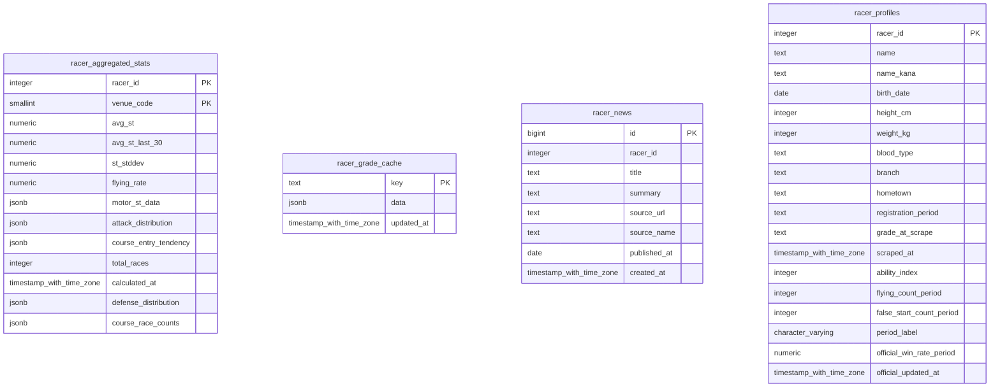
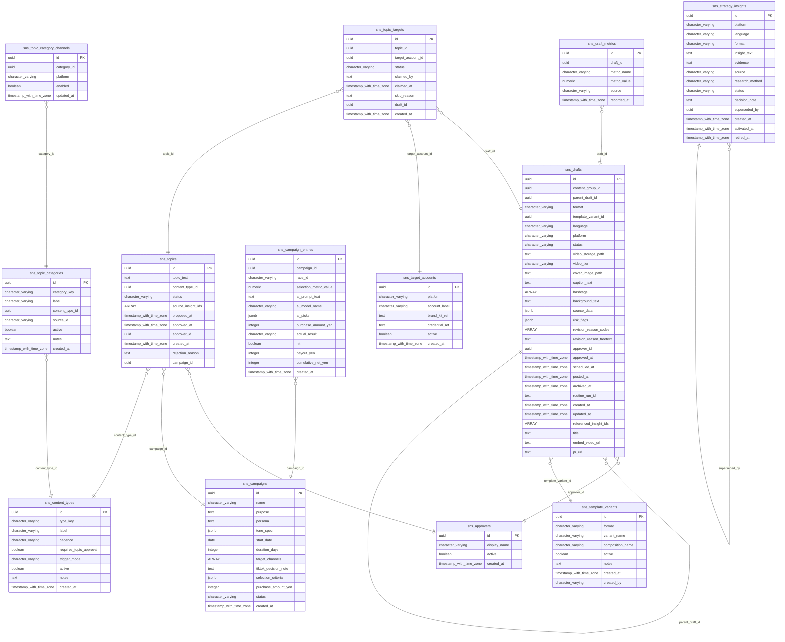

# データベース設計書

龍神レーダー Supabaseデータベースの設計仕様。

---

## 目次

1. [概要](#概要)
2. [テーブル一覧と使用状況](#テーブル一覧と使用状況)（機械生成）
3. [コアテーブル詳細](#コアテーブル詳細)（機械生成）
4. [テーブル関係図](#テーブル関係図)
5. [参考: RPC関数](#参考-rpc関数)

---

## 概要

### データベース情報

| 項目 | 値 |
|------|-----|
| プラットフォーム | Supabase (PostgreSQL) |
| スキーマファイル | `docs/db-migration/001_schema.sql` |
| RPC関数 | `docs/db-migration/007_RPC_FUNCTIONS.sql` |

### 設計の経緯

1. **初期設計** (`scripts/db/SCHEMA_DETAIL.md`): 8テーブル構成
2. **拡張設計** (`docs/db-migration/001_schema.sql`): 17テーブル + ビュー構成
3. **追加テーブル** (`docs/db-migration/008_venue_rules.sql`): ルール管理用2テーブル

**現在の運用**: その後の機能追加で表は大きく増えた。現況は下の「テーブル一覧と使用状況」（機械生成）を正とする。

**更新方法**: 「テーブル一覧と使用状況」「コアテーブル詳細」は `node --env-file=.env.local scripts/maintenance/generate-database-design-sections.js` で本番スキーマから作り直す（読み取りのみ）。マーカー `<!-- generated:... -->` の間は手で書き換えない。

---

## テーブル一覧と使用状況

<!-- generated:table-usage:start -->
本番スキーマ（PostgREST の OpenAPI）とコード（表名の出現）から機械生成（2026-10-02、`scripts/maintenance/generate-database-design-sections.js`）。
行数は pg の統計値による推定（概数）。「使用中」は推定行数>0 かつコード参照あり。参照数は表名を含む src/・api/・scripts/ のファイル数（コメントでの言及も数える。docs/db-migration の SQL・RPC は数えない）。「コード参照なし」は確実だが、参照ありは使用の証明ではない。

| テーブル | 種別 | 推定行数 | PK | src | api | scripts | 状態 |
|---|---|---:|---|---:|---:|---:|---|
| `accuracy_cache` | 表 | 3 | key | 2 | 1 | 5 | 使用中 |
| `analogy_contribution_profiles` | 表 | 12180 | model_version, finish_target, venue_code, grade, round, boat_number | 2 | 1 | 0 | 使用中 |
| `analogy_models` | 表 | 1 | model_version | 3 | 1 | 1 | 使用中 |
| `bet_filters` | 表 | 0 | filter_id | 0 | 0 | 2 | 空（参照あり） |
| `bet_recommendations` | 表 | 15424 | race_id, model_id | 4 | 0 | 10 | 使用中 |
| `daily_bet_summary` | 表 | 0 | date, model_id | 0 | 0 | 2 | 空（参照あり） |
| `exhibition_data` | 表 | 286454 | race_id, boat_number | 6 | 1 | 39 | 使用中 |
| `exhibition_time_top_stats` | 表 | 144 | id | 1 | 0 | 2 | 使用中 |
| `external_predictions` | 表 | 20511 | id | 0 | 1 | 10 | 使用中 |
| `kb_archive_boats` | 表 | 2233849 | race_id, boat_number | 0 | 0 | 5 | 使用中 |
| `kb_archive_races` | 表 | 372624 | race_id | 0 | 0 | 2 | 使用中 |
| `kb_archive_venue_days` | 表 | 31023 | venue_day_id | 0 | 0 | 3 | 使用中 |
| `losing_technique_stats` | 表 | 857 | id | 1 | 0 | 2 | 使用中 |
| `model_bet_candidates` | 表 | 0 | race_id, model_id, pattern_index, bet_rank | 0 | 0 | 2 | 空（参照あり） |
| `model_experiments` | 表 | 0 | experiment_id | 0 | 0 | 2 | 空（参照あり） |
| `model_performance_daily` | 表 | 68 | model_id, date | 1 | 0 | 3 | 使用中 |
| `models` | 表 | 5 | model_id | 9 | 1 | 20 | 使用中 |
| `morning_digest_days` | 表 | 11 | digest_date | 3 | 1 | 3 | 使用中 |
| `morning_digest_rows` | 表 | 501 | digest_date, section, rank | 5 | 1 | 4 | 使用中 |
| `motor_pretest_stats` | 表 | 35723 | race_date, venue_code, racer_id | 2 | 1 | 7 | 使用中 |
| `mycroft_predictions` | 表 | 7656 | race_id | 2 | 0 | 3 | 使用中 |
| `nige_outcome_distribution` | 表 | 536 | id | 1 | 0 | 2 | 使用中 |
| `nige_second_by_course` | 表 | 120 | venue_code, second_course | 2 | 0 | 2 | 使用中 |
| `outcome_distribution` | 表 | 2424 | id | 3 | 1 | 9 | 使用中 |
| `poirot_predictions` | 表 | 22771 | race_id, model_version | 1 | 0 | 4 | 使用中 |
| `prediction_odds` | 表 | 24627 | race_id | 0 | 2 | 21 | 使用中 |
| `predictions` | 表 | 139929 | prediction_id | 18 | 1 | 131 | 使用中 |
| `race_conditions` | 表 | 47361 | race_id | 11 | 2 | 72 | 使用中 |
| `race_entries` | 表 | 303068 | race_id, boat_number | 22 | 4 | 121 | 使用中 |
| `race_history_cache` | 表 | 1 | key | 1 | 1 | 2 | 使用中 |
| `race_notices_health` | 表 | 238 | venue_code, check_date | 0 | 0 | 7 | 使用中 |
| `race_odds` | 表 | 151638 | race_id, captured_at | 4 | 2 | 38 | 使用中 |
| `race_odds_final` | 表 | 483 | race_id | 3 | 1 | 2 | 使用中 |
| `race_original_exhibition` | 表 | 1253 | race_id | 1 | 1 | 5 | 使用中 |
| `race_original_exhibition_values` | 表 | 23162 | race_id, boat_number, kind | 1 | 1 | 6 | 使用中 |
| `race_outcome_frequencies` | 表 | 2689 | venue_code, rank1_boat, rank2_boat, rank3_boat, window_days | 0 | 0 | 1 | 使用中 |
| `race_payouts` | 表 | 33860 | race_id, bet_type, seq | 3 | 1 | 16 | 使用中 |
| `race_pit_comments` | 表 | 383 | race_id, boat_number | 1 | 1 | 3 | 使用中 |
| `race_pit_reports` | 表 | 72 | race_id | 1 | 1 | 9 | 使用中 |
| `race_results` | 表 | 46747 | race_id | 16 | 3 | 176 | 使用中 |
| `race_series` | 表 | 6312 | venue_code, start_date | 2 | 1 | 21 | 使用中 |
| `race_special_notes` | 表 | 12 | id | 1 | 0 | 12 | 使用中 |
| `race_start_timings` | 表 | 280754 | race_id, boat_number | 9 | 0 | 49 | 使用中 |
| `racer_aggregated_stats` | 表 | 1639 | racer_id, venue_code | 3 | 0 | 27 | 使用中 |
| `racer_course_technique_stats` | 表 | 9476 | racer_id, course | 0 | 1 | 4 | 使用中 |
| `racer_grade_cache` | 表 | 1 | key | 1 | 0 | 1 | 使用中 |
| `racer_news` | 表 | 6 | id | 1 | 1 | 9 | 使用中 |
| `racer_news_pending` | 表 | 0 | id | 0 | 1 | 6 | 空（参照あり） |
| `racer_period_stats` | 表 | 24165 | racer_id, period_year, period_no | 3 | 0 | 6 | 使用中 |
| `racer_profiles` | 表 | 1628 | racer_id | 5 | 2 | 31 | 使用中 |
| `racer_series_points` | 表 | 153 | id | 2 | 1 | 14 | 使用中 |
| `races` | 表 | 47568 | race_id | 63 | 8 | 225 | 使用中 |
| `rule_applications` | 表 | 0 | id | 1 | 0 | 3 | 空（参照あり） |
| `scrape_job_state` | 表 | 29 | job | 0 | 28 | 44 | 使用中 |
| `scrape_slots` | 表 | 23722 | job, race_id, offset_min | 0 | 9 | 36 | 使用中 |
| `sns_approvers` | 表 | 2 | id | 0 | 3 | 1 | 使用中 |
| `sns_campaign_entries` | 表 | 20 | id | 0 | 0 | 6 | 使用中 |
| `sns_campaigns` | 表 | 1 | id | 0 | 0 | 6 | 使用中 |
| `sns_content_types` | 表 | 3 | id | 1 | 2 | 3 | 使用中 |
| `sns_draft_metrics` | 表 | 0 | id | 0 | 1 | 0 | 空（参照あり） |
| `sns_drafts` | 表 | 299 | id | 1 | 6 | 10 | 使用中 |
| `sns_strategy_insights` | 表 | 3 | id | 0 | 4 | 4 | 使用中 |
| `sns_target_accounts` | 表 | 5 | id | 1 | 3 | 2 | 使用中 |
| `sns_template_variants` | 表 | 88 | id | 2 | 3 | 0 | 使用中 |
| `sns_topic_categories` | 表 | 13 | id | 1 | 2 | 2 | 使用中 |
| `sns_topic_category_channels` | 表 | 64 | id | 1 | 1 | 2 | 使用中 |
| `sns_topic_targets` | 表 | 469 | id | 2 | 6 | 5 | 使用中 |
| `sns_topics` | 表 | 94 | id | 1 | 5 | 12 | 使用中 |
| `st_course_baseline` | 表 | 24 | course, grade | 4 | 0 | 2 | 使用中 |
| `top_start_stats` | 表 | 144 | id | 1 | 0 | 2 | 使用中 |
| `user_visible_summary` | 表 | 0 | summary_id | 0 | 0 | 1 | 空（参照あり） |
| `v_performance_comparison` | ビュー等 | 0 | — | 0 | 0 | 1 | 空（参照あり） |
| `v_prediction_performance` | ビュー等 | 933 | — | 0 | 0 | 1 | 使用中 |
| `v_production_models` | 表 | 1 | model_id | 0 | 0 | 1 | 使用中 |
| `v_todays_recommendations` | 表 | 672 | race_id | 0 | 0 | 0 | コード参照なし |
| `venue_course_technique_baseline` | 表 | 612 | venue_code, race_grade, course | 2 | 1 | 4 | 使用中 |
| `venue_entry_course_stats` | 表 | 27655 | race_id, waku, entry_course | 0 | 1 | 11 | 使用中 |
| `venue_grade_boat_stats` | 表 | 518 | venue_code, race_grade, boat_number | 2 | 0 | 1 | 使用中 |
| `venue_motor_start_dates` | 表 | 24 | venue_code, start_date | 2 | 1 | 6 | 使用中 |
| `venue_motor_stats` | 表 | 26219 | venue_code, motor_number, scraped_date | 3 | 1 | 15 | 使用中 |
| `venue_rules` | 表 | 10 | id | 1 | 0 | 3 | 使用中 |
| `venues` | 表 | 24 | code | 69 | 1 | 74 | 使用中 |
| `watson_predictions` | 表 | 7968 | race_id | 2 | 0 | 3 | 使用中 |
| `winning_technique_stats` | 表 | 627 | id | 4 | 0 | 3 | 使用中 |
<!-- generated:table-usage:end -->

---

## コアテーブル詳細

<!-- generated:core-tables:start -->
主要なテーブルの列。型・NULL 可否・PK・FK・列コメント（`COMMENT ON COLUMN`）は本番スキーマから機械生成。
列の意味の詳細は、各列を足したマイグレーション（`docs/db-migration/`）と機能の設計（`docs/design/{slug}/plan.md`）を参照。

### races

推定行数: 47568

| 列 | 型 | NULL | キー | コメント |
|---|---|---|---|---|
| `race_id` | character varying | 不可 | PK |  |
| `race_date` | date | 不可 |  |  |
| `venue_code` | smallint | 不可 | FK→venues.code |  |
| `race_number` | smallint | 不可 |  |  |
| `start_time` | time without time zone | 可 |  |  |
| `volatility_score` | smallint | 可 |  |  |
| `volatility_level` | character varying | 可 |  |  |
| `recommended_model` | character varying | 可 |  |  |
| `volatility_reasons` | jsonb | 可 |  |  |
| `first_boat_grade` | character varying | 可 |  |  |
| `first_boat_win_rate` | numeric | 可 |  |  |
| `first_boat_motor_2rate` | numeric | 可 |  |  |
| `win_rate_stddev` | numeric | 可 |  |  |
| `win_rate_avg` | numeric | 可 |  |  |
| `motor_2rate_stddev` | numeric | 可 |  |  |
| `created_at` | timestamp with time zone | 可 |  |  |
| `updated_at` | timestamp with time zone | 可 |  |  |
| `first_boat_avg_st` | numeric | 可 |  |  |
| `race_grade` | character varying | 可 |  |  |
| `cancellation_status` | text | 可 |  |  |
| `cancellation_check_streak` | smallint | 不可 |  |  |

### race_entries

推定行数: 303068

| 列 | 型 | NULL | キー | コメント |
|---|---|---|---|---|
| `race_id` | character varying | 不可 | PK FK→races.race_id | This is a Foreign Key to `races.race_id`.<fk table='races' column='race_id'/> |
| `boat_number` | smallint | 不可 | PK |  |
| `player_name` | character varying | 可 |  |  |
| `grade` | character varying | 可 |  |  |
| `age` | smallint | 可 |  |  |
| `win_rate` | numeric | 可 |  |  |
| `local_win_rate` | numeric | 可 |  |  |
| `motor_number` | smallint | 可 |  |  |
| `motor_2rate` | numeric | 可 |  |  |
| `boat_number_id` | smallint | 可 |  |  |
| `boat_2rate` | numeric | 可 |  |  |
| `ai_score_standard` | integer | 可 |  |  |
| `ai_score_safe_bet` | integer | 可 |  |  |
| `ai_score_upset_focus` | integer | 可 |  |  |
| `global_2rate` | numeric | 可 |  |  |
| `local_2rate` | numeric | 可 |  |  |
| `global_3rate` | numeric | 可 |  |  |
| `local_3rate` | numeric | 可 |  |  |
| `motor_3rate` | numeric | 可 |  |  |
| `boat_3rate` | numeric | 可 |  |  |
| `racer_id` | integer | 可 |  |  |
| `created_at` | timestamp with time zone | 可 |  | 行が最初に保存された時刻（INSERT時のDEFAULT now()）。NULLはこの列の追加前に保存された行（不明）。「発走の何分前に取得できたか」の計測に使う |
| `updated_at` | timestamp with time zone | 可 |  | 行の値が変わった時刻（新規の行は保存時刻）。書き込み側のコードが、変更のある行を書くときだけ設定する（トリガーは使わない）。NULLはこの列の追加前に保存され、以降に一度も変更されていない行 |
| `weight_kg` | numeric | 可 |  | 出走表の選手の当日体重（kg）。登録体重ではない（直前情報の exhibition_data.today_weight と同じ値・同じ時刻に公開される。2026-09-20〜28の実測で99.3%が完全一致）。081以前の行はNULL |
| `branch` | text | 可 |  | 出走表の支部（例: 福岡）。081以前の行はNULL |
| `hometown` | text | 可 |  | 出走表の出身地（例: 北海道）。081以前の行はNULL |
| `f_count` | smallint | 可 |  | 出走表のF数（今期のフライング回数）。取得時点の値。読めなければNULL |
| `l_count` | smallint | 可 |  | 出走表のL数（今期の出遅れ回数）。取得時点の値。読めなければNULL |
| `is_absent` | boolean | 可 |  | 出走表で欠場の表示（tbody の is-miss）があるか。NULL=未判定（081以前の行）、false=表示なし、true=欠場の表示あり |

### race_results

推定行数: 46747

| 列 | 型 | NULL | キー | コメント |
|---|---|---|---|---|
| `race_id` | character varying | 不可 | PK FK→races.race_id | This is a Foreign Key to `races.race_id`.<fk table='races' column='race_id'/> |
| `rank1` | smallint | 不可 |  |  |
| `rank2` | smallint | 不可 |  |  |
| `rank3` | smallint | 不可 |  |  |
| `payout_win` | integer | 可 |  |  |
| `payout_place_1` | integer | 可 |  |  |
| `payout_place_2` | integer | 可 |  |  |
| `payout_trifecta` | integer | 可 |  |  |
| `payout_trio` | integer | 可 |  |  |
| `is_cancelled` | boolean | 可 |  |  |
| `is_no_race` | boolean | 可 |  |  |
| `course_1` | smallint | 可 |  |  |
| `course_2` | smallint | 可 |  |  |
| `course_3` | smallint | 可 |  |  |
| `course_4` | smallint | 可 |  |  |
| `course_5` | smallint | 可 |  |  |
| `course_6` | smallint | 可 |  |  |
| `winning_technique` | character varying | 可 |  |  |
| `result_at` | timestamp with time zone | 可 |  |  |
| `created_at` | timestamp with time zone | 可 |  |  |
| `rank4` | smallint | 可 |  |  |
| `rank5` | smallint | 可 |  |  |
| `rank6` | smallint | 可 |  |  |
| `race_time_1` | character varying | 可 |  |  |
| `race_time_2` | character varying | 可 |  |  |
| `race_time_3` | character varying | 可 |  |  |
| `race_time_4` | character varying | 可 |  |  |
| `race_time_5` | character varying | 可 |  |  |
| `race_time_6` | character varying | 可 |  |  |
| `payout_exacta` | integer | 可 |  |  |
| `payout_quinella` | integer | 可 |  |  |
| `payout_wide_1` | integer | 可 |  |  |
| `payout_wide_2` | integer | 可 |  |  |
| `payout_wide_3` | integer | 可 |  |  |
| `popularity_trifecta` | smallint | 可 |  |  |
| `popularity_trio` | smallint | 可 |  |  |
| `popularity_exacta` | smallint | 可 |  |  |
| `popularity_quinella` | smallint | 可 |  |  |
| `popularity_wide_1` | smallint | 可 |  |  |
| `popularity_wide_2` | smallint | 可 |  |  |
| `popularity_wide_3` | smallint | 可 |  |  |
| `actual_course_1` | smallint | 可 |  |  |
| `actual_course_2` | smallint | 可 |  |  |
| `actual_course_3` | smallint | 可 |  |  |
| `actual_course_4` | smallint | 可 |  |  |
| `actual_course_5` | smallint | 可 |  |  |
| `actual_course_6` | smallint | 可 |  |  |
| `race_status` | text | 可 |  | レースの状態。normal=通常、partial_refund=返還艇あり・一部の勝式が不成立、no_race=全勝式が不成立。NULL=未判定（078以前の行）。読み手は IS DISTINCT FROM 'no_race' で判定する |
| `refund_boats` | smallint[] | 可 |  | 返還艇の枠番（昇順）。返還なしは空配列、NULL=未判定。返還されるのはF・L・欠の艇 |
| `remark` | text | 可 |  | 結果ページの備考（【返還艇あり】【同着あり】等）。空ならNULL |

### race_start_timings

推定行数: 280754

| 列 | 型 | NULL | キー | コメント |
|---|---|---|---|---|
| `race_id` | character varying | 不可 | PK FK→races.race_id | This is a Foreign Key to `races.race_id`.<fk table='races' column='race_id'/> |
| `boat_number` | smallint | 不可 | PK |  |
| `start_timing` | numeric | 可 |  |  |
| `is_flying` | boolean | 可 |  |  |
| `is_late_start` | boolean | 可 |  |  |
| `created_at` | timestamp with time zone | 可 |  | 行が最初に保存された時刻（INSERT時のDEFAULT now()）。NULLはこの列の追加前に保存された行（不明）。「発走の何分前に取得できたか」の計測に使う |
| `updated_at` | timestamp with time zone | 可 |  | 行の値が変わった時刻（新規の行は保存時刻）。書き込み側のコードが、変更のある行を書くときだけ設定する（トリガーは使わない）。NULLはこの列の追加前に保存され、以降に一度も変更されていない行 |
| `finish_mark` | text | 可 |  | 着欄の生表記（NFKC正規化後）。1〜6=完走、F=フライング、L=出遅れ、欠=欠場、落=落水、転=転覆、沈=沈没、妨=妨害失格、エ=エンスト、_=順位なし。全種類は scripts/lib/raceResultParser.js の FINISH_MARKS。077以前の行はNULL |
| `finish_rank` | smallint | 可 |  | 完走した艇の着（1〜6。同着は同じ値が複数艇）。非完走はNULL。race_results.rank1〜6（艇番を着順の位置に並べる旧形式）の正確な代わり |
| `entry_course` | smallint | 可 |  | 進入コース（結果ページのスタート情報の行順。1〜6）。欠場艇はNULL。race_results.course_1〜6（枠番と恒等で無効）の正確な代わり |
| `race_seconds` | numeric | 可 |  | レースタイムの秒（1'50"7 → 110.7）。完走できなかった艇・5〜6着で空欄のことがある |
| `official_finish_code` | text | 可 |  | 公式の成績ファイル（Kファイル）の着順欄の表記のまま（01〜06・F・L0・L1・K0・K1・S0・S1・S2 等）。K0/S0 は選手責任外。NULL＝未取得（BOA-553） |

### race_conditions

推定行数: 47361

| 列 | 型 | NULL | キー | コメント |
|---|---|---|---|---|
| `race_id` | character varying | 不可 | PK FK→races.race_id | This is a Foreign Key to `races.race_id`.<fk table='races' column='race_id'/> |
| `weather` | character varying | 可 |  |  |
| `wind_direction` | character varying | 可 |  |  |
| `wind_speed` | numeric | 可 |  |  |
| `wave_height` | smallint | 可 |  |  |
| `temperature` | numeric | 可 |  |  |
| `water_temperature` | numeric | 可 |  |  |
| `race_title` | character varying | 可 |  |  |
| `series_day` | smallint | 可 |  |  |
| `is_final_day` | boolean | 可 |  |  |
| `created_at` | timestamp with time zone | 可 |  |  |
| `race_stage` | character varying | 可 |  | 公式サイトracelistページの.title16_titleDetail__add2020から抽出したレースステージ名（例: 予選/準優勝戦/優勝戦/カタメン１予選）。正規化されていない生の文字列 |
| `weather_observed_at` | timestamp with time zone | 可 |  | 気象（weather・wind_direction・wind_speed・wave_height・temperature・water_temperature）の観測時刻。公式beforeinfoの「水面気象情報 HH:MM現在」から組み立てる。raceresult由来の値は発走予定時刻。NULLは観測時刻不明 |
| `race_distance_m` | smallint | 可 |  | レースの距離（m。見出しの「1800m」）。1200mのレースがある |
| `race_labels` | text[] | 可 |  | レースのラベル（表記そのまま。例: {安定板使用}）。NULL=未取得、{}=ラベルなしを確認。未観測のラベルも書けるよう、CHECKは付けない |

### exhibition_data

推定行数: 286454

| 列 | 型 | NULL | キー | コメント |
|---|---|---|---|---|
| `race_id` | character varying | 不可 | PK FK→races.race_id | This is a Foreign Key to `races.race_id`.<fk table='races' column='race_id'/> |
| `boat_number` | smallint | 不可 | PK |  |
| `exhibition_time` | numeric | 可 |  |  |
| `start_timing` | numeric | 可 |  |  |
| `tilt` | numeric | 可 |  |  |
| `propeller_change` | text | 可 |  |  |
| `parts_changed` | text[] | 可 |  |  |
| `adjustment_weight` | numeric | 可 |  |  |
| `today_weight` | numeric | 可 |  |  |
| `prev_race_no` | integer | 可 |  |  |
| `prev_entry_course` | integer | 可 |  |  |
| `prev_start_timing` | numeric | 可 |  |  |
| `prev_finish_rank` | integer | 可 |  |  |
| `created_at` | timestamp with time zone | 可 |  | 行が最初に保存された時刻（INSERT時のDEFAULT now()）。NULLはこの列の追加前に保存された行（不明）。「発走の何分前に取得できたか」の計測に使う |
| `updated_at` | timestamp with time zone | 可 |  | 行の値が変わった時刻（新規の行は保存時刻）。書き込み側のコードが、変更のある行を書くときだけ設定する（トリガーは使わない）。NULLはこの列の追加前に保存され、以降に一度も変更されていない行 |
| `exhibition_course` | smallint | 可 |  | スタート展示の進入コース（行順=コース順。1〜6）。展示航走前・欠場艇はNULL。082以前の行もNULL |
| `start_flag` | text | 可 |  | 展示STの表記の頭（F=フライング、L=出遅れ）。それ以外はNULL。start_timing の値は、F表記でも正の数（F.01→0.01） |
| `prev_finish_mark` | text | 可 |  | 前走の着順の生表記（NFKC正規化後。1〜6・F・欠・落・転 等）。前走が無ければNULL。prev_finish_rank は数字のときだけ入る |
| `is_absent` | boolean | 可 |  | 直前情報で欠場の表示（tbody の is-miss）があるか。NULL=未判定（082以前の行）、false=表示なし、true=欠場の表示あり |

### predictions

推定行数: 139929

| 列 | 型 | NULL | キー | コメント |
|---|---|---|---|---|
| `prediction_id` | integer | 不可 | PK |  |
| `race_id` | character varying | 不可 | FK→races.race_id |  |
| `model_id` | character varying | 不可 | FK→models.model_id |  |
| `top_pick` | smallint | 不可 |  |  |
| `top_2nd` | smallint | 可 |  |  |
| `top_3rd` | smallint | 可 |  |  |
| `confidence` | numeric | 可 |  |  |
| `scores` | jsonb | 可 |  |  |
| `feature_contributions` | jsonb | 可 |  |  |
| `is_hit_win` | boolean | 可 |  |  |
| `is_hit_place` | boolean | 可 |  |  |
| `is_hit_trifecta` | boolean | 可 |  |  |
| `is_hit_trio` | boolean | 可 |  |  |
| `payout_win` | integer | 可 |  |  |
| `payout_place` | integer | 可 |  |  |
| `payout_trifecta` | integer | 可 |  |  |
| `payout_trio` | integer | 可 |  |  |
| `is_shadow` | boolean | 可 |  |  |
| `predicted_at` | timestamp with time zone | 可 |  |  |
| `is_hit_turn` | boolean | 可 |  | unifiedモデルの展開予測的中判定。feature_contributions.turnPrediction.patternsのいずれかのwinnerCourseが実際の1着コース（race_results.rank1）と一致すればtrue。結果反映バッチ（scrape-results.js）で計算・保存。旧3モデル（model_id != unified）の行はNULLのまま。 |

### models

推定行数: 5

| 列 | 型 | NULL | キー | コメント |
|---|---|---|---|---|
| `model_id` | character varying | 不可 | PK |  |
| `display_name` | character varying | 可 |  |  |
| `description` | text | 可 |  |  |
| `model_type` | character varying | 可 |  |  |
| `version` | character varying | 可 |  |  |
| `parent_model_id` | character varying | 可 | FK→models.model_id |  |
| `target_venues` | smallint[] | 可 |  |  |
| `target_volatility_min` | smallint | 可 |  |  |
| `target_volatility_max` | smallint | 可 |  |  |
| `trained_at` | timestamp with time zone | 可 |  |  |
| `training_data_from` | date | 可 |  |  |
| `training_data_to` | date | 可 |  |  |
| `training_race_count` | integer | 可 |  |  |
| `hyperparameters` | jsonb | 可 |  |  |
| `feature_list` | jsonb | 可 |  |  |
| `status` | character varying | 可 |  |  |
| `is_public` | boolean | 可 |  |  |
| `total_predictions` | integer | 可 |  |  |
| `hit_rate_win` | numeric | 可 |  |  |
| `recovery_rate_win` | numeric | 可 |  |  |
| `last_evaluated_at` | timestamp with time zone | 可 |  |  |
| `created_at` | timestamp with time zone | 可 |  |  |
| `updated_at` | timestamp with time zone | 可 |  |  |
| `hit_rate_place` | double precision | 可 |  |  |
| `hit_rate_trifecta` | double precision | 可 |  |  |
| `hit_rate_trio` | double precision | 可 |  |  |
| `recovery_rate_place` | double precision | 可 |  |  |
| `recovery_rate_trifecta` | double precision | 可 |  |  |
| `recovery_rate_trio` | double precision | 可 |  |  |

### racer_aggregated_stats

推定行数: 1639

| 列 | 型 | NULL | キー | コメント |
|---|---|---|---|---|
| `racer_id` | integer | 不可 | PK |  |
| `venue_code` | smallint | 不可 | PK |  |
| `avg_st` | numeric | 可 |  |  |
| `avg_st_last_30` | numeric | 可 |  |  |
| `st_stddev` | numeric | 可 |  |  |
| `flying_rate` | numeric | 可 |  |  |
| `motor_st_data` | jsonb | 可 |  |  |
| `attack_distribution` | jsonb | 可 |  |  |
| `course_entry_tendency` | jsonb | 可 |  |  |
| `total_races` | integer | 可 |  |  |
| `calculated_at` | timestamp with time zone | 可 |  |  |
| `defense_distribution` | jsonb | 可 |  |  |
| `course_race_counts` | jsonb | 可 |  |  |

### venues

推定行数: 24

| 列 | 型 | NULL | キー | コメント |
|---|---|---|---|---|
| `code` | smallint | 不可 | PK |  |
| `name` | character varying | 不可 |  |  |
| `water_type` | character varying | 可 |  |  |
| `cluster` | character varying | 可 |  |  |
| `avg_first_win_rate` | numeric | 可 |  |  |
| `updated_at` | timestamp with time zone | 可 |  |  |
| `course_entry_baseline` | jsonb | 可 |  | 会場×枠番→実進入コースの回数（選手非依存、直近12ヶ月）。夜間バッチ(update-venue-course-entry-baseline.js)が更新する。 |
| `course_entry_baseline_updated_at` | timestamp with time zone | 可 |  |  |
<!-- generated:core-tables:end -->

---

## テーブル関係図

**2026-09-15更新**: 以下は`mcp__supabase__list_tables`で取得した本番スキーマの実データから機械生成した、現在稼働中の全54テーブルの俯瞰図。旧ASCII図（実使用9テーブルのみを手動で描いたもの）はSNSマーケティングハブ（13テーブル）・選手データ（4テーブル）等を欠いており、情報の陳腐化を機械的に防げない手動更新の限界そのものだったため置き換えた。表の一覧・列の現況は、上の「テーブル一覧と使用状況」「コアテーブル詳細」（BOA-330 以降は機械生成）を正とする。この関係図は2026-09-15時点のスナップショット。

`docs/db-migration/`のDDL履歴を積み上げて再構成する方式は、DROP TABLE・RENAME等を正しく追えず「今も実在するとは限らないテーブル」が混ざるリスクがあるため、稼働中のスキーマを直接取得する方式を採用した（個別機能のER図（`docs/design/{slug}/plan.md`）がDDLからの機械生成なのと対照的に、こちらは生きたスキーマからの機械生成）。

**54テーブル**（`public`スキーマ）を4つのドメインに分類する。個別機能の新規テーブル・新規リレーションは各`docs/design/{slug}/plan.md`のER図（`node scripts/maintenance/generate-er-diagram.js {slug}`で生成）を参照。こちらは全体の俯瞰用。

**鮮度について**: この文書はスキーマのスナップショットであり、自動更新されない。再生成する場合は`mcp__supabase__list_tables`を実行し、このスクリプトと同じロジックで再構成すること（スクリプト自体はリポジトリに常設していない、一度きりの生成物）。

### ドメイン一覧

| ドメイン | テーブル数 |
|---|---|
| レース基礎データ・会場 | 21 |
| 選手データ | 4 |
| 予測・モデル・回収率 | 16 |
| SNSマーケティングハブ | 13 |

### レース基礎データ・会場

| テーブル | 行数 | PK |
|---|---|---|
| `exhibition_data` | 163261 | race_id, boat_number |
| `exhibition_time_top_stats` | 144 | id |
| `losing_technique_stats` | 854 | id |
| `nige_outcome_distribution` | 535 | id |
| `outcome_distribution` | 2384 | id |
| `race_conditions` | 33411 | race_id |
| `race_entries` | 263016 | race_id, boat_number |
| `race_history_cache` | 1 | key |
| `race_notices_health` | 13 | venue_code, check_date |
| `race_odds` | 131302 | race_id, captured_at |
| `race_results` | 42450 | race_id |
| `race_special_notes` | 0 | id |
| `race_start_timings` | 236914 | race_id, boat_number |
| `races` | 43837 | race_id |
| `rule_applications` | 0 | id |
| `top_start_stats` | 144 | id |
| `venue_grade_boat_stats` | 518 | venue_code, race_grade, boat_number |
| `venue_motor_stats` | 3792 | venue_code, motor_number, scraped_date |
| `venue_rules` | 10 | id |
| `venues` | 24 | code |
| `winning_technique_stats` | 611 | id |

**他ドメインとの関係**:
- `bet_recommendations.race_id` → `races.race_id`
- `sns_campaign_entries.race_id` → `races.race_id`
- `model_bet_candidates.race_id` → `races.race_id`
- `prediction_odds.race_id` → `races.race_id`
- `predictions.race_id` → `races.race_id`

```mermaid
erDiagram
    exhibition_data }o--|| races : "race_id"
    race_conditions }o--|| races : "race_id"
    race_entries }o--|| races : "race_id"
    race_odds }o--|| races : "race_id"
    race_results }o--|| races : "race_id"
    race_start_timings }o--|| races : "race_id"
    races }o--|| venues : "venue_code"
    rule_applications }o--|| venue_rules : "rule_id"
    exhibition_data {
        character_varying race_id PK
        smallint boat_number PK
        numeric exhibition_time
        numeric start_timing
        numeric tilt
        text propeller_change
        ARRAY parts_changed
        numeric adjustment_weight
        numeric today_weight
        integer prev_race_no
        integer prev_entry_course
        numeric prev_start_timing
        integer prev_finish_rank
    }
    exhibition_time_top_stats {
        bigint id PK
        smallint venue_code
        smallint boat_number
        integer race_count
        integer fastest_count
        numeric fastest_rate
        integer win_count_when_fastest
        numeric win_rate_when_fastest
        date last_updated
        timestamp_with_time_zone created_at
    }
    losing_technique_stats {
        bigint id PK
        smallint venue_code
        smallint boat_number
        text losing_technique
        integer count_90days
        integer total_losses_90days
        numeric percentage
        date last_updated
        timestamp_with_time_zone created_at
    }
    nige_outcome_distribution {
        bigint id PK
        smallint venue_code
        smallint first_boat
        smallint second_boat
        smallint third_boat
        integer count_90days
        integer total_races
        numeric probability
        integer avg_payout
        date last_updated
        timestamp_with_time_zone created_at
    }
    outcome_distribution {
        bigint id PK
        smallint venue_code
        smallint first_boat
        smallint second_boat
        smallint third_boat
        integer count_90days
        integer total_races
        numeric probability
        integer avg_payout
        date last_updated
        timestamp_with_time_zone created_at
    }
    race_conditions {
        character_varying race_id PK
        character_varying weather
        character_varying wind_direction
        numeric wind_speed
        smallint wave_height
        numeric temperature
        numeric water_temperature
        character_varying race_title
        smallint series_day
        boolean is_final_day
        timestamp_with_time_zone created_at
        character_varying race_stage
    }
    race_entries {
        character_varying race_id PK
        smallint boat_number PK
        character_varying player_name
        character_varying grade
        smallint age
        numeric win_rate
        numeric local_win_rate
        smallint motor_number
        numeric motor_2rate
        smallint boat_number_id
        numeric boat_2rate
        integer ai_score_standard
        integer ai_score_safe_bet
        integer ai_score_upset_focus
        numeric global_2rate
        numeric local_2rate
        numeric global_3rate
        numeric local_3rate
        numeric motor_3rate
        numeric boat_3rate
        integer racer_id
    }
    race_history_cache {
        text key PK
        jsonb data
        timestamp_with_time_zone updated_at
    }
    race_notices_health {
        smallint venue_code PK
        date check_date PK
        boolean had_success
        text last_reason
        timestamp_with_time_zone last_checked_at
    }
    race_odds {
        character_varying race_id PK
        timestamp_with_time_zone captured_at PK
        numeric odds_win_1
        numeric odds_win_2
        numeric odds_win_3
        numeric odds_win_4
        numeric odds_win_5
        numeric odds_win_6
        character_varying trifecta_popular_1
        numeric trifecta_odds_1
        character_varying trifecta_popular_2
        numeric trifecta_odds_2
        character_varying trifecta_popular_3
        numeric trifecta_odds_3
        jsonb trifecta_all
        numeric odds_place_1_low
        numeric odds_place_1_high
        numeric odds_place_2_low
        numeric odds_place_2_high
        numeric odds_place_3_low
        numeric odds_place_3_high
        numeric odds_place_4_low
        numeric odds_place_4_high
        numeric odds_place_5_low
        numeric odds_place_5_high
        numeric odds_place_6_low
        numeric odds_place_6_high
    }
    race_results {
        character_varying race_id PK
        smallint rank1
        smallint rank2
        smallint rank3
        integer payout_win
        integer payout_place_1
        integer payout_place_2
        integer payout_trifecta
        integer payout_trio
        boolean is_cancelled
        boolean is_no_race
        smallint course_1
        smallint course_2
        smallint course_3
        smallint course_4
        smallint course_5
        smallint course_6
        character_varying winning_technique
        timestamp_with_time_zone result_at
        timestamp_with_time_zone created_at
        smallint rank4
        smallint rank5
        smallint rank6
        character_varying race_time_1
        character_varying race_time_2
        character_varying race_time_3
        character_varying race_time_4
        character_varying race_time_5
        character_varying race_time_6
        integer payout_exacta
        integer payout_quinella
        integer payout_wide_1
        integer payout_wide_2
        integer payout_wide_3
        smallint popularity_trifecta
        smallint popularity_trio
        smallint popularity_exacta
        smallint popularity_quinella
        smallint popularity_wide_1
        smallint popularity_wide_2
        smallint popularity_wide_3
    }
    race_special_notes {
        bigint id PK
        smallint venue_code
        date race_date
        character_varying category
        integer racer_id
        smallint boat_number
        text detail_text
        jsonb structured_data
        timestamp_with_time_zone scraped_at
    }
    race_start_timings {
        character_varying race_id PK
        smallint boat_number PK
        numeric start_timing
        boolean is_flying
        boolean is_late_start
    }
    races {
        character_varying race_id PK
        date race_date
        smallint venue_code
        smallint race_number
        time_without_time_zone start_time
        smallint volatility_score
        character_varying volatility_level
        character_varying recommended_model
        jsonb volatility_reasons
        character_varying first_boat_grade
        numeric first_boat_win_rate
        numeric first_boat_motor_2rate
        numeric win_rate_stddev
        numeric win_rate_avg
        numeric motor_2rate_stddev
        timestamp_with_time_zone created_at
        timestamp_with_time_zone updated_at
        numeric first_boat_avg_st
        character_varying race_grade
        text cancellation_status
        smallint cancellation_check_streak
    }
    rule_applications {
        integer id PK
        text rule_id
        text race_id
        integer bet_amount
        boolean is_hit
        integer payout
        timestamp_with_time_zone created_at
        timestamp_with_time_zone updated_at
    }
    top_start_stats {
        bigint id PK
        smallint venue_code
        smallint boat_number
        integer race_count
        integer top_start_count
        numeric top_start_rate
        integer win_count_when_top_start
        numeric win_rate_when_top_start
        date last_updated
        timestamp_with_time_zone created_at
    }
    venue_grade_boat_stats {
        smallint venue_code PK
        text race_grade PK
        smallint boat_number PK
        integer race_count
        integer wins
        integer top2
        integer top3
        jsonb technique_breakdown
        integer payout_count
        integer manshu_count
        bigint payout_trio_sum
        timestamp_with_time_zone updated_at
    }
    venue_motor_stats {
        smallint venue_code PK
        smallint motor_number PK
        date scraped_date PK
        smallint meet_count
        smallint race_count
        smallint final_count
        smallint championship_count
        smallint first_place_count
        smallint second_place_count
        smallint third_place_count
        numeric win_rate
        numeric top2_rate
        numeric top3_rate
        numeric accident_rate
        numeric best_time
        numeric avg_exhibition_time
        date stats_period_start
        date stats_period_end
        text source_template
    }
    venue_rules {
        integer id PK
        text rule_id
        text venue_code
        text bet_type
        jsonb conditions
        text description
        numeric expected_recovery
        text reliability
        integer sample_size
        boolean is_active
        timestamp_with_time_zone created_at
        timestamp_with_time_zone updated_at
    }
    venues {
        smallint code PK
        character_varying name
        character_varying water_type
        character_varying cluster
        numeric avg_first_win_rate
        timestamp_with_time_zone updated_at
    }
    winning_technique_stats {
        bigint id PK
        smallint venue_code
        smallint boat_number
        text winning_technique
        integer count_90days
        integer total_races
        numeric percentage
        date last_updated
        timestamp_with_time_zone created_at
    }
```

### 選手データ

| テーブル | 行数 | PK |
|---|---|---|
| `racer_aggregated_stats` | 1638 | racer_id, venue_code |
| `racer_grade_cache` | 1 | key |
| `racer_news` | 5 | id |
| `racer_profiles` | 1627 | racer_id |

```mermaid
erDiagram
    racer_aggregated_stats {
        integer racer_id PK
        smallint venue_code PK
        numeric avg_st
        numeric avg_st_last_30
        numeric st_stddev
        numeric flying_rate
        jsonb motor_st_data
        jsonb attack_distribution
        jsonb course_entry_tendency
        integer total_races
        timestamp_with_time_zone calculated_at
        jsonb defense_distribution
        jsonb course_race_counts
    }
    racer_grade_cache {
        text key PK
        jsonb data
        timestamp_with_time_zone updated_at
    }
    racer_news {
        bigint id PK
        integer racer_id
        text title
        text summary
        text source_url
        text source_name
        date published_at
        timestamp_with_time_zone created_at
    }
    racer_profiles {
        integer racer_id PK
        text name
        text name_kana
        date birth_date
        integer height_cm
        integer weight_kg
        text blood_type
        text branch
        text hometown
        text registration_period
        text grade_at_scrape
        timestamp_with_time_zone scraped_at
        integer ability_index
        integer flying_count_period
        integer false_start_count_period
        character_varying period_label
        numeric official_win_rate_period
        timestamp_with_time_zone official_updated_at
    }
```

### 予測・モデル・回収率

| テーブル | 行数 | PK |
|---|---|---|
| `accuracy_cache` | 3 | key |
| `bet_filters` | 0 | filter_id |
| `bet_recommendations` | 13204 | race_id, model_id |
| `daily_bet_summary` | 0 | date, model_id |
| `external_predictions` | 16627 | id |
| `model_bet_candidates` | 0 | race_id, model_id, pattern_index, bet_rank |
| `model_experiments` | 0 | experiment_id |
| `model_performance_daily` | 51 | model_id, date |
| `models` | 5 | model_id |
| `mycroft_predictions` | 5436 | race_id |
| `poirot_predictions` | 19680 | race_id, model_version |
| `prediction_odds` | 21996 | race_id |
| `predictions` | 132156 | prediction_id |
| `race_outcome_frequencies` | 2689 | venue_code, rank1_boat, rank2_boat, rank3_boat, window_days |
| `user_visible_summary` | 0 | summary_id |
| `watson_predictions` | 5436 | race_id |

**他ドメインとの関係**:
- `predictions.race_id` → `races.race_id`
- `prediction_odds.race_id` → `races.race_id`
- `bet_recommendations.race_id` → `races.race_id`
- `model_bet_candidates.race_id` → `races.race_id`

```mermaid
erDiagram
    bet_filters }o--|| models : "model_id"
    bet_recommendations }o--|| bet_filters : "filter_id"
    bet_recommendations }o--|| models : "model_id"
    daily_bet_summary }o--|| models : "model_id"
    model_bet_candidates }o--|| models : "model_id"
    model_experiments }o--|| models : "treatment_model_id"
    model_experiments }o--|| models : "control_model_id"
    model_performance_daily }o--|| models : "model_id"
    user_visible_summary }o--|| models : "model_id"
    models }o--|| models : "parent_model_id"
    predictions }o--|| models : "model_id"
    accuracy_cache {
        text key PK
        jsonb data
        timestamp_with_time_zone updated_at
    }
    bet_filters {
        integer filter_id PK
        character_varying name
        character_varying model_id
        jsonb conditions
        integer total_races
        integer hit_count
        integer total_payout
        numeric recovery_rate
        date valid_from
        date valid_to
        boolean is_active
        timestamp_with_time_zone created_at
        timestamp_with_time_zone updated_at
    }
    bet_recommendations {
        character_varying race_id PK
        character_varying model_id PK
        character_varying recommendation
        jsonb reasons
        integer filter_id
        numeric expected_value
        numeric expected_hit_rate
        integer expected_payout
        boolean actual_hit
        integer actual_payout
        numeric recommendation_score
        timestamp_with_time_zone created_at
        numeric bet_fraction
    }
    daily_bet_summary {
        date date PK
        character_varying model_id PK
        integer all_races
        integer all_hits
        integer all_payout
        numeric all_recovery_rate
        integer recommended_races
        integer recommended_hits
        integer recommended_payout
        numeric recommended_recovery_rate
        integer skipped_races
        integer skipped_hits
        integer skipped_payout
        numeric skipped_recovery_rate
        numeric recovery_improvement
        integer profit_if_all
        integer profit_if_recommended
    }
    external_predictions {
        bigint id PK
        character_varying source
        date race_date
        smallint venue_code
        smallint race_no
        jsonb payload
        timestamp_with_time_zone scraped_at
        timestamp_with_time_zone race_start_at
        timestamp_with_time_zone created_at
        timestamp_with_time_zone updated_at
    }
    model_bet_candidates {
        character_varying race_id PK
        character_varying model_id PK
        smallint pattern_index PK
        character_varying pattern_technique
        numeric pattern_probability
        smallint bet_rank PK
        character_varying bet_combo
        numeric predicted_probability
        numeric odds
        numeric expected_value
        text reasoning_story
        jsonb similar_condition_stats
        timestamp_with_time_zone created_at
    }
    model_experiments {
        integer experiment_id PK
        character_varying name
        text description
        character_varying control_model_id
        character_varying treatment_model_id
        date start_date
        date end_date
        integer control_predictions
        numeric control_hit_rate
        numeric control_recovery_rate
        integer treatment_predictions
        numeric treatment_hit_rate
        numeric treatment_recovery_rate
        numeric p_value
        boolean is_significant
        character_varying conclusion
        text notes
        character_varying status
        timestamp_with_time_zone created_at
    }
    model_performance_daily {
        character_varying model_id PK
        date date PK
        integer total_predictions
        integer win_hits
        integer place_hits
        integer trifecta_hits
        integer investment
        integer payout_win
        integer payout_trifecta
        numeric recovery_rate_win
        numeric recovery_rate_trifecta
        jsonb by_venue
        jsonb by_volatility
    }
    models {
        character_varying model_id PK
        character_varying display_name
        text description
        character_varying model_type
        character_varying version
        character_varying parent_model_id
        ARRAY target_venues
        smallint target_volatility_min
        smallint target_volatility_max
        timestamp_with_time_zone trained_at
        date training_data_from
        date training_data_to
        integer training_race_count
        jsonb hyperparameters
        jsonb feature_list
        character_varying status
        boolean is_public
        integer total_predictions
        numeric hit_rate_win
        numeric recovery_rate_win
        timestamp_with_time_zone last_evaluated_at
        timestamp_with_time_zone created_at
        timestamp_with_time_zone updated_at
        double_precision hit_rate_place
        double_precision hit_rate_trifecta
        double_precision hit_rate_trio
        double_precision recovery_rate_place
        double_precision recovery_rate_trifecta
        double_precision recovery_rate_trio
    }
    mycroft_predictions {
        character_varying race_id PK
        jsonb rank_order
        jsonb win_probs
        jsonb scores
        jsonb attention_evidence
        timestamp_with_time_zone model_trained_at
        timestamp_with_time_zone predicted_at
    }
    poirot_predictions {
        character_varying race_id PK
        character_varying model_version PK
        jsonb win_probs
        integer top_pick
        integer top_2nd
        integer top_3rd
        numeric trifecta_prob
        timestamp_with_time_zone predicted_at
    }
    prediction_odds {
        character_varying race_id PK
        character_varying trifecta_pred_standard
        numeric trifecta_odds_standard
        character_varying trio_pred_standard
        numeric trio_odds_standard
        character_varying trifecta_pred_safe_bet
        numeric trifecta_odds_safe_bet
        character_varying trio_pred_safe_bet
        numeric trio_odds_safe_bet
        character_varying trifecta_pred_upset_focus
        numeric trifecta_odds_upset_focus
        character_varying trio_pred_upset_focus
        numeric trio_odds_upset_focus
        timestamp_with_time_zone updated_at
    }
    predictions {
        integer prediction_id PK
        character_varying race_id
        character_varying model_id
        smallint top_pick
        smallint top_2nd
        smallint top_3rd
        numeric confidence
        jsonb scores
        jsonb feature_contributions
        boolean is_hit_win
        boolean is_hit_place
        boolean is_hit_trifecta
        boolean is_hit_trio
        integer payout_win
        integer payout_place
        integer payout_trifecta
        integer payout_trio
        boolean is_shadow
        timestamp_with_time_zone predicted_at
        boolean is_hit_turn
    }
    race_outcome_frequencies {
        smallint venue_code PK
        smallint rank1_boat PK
        smallint rank2_boat PK
        smallint rank3_boat PK
        smallint window_days PK
        integer total_occurrences
        integer sample_races
        numeric appearance_rate
        integer avg_payout
        numeric recovery_rate
        timestamp_with_time_zone updated_at
    }
    user_visible_summary {
        integer summary_id PK
        character_varying period_type
        date period_start
        date period_end
        character_varying model_id
        integer all_total
        numeric all_hit_rate
        numeric all_recovery_rate
        integer rec_total
        numeric rec_hit_rate
        numeric rec_recovery_rate
        integer rec_avg_payout
        integer rec_profit
        numeric rec_profit_rate
        integer skip_saved
        timestamp_with_time_zone updated_at
    }
    watson_predictions {
        character_varying race_id PK
        jsonb rank_order
        jsonb win_probs
        jsonb scores
        jsonb explanations
        timestamp_with_time_zone model_trained_at
        timestamp_with_time_zone predicted_at
    }
```

### SNSマーケティングハブ

| テーブル | 行数 | PK |
|---|---|---|
| `sns_approvers` | 2 | id |
| `sns_campaign_entries` | 20 | id |
| `sns_campaigns` | 1 | id |
| `sns_content_types` | 3 | id |
| `sns_draft_metrics` | 0 | id |
| `sns_drafts` | 289 | id |
| `sns_strategy_insights` | 5 | id |
| `sns_target_accounts` | 5 | id |
| `sns_template_variants` | 87 | id |
| `sns_topic_categories` | 12 | id |
| `sns_topic_category_channels` | 60 | id |
| `sns_topic_targets` | 424 | id |
| `sns_topics` | 85 | id |

**他ドメインとの関係**:
- `sns_campaign_entries.race_id` → `races.race_id`

```mermaid
erDiagram
    sns_drafts }o--|| sns_approvers : "approver_id"
    sns_topics }o--|| sns_approvers : "approver_id"
    sns_campaign_entries }o--|| sns_campaigns : "campaign_id"
    sns_topics }o--|| sns_campaigns : "campaign_id"
    sns_topics }o--|| sns_content_types : "content_type_id"
    sns_topic_categories }o--|| sns_content_types : "content_type_id"
    sns_draft_metrics }o--|| sns_drafts : "draft_id"
    sns_topic_targets }o--|| sns_drafts : "draft_id"
    sns_drafts }o--|| sns_drafts : "parent_draft_id"
    sns_drafts }o--|| sns_template_variants : "template_variant_id"
    sns_strategy_insights }o--|| sns_strategy_insights : "superseded_by"
    sns_topic_targets }o--|| sns_target_accounts : "target_account_id"
    sns_topic_category_channels }o--|| sns_topic_categories : "category_id"
    sns_topic_targets }o--|| sns_topics : "topic_id"
    sns_approvers {
        uuid id PK
        character_varying display_name
        boolean active
        timestamp_with_time_zone created_at
    }
    sns_campaign_entries {
        uuid id PK
        uuid campaign_id
        character_varying race_id
        numeric selection_metric_value
        text ai_prompt_text
        character_varying ai_model_name
        jsonb ai_picks
        integer purchase_amount_yen
        character_varying actual_result
        boolean hit
        integer payout_yen
        integer cumulative_net_yen
        timestamp_with_time_zone created_at
    }
    sns_campaigns {
        uuid id PK
        character_varying name
        text purpose
        text persona
        jsonb tone_spec
        date start_date
        integer duration_days
        ARRAY target_channels
        text tiktok_decision_note
        jsonb selection_criteria
        integer purchase_amount_yen
        character_varying status
        timestamp_with_time_zone created_at
    }
    sns_content_types {
        uuid id PK
        character_varying type_key
        character_varying label
        character_varying cadence
        boolean requires_topic_approval
        character_varying trigger_mode
        boolean active
        text notes
        timestamp_with_time_zone created_at
    }
    sns_draft_metrics {
        uuid id PK
        uuid draft_id
        character_varying metric_name
        numeric metric_value
        character_varying source
        timestamp_with_time_zone recorded_at
    }
    sns_drafts {
        uuid id PK
        uuid content_group_id
        uuid parent_draft_id
        character_varying format
        uuid template_variant_id
        character_varying language
        character_varying platform
        character_varying status
        text video_storage_path
        character_varying video_tier
        text cover_image_path
        text caption_text
        ARRAY hashtags
        text background_text
        jsonb source_data
        jsonb risk_flags
        ARRAY revision_reason_codes
        text revision_reason_freetext
        uuid approver_id
        timestamp_with_time_zone approved_at
        timestamp_with_time_zone scheduled_at
        timestamp_with_time_zone posted_at
        timestamp_with_time_zone archived_at
        text routine_run_id
        timestamp_with_time_zone created_at
        timestamp_with_time_zone updated_at
        ARRAY referenced_insight_ids
        text title
        text embed_video_url
        text pr_url
    }
    sns_strategy_insights {
        uuid id PK
        character_varying platform
        character_varying language
        character_varying format
        text insight_text
        text evidence
        character_varying source
        character_varying research_method
        character_varying status
        text decision_note
        uuid superseded_by
        timestamp_with_time_zone created_at
        timestamp_with_time_zone activated_at
        timestamp_with_time_zone retired_at
    }
    sns_target_accounts {
        uuid id PK
        character_varying platform
        character_varying account_label
        text brand_kit_ref
        text credential_ref
        boolean active
        timestamp_with_time_zone created_at
    }
    sns_template_variants {
        uuid id PK
        character_varying format
        character_varying variant_name
        character_varying composition_name
        boolean active
        text notes
        timestamp_with_time_zone created_at
        character_varying created_by
    }
    sns_topic_categories {
        uuid id PK
        character_varying category_key
        character_varying label
        uuid content_type_id
        character_varying source_id
        boolean active
        text notes
        timestamp_with_time_zone created_at
    }
    sns_topic_category_channels {
        uuid id PK
        uuid category_id
        character_varying platform
        boolean enabled
        timestamp_with_time_zone updated_at
    }
    sns_topic_targets {
        uuid id PK
        uuid topic_id
        uuid target_account_id
        character_varying status
        text claimed_by
        timestamp_with_time_zone claimed_at
        text skip_reason
        uuid draft_id
        timestamp_with_time_zone created_at
    }
    sns_topics {
        uuid id PK
        text topic_text
        uuid content_type_id
        character_varying status
        ARRAY source_insight_ids
        timestamp_with_time_zone proposed_at
        timestamp_with_time_zone approved_at
        uuid approver_id
        timestamp_with_time_zone created_at
        text rejection_reason
        uuid campaign_id
    }
```

---

## 参考: RPC関数

RPC（`supabase.rpc(...)`）の定義は `docs/db-migration/` の各マイグレーション（`CREATE OR REPLACE FUNCTION`）が正。適用状況は `docs/db-migration/APPLIED.md`。
